# Understanding Entra ID API Permissions — Scopes, App Roles & Application Permissions

### *Everything you always wanted to know about `scp`, `roles`, consent, and “why is my token empty?”*

If you’ve ever tried to secure an API with Entra ID, you’ve probably hit at least one of these points of confusion:

- “Why does my token have `scp` sometimes and `roles` other times?”
- “Why does my daemon app get *no* permissions even though I see permissions in **API Permissions**?”
- “Why do things break when I enable **Assignment required = Yes**?”
- “What’s the real difference between **Application Permissions** and **App Roles**?”

This guide removes all the ambiguity and explains, clearly and quickly:

- the **two real permission models** in Entra ID,
- how `scp` vs `roles` are decided,
- why the UI is misleading,
- how to troubleshoot instantly,
- and how to design APIs that work for both users and daemons.

This is the most practical, no‑nonsense reference you'll find on Entra ID permissions.

## 2. Fundamental Concepts  
### *Before diving into tokens and permissions, let’s establish the mental model.*

Entra ID can feel confusing because the portal uses similar terms in different places.  
Before looking at scopes, roles, or tokens, you must understand **four core concepts**:

---

## 2.1 App Registration vs Enterprise Application

When you create an app in Entra ID, you actually get **two different objects**:

### **App Registration** (the blueprint)
- Defines the application  
- Contains client ID, redirect URIs, scopes, app roles, manifest, etc.  
- This is *not* what Entra authenticates.  
- You define permissions *here*.

### **Enterprise Application** (the instance / service principal)
- The object that lives *inside the tenant*  
- This is the identity Entra uses at runtime  
- This is where:
  - App Roles get assigned  
  - “User assignment required” is enforced  
  - Conditional Access applies  

**Key rule:**  
👉 *You define on the App Registration.  
You assign/enforce on the Enterprise Application.*

---

## 2.2 Token Types

### **ID Token**
- Identifies the **user**  
- Used for sign‑in  
- Never used to call an API

### **Access Token**
- Used to call an **API**  
- Contains **scp** or **roles**

### **Refresh Token**
- Used to get new tokens  
- Not relevant for permission logic

---

## 2.3 Claims You Must Understand

### **aud — Audience**
Which API the token is intended for.  
Must match your API’s Application ID URI.

### **scp — Delegated Permissions**
Only appears when a **user** is involved.  
Ex: `"scp": "Orders.Read"`

### **roles — App Roles**
Appears for:
- daemons using client_credentials  
- users assigned to App Roles  

Ex: `"roles": ["Orders.Read.All"]`

### **sub — Subject**
The entity represented by the token  
(user or app).

### **azp — Authorized Party**
The client application that requested the token.

### **appid — Application ID**
The app ID of the calling application in app-only flows.

---

## 2.4 The Golden Rule

This rule explains 80% of Entra ID behavior:

> **User present → `scp`  
> No user → `roles`  
> You rarely get both (except OBO).**

This is why:
- Daemons never get `scp`  
- User apps usually don't get `roles` (unless you assign user App Roles, You use roles instead of scopes for users when your API needs persistent, identity-level RBAC (e.g., Reader/Manager/Admin) rather than action-based permissions.)  
- Some tokens look empty  
- “Assignment required” breaks misconfigured apps

---

# 3. The Two Permission Models in Entra ID
### *There are only two — even if the portal makes it look more complicated.*

Entra ID exposes exactly **two** permission models for APIs:

- **Delegated Permissions (Scopes)**
- **Application Permissions (App Roles / Application)**

Everything else in the UI is just wording around these two mechanisms.

---

## 3.1 Delegated Permissions (Scopes)

Delegated permissions are used when an **application acts on behalf of a user**.

There are **two types of scopes**:

### **1️⃣ Standard scopes**  
Exposed by Microsoft APIs (ex: Microsoft Graph).  
You add them under:

```
API Permissions → Add a permission → Delegated permissions
```

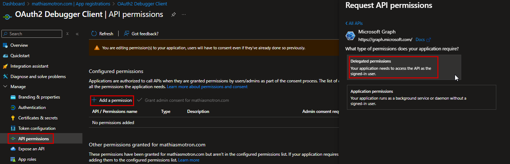

### **2️⃣ Custom scopes**  
Exposed by *your* API.  
You define them under:

```
Expose an API → Add a scope
```

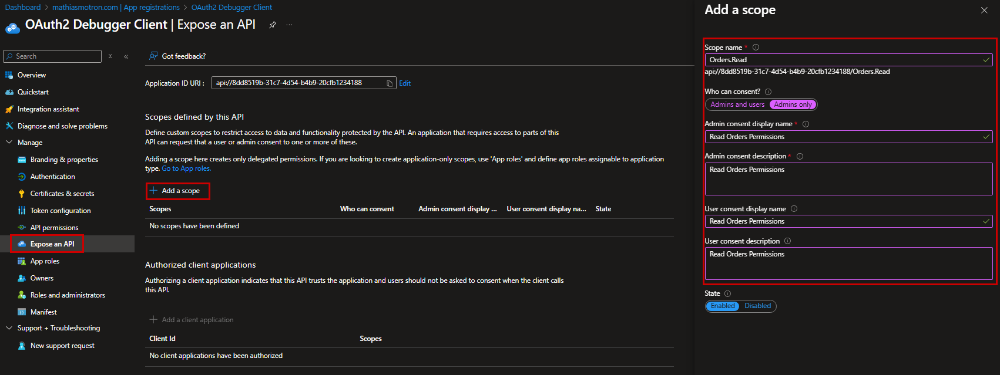

Both behave the same way in tokens.

A scope expresses:

> **“What is this user allowed to do through this application?”**

### Key characteristics
- Requires a **signed-in user**
- Appears in the token as **`scp`**
- Granted via user or admin consent
- Used by:
  - Web apps
  - SPAs
  - Mobile apps
  - Device Code
  - On‑Behalf‑Of (OBO)

### Example custom scope
```json
{
  "oauth2PermissionScopes": [
    {
      "value": "Orders.Read",
      "description": "Orders.Read",
      "id": "11111111-2222-3333-4444-555555555555"
    }
  ]
}
```

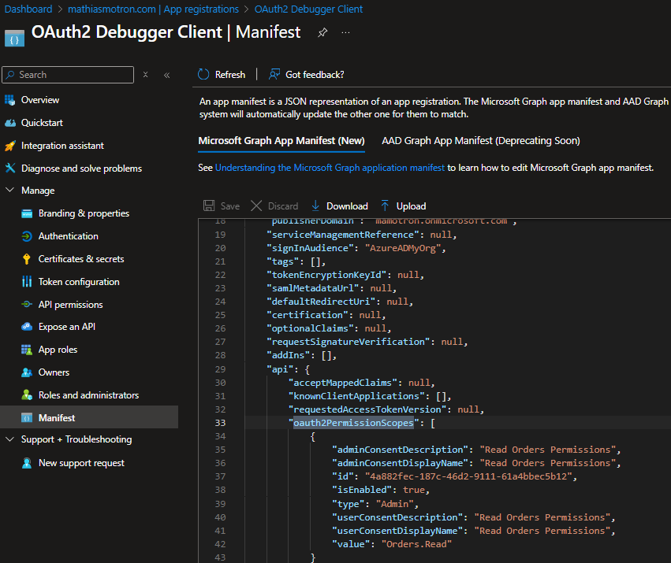

### Example token with delegated permissions
```json
{
  "scp": "Orders.Read",
  "sub": "user-guid",
  "roles": null
}
```

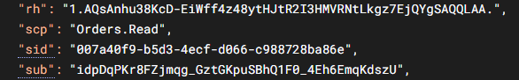

If you see `scp`, a **user is involved**.  
If you see `scp` inside a **client_credentials** token → something is wrong.

---

## 3.2 App Roles (User and Application Permissions)

App Roles are a **unified authorization mechanism**.

You define them under:

```
App roles → Create App Role
```

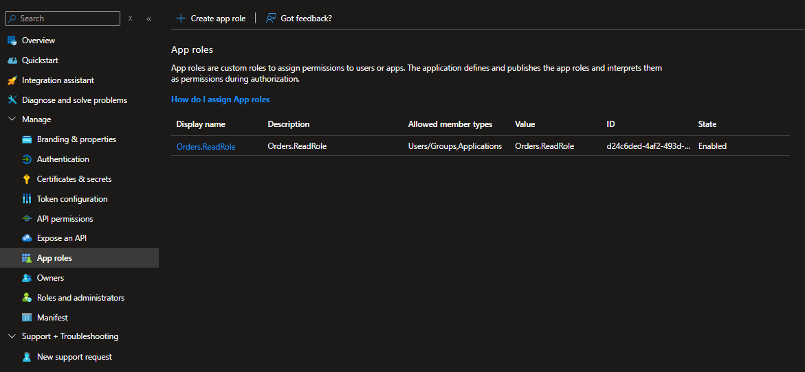

You choose who can receive the role:

```json
"allowedMemberTypes": ["User"]
"allowedMemberTypes": ["Application"]
"allowedMemberTypes": ["User", "Application"]
```

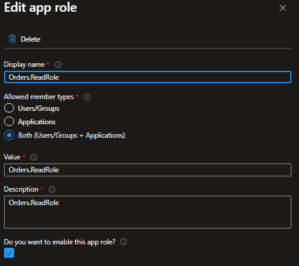

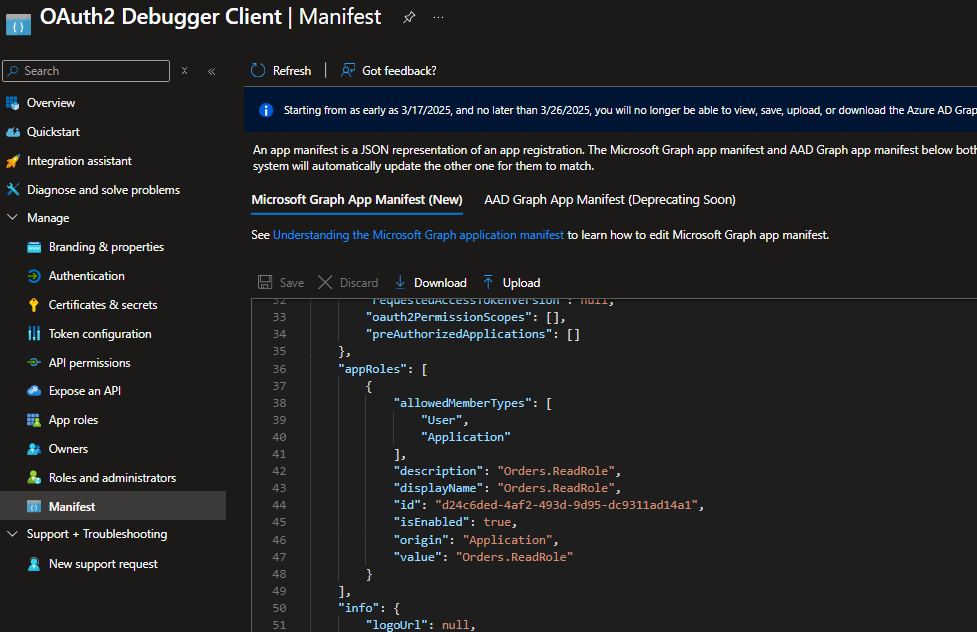

---

### How App Roles behave

---

### **1️⃣ App Role targeting Users**
```json
"allowedMemberTypes": ["User"]
```

Assigned via:

```
Enterprise Application → Users and Groups → Assign Role
```

Token contains:

```json
"roles": ["Dashboard.Read"]
```

Used for user RBAC:
- Reader / Writer / Admin
- Internal line-of-business apps

---

### **2️⃣ App Role targeting Applications**
```json
"allowedMemberTypes": ["Application"]
```

Assigned via:

```
Enterprise Application → Assign role
```

Token contains (client_credentials):

```json
"roles": ["Orders.Read.All"]
```

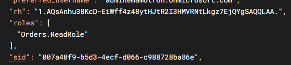

Displayed in the portal as:

> **API Permissions → Application Permissions**

But these are just **App Roles (Application)**.

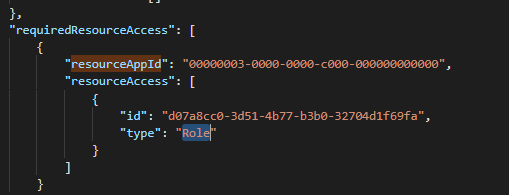

---

### **3️⃣ App Role targeting both**
```json
"allowedMemberTypes": ["User", "Application"]
```

Token (user or daemon):

```json
"roles": ["MyRole"]
```

---

## Summary table

| Role type | allowedMemberTypes | Assigned to | Token claim |
|----------|--------------------|-------------|-------------|
| User role | ["User"] | Users / Groups | `roles` |
| Application role | ["Application"] | Applications | `roles` |
| Hybrid role | ["User", "Application"] | Both | `roles` |

---

## Key takeaways

- **App Roles are the underlying mechanism**  
  “Application Permissions” is just portal wording.

- Scopes = delegated permissions (user only)  
- App Roles = identity-level roles (user or app)

- **Only App Roles produce `roles`**  
- **Only Scopes produce `scp`**

---

## 3.3 Side-by-side comparison

| Feature | Delegated Permissions (Scopes) | App Roles (Application Permissions) |
|--------|--------------------------------|-------------------------------------|
| Used when | A **user** is signing in | An **application** acts alone |
| Flow | Auth Code, Device Code, OBO | Client Credentials |
| Token claim | `scp` | `roles` |
| Defined in | `oauth2PermissionScopes` | `appRoles` |
| Assigned to | Users via consent | Applications via role assignment |
| Portal name | Delegated permissions | Application permissions |
| Works without user? | ❌ No | ✅ Yes |
| Appears in client_credentials? | ❌ Never | ✅ Yes |

---

## Portal labels vs real mechanisms

| Portal Label | Actual Mechanism | Token Claim | Requires User? |
|-------------|------------------|-------------|----------------|
| Delegated Permissions | Scope | `scp` | Yes |
| Application Permissions | App Role (Application) | `roles` | No |
| App roles (Users) | App Role (User) | `roles` | Depends |

---

## Visual model

```
App Registration
 ├── Scopes (Delegated Permissions)
 │      → appear as `scp` in user tokens
 │
 └── App Roles
        ├── User roles (allowedMemberTypes: ["User"])
        │      → appear as `roles` in user tokens
        │
        └── Application roles (allowedMemberTypes: ["Application"])
               → shown as Application Permissions
               → appear as `roles` in daemon tokens
```

---

## 3.5 Why people get confused

Because the portal shows:

- **Expose an API**
  - Scopes
  - App Roles

- **API Permissions**
  - Delegated permissions → scopes
  - Application permissions → App Roles (Application)

Many developers believe there are **three** systems.  
In reality, there are only **two**:

- Scopes (delegated)
- Application permissions (App Roles for applications)

---

## 3.6 Why things break

Common mistake:

- Developer grants a **scope** to a daemon app  
- Admin consents  
- Developer uses **client_credentials**  
- Token contains no `scp` and no `roles`

Because:

- No user → scopes don’t apply  
- No App Role → no roles  

Result: empty token → 401/403.

---

**Example**:

In my lab, I created a daemon app with:

- a **delegated scope** on the API (`api://…/Orders.Read`)
- **no App Role (Application)**

- When I requested a token with a Custom Scope : 

> Token not issued : 

***"error":"invalid_scope","error_description":"AADSTS1002012: The provided value for scope api://166f9909-e82d-492e-9b64-3402e4db3f90/Orders.Read is not valid. Client credential flows must have a scope value with /.default suffixed to the resource identifier***

- When I requested a token with a default Scope : 

> Token issued but no scope : 

```json
{
  "aud": "api://166f9909-e82d-492e-9b64-3402e4f90",
  "iss": "https://sts.windows.net/f0b71b9e-03a7-48f8-967d-fe33e3ccad1c/",
  "iat": 1763386141,
  "nbf": 1763386141,
  "exp": 1763390041,
  "aio": "k2JgYHi17sa358XMz1z9O4qbgA=",
  "appid": "935d9cd2-da80-4d36-b102-cb98ca6b0046",
  "appidacr": "1",
  "idp": "https://sts.windows.net/f0b71b9e-03a7-48f8-967d-fe33e3ccad1c/",
  "oid": "a6da3923-4c00-4f6e-89eb-d5fd328d6",
  "rh": "1.AQsAnhu38KcD-EiWff4z48ytHAmZbJm2Q0AuTbP5ASAQALAA.",
  "sub": "a6da3923-4c00-4f6e-89eb-d5fd1328d6",
  "tid": "f0b71b9e-03a7-48f8-967d-fe33ecad1c",
  "uti": "V5BNkb3--UGI5TWAA",
  "ver": "1.0",
  "xms_ftd": "aL9o7kNAj9kPtOJ3LmV3J_n5gNnKNBmj117iBc3dlZGVuYy1kc21z"
}
```

---

# 4. How Entra ID Decides What Goes Into a Token

When a client requests an **access token**, Entra ID must decide:

- Should the token include **`scp`** (delegated permissions) ?
- Or **`roles`** (application permissions) ?
- Or **nothing at all** ?
- Which identity should the token represent (`sub`) ?
- Which API the token targets (`aud`) ?

This section explains the exact decision logic.

---

## 4.1 The Core Rule
Entra follows one universal rule:

```
If a user is involved → emit scp
If NO user → emit roles
```

Everything else is just a consequence of this rule.

---

## 4.2 When Entra Emits `scp` (Delegated Permissions)
Entra includes **scopes** only when a **signed‑in user** is part of the flow.

User-based flows:
- Authorization Code (+PKCE)
- Device Code
- On-Behalf-Of (OBO)
- ROPC (legacy)

Example request:
```
scope: api://my-api/Orders.Read
```

Access token:
```json
{
  "scp": "Orders.Read",
  "roles": null,
  "sub": "user-guid"
}
```

---

## 4.3 When Entra Emits `roles` (Application Permissions)
If there is **no user**, Entra switches to **application identity mode**.

App-only flows:
- client_credentials
- daemon processes
- background jobs
- API-to-API calls without user

The token contains **App Roles assigned to the calling application**.

```json
{
  "roles": ["Orders.Read.All"],
  "scp": null,
  "sub": "client-app-id"
}
```

---

## 4.4 Why You Rarely See Both
Only **OBO (On-Behalf-Of)** can generate tokens containing user identity + delegated permissions + app metadata.

Even then:
- You still see **`scp`**
- You almost never see **`roles`**

A token with both is extremely rare.

---

## 4.5 How Entra Sets the `aud` Claim
The audience (`aud`) tells your API **who this token is for**.

Examples:
- `"aud": "api://my-api"`
- `"aud": "https://graph.microsoft.com"`

If `aud` does **not** match your API’s App ID URI → **reject the token**.

---

## 4.6 How Entra Sets `sub`, `azp`, and `appid`

### **User flows**
- `sub` = user ID  
- `azp` = client application  
- `appid` = sometimes included depending on token version  

### **App-only flows**
```json
{
  "sub": "client-app-id",
  "azp": "client-app-id",
  "appid": "client-app-id"
}
```
If all three match → token represents an **application**, not a user.

---

## 4.7 Why Tokens Sometimes Look “Empty”
Typical situation:
- API defines scopes
- Admin grants delegated permissions
- Developer requests token using `client_credentials`
- Token contains:

```json
"scp": "",
"roles": null
```

Reason:
- No user → scopes ignored
- No App Role assigned → roles empty

Result → blank token → 401/403

---

## 4.8 Decision Diagram

```
                ┌───────────────┐
                │ Is a user     │
                │ signing in?   │
                └───────┬───────┘
                        │ Yes
                        ▼
                 Emit `scp`
                        │
                        ▼
               Scopes must be consented


                        │ No
                        ▼
                 Emit `roles`
                        │
                        ▼
      App must be assigned an App Role
```

---

## 4.9 Summary
- **User present → `scp`**
- **No user → `roles`**
- **Scopes never appear in client_credentials**
- **Roles appear only if App Roles are assigned**
- **`aud` must match the API**
- **Enterprise Application controls assignment**

---

# 5. Understanding the “API Permissions” Screen
### *Why it looks helpful… and still manages to confuse almost everyone.*

The **API Permissions** blade looks like the place where you understand  
“what an app is allowed to do.”  
But it mixes two very different concepts:

- **Delegated Permissions (Scopes)**  
- **Application Permissions (App Roles assigned to applications)**

This screen shows **consent**, not what actually ends up in tokens.

---

## 5.1 What “API Permissions” Really Shows

You see two categories:

- **Delegated permissions** → Scopes (for user flows)  
- **Application permissions** → App Roles targeting applications (for daemon flows)

Important:  
This does **not** mean these permissions will appear in the next access token.  
It only means the client has permission to *request* them.

---

## 5.2 What Consent Actually Does

### Delegated Permissions
- Used only when a **user** signs in  
- Requires **user** or **admin** consent  
- Only appear as **scp** in tokens

### Application Permissions
- Used only in **client_credentials**  
- Always require **admin consent**  
- Appear as **roles** in tokens **only if** the App Role is also assigned

Consent is *approval*, not *assignment*, and not a token guarantee.

---

## 5.3 The Common Trap: “I See It Here, So It Should Be in the Token”

A typical scenario:

1. You add a **scope** in API Permissions  
2. You give admin consent  
3. You request a token with **client_credentials**  
4. Token contains **no scp**, **no roles**

Expected.

- No user → no **scp**  
- No App Role assignment → no **roles**

**API Permissions ≠ access token contents.**

---

## 5.4 How API Permissions and Assignment Work Together

To get **roles** in an access token, you need:

1. **Admin consent**  
2. **Role assignment** on the **Enterprise Application**  
3. **client_credentials** flow using:
   ```
   scope=api://<api-id>/.default
   ```

Without role assignment, your token will be empty.

**Example**:

- My API:

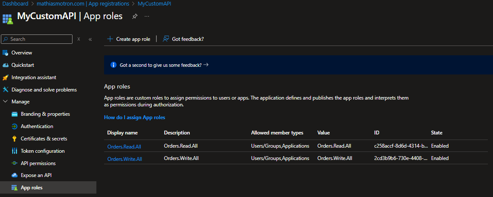

- My Deamon:

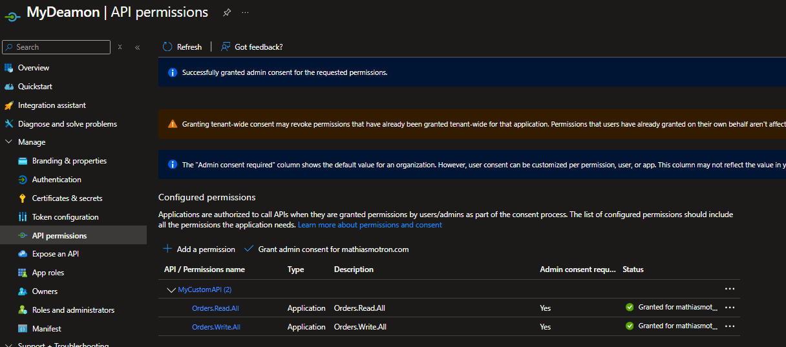

- The Entreprise App has no Assignment for my Deamon:

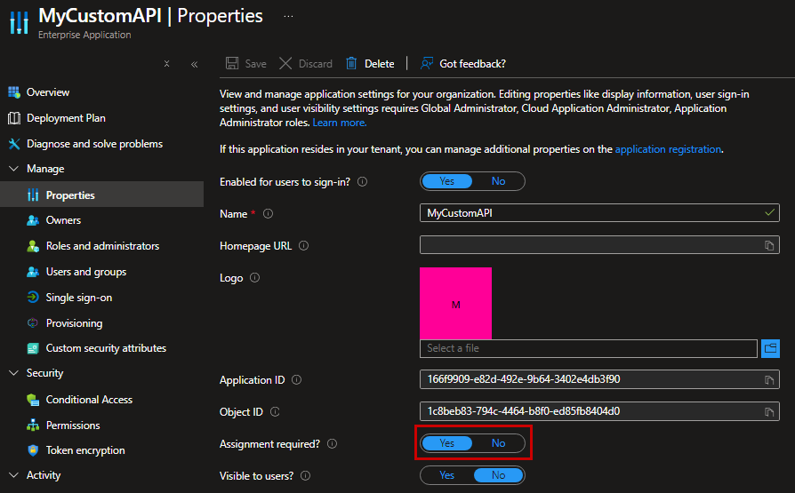

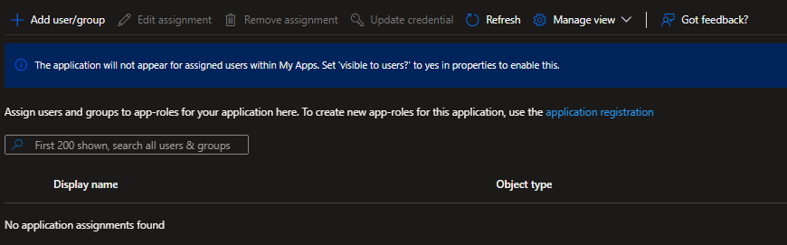

> Result :
error":"invalid_grant","error_description":"AADSTS501051: Application '935d9cd2-da80-4d36-b102-cb98ca6b0046'(MyDeamon) is not assigned to a role for the application 
'api://166f9909-e82d-492e-9b64-3402e4db3f90'(MyCustomAPI)

- Entreprise App with Assignment:

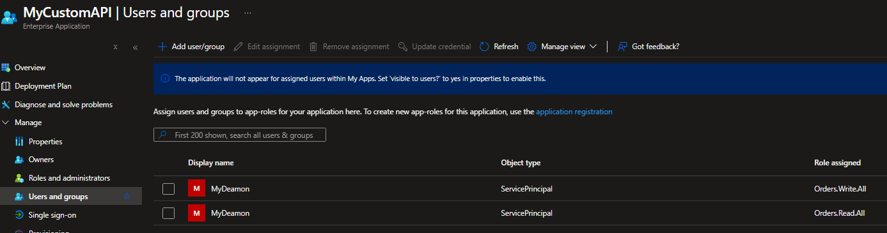

> Roles are presents:

 ```json
{
  "aud": "api://166f9909-e82d-492e-9b64-3402b3f90",
  "iss": "https://sts.windows.net/f0b71b9e-03a7-48f8-967d-fe3ccad1c/",
  "iat": 1763388591,
  "nbf": 1763388591,
  "exp": 1763392491,
  "aio": "k2JgYAhWKcuJPfKZuSaVIeUfAA==",
  "appid": "935d9cd2-da80-4d36-b102-cb98ca646",
  "appidacr": "1",
  "idp": "https://sts.windows.net/f0b71b9e-03a7-48f8-967d-fe33ead1c/",
  "oid": "a6da3923-4c00-4f6e-89eb-d5f1328d6",
  "rh": "1.AQsAnhu38KcD-EiWff4z48ytHAmZbxYt6C5Jm2Q0AuTbP5LAA.",
  "roles": [
    "Orders.Write.All",
    "Orders.Read.All"
  ],
  "sub": "a6da3923-4c00-4f6e-89eb-d5fd82d6",
  "tid": "f0b71b9e-03a7-48f8-967d-fe33e3d1c",
  "uti": "IvZgeBKCwUSfgwOAA",
  "ver": "1.0",
  "xms_ftd": "D6_N52iA44dYr9NpMXjrFib-NK48vAGaF9_O4fEBZXVyb3BdC1kc21z"
}
 ```


---

## 5.5 API Permissions = Catalog, Not Token Preview

Think of this screen as:

> “Here is what the client *may* ask for.”

But what it *actually* gets depends on:

- user vs no user  
- requested scope  
- App Role assignment  
- the `aud`  
- the authentication flow  
- consent  
- Enterprise App configuration

---

## 5.6 Checklist: How to Interpret API Permissions Correctly

### Delegated Permissions
- Are we using a **user flow**?  
- Does the auth request include the **scope**?

### Application Permissions
- Is there an **App Role** for this API?  
- Has the admin **consented**?  
- Has the role been **assigned** to the Enterprise App?

### Inspect the token
- `scp` → user flow  
- `roles` → app-only flow  
- Nothing → wrong flow or missing assignment

---

## 5.7 Rule to Remember

> **API Permissions shows configuration and consent.  
> The access token shows the truth.**

# 6. OAuth2 & Entra ID — The Cheat Sheet

## 6.1 The Only Two Permission Models
```
Delegated Permissions (Scopes)       → user context → scp
Application Permissions (App Roles) → no user      → roles
```

## 6.2 If a User Is Involved → Expect `scp`
User-based flows: Authorization Code, Device Code, OBO, ROPC  
Token example:
```
scp: "<delegated-scope>"
roles: null
sub: <user-id>
```

## 6.3 If NO User → Expect `roles`
App-only flows: client_credentials, daemons, background jobs  
Token example:
```
roles: ["<app-role>"]
scp: null
sub: <client-id>
```

## 6.4 Rules That NEVER Change
User present → scp  
No user → roles  
Scopes never work in app-only flows  
Roles never require a user

## 6.5 Understanding `.default`
`.default` returns all **App Roles (Application)** assigned to the client.  
Never returns scopes.

## 6.6 Read a Token in 5 Seconds
1. Check `aud`  
2. Look for `scp`  
3. Look for `roles`  
4. If neither → misconfiguration

## 6.7 API Validation Checklist
- `aud`
- signature
- expiration
- issuer
- scope/role enforcement

## 6.8 Common Failures
Empty token → wrong flow or missing role  
No `scp` → no user  
No `roles` → role not assigned

## 6.9 Master Mental Model
SCOPES = delegated permissions  
APP ROLES = identity-level permissions  
APPLICATION PERMISSIONS = App Roles (Application)  
API PERMISSIONS = catalog  
TOKEN = source of truth  

User → scp  
No user → roles

# Conclusion  
### *You now fully control how Entra ID handles API permissions.*

By reaching the end of this guide, you’ve gone through the full landscape of how Microsoft Entra ID manages:

- **Scopes (Delegated Permissions)**
- **App Roles (Application Permissions)**
- **Consent & Assignment**
- **Token emission logic (`scp` vs `roles`)**
- **User flows vs daemon flows**
- **Common misconfigurations**
- **Fast troubleshooting patterns**

## Why it matters  
Mastering these concepts allows you to:

- Build clean, predictable OAuth architectures  
- Debug token issues in seconds instead of hours  
- Design APIs that work for both users *and* machines  
- Collaborate with developers, architects, and customers with absolute clarity  
- Avoid 90% of production incidents related to permissions or token contents  

## Mental Model (Final Reminder)

1. **Scopes = delegated permissions (user required)**  
2. **App Roles = identity-level permissions (user or app)**  
3. **Application Permissions = App Roles (Application)**  
4. **API Permissions = catalog, not token preview**  
5. **Token = source of truth**  

If there's a **user** → expect **`scp`**  
If there's **no user** → expect **`roles`**

Everything else flows from these rules.

## Final Thought  
Entra ID isn’t “complicated” — it’s **consistent**.  
Once you understand:

- what you **define** (App Registration)  
- what you **assign** (Enterprise Application)  
- what Entra **emits** (token)  
- what your API **enforces** (authorization)  

…everything makes sense.

