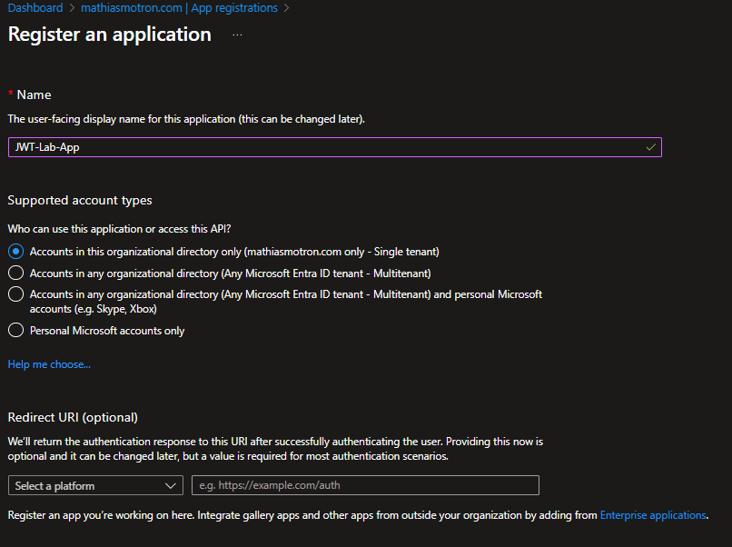
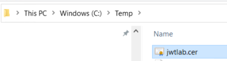
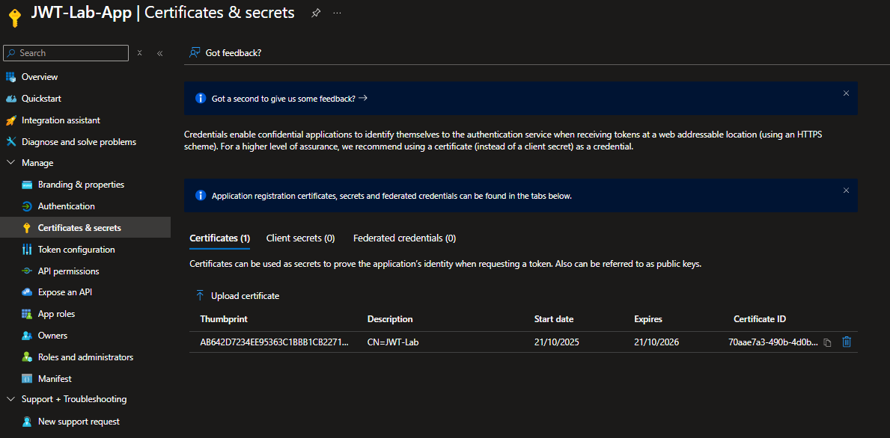
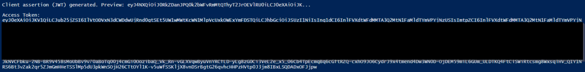

# JWT Authorization Grant for Authentication in Entra ID

## Introduction
Ever felt like sharing secrets is so… 2010? 😎 In the world of modern identity and cloud security, we’re all about **zero trust** and **no secrets**. That’s where the **JWT Authorization Grant** comes in — a slick way to authenticate without passing around those pesky `client_secret` strings like hot potatoes.

Think of it as the **VIP pass** for your app:  
- Signed by your private key.  
- Verified by Entra ID (because trust is earned, not given).  
- No more “oops, leaked secret in GitHub”.  

In this post, we’ll break down:  
✅ What JWT Grant is and why it matters  
✅ How it works under the hood  
✅ How to set it up in your lab

---

## How JWT Grant Works

The JWT Authorization Grant is a way for an application to authenticate without using a shared secret. Instead, it relies on asymmetric cryptography (private/public key pair). Here’s the simple flow, it’s actually pretty elegant:

1. Client App creates a JWT
The JWT includes claims like iss (issuer), sub (subject), aud (audience), exp (expiration), and jti (unique ID).
It is signed with the client’s private key using an algorithm like RS256.

2. Client sends the JWT to Entra ID
The JWT is sent to the token endpoint: https://login.microsoftonline.com/<tenant_id>/oauth2/v2.0/token
Along with grant_type=client_credentials and client_assertion_type=urn:ietf:params:oauth:client-assertion-type:jwt-bearer.

3. Entra ID validates the JWT
It checks the signature using the public key uploaded in the App Registration.
It verifies the claims and ensures the token hasn’t expired.

4. Access Token is issued
If validation succeeds, Entra ID returns an OAuth 2.0 access token.
The client can now call APIs securely without using a client_secret.

**Why this is cool:**
- No shared secret to leak in code repositories.
- Strong authentication using asymmetric keys.
- Ideal for machine-to-machine scenarios and CI/CD pipelines.

---

## Step-by-Step Setup in Entra ID 🛠

### 1. Create an App Registration
- Go to **Azure Portal → Microsoft Entra ID → App registrations → New registration**.
- Set:
  - **Name**: `JWT-Lab-App`
  - **Supported account types**: Single tenant
- Click **Register**.
- Note down:
  - **Client ID**
  - **Tenant ID**



### 2. Create certificate and Upload Your Public Key

- Generate a self-signed certificate with PowerShell:
```powershell
# ===============================
# Create a CSP certificate for RS256 signing
# ===============================
# This certificate uses the "Microsoft Enhanced RSA and AES Cryptographic Provider" (CSP),
# which exposes a RSACryptoServiceProvider PrivateKey compatible with Windows PowerShell 5.1.

$subjectName = "CN=JWT-Lab"
$exportPath  = "C:\temp\jwtlab.cer"

# Create a self-signed RSA 2048 certificate in CurrentUser\My with SHA256 and exportable private key
$cert = New-SelfSignedCertificate `
  -Subject $subjectName `
  -CertStoreLocation "Cert:\CurrentUser\My" `
  -KeyLength 2048 `
  -KeySpec Signature `
  -KeyExportPolicy Exportable `
  -HashAlgorithm sha256 `
  -Provider "Microsoft Enhanced RSA and AES Cryptographic Provider"

# Export the public certificate (.cer) for uploading to the App Registration
Export-Certificate -Cert $cert -FilePath $exportPath | Out-Null

Write-Host "Certificate created."
Write-Host "  Subject    : $subjectName"
Write-Host "  Thumbprint : $($cert.Thumbprint)"
Write-Host "  Public CER : $exportPath"

# Optional: quick sanity checks
$loaded = Get-Item "Cert:\CurrentUser\My\$($cert.Thumbprint)"
Write-Host "HasPrivateKey: $($loaded.HasPrivateKey)"
if ($loaded.PrivateKey) {
    Write-Host "Provider     : $($loaded.PrivateKey.CspKeyContainerInfo.ProviderName)"
}
```


- Navigate to **Certificates & Secrets** in your App Registration.
- Click **Upload certificate** and add your `.cer` file.



### 3. Build the JWT

Required claims:

```powershell
{
  "iss": "<Client ID>",
  "sub": "<Client ID>",
  "aud": "https://login.microsoftonline.com/<tenant_id>/v2.0",
  "exp": <timestamp>,
  "jti": "<unique-id>"
}
```

- Sign with your private key using RS256.


### 4. Request the Token

Send a POST request to the token endpoint:

POST https://login.microsoftonline.com/<tenant_id>/oauth2/v2.0/token
Content-Type: application/x-www-form-urlencoded

grant_type=client_credentials
client_assertion_type=urn:ietf:params:oauth:client-assertion-type:jwt-bearer
client_assertion=<signed-JWT>
scope=https://graph.microsoft.com/.default

### 5. PowerShell Example

- Generate JWT
```powershell
# ===============================
# Variables - fill with your values
# ===============================
$TenantId   = "<YOUR-TENANT-ID>"           # e.g., 11111111-2222-3333-4444-555555555555
$ClientId   = "<YOUR-CLIENT-ID>"           # App (client) ID from your App Registration
$Thumbprint = "<YOUR-CERT-THUMBPRINT>"     # Thumbprint of the cert created in Script 1
$Scope      = "https://graph.microsoft.com/.default"

# ===============================
# Utilities: Base64Url helpers
# ===============================
function ConvertTo-Base64Url {
    param([byte[]]$Bytes)
    $b64 = [Convert]::ToBase64String($Bytes)
    ($b64.TrimEnd('=')) -replace '\+','-' -replace '/','_'
}
function ConvertTo-Base64UrlUtf8 {
    param([string]$Text)
    ConvertTo-Base64Url ([System.Text.Encoding]::UTF8.GetBytes($Text))
}

# Compute x5t (SHA-1) and x5t#S256 (SHA-256) from the certificate raw bytes
function Get-X5T {
    param([System.Security.Cryptography.X509Certificates.X509Certificate2]$Cert)
    $sha1 = [System.Security.Cryptography.SHA1]::Create()
    $hash = $sha1.ComputeHash($Cert.GetRawCertData())
    ConvertTo-Base64Url $hash
}
function Get-X5T256 {
    param([System.Security.Cryptography.X509Certificates.X509Certificate2]$Cert)
    $sha256 = [System.Security.Cryptography.SHA256]::Create()
    $hash = $sha256.ComputeHash($Cert.GetRawCertData())
    ConvertTo-Base64Url $hash
}

# ===============================
# Load certificate (must have private key)
# ===============================
$certPath = "Cert:\CurrentUser\My\$Thumbprint"
try {
    $cert = Get-Item $certPath
} catch {
    throw "Certificate not found at $certPath"
}
if (-not $cert.HasPrivateKey) {
    throw "This certificate does not have a private key. Recreate it with Script 1 (CSP provider)."
}

# RSACryptoServiceProvider expected for CSP certs
$rsa = $cert.PrivateKey
if ($null -eq $rsa) {
    throw "PrivateKey is null. Ensure the certificate was created with CSP provider:
  Microsoft Enhanced RSA and AES Cryptographic Provider."
}

# ===============================
# Build JWT header & payload
# ===============================
# IMPORTANT: 'aud' typically matches the v2 token endpoint URL
$tokenEndpoint = "https://login.microsoftonline.com/$TenantId/oauth2/v2.0/token"

# Compute certificate identifiers for the JWT header
$x5t     = Get-X5T    -Cert $cert        # base64url of SHA-1 thumbprint
$x5tS256 = Get-X5T256 -Cert $cert        # base64url of SHA-256 thumbprint
$kid     = ($cert.Thumbprint -replace '\s','').ToUpper()  # hex, no spaces

# Include at least one of: x5t, x5t#S256, kid. We add all three for robustness.
$headerObj = @{
    alg     = "RS256"
    typ     = "JWT"
    x5t     = $x5t
    "x5t#S256" = $x5tS256
    kid     = $kid
}

# Compute 'exp' as epoch seconds (now + 10 minutes)
$epochStart = [datetime]"1970-01-01T00:00:00Z"
$exp = [math]::Round(( (Get-Date).ToUniversalTime().AddMinutes(10) - $epochStart ).TotalSeconds)

$payloadObj = @{
    iss = $ClientId
    sub = $ClientId
    aud = $tokenEndpoint
    exp = $exp
    jti = [guid]::NewGuid().ToString()
}

$headerJson  = ($headerObj  | ConvertTo-Json -Compress)
$payloadJson = ($payloadObj | ConvertTo-Json -Compress)

$headerB64  = ConvertTo-Base64UrlUtf8 $headerJson
$payloadB64 = ConvertTo-Base64UrlUtf8 $payloadJson
$unsigned   = "$headerB64.$payloadB64"

# ===============================
# Sign using RS256 (RSA + SHA256)
# ===============================
$bytesToSign = [System.Text.Encoding]::UTF8.GetBytes($unsigned)
try {
    # RSACryptoServiceProvider supports SignData(data, "SHA256")
    $signatureBytes = $rsa.SignData($bytesToSign, "SHA256")
} catch {
    throw "Signing failed. Likely wrong provider or SHA256 not supported.
Recreate the certificate with Script 1 (CSP provider 'Microsoft Enhanced RSA and AES Cryptographic Provider')."
}

$signatureB64 = ConvertTo-Base64Url $signatureBytes
$jwt = "$unsigned.$signatureB64"

Write-Host "`nClient assertion (JWT) generated. Preview: $($jwt.Substring(0,60))..."

# ===============================
# Request the access token
# ===============================
$body = @{
    grant_type            = "client_credentials"
    client_assertion_type = "urn:ietf:params:oauth:client-assertion-type:jwt-bearer"
    client_assertion      = $jwt
    scope                 = $Scope
}

try {
    $response = Invoke-RestMethod -Uri $tokenEndpoint -Method Post -Body $body -ContentType "application/x-www-form-urlencoded"
    Write-Host "`nAccess Token:"
    $response.access_token
} catch {
    Write-Host "`nHTTP error while requesting token: $($_.Exception.Message)"
    if ($_.Exception.Response -and $_.Exception.Response.ContentLength -gt 0) {
        $reader = New-Object System.IO.StreamReader($_.Exception.Response.GetResponseStream())
        $errorBody = $reader.ReadToEnd()
        Write-Host "Response body:`n$errorBody"
    }
    throw
}
```

- Check that you have an Access Token from Entra ID :



---

## Wrap-Up

So, what did we learn today?

- **JWT Authorization Grant** = No more shared secrets, hello asymmetric crypto!
- **Private Key JWT** is perfect for machine-to-machine scenarios and CI/CD pipelines.
- You can configure it easily in **Microsoft Entra ID** with:
  - App Registration
  - Certificate upload
  - JWT generation
  - Token request

### Useful Links 🔗
- [RFC 7523: JSON Web Token (JWT) Profile for OAuth 2.0](https://www.rfc-editor.org/rfc/rfc7523)
- https://learn.microsoft.com/azure/active-directory/develop/
- https://learn.microsoft.com/azure/active-directory/develop/v2-oauth2-client-creds-grant-flow

