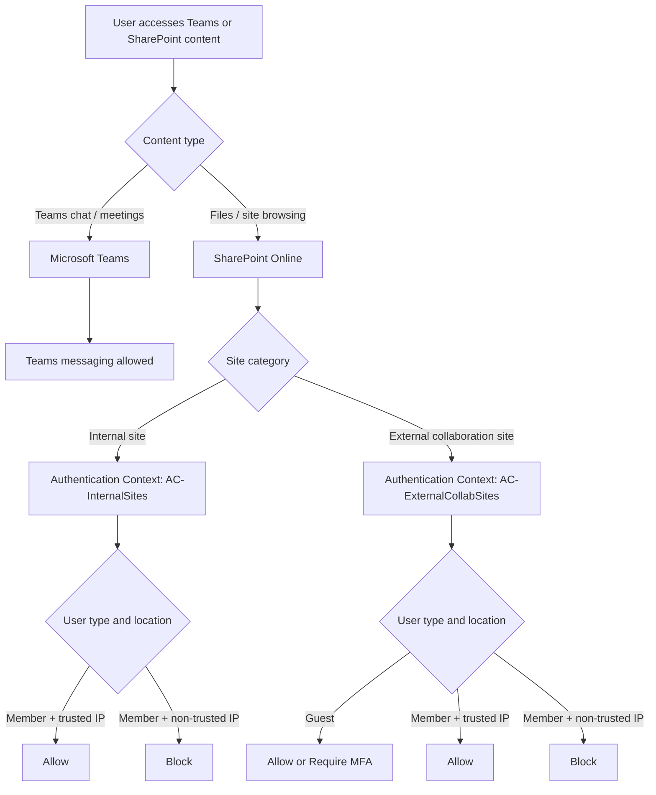

## SharePoint Online Conditional Access Use Case: Internal and External Collaboration

If you've ever tried to secure SharePoint Online and then watched Teams file access break as collateral damage... you've already hit the real problem. Teams chat and Teams files do not follow the same control path, and a single blunt policy can't express what most organizations actually need.

Microsoft gives you several building blocks:

- Authentication Context
- Restricted Access Control
- App-Enforced Restrictions
- Defender for Cloud Apps
- SharePoint and Teams sharing settings

The difficult part is not knowing those features exist. The difficult part is combining them so they actually match a real collaboration matrix.

> **📌 Scope**: this article covers one specific design scenario, not every SharePoint and Teams Conditional Access pattern. The design choices here are driven by a concrete set of business requirements described in section 1.

> **TL;DR**: the target scenarios are achievable, but not with a simple model like "block internal sites, allow external sites". The clean design is based on **site-level Authentication Context**, **separate Conditional Access policies for members and guests**, and a **clear internal vs external collaboration model** in SharePoint and Teams.
>
> ⚠️ Authentication Context is a **narrowly-scoped** control with **substantial client-compatibility limitations** (OneDrive sync, Office Scripts, Outlook, Power Platform, mobile apps, etc.). Read **[Section 8 — Limitations](#8-⚠️-limitations-known-issues--operational-considerations)** before tagging any production site.

---

## 1. 🎯 The Target Scenario

The objective is a mix of business enablement and security controls. The table below describes the expected behavior for each user type, location, and workload.

> The 🚫 cells on the "Internal user / Non-trusted IP" rows for external files and sites are the tricky ones — they're exactly what a naive "block internal / allow external" design gets wrong, and what this architecture is specifically built to address.

| User type | IP | Teams Chat (1:1, Group, Meeting) | Internal Team — Chat | External Team — Chat | Internal Team — Files | External Team — Files | Internal SPO Site | External SPO Site |
|---|---|---|---|---|---|---|---|---|
| Internal user | Trusted IP | ✅ | ✅ | ✅ | ✅ | ✅ | ✅ | ✅ |
| Internal user | Non-trusted IP | ✅ | ✅ | ✅ | 🚫 | 🚫 | 🚫 | 🚫 |
| Guest (external) | Non-trusted IP | ✅ | 🚫 | ✅ | 🚫 | ✅ | 🚫 | ✅ |

The key design constraints that follow from this table:

- **Teams chat and meetings** must remain accessible to all users regardless of IP or user type.
- **Teams chat behavior and Teams file behavior must be treated differently** — they do not share the same access control path.
- **Guests must be able to access external collaboration spaces** even from non-trusted IPs.
- **Internal users on non-trusted IPs must be blocked from file access**, including on external collaboration spaces — this is the scenario the basic design misses.

The last two points together are the hardest to express correctly. This is what drives the architecture.

> ⚠️ A Conditional Access policy targeting SharePoint Online does not just affect direct site browsing. It also affects every SharePoint-backed operation in Teams — files tab, channel documents, shared files in chat.

| Experience | Back-end service |
|---|---|
| Teams chat / meetings / messaging | Microsoft Teams |
| Teams files tab / channel documents / shared files | SharePoint Online |
| Direct SharePoint site browsing | SharePoint Online |

---

## 2. 🤔 Why This Gets Complicated Quickly

Here's the thing most people don't realize until a helpdesk ticket lands in their inbox:

- Teams files are stored in SharePoint Online.
- The Files tab in Teams is a SharePoint access path.
- A Conditional Access policy targeting **Office 365 SharePoint Online** applies to:
  - direct SharePoint browsing,
  - Teams channel files,
  - files shared in Teams chats,
  - and most file operations behind Teams.

So a blunt rule like "block SharePoint from untrusted IPs" also silently blocks the SharePoint-backed parts of Teams. Cue the confused users and the helpdesk flood. 🎉 (not the good kind)

That is why the real question is not "how do I secure SharePoint?" but rather:

> How do I secure SharePoint-backed content differently depending on the site type and the user type, without breaking Teams messaging?

---

## 3. 🧰 Control Options and Their Limits

Before jumping into the recommended design, let's be honest about what each tool actually does — and where it falls short.

### 3.1 Authentication Context

**What it does**

- Applies Conditional Access at the **site level**.
- Lets you associate a dedicated CA policy with a specific SharePoint site.

**What it is good at**

- Differentiating internal sites from external collaboration sites.
- Applying different policies to members and guests on the same site.
- Protecting only the sites that need different behavior — without touching everything else.

**What it does not solve alone**

- It is not a tenant-wide baseline.
- It must be assigned explicitly to the relevant sites.

**Verdict** 🏆

This is the key control for this scenario. Everything else builds around it — but **read [Section 8](#8-⚠️-limitations-known-issues--operational-considerations) before assuming it's free of side effects**. Tagging a site is a breaking change for any client that does not handle claims challenges.

---

### 3.2 Restricted Access Control

**What it does**

- Restricts access to a SharePoint site to a set of allowed security groups.

**What it is good at**

- Hardening specific sites with a strict allow-list model.

**What it does not solve well**

- It cannot express: "block internal members from untrusted IP, but still let guests in."

**Verdict** 🔧

Useful as an additional hardening layer, but not the right tool to drive this scenario.

---

### 3.3 App-Enforced Restrictions

Also known as **AER** in some field conversations. Probably the most underrated control of the lot — and the one most teams should reach for *before* Authentication Context.

**What it does**

A CA session control that tells SharePoint Online *"this session is restricted"* via a token claim. SPO then applies a degraded experience defined separately in the SPO Admin Center (or per-site via PowerShell).

**Plumbing**

1. A CA policy targets **Office 365 SharePoint Online** with a condition (typically *unmanaged devices* or *untrusted networks*)
2. Session control = **"Use app-enforced restrictions"** → injects a specific claim into the SPO token
3. SPO reads the claim and applies the mode defined in **SPO Admin Center → Policies → Access control → Unmanaged devices**:
   - `Allow full access` (no-op)
   - `Allow limited, web-only access` (browser only — no download, no sync, no print, no Office desktop)
   - `Block access`
4. Per-site override available via PowerShell:

```powershell
Set-SPOSite -Identity https://contoso.sharepoint.com/sites/<site> `
    -ConditionalAccessPolicy AllowLimitedAccess   # or BlockAccess / AllowFullAccess
```

**What it is good at**

- **No claims challenge, no step-up ceremony, no token cache surgery** — SPO honors the claim natively. Works on every client (browser, Office desktop, Teams, sync) without breaking anything: each client either adapts (browser → web-only UI) or refuses the operation cleanly (sync → "this site requires browser access").
- **Establishing a tenant-wide baseline** with minimal per-site configuration.
- **Reducing exfiltration risk without a hard block**: users can still consult documents from untrusted contexts, but cannot extract them (no sync, no download, no print, no Office desktop open).
- **Sidesteps every limitation listed in [Section 8](#8-⚠️-limitations-known-issues--operational-considerations)** — because it does not rely on the claims-challenge protocol.

**What it does not solve**

- Cannot differentiate **member vs guest on the same site** — the session control applies to whoever matches the CA conditions. If you need "block internal members from untrusted, allow guests on the same site", AER cannot express that. **This is the one scenario where Authentication Context is genuinely irreplaceable**.
- Per-site granularity is **3-state only** (`AllowFullAccess` / `AllowLimitedAccess` / `BlockAccess`) — no nuance beyond that.
- `AllowLimitedAccess` mode disables OneDrive sync on the affected scope — by design, but worth communicating to users.

**Verdict** 🛡️

- For **internal sites where you don't need guest differentiation** → AER (`BlockAccess` or `AllowLimitedAccess`) is **simpler, cleaner, and more robust than Authentication Context**. Reach for it first.
- For **external collaboration sites where the member-vs-guest split is the whole point** → AER cannot do the job; this is where Authentication Context earns its complexity.
- A common, sensible hybrid: **AER on internal sites, Authentication Context on external collaboration sites**.

---

### 3.4 Defender for Cloud Apps

Also referred to as **MDCA** (or its older name, MCAS — Microsoft Cloud App Security). The most feature-rich of the lot, and the most often misunderstood.

**What it does**

MDCA Conditional Access App Control integrates with Entra Conditional Access to enforce **two distinct families of policies**:

| Policy type | What it does | Browser sessions | Native clients (sync, Office desktop, Teams desktop, mobile) |
|---|---|---|---|
| **Access Policy** | Allow / Block / Test decision at sign-in, filterable by user, group, app, IP, location, device, activity, URL pattern | ✅ | ✅ **Yes** — the `Client app = Mobile and desktop` filter applies the same access logic to native client sessions |
| **Session Policy** | In-session controls: block download, watermark, block copy/paste, label-aware DLP, real-time inspection of in-flight content | ✅ | ❌ Requires HTTP rewrite through the MDCA reverse proxy (`*.mcas.ms`) — impossible on native encrypted client traffic |

**Common misconception**: *"MDCA is browser-only."* False — that limitation applies **only to session policies**. Access policies cover native clients too, via the MDCA ↔ CA integration at sign-in.

**What it is good at**

- **Session policies** (the unique value): the only Microsoft control plane that can do *"view in browser allowed, download blocked"*, watermarking, label-aware in-session DLP, copy/paste blocking, real-time activity inspection. None of CA, Auth Context, or AER can do these.
- **Activity-level filtering**: policies can target individual actions (download, upload, share externally, print) rather than just "access to the app".
- **Forensic visibility** at session level: who did what, when, from where, on which file.

**What it does not solve best**

- For **access/block decisions only**, MDCA access policies are functionally equivalent to plain CA access policies with the same conditions — so no added value, just an extra plane of control to operate and correlate during troubleshooting.
- **URL pattern filtering** to distinguish internal vs external sites is more fragile than SPO `ConditionalAccessPolicy` tagging — it depends on site naming conventions and breaks silently if a site is misnamed or created via self-service.
- **Operational complexity**: a third console alongside Entra CA and SPO Admin. Three places to look when something is denied, three policy languages to keep aligned.
- **Reverse proxy edge cases** (browser sessions only): some SPFx web parts, custom iframes/embeds, very large downloads, and third-party app catalog scenarios can break under proxy rewriting. Known issues are documented by Microsoft.

**Verdict** 🔬

Pick MDCA when the requirement is **beyond access/block** — specifically when you need session-level enforcement (view-only with no download, watermarking, label-aware DLP, copy/paste blocking, activity forensics). For pure access/block matrices, CA + AER + Authentication Context cover the ground with fewer moving parts.

A common, sound combination:

- **CA + AER + Authentication Context** for the access decision (who can reach what, from where)
- **MDCA session policies** on top for sensitive sites where session behavior matters (e.g. external collaboration sites: allow guests to view but block downloads to unmanaged devices)

---

### 3.5 SharePoint and Teams Sharing Settings

**What they do**

- Define whether a site accepts guests.
- Define whether a Team allows guest collaboration.
- Separate internal-only spaces from external collaboration spaces.

**What they are good at**

- Establishing the collaboration model cleanly.
- Preventing accidental mixing of internal and partner-facing spaces.

**What they do not solve alone**

- They do not enforce trusted vs non-trusted location logic by themselves.

**Verdict** 🧱

Mandatory foundation — you can't skip this step. But sharing settings alone won't get you to the target matrix.

---

## 4. 🕳️ Why the Basic "Block Internal / Allow External" Design Leaves Gaps

This is where many initial designs fall short — and it's not obvious until you test the edge cases.

A typical first attempt looks like this:

- internal SharePoint sites -> `ConditionalAccessPolicy BlockAccess`
- external SharePoint sites -> `ConditionalAccessPolicy AllowFullAccess`
- internal Teams -> no guests
- external Teams -> guests allowed
- plus a global CA baseline with App-Enforced Restrictions

At first glance, it looks reasonable. In reality, it leaves a gap that matters.

Why? Because external collaboration sites are configured for **full access**. That means:

- Teams external file access still relies on SharePoint.
- An internal member who is authorized on that external collaboration site can still access it — because the site says `AllowFullAccess`.

So the design cannot express this cleanly:

- guest can access the external site ✅
- internal member on non-trusted IP must be blocked from that same site 🚫

This is not a platform limitation. It is a limitation of the chosen architecture.

---

## 5. 🏗️ Recommended Architecture

The cleanest model combines a clear collaboration classification with Authentication Context and separate CA policies for members and guests. Here's how it breaks down.



### 🗂️ Layer 1 - Internal vs External Collaboration Model

Before any Conditional Access, you need a clean separation. Separate your sites and Teams into two categories:

- **Internal spaces**
  - no guest sharing
  - no guest access to Teams
- **External collaboration spaces**
  - guests allowed
  - sharing limited to the intended collaboration model

This is the collaboration foundation.

### 🔑 Layer 2 - Authentication Context by Site Type

This is the key move. Use Authentication Context on the sites that need differentiated Conditional Access — instead of relying on a single tenant-wide SharePoint behavior.

Suggested naming:

- `AC-InternalSites`
- `AC-ExternalCollabSites`

> ⚠️ Tagging a site is **not a neutral operation**. The moment the tag is applied, every client must understand the claims-challenge flow; unsupported clients break immediately, regardless of the CA policy state. See **[Section 8](#8-⚠️-limitations-known-issues--operational-considerations)** for the full impact analysis.

### 🔐 Layer 3 - Separate CA Policies for Members and Guests

This is where the matrix becomes expressible. Three policies, clearly separated by user type.

#### Policy A - Internal members on internal sites

- Target resource: Authentication Context `AC-InternalSites`
- Users: internal members
- Condition: untrusted locations
- Grant: block

Result:

- internal users on non-trusted IPs cannot access internal SharePoint sites,
- internal Teams file access tied to those sites is also blocked,
- Teams chat and meetings remain unaffected.

#### Policy B - Internal members on external collaboration sites

- Target resource: Authentication Context `AC-ExternalCollabSites`
- Users: internal members only
- Condition: untrusted locations
- Grant: block

Result:

- internal users on non-trusted IPs are blocked from external collaboration files and sites.

#### Policy C - Guests allowed on external collaboration sites

- Target resource: Authentication Context `AC-ExternalCollabSites`
- Users: guests and external users
- **No location condition** — guests must be allowed regardless of IP
- Grant: allow, optionally with MFA

> ⚠️ Do not add an IP-based location condition to this policy. The whole point is that guests can access external collaboration spaces even from non-trusted IPs. If you restrict Policy C to trusted locations, you break the guest scenario entirely.

Result:

- guests can still access the external collaboration spaces they were invited to,
- while internal non-trusted users are blocked from the same site by Policy B.

> ⚠️ **Design constraint: Authentication Context is step-up, not step-down**
>
> Authentication Context lets you enforce stricter controls on selected sites, but it cannot relax a stricter tenant-wide SharePoint baseline for a specific site.
>
> If your baseline CA policy requires compliant or hybrid-joined devices for SharePoint Online, you can't use Authentication Context or Defender for Cloud Apps session controls to make a single site accessible from unmanaged devices.
>
> To allow one less-restricted site, you must redesign the model: broader baseline + stricter targeted controls on other sites.

### 🛡️ Optional Layer 4 - App-Enforced Restrictions as Baseline

If you want a web-only posture for generic SharePoint access from untrusted locations, App-Enforced Restrictions still fit well here — as a baseline safety net, not the main control.

### 🔬 Optional Layer 5 - Defender for Cloud Apps

Add this layer only if you also need advanced session behavior like:

- browser view allowed but download blocked,
- watermarking,
- label-based controls.

---

## 6. ✅ Scenario Mapping

This section is not the step-by-step configuration procedure. It is the control matrix that maps each business scenario to the mechanism that enforces it. The actual implementation steps are in Section 7.

Let's map the architecture back to the target matrix and verify it covers everything:

| No. | Scenario | Expected result | Main control | CA implementation detail |
|---|---|---|---|---|
| 1 | Internal user on trusted IP -> internal Teams chat | ✅ | Teams native behavior | No SharePoint CA involved. Teams messaging is not targeted by the SharePoint Authentication Context policies. |
| 2 | Internal user on trusted IP -> internal Teams files | ✅ | Normal SharePoint access | `AC-InternalSites` is present on the site, but CA Policy A excludes trusted locations, so access is allowed. |
| 3 | Internal user on non-trusted IP -> internal Teams chat | ✅ | Not targeted by SharePoint CA | No SharePoint CA involved. Teams chat stays outside the SharePoint access control path. |
| 4 | Internal user on non-trusted IP -> internal Teams files | 🚫 | Authentication Context + CA Policy A | The underlying SharePoint site is tagged with `AC-InternalSites`. CA Policy A targets internal members on untrusted locations and blocks access. |
| 5 | Internal user on non-trusted IP -> internal SharePoint site | 🚫 | Authentication Context + CA Policy A | Same logic as row 4: `AC-InternalSites` on the site + CA Policy A block for internal members outside trusted IPs. |
| 6 | Internal user on non-trusted IP -> external Teams files | 🚫 | Authentication Context + CA Policy B | The external collaboration site is tagged with `AC-ExternalCollabSites`. CA Policy B targets internal members on untrusted locations and blocks file access. |
| 7 | Internal user on non-trusted IP -> external SharePoint site | 🚫 | Authentication Context + CA Policy B | Same logic as row 6: `AC-ExternalCollabSites` + CA Policy B block for internal members outside trusted IPs. |
| 8 | Guest -> internal Teams chat | 🚫 | Teams guest access disabled on internal Teams (`AllowToAddGuest $false`) | No Conditional Access policy is needed. The guest cannot be added to the internal Team in the first place. |
| 9 | Guest -> internal Teams files | 🚫 | SPO sharing disabled on internal sites (`SharingCapability Disabled`) | No Conditional Access policy is needed. The internal SharePoint site does not allow guest sharing, so the guest never reaches the Authentication Context challenge. |
| 10 | Guest -> internal SharePoint site | 🚫 | SPO sharing disabled on internal sites (`SharingCapability Disabled`) | Same logic as row 9: the guest has no valid sharing path to the site, so access is blocked before CA evaluation. |
| 11 | Guest on non-trusted IP -> external Teams chat | ✅ | Guest enabled on external Teams | No SharePoint CA involved for the chat workload. Guest access is allowed at the Team configuration level. |
| 12 | Guest on non-trusted IP -> external Teams files | ✅ | CA Policy C on `AC-ExternalCollabSites` | The site is tagged with `AC-ExternalCollabSites`. CA Policy C targets guests and external users and deliberately has no location condition, so guest access is allowed. |
| 13 | Guest on non-trusted IP -> external SharePoint site | ✅ | CA Policy C on `AC-ExternalCollabSites` | Same logic as row 12: `AC-ExternalCollabSites` + CA Policy C allow for guests regardless of IP, optionally with MFA. |

> 💡 **Rows 8–10 (guest blocking on internal content)** are not enforced by Conditional Access policies at all. They're handled entirely by the collaboration model settings in Step 1. If a guest has no Team membership and no sharing permission on the site, they simply can't reach the Authentication Context challenge — no CA policy needed.

This is exactly the full scenario matrix that the simpler `AllowFullAccess` model cannot express.

---

## 7. 🛠️ Configuration Walkthrough

### ⚙️ Choice Point: All Sites or Selective Protection?

This architecture can be deployed two ways:

1. **All-sites approach**: Mark every SharePoint site with an Authentication Context (either `AC-InternalSites` or `AC-ExternalCollabSites`). This ensures every site is governed by one of the three policies (A, B, or C).
2. **Selective approach**: Mark only sensitive or collaboration-critical sites. Other sites remain untagged and inherit a tenant-wide baseline — which you must define separately (e.g., MFA for all users, or App-Enforced Restrictions for web-only access).

Choose based on your governance model. The selective approach is lighter but requires you to establish a clear baseline for unmarked sites.

---

### Step 1 - Classify Sites and Teams 🗂️

Start by creating two clear categories:

- Internal-only SharePoint and Teams
- External collaboration SharePoint and Teams

Recommended settings:

| Workload | Internal spaces | External collaboration spaces |
|---|---|---|
| SharePoint SharingCapability | `Disabled` | `ExistingExternalUserSharingOnly` or according to policy |
| Teams guest access | `AllowToAddGuest $false` | `AllowToAddGuest $true` |

The exact sharing choice depends on the governance model, but the separation must be explicit.

To configure Teams guest access per Team:

```powershell
# Disable guest access on an internal Team
Set-Team -GroupId <InternalTeamGroupId> -AllowToAddGuest $false

# Enable guest access on an external collaboration Team
Set-Team -GroupId <ExternalTeamGroupId> -AllowToAddGuest $true
```

To configure SharePoint sharing at the site level:

```powershell
Connect-SPOService -Url https://contoso-admin.sharepoint.com

# Internal site - no external sharing
Set-SPOSite -Identity https://contoso.sharepoint.com/sites/InternalProject `
    -SharingCapability Disabled

# External collaboration site - existing guests only
Set-SPOSite -Identity https://contoso.sharepoint.com/sites/PartnerProject `
    -SharingCapability ExistingExternalUserSharingOnly
```

### Step 2 - Create Authentication Contexts 🔑

Create at least two contexts in Entra ID:

- `AC-InternalSites`
- `AC-ExternalCollabSites`

In Entra ID:

1. Go to **Protection** -> **Conditional Access** -> **Authentication Contexts**
2. Create the contexts
3. Record their IDs

### Step 3 - Assign Authentication Contexts to Sites 🏷️

Tag each site with the appropriate context:

```powershell
Connect-SPOService -Url https://contoso-admin.sharepoint.com

# Internal site
Set-SPOSite -Identity https://contoso.sharepoint.com/sites/InternalProject `
    -ConditionalAccessPolicy AuthenticationContext `
    -AuthenticationContextName "AC-InternalSites"

# External collaboration site
Set-SPOSite -Identity https://contoso.sharepoint.com/sites/PartnerProject `
    -ConditionalAccessPolicy AuthenticationContext `
    -AuthenticationContextName "AC-ExternalCollabSites"
```

You can also use sensitivity labels with Sites and Groups scope if you prefer a label-driven approach.

#### 🔎 Inventory: list all sites currently tagged with an Authentication Context

Before (and after) any change, you want a clear picture of which sites carry which context. The `ConditionalAccessPolicy` and `AuthenticationContextName` properties tell you exactly that — but there is a catch.

> ⚠️ **Known SPO module quirk**: when you call `Get-SPOSite -Limit All`, the cmdlet returns a **lite projection** of each site. `ConditionalAccessPolicy` and `AuthenticationContextName` are **always empty** in that mode. These two properties are only populated when you query each site individually with `Get-SPOSite -Identity <url>`. The scripts below re-query every site, which is slow on large tenants but is the only way to get reliable data.

```powershell
Connect-SPOService -Url https://contoso-admin.sharepoint.com

# SharePoint sites tagged with an Authentication Context
Get-SPOSite -Limit All -IncludePersonalSite $false |
    ForEach-Object { Get-SPOSite -Identity $_.Url } |
    Where-Object { $_.ConditionalAccessPolicy -eq 'AuthenticationContext' } |
    Select-Object Url, AuthenticationContextName, Template, StorageUsageCurrent, SharingCapability |
    Sort-Object AuthenticationContextName, Url |
    Format-Table -AutoSize

# OneDrive personal sites tagged with an Authentication Context
Get-SPOSite -Limit All -IncludePersonalSite $true -Filter "Url -like '-my.sharepoint.com/personal/'" |
    ForEach-Object { Get-SPOSite -Identity $_.Url } |
    Where-Object { $_.ConditionalAccessPolicy -eq 'AuthenticationContext' } |
    Select-Object Url, AuthenticationContextName |
    Sort-Object Url

# Full export for governance / audit (slow on large tenants - re-queries every site)
Get-SPOSite -Limit All -IncludePersonalSite $true |
    ForEach-Object { Get-SPOSite -Identity $_.Url } |
    Where-Object { $_.ConditionalAccessPolicy -eq 'AuthenticationContext' } |
    Select-Object Url, AuthenticationContextName, Template, StorageUsageCurrent, SharingCapability |
    Export-Csv -Path .\SPO_AuthContext_Inventory.csv -NoTypeInformation -Encoding UTF8
```

> 💡 Keep this CSV alongside your CA policy definitions — it's the only authoritative mapping between a site and the Authentication Context (and therefore the CA policies) that governs it. Microsoft does not surface this view natively in the Entra portal.

### Step 4 - Create Conditional Access Policies 🔐

#### CA Policy A - InternalProject Sites - Block Untrusted

- Target resource: `AC-InternalSites`
- Users: internal members
- Locations: any, excluding trusted IPs
- Grant: block

#### CA Policy B - PartnerProject Sites - Block Untrusted

- Target resource: `AC-ExternalCollabSites`
- Users: internal members
- Locations: any, excluding trusted IPs
- Grant: block

> ⚠️ **Important**: Policy B is NOT optional. This policy is critical to prevent internal members on non-trusted IPs from accessing external collaboration sites. Without it, the scenario matrix gap persists: external sites would remain fully accessible to all internal users, regardless of location. This policy is what allows guests to collaborate while restricting internal untrusted users on the same resource.

#### CA Policy C - PartnerProject Sites - Require MFA Guests

- Target resource: `AC-ExternalCollabSites`
- Users: guests and external users
- **No location condition** — guests must be allowed from any IP
- Grant: allow
- Session controls: optionally require MFA

This split between members and guests is what removes the residual gap.

> **Note on guest blocking for internal content**: there is no Conditional Access policy needed to block guests from internal sites or Teams. That is handled entirely by the collaboration model settings from Step 1: `SharingCapability Disabled` prevents guests from ever being granted SPO access on internal sites, and `AllowToAddGuest $false` prevents guests from being added to internal Teams. A guest who has no membership and no sharing permission simply cannot reach the Authentication Context challenge. No CA policy is needed.

### Step 5 - Verify and Test 🧪

After creating and enabling all three policies:

1. Test each scenario from the matrix (section 6) in a fresh browser session.
2. If a policy does not apply immediately despite being enabled:
   - Revoke active sessions for the test user in Entra ID.
   - Wait 1-2 minutes for the revocation to propagate.
   - Test again in a fresh browser window or private mode.
   - Cached tokens can sometimes mask new policy evaluations, and revoking forces a fresh token acquisition.
3. Validate **non-browser** consumers explicitly: OneDrive sync client, Teams desktop (Files tab), Office desktop, and any Office Scripts / Power Platform consumer. Token caches in these clients do not refresh on the same cycle as the browser — see [8.1](#field-observed-issue--onedrive-sync--auth-context-on-odfb--report-only-hypothesis).

> 💡 Continuous Access Evaluation (CAE) propagates session revocation faster than token lifetime in supported clients, but it does **not** retroactively inject a missing `acrs` claim into a cached access token. If a user's sync client is stuck after a policy change, the only fixes are a fresh sign-in of the client, a token cache reset, or in last resort a site detag.

### Step 6 - Optional Global Baseline with App-Enforced Restrictions 🛡️

If you want a generic web-only restriction for unmanaged or untrusted contexts:

1. Create a CA policy targeting **Office 365 SharePoint Online**
2. Use **Session controls** -> **Use app-enforced restrictions**
3. In SharePoint Admin Center -> **Policies** -> **Access control** -> **Unmanaged devices**
4. Select **Allow limited, web-only access**

Again, this is useful as a baseline, not as the main way to express the scenario matrix.

---

## 8. ⚠️ Limitations, Known Issues & Operational Considerations

Authentication Context is a powerful but **narrowly-scoped** control — it is a niche access primitive for *specific sensitive resources*, not a tenant-wide security baseline. It only works for clients and apps that explicitly understand the claims challenge protocol; everything else either silently bypasses the policy (apps holding pre-issued tokens) or breaks outright (apps that cannot handle claims challenges). This section is built from a combination of the [official Microsoft limitations](https://learn.microsoft.com/en-us/sharepoint/authentication-context-example#limitations) and real field feedback — the two do not always agree.

### 8.1 Tagging a site = breaking change for legacy / claims-unaware clients

The moment you tag a site with an Authentication Context, every client request hits the claims-challenge flow:

1. Client requests the site
2. SharePoint responds **`401 insufficient_claims`** demanding the ACR (e.g. `c1`)
3. The client must follow the challenge: re-trigger authentication against Entra ID with `acr_values=c1`
4. Entra ID evaluates the CA policy targeting that context; if the user satisfies it, the ACR claim is minted into the token
5. The client retries the SharePoint call with the new token

**The trap**: any client that does not implement step 3 (the claims-challenge follow-up) breaks **the moment the site is tagged**, regardless of the CA policy mode (`On` or `Report-only`) and regardless of whether the policy would have granted or blocked the user.

This is the root cause of most "first deployment" incidents:

- Office Scripts ([documented limitation](https://learn.microsoft.com/en-us/office/dev/scripts/testing/platform-limits?tabs=business#conditional-access))
- Older OneDrive sync clients (< v23.x)
- Office desktop ≤ 2019 (ADAL only)
- Power Platform connections under headless auth
- Some third-party SharePoint tools

**Diagnostic rule of thumb**: if removing the tag from the site fixes the problem but disabling the CA does not, you are looking at a claims-challenge support issue in the client — not a policy logic problem.

#### Behaviour matrix: `On` vs `Report-only` vs no policy

Once the client *does* handle the claims challenge correctly, the CA mode behaves as the rest of Conditional Access:

| CA policy state | Grant satisfied by the user? | ACR claim issued? | Access to the tagged site |
|---|---|---|---|
| `On` | ✅ Yes | ✅ Yes | ✅ Allow |
| `On` | ❌ No (block) | ❌ No | 🚫 Deny (real enforcement) |
| `Report-only` | ✅ Yes | ✅ Yes | ✅ Allow |
| `Report-only` | ❌ No (would be blocked) | ✅ **Still issued** | ✅ **Allow** (report-only never enforces — that is the whole point of the mode) |
| No CA policy targeting the context | — | ❌ No | 🚫 Deny |

> ⚠️ **Implication for testing**: `Report-only` is genuinely useful to validate *who would be impacted* (via the sign-in logs `Conditional Access Policy details` → `Report-only` results), but it does **not** validate the block path itself. To validate that an internal user on a non-trusted IP is truly blocked, you have to flip the policy to `On` in a scoped pilot (single test user, single test site).

> 💡 **Operational consequence**: do not assume that "everything works in `Report-only`" means the policy is safe to turn `On`. The block scenarios remain untested. Always run a `On`-mode pilot on a small, controlled scope before broad rollout.

#### Field-observed issue — OneDrive sync + Auth Context on ODFB + `Report-only` (hypothesis)

During lab testing (June 2026, OneDrive sync `26.084.0504.0007`, ODFB tagged with `AC-InternalSites` = `c10`, user on trusted IP, CA policy in `Report-only`), the sync client got stuck on "Signing in" and the user got a recurring **"We couldn't sign you in / library is locked"** popup. Switching the same CA policy to `On` (without changing anything else) **resolved the issue immediately**.

Forensic analysis of the OneDrive `.odl` logs (decoded with [ydkhatri/odl.py](https://github.com/ydkhatri/OneDrive)) shows the following pattern:

- SPO returns `401` with `WWW-Authenticate: Bearer realm="…", claims="<base64>"`
- The base64 decodes to `{"access_token":{"acrs":{"essential":true,"value":"c10"}}}` — SPO is correctly emitting the claims challenge
- The sync **parses** the challenge (`AuthLibrary::InternalHelpers::GetClaimsValueFromString` succeeds)
- The sync then calls `OneAuth::…::AuthenticateToService('https://<tenant>-my.sharepoint.com/', 'none')` — **the `claims=` value is not propagated to MSAL**, and **`InvalidateCredential` is never called**
- MSAL returns the cached access token unchanged (no `acrs` claim)
- The sync re-issues the same `GET` with the same token → re-401 → infinite loop → "library locked"

For comparison, on a `PoP realm=` challenge (standard Proof-of-Possession nonce refresh), the sync correctly invalidates the credential and reacquires a fresh token. The defect appears specific to the `Bearer + claims` (Auth Context) challenge code path.

**Working hypothesis**: the OneDrive sync client does not correctly handle the `Bearer + claims` challenge issued by SPO for an Auth Context tagged ODFB. The behavior depends entirely on whether Entra injects `acrs` into the AT at token-issuance time — which only happens in `On` mode:

| CA policy state on the targeted Auth Context | Entra evaluates? | `acrs` claim in the AT? | SPO emits claims challenge? | OneDrive sync result |
|---|---|---|---|---|
| `On` (grant satisfied, fresh session) | ✅ Enforcement | ✅ Yes | ❌ No (AT already conforms) | ✅ **Works** (lab-reproduced) |
| `On` (grant satisfied, but pre-existing cached AT without `acrs`) | ✅ Enforcement | ⚠️ Cached AT used until expiry / refresh | ✅ Yes (on the cached AT) | ⚠️ **Field reports of intermittent failures** — same "library locked" loop on a subset of users; typically resolved by clearing the OneDrive client cache, re-signing in the sync, or in last resort temporarily detagging the ODFB |
| `On` (grant **not** satisfied) | ✅ Enforcement (block) | ❌ No (token request denied) | n/a | 🚫 Token denied at Entra — no SPO call |
| `Report-only` | ✅ Log only | ❌ No | ✅ Yes | ❌ **Loop → "library locked"** (lab-reproduced) |
| `Off` | ❌ Not evaluated | ❌ No | ✅ Yes | ❌ **Loop → "library locked"** (lab-reproduced) |
| No CA policy targeting the context | — | ❌ No | ✅ Yes | ❌ **Loop → "library locked"** |

The takeaway is counter-intuitive and **uncomfortable**: as long as the ODFB carries the Auth Context tag, even `On` with a satisfied grant is **not a guaranteed safe state** — users whose sync has a cached AT issued before the policy took effect can still hit the loop. Disabling or relaxing the CA does **not** prevent the claims challenge — SPO emits it based on the tag, not on the CA state. The only fully reliable mitigation when the sync is impacted is to **detag the ODFB** ([see 8.5 Emergency rollback](#85-emergency-rollback)).

> ⚠️ **Practical consequences**:
> - Piloting an `AC-InternalSites`-targeting CA policy in `Report-only` (or testing the effect of disabling it) on users with an actively-syncing ODFB will generate **false-positive user incidents** ("library locked") that disappear when the policy is switched to `On` **for fresh sessions**.
> - Switching to `On` does **not** retroactively fix users whose sync already holds a cached AT without `acrs` — they may need a token cache reset, a sign-out/sign-in of the sync, or — if neither resolves — a temporary detag of their ODFB. This matches a field scenario reported during a Report-only → On rollout in June 2026: same symptom, CA already in `On`, only detagging the ODFB resolved it for the impacted users.
> - To validate impact on ODFB consumers safely, **either pilot directly in `On` on a controlled scope and excluded users with active OneDrive sync from the broader `Report-only` scope**, or accept the risk of user incidents during the Report-only phase.

#### Field-observed issue — Office Scripts broken regardless of CA mode

Office Scripts is documented by Microsoft as not supporting Conditional Access claims challenges ([source](https://learn.microsoft.com/en-us/office/dev/scripts/testing/platform-limits?tabs=business#conditional-access)), but the documentation does not make it clear that the **CA mode is irrelevant** — only the **presence of the tag** matters.

Lab reproduction (June 2026, ODFB tagged with `AC-InternalSites`):

| Scenario | ODFB tagged | CA mode | Result |
|---|---|---|---|
| 1 | ✅ Yes | `On` (grant satisfied) | ❌ "Oops, something went wrong / unexpected error occurred" when creating or running a script |
| 2 | ❌ No (detagged) | `On` | ✅ Script creation works (Run availability is a separate session/cache concern, unrelated to Auth Context) |
| 3 | ✅ Yes (retagged) | `On` | ❌ Same error as scenario 1 |

Same OneDrive, same user, same CA in `On` with grant satisfied — **OneDrive sync works in scenario 1, but Office Scripts does not**. The Office Scripts runtime executes server-side without a user-interactive auth surface, so even when Entra would mint a token with `acrs` (as it does in `On` mode for the browser path), the runtime cannot consume that flow.

> ⚠️ **Practical consequence**: do **not** rely on switching the CA to `On` to fix Office Scripts. The only mitigation is to **not tag** (or to **detag**) the sites where Office Scripts is required.

### 8.2 Client compatibility — what actually works in 2026

The matrix below consolidates the [official Microsoft limitations page](https://learn.microsoft.com/en-us/sharepoint/authentication-context-example#limitations) (last updated May 13, 2026) and flags the items where field testing has diverged from the documentation.

> 📘 **Primary reference**: [Conditional Access policies and SharePoint — Limitations](https://learn.microsoft.com/en-us/sharepoint/authentication-context-example#limitations). Everything in the tables below that is **not** explicitly tagged "field-observed" comes from that page (or from the linked Microsoft Learn pages for Office Scripts and sensitivity labels).

#### ✅ Properly supported

- **Modern browsers** (Edge, Chrome, Firefox up-to-date)
- **Office desktop** (Word / Excel / PowerPoint) on Microsoft 365 Apps via WAM (Click-to-Run, current channel) — see Outlook caveat below
- **Teams desktop** (new client) — Files tab, channel documents, files shared in chat
- **Teams web** — Files experience

#### ⚠️ Limited, conditional, or where field experience diverges from MS documentation

| Component | MS doc status | Field-observed | Notes |
|---|---|---|---|
| **OneDrive sync client** | 🚫 "The OneDrive sync app won't sync sites with an authentication context" ([MS doc](https://learn.microsoft.com/en-us/sharepoint/authentication-context-example#limitations)) | ⚠️ **Works only in `On` mode with grant satisfied**, breaks in `Report-only` / `Off` / no policy — see [8.1 field-observed issue](#field-observed-issue--onedrive-sync--auth-context-on-odfb--report-only-hypothesis) | MS statement is blanket "doesn't work"; lab repro shows it actually works under specific conditions (sync v23.x+, CA `On`, grant satisfied, fresh session) |
| **Viva Engage** | 🚫 Listed as not supported by MS | ✅ **File access path works** (June 2026 field report) | Possible MS doc lag |
| **Microsoft Search** on tagged sites | Not in MS limitations list | ⚠️ Indexed normally, but per-user queries may filter results when the user has not stepped up | Inference |
| **Sensitivity labels with Auth Context (container labels)** | Works, but [dependencies apply](https://learn.microsoft.com/en-us/purview/sensitivity-labels-teams-groups-sites#more-information-about-the-dependencies-for-the-authentication-context-option) | — | Cross-feature interactions; respect the dependency matrix |

#### 🚫 Not supported / will break (per Microsoft documentation)

| Component | Reason / source |
|---|---|
| **Older versions of Office apps** | See [the list of supported versions](https://learn.microsoft.com/en-us/microsoft-365/compliance/sensitivity-labels-teams-groups-sites#more-information-about-the-dependencies-for-the-authentication-context-option) |
| **Office desktop ≤ 2019 (MSI)** | ADAL only — no claims challenge support |
| **Outlook on Windows, Mac, Android, iOS** | "Don't support communication with SharePoint sites protected by an Authentication Context" ([MS doc](https://learn.microsoft.com/en-us/sharepoint/authentication-context-example#limitations)) |
| **SharePoint mobile apps (iOS and Android)** | Explicitly listed by MS |
| **Office Scripts** (create / edit / run) | Service-side runtime does not handle claims challenges. [Documented limitation](https://learn.microsoft.com/en-us/office/dev/scripts/testing/platform-limits?tabs=business#conditional-access). Lab-confirmed: the tag alone breaks Office Scripts regardless of CA mode (`On`, `Report-only`, `Off`) — see [8.1 Office Scripts note](#field-observed-issue--office-scripts-broken-regardless-of-ca-mode) |
| **OneDrive Sync client < 23.x** | Old auth stack |
| **WebDAV / "Open with Explorer"** | Legacy auth path |
| **SharePoint Designer, InfoPath** | Legacy auth |
| **Adding the OneNote app to a Teams channel** | Fails if the associated SP site has an Authentication Context ([MS doc](https://learn.microsoft.com/en-us/sharepoint/authentication-context-example#limitations)) |
| **Teams channel meeting recording upload** | Fails on sites with an Authentication Context ([MS doc](https://learn.microsoft.com/en-us/sharepoint/authentication-context-example#limitations)) |
| **SharePoint folder renaming in Teams** | Fails if the site has an Authentication Context ([MS doc](https://learn.microsoft.com/en-us/sharepoint/authentication-context-example#limitations)) |
| **Teams webinar scheduling** | Fails if OneDrive has an Authentication Context ([MS doc](https://learn.microsoft.com/en-us/sharepoint/authentication-context-example#limitations)) |
| **Multiple-file download** | Doesn't work when both Authentication Context and *"Use Conditional Access App Control"* session control are enabled in the CA policy; also doesn't work if Auth Context is set directly on a site **without an active CA policy** using that context, or **if the policy exists but is disabled** ([MS doc](https://learn.microsoft.com/en-us/sharepoint/authentication-context-example#limitations)) |
| **File copy/move cross-geo** | Currently doesn't work when an Authentication Context is applied to the destination site ([MS doc](https://learn.microsoft.com/en-us/sharepoint/authentication-context-example#limitations)) |
| **Exporting to Excel as an Excel Web Query (IQY)** | Doesn't currently support Authentication Context ([MS doc](https://learn.microsoft.com/en-us/sharepoint/authentication-context-example#limitations)) |
| **Visualize SharePoint List in Power BI** | Feature doesn't currently support Authentication Context ([MS doc](https://learn.microsoft.com/en-us/sharepoint/authentication-context-example#limitations)) |
| **Enterprise application catalog site collection** | Cannot associate an Authentication Context to this site collection ([MS doc](https://learn.microsoft.com/en-us/sharepoint/authentication-context-example#limitations)) |
| **SharePoint tenant root site** | Authentication Context cannot be applied to the root site (e.g. `https://contoso.sharepoint.com`) — only to non-root site collections. There is therefore no way to scope an Auth Context to the entire tenant via the root ([MS doc](https://learn.microsoft.com/en-us/sharepoint/authentication-context-example)) |
| **Third-party migration / DLP tools** with delegated auth (ShareGate, Mover, AvePoint, etc.) | Most do not implement claims challenges; check vendor support explicitly. MS explicitly points third-party developers to the [Developer guide to Conditional Access authentication context](https://learn.microsoft.com/en-us/entra/identity-platform/developer-guide-conditional-access-authentication-context) |

### 8.3 Power Platform impact

> ⚠️ **Heads-up — this section is mostly architectural inference and field experience, not formally documented by Microsoft.**
>
> The only two officially-sourced statements we have are:
> - **MS Auth Context limitations doc** explicitly lists **"Visualize SharePoint list in Power BI"** as not working ([source](https://learn.microsoft.com/en-us/sharepoint/authentication-context-example#limitations))
> - **MS SharePoint connector doc** (Power Automate / Power Apps / Logic Apps / Copilot Studio) contains one generic warning: *"Conditional access policies, such as multi-factor authentication or device compliance policies, might block access to data available through this connector"* ([source](https://learn.microsoft.com/en-us/connectors/sharepointonline/#general-known-issues-and-limitations))
>
> Everything else below is **deduced from the connector architecture** (delegated token cached by Power Platform, no interactive UI to satisfy a claims challenge in a non-interactive run) and from field reports. Validate in your own tenant before relying on these statements.

Common root cause (hypothesis):

> Power Platform connections hold a delegated token issued at connection-creation time for the owning user. When SharePoint returns `insufficient_claims` for a tagged site, the connector — running in a backend service, with no interactive UI — has no way to drive the user through Entra `acr_values` step-up. The action fails or the cached token bypasses the new requirement until expiry.

#### Power Automate *(field inference)*

- **User-triggered flows** (manual button, instant) launched from an active browser tab — typically OK if the user has already stepped up in that session and the token cache holds the `acrs` claim
- **Scheduled flows, event-triggered flows, "When a file is created/modified"** on a tagged site — **expected to fail** with `403 Unauthorized` or `Access denied` on the SharePoint action, with no clear error pointing to Auth Context
- **Mitigation**: use a **service principal connection** (Sites.Selected app-only permission, which is not subject to user CA), exclude the service identity from the CA scope, or do not tag sites consumed by automated flows

#### Power Apps *(field inference)*

- **Canvas apps** with the SharePoint connector consumed through the Power Apps player: expected to break when the player cannot relaunch the Entra auth flow with `acr_values` mid-session
- **Mitigation hypotheses**: pre-step the user via a `Launch()` to the SharePoint home before the app needs the data, or migrate the connector to app-only auth

#### Power BI

- **"Visualize SharePoint list in Power BI"** — 🚫 **officially not supported** with Auth Context ([MS doc](https://learn.microsoft.com/en-us/sharepoint/authentication-context-example#limitations))
- *(field inference)* **Datasets** sourcing `SharePoint folder` / `SharePoint list` refreshed via the **on-premises data gateway** rely on stored credentials (often a service account without MFA); if that account does not satisfy the CA policy that issues the ACR claim, refresh is expected to fail
- **Mitigation**: exclude the service account from the `AC-InternalSites` scope, or build a dedicated CA policy issuing the claim for that identity under a trusted-location condition

#### Generic Power Platform checklist before tagging a site

```
For each site about to be tagged with an Authentication Context:
  1. List the flows / apps / datasets that consume it
  2. Test each one against a pilot-tagged site BEFORE production rollout
  3. For each broken dependency:
     a. Migrate the connection to app-only auth (Sites.Selected), OR
     b. Exclude the service identity from the CA scope, OR
     c. Do NOT tag the site (partial rollback)
```

### 8.4 Pre-flight checklist before tagging a site

- [ ] Inventory of consumers run (Office Scripts, Power Automate, Power Apps, Power BI, third-party tools, Outlook — yes, all platforms)
- [ ] OneDrive Sync client version ≥ 23.x deployed to the affected users (Intune / inventory check)
- [ ] Office desktop on Click-to-Run current channel (no MSI 2019 leftover)
- [ ] The matching CA policy is **`On`** before broad rollout. `Report-only` is **not safe** with Auth Context: it neither validates the block path nor protects OneDrive sync users (see [8.1 OneDrive sync field issue](#field-observed-issue--onedrive-sync--auth-context-on-odfb--report-only-hypothesis))
- [ ] **OneDrive sync incident plan**: even with the CA in `On` + grant satisfied, users with a pre-existing cached access token may need a sync sign-out/sign-in or token cache reset to recover. Communicate this to support before rollout
- [ ] **Break-glass exclusion**: an emergency CA policy issues the claim for break-glass admin accounts (otherwise you lock yourself out)
- [ ] **Service identity exclusions** documented (Power Platform connections, RPA accounts, migration tools, backup tools)
- [ ] Test plan covering all four experiences validated: direct SPO browsing, Teams Files tab, OneDrive sync, Office Scripts (if used on the site)
- [ ] **Root site / non-target sites confirmed un-impacted**: Auth Context cannot tag the tenant root — confirm the design doesn't depend on tenant-wide coverage via Auth Context (see [8.2](#82-client-compatibility--what-actually-works-in-2026))
- [ ] CSV inventory of currently tagged sites archived (see script in [Step 3](#step-3---assign-authentication-contexts-to-sites-))

### 8.5 Emergency rollback

If a tag causes a major incident, the fastest mitigation is to remove the Auth Context from the site — this immediately stops the claims challenge:

```powershell
Connect-SPOService -Url https://contoso-admin.sharepoint.com

Set-SPOSite -Identity https://contoso.sharepoint.com/sites/InternalProject `
    -ConditionalAccessPolicy AllowFullAccess
```

Disabling the CA policy alone is **not enough** — the site will still demand the claim until the tag is removed.

---

## 9. 🧩 Where Restricted Access Control and Defender for Cloud Apps Still Fit

These two didn't make it into the core architecture — but they're not useless either.

### Restricted Access Control

Reach for this when you want a strict allow-list on top of the Authentication Context design — for sites that should only ever be accessed by a predefined group, full stop.

Think of it as an access hardening layer, not the primary location-based decision engine.

### Defender for Cloud Apps

Add this when you need advanced session behavior on top of the access decision:

- view in browser but block download,
- watermarking on downloaded files,
- label-aware session policies.

Not required to meet the scenario matrix here, but a natural next layer for organizations with stricter data protection requirements.

---

## 10. 🧭 Recommended Decision Guide

Quick reference when someone asks which control to use:

- Need to differentiate **internal vs external sites**? -> **Authentication Context**
- Need to differentiate **members vs guests on the same external site**? -> **Authentication Context plus separate CA policies**
- Need a global browser-only baseline? -> **App-Enforced Restrictions**
- Need advanced session or download logic? -> **Defender for Cloud Apps**
- Need strict allow-list access to a site? -> **Restricted Access Control**

---

## 11. 💡 Best Practices

- Start every Conditional Access policy in **Report-only** mode.
- Keep **trusted locations** accurate and documented.
- Clearly identify which Teams and sites are **internal** and which are **external collaboration**.
- Scope Conditional Access separately for **members** and **guests**.
- Do not assume `AllowFullAccess` on external sites is enough if internal non-trusted users still need to be blocked.
- Validate all three experiences:
  - direct SharePoint access,
  - Teams file access,
  - Teams chat access.

> ⚠️ **Important behavior note: failure modes are not uniformly clean**
>
> Microsoft documentation tends to imply a **fail-closed** behavior for unsupported clients (access denied, challenge rejected). In practice, field experience shows three distinct failure patterns — only one of which is actually clean:
>
> 1. **Clean fail-closed** (the documented case): unsupported client hits the challenge, gets `403`/`access denied`, user sees a clear error. Example: Office Scripts ("Oops, something went wrong") — annoying but unambiguous.
> 2. **Broken loop / stuck state** (the OneDrive sync case): client parses the challenge but cannot satisfy it, retries indefinitely, surfaces as a generic error ("library is locked", "signing in"). Neither blocked nor open — just stuck. See [8.1 OneDrive sync field issue](#field-observed-issue--onedrive-sync--auth-context-on-odfb--report-only-hypothesis).
> 3. **Silent coverage gap** (the design risk): a site is not tagged, or no CA policy targets the context — access is allowed normally and the user has no indication the resource was supposed to be protected.
>
> Practical consequences:
>
> - **Availability risk** (cases 1 & 2): legitimate business scenarios break; case 2 is much harder to diagnose than case 1.
> - **Security coverage risk** (case 3): incorrect scoping leaves resources unprotected silently.
> - **Diagnostic rule of thumb**: if removing the tag from the site fixes the problem but disabling the CA does not, you are looking at a client-side claims-challenge handling issue — not a policy logic problem.
>
> Design rule (unchanged):
>
> - Authentication Context can add requirements to selected sites (step-up),
> - it cannot remove stricter grant requirements already enforced by a broader SharePoint baseline policy.
>
> Microsoft references:
>
> - SharePoint Authentication Context limitations: [Conditional access policy - Limitations](https://learn.microsoft.com/en-us/sharepoint/authentication-context-example#limitations)
> - Purview dependencies for the Authentication Context option: [More information about the dependencies for the authentication context option](https://learn.microsoft.com/en-us/purview/sensitivity-labels-teams-groups-sites#more-information-about-the-dependencies-for-the-authentication-context-option)

### Known Constraints Checklist

- Authentication Contexts are capped at **25 per tenant** (identifiers `c1` to `c25`); plan naming and reuse accordingly.
- Authentication Context cannot be applied to the SharePoint **tenant root site** (`https://tenant.sharepoint.com`) — only to non-root site collections.
- Authentication contexts used by labels must be created, configured, and **published to apps** in Entra.
- Label-based Conditional Access settings don't auto-validate dependencies; missing dependencies can result in no effective enforcement.
- If a label setting is less restrictive than an existing tenant-level baseline, the tenant-level setting takes precedence.
- Plan for propagation delays and token timing effects; retesting often requires a fresh sign-in (and sometimes a sync client sign-out for OneDrive).
- Validate supported clients and feature paths explicitly (web, desktop, mobile, sync, Outlook, Teams file workflows, Office Scripts, Power Platform).
- Treat unsupported-client outcomes as availability risk; treat incorrect site/policy scoping as security coverage risk.

---

## 12. 🎯 Final Takeaway

The main lesson is simple — and worth repeating:

> The hard part is not the Microsoft features. The hard part is assembling them in a way that actually matches the collaboration model.

If your design stops at:

- internal = blocked,
- external = full access,

you will almost certainly leave gaps in the matrix.

If instead you build around:

- a clear site classification,
- Authentication Context on the right sites,
- separate CA policies for members and guests,
- an optional global SharePoint baseline,

Then the full scenario matrix becomes straightforward to express — and maintain.

That is the design pattern behind protecting SharePoint without breaking Teams.

---

## References

- [Authentication Context in Conditional Access](https://learn.microsoft.com/en-us/entra/identity/conditional-access/concept-conditional-access-cloud-apps#authentication-context)
- [SharePoint integration with Authentication Context](https://learn.microsoft.com/en-us/sharepoint/authentication-context-example)
- [SharePoint Authentication Context limitations](https://learn.microsoft.com/en-us/sharepoint/authentication-context-example#limitations)
- [Purview dependencies for Authentication Context](https://learn.microsoft.com/en-us/purview/sensitivity-labels-teams-groups-sites#more-information-about-the-dependencies-for-the-authentication-context-option)
- [Control access from unmanaged devices](https://learn.microsoft.com/en-us/sharepoint/control-access-from-unmanaged-devices)
- [Restricted Access Control in SharePoint Advanced Management](https://learn.microsoft.com/en-us/sharepoint/restricted-access-control)
- [Session policies in Defender for Cloud Apps](https://learn.microsoft.com/en-us/defender-cloud-apps/session-policy-aad)
- [Cross-tenant access for B2B collaboration](https://learn.microsoft.com/en-us/entra/external-id/cross-tenant-access-settings-b2b-collaboration)