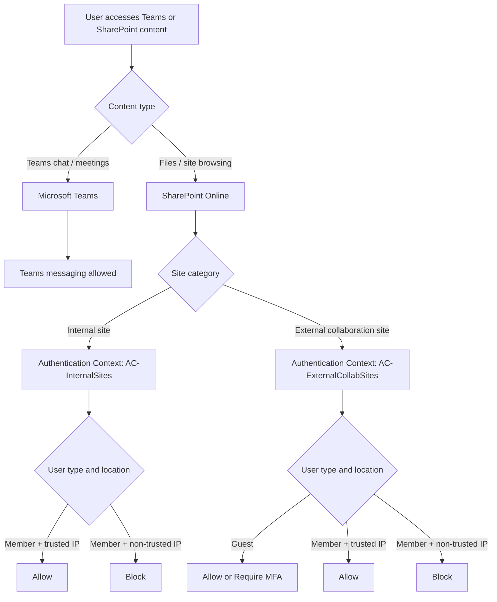

## SharePoint Online Conditional Access Use Case: Internal and External Collaboration

If you've ever tried to secure SharePoint Online and then watched Teams file access break as collateral damage... you've already hit the real problem. Teams chat and Teams files do not follow the same control path, and a single blunt policy can't express what most organizations actually need.

Microsoft gives you several building blocks:

- Authentication Context
- Restricted Access Control
- App-Enforced Restrictions
- Defender for Cloud Apps
- SharePoint and Teams sharing settings

The difficult part is not knowing those features exist. The difficult part is combining them so they actually match a real collaboration matrix.

> **📌 Scope**: this article covers one specific design scenario, not every SharePoint and Teams Conditional Access pattern. The design choices here are driven by a concrete set of business requirements described in section 1.

> **TL;DR**: the target scenarios are achievable, but not with a simple model like "block internal sites, allow external sites". The clean design is based on **site-level Authentication Context**, **separate Conditional Access policies for members and guests**, and a **clear internal vs external collaboration model** in SharePoint and Teams.

---

## 1. 🎯 The Target Scenario

The objective is a mix of business enablement and security controls. The table below describes the expected behavior for each user type, location, and workload.

> The 🚫 cells on the "Internal user / Non-trusted IP" rows for external files and sites are the tricky ones — they're exactly what a naive "block internal / allow external" design gets wrong, and what this architecture is specifically built to address.

| User type | IP | Teams Chat (1:1, Group, Meeting) | Internal Team — Chat | External Team — Chat | Internal Team — Files | External Team — Files | Internal SPO Site | External SPO Site |
|---|---|---|---|---|---|---|---|---|
| Internal user | Trusted IP | ✅ | ✅ | ✅ | ✅ | ✅ | ✅ | ✅ |
| Internal user | Non-trusted IP | ✅ | ✅ | ✅ | 🚫 | 🚫 | 🚫 | 🚫 |
| Guest (external) | Non-trusted IP | ✅ | 🚫 | ✅ | 🚫 | ✅ | 🚫 | ✅ |

The key design constraints that follow from this table:

- **Teams chat and meetings** must remain accessible to all users regardless of IP or user type.
- **Teams chat behavior and Teams file behavior must be treated differently** — they do not share the same access control path.
- **Guests must be able to access external collaboration spaces** even from non-trusted IPs.
- **Internal users on non-trusted IPs must be blocked from file access**, including on external collaboration spaces — this is the scenario the basic design misses.

The last two points together are the hardest to express correctly. This is what drives the architecture.

> ⚠️ A Conditional Access policy targeting SharePoint Online does not just affect direct site browsing. It also affects every SharePoint-backed operation in Teams — files tab, channel documents, shared files in chat.

| Experience | Back-end service |
|---|---|
| Teams chat / meetings / messaging | Microsoft Teams |
| Teams files tab / channel documents / shared files | SharePoint Online |
| Direct SharePoint site browsing | SharePoint Online |

---

## 2. 🤔 Why This Gets Complicated Quickly

Here's the thing most people don't realize until a helpdesk ticket lands in their inbox:

- Teams files are stored in SharePoint Online.
- The Files tab in Teams is a SharePoint access path.
- A Conditional Access policy targeting **Office 365 SharePoint Online** applies to:
  - direct SharePoint browsing,
  - Teams channel files,
  - files shared in Teams chats,
  - and most file operations behind Teams.

So a blunt rule like "block SharePoint from untrusted IPs" also silently blocks the SharePoint-backed parts of Teams. Cue the confused users and the helpdesk flood. 🎉 (not the good kind)

That is why the real question is not "how do I secure SharePoint?" but rather:

> How do I secure SharePoint-backed content differently depending on the site type and the user type, without breaking Teams messaging?

---

## 3. 🧰 Control Options and Their Limits

Before jumping into the recommended design, let's be honest about what each tool actually does — and where it falls short.

### 3.1 Authentication Context

**What it does**

- Applies Conditional Access at the **site level**.
- Lets you associate a dedicated CA policy with a specific SharePoint site.

**What it is good at**

- Differentiating internal sites from external collaboration sites.
- Applying different policies to members and guests on the same site.
- Protecting only the sites that need different behavior — without touching everything else.

**What it does not solve alone**

- It is not a tenant-wide baseline.
- It must be assigned explicitly to the relevant sites.

**Verdict** 🏆

This is the key control for this scenario. Everything else builds around it.

---

### 3.2 Restricted Access Control

**What it does**

- Restricts access to a SharePoint site to a set of allowed security groups.

**What it is good at**

- Hardening specific sites with a strict allow-list model.

**What it does not solve well**

- It cannot express: "block internal members from untrusted IP, but still let guests in."

**Verdict** 🔧

Useful as an additional hardening layer, but not the right tool to drive this scenario.

---

### 3.3 App-Enforced Restrictions

**What it does**

- Provides web-only / limited SharePoint access from untrusted contexts.
- Blocks download, sync, print, and copy while keeping browser access open.

**What it is good at**

- Establishing a global SharePoint baseline with minimal per-site configuration.
- Reducing exfiltration risk without a hard block.

**What it does not solve alone**

- It cannot model nuanced rules like:
  - internal member blocked, guest allowed, only for selected collaboration sites.

**Verdict** 🛡️

Very useful as a global baseline layer. Not sufficient on its own to express this matrix.

---

### 3.4 Defender for Cloud Apps

**What it does**

- Adds session-level controls through Conditional Access App Control.
- Supports download blocking, watermarking, label-based restrictions, and more.

**What it is good at**

- Fine-grained session behavior when you need to go beyond allow/block.
- Advanced download protection with label awareness.

**What it does not solve best**

- It adds real operational complexity.
- Often overkill if the main requirement is just allow/block based on site type and user type.

**Verdict** 🔬

Powerful optional layer — but don't reach for it if you don't need the advanced session controls.

---

### 3.5 SharePoint and Teams Sharing Settings

**What they do**

- Define whether a site accepts guests.
- Define whether a Team allows guest collaboration.
- Separate internal-only spaces from external collaboration spaces.

**What they are good at**

- Establishing the collaboration model cleanly.
- Preventing accidental mixing of internal and partner-facing spaces.

**What they do not solve alone**

- They do not enforce trusted vs non-trusted location logic by themselves.

**Verdict** 🧱

Mandatory foundation — you can't skip this step. But sharing settings alone won't get you to the target matrix.

---

## 4. 🕳️ Why the Basic "Block Internal / Allow External" Design Leaves Gaps

This is where many initial designs fall short — and it's not obvious until you test the edge cases.

A typical first attempt looks like this:

- internal SharePoint sites -> `ConditionalAccessPolicy BlockAccess`
- external SharePoint sites -> `ConditionalAccessPolicy AllowFullAccess`
- internal Teams -> no guests
- external Teams -> guests allowed
- plus a global CA baseline with App-Enforced Restrictions

At first glance, it looks reasonable. In reality, it leaves a gap that matters.

Why? Because external collaboration sites are configured for **full access**. That means:

- Teams external file access still relies on SharePoint.
- An internal member who is authorized on that external collaboration site can still access it — because the site says `AllowFullAccess`.

So the design cannot express this cleanly:

- guest can access the external site ✅
- internal member on non-trusted IP must be blocked from that same site 🚫

This is not a platform limitation. It is a limitation of the chosen architecture.

---

## 5. 🏗️ Recommended Architecture

The cleanest model combines a clear collaboration classification with Authentication Context and separate CA policies for members and guests. Here's how it breaks down.



### 🗂️ Layer 1 - Internal vs External Collaboration Model

Before any Conditional Access, you need a clean separation. Separate your sites and Teams into two categories:

- **Internal spaces**
  - no guest sharing
  - no guest access to Teams
- **External collaboration spaces**
  - guests allowed
  - sharing limited to the intended collaboration model

This is the collaboration foundation.

### 🔑 Layer 2 - Authentication Context by Site Type

This is the key move. Use Authentication Context on the sites that need differentiated Conditional Access — instead of relying on a single tenant-wide SharePoint behavior.

Suggested naming:

- `AC-InternalSites`
- `AC-ExternalCollabSites`

### 🔐 Layer 3 - Separate CA Policies for Members and Guests

This is where the matrix becomes expressible. Three policies, clearly separated by user type.

#### Policy A - Internal members on internal sites

- Target resource: Authentication Context `AC-InternalSites`
- Users: internal members
- Condition: untrusted locations
- Grant: block

Result:

- internal users on non-trusted IPs cannot access internal SharePoint sites,
- internal Teams file access tied to those sites is also blocked,
- Teams chat and meetings remain unaffected.

#### Policy B - Internal members on external collaboration sites

- Target resource: Authentication Context `AC-ExternalCollabSites`
- Users: internal members only
- Condition: untrusted locations
- Grant: block

Result:

- internal users on non-trusted IPs are blocked from external collaboration files and sites.

#### Policy C - Guests allowed on external collaboration sites

- Target resource: Authentication Context `AC-ExternalCollabSites`
- Users: guests and external users
- **No location condition** — guests must be allowed regardless of IP
- Grant: allow, optionally with MFA

> ⚠️ Do not add an IP-based location condition to this policy. The whole point is that guests can access external collaboration spaces even from non-trusted IPs. If you restrict Policy C to trusted locations, you break the guest scenario entirely.

Result:

- guests can still access the external collaboration spaces they were invited to,
- while internal non-trusted users are blocked from the same site by Policy B.

> ⚠️ **Design constraint: Authentication Context is step-up, not step-down**
>
> Authentication Context lets you enforce stricter controls on selected sites, but it cannot relax a stricter tenant-wide SharePoint baseline for a specific site.
>
> If your baseline CA policy requires compliant or hybrid-joined devices for SharePoint Online, you can't use Authentication Context or Defender for Cloud Apps session controls to make a single site accessible from unmanaged devices.
>
> To allow one less-restricted site, you must redesign the model: broader baseline + stricter targeted controls on other sites.

### 🛡️ Optional Layer 4 - App-Enforced Restrictions as Baseline

If you want a web-only posture for generic SharePoint access from untrusted locations, App-Enforced Restrictions still fit well here — as a baseline safety net, not the main control.

### 🔬 Optional Layer 5 - Defender for Cloud Apps

Add this layer only if you also need advanced session behavior like:

- browser view allowed but download blocked,
- watermarking,
- label-based controls.

---

## 6. ✅ Scenario Mapping

This section is not the step-by-step configuration procedure. It is the control matrix that maps each business scenario to the mechanism that enforces it. The actual implementation steps are in Section 7.

Let's map the architecture back to the target matrix and verify it covers everything:

| No. | Scenario | Expected result | Main control | CA implementation detail |
|---|---|---|---|---|
| 1 | Internal user on trusted IP -> internal Teams chat | ✅ | Teams native behavior | No SharePoint CA involved. Teams messaging is not targeted by the SharePoint Authentication Context policies. |
| 2 | Internal user on trusted IP -> internal Teams files | ✅ | Normal SharePoint access | `AC-InternalSites` is present on the site, but CA Policy A excludes trusted locations, so access is allowed. |
| 3 | Internal user on non-trusted IP -> internal Teams chat | ✅ | Not targeted by SharePoint CA | No SharePoint CA involved. Teams chat stays outside the SharePoint access control path. |
| 4 | Internal user on non-trusted IP -> internal Teams files | 🚫 | Authentication Context + CA Policy A | The underlying SharePoint site is tagged with `AC-InternalSites`. CA Policy A targets internal members on untrusted locations and blocks access. |
| 5 | Internal user on non-trusted IP -> internal SharePoint site | 🚫 | Authentication Context + CA Policy A | Same logic as row 4: `AC-InternalSites` on the site + CA Policy A block for internal members outside trusted IPs. |
| 6 | Internal user on non-trusted IP -> external Teams files | 🚫 | Authentication Context + CA Policy B | The external collaboration site is tagged with `AC-ExternalCollabSites`. CA Policy B targets internal members on untrusted locations and blocks file access. |
| 7 | Internal user on non-trusted IP -> external SharePoint site | 🚫 | Authentication Context + CA Policy B | Same logic as row 6: `AC-ExternalCollabSites` + CA Policy B block for internal members outside trusted IPs. |
| 8 | Guest -> internal Teams chat | 🚫 | Teams guest access disabled on internal Teams (`AllowToAddGuest $false`) | No Conditional Access policy is needed. The guest cannot be added to the internal Team in the first place. |
| 9 | Guest -> internal Teams files | 🚫 | SPO sharing disabled on internal sites (`SharingCapability Disabled`) | No Conditional Access policy is needed. The internal SharePoint site does not allow guest sharing, so the guest never reaches the Authentication Context challenge. |
| 10 | Guest -> internal SharePoint site | 🚫 | SPO sharing disabled on internal sites (`SharingCapability Disabled`) | Same logic as row 9: the guest has no valid sharing path to the site, so access is blocked before CA evaluation. |
| 11 | Guest on non-trusted IP -> external Teams chat | ✅ | Guest enabled on external Teams | No SharePoint CA involved for the chat workload. Guest access is allowed at the Team configuration level. |
| 12 | Guest on non-trusted IP -> external Teams files | ✅ | CA Policy C on `AC-ExternalCollabSites` | The site is tagged with `AC-ExternalCollabSites`. CA Policy C targets guests and external users and deliberately has no location condition, so guest access is allowed. |
| 13 | Guest on non-trusted IP -> external SharePoint site | ✅ | CA Policy C on `AC-ExternalCollabSites` | Same logic as row 12: `AC-ExternalCollabSites` + CA Policy C allow for guests regardless of IP, optionally with MFA. |

> 💡 **Rows 8–10 (guest blocking on internal content)** are not enforced by Conditional Access policies at all. They're handled entirely by the collaboration model settings in Step 1. If a guest has no Team membership and no sharing permission on the site, they simply can't reach the Authentication Context challenge — no CA policy needed.

This is exactly the full scenario matrix that the simpler `AllowFullAccess` model cannot express.

---

## 7. 🛠️ Configuration Walkthrough

### ⚙️ Choice Point: All Sites or Selective Protection?

This architecture can be deployed two ways:

1. **All-sites approach**: Mark every SharePoint site with an Authentication Context (either `AC-InternalSites` or `AC-ExternalCollabSites`). This ensures every site is governed by one of the three policies (A, B, or C).
2. **Selective approach**: Mark only sensitive or collaboration-critical sites. Other sites remain untagged and inherit a tenant-wide baseline — which you must define separately (e.g., MFA for all users, or App-Enforced Restrictions for web-only access).

Choose based on your governance model. The selective approach is lighter but requires you to establish a clear baseline for unmarked sites.

---

### Step 1 - Classify Sites and Teams 🗂️

Start by creating two clear categories:

- Internal-only SharePoint and Teams
- External collaboration SharePoint and Teams

Recommended settings:

| Workload | Internal spaces | External collaboration spaces |
|---|---|---|
| SharePoint SharingCapability | `Disabled` | `ExistingExternalUserSharingOnly` or according to policy |
| Teams guest access | `AllowToAddGuest $false` | `AllowToAddGuest $true` |

The exact sharing choice depends on the governance model, but the separation must be explicit.

To configure Teams guest access per Team:

```powershell
# Disable guest access on an internal Team
Set-Team -GroupId <InternalTeamGroupId> -AllowToAddGuest $false

# Enable guest access on an external collaboration Team
Set-Team -GroupId <ExternalTeamGroupId> -AllowToAddGuest $true
```

To configure SharePoint sharing at the site level:

```powershell
Connect-SPOService -Url https://contoso-admin.sharepoint.com

# Internal site - no external sharing
Set-SPOSite -Identity https://contoso.sharepoint.com/sites/InternalProject `
    -SharingCapability Disabled

# External collaboration site - existing guests only
Set-SPOSite -Identity https://contoso.sharepoint.com/sites/PartnerProject `
    -SharingCapability ExistingExternalUserSharingOnly
```

### Step 2 - Create Authentication Contexts 🔑

Create at least two contexts in Entra ID:

- `AC-InternalSites`
- `AC-ExternalCollabSites`

In Entra ID:

1. Go to **Protection** -> **Conditional Access** -> **Authentication Contexts**
2. Create the contexts
3. Record their IDs

### Step 3 - Assign Authentication Contexts to Sites 🏷️

Tag each site with the appropriate context:

```powershell
Connect-SPOService -Url https://contoso-admin.sharepoint.com

# Internal site
Set-SPOSite -Identity https://contoso.sharepoint.com/sites/InternalProject `
    -ConditionalAccessPolicy AuthenticationContext `
    -AuthenticationContextName "AC-InternalSites"

# External collaboration site
Set-SPOSite -Identity https://contoso.sharepoint.com/sites/PartnerProject `
    -ConditionalAccessPolicy AuthenticationContext `
    -AuthenticationContextName "AC-ExternalCollabSites"
```

You can also use sensitivity labels with Sites and Groups scope if you prefer a label-driven approach.

### Step 4 - Create Conditional Access Policies 🔐

#### CA Policy A - InternalProject Sites - Block Untrusted

- Target resource: `AC-InternalSites`
- Users: internal members
- Locations: any, excluding trusted IPs
- Grant: block

#### CA Policy B - PartnerProject Sites - Block Untrusted

- Target resource: `AC-ExternalCollabSites`
- Users: internal members
- Locations: any, excluding trusted IPs
- Grant: block

> ⚠️ **Important**: Policy B is NOT optional. This policy is critical to prevent internal members on non-trusted IPs from accessing external collaboration sites. Without it, the scenario matrix gap persists: external sites would remain fully accessible to all internal users, regardless of location. This policy is what allows guests to collaborate while restricting internal untrusted users on the same resource.

#### CA Policy C - PartnerProject Sites - Require MFA Guests

- Target resource: `AC-ExternalCollabSites`
- Users: guests and external users
- **No location condition** — guests must be allowed from any IP
- Grant: allow
- Session controls: optionally require MFA

This split between members and guests is what removes the residual gap.

> **Note on guest blocking for internal content**: there is no Conditional Access policy needed to block guests from internal sites or Teams. That is handled entirely by the collaboration model settings from Step 1: `SharingCapability Disabled` prevents guests from ever being granted SPO access on internal sites, and `AllowToAddGuest $false` prevents guests from being added to internal Teams. A guest who has no membership and no sharing permission simply cannot reach the Authentication Context challenge. No CA policy is needed.

### Step 5 - Verify and Test 🧪

After creating and enabling all three policies:

1. Test each scenario from the matrix (section 6) in a fresh browser session.
2. If a policy does not apply immediately despite being enabled:
   - Revoke active sessions for the test user in Entra ID.
   - Wait 1-2 minutes for the revocation to propagate.
   - Test again in a fresh browser window or private mode.
   - Cached tokens can sometimes mask new policy evaluations, and revoking forces a fresh token acquisition.

> **Note on CAE and network changes**: Continuous Access Evaluation (CAE) can trigger Conditional Access reevaluation when network conditions change, but behavior depends on client and resource support. Sign-in frequency is a separate periodic reauthentication control and does not replace CAE. If policy behavior seems inconsistent after a network change, validate with a fresh browser session and, if needed, revoke active sessions for the test user.

### Step 6 - Optional Global Baseline with App-Enforced Restrictions 🛡️

If you want a generic web-only restriction for unmanaged or untrusted contexts:

1. Create a CA policy targeting **Office 365 SharePoint Online**
2. Use **Session controls** -> **Use app-enforced restrictions**
3. In SharePoint Admin Center -> **Policies** -> **Access control** -> **Unmanaged devices**
4. Select **Allow limited, web-only access**

Again, this is useful as a baseline, not as the main way to express the scenario matrix.

---

## 8. 🧩 Where Restricted Access Control and Defender for Cloud Apps Still Fit

These two didn't make it into the core architecture — but they're not useless either.

### Restricted Access Control

Reach for this when you want a strict allow-list on top of the Authentication Context design — for sites that should only ever be accessed by a predefined group, full stop.

Think of it as an access hardening layer, not the primary location-based decision engine.

### Defender for Cloud Apps

Add this when you need advanced session behavior on top of the access decision:

- view in browser but block download,
- watermarking on downloaded files,
- label-aware session policies.

Not required to meet the scenario matrix here, but a natural next layer for organizations with stricter data protection requirements.

---

## 9. 🧭 Recommended Decision Guide

Quick reference when someone asks which control to use:

- Need to differentiate **internal vs external sites**? -> **Authentication Context**
- Need to differentiate **members vs guests on the same external site**? -> **Authentication Context plus separate CA policies**
- Need a global browser-only baseline? -> **App-Enforced Restrictions**
- Need advanced session or download logic? -> **Defender for Cloud Apps**
- Need strict allow-list access to a site? -> **Restricted Access Control**

---

## 10. 💡 Best Practices

- Start every Conditional Access policy in **Report-only** mode.
- Keep **trusted locations** accurate and documented.
- Clearly identify which Teams and sites are **internal** and which are **external collaboration**.
- Scope Conditional Access separately for **members** and **guests**.
- Do not assume `AllowFullAccess` on external sites is enough if internal non-trusted users still need to be blocked.
- Validate all three experiences:
  - direct SharePoint access,
  - Teams file access,
  - Teams chat access.

> ⚠️ **Important behavior note: unsupported clients vs real coverage gaps**
>
> In most Microsoft-documented limitations, when Authentication Context cannot be processed correctly, behavior is **fail-closed**:
>
> - access is blocked (`access denied`), or
> - challenge flow fails and access is rejected.
>
> This is usually **not** a silent bypass. The bigger risk is often elsewhere:
>
> - **Availability/functional risk**: legitimate business scenarios break because the client or feature is unsupported.
> - **Design risk**: you believe content is protected, but some sites or flows are not covered because they are untagged or not targeted by an active policy.
>
> Practical rule:
>
> - unsupported client on a protected site -> typically a user-facing incident (blocked access),
> - incorrect scoping (site not tagged / no linked policy) -> actual security coverage risk.
>
> Related design rule:
>
> - Authentication Context can add requirements to selected sites (step-up),
> - it cannot remove stricter grant requirements already enforced by a broader SharePoint baseline policy.
>
> Microsoft references:
>
> - SharePoint Authentication Context limitations: [Conditional access policy - Limitations](https://learn.microsoft.com/en-us/sharepoint/authentication-context-example#limitations)
> - Purview dependencies for the Authentication Context option: [More information about the dependencies for the authentication context option](https://learn.microsoft.com/en-us/purview/sensitivity-labels-teams-groups-sites#more-information-about-the-dependencies-for-the-authentication-context-option)

### Known Constraints Checklist

- Authentication Context cannot be applied to the SharePoint root site (`https://tenant.sharepoint.com`).
- Authentication contexts used by labels must be created, configured, and **published to apps** in Entra.
- Label-based Conditional Access settings don't auto-validate dependencies; missing dependencies can result in no effective enforcement.
- If a label setting is less restrictive than an existing tenant-level baseline, the tenant-level setting takes precedence.
- Plan for propagation delays and token timing effects; retesting often requires a fresh sign-in.
- Validate supported clients and feature paths explicitly (web, desktop, mobile, sync, Outlook, Teams file workflows).
- Treat unsupported-client outcomes as availability risk; treat incorrect site/policy scoping as security coverage risk.

---

## 11. 🎯 Final Takeaway

The main lesson is simple — and worth repeating:

> The hard part is not the Microsoft features. The hard part is assembling them in a way that actually matches the collaboration model.

If your design stops at:

- internal = blocked,
- external = full access,

you will almost certainly leave gaps in the matrix.

If instead you build around:

- a clear site classification,
- Authentication Context on the right sites,
- separate CA policies for members and guests,
- an optional global SharePoint baseline,

Then the full scenario matrix becomes straightforward to express — and maintain.

That is the design pattern behind protecting SharePoint without breaking Teams.

---

## References

- [Authentication Context in Conditional Access](https://learn.microsoft.com/en-us/entra/identity/conditional-access/concept-conditional-access-cloud-apps#authentication-context)
- [SharePoint integration with Authentication Context](https://learn.microsoft.com/en-us/sharepoint/authentication-context-example)
- [SharePoint Authentication Context limitations](https://learn.microsoft.com/en-us/sharepoint/authentication-context-example#limitations)
- [Purview dependencies for Authentication Context](https://learn.microsoft.com/en-us/purview/sensitivity-labels-teams-groups-sites#more-information-about-the-dependencies-for-the-authentication-context-option)
- [Control access from unmanaged devices](https://learn.microsoft.com/en-us/sharepoint/control-access-from-unmanaged-devices)
- [Restricted Access Control in SharePoint Advanced Management](https://learn.microsoft.com/en-us/sharepoint/restricted-access-control)
- [Session policies in Defender for Cloud Apps](https://learn.microsoft.com/en-us/defender-cloud-apps/session-policy-aad)
- [Cross-tenant access for B2B collaboration](https://learn.microsoft.com/en-us/entra/external-id/cross-tenant-access-settings-b2b-collaboration)