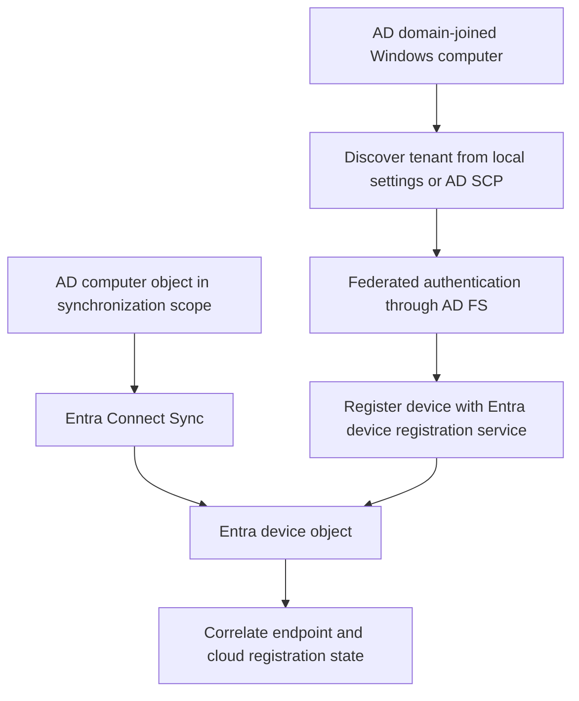

# Microsoft Entra Hybrid Join with AD FS: Configuration and Diagnostics

**Hybrid join completes a device identity. It does not automatically enroll Intune or enable AD FS device-based policy.**

An AD domain-joined Windows computer can also register its device identity with Microsoft Entra ID. In a federated environment, AD FS participates in the relevant authentication path. Entra Connect Sync, tenant discovery, network access and the client registration process still have distinct jobs.

This guide consolidates older manual and wizard-based recipes for currently supported Windows clients. It does not revive Windows 7/8 Workplace Join packages or require a new AD FS deployment for a managed domain. Use a supported Entra Connect release and verify the current client/topology support matrix.

## 1. Draw the registration path



The diagram is a logical view, not a promise that federation always completes the join immediately. Supported clients can fall back to sync-join when the instantaneous federated path fails. A cloud object can remain **pending** until the client completes registration.

| Mechanism | Purpose |
|---|---|
| AD domain membership | Computer account, Windows domain authentication and domain management |
| Entra hybrid join | Register the AD-joined device in the intended Entra tenant |
| Intune enrollment | Establish the separate MDM management relationship |
| Device writeback | Represent applicable Entra devices in AD for scenarios such as AD FS device-based policy |
| User PRT | User/device SSO context; inspect separately from machine join completion |

## 2. Prepare the actual scope and dependencies

Before configuration, identify the tenant, verified federated domain, computer forests/OUs, synchronization server, federation farm and pilot clients. Retain existing SCP values, client-side overrides, Entra Connect configuration and AD FS RP rules.

- Keep the required computer OUs and default device attributes in synchronization scope. Do not filter out attributes needed by registration just because user synchronization works.
- The wizard requires the documented cloud and directory permissions, including **Hybrid Identity Administrator**, forest preparation rights and AD FS administration where federation configuration is changed. These setup privileges are not runtime privileges for users or clients.
- Verify DC connectivity, DNS and time. Hybrid join does not eliminate the domain connectivity requirements of an AD-joined device.
- From the **machine/system context**, verify access to the documented cloud discovery/authentication endpoints and the organization's federation service. An administrator's browser success is not that test.
- Follow Microsoft's exclusions from TLS break-and-inspect for `device.login.microsoftonline.com` and `enterpriseregistration.windows.net`. Preserve certificate validation; do not bypass TLS errors to make discovery succeed.

For public-cloud deployments, the documented endpoints include `enterpriseregistration.windows.net`, `login.microsoftonline.com` and `device.login.microsoftonline.com`; add the applicable STS and, only when used, Seamless SSO endpoint. Sovereign-cloud deployments have their own endpoint requirements. WPAD is not the only supported proxy configuration on modern clients, but the machine must discover and authenticate to the chosen proxy without interactive user assistance.

## 3. Choose forest-wide discovery or targeted deployment

The service connection point (SCP) lives in the **computer's forest** configuration partition. Its tenant GUID and tenant domain determine the discovery destination. In a multi-forest deployment, inspect each relevant forest; the user's forest is not automatically the computer's forest.

On an AD management host, select a DC explicitly and read the SCP:

```powershell
Import-Module ActiveDirectory -ErrorAction Stop
$directoryServer = 'dc01.corp.example'
$rootDse = Get-ADRootDSE -Server $directoryServer -ErrorAction Stop
$scpDn = 'CN=62a0ff2e-97b9-4513-943f-0d221bd30080,CN=Device Registration Configuration,CN=Services,' +
    $rootDse.ConfigurationNamingContext
Get-ADObject -Identity $scpDn -Server $directoryServer -Properties keywords -ErrorAction Stop |
    Select-Object DistinguishedName, keywords
```

Look for the intended `azureADId:<tenant GUID>` and `azureADName:<verified domain>`. A missing SCP may be intentional in a targeted deployment; distinguish that from a failed directory read.

For targeted deployment, the documented client-side values are under `HKLM\SOFTWARE\Microsoft\Windows\CurrentVersion\CDJ\AAD`: `TenantId` and `TenantName`, both strings. In a federated scenario, `TenantName` is the verified federated domain, not an arbitrary internal DNS suffix. On the client, inspect any override:

```powershell
$discoveryPath = 'HKLM:\SOFTWARE\Microsoft\Windows\CurrentVersion\CDJ\AAD'
if (Test-Path -LiteralPath $discoveryPath -ErrorAction Stop) {
    Get-ItemProperty -LiteralPath $discoveryPath -ErrorAction Stop |
        Select-Object TenantId, TenantName
} else {
    Write-Output 'No client-side discovery key found; inspect the forest SCP.'
}
```

Client-side discovery takes precedence over directory discovery. Microsoft's targeted-deployment design also removes the relevant forest-wide SCP keywords and configures the client-side values on **AD FS servers**. Omitting the AD FS part can affect how it identifies the authority for device objects and performs device cleanup. Follow the complete targeted-deployment instructions; do not clear a working forest SCP as a local troubleshooting shortcut.

Decide the rollout model **before** running a wizard that publishes forest-wide discovery. A GPO linked to a pilot OU does not, by itself, negate an already populated forest-wide SCP.

## 4. Configure through Entra Connect

For the documented federated wizard path:

1. Open Microsoft Entra Connect and select **Configure > Configure device options**.
2. Authenticate to the intended tenant with the required setup role.
3. Select **Configure Microsoft Entra hybrid join**.
4. Select the relevant forests, authentication service and supported device operating systems. Review the wizard's AD FS versus synchronization-based choices against the actual scenario.
5. Supply the required forest and AD FS administration credentials at their respective prompts.
6. Review the intended changes, then configure and retain the result/logs.

Use the targeted-deployment workflow instead where a forest-wide SCP would exceed the intended scope. The wizard's federation configuration can update the Microsoft 365 RP's device claims; retain and compare the before/after rules, including existing customizations.

If manual configuration is genuinely required, use the current Microsoft manual procedure. Do not append an old claim-rule script repeatedly, overwrite all `IssuanceTransformRules`, or assume user and computer `issuerid`/anchor handling are identical. A device registration claim is not an authorization rule granting all applications access.

## 5. Check federation endpoints without exposing Windows transport

On AD FS, inspect the Windows-integrated WS-Trust endpoints:

```powershell
Import-Module ADFS -ErrorAction Stop
$windowsPaths = @(
    '/adfs/services/trust/2005/windowstransport',
    '/adfs/services/trust/13/windowstransport'
)
Get-AdfsEndpoint -ErrorAction Stop |
    Where-Object { $_.AddressPath -in $windowsPaths } |
    Select-Object AddressPath, Enabled, Proxy
```

**These Windows transport endpoints must remain intranet-facing only, not published through WAP.** Older notes that recommend exposing them externally should not be followed. An `Enabled` endpoint and a `Proxy`-published endpoint are different settings.

Review the other documented WS-Trust endpoints and MEX response according to the actual authentication flows. Do not bulk-enable or proxy every endpoint to resolve one registration failure. Test the machine's internal route to the federation hostname and correlate the server-side authentication result.

## 6. Verify on the endpoint and in Entra

On the client, inspect registration state. Use elevation when investigating machine/key diagnostics, but repeat in the **affected user's session** when examining PRT/WAM state:

```powershell
& dsregcmd.exe /status
if ($LASTEXITCODE -ne 0) {
    throw 'Device registration status could not be read.'
}
```

| Field | What to establish |
|---|---|
| `DomainJoined` and `AzureAdJoined` | Both `YES` for completed hybrid join |
| `DeviceId`, `TenantId` | Match the intended cloud registration, not just a display name |
| `DeviceAuthStatus`, where available | Investigate a disabled/deleted or otherwise invalid cloud device |
| Previous Registration / Error Phase | The stage and error of an unsuccessful join attempt |
| `AzureAdPrt` | User SSO state in the correct user's context, separate from join completion |
| `EnterprisePrt`, where present | AD FS enterprise SSO state, not a second name for the Entra PRT |

After connecting Graph to the intended tenant with the [device inventory note's read permissions](../Reports/Entra%20Device%20Inventory%20with%20Microsoft%20Graph%20-%20Join%20Types%20and%20Registered%20Owners.md), query by the **registration ID from the client**, not the directory object ID:

```powershell
$registrationId = [guid]'aaaaaaaa-bbbb-cccc-dddd-eeeeeeeeeeee'
$cloudDevices = @(Get-MgDevice -Filter "deviceId eq '$registrationId'" -All `
    -Property Id, DeviceId, DisplayName, TrustType, AccountEnabled -ErrorAction Stop)
if ($cloudDevices.Count -ne 1) {
    throw 'Expected one matching device registration; review tenant, sync and client identity.'
}
$cloudDevice = $cloudDevices[0]
if ($cloudDevice.AccountEnabled -isnot [bool] -or -not $cloudDevice.AccountEnabled -or
    $cloudDevice.TrustType -ne 'ServerAd') {
    throw 'The matching cloud record is not an enabled hybrid-join device.'
}
$cloudDevice | Select-Object Id, DeviceId, DisplayName, TrustType, AccountEnabled
```

The cloud record alone does not prove client registration finished: compare the endpoint flags and pending status. Retrying while the computer is outside synchronization scope does not fix that scope.

## 7. Diagnose the first failed stage

| Stage | Evidence and likely boundary |
|---|---|
| AD precheck | Computer account, DC reachability, domain connectivity and replication |
| Discovery | SCP/registry tenant values, system-context proxy, cloud metadata response |
| Federated authentication | Internal WS-Trust/MEX path, machine authentication and actual issued claims |
| Join/pending | Computer synchronization/export, cloud object and registration response |
| User PRT after join | User identity, authentication response, time, CloudAP and token diagnostics |
| Intune enrollment | Separate licensing, MDM scope, GPO and enrollment result |

Inspect **User Device Registration** logs and the `dsregcmd` error phase/code for the same attempt. For a user PRT failure, inspect the relevant **Microsoft-Windows-AAD** logs and user context instead of declaring the machine unjoined.

The automatic join task is under **Microsoft > Windows > Workplace Join**, commonly `Automatic-Device-Join`. This is not the Intune **EnterpriseMgmt** enrollment task. Triggering a task, seeing a cloud device, and receiving a user PRT are three different observations.

Do not clear the TPM, delete all device records or run `dsregcmd /leave` as a generic repair. Preserve device IDs, errors and key-state evidence first. Re-registration is a separate identity lifecycle action with consequences for management and Windows Hello.

For MDM, use the separate [automatic Intune enrollment procedure](../../040%20-%20Endpoint%20Security/Device%20Management/Automatic%20Intune%20Enrollment%20with%20Group%20Policy%20-%20Hybrid%20Join%20Is%20Not%20Enrollment.md). Device writeback is a different, scenario-dependent direction from Entra to AD; it is not a universal prerequisite for hybrid join.

## References

- [Microsoft Learn: Configure Microsoft Entra hybrid join](https://learn.microsoft.com/en-us/entra/identity/devices/how-to-hybrid-join)
- [Microsoft Learn: Targeted deployment and AD FS discovery settings](https://learn.microsoft.com/en-us/entra/identity/devices/hybrid-join-control)
- [Microsoft Learn: Troubleshoot hybrid join and post-join authentication](https://learn.microsoft.com/en-us/entra/identity/devices/troubleshoot-hybrid-join-windows-current)
- [Microsoft Learn: Manual hybrid join configuration](https://learn.microsoft.com/en-us/entra/identity/devices/hybrid-join-manual)