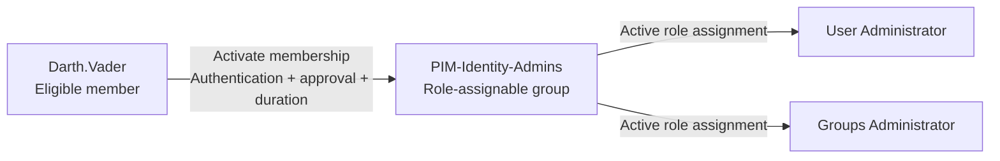

# PIM for Groups: One Activation, Multiple Entra Roles

**One administrative task, two Entra roles, two PIM activations. The task needs permissions, not a collection of activation receipts.**

> **TL;DR**
>
> Assign the required Entra roles to a **role-assignable group as active assignments**. Make the administrator an **eligible member of that group** through **Privileged Identity Management (PIM) for Groups**.
>
> The administrator activates **one group membership**, then receives the roles assigned to the group. The group's membership activation policy controls the duration, approval, and authentication requirements.
>
> This is not a custom role containing other roles. It is a group carrying several role assignments, with temporary membership as the access gate.

---

## Contents

- [The Problem: One Job, Several Roles](#the-problem-one-job-several-roles)
- [The Mental Model: Put Eligibility on Membership](#the-mental-model-put-eligibility-on-membership)
    - [Two Similar-Looking Configurations, Different Results](#two-similar-looking-configurations-different-results)
- [Prerequisites](#prerequisites)
- [Configure the Single-Activation Path](#configure-the-single-activation-path)
    - [1. Create an Empty Role-Assignable Group](#1-create-an-empty-role-assignable-group)
    - [2. Give the Group Its Two Active Roles](#2-give-the-group-its-two-active-roles)
    - [3. Bring the Group Under PIM Management](#3-bring-the-group-under-pim-management)
    - [4. Configure the Member Activation Policy](#4-configure-the-member-activation-policy)
    - [5. Make Darth.Vader an Eligible Member](#5-make-darthvader-an-eligible-member)
- [Operational Details That Matter](#operational-details-that-matter)
- [When the Result Does Not Match the Diagram](#when-the-result-does-not-match-the-diagram)
- [The Takeaway](#the-takeaway)
- [My Go-To JIT Admin Groups](#my-go-to-jit-admin-groups)
- [Sources](#sources)

---

## The Problem: One Job, Several Roles

Suppose an administrator is eligible for **User Administrator** and **Groups Administrator**. With separate eligible role assignments, the administrator activates each role before using it.

PIM for Groups gives us another arrangement: keep those role assignments active on a group, but make the administrator's membership temporary. One activation opens the access path to both roles.

Our example uses a group named `PIM-Identity-Admins`. Its name is just a naming convention; the `PIM-` prefix does not configure anything. Entra does not execute group names.

**These two roles overlap.** User Administrator already includes many group-management permissions. This pair demonstrates the activation mechanism; a particular task may need only one of them. See the [built-in role permissions](https://learn.microsoft.com/en-us/entra/identity/role-based-access-control/permissions-reference#user-administrator) for the exact permissions.

---

## The Mental Model: Put Eligibility on Membership

Four terms matter here:

| Term | Meaning in this article |
| --- | --- |
| **Role assignment** | Grants an Entra role to a principal, such as a user or group, at a particular scope. |
| **Role-assignable group** | A cloud group created with `isAssignableToRole = true`, which allows Entra roles to be assigned to it. |
| **Active assignment** | The assignment is already in effect. Its beneficiary does not need to activate it first. |
| **Eligible membership** | The user may request temporary membership through PIM, but is not an active member just because they are eligible. |

Here is the configuration we want:

| Assignment | State |
| --- | --- |
| `PIM-Identity-Admins` receives **User Administrator** | **Active** |
| `PIM-Identity-Admins` receives **Groups Administrator** | **Active** |
| `Darth.Vader` belongs to `PIM-Identity-Admins` | **Eligible**, until activated |

The group keeps its role assignments before, during, and after the user's activation. **PIM changes the user's membership, not the state of those two role assignments.**

While the membership is active, the user benefits from both roles at their assigned scopes. When the temporary membership ends, that access path is removed. Other assignments and application caches can still affect access after membership ends.

### Two Similar-Looking Configurations, Different Results

The location of the word **Eligible** changes the workflow:

| User's membership in the group | Group's assignment to the roles | What the user activates |
| --- | --- | --- |
| **Active** | **Eligible** | Each required role separately. This distributes role eligibility to the group's members. |
| **Eligible** | **Active** | **One membership**, giving access to the roles already assigned to the group. This is our design. |

Microsoft documents these [two ways to make users eligible for Entra roles](https://learn.microsoft.com/en-us/entra/id-governance/privileged-identity-management/concept-pim-for-groups#make-a-group-of-users-eligible-for-a-microsoft-entra-role). They solve different problems. Making everything eligible does not turn multiple activation steps into one.

**There is no second role-activation gate in our design.** Requirements configured for individually activating User Administrator or Groups Administrator are not automatically replayed when a user activates group membership. Configure the required controls on the group's **Member** policy.

---

## Prerequisites

Both role assignments use **directory scope** in this example.

| Item | What you need |
| --- | --- |
| **Setup administrator** | A separate account with **Privileged Role Administrator active** to create the role-assignable group and assign the roles. This account is also configured as the activation approver. |
| **Darth.Vader** | The cloud user who will become an **eligible member** of the group. |
| **Licensing** | Role-assignable groups require Entra ID P1 or P2. Cover **every eligible user and every activation-request approver** with **Entra ID P2 or Microsoft Entra ID Governance** licensing. In this example, that includes `Darth.Vader` and the setup administrator acting as approver. P1 alone does not provide PIM. |
| **Tools** | The [Microsoft Entra admin center](https://entra.microsoft.com). No PowerShell module or Azure subscription is needed for this portal walkthrough. |

We will configure activation controls **before** making `Darth.Vader` eligible. The sequence is: create the empty group, assign its roles, configure PIM, then grant eligibility.

---

## Configure the Single-Activation Path

### 1. Create an Empty Role-Assignable Group

**As the setup administrator**, open **Entra ID > Groups > All groups > New group**.

Configure these values:

| Setting | Value |
| --- | --- |
| **Group type** | **Security** or **Microsoft 365** |
| **Group name** | `PIM-Identity-Admins` |
| **Description** | `Temporary user and group administration through PIM membership.` |
| **Microsoft Entra roles can be assigned to the group** | **Yes** |
| **Membership type** | **Assigned**, not Dynamic |
| **Members** | Leave empty. In particular, do not add `Darth.Vader` here. |
| **Owners** | The separate setup administrator, not `Darth.Vader`. |

Select **Create** and confirm the warning about the role-assignment capability.

**Expected:** the group exists, is role-assignable, and has no active member named `Darth.Vader`. Record the group's **Object ID** so later checks do not depend only on its display name.

> **This switch is immutable.** You cannot convert an existing ordinary group by enabling it later. Create a new group with the capability from the start. Microsoft documents this in [Create a role-assignable group](https://learn.microsoft.com/en-us/entra/identity/role-based-access-control/groups-create-eligible).

**Why isn't Darth.Vader an owner?** The setup administrator manages the group; `Darth.Vader` activates membership to receive its Entra roles. Making `Darth.Vader` an owner would not grant those roles directly, but would let him add himself as an active member outside the PIM activation workflow.

### 2. Give the Group Its Two Active Roles

**As the setup administrator**, browse to **ID Governance > Privileged Identity Management > Microsoft Entra roles > Roles**.

1. Select **Add assignments**.
2. Choose **User Administrator**.
3. Select `PIM-Identity-Admins` as the member receiving the role. Select the **group**, not `Darth.Vader`.
4. Use **directory scope**, then select **Next**.
5. Set **Assignment type** to **Active**.
6. Make the assignment **permanent** if the role's assignment policy permits it, then select **Assign**.
7. Repeat the process for **Groups Administrator**.

If the role policy requires an end date, use **time-bound active** assignments covering the period during which the group should provide those roles. The mechanism needs the group-to-role assignments to be **active**, not permanent. If one expires first, membership no longer supplies that role, even if the membership itself is still active.

**Verify:** open each role's active assignments and confirm these two records:

| Principal | Role | State | Scope |
| --- | --- | --- | --- |
| `PIM-Identity-Admins` | User Administrator | Active | Directory |
| `PIM-Identity-Admins` | Groups Administrator | Active | Directory |

If these records are **Eligible**, fix this step before continuing. Also confirm that `Darth.Vader` has not accidentally received a direct active role assignment.

**Permanent roles on the group do not mean permanent roles for every eligible user.** The user's temporary membership is the gate. Any permanent active member, however, would have standing access through that group.

### 3. Bring the Group Under PIM Management

**As the setup administrator**, browse to **ID Governance > Privileged Identity Management > Groups**.

1. Select **Discover groups**.
2. Find and select `PIM-Identity-Admins`, checking its Object ID if names are duplicated.
3. Select **Manage groups**, then **OK**.
4. Return to **Groups** and open the group.

**Expected:** the group is now available in PIM for Groups, with **Assignments** and **Settings** to manage its members and owners.

The group being role-assignable and the group being managed by PIM are **two separate properties**. One allows it to receive Entra roles; the other allows PIM to manage temporary membership or ownership.

> **PIM onboarding cannot be reversed.** Microsoft does not support taking a group back out of PIM management once it has been onboarded. See [Bring groups into PIM](https://learn.microsoft.com/en-us/entra/id-governance/privileged-identity-management/groups-discover-groups).

### 4. Configure the Member Activation Policy

**As the setup administrator**, open the group's **Settings > Member > Edit**.

Use these settings:

| Setting | Example value |
| --- | --- |
| **Activation maximum duration** | **1 hour** |
| **Require multifactor authentication on activation** | **Yes** |
| **Require justification on activation** | **Yes** |
| **Require approval to activate** | **Yes** |
| **Approver** | The separate setup administrator. In production, select at least two available approvers for redundancy. |
| **Eligible assignment duration** | Allow the eligibility window used in the next step. |
| **Permanent active member assignments** | **Not allowed** |

Review the notification recipients and save with **Update**. Configure **Member**, not **Owner**: they have independent policies.

**Verify:** reopen the Member settings and confirm the saved duration, authentication requirement, approval requirement, and approver. An activation request is not a good place to discover that the approver list is empty.

Microsoft [recommends approval](https://learn.microsoft.com/en-us/entra/id-governance/privileged-identity-management/groups-assign-member-owner) for groups used to elevate into Entra roles. This also reduces the risk from someone who can take over an eligible account by resetting its credentials.

**MFA required does not necessarily mean a new MFA prompt every time.** An existing session may already satisfy the requirement. If fresh authentication or a particular authentication strength is required, use a properly configured **Conditional Access authentication context** in the group policy. That is a separate policy design, not an extra checkbox we silently assume exists. See [PIM for Groups settings](https://learn.microsoft.com/en-us/entra/id-governance/privileged-identity-management/groups-role-settings).

### 5. Make Darth.Vader an Eligible Member

**As the setup administrator**, stay on the group in PIM and open **Assignments > Add assignments**.

1. Under **Select role**, choose **Member**.
2. Select `Darth.Vader`, then select **Next**.
3. Set **Assignment type** to **Eligible**.
4. Set the eligibility window to start now and end in **seven days**, within the saved policy limits.
5. Select **Assign**.

**Expected:** `Darth.Vader` appears under **Eligible assignments** as **Member**. The user must not appear as an active member before activation.

There are different clocks here:

| Clock | Example | What it means |
| --- | --- | --- |
| **Group's role assignment lifetime** | Permanent, or the configured active period | How long the group carries each role. |
| **User's eligibility window** | Seven days | How long the user is allowed to request activation. |
| **Maximum activation duration** | One hour | The limit imposed by the Member policy. |
| **Requested activation duration** | Up to one hour | Duration chosen by the user when requesting activation, within the Member policy limit. |

**Eligible for a week does not mean administrator for a week.** It means the user can request time-limited membership during that week.

---

## Operational Details That Matter

| Decision | Why it matters |
| --- | --- |
| **Bundle by task, not by job title alone** | Every activation grants every role assigned to the group. Separate bundles let users activate just the roles needed for a particular task. |
| **Keep scopes narrow** | Grouping does not require tenant-wide grants. Use supported administrative-unit scopes when appropriate, and verify each role assignment's scope. |
| **Protect owners and membership administrators** | Authorized administrators and owners can change membership outside PIM. Turning off permanent active membership in the PIM policy does not remove those separate management permissions. |
| **Review all access paths** | Existing direct roles or membership in another privileged group can leave access in place after this activation expires. |
| **Control changes to the bundle** | Adding another active role to the group expands what its members receive. Treat that as a permission change, not group housekeeping. |
| **Retain approval and audit evidence** | Review group membership activations and group-to-role assignment changes, not just individual role activations. |
| **Keep emergency access separate** | An emergency access account should not depend on this normal activation workflow. |
| **License expiry** | Losing the PIM license does not simply revoke privileged access. Existing assignments follow the [documented expiry behavior](https://learn.microsoft.com/en-us/entra/id-governance/licensing-fundamentals#what-happens-to-pim-when-a-license-expires). |

Role-assignable groups require cloud groups with **Assigned** membership. Synchronized groups, dynamic membership, and active group nesting are not supported. See [role-assignable group restrictions](https://learn.microsoft.com/en-us/entra/identity/role-based-access-control/groups-concept#restrictions-for-role-assignable-groups).

**Microsoft 365 workloads can behave differently.** For just-in-time roles used in SharePoint, Exchange, or Microsoft Purview, Microsoft recommends **active group membership plus an eligible role assignment**, using PIM for Entra roles, to avoid significant permission-propagation delays. That is the other model from our comparison table. See the [workload-specific guidance](https://learn.microsoft.com/en-us/entra/id-governance/privileged-identity-management/concept-pim-for-groups#make-a-group-of-users-eligible-for-a-microsoft-entra-role).

---

## When the Result Does Not Match the Diagram

| Symptom | First thing to check |
| --- | --- |
| The group cannot be selected for an Entra role | Was it created with `isAssignableToRole = true`? An ordinary group cannot be converted later. |
| The group is missing from PIM | Was it brought under management through **Discover groups**, and are you in the correct tenant? |
| `Darth.Vader` cannot request membership | Check **Member** eligibility, its start/end dates, and the account used to sign in. |
| The request stays pending | Check the configured approvers and **My requests > Groups**. Pending is not active. |
| Membership is active, but the expected roles are not usable | Check that the group's role assignments are **Active**, their scope and dates, and application/session propagation. |
| The user activated Owner but received no role access | Ownership alone is not the membership grant used in this design. |
| Access remains after membership ends | Check other assignments, actual membership removal, and application caches before changing the policy. |

---

## The Takeaway

For one activation to provide several Entra roles, put **active role assignments on the group** and **eligible membership on the user**. Configure the group's **Member** policy for duration, authentication, justification, and approval.

One activation, several roles, one membership timer.

---

## My Go-To JIT Admin Groups

These are the groups I'd start with: one per administration domain, broad enough for a complete work session. Each uses the same pattern: **active Entra role assignments on the group, eligible membership for its administrators**, with the workload-specific exception noted below.

| Group | Entra roles | What it covers |
| --- | --- | --- |
| `PIM-Identity-Admins` | **User Administrator** + **Groups Administrator** + **Authentication Administrator** | Users, licenses, groups, and authentication methods for accounts these roles can manage. |
| `PIM-Apps-Admins` | **Application Administrator** + **Cloud Application Administrator** | App registrations, Enterprise Apps, SSO, provisioning, and Application Proxy. |
| `PIM-Access-Admins` | **Conditional Access Administrator** + **Authentication Policy Administrator** | Conditional Access, named locations, authentication methods policies, MFA settings, and password protection. |
| `PIM-Governance-Admins` | **Identity Governance Administrator** + **Lifecycle Workflows Administrator** | Access packages, catalogs, access reviews, and joiner, mover, and leaver workflows. |
| `PIM-Devices-Admins` | **Intune Administrator** + **Cloud Device Administrator** | Intune management, Entra device objects, and device registration policies. |
| `PIM-Hybrid-Admins` | **Hybrid Identity Administrator** + **Domain Name Administrator** | Entra-side Connect and Cloud Sync configuration, hybrid authentication, federation, and domain management. |
| `PIM-Security-Admins` | **Security Administrator** + **Security Operator** | Security configuration and incident response, including account blocking and session revocation. |

**App role overlap:** [Application Administrator](https://learn.microsoft.com/en-us/entra/identity/role-based-access-control/permissions-reference#application-administrator) already includes Cloud Application Administrator's capabilities and adds Application Proxy. Assigning both at the same scope does not grant additional permissions beyond Application Administrator.

**Security scope:** Security Administrator also manages Conditional Access and federation settings. When this group is used to administer Purview, the [workload-specific recommendation above](#operational-details-that-matter) applies: active membership and eligible roles through PIM for Entra roles.

---

## Sources

- [PIM for Groups: concepts and the two eligibility models](https://learn.microsoft.com/en-us/entra/id-governance/privileged-identity-management/concept-pim-for-groups)
- [Use Entra groups to manage role assignments](https://learn.microsoft.com/en-us/entra/identity/role-based-access-control/groups-concept)
- [Create a role-assignable group](https://learn.microsoft.com/en-us/entra/identity/role-based-access-control/groups-create-eligible)
- [Assign Microsoft Entra roles in PIM](https://learn.microsoft.com/en-us/entra/id-governance/privileged-identity-management/pim-how-to-add-role-to-user)
- [Bring groups into PIM](https://learn.microsoft.com/en-us/entra/id-governance/privileged-identity-management/groups-discover-groups)
- [Configure PIM for Groups settings](https://learn.microsoft.com/en-us/entra/id-governance/privileged-identity-management/groups-role-settings)
- [Assign eligible group membership or ownership](https://learn.microsoft.com/en-us/entra/id-governance/privileged-identity-management/groups-assign-member-owner)
- [Activate group membership or ownership](https://learn.microsoft.com/en-us/entra/id-governance/privileged-identity-management/groups-activate-roles)
- [Approve activation requests for groups](https://learn.microsoft.com/en-us/entra/id-governance/privileged-identity-management/groups-approval-workflow)
- [Microsoft Entra built-in role permissions](https://learn.microsoft.com/en-us/entra/identity/role-based-access-control/permissions-reference)
- [Microsoft Entra ID Governance licensing fundamentals](https://learn.microsoft.com/en-us/entra/id-governance/licensing-fundamentals)