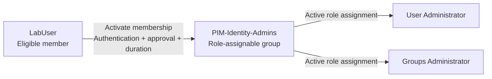

# PIM for Groups: One Activation, Multiple Entra Roles

**One administrative task, two Entra roles, two PIM activations. The task needs permissions, not a collection of activation receipts.**

> **TL;DR**
>
> Assign the required Entra roles to a **role-assignable group as active assignments**. Make the administrator an **eligible member of that group** through **Privileged Identity Management (PIM) for Groups**.
>
> The administrator activates **one group membership**, then receives the roles assigned to the group. The group's membership activation policy controls the duration, approval, and authentication requirements.
>
> This is not a custom role containing other roles. It is a group carrying several role assignments, with temporary membership as the access gate.

---

## The Problem: One Job, Several Roles

Suppose an administrator is eligible for **User Administrator** and **Groups Administrator**. With separate eligible role assignments, the administrator activates each role before using it.

PIM for Groups gives us another arrangement: keep those role assignments active on a group, but make the administrator's membership temporary. One activation opens the access path to both roles.

Our example uses a group named `PIM-Identity-Admins`. Its name is just a naming convention; the `PIM-` prefix does not configure anything. Entra does not execute group names.

**Check whether you actually need both roles.** User Administrator already includes many group-management permissions. We use this pair to demonstrate the mechanism, not to claim that both are always necessary. Review the [built-in role permissions](https://learn.microsoft.com/en-us/entra/identity/role-based-access-control/permissions-reference#user-administrator) before building a production bundle.

---

## The Mental Model: Put Eligibility on Membership

Four terms matter here:

| Term | Meaning in this article |
| --- | --- |
| **Role assignment** | Grants an Entra role to a principal, such as a user or group, at a particular scope. |
| **Role-assignable group** | A cloud group created with `isAssignableToRole = true`, which allows Entra roles to be assigned to it. |
| **Active assignment** | The assignment is already in effect. Its beneficiary does not need to activate it first. |
| **Eligible membership** | The user may request temporary membership through PIM, but is not an active member just because they are eligible. |

Here is the configuration we want:

| Assignment | State |
| --- | --- |
| `PIM-Identity-Admins` receives **User Administrator** | **Active** |
| `PIM-Identity-Admins` receives **Groups Administrator** | **Active** |
| `LabUser` belongs to `PIM-Identity-Admins` | **Eligible**, until activated |

The group keeps its role assignments before, during, and after the user's activation. **PIM changes the user's membership, not the state of those two role assignments.**

While the membership is active, the user benefits from both roles at their assigned scopes. When the temporary membership ends, that access path is removed. Other assignments and application caches still matter; we will verify the result instead of assuming every open session updates instantly.

### Two Similar-Looking Configurations, Different Results

The location of the word **Eligible** changes the workflow:

| User's membership in the group | Group's assignment to the roles | What the user activates |
| --- | --- | --- |
| **Active** | **Eligible** | Each required role separately. This distributes role eligibility to the group's members. |
| **Eligible** | **Active** | **One membership**, giving access to the roles already assigned to the group. This is our design. |

Microsoft documents these [two ways to make users eligible for Entra roles](https://learn.microsoft.com/en-us/entra/id-governance/privileged-identity-management/concept-pim-for-groups#make-a-group-of-users-eligible-for-a-microsoft-entra-role). They solve different problems. Making everything eligible does not turn multiple activation steps into one.

**There is no second role-activation gate in our design.** Requirements configured for individually activating User Administrator or Groups Administrator are not automatically replayed when a user activates group membership. Configure the required controls on the group's **Member** policy.

---

## Before the Lab

Use an isolated test tenant or a scope approved for this exercise. The example grants the roles at **directory scope** for clarity. That is a lab choice, not a recommendation to expand an existing production delegation.

| Item | What you need |
| --- | --- |
| **Setup administrator** | A separate account with **Privileged Role Administrator active** to create the role-assignable group and assign the roles. This account also approves the lab activation. |
| **LabUser** | A cloud test account that will become an **eligible member**, with no other assignments granting the permissions being tested. |
| **Licensing** | Role-assignable groups require Entra ID P1 or P2. Cover **every eligible user and every activation-request approver** with **Entra ID P2 or Microsoft Entra ID Governance** licensing. In this lab, that includes `LabUser` and the setup administrator acting as approver. P1 alone does not provide PIM. |
| **Validation target** | A separate, cloud-managed, non-admin test user named `LabTarget`, prepared beforehand by an authorized User Administrator. We will change and restore one harmless profile field. |
| **Browser sessions** | Separate browser profiles for the setup administrator and `LabUser`, both using the intended tenant. |
| **Tools** | The [Microsoft Entra admin center](https://entra.microsoft.com). No PowerShell module or Azure subscription is needed for this portal walkthrough. |

If the test users do not exist, an authorized User Administrator can create them through **Entra ID > Users > New user > Create new user**. Use fictional lab data and leave `LabTarget` unlicensed unless your lab has another reason to license it. `LabUser` still needs the PIM license listed above. Never perform the validation against a real employee's account.

The setup administrator should record `LabTarget`'s original **Job title** for restoration later. Neither `LabUser` nor `LabTarget` should receive extra administrator roles just to make the lab work.

An Azure subscription **Owner** assignment is not an Entra directory administrator assignment. Same browser, different permission system.

We will configure activation controls **before** making `LabUser` eligible. The sequence is: create the empty group, assign its roles, configure PIM, then grant eligibility.

---

## Lab: Build and Test the Single-Activation Path

### 1. Create an Empty Role-Assignable Group

**As the setup administrator**, open **Entra ID > Groups > All groups > New group**.

Configure these values:

| Setting | Value |
| --- | --- |
| **Group type** | **Security** |
| **Group name** | `PIM-Identity-Admins` |
| **Description** | `Temporary user and group administration through PIM membership.` |
| **Microsoft Entra roles can be assigned to the group** | **Yes** |
| **Membership type** | **Assigned**, not Dynamic |
| **Members** | Leave empty. In particular, do not add `LabUser` here. |
| **Owners** | Only a trusted administrative account, such as the separate setup administrator. Do not make `LabUser` an owner. |

Select **Create** and confirm the warning about the role-assignment capability.

**Expected:** the group exists, is role-assignable, and has no active member named `LabUser`. Record the group's **Object ID** so later checks do not depend only on its display name.

> **This switch is immutable.** You cannot convert an existing ordinary group by enabling it later. Create a new group with the capability from the start. Microsoft documents this in [Create a role-assignable group](https://learn.microsoft.com/en-us/entra/identity/role-based-access-control/groups-create-eligible).

**Why not Owner?** Ownership manages the group; membership is what provides the role access in this design. Owners can also manage membership outside the PIM activation workflow. Owner is not Member with a nicer badge.

### 2. Give the Group Its Two Active Roles

**As the setup administrator**, browse to **ID Governance > Privileged Identity Management > Microsoft Entra roles > Roles**.

1. Select **Add assignments**.
2. Choose **User Administrator**.
3. Select `PIM-Identity-Admins` as the member receiving the role. Select the **group**, not `LabUser`.
4. Use **directory scope** for this isolated lab, then select **Next**.
5. Set **Assignment type** to **Active**.
6. Make the assignment **permanent** if the role's assignment policy permits it, then select **Assign**.
7. Repeat the process for **Groups Administrator**.

If policy forbids permanent active assignments, use approved **time-bound active** assignments whose end times cover setup, activation, and verification after deactivation. Do not relax a tenant-wide role policy just to match a screenshot. The mechanism needs the group-to-role assignments to be **active**, not permanent. If one expires first, membership no longer supplies that role, even if the membership itself is still active.

**Verify:** open each role's active assignments and confirm these two records:

| Principal | Role | State | Scope |
| --- | --- | --- | --- |
| `PIM-Identity-Admins` | User Administrator | Active | Directory |
| `PIM-Identity-Admins` | Groups Administrator | Active | Directory |

If these records are **Eligible**, fix this step before continuing. Also confirm that `LabUser` has not accidentally received a direct active role assignment.

**Permanent roles on the group do not mean permanent roles for every eligible user.** The user's temporary membership is the gate. Any permanent active member, however, would have standing access through that group.

### 3. Bring the Group Under PIM Management

**As the setup administrator**, browse to **ID Governance > Privileged Identity Management > Groups**.

1. Select **Discover groups**.
2. Find and select `PIM-Identity-Admins`, checking its Object ID if names are duplicated.
3. Select **Manage groups**, then **OK**.
4. Return to **Groups** and open the group.

**Expected:** the group is now available in PIM for Groups, with **Assignments** and **Settings** to manage its members and owners.

The group being role-assignable and the group being managed by PIM are **two separate properties**. One allows it to receive Entra roles; the other allows PIM to manage temporary membership or ownership.

> **Onboarding is not an on/off test switch.** Once a group is brought under PIM management, Microsoft does not support taking that same group back out of management. Use a dedicated lab group. See [Bring groups into PIM](https://learn.microsoft.com/en-us/entra/id-governance/privileged-identity-management/groups-discover-groups).

### 4. Configure the Member Activation Policy

**As the setup administrator**, open the group's **Settings > Member > Edit**.

Use these lab settings:

| Setting | Lab value |
| --- | --- |
| **Activation maximum duration** | **1 hour** |
| **Require multifactor authentication on activation** | **Yes** |
| **Require justification on activation** | **Yes** |
| **Require approval to activate** | **Yes** |
| **Approver** | The separate setup administrator. In production, select at least two available approvers for redundancy. |
| **Eligible assignment duration** | Allow the **seven-day** eligibility window used in the next step. |
| **Permanent active member assignments** | Do not allow them for this lab. |

Review the notification recipients and save with **Update**. Configure **Member**, not **Owner**: they have independent policies.

**Verify:** reopen the Member settings and confirm the saved duration, authentication requirement, approval requirement, and approver. An activation request is not a good place to discover that the approver list is empty.

Microsoft [recommends approval](https://learn.microsoft.com/en-us/entra/id-governance/privileged-identity-management/groups-assign-member-owner) for groups used to elevate into Entra roles. This also reduces the risk from someone who can take over an eligible account by resetting its credentials.

**MFA required does not necessarily mean a new MFA prompt every time.** An existing session may already satisfy the requirement. If fresh authentication or a particular authentication strength is required, use a properly configured **Conditional Access authentication context** in the group policy. That is a separate policy design, not an extra checkbox we silently assume exists. See [PIM for Groups settings](https://learn.microsoft.com/en-us/entra/id-governance/privileged-identity-management/groups-role-settings).

### 5. Make LabUser an Eligible Member

**As the setup administrator**, stay on the group in PIM and open **Assignments > Add assignments**.

1. Under **Select role**, choose **Member**.
2. Select `LabUser`, then select **Next**.
3. Set **Assignment type** to **Eligible**.
4. Set the eligibility window to start now and end in **seven days**, within the saved policy limits.
5. Select **Assign**.

**Expected:** `LabUser` appears under **Eligible assignments** as **Member**. The user must not appear as an active member before activation.

There are different clocks here:

| Clock | Example | What it means |
| --- | --- | --- |
| **Group's role assignment lifetime** | Permanent, or the approved active lab window | How long the group carries each role. |
| **User's eligibility window** | Seven days | How long the user is allowed to request activation. |
| **Maximum activation duration** | One hour | The limit imposed by the Member policy. |
| **Requested activation duration** | Thirty minutes | How long this particular activation is requested to last. |

**Eligible for a week does not mean administrator for a week.** It means the user can request time-limited membership during that week.

### 6. Establish the Baseline, Then Activate Once

**Switch to the `LabUser` browser profile.** Confirm the account and tenant before doing anything else.

First, establish the negative test: under **Entra ID > Users > All users**, open `LabTarget` and try to edit its **Job title** in **Properties**. The edit should be unavailable or fail authorization. Do not substitute `LabUser`'s own profile: users can update some of their own attributes without an admin role.

**Expected before activation:** `LabUser` cannot save this change to `LabTarget`. If it succeeds, stop and identify the existing permission path. A user who already has the permission cannot prove that this PIM activation supplied it. Restore any accidental change through an authorized account.

Now request the membership:

1. Open **ID Governance > Privileged Identity Management > My roles > Groups**.
2. Under **Eligible assignments**, find `PIM-Identity-Admins` with the role **Member**.
3. Select **Activate**.
4. Request **30 minutes**, starting now, and enter a reason such as `Validate the user and group administration lab`.
5. Complete the authentication checks presented by the configured policy, then submit with **Activate**.
6. In the **setup administrator's** browser profile, open **PIM > Approve requests > Groups**. Review the user, group, justification, and duration. Select the request, choose **Approve**, enter the approval justification, then select **Confirm**. Approvers cannot approve their own requests.
7. Back as `LabUser`, check **My requests > Groups** and the group's active assignment under **My roles > Groups**.

**Expected:** the membership becomes **Active** with an end time. A request marked **Pending approval** has not yet supplied the membership.

You activated one **Member** assignment. Do not now activate User Administrator and Groups Administrator individually; that would introduce a second access path and invalidate this demonstration.

### 7. Verify the Access Path and a Real Operation

Check configuration and behavior separately:

| Check | Who checks it | Expected result |
| --- | --- | --- |
| PIM group **Assignments > Active assignments** | Setup administrator | `LabUser` is an active **Member**, with the activation's end time. |
| Group's **Members** in Entra ID | Setup administrator | `LabUser` is currently a member. |
| Each Entra role's active assignments | Setup administrator | The group still has both active role assignments at the intended scope. |
| Edit `LabTarget`'s Job title | `LabUser` | The previously unauthorized operation now succeeds. |

For the operational test, refresh the Entra admin center in the `LabUser` profile. If it still reflects the old access state, sign out and back in **as the same user**, then retry after the membership change has propagated.

Open **Entra ID > Users > All users > LabTarget > Properties**. Set **Job title** to `PIM lab validation`, save, and reload the profile to confirm the value persisted. Then restore the original value **before ending the activation**.

**Expected:** the edit succeeds only after activation in this isolated test, and the original value is restored while the required access is still active.

This operation proves a useful User Administrator permission. It does **not** independently prove Groups Administrator: the two roles overlap. Creating an ordinary group is an especially weak test because tenant settings may allow non-admin users to do that already. To establish the two-role grant, verify **both active role assignments to the group plus the user's active membership**, as shown above.

> **Membership and application authorization are different checks.** Microsoft documents rapid membership changes, but an application may cache membership or permissions. A successful PIM request is not proof that every application has refreshed its authorization state. See [Activate group membership](https://learn.microsoft.com/en-us/entra/id-governance/privileged-identity-management/groups-activate-roles).

### 8. End the Activation and Verify Again

**As `LabUser`**, open **PIM > My roles > Groups > Active assignments** and select **Deactivate** for the membership, or let the activation reach its end time. To test scheduled expiration specifically, let the timer run out.

**As the setup administrator**, verify:

1. The temporary active Member assignment is no longer active in PIM.
2. `LabUser` is no longer in the group's current **Members** list.
3. The group's two role assignments are still active, provided their own assignment windows have not ended.
4. `LabUser` remains **eligible** until the seven-day eligibility window ends, unless that eligibility was separately removed.

**As `LabUser`**, use a newly authenticated browser session and repeat the `LabTarget` edit check after deactivation has propagated.

**Expected:** the operation is denied again when this group was the only relevant access path. If an unexpected edit succeeds, have an authorized account restore the original value and investigate before calling the lab complete.

Do not promise instant revocation in every already-open application. Issued tokens, cached permissions, and other direct or group-based assignments can affect what the user can still do. Check actual membership removal first, then the application's access state. A stale browser tab is not an audit report.

---

## Guardrails Before Reusing This in Production

| Decision | Why it matters |
| --- | --- |
| **Bundle by task, not by job title alone** | Every activation grants every role assigned to the group. A user needing one small task should not automatically acquire unrelated privileged roles. |
| **Keep scopes narrow** | Grouping does not require tenant-wide grants. Use supported administrative-unit scopes when appropriate, and verify each role assignment's scope. |
| **Protect owners and membership administrators** | Authorized administrators and owners can change membership outside PIM. Turning off permanent active membership in the PIM policy does not remove those separate management permissions. |
| **Review all access paths** | Existing direct roles or membership in another privileged group can leave access in place after this activation expires. Do not remove existing assignments until the replacement is approved and tested. |
| **Control changes to the bundle** | Adding another active role to the group expands what its members receive. Treat that as a permission change, not group housekeeping. |
| **Retain approval and audit evidence** | Review group membership activations and group-to-role assignment changes, not just individual role activations. |
| **Keep emergency access separate** | An emergency access account should not depend on this normal activation workflow. |
| **Keep PIM licensing active** | Finish lab cleanup before a trial expires. License expiry is not a supported substitute for revoking privileged assignments; review the [documented expiry behavior](https://learn.microsoft.com/en-us/entra/id-governance/licensing-fundamentals#what-happens-to-pim-when-a-license-expires). |

Role-assignable groups require **Assigned** membership. Do not use a synchronized or dynamic group for this walkthrough, and do not try to implement the bundle by adding other groups as active members. Active group nesting is not supported for role-assignable groups. See [role-assignable group restrictions](https://learn.microsoft.com/en-us/entra/identity/role-based-access-control/groups-concept#restrictions-for-role-assignable-groups).

**Do not assume all Microsoft 365 roles have the same activation behavior.** For just-in-time roles used in SharePoint, Exchange, or Microsoft Purview, Microsoft recommends **active group membership plus an eligible role assignment**, using PIM for Entra roles, to avoid significant permission-propagation delays. That is the other model from our comparison table. Check the [workload-specific guidance](https://learn.microsoft.com/en-us/entra/id-governance/privileged-identity-management/concept-pim-for-groups#make-a-group-of-users-eligible-for-a-microsoft-entra-role) before expanding this example.

---

## When the Result Does Not Match the Diagram

| Symptom | First thing to check |
| --- | --- |
| The group cannot be selected for an Entra role | Was it created with `isAssignableToRole = true`? An ordinary group cannot be converted later. |
| The group is missing from PIM | Was it brought under management through **Discover groups**, and are you in the correct tenant? |
| `LabUser` cannot request membership | Check **Member** eligibility, its start/end dates, and the account used to sign in. |
| The request stays pending | Check the configured approvers and **My requests > Groups**. Pending is not active. |
| Membership is active, but the expected roles are not usable | Check that the group's role assignments are **Active**, their scope and dates, and application/session propagation. |
| The user activated Owner but received no role access | Ownership alone is not the membership grant used in this design. |
| Access remains after membership ends | Check other assignments, actual membership removal, and application caches before changing the policy. |

---

## Clean Up the Lab

**As the setup administrator**, first confirm that `LabTarget`'s original profile value has been restored and the temporary membership has ended.

1. In the group's PIM **Assignments**, remove `LabUser`'s **eligible Member** assignment. Deactivation and removal of eligibility are different operations.
2. Under each Entra role's assignments, remove the active assignment granted to the lab group.
3. Verify the group no longer carries either role and has no unexpected members.
4. Delete the dedicated lab group if it has no other use. There is no separate supported "disable PIM for this group" rollback.
5. Have an authorized User Administrator delete the disposable test accounts only if they were created exclusively for this lab.

PIM enforces a minimum five-minute interval before a newly created assignment can be removed. If cleanup is rejected immediately after setup, respect that interval and retry; do not work around it by changing unrelated policies. A deleted group can also remain visible in the PIM list for up to 24 hours.

---

## The Takeaway

For one activation to provide several Entra roles, put **active role assignments on the group** and **eligible membership on the user**. Apply the activation controls to **Member**, protect the people who can change the group, and test both entry and exit.

One activation, several roles, still a defined scope and an expiry time. Less clicking is useful. Less control is not part of the deal.

---

## Sources

- [PIM for Groups: concepts and the two eligibility models](https://learn.microsoft.com/en-us/entra/id-governance/privileged-identity-management/concept-pim-for-groups)
- [Use Entra groups to manage role assignments](https://learn.microsoft.com/en-us/entra/identity/role-based-access-control/groups-concept)
- [Create a role-assignable group](https://learn.microsoft.com/en-us/entra/identity/role-based-access-control/groups-create-eligible)
- [Assign Microsoft Entra roles in PIM](https://learn.microsoft.com/en-us/entra/id-governance/privileged-identity-management/pim-how-to-add-role-to-user)
- [Bring groups into PIM](https://learn.microsoft.com/en-us/entra/id-governance/privileged-identity-management/groups-discover-groups)
- [Configure PIM for Groups settings](https://learn.microsoft.com/en-us/entra/id-governance/privileged-identity-management/groups-role-settings)
- [Assign eligible group membership or ownership](https://learn.microsoft.com/en-us/entra/id-governance/privileged-identity-management/groups-assign-member-owner)
- [Activate group membership or ownership](https://learn.microsoft.com/en-us/entra/id-governance/privileged-identity-management/groups-activate-roles)
- [Approve activation requests for groups](https://learn.microsoft.com/en-us/entra/id-governance/privileged-identity-management/groups-approval-workflow)
- [Microsoft Entra built-in role permissions](https://learn.microsoft.com/en-us/entra/identity/role-based-access-control/permissions-reference)
- [Microsoft Entra ID Governance licensing fundamentals](https://learn.microsoft.com/en-us/entra/id-governance/licensing-fundamentals)