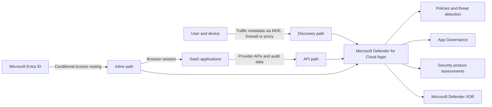

# What Microsoft Defender for Cloud Apps Actually Does

**Your users did not wait for a security review before adopting SaaS. MDCA is where we find out what they connected, what they are doing, and whether we can still stop it.**

> 🎯 **TL;DR** — Microsoft Defender for Cloud Apps (MDCA) is more than a Cloud Access Security Broker (CASB), a control layer between users and cloud services. It combines traffic discovery, SaaS APIs, behavioral detections, OAuth app governance, posture assessments, and browser session controls. Each capability sees a different slice of reality.

---

## The SaaS Problem

Traditional security had convenient places to inspect traffic:

- the corporate firewall;
- the managed endpoint;
- the datacenter proxy;
- the application server;
- the identity provider.

SaaS broke that comfortable model.

A user can authorize an OAuth application from a personal phone, upload corporate data to an unknown storage service, or access SharePoint from an unmanaged browser. The application and the data are no longer behind your firewall. In many cases, neither is the user.

That creates several different blind spots:

| Question | Why the answer is difficult |
|---|---|
| Which cloud apps are employees using? | The apps might never be registered or approved by IT. |
| What happens inside an approved SaaS app? | Network traffic shows a connection, not the business action performed through it. |
| Is the SaaS tenant securely configured? | Every provider has different controls, APIs, and audit formats. |
| Which third-party apps can access corporate data? | OAuth consent can give an app durable access without another interactive sign-in. |
| Can we stop a risky action during the session? | An API alert raised after the download is accurate but slightly late for the file. |

MDCA exists because none of those questions can be answered from a single telemetry source.

---

## The Mental Model: Three Data Paths, Several Security Engines

MDCA has no magic sensor watching everything. It assembles visibility from three different paths:

### Discovery path

MDCA analyzes traffic metadata collected from Microsoft Defender for Endpoint, firewalls, proxies, or secure web gateways.

This path answers:

- Which SaaS apps are being used?
- By which users and devices?
- How much traffic is generated?
- Is the app considered risky or noncompliant?

It is excellent for finding **Shadow IT**.

It does not automatically reveal what a user did inside the application. Seeing 800 MB sent to a cloud storage provider is not the same as seeing a specific file-sharing operation in the provider's audit log.

### API path

MDCA connects directly to supported SaaS platforms through their APIs. Depending on the provider, it can collect accounts, activities, administrative operations, files, permissions, or configuration data. Some providers also expose governance actions.

This path answers:

- What happened inside a connected application?
- Which account performed the action?
- Which files or resources were involved?
- Can MDCA suspend the account, remove a permission, or perform another response action?

The API path is **out-of-band**. MDCA consumes what the provider makes available, when the provider makes it available. API throttling, audit latency, licensing, and provider limitations all matter.

An API connector is a window into a SaaS platform, not a tiny Microsoft agent secretly living inside it.

### Inline path

Conditional Access App Control can route supported browser sessions through MDCA. This allows MDCA to monitor or control selected actions while they happen.

This path answers:

- Should this user access the application from this context?
- Can the user view a file but not download it?
- Should a sensitive download be blocked or protected?
- Should an upload be inspected during the session?

This is the path used when detecting the download tomorrow morning would be a little too late.

Inline control has a narrower scope than many diagrams suggest. Browser sessions, supported protocols, application compatibility, and native clients must all be considered. We will dissect that machinery later in the series.

---

## What MDCA Actually Provides

Instead of memorizing portal menus, map MDCA to the security questions it can answer.

### 1. Discover unmanaged SaaS

**Cloud Discovery** identifies applications from network traffic and compares them with the Cloud App Catalog. The catalog adds security, legal, and compliance context so that a hostname becomes a risk decision instead of another line in a proxy log.

Typical outcome:

1. Discover an unknown file-sharing service.
2. Identify who uses it and how heavily.
3. Evaluate its risk profile.
4. Mark it as sanctioned or unsanctioned.
5. Monitor or block it through an integrated enforcement point.

> Marking an app **Unsanctioned** is a decision. Something else still needs to enforce that decision, such as Defender for Endpoint or a supported network appliance.

### 2. Observe activity inside connected apps

API connectors provide deeper visibility into sanctioned services such as Microsoft 365 and supported third-party platforms.

The exact visibility is provider-specific. One connector might expose users, groups, files, administrative actions, and governance. Another might expose only part of that list.

This is a recurring MDCA rule:

> **Supported app** does not mean **identical capability**.

### 3. Detect suspicious behavior

MDCA evaluates activities with built-in detections, custom policies, threat intelligence, User and Entity Behavior Analytics (UEBA), and machine learning.

Examples include:

- unusual downloads;
- suspicious administrative activity;
- activity from unexpected infrastructure;
- risky OAuth application behavior;
- activity inconsistent with the user's baseline.

A detection is not proof of compromise. It is a claim supported by evidence that still needs to be investigated.

MDCA alerts feed Microsoft Defender XDR, where they can be correlated with endpoint, identity, email, and other signals. MDCA provides one part of the attack story; XDR attempts to assemble the chapters.

### 4. Assess SaaS configuration

SaaS Security Posture Management (SSPM) looks for risky configuration states in supported connected applications and surfaces recommended changes, including through Microsoft Secure Score.

This is different from threat detection:

- Threat detection asks: **Did something suspicious happen?**
- SSPM asks: **Is this SaaS tenant configured in a way that makes something bad easier?**

A weak sharing policy is not an attack. It is an invitation.

### 5. Govern OAuth applications

OAuth applications can retain access to data through granted permissions and tokens. The user might be offline while the application continues to call APIs.

App Governance helps identify:

- which applications have access;
- which permissions they received;
- which users granted access;
- how the applications use APIs and data;
- which applications behave abnormally;
- when an application should be disabled or its consent revoked.

This capability matters because the attacker is not always operating a keyboard. Sometimes the attacker is an application with a refresh token and excellent uptime.

For the identity objects and permission models behind this, see:

- [Understanding App Registration, Enterprise Application, and Service Principal in Azure AD](../../../010%20-%20Entra%20ID/Applications/Understanding%20App%20Registration,%20Enterprise%20Application,%20and%20Service%20Principal%20in%20Azure%20AD.md)
- [Understanding Entra ID API Permissions - Scopes, App Roles & Application Permissions](../../../010%20-%20Entra%20ID/Applications/Understanding%20Entra%20ID%20API%20Permissions%20-%20Scopes,%20App%20Roles%20&%20Application%20Permissions.md)

### 6. Control selected sessions in real time

Conditional Access App Control adds controls after the authentication decision and during the browser session.

That distinction matters:

- Microsoft Entra Conditional Access decides whether the authentication context satisfies an access policy.
- MDCA session control can inspect and restrict actions performed after access is granted.

Examples include blocking a sensitive download from an unmanaged device, protecting the file instead of blocking it, or monitoring a risky browser session.

Authentication answered **who gets through the door**. Session control watches what happens after the door opens.

---

## Where MDCA Ends and the Other Products Begin

Microsoft security products overlap because attackers do not respect product boundaries. The overlap is useful, but the responsibilities are not interchangeable.

| Product | Primary job | Relationship with MDCA |
|---|---|---|
| **Microsoft Entra ID** | Identity, authentication, authorization, and Conditional Access | Supplies identity context and can route sessions to MDCA controls. |
| **Microsoft Defender for Endpoint** | Endpoint detection, response, and device control | Supplies endpoint-based Cloud Discovery data and can enforce blocking of unsanctioned apps. |
| **Microsoft Purview** | Data classification, labeling, DLP, and compliance | Supplies sensitivity, classification, and DLP controls used in supported MDCA and Edge scenarios. |
| **Microsoft Defender XDR** | Cross-domain alert correlation, investigation, and response | Receives MDCA detections and correlates them with other security signals. |
| **Microsoft Sentinel** | SIEM and SOAR across Microsoft and third-party sources | Extends retention, hunting, correlation, and automation beyond the Defender stack. |

MDCA is therefore best understood as the **SaaS security control plane** in that ecosystem. It discovers cloud use, consumes SaaS telemetry, analyzes behavior and configuration, governs app-to-app access, and controls selected sessions.

It does not replace the identity provider, endpoint agent, data classification engine, XDR platform, or SIEM.

---

## What MDCA Is Not

These assumptions create bad designs:

| Assumption | Reality |
|---|---|
| MDCA sees every SaaS app automatically. | Discovery requires traffic data, and deep visibility requires supported integrations. |
| Connecting an app places MDCA inline. | API connectors are out-of-band. They do not proxy the user's session. |
| Marking an app unsanctioned blocks it everywhere. | Enforcement depends on an integrated endpoint or network control. |
| Every connector exposes the same data and actions. | Capabilities depend on the provider API and its license. |
| Every MDCA control is real time. | Discovery, APIs, detections, and inline controls have different timing models. |
| Conditional Access App Control protects every client. | Session controls mainly target supported interactive browser sessions; native clients require separate design decisions. |
| MDCA replaces Purview DLP. | MDCA can use data classification and protection, but Purview owns the broader data security and compliance layer. |
| An alert means the user is compromised. | It means a detection found evidence worth investigating. |

The portal may put these capabilities under one **Cloud Apps** menu. That does not make their telemetry, latency, or enforcement model identical.

---

## Quick Test: Map What Your Tenant Can Actually See

This first test is intentionally read-only. The goal is not to enable everything. It is to identify which MDCA data paths already exist in your tenant.

### Prerequisites

- Access to the [Microsoft Defender portal](https://security.microsoft.com/).
- A role appropriate for reading the environment.
- **Global Reader** provides broad read-only access. **Security Reader** can inspect many MDCA views but cannot access several settings and connector pages.
- Do not use Global Administrator just to browse a security portal. That is not exploration; that is unnecessary blast radius.

### Step 1 — Check Cloud Discovery

Open **Cloud Apps > Cloud Discovery**.

Record:

- whether discovered applications exist;
- whether users and devices are identified;
- the latest data timestamp;
- whether the data appears to come from Defender for Endpoint, network logs, or another integration.

If the page is empty, do not conclude that the company uses no SaaS. Conclude that no usable discovery pipeline has populated the page yet.

### Step 2 — Check connected applications

If your role allows it, open **Cloud Apps > Connected apps**.

Record each connector and its status. Then compare that list with the applications visible in Cloud Discovery.

The lists should not be identical:

- a **discovered app** was observed in traffic;
- a **connected app** exposes data through an API;
- a **Conditional Access App Control app** can participate in inline controls.

One application can appear in more than one category because these are different relationships, not duplicate inventory records.

### Step 3 — Inspect the Activity Log

Open **Cloud Apps > Activity log** and review a recent activity.

Check:

- the source application;
- the user;
- the IP address;
- the activity type;
- the raw data, when available.

Ask the useful question: **Which integration produced this event?**

If there are rich business actions but no corresponding Cloud Discovery entry, that is possible. API telemetry and traffic discovery are separate pipelines.

### Step 4 — Inventory the security engines

Without changing anything, review the areas available for:

- policy management;
- App Governance or OAuth application visibility;
- security configuration recommendations for connected SaaS apps;
- Conditional Access App Control.

Record whether each area is:

- available and populated;
- available but empty;
- unavailable because of permissions;
- unavailable because of licensing or configuration.

Do not guess why a page is empty. An empty page, an authorization error, and a missing feature are three different findings.

### Expected result

At the end, build this small map:

| Capability | Populated? | Data source or dependency | What it proves |
|---|---:|---|---|
| Cloud Discovery | Yes / No | MDE, firewall, proxy, or gateway | Traffic-based SaaS visibility exists. |
| Connected apps | Yes / No | Provider API | Deep SaaS telemetry might be available. |
| Activity log | Yes / No | Connected services and integrations | MDCA is receiving auditable activities. |
| App Governance | Yes / No | Supported app and required permissions | OAuth app visibility is available. |
| SSPM recommendations | Yes / No | Supported connected app | SaaS configuration assessment is active. |
| Session controls | Yes / No | Entra Conditional Access and supported app | An inline control path is configured. |

There is no cleanup because nothing was changed.

---

## The One Thing to Remember

MDCA is not a single product behavior hidden behind a large portal. It is a collection of security capabilities built on data paths with very different properties.

When troubleshooting or designing MDCA, always ask three questions:

1. **Where did the signal come from?**
2. **Is the control out-of-band or inline?**
3. **Which product performs the final enforcement?**

If those answers are unclear, adding another policy will not improve the architecture. It will only create a more sophisticated mystery.

The next article will open each data path and show exactly what MDCA can see through traffic discovery, SaaS APIs, and inline session control.

---

## References

- [Microsoft Defender for Cloud Apps overview](https://learn.microsoft.com/en-us/defender-cloud-apps/what-is-defender-for-cloud-apps)
- [Get started with Microsoft Defender for Cloud Apps](https://learn.microsoft.com/en-us/defender-cloud-apps/get-started)
- [Discover and manage Shadow IT](https://learn.microsoft.com/en-us/defender-cloud-apps/tutorial-shadow-it)
- [Connect apps with API connectors](https://learn.microsoft.com/en-us/defender-cloud-apps/enable-instant-visibility-protection-and-governance-actions-for-your-apps)
- [App Governance in Microsoft Defender for Cloud Apps](https://learn.microsoft.com/en-us/defender-cloud-apps/app-governance-manage-app-governance)
- [Conditional Access App Control](https://learn.microsoft.com/en-us/defender-cloud-apps/proxy-intro-aad)
- [Configure admin access](https://learn.microsoft.com/en-us/defender-cloud-apps/manage-admins)
