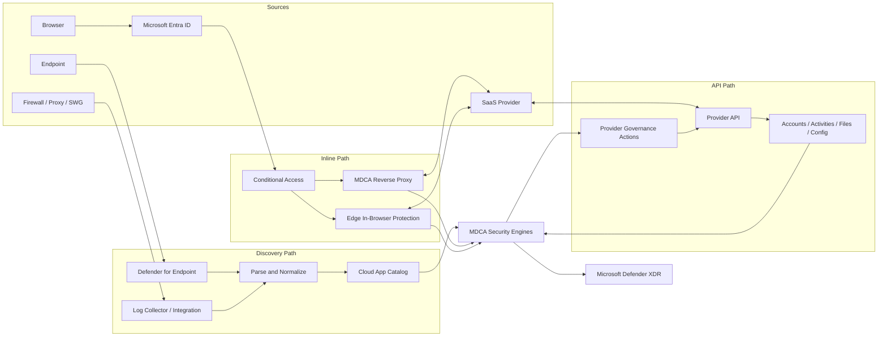
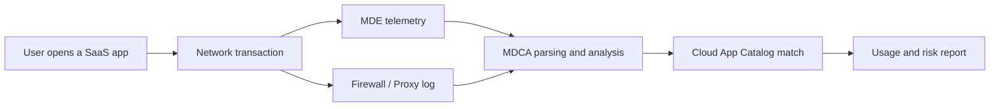
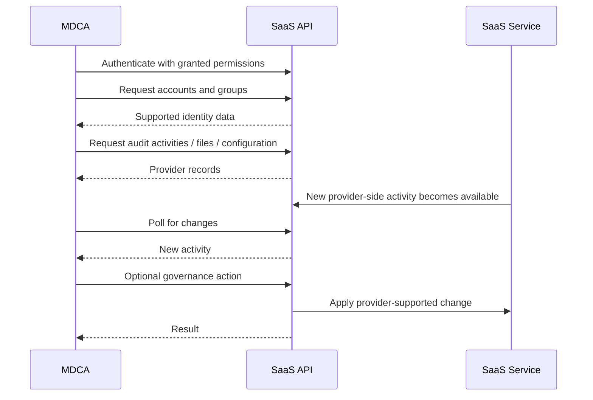
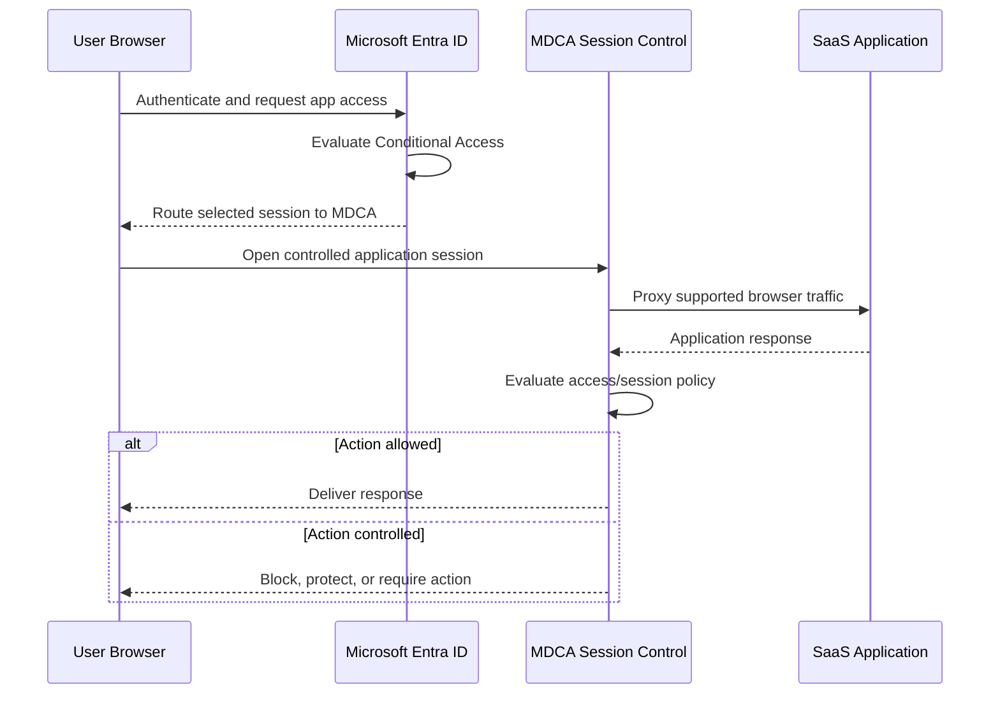

# How MDCA Sees and Controls SaaS — Architecture and Data Paths

**One SaaS app can appear as discovered, API-connected, and session-controlled. Same logo, three completely different security relationships.**

> 🎯 **TL;DR** — Microsoft Defender for Cloud Apps (MDCA) has three main data paths. **Cloud Discovery** analyzes traffic metadata, **App Connectors** pull data from provider APIs, and **Conditional Access App Control** sits in selected interactive sessions. Discovery tells you that an app is used. APIs tell you what happened inside it. Inline control can stop selected actions while they happen. Mixing those paths is how people end up troubleshooting the wrong pipe.

The [first article](./1.%20What%20Microsoft%20Defender%20for%20Cloud%20Apps%20Actually%20Does.md) mapped the problems MDCA solves. Now we open the hood.

---

## One Product, Three Security Relationships

Suppose a user opens Dropbox from a managed laptop and downloads a file.

MDCA might learn about that sequence in three different ways:

1. **Defender for Endpoint reports a network connection to Dropbox.**
2. **The Dropbox API reports a file download performed by the user.**
3. **Conditional Access App Control observes or blocks the download in the browser session.**

Those are not duplicate events. They answer different questions.

| Relationship | What MDCA learns | Typical timing | Can it enforce? |
|---|---|---|---|
| **Discovered app** | The service was accessed, by whom or from where, and with how much traffic—depending on the source log | Batch processing | Indirectly, through MDE, an SWG, firewall, or exported block script |
| **API-connected app** | Accounts, audit activities, files, permissions, or configuration—depending on the provider API | Out-of-band; near-real-time to delayed | Through provider-supported governance actions |
| **Session-controlled app** | Selected actions inside an interactive session | Inline | Yes, during supported browser sessions |

The distinction is simple:

- **Discovery watches traffic around the app.**
- **An API connector asks the app what happened.**
- **Session control participates in the live conversation.**

A network connection, an audit event, and an intercepted browser action may describe the same human moment, but they are not the same evidence.

---

## The Full Data Flow



The diagram looks unified because all roads reach the Defender portal. Underneath, the roads have different owners, schemas, clocks, and failure modes.

That last part matters during an incident. If an activity is missing, the useful question is not “Why is MDCA broken?” It is “Which path was supposed to produce this evidence?”

---

# 1. Discovery Path — Seeing SaaS from Traffic

Cloud Discovery turns network records into an inventory of cloud applications.

It does not require MDCA to authenticate to every service. Instead, it uses data already produced by endpoints, firewalls, proxies, or Secure Web Gateways (SWGs).



## What the source can provide

Depending on the telemetry source and log format, MDCA may receive:

- destination URL or IP address;
- username;
- source IP address;
- device context;
- uploaded and downloaded bytes;
- total traffic;
- timestamp.

The phrase **depending on the source** is doing heavy lifting here. A proxy log containing URL, username, and byte counts produces richer discovery than a firewall log containing only source and destination IP addresses.

MDCA parses the records, matches destinations against the Cloud App Catalog, and generates usage and risk information. The catalog contains more than 31,000 cloud applications assessed against more than 90 risk factors.

If an application is not in the catalog, MDCA does not discover it by default. A custom application can be defined, but the platform cannot classify a mystery hostname using positive thinking.

## Defender for Endpoint integration

For supported devices onboarded to Microsoft Defender for Endpoint (MDE), the integration reuses endpoint network transaction telemetry.

This has two practical advantages:

- visibility follows the device outside the corporate network;
- user and device context can be attached to SaaS usage.

No traffic mirroring or on-premises collector is required for this path. MDE collects the network transactions and sends the relevant discovery data to MDCA.

The integration is not just for visibility. With the required MDE Network Protection configuration, applications tagged **Unsanctioned** in MDCA can be blocked on integrated endpoints.

> **Unsanctioned** is metadata until an enforcement point acts on it.

The tag can drive MDE or a supported network integration. It does not cast a global blocking spell over every device in the company.

## Firewall, proxy, and SWG logs

For network-wide coverage, MDCA can analyze logs from supported firewalls, proxies, and SWGs.

There are several ingestion models:

- manual upload for a snapshot report;
- automatic upload through an MDCA log collector;
- native SWG integrations;
- Cloud Discovery API ingestion.

The log collector receives records from network appliances over configured mechanisms such as Syslog or FTP/FTPS, then uploads them to MDCA. The service parses each format with the appropriate parser before matching the traffic against the catalog.

This path covers devices that might not run MDE, but only when their traffic crosses the observed network control. A laptop using a coffee-shop Wi-Fi connection will not magically send its firewall logs back to headquarters.

## What Discovery knows—and what it does not

Cloud Discovery is good at answering:

- Which applications are being used?
- Which users, IP addresses, or devices use them?
- How much traffic is involved?
- Is usage increasing?
- Does the provider meet selected security or compliance criteria?

It is not designed to answer:

- Which exact file was downloaded?
- Which sharing permission changed?
- Which OAuth scope was granted?
- Which administrator disabled a security setting inside the SaaS tenant?

A 400 MB upload to a storage service is useful evidence. It is not a filename, a business justification, or proof of exfiltration.

## Discovery timing

Cloud Discovery is an analytics pipeline, not a packet capture screen.

The general flow is:

```text
Collect → Upload → Parse → Match Catalog → Aggregate → Report
```

Uploaded logs can take from minutes to hours to process, depending on volume. Microsoft documents Cloud Discovery analysis and updates four times per day. When the MDE integration is first enabled, initial data can take up to two hours to appear.

If you press refresh twelve times, the batch pipeline remains emotionally unaffected.

---

# 2. API Path — Asking the SaaS Provider What Happened

Cloud Discovery sees the application from the outside. An App Connector gives MDCA an authenticated view through the provider's API.



## Initial connection and scan

The exact flow varies by provider, but the pattern is roughly:

1. MDCA stores the authorized connection and permissions.
2. It requests the available account and group inventory.
3. It starts collecting supported activities, files, permissions, or configuration data.
4. It continues to poll the provider for changes.

The first scan can take time. Large user directories, long audit backlogs, file inventories, API rate limits, and provider licensing all affect completion.

Some data may appear before the full scan finishes. That does not mean the historical inventory is complete.

## Capability is negotiated by the provider

An App Connector can potentially expose:

- accounts, groups, roles, and account status;
- sign-in, user, and administrative activities;
- file and sharing information;
- OAuth permissions;
- security configuration assessments;
- account, permission, or file governance actions.

But each provider exposes a different subset.

| Connector question | Possible answer |
|---|---|
| Can MDCA list accounts? | Yes, no, or only with a specific provider license |
| Can it collect administrative activity? | Full, partial, delayed, or unsupported |
| Can it inspect files? | Periodic, change-triggered, or unavailable |
| Can it revoke permissions? | Depends on provider capability and granted rights |
| Can it assess SaaS configuration? | Only for supported SSPM integrations |
| Can it suspend a user? | Only where the provider exposes and permits that action |

This is why “the connector is connected” is not a test plan.

A valid deployment checks the capability matrix for the exact app, provider edition, tenant configuration, and use case.

## The Activity Log is normalized—but not invented

MDCA centralizes activities from connected services in the Activity Log. It adds investigation context such as user and IP insights, policy matches, location, and tags.

However, the underlying event still comes from the source service.

For third-party applications, activity types and fields are based on the provider API. MDCA does not redefine what a Salesforce, ServiceNow, or other provider event means. When an activity looks strange, **View raw data** and the provider's audit documentation are often more useful than guessing from the friendly display name.

## Governance travels back through the API

Some connectors allow MDCA to perform actions such as:

- suspend a user;
- require the user to sign in again;
- confirm a user as compromised;
- revoke an app permission;
- remove external sharing;
- quarantine or change a file;
- apply a supported protection action.

The action is not performed by a universal MDCA control channel. MDCA calls the provider API, and the provider applies the change.

That creates three operational consequences:

1. The connector requires meaningful privileges.
2. Provider limitations still apply during remediation.
3. MDCA connector egress addresses can appear in the provider's own audit logs.

The **Governance log** records the result of these tasks. Always verify success there. A policy deciding to suspend an account and the SaaS platform actually suspending it are two separate events.

## API timing and throttling

The API path is asynchronous.

```text
User action
    ↓
Provider creates an audit event
    ↓
Provider makes the event available through its API
    ↓
MDCA polls and retrieves it
    ↓
MDCA evaluates policies and detections
```

Latency can be introduced at every arrow.

Provider API limits, dynamic collection windows, data volume, tenant size, and licensing all matter. Large operations—such as scanning an entire file inventory—can take hours or days.

“Near real time” is a useful product category. It is not a stopwatch guarantee.

---

# 3. Inline Path — Controlling the Live Session

The Discovery and API paths observe activity from the side or after the provider records it. Conditional Access App Control can participate in the interactive session itself.

For Microsoft Entra-integrated applications, the high-level flow is:



## Why the URL can change

In the reverse-proxy experience, browsers other than the supported Edge in-browser path can display an `*.mcas.ms` suffix. MDCA rewrites the session routing so that relevant browser traffic passes through its control plane.

This allows policies to react during the session rather than waiting for the SaaS audit API.

Examples include:

- block a download from an unmanaged device;
- protect a downloaded file;
- block an upload;
- inspect selected content;
- monitor actions in a risky session;
- require an authentication context for a sensitive action.

Microsoft Edge for Business can use in-browser protection for supported scenarios, avoiding the visible reverse-proxy URL rewrite. That experience is still documented as preview at the time of writing.

## Access control versus session control

These terms are close enough to be dangerous.

| Control | Decision point | Example |
|---|---|---|
| **Entra Conditional Access** | During authentication and token issuance | Require a compliant device or phishing-resistant MFA |
| **MDCA access policy** | When the controlled app is accessed | Block access to a selected SaaS app from an unmanaged device |
| **MDCA session policy** | During supported actions inside the session | Allow viewing but block downloading a sensitive file |

Entra decides whether the session meets identity and device conditions. MDCA can then apply controls to what happens in the selected application session.

## Inline does not mean universal

Session controls apply to supported interactive browser sessions. Native desktop and mobile clients, noninteractive authentication, application compatibility, and protocol support require separate validation.

A classic example is Microsoft Teams:

- browser access can participate in supported session controls;
- the Teams desktop client does not support those session controls.

If native clients remain allowed, users may have another path to the same data. A beautiful browser policy does not secure a client it never sees.

The reverse proxy also does not store session data at rest. Microsoft states that its proxy servers cache only public content according to HTTP caching requirements. This is an enforcement path, not a screen-recording archive.

---

## Why the Three Paths Do Not Magically Merge

The Defender portal gives a unified experience, but the pipelines remain distinct.

Consider these situations:

### The app appears in Cloud Discovery but not in the Activity Log

Likely explanation: traffic to the service was observed, but no API connector provides deep audit activity.

### The Activity Log contains events, but Cloud Discovery shows little usage

Likely explanation: the API connector sees provider-side actions, while the user's traffic does not cross an observed discovery source—or the event was generated by an app, service account, or backend process.

### The app is connected through an API but downloads are not blocked

Likely explanation: an API connector is out-of-band. Blocking during download requires an inline control path or another enforcement technology.

### A session policy works in a browser but not in a desktop client

Likely explanation: the browser is on the inline path; the native client is not.

### A governance action is configured but nothing changes in the SaaS app

Likely explanation: the policy matched, but the provider action failed, was unsupported, lacked permission, or was later overwritten by another identity source. Check the Governance log and provider audit trail.

The fastest MDCA troubleshooting technique is to draw the expected path before opening the portal.

---

## Visibility, Detection, and Enforcement Are Separate Layers

A useful architecture separates three questions:

```text
Can I see it?
    ↓
Can I decide whether it is risky?
    ↓
Can I enforce a response?
```

| Path | Visibility | Detection | Enforcement |
|---|---|---|---|
| **Cloud Discovery** | App usage and risk from traffic metadata | Discovery policies and usage anomalies | MDE, SWG, firewall, proxy, or exported block controls |
| **API Connector** | Provider-exposed accounts, activities, files, permissions, and configuration | Activity policies, anomaly detection, SSPM, and other MDCA engines | Provider-supported governance actions |
| **Inline Control** | Selected actions in a live interactive session | Access and session policy evaluation | Immediate block, monitor, protect, or challenge action |

No path wins every category.

- Discovery has broad app coverage but limited in-app context.
- APIs have deep context but provider-dependent capability and latency.
- Inline control can act immediately but has the narrowest compatibility and the highest user-impact risk.

Good MDCA architecture layers them instead of searching for one perfect connector.

---

## Quick Test: Trace One User Across Two Data Paths

This test proves the difference between traffic discovery and provider audit data without changing MDCA configuration.

### Prerequisites

- A test user—not an administrator.
- A device onboarded to MDE with the MDCA integration already enabled.
- Access to OneDrive for Business or another API-connected SaaS application.
- Read access to **Cloud Discovery** and the **Activity Log**.
- Existing data paths configured by your organization.

If either path is not configured, use the test as a gap assessment. Do not enable production integrations casually from a Concepts article.

### Step 1 — Generate a distinct network transaction

From the onboarded test device:

1. Open an approved SaaS service in a browser.
2. Browse within the service for a few minutes.
3. Note the user, device, application, public IP address, and UTC time.

Choose an application you are permitted to use. The goal is telemetry, not an awkward conversation with Legal.

### Step 2 — Generate a harmless provider activity

In OneDrive for Business or the connected test application:

1. Create a text file named `MDCA-DataPath-Test.txt`.
2. Rename it to `MDCA-DataPath-Test-Renamed.txt`.
3. Delete it.
4. Record the UTC time of each action.

Do not upload sensitive data. The filename is enough.

### Step 3 — Find the Discovery evidence

In **Cloud Apps > Cloud Discovery**, search for the SaaS application and narrow the result to the test user or device when those fields are available.

Look for:

- the application name;
- user and device context;
- traffic volume;
- source data stream;
- last-seen time.

Do not expect the filename or the rename action. Discovery saw network use, not the business semantics inside OneDrive.

### Step 4 — Find the API evidence

In **Cloud Apps > Activity log**, filter on:

- the test user;
- the SaaS application;
- the recorded time range;
- file-related activities.

Open the relevant activity and inspect **View raw data** when available.

Look for:

- create, rename, and delete operations;
- file or object identifiers;
- source IP address;
- user agent or device hints;
- the original provider fields.

### Step 5 — Compare the evidence

| Observation | Discovery path | API path |
|---|---:|---:|
| The SaaS app was contacted | Yes | Implied by provider activity |
| Device context | Strong with MDE | Depends on provider event |
| Traffic volume | Yes | Usually not the same metric |
| Exact file operation | No | Yes, when exposed by the provider |
| File/object identity | No | Yes, when exposed by the provider |
| Immediate blocking capability | Through an integrated enforcement point | No—this event is already recorded |

### Expected timing

Do not expect both sides to arrive together.

- Newly enabled MDE integration can take up to two hours to begin showing data.
- Cloud Discovery data is batch-analyzed and updated several times per day.
- API activity latency depends on the source service and connector.

Record arrival time for both records. The delay is part of the architecture, not noise to hide from the lab notes.

### Cleanup

Confirm that `MDCA-DataPath-Test-Renamed.txt` is deleted from the test user's recycle bin if full removal is required by your lab policy.

No MDCA policy or connector should be modified during this test.

---

## Architecture Checklist

Before claiming coverage for an application, answer these questions:

### Discovery

- Which devices and networks produce traffic telemetry?
- Which fields exist in that telemetry?
- What happens when a device leaves the corporate network?
- What enforces the Unsanctioned tag?

### API

- Which provider edition and API permissions are required?
- Which objects and activity types are actually supported?
- What is the expected audit latency and retention window?
- Which governance actions exist, and where is success verified?

### Inline

- Which users, apps, browsers, and client types are in scope?
- What happens to native clients?
- Is the application compatible with URL rewriting and session inspection?
- What is the rollback path if the app breaks?

If the answer to any of those questions is “MDCA handles it,” the design is not finished.

---

## Takeaways

1. **Discovered, connected, and session-controlled are different states.** An app can be in one, two, or all three.
2. **Cloud Discovery provides breadth.** It identifies SaaS usage from traffic metadata but does not reconstruct every in-app action.
3. **API connectors provide depth.** Their visibility, latency, and governance depend on the provider.
4. **Inline control provides immediacy.** It can stop supported browser actions but requires careful client and application scoping.
5. **A policy cannot compensate for a missing data path.** First confirm the signal, then build detection and response.

The next article will follow the signal after ingestion: filters, baselines, policy matches, anomaly detections, governance actions, alerts, and Defender XDR incidents.

---

## References

- [Cloud app discovery overview](https://learn.microsoft.com/en-us/defender-cloud-apps/set-up-cloud-discovery)
- [Integrate Microsoft Defender for Endpoint with MDCA](https://learn.microsoft.com/en-us/defender-cloud-apps/mde-integration)
- [Discover and manage Shadow IT](https://learn.microsoft.com/en-us/defender-cloud-apps/tutorial-shadow-it)
- [Connect apps with API connectors](https://learn.microsoft.com/en-us/defender-cloud-apps/enable-instant-visibility-protection-and-governance-actions-for-your-apps)
- [Investigate activities in MDCA](https://learn.microsoft.com/en-us/defender-cloud-apps/activity-filters)
- [Governing connected apps](https://learn.microsoft.com/en-us/defender-cloud-apps/governance-actions)
- [Conditional Access App Control](https://learn.microsoft.com/en-us/defender-cloud-apps/proxy-intro-aad)
- [MDCA network requirements](https://learn.microsoft.com/en-us/defender-cloud-apps/network-requirements)
