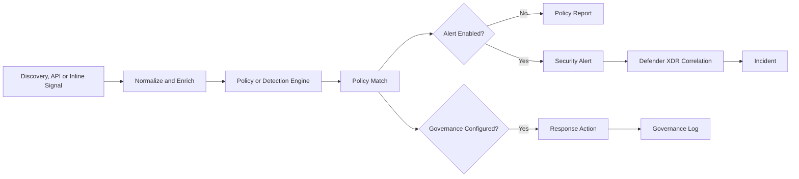
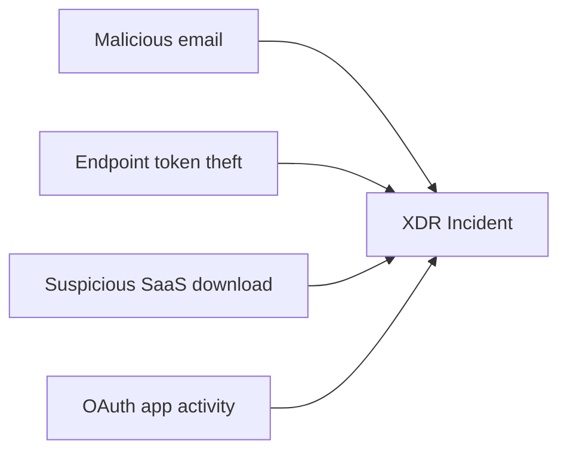

# Understanding the MDCA Policy and Detection Engine

**MDCA does not turn raw SaaS logs directly into truth. It turns signals into matches, matches into alerts, and alerts into questions worth investigating.**

> 🎯 **TL;DR** — MDCA has several policy engines because it processes several kinds of data. Activity policies evaluate explicit conditions. App Discovery policies evaluate traffic and SaaS usage. Anomaly detections compare behavior with baselines and threat intelligence. Access and session policies act inline. A policy match is not automatically an alert, an alert is not automatically an incident, and an incident is definitely not proof that Kevin in Finance is a cybercriminal.

The [previous article](./2.%20How%20MDCA%20Sees%20and%20Controls%20SaaS%20-%20Architecture%20and%20Data%20Paths.md) explained how signals reach Microsoft Defender for Cloud Apps (MDCA). This article follows those signals through detection and response.

---

## The Detection Pipeline



Each box has a different meaning:

- **Signal** — an activity, traffic record, file event, session action, or other observation.
- **Enrichment** — user, IP, device, application, location, threat intelligence, and other context.
- **Policy match** — the signal satisfied a policy's conditions.
- **Alert** — the match was important enough to surface for investigation.
- **Incident** — Defender XDR correlated related alerts and evidence into a larger attack story.
- **Governance action** — MDCA attempted a response through the relevant control path.

A common mistake is to treat those terms as synonyms. They are not.

---

## Pick the Engine That Owns the Signal

MDCA policy types are not different skins over one query language. Each type consumes a specific data model and has a specific job.

| Policy type | Data it evaluates | Best question | Typical action |
|---|---|---|---|
| **Activity policy** | Activities from connected apps and integrations | Did a known event or event rate occur? | Alert, notify, or run an app-supported governance action |
| **Anomaly detection policy** | Behavior enriched with baselines, ML, and threat intelligence | Is this behavior unusual or risky for this user or tenant? | Alert and optionally govern supported accounts/apps |
| **App Discovery policy** | Cloud Discovery usage and risk data | Did a risky, new, or heavily used SaaS app appear? | Alert and tag the app |
| **Cloud Discovery anomaly detection** | Continuous Discovery reports | Did usage suddenly deviate from normal? | Alert |
| **OAuth app / App Governance policy** | Application permissions, metadata, and API behavior | Is an OAuth-enabled app risky or behaving abnormally? | Built-in OAuth policies or App Governance alerts and supported remediation |
| **Access policy** | A live Conditional Access App Control access attempt | Should this session be allowed into the app? | Audit or block access |
| **Session policy** | Actions in a live controlled browser session | Should this in-app action be allowed? | Audit, block, protect, inspect, or step up authentication |
| **File policy** | File metadata/content from connected apps | Does stored content violate a data rule? | Legacy file governance actions |

> **File policies retire on January 6, 2027.** New data protection designs should target Microsoft Purview DLP or auto-labeling rather than building a fresh estate on a feature with its retirement party already scheduled.

The available policies depend on enabled data sources. No connected app means no provider activity to evaluate. No continuous Discovery report means no useful Discovery anomaly baseline. No inline session means no session action to block.

A policy cannot detect data that never entered its pipeline.

---

## 1. Activity Policies — Deterministic Detection

An Activity policy is the closest MDCA gets to a classic rule:

```text
IF selected activity fields match selected conditions
THEN create a match
OPTIONALLY alert and run governance
```

Examples:

- an administrative action from a risky IP address;
- activity by a service account outside corporate networks;
- a selected file operation by a privileged group;
- repeated password or permission changes in a short period;
- use of an outdated browser or operating system.

### Single activity versus repeated activity

A single-activity policy evaluates each event independently.

```text
Administrative activity = True
AND IP category = Risky
```

A repeated-activity policy adds rate and time:

```text
Activity type in [password change, password reset]
AND actor in [privileged admins]
AND count >= threshold
WITHIN selected timeframe
```

The second model catches volume and sequence. It also creates more ways to get the threshold wrong.

Ten actions in five minutes may be malicious in one tenant and a normal automation job in another. A threshold copied from a screenshot is not a detection strategy.

### Filters are part of the security logic

Policy quality depends on field quality:

- Is the user mapped correctly?
- Is the IP tagged as Corporate, VPN, Risky, or something else?
- Does the provider expose the activity type you need?
- Is the event interactive or generated by a backend service?
- Does `Contains` mean substring or whole-word matching for that filter?

In MDCA policy filters, `Contains` commonly searches full words separated by delimiters, while `Equals` expects the complete value. Test the query in the Activity Log before attaching an alert to it.

The strongest workflow is:

1. Hunt in the Activity Log.
2. Build a filter that returns known-good test evidence.
3. Create the policy from that search.
4. Generate the event again.
5. Verify the match and alert.

Start from evidence, not from a blank wizard and optimism.

---

## 2. Anomaly Detection — Behavioral, Not Deterministic

Anomaly detection asks a different question:

> Is this activity sufficiently different from the user, tenant, and system baseline to deserve attention?

MDCA evaluates behavior using signals such as:

- IP reputation;
- location;
- device and user agent;
- failed sign-ins;
- administrative activity;
- inactive accounts;
- activity rate;
- impossible travel;
- behavior within a session.

Built-in anomaly policies are enabled automatically, but the service needs data before “unusual” has any meaning. Microsoft documents an initial seven-day learning period during which not all anomaly alerts are raised. Sessions can then be compared with activity observed over the previous month.

### Baselines are context, not allow lists

A learned behavior does not become safe simply because it is common.

If a user normally signs in from Paris and suddenly appears in Singapore, the event is interesting. If the whole company exits through the same Singapore VPN, it may be ordinary. If that VPN address is not tagged correctly, the detection engine receives incomplete context.

That is why IP ranges and tags matter:

- **Corporate** identifies known business egress.
- **VPN** explains remote access infrastructure.
- **Risky** marks addresses that deserve explicit attention.
- Custom tags can carry organizational context.

Tuning the context is usually better than excluding the executive team because they travel frequently.

### Sensitivity and suppression

Some detections, such as Impossible Travel, expose sensitivity controls that affect suppression:

| Sensitivity | Suppression behavior |
|---|---|
| **Low** | System, tenant, and user suppressions |
| **Medium** | System and user suppressions |
| **High** | System suppressions only |

Higher sensitivity means fewer learned suppressions, not better evidence.

For Impossible Travel, both sides being tagged as safe can suppress the alert at lower sensitivity, while only one safe side does not. Location is evaluated at country/region level, so two actions in the same or bordering countries might not produce the dramatic travel alert someone expected from a demo.

Also, several location-oriented detections do not apply to failed or noninteractive sign-ins. Always check the detection's actual scope before building a lab around it.

---

### Dynamic Threat Detection Changed the Contract

Starting in June 2025, Microsoft began moving several legacy anomaly policies to a dynamic threat detection model.

The important architectural change is not the new names. It is ownership of the detection logic.

```text
Legacy model  → Admin sees and tunes a named policy → Policy raises an alert
Dynamic model → Microsoft updates detection logic   → Tenant receives current detections
```

Several legacy policy objects were disabled as their threat scenarios moved to dynamic detections, sometimes under new or multiple names. Examples include suspicious or anonymous IP activity, inbox manipulation, unusual OAuth infrastructure, ransomware behavior, and activity by a deprovisioned user.

Operational consequences:

- Do not use the old policy inventory as a control checklist.
- Detection names can change while coverage continues.
- Runbooks should map to threat scenario and evidence, not only to one product label.
- If a legacy policy is missing, check current dynamic detections before concluding that coverage disappeared.
- Custom Activity policies remain useful for tenant-specific deterministic requirements.

A runbook titled “Investigate suspicious app-driven file exfiltration” ages better than one titled after a UI label Microsoft may rename next quarter.

---

## 3. App Discovery Policies — Different Data, Different Meaning

App Discovery policies operate on Cloud Discovery reports, not deep SaaS audit activities.

They can evaluate characteristics such as:

- application category and risk score;
- compliance characteristics;
- number of users or IP addresses;
- transactions;
- uploaded or downloaded data;
- daily traffic.

This is useful for scenarios like:

> Alert when a low-score cloud storage application is used by more than 25 users or receives more than 5 GB of uploads in one day.

A match can tag the app as Sanctioned, Unsanctioned, Monitored, or with a custom tag. Enforcement still requires an integrated endpoint, firewall, proxy, or SWG.

Two details are easy to miss:

- Snapshot report data does not trigger App Discovery policy alerts.
- Applying anomaly policies to all continuous streams can produce multiple alerts because the global stream aggregates other sources.

Scope the report stream deliberately. “All” is convenient until the SOC receives the same story from every pipe.

---

## 4. Inline Policies — Decision During the Session

Access and Session policies use Conditional Access App Control. Unlike out-of-band Activity and anomaly policies, they can evaluate supported actions while the user is still in the application.

- **Access policy** — allow or block the session based on app, user, device, location, client, IP, and related context.
- **Session policy** — allow access but monitor or control downloads, uploads, clipboard actions, print, messages, or other supported activities.

Their timing changes the risk:

| Out-of-band policy | Inline policy |
|---|---|
| Evaluates data after it reaches MDCA | Evaluates the selected live session/action |
| Lower chance of breaking the app | Can directly affect rendering and workflow |
| Response uses APIs or another control | Response occurs in the session path |
| Latency depends on source and polling | Latency and compatibility affect the user |

Inline policy design belongs to [Conditional Access App Control Under the Hood](./6.%20Conditional%20Access%20App%20Control%20Under%20the%20Hood.md). For now, remember that “policy” does not always mean “alert rule.” Sometimes it is part of the application's traffic path.

---

## Match, Alert, Incident, Action — Follow the Evidence

### Policy match

A policy match means the conditions evaluated as true. It answers:

> Did the data satisfy the logic?

It does not answer:

> Was the activity malicious?

### Alert

An alert packages the match with severity, entities, evidence, and investigation context. Daily alert limits or policy configuration can mean many matches produce fewer alerts.

### Incident

Defender XDR can correlate an MDCA alert with other alerts and evidence. For example:



Correlation improves the story; it does not remove the need to validate evidence.

### Governance action

A governance action is a response attempt, such as requiring sign-in again, suspending a user, confirming compromise, tagging an app, or invoking an app-specific control.

Verify it in the Governance Log.

Possible outcomes include:

- success;
- failure due to permission or provider API;
- retry;
- conflict with another policy;
- reversal by directory synchronization or another authoritative system.

Detection and remediation are coupled only if the action actually completes.

---

## Tuning Without Muting the Product

Bad tuning usually looks like one of these:

- excluding a noisy user forever;
- lowering sensitivity before understanding the source;
- copying a threshold from another tenant;
- adding automatic suspension to an untested policy;
- enabling every template;
- using broad “All users / All apps” scope during experimentation.

A safer loop is:

```text
Observe → Explain → Add context → Scope → Test → Alert → Automate last
```

### Add context first

- Configure corporate and VPN IP ranges.
- Identify service accounts and expected automation.
- Separate interactive users from backend processes.
- Understand provider-specific event semantics.

### Scope second

Use pilot groups and exact applications. Scope exclusions should have an owner and review date.

### Automate last

Start with alert-only. Measure false positives and missed scenarios. Add low-impact actions before destructive ones.

Automatic account suspension on a half-understood activity policy is an excellent way to turn the security team into the outage source.

---

## Quick Test: From Known Activity to Policy Match

This test creates a narrow, notification-only Activity policy from evidence that already exists.

### Prerequisites

- A connected application producing Activity Log data.
- A dedicated test user.
- Permission to create MDCA policies.
- No governance action will be configured.

### Step 1 — Generate a harmless activity

With the test user, perform a distinctive action in the connected application, for example:

- rename a test file;
- create a temporary folder;
- sign in with a supported test browser.

Record the UTC time.

### Step 2 — Prove the signal exists

Open **Cloud Apps > Activity log** and filter by:

- test user;
- application;
- time range;
- exact activity type returned by the provider.

Open the activity and inspect its raw data.

If the activity is absent, stop. A policy cannot repair ingestion.

### Step 3 — Create policy from the search

Use **New policy from search** so the tested filters become the policy conditions.

Add these safety controls:

- include only the test user;
- include only the test application and activity type;
- use low severity;
- enable an alert;
- set a small daily alert limit;
- configure **no governance action**.

Name it clearly, for example `LAB - MDCA Activity Pipeline - Alert Only`.

### Step 4 — Trigger it again

Repeat the same harmless activity with a new test object.

Then verify, in order:

1. The activity appears in the Activity Log.
2. The policy reports a match.
3. An alert is created if alerting was enabled.
4. The alert contains the expected user, app, IP, time, and activity.
5. No Governance Log action exists because none was configured.

### What the test proves

```text
Provider event ingestion works
        ↓
Filters match the expected schema
        ↓
Policy evaluation works
        ↓
Alert creation works
```

It does not test anomaly detection, XDR correlation, or automated remediation.

### Cleanup

- Delete the temporary test objects.
- Disable or delete the lab policy.
- Close the lab alert with an explicit test classification.

---

## Takeaways

1. **Choose the policy type from the data path, not from the policy name.**
2. **A deterministic Activity policy and a behavioral anomaly detection answer different questions.**
3. **Dynamic threat detections are Microsoft-managed; build runbooks around scenarios and evidence, not legacy labels.**
4. **A match, alert, incident, and governance action are separate stages. Verify each one.**
5. **Tune context before suppressing users, and automate only after the signal is understood.**

The next article leaves user behavior behind and looks at configuration state: SaaS Security Posture Management.

---

## References

- [Control cloud apps with policies](https://learn.microsoft.com/en-us/defender-cloud-apps/control-cloud-apps-with-policies)
- [Anomaly detection policies](https://learn.microsoft.com/en-us/defender-cloud-apps/anomaly-detection-policy)
- [Common threat protection policies](https://learn.microsoft.com/en-us/defender-cloud-apps/policies-threat-protection)
- [Create Cloud Discovery policies](https://learn.microsoft.com/en-us/defender-cloud-apps/cloud-discovery-policies)
- [Investigate activities in MDCA](https://learn.microsoft.com/en-us/defender-cloud-apps/activity-filters)
- [Governing connected apps](https://learn.microsoft.com/en-us/defender-cloud-apps/governance-actions)
