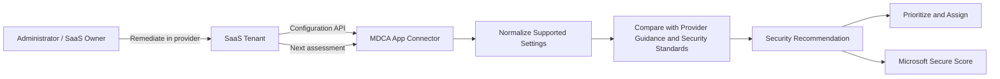

# SaaS Security Posture Management with MDCA

**An alert tells you someone did something suspicious. SSPM tells you the SaaS tenant was already making life easy for them.**

> 🎯 **TL;DR** — SaaS Security Posture Management (SSPM) uses supported App Connectors to assess configuration in SaaS platforms and surface security recommendations. It is configuration-state analysis, not vulnerability scanning and not behavior detection. Coverage depends on the provider, connector permissions, licensing, and the settings exposed through the provider API. Treat the recommendations as evidence to prioritize—not as a magic score to maximize blindly.

The [policy and detection article](./3.%20Understanding%20the%20MDCA%20Policy%20and%20Detection%20Engine.md) focused on activities. SSPM focuses on state.

---

## Activity versus Configuration

Consider two findings:

1. A user downloads 2,000 files at 03:00 from a new IP address.
2. A SaaS tenant allows weak administrative controls or risky sharing defaults.

The first is suspicious **behavior**. The second is insecure **posture**.

| Security model | Core question | Evidence | Typical response |
|---|---|---|---|
| **Threat detection** | Did something suspicious happen? | Activities, sessions, entities, baselines, threat intelligence | Investigate and contain |
| **SSPM** | Is the SaaS platform configured safely? | Provider configuration exposed through an integration | Change and maintain configuration |
| **Cloud Discovery risk** | Is this SaaS provider suitable for use? | Catalog metadata and provider risk factors | Sanction, monitor, replace, or block |
| **Vulnerability management** | Is software exploitable because of a weakness? | Versions, packages, CVEs, attack paths | Patch or mitigate |

These models complement each other, but they are not interchangeable.

Cloud Discovery might tell you that GitHub supports MFA. SSPM can tell you whether the connected GitHub organization is actually configured according to supported security recommendations. Threat detection can then tell you whether unusual activity occurred.

Vendor capability, tenant configuration, and observed behavior are three different layers.

---

## The SSPM Data Flow



The connector is the critical dependency.

MDCA does not crawl the provider's admin portal like a browser bot. It authenticates to supported APIs, collects the configuration data available to that integration, evaluates supported controls, and surfaces recommendations.

That architecture immediately creates boundaries:

- If the provider does not expose a setting, MDCA cannot assess it.
- If the connector lacks permission, the evidence can be incomplete.
- If the provider edition does not include the relevant feature, remediation may not be possible.
- If MDCA does not support the app for SSPM, connecting it for activities does not create posture management.

A green connector status means the connection works. It does not mean every security setting is covered.

---

## What a Useful Recommendation Contains

A posture recommendation should give enough context to make a change safely:

- the affected SaaS application and instance;
- the setting or control being assessed;
- current versus recommended state;
- security impact;
- remediation guidance;
- status or implementation evidence;
- scoring or prioritization context;
- relevant standard or provider guidance where available.

The recommendation is a control assertion:

```text
Expected secure state
        versus
Observed provider state
```

It is not proof that an attacker exploited the weakness.

For example, a recommendation about administrative authentication indicates exposure. It does not prove that an administrator account is compromised. That proof would need sign-in, activity, identity, and endpoint evidence.

---

## Supported App Does Not Mean Supported SSPM

The App Connector matrix has several independent columns:

- list accounts;
- collect user activity;
- collect administrative activity;
- govern users;
- inspect permissions;
- apply file controls;
- provide SSPM assessments.

An application can support one capability and not another.

SSPM support changes as providers and integrations evolve. Check the current App Connector capability matrix for the exact application, provider edition, instance, and SSPM status. Do not infer posture coverage from a generic **Connected** status.

Also check the provider license. Seeing recommendations for a Microsoft 365 service can require the tenant to hold the service license itself. A security tool cannot assess a feature your organization does not own.

---

## SSPM and Microsoft Secure Score

MDCA can publish supported SaaS posture recommendations into Microsoft Secure Score.

This is useful because it places SaaS hardening beside other Microsoft security improvements. It also introduces a temptation: optimize the number instead of the risk.

A score is a prioritization tool, not a security objective.

Before implementing a recommendation, ask:

1. What attack path does this setting reduce?
2. Which users, data, and tenant instances are exposed?
3. What is the operational impact?
4. Does another control already mitigate the risk?
5. Can the change be tested and rolled back?
6. Who owns the SaaS platform?

A five-point improvement that breaks a critical integration is not a security win. It is an outage with excellent dashboard aesthetics.

---

## Ownership Is the Hard Part

SSPM finds issues across platforms owned by different teams:

- identity controls owned by IAM;
- sharing settings owned by collaboration teams;
- GitHub controls owned by engineering;
- Salesforce settings owned by a CRM team;
- ServiceNow controls owned by ITSM administrators;
- security recommendations reviewed by the SOC.

MDCA can centralize findings. It cannot centralize accountability by itself.

A minimal operating model needs:

| Role | Responsibility |
|---|---|
| **Security team** | Validate risk, prioritize, track exceptions |
| **SaaS owner** | Assess business impact, test, and implement the change |
| **Identity team** | Review authentication, consent, and privileged access dependencies |
| **Application/integration owner** | Confirm that APIs, automation, and service accounts survive the change |
| **Risk owner** | Accept time-bound exceptions when remediation is not possible |

Without ownership, SSPM becomes a beautifully sorted list of somebody else's problems.

---

## Configuration Drift Is the Real Enemy

Hardening a SaaS platform once is not posture management.

SaaS configuration changes constantly:

- a new administrator enables a feature;
- a vendor changes a default;
- an integration requests broader access;
- an emergency exception becomes permanent;
- a new tenant or business unit is connected;
- a control is renamed or moved by the provider.

The value of SSPM is continuous reassessment. The loop is:

```text
Assess → Prioritize → Change → Validate → Detect Drift → Repeat
```

That also means recommendation state can lag behind the provider change until the next assessment. Do not expect the dashboard to update in the same second as the admin portal.

For urgent validation, verify the setting directly in the SaaS platform first. Then wait for MDCA to confirm the state through its own collection cycle.

---

## Permissions: Visibility Has a Cost

Configuration assessment requires access to configuration.

The connector therefore needs sufficient provider permissions to read the supported settings. Some integrations require privileged consent or provider-specific administrative accounts.

Treat that connection like a security principal:

- document the permissions granted;
- use the least privilege supported by the integration;
- monitor connector health;
- protect the account or credential used by the provider;
- review vendor-side audit logs;
- understand which MDCA egress addresses might appear;
- remove stale connector instances.

Do not grant a connector broad access and then forget it because the portal says **Connected**.

The tool assessing privileged configuration is itself part of the privileged architecture.

---

## What SSPM Does Not Do

| Assumption | Reality |
|---|---|
| SSPM checks every setting in every SaaS app. | It checks supported controls exposed by supported integrations. |
| A connected app automatically has SSPM. | Connector capabilities differ by app. |
| Secure Score proves the tenant is secure. | It summarizes supported improvement actions, not every attack path. |
| Every recommendation should be implemented immediately. | Business impact, dependencies, compensating controls, and rollout matter. |
| Fixing configuration removes active compromise. | Posture remediation and incident response are separate jobs. |
| A recommendation disappears instantly after remediation. | Reassessment and provider API latency apply. |
| MDCA remediates every finding automatically. | Many changes remain provider-side administrative work. |

The honest model is partial but useful visibility, continuously applied.

---

## Quick Test: Dissect One SSPM Recommendation

This is a read-only exercise. The goal is to understand what evidence the recommendation represents before changing anything.

### Prerequisites

- At least one SSPM-supported SaaS application connected to MDCA.
- Read access to the relevant security recommendations.
- Read access to the SaaS provider's corresponding administrative setting, if possible.

### Step 1 — Select one recommendation

In the Microsoft Defender portal, open the security recommendations for cloud/SaaS applications and choose one recommendation for a connected app.

Avoid selecting the highest score just because it is red. Select a control whose provider setting you can verify.

Record:

- application and instance;
- recommendation title;
- current state;
- security rationale;
- remediation guidance;
- score or priority;
- last assessment time, when displayed.

### Step 2 — Identify the attack path

Write one sentence using this format:

```text
If [configuration remains weak], an attacker or user who can [prerequisite]
may be able to [impact].
```

If that sentence cannot be written, the recommendation is not understood yet.

### Step 3 — Verify the provider state

Open the corresponding SaaS administration page in read-only mode and confirm:

- the setting exists;
- the observed value matches MDCA;
- the setting scope matches the recommendation;
- changing it would not affect an unexpected tenant, group, or integration.

If the values disagree, compare timestamps before declaring either product wrong.

### Step 4 — Build a remediation card

| Field | Value |
|---|---|
| Finding | What is misconfigured? |
| Attack path | What could this enable? |
| Affected scope | Which tenant, users, or data? |
| Owner | Which team controls the setting? |
| Dependency | Which app, automation, or workflow could break? |
| Test | How will the change be validated? |
| Rollback | How will the original state be restored? |
| Evidence | What proves remediation in the provider and MDCA? |

### Expected result

You should be able to explain:

- where MDCA got the configuration evidence;
- why the current state creates risk;
- who can safely change it;
- how provider-side state and MDCA reassessment will confirm remediation.

No configuration change is required for this Concepts test.

---

## A Practical Prioritization Model

When many recommendations exist, prioritize with more than the product score:

```text
Priority = Exposure × Privilege × Data Sensitivity × Exploitability
           ÷ Compensating Controls
```

This is not a formal MDCA formula. It is an operational sanity check.

A weak control affecting all external users and sensitive data should usually outrank a cosmetic recommendation in an isolated test instance—even if the dashboard colors are equally angry.

Good first targets are controls that:

- reduce administrator takeover;
- restrict public or external exposure;
- improve strong authentication;
- limit broad application permissions;
- protect auditability;
- have low rollout risk and clear rollback.

---

## Takeaways

1. **SSPM evaluates configuration state; threat detection evaluates behavior.**
2. **The App Connector and provider API define visibility.** Connected does not mean complete.
3. **Secure Score helps prioritize but does not replace risk analysis.**
4. **Remediation happens with the SaaS owner, not only in the Defender portal.**
5. **Continuous reassessment catches drift; one-time hardening is just a project.**

The next article changes identity type completely: OAuth applications, durable permissions, and App Governance.

---

## References

- [Microsoft Defender for Cloud Apps overview](https://learn.microsoft.com/en-us/defender-cloud-apps/what-is-defender-for-cloud-apps)
- [Connect apps with API connectors and review the capability matrix](https://learn.microsoft.com/en-us/defender-cloud-apps/enable-instant-visibility-protection-and-governance-actions-for-your-apps)
- [Microsoft Secure Score](https://learn.microsoft.com/en-us/defender-xdr/microsoft-secure-score)
- [Best practices for Defender for Cloud Apps](https://learn.microsoft.com/en-us/defender-cloud-apps/best-practices)
