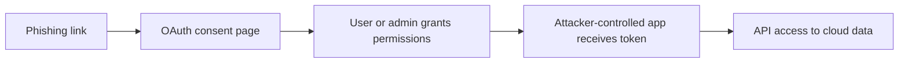
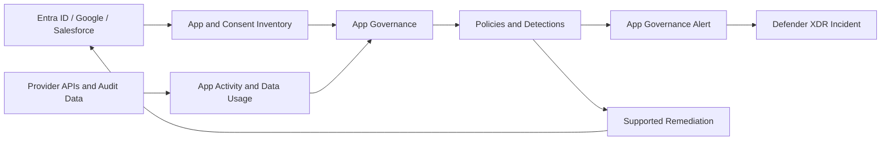

# OAuth Apps and App Governance — When Consent Becomes Persistence

**A user signs in once, clicks Accept, closes the browser—and the application keeps accessing data. That is not a bug. That is the permission model.**

> 🎯 **TL;DR** — OAuth applications can access cloud data through delegated or application permissions, often long after the consent screen disappears. Risk comes from the combination of permissions, reach, credentials, usage, and trust—not from the app name alone. MDCA App Governance inventories supported apps, exposes permissions and data usage, detects suspicious behavior, raises alerts in Defender XDR, and provides remediation. It does not replace Entra consent governance, credential hygiene, or application ownership.

If users are human identities, OAuth applications are machine identities with fewer coffee breaks and much better persistence.

---

## The Consent Screen Is Only the Beginning

A typical delegated OAuth flow looks like this:

```mermaid
sequenceDiagram
    participant U as User
    participant A as OAuth Application
    participant E as Identity Provider
    participant API as SaaS API

    U->>A: Start using app
    A->>E: Request scopes
    E->>U: Show consent
    U->>E: Accept
    E-->>A: Authorization code
    A->>E: Exchange code
    E-->>A: Access token + optional refresh capability
    A->>API: Call API as user
    API-->>A: Return permitted data
    Note over U,A: User can close the browser; app access may continue
```

The dangerous mental shortcut is:

> “The user is not signed in, so the app cannot access anything.”

The application uses its token, not the user's open browser tab. Depending on the flow, permissions, token lifetime, and provider, it can continue accessing APIs until access expires or is revoked.

That makes consent a security boundary.

---

## Delegated versus Application Permissions

In Microsoft Entra ID, the distinction is fundamental.

| Permission model | Identity context | Typical description | Risk shape |
|---|---|---|---|
| **Delegated permission** | Application acts on behalf of a signed-in user | “Access data as you” | Limited by the intersection of app permission and user access, but can persist through refresh mechanisms |
| **Application permission** | Application acts as itself | “Access data without a signed-in user” | Tenant-wide or broad app-only access is possible; admin consent is normally required |

A delegated permission is not automatically low risk. If a user with broad data access consents to a high-impact scope, the application inherits a valuable reach.

Application permissions can be even more powerful because no human session is required. A daemon with broad Microsoft Graph application roles does not need to phish the user every morning. It authenticates as itself and gets on with the exfiltration.

For the object and permission model, read:

- [Understanding App Registration, Enterprise Application, and Service Principal in Azure AD](../../../010%20-%20Entra%20ID/Applications/Understanding%20App%20Registration,%20Enterprise%20Application,%20and%20Service%20Principal%20in%20Azure%20AD.md)
- [Understanding Entra ID API Permissions - Scopes, App Roles & Application Permissions](../../../010%20-%20Entra%20ID/Applications/Understanding%20Entra%20ID%20API%20Permissions%20-%20Scopes,%20App%20Roles%20&%20Application%20Permissions.md)

This article focuses on what MDCA adds after those permissions exist.

---

## Permission Is Not Activity

An application requesting `Files.Read.All` is a risk indicator. It is not proof that the application downloaded a file.

An application downloading 50,000 files is activity. To assess risk, MDCA needs to connect several dimensions:

```text
App Risk = Permission × Reach × Activity × Credential Trust × Publisher Trust
```

This is a mental model, not a Microsoft scoring formula.

### Permission

What can the application call?

- profile data;
- mail;
- files;
- directory objects;
- administrative APIs;
- provider-specific resources.

### Reach

Who granted access, or how broadly was admin consent applied?

- one test user;
- a privileged user;
- hundreds of users;
- the entire tenant through application permission.

### Activity

What does the application actually do?

- no recent use;
- normal periodic synchronization;
- sudden mass download;
- calls from an unfamiliar ISP;
- access to sensitive resources.

### Credentials

How does the app authenticate, and are its credentials healthy?

- secret;
- certificate;
- federated credential;
- expired or long-lived credential;
- credential with no clear owner.

### Trust

Who published and operates the app?

Publisher verification is useful evidence, not divine certification. A verified publisher can still ship a vulnerable app, suffer compromise, or request excessive permissions.

---

## Common Attack Paths

### Consent phishing

The attacker registers a legitimate-looking application and convinces a user or administrator to consent. No password theft is required if the victim grants the access voluntarily.



MFA can succeed perfectly during this flow. The user is authenticating to the real identity provider. The problem is what they authorize after authentication.

### Compromised legitimate application

A trusted integration already has broad permissions. The attacker steals its secret, certificate, token, CI/CD variables, or hosting environment.

The application name and consent history look legitimate. Its new behavior does not.

### Dormant app becomes active

An old application retains permission after its owner leaves or the business process dies. Months later, its credentials are used again.

Unused access is still access.

### Privilege through a powerful consenter

A delegated app may act within the user's effective permissions. Consent from a privileged or data-rich account can therefore create a much larger blast radius than consent from a test user.

---

## What App Governance Adds

App Governance in MDCA is designed for OAuth-enabled applications across supported Microsoft Entra ID, Google, and Salesforce environments. Inventory, activity, detections, and remediation are not identical across those platforms; the provider capability matrix remains the source of truth.

It combines four jobs:

| Capability | What it answers |
|---|---|
| **Inventory and insights** | Which non-Microsoft apps exist, who authorized them, and what permissions or activity are visible? |
| **Policy** | Which application properties or behaviors violate tenant rules? |
| **Detection** | Is app behavior anomalous, risky, or inconsistent with expected use? |
| **Remediation** | Can the app be disabled, permissions revoked, or another supported action taken? |

App Governance alerts appear in Microsoft Defender XDR with **App Governance** as the detection source.

The useful change is perspective. Instead of investigating only user activity, the application becomes a first-class security entity.

---

## The App Governance Signal Flow



For Microsoft 365, connecting the Microsoft 365 App Connector improves visibility into activities and resources accessed by OAuth apps, including investigation through Advanced Hunting.

Microsoft's [App Governance activation guidance](https://learn.microsoft.com/en-us/defender-cloud-apps/app-governance-get-started) states that initial provisioning can take up to ten hours. Empty dashboards immediately after activation are not an advanced persistent threat against the UI.

---

## App Governance versus the OAuth Apps Page

MDCA has evolved from the older OAuth application visibility experience toward App Governance.

The legacy OAuth Apps page can show delegated-consent information such as:

- application name and ID;
- publisher;
- users who authorized the app;
- permission level;
- app state;
- community use;
- last authorization or use information where available.

The older OAuth Apps view specifically identifies applications requesting delegated permissions. App Governance provides the broader modern experience for supported platforms, policies, detections, API usage, and remediation.

Do not assume every screen uses the same inventory or covers every permission model. Verify which experience is enabled and which provider you are investigating.

---

## Detection: Known Risk versus Behavioral Risk

App Governance can evaluate both static and dynamic signals.

### Static or posture-oriented signals

- unverified publisher;
- high-impact permissions;
- broad user adoption;
- stale application;
- unusual credential state;
- application not reviewed or approved.

### Behavioral signals

- unusual API call volume;
- suspicious file download behavior;
- activity from unknown infrastructure;
- access inconsistent with prior behavior;
- risky data usage.

The distinction matters during triage:

- **High permission, no activity** — reduce exposure before it becomes an incident.
- **Low permission, strange activity** — investigate why behavior changed.
- **High permission, strange activity** — contain first, debate aesthetics later.

---

## Approval, Ban, Disable, and Revoke Are Not Synonyms

Provider actions differ.

| Action | General meaning | Important limitation |
|---|---|---|
| **Approve** | Mark the app as reviewed/accepted | Often organizational metadata; it does not grant magical trust |
| **Ban** | Mark or prevent app use according to provider behavior | Semantics differ between Microsoft 365, Google, and Salesforce |
| **Disable app** | Prevent the service principal/app from operating | Can break every dependent workflow |
| **Revoke consent/permission** | Remove an existing authorization grant | May not prevent a future grant unless consent controls also change |
| **Revoke user from app** | Remove one user's authorization | Other users or app-only permissions may remain |
| **Remove credential** | Invalidate a secret/certificate/federated trust | Other credentials may still work |

For example, revocation can be a one-time cleanup while future consent remains possible. A complete response may also require Entra consent policies, permission classification, admin consent workflow, credential rotation, user/session response, and provider-side investigation.

App Governance can pull the emergency brake. IAM still owns the track design.

---

## Investigation Order for a Suspicious App

Use this sequence:

### 1. Identify the object

- application/client ID;
- service principal or provider-side object;
- tenant and publisher;
- verified publisher status;
- owners;
- credentials and federated identities.

Names are decoration. IDs identify the object.

### 2. Determine the permission model

- delegated permissions;
- application permissions;
- user consent versus admin consent;
- users and groups affected;
- resources and APIs in scope.

### 3. Inspect behavior

- sign-ins;
- API call volume;
- resources accessed;
- file/data transfer;
- source IPs and ISPs;
- first and last observed activity;
- deviation from normal behavior.

### 4. Find dependencies

- business owner;
- automation;
- CI/CD pipeline;
- service account;
- production workflow;
- other credentials.

### 5. Contain proportionally

- revoke one user's grant;
- disable the enterprise application;
- revoke consent;
- remove or rotate credentials;
- block future user consent;
- investigate affected users and data;
- hunt related activity in Defender XDR.

Do not disable a production application before identifying what depends on it—unless active compromise makes the outage the safer option.

---

## What App Governance Does Not Replace

| Control | Why it is still needed |
|---|---|
| **Entra user consent settings** | Define whether users can grant permissions in the first place |
| **Permission classification** | Distinguish low-impact scopes from permissions requiring review |
| **Admin consent workflow** | Provides controlled approval instead of ad hoc Global Admin consent |
| **Application ownership** | Gives someone responsibility for review, credentials, and retirement |
| **Workload identity protection** | Detects and controls risky service principal sign-ins and behavior in the identity plane |
| **Credential lifecycle** | Removes stale secrets and moves toward certificates or federated credentials where appropriate |
| **Access reviews and inventory** | Finds abandoned apps and unnecessary grants over time |
| **Incident response** | Determines what data was accessed and whether users, endpoints, or app infrastructure are compromised |

App Governance adds visibility and response. It does not make OAuth governance somebody else's problem.

---

## Quick Test: Triage One Existing OAuth App

This test is read-only. It teaches the investigation model without granting a new app access to production data.

### Prerequisites

- App Governance enabled, or access to the OAuth Apps inventory.
- A read role such as Global Reader or another appropriate security role.
- At least one supported connected platform.

### Step 1 — Choose an app worth reviewing

Filter for one or more risk hints:

- high permission level;
- unverified publisher;
- rare community use;
- many authorizing users;
- no known business owner;
- stale or unusual activity.

Do not label the app malicious from one metadata field. Select it for investigation.

### Step 2 — Build the identity card

Record:

| Field | Finding |
|---|---|
| App name | Friendly name only |
| App/client ID | Stable identifier |
| Publisher | Claimed publisher |
| Verified | Yes / No / Not available |
| Owners | Known / Missing |
| Platform | Entra ID / Google / Salesforce |

### Step 3 — Build the access card

Record:

- permissions granted;
- delegated or application model where visible;
- admin consent status;
- number and identity of authorizing users;
- highest-impact reachable data;
- whether privileged users are included.

### Step 4 — Build the behavior card

Inspect available activity and App Governance insights:

- last authorized;
- last used;
- API activity;
- data transfer;
- source infrastructure;
- related alerts;
- changes from expected behavior.

### Step 5 — Classify the app

Use one of these outcomes:

- **Known and justified** — owner, purpose, minimum permissions, expected activity.
- **Known but overprivileged** — business need exists, access must be reduced.
- **Unknown and inactive** — investigate ownership, then retire if unused.
- **Unknown and active** — urgent validation and hunting.
- **Suspicious** — contain according to incident severity.

### Expected result

You should be able to explain the difference between:

- what the app **could** access;
- what the app **did** access;
- who granted or approved that access;
- which action would remove current access;
- which control would prevent access from returning.

No application is changed during this test.

---

## Takeaways

1. **Consent can create durable access without stealing a password.**
2. **Permissions describe capability; activity describes use. Investigate both.**
3. **App risk depends on reach, behavior, credentials, and ownership—not only the requested scope.**
4. **App Governance makes applications visible security entities and sends their alerts to Defender XDR.**
5. **Revoking access cleans up today; consent governance and ownership stop the same problem returning tomorrow.**

The final Concepts article moves from out-of-band app governance to inline control: Conditional Access App Control.

---

## References

- [App Governance in Microsoft Defender for Cloud Apps](https://learn.microsoft.com/en-us/defender-cloud-apps/app-governance-manage-app-governance)
- [Turn on App Governance](https://learn.microsoft.com/en-us/defender-cloud-apps/app-governance-get-started)
- [Manage OAuth apps](https://learn.microsoft.com/en-us/defender-cloud-apps/manage-app-permissions)
- [Investigate risky OAuth apps](https://learn.microsoft.com/en-us/defender-cloud-apps/investigate-risky-oauth)
- [Microsoft identity platform permissions and consent](https://learn.microsoft.com/en-us/entra/identity-platform/permissions-consent-overview)
- [Configure user consent](https://learn.microsoft.com/en-us/entra/identity/enterprise-apps/configure-user-consent)
