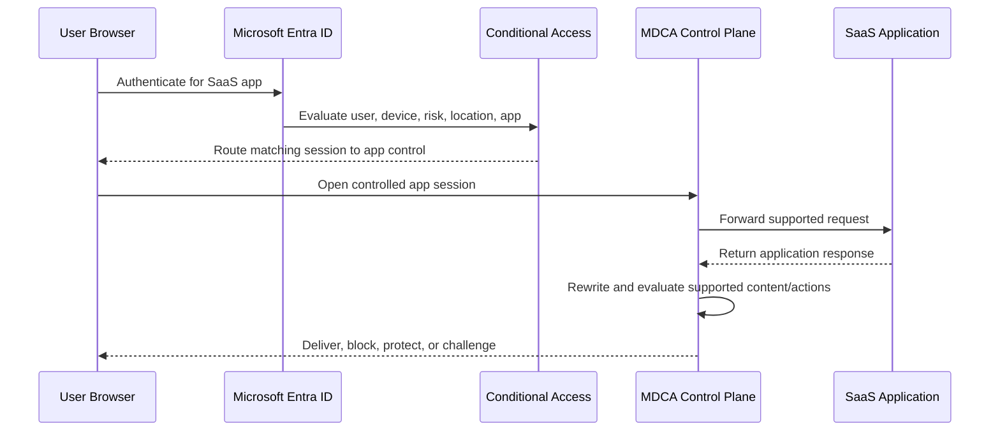
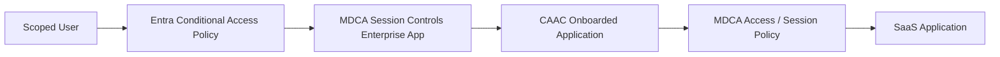
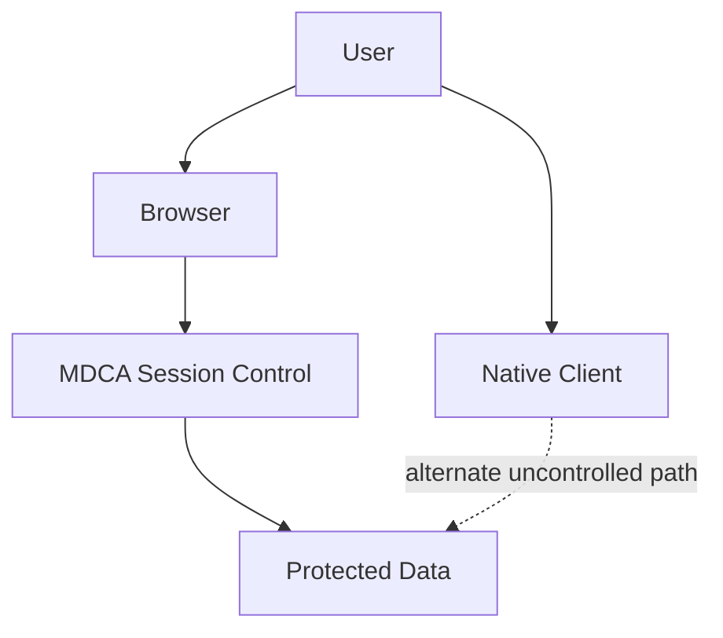

# Conditional Access App Control Under the Hood

**Conditional Access decides whether the user gets in. Conditional Access App Control decides what the user can do after the door opens.**

> 🎯 **TL;DR** — Conditional Access App Control (CAAC) requires an identity-provider policy—typically Microsoft Entra Conditional Access—to route selected sessions to MDCA. Access policies allow or block entry; Session policies control supported actions after authentication. Standard browsers use a reverse proxy and can display an `*.mcas.ms` URL, while supported Edge for Business scenarios can enforce controls in the browser. Inline control is powerful and risky: test every app, client, resource path, and rollback scenario.

The [architecture article](./2.%20How%20MDCA%20Sees%20and%20Controls%20SaaS%20-%20Architecture%20and%20Data%20Paths.md) introduced the inline path. Now we take it apart.

---

## Authentication Is Not the Whole Session

A normal Conditional Access decision happens around sign-in and token issuance:

```text
User + Device + Location + Risk + Target Resource
                         ↓
               Conditional Access
                         ↓
             Block or issue access
```

Once access is granted, the user interacts with the application. They can view, download, upload, copy, print, share, or send data.

Traditional Conditional Access can decide:

- require MFA;
- require a compliant device;
- require an authentication strength;
- block access;
- apply another supported grant/session control.

It does not inspect every action inside every SaaS UI.

CAAC adds a control point to selected application sessions so MDCA can evaluate supported actions after authentication.

---

## The Reverse Proxy Flow

For a controlled browser session, the high-level flow is:



With the standard reverse-proxy path, the application's URL can be rewritten with an `*.mcas.ms` suffix. For example:

```text
app.example.com
        ↓
app.example.com.mcas.ms
```

MDCA proxies supported browser traffic between the user and SaaS application. This position lets it observe or control selected session activities.

The proxy does not store session data at rest. Microsoft states that only public content is cached according to HTTP caching requirements.

Inline does not mean recorded forever. It means positioned in the live path.

---

## Two Policies, Two Decision Points

### Access policy

An MDCA Access policy controls whether the user can enter the app through the CAAC path.

It can evaluate context such as:

- user or group;
- application;
- device and management state;
- IP address and tag;
- location;
- browser versus mobile/desktop client;
- user agent.

The outcome is mainly **Audit** or **Block**.

### Session policy

A Session policy allows access but evaluates supported activity inside the session.

Possible control types include:

- monitor selected session activity;
- block specific activities;
- control file download with inspection;
- control file upload with inspection;
- protect a downloaded file;
- inspect for malware;
- require step-up authentication through an Entra authentication context.

The design difference is important:

| Requirement | Better control |
|---|---|
| Nobody on an unmanaged device may access this app | Access policy or Entra Conditional Access |
| Users may view data but not download it | Session policy |
| Sensitive files may be downloaded only with protection | Session policy with Purview protection |
| A sensitive action requires stronger authentication | Session policy plus authentication context |
| Native desktop client must be blocked | Explicit access/client control—not a browser-only session policy |

Blocking the whole application is simple. Controlling one action inside it is where CAAC earns its keep.

---

## Entra Conditional Access Is the Traffic Director

An MDCA session policy does nothing if the session never enters the CAAC path.

For Entra-integrated apps, a Conditional Access policy uses the **Use Conditional Access App Control** session control. The targeted application session is then routed to MDCA, where Access and Session policies can evaluate it.

CAAC also relies on the enterprise application named **Microsoft Defender for Cloud Apps - Session Controls**. Blocking that application through another broad Conditional Access policy can break access to protected applications.

This creates a dependency chain:



Every arrow must work.

- Wrong user scope: no routing.
- Blocked Session Controls enterprise app: failed access.
- App not correctly onboarded: missing or broken control.
- MDCA policy mismatch: routed session but no expected action.
- Unsupported client: session control never sees the action.

“CAAC is not working” is usually too vague to troubleshoot.

---

## Automated and Manual App Onboarding

Microsoft Entra ID applications can be automatically available for CAAC policy conditions. Applications using another identity provider must be manually onboarded, and custom apps may require domain configuration.

CAAC supports interactive SSO scenarios using SAML 2.0. For Entra-integrated applications, OpenID Connect and applications published through Entra Application Proxy are also supported in relevant scenarios.

Protocol support does not guarantee perfect application compatibility.

Modern SaaS applications make requests to:

- additional domains;
- CDNs;
- resource applications;
- APIs;
- embedded frames;
- websocket or custom endpoints;
- vendor plug-ins.

If the proxy does not know a required custom domain, part of the application can fail while the login still succeeds. That is why a real validation opens every important page and performs every important workflow.

> **The homepage loading is not an application test.** Validate every important page, domain, and workflow.

---

## Host Apps and Resource Apps Are Separate

A policy for a host application does not automatically protect all related resource applications.

Examples:

- Teams can rely on SharePoint and OneDrive content.
- Exchange and Microsoft 365 resources can expose separate paths.
- Gmail can rely on Google Drive content.

As of September 2026, Microsoft documents that policies for host apps such as Teams, Exchange, or Gmail are not automatically connected to SharePoint, OneDrive, or Google Drive policies.

The attack path follows the resource, not your tidy product grouping.

Map every route to the data:

```text
User Interface → Host App → Resource App → File/Data
```

Then verify which route is controlled.

---

## Edge In-Browser Protection versus Reverse Proxy

Supported Microsoft Edge for Business sessions can enforce MDCA session controls directly in the browser.

### In-browser path

- Works in the Edge work profile.
- Supports Windows 10/11 and macOS under documented requirements.
- Uses supported recent Edge for Business versions.
- Does not display the `.mcas.ms` suffix.
- Shows a protection indicator in the browser UI.
- Disables developer tools in the protected experience.
- Reduces proxy latency and compatibility issues.

### Reverse-proxy path

It is still used when in-browser protection is unavailable or the policy is unsupported, including scenarios such as:

- Chrome, Firefox, or Safari;
- Edge InPrivate;
- unsupported Edge version or operating system;
- B2B guest users;
- non-Microsoft identity provider flows;
- a session containing a policy not supported by in-browser protection;
- protect-on-download scenarios requiring the proxy path.

As of September 2026, Microsoft documentation describes Edge in-browser protection as **Preview**. Treat preview status as an architectural input, not fine print.

## Which control wins?

When Endpoint DLP and an MDCA or Purview browser control target the same action, Microsoft documents Endpoint DLP as taking priority.

Within MDCA session policies, the more restrictive outcome wins. If one policy audits a download and another blocks it, the file is blocked.

Layering controls is useful. Unmapped precedence is not.

---

## Native Clients: The Bypass You Designed Yourself

Session controls apply to browser-based interactive sessions. The Microsoft Teams desktop client, for example, is not supported for CAAC session controls.

This creates a simple bypass pattern:



If the native client can reach the same data, blocking browser downloads does not protect the resource completely.

The design options are:

- block unsupported mobile/desktop clients with an Access policy where appropriate;
- use Entra Conditional Access to restrict client access;
- use Endpoint DLP or endpoint controls;
- require managed/compliant devices;
- accept and document the residual risk.

Never test CAAC using only the browser you used to configure it.

---

## Monitor Only Is Easy to Misread

A Session policy control type named **Monitor only** monitors login activity. To audit richer activities, MDCA documentation directs administrators to use the relevant activity/file control with an **Audit** action.

That distinction matters during pilots. A team can believe it is observing downloads while it is actually observing only controlled logins.

For a serious pilot, validate the exact expected event:

- login;
- download;
- upload;
- copy;
- print;
- message/send action;
- blocked or protected file.

Then find that event in the Activity Log or policy report.

A green sign-in is not proof that content inspection works.

---

## Protect versus Block

A Session policy can do more than return “No.”

### Block download

The user can access the app but cannot download a matching file. The denied download can be replaced by a text explanation.

### Protect on download

For supported file types and configurations, MDCA can apply a Microsoft Purview sensitivity label and associated protection to the downloaded copy. The original file in the SaaS platform remains unchanged.

This preserves productivity while keeping controls attached to the file outside the browser.

### Block upload

A policy can inspect an upload and block it based on properties such as sensitivity, content, file type, size, or malware result—depending on the selected inspection method and supported scenario.

### Require step-up authentication

A sensitive action can trigger reevaluation through an Entra authentication context. This lets the organization require stronger proof at the moment of risk rather than only at initial login.

The best control is not always the harshest one. Blocking everything is secure until users move the workflow to a personal app you cannot see.

---

## Failure Modes Worth Designing For

| Symptom | Likely layer |
|---|---|
| User is never redirected or protected | Entra Conditional Access scope or CAAC routing |
| User cannot access any protected app | Session Controls enterprise app blocked, network requirement, or CA conflict |
| Login works but part of the app is broken | Missing domain, unsupported flow, URL rewriting, certificate chain, or app compatibility |
| Policy logs login but not download | Wrong Session policy control type or unsupported activity |
| Browser is controlled, desktop app is not | Expected client boundary |
| One related service remains uncontrolled | Host/resource app policy gap |
| Edge uses reverse proxy unexpectedly | Unsupported policy/context or in-browser requirement not met |
| Download is blocked by an unexpected policy | More restrictive policy or Endpoint DLP precedence |

For custom applications, collect browser HAR data and use the CAAC admin tooling when escalation is required. Do not “fix” a proxy issue by excluding half the application's domains without understanding what leaves the control path.

---

## A Safe Rollout Model

```text
Readiness → Entra Report-Only Analysis → Pilot Routing → Audit → Control → Expand
```

| Phase | Prove before moving on |
|---|---|
| **Readiness** | Licensing, roles, domains, clients, resource dependencies, network access, certificate chain, emergency access, and rollback are mapped. |
| **Entra report-only** | The intended users and apps would match. This does not test live MDCA enforcement. |
| **Pilot routing** | One test user and app enter the CAAC path without breaking normal use. |
| **Audit** | Exact download, upload, copy, print, or send events appear—not only login. |
| **Control** | One narrow block or protection rule produces the expected user and audit result. |
| **Expand** | Telemetry, compatibility, and helpdesk impact are understood. |

CAAC is an inline security control. Deploy it with the same respect as a production proxy change—because that is what it is.

---

## Quick Test: Prove Which Session Path You Are Using

Run this test only where CAAC is already configured for a dedicated pilot user and test application. If it is not configured, use the readiness checklist above and wait for the dedicated deployment lab.

### Prerequisites

- Dedicated pilot user.
- Test application already routed to CAAC.
- An MDCA policy using Audit or another non-destructive test outcome.
- One supported Edge for Business work profile.
- One other supported browser.
- No sensitive production data.

### Step 1 — Test Edge for Business

1. Sign out of existing application sessions.
2. Open the Edge work profile.
3. Sign in to the test application as the pilot user.
4. Check the browser protection indicator.
5. Confirm whether the URL remains on the original application domain.
6. Perform the harmless action targeted by the Audit policy.

If the applicable context and policy support in-browser protection, the `.mcas.ms` suffix should not be required.

### Step 2 — Test another browser

1. Sign out completely.
2. Open Chrome, Firefox, or Safari.
3. Sign in with the same pilot user.
4. Verify whether the application URL contains the `mcas.ms` routing suffix.
5. Repeat the same harmless action.

### Step 3 — Check the evidence

In MDCA, verify:

- controlled sign-in activity;
- source shown as Access or Session control where applicable;
- browser/user-agent difference;
- policy match for the tested action;
- audit outcome;
- no unexpected block.

### Step 4 — Test the client boundary

If the application has a native client, check only whether access is allowed according to the existing approved test plan. Do not upload or download production data.

Document whether the native client:

- is blocked by another control;
- is allowed but outside session inspection;
- exposes an unmitigated route to the same resource.

### Expected result

You should be able to draw the real path for each client:

```text
Edge work profile → In-browser protection or proxy fallback
Other browser     → Reverse proxy
Native client     → Separate access decision; no browser session control
```

### Cleanup

- Sign out of all pilot sessions.
- Remove temporary test files.
- Confirm no control was left broader than the approved pilot scope.

---

## Takeaways

1. **Conditional Access grants or denies the authentication context; CAAC controls selected post-authentication actions.**
2. **Access policies control entry. Session policies control supported activity after entry.**
3. **Reverse proxy and Edge in-browser protection are two enforcement paths with different requirements.**
4. **Browser controls do not automatically cover native clients or related resource apps.**
5. **CAAC can stop data movement in real time, so it can also break production in real time. Pilot and rollback are mandatory.**

This completes the Concepts path. The next phase belongs in **How-to**: build the lab, enable one data path at a time, generate activity, and prove every expected result.

---

## References

- [Conditional Access App Control overview](https://learn.microsoft.com/en-us/defender-cloud-apps/proxy-intro-aad)
- [Use Conditional Access App Control](https://learn.microsoft.com/en-us/defender-cloud-apps/conditional-access-app-control-how-to-overview)
- [Create Access policies](https://learn.microsoft.com/en-us/defender-cloud-apps/access-policy-aad)
- [Create Session policies](https://learn.microsoft.com/en-us/defender-cloud-apps/session-policy-aad)
- [In-browser protection with Microsoft Edge for Business](https://learn.microsoft.com/en-us/defender-cloud-apps/in-browser-protection)
- [MDCA network requirements](https://learn.microsoft.com/en-us/defender-cloud-apps/network-requirements)
