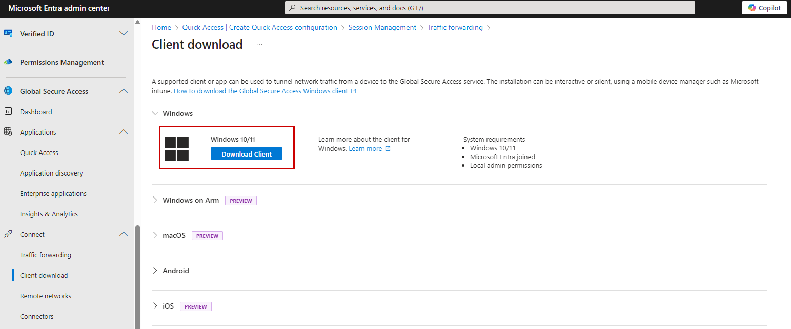
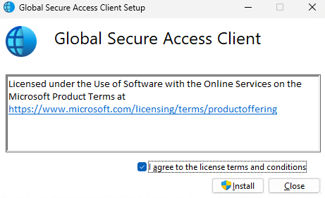
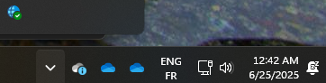
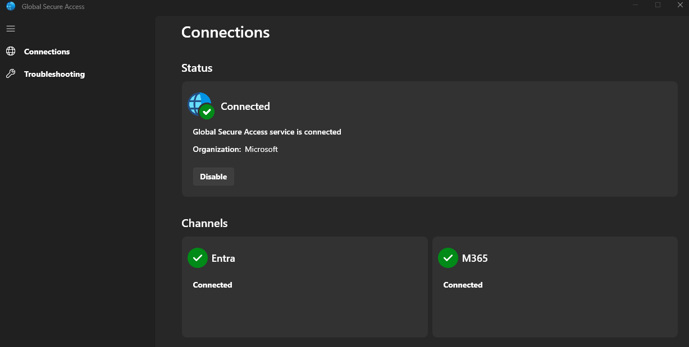
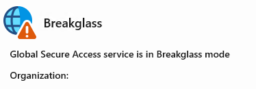
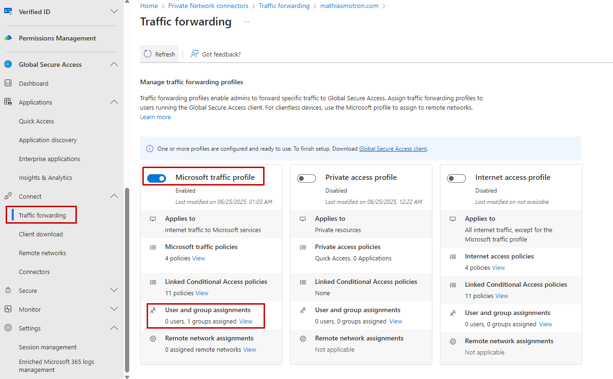
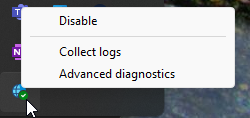
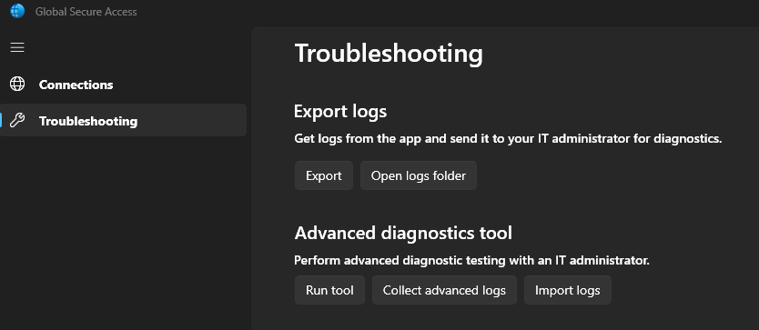
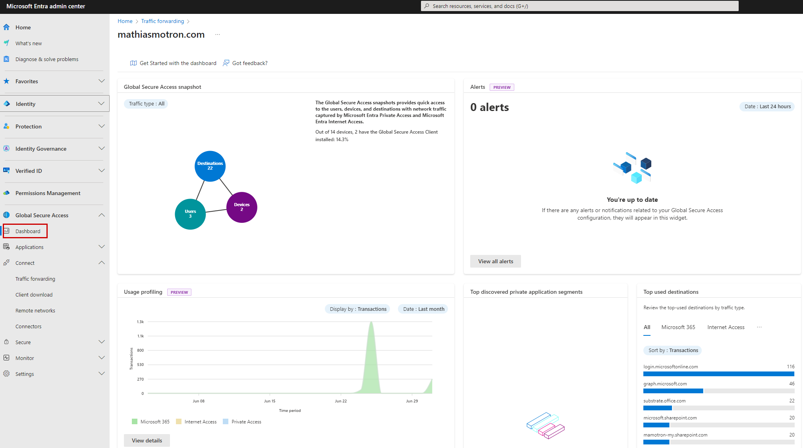

# Capturing Traffic with Microsoft Global Secure Access

## Introduction
Want a simple way to inspect and secure your network traffic right from the source? Microsoft Global Secure Access has got you covered. You can pick between:

- **Client-based capture**: Install a lightweight agent on devices (Windows only, for this lab) to grab the traffic you care about.
- **Remote network capture**: Set up an IPSec tunnel on your branch router and let it forward all matching traffic—no agents needed on individual machines.

In this guide, we’ll walk through the Windows client setup and show you how to hook up your branch site via remote network. Ready? Let’s go!

---

## Why Capture Traffic at the Edge?
- **Zero Trust** means securing traffic where it starts.  
- Filter only the apps and services you choose (think Microsoft 365, web browsing, private apps).  
- Enforce real-time checks like MFA, device compliance, and Continuous Access Evaluation (CAE).

---

## Client-Based Capture (Windows)

This method uses a **Lightweight Filter (LWF) driver** instead of a VPN adapter, so it plays nicely with other VPNs you might already have.

### What You Get
- Only the traffic you define (Microsoft, Internet, Private) goes through the SSE tunnel.  
- Everything else uses your normal network path—no surprises.  
- All the cool Zero Trust magic (MFA prompts, CAE checks) can fire before access is granted.

### What You’ll Need
- A Windows 10/11 (64-bit) device that’s **Entra joined** or **Entra hybrid joined**.  
- Local admin rights to install the client.  
- Global Secure Access license (included in Entra Suite or Internet Access).

⚠️ ->> The Global Secure Access client for Windows requires the device to be Azure AD Joined or Hybrid Joined; devices that are only Azure AD Registered aren’t supported.

### Quick Install
1. **Download**: Sign in to the Entra admin center and hit **Global Secure Access > Connect > Client download**, then grab the Windows installer.

> **Tip:** Roll it out silently via Intune by packaging the `.exe` into an `.intunewin` and using `/install /quiet /norestart`.

2. **Run it**: Launch `GlobalSecureAccessClient.exe` as an admin, accept the license, and let it do its thing.

3. **Sign in**: If it doesn’t auto sign-in, just enter your Entra credentials. You’ll see the tray icon go green when you’re connected.

---

⚠️ the tray icon can show a warning like "No policy", are you sure that the device is Entra ID Joined or Hybrid joined to your Tenant ?

⚠️ the tray icon can specify that the client is in Break glass mode if you haven't set any policy at first !

- You can enable at least 1 profile without any rule to a scoped testing users pool to be sure that everything is working fine :

---

### Peek Under the Hood
- **Tray icon**: Right-click for actions like Disable, Enable, Collect logs, and Advanced diagnostics.  
- **Status**: Hover to see if all channels (Microsoft, Internet, Private) are happy or if something’s off.

---

## Remote Network Capture

No client on devices? No problem! Point your branch router at Global Secure Access and route traffic up that tunnel.

### Why Use It
- Perfect for printers, cameras, Linux boxes—anything you can’t install an agent on.  
- Guest devices automatically get your policies without manual installs.  
- One tunnel secures the whole site—so simple.

### What You’ll Need
- A CPE (router/firewall) that supports **IPSec/IKEv2** and **BGP**.  
- Public IP and ASN for your device.  
- Enough Global Secure Access licenses to cover your bandwidth needs.

### Quick Setup
1. In Entra, head to **Global Secure Access > Connect > Remote networks** and click **Create remote network**.  
2. Fill in your router’s IP, ASN, and tunnel settings.  
3. Pick the traffic profiles you want to tunnel (Microsoft, Internet, Private).  
4. Configure your router with the endpoint address, shared key, and BGP routes.  
5. Watch for the tunnel status in Entra—once it’s Up, you’re live!

> For all the steps, see: https://learn.microsoft.com/en-us/entra/global-secure-access/how-to-assign-traffic-profile-to-remote-network

---

## 🔗 Other Clients
Not on Windows? We’ve got you:
- **macOS client**: https://learn.microsoft.com/en-us/entra/global-secure-access/how-to-install-macos-client  
- **Android client**: https://learn.microsoft.com/en-us/entra/global-secure-access/how-to-install-android-client  
- **iOS client**: https://learn.microsoft.com/en-us/entra/global-secure-access/how-to-install-ios-client

---

## You’re All Set!
Next up, we’ll dive into setting up forwarding profiles, tweaking Conditional Access policies, and monitoring your captured traffic in the Global Secure Access dashboard !

