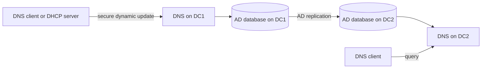
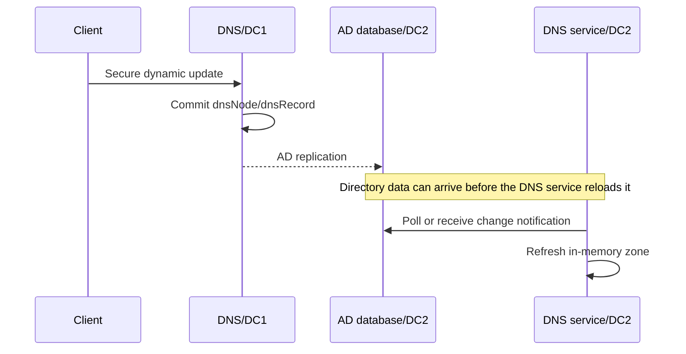

# AD-Integrated DNS Internals: Application Partitions, `_msdcs`, Replication and Record Lifecycle

Active Directory does not merely use DNS as a convenient name-resolution service. Domain controllers publish LDAP, Kerberos and Global Catalog capabilities in DNS; clients use those records to locate services; and domain controllers use DNS to find replication partners. An AD-integrated zone combines that dependency with AD's multimaster replication model.

> **TL;DR**
>
> - An AD-integrated zone is stored as `dnsZone` and `dnsNode` objects in an Active Directory naming context, not in a conventional zone file.
> - `DomainDnsZones` normally carries domain-wide DNS data; `ForestDnsZones` carries forest-wide data such as the forest-root `_msdcs` zone.
> - Netlogon registers the locator CNAME and SRV records; the DNS Client service registers host A and AAAA records.
> - AD replication convergence and DNS Server's reload of directory-backed data are separate stages. A replicated record may therefore take a short additional interval to appear in answers.
> - A DNS server on an RODC is read-only. Dynamic updates are referred to a writable DNS server and the resulting object can be replicated back on demand.

## 1. What AD integration changes

A file-backed primary zone has one writable primary and can distribute read-only copies through DNS zone transfers. An AD-integrated primary zone instead stores its data in AD DS. Every domain controller that runs DNS and holds the relevant naming context can load a writable copy of the zone.



This provides:

- multimaster updates on DNS-enabled writable DCs;
- AD replication, authentication and access control instead of zone-transfer replication between those DCs;
- secure dynamic updates;
- replication scopes aligned to a domain, forest or custom DNS application directory partition;
- no single writable zone-file primary to protect or recover.

AD integration does not make every DNS server authoritative for every AD-integrated zone. A server must run the DNS Server service and hold a replica of the directory partition that contains the zone.

## 2. Where the zone is stored

Modern AD forests normally use two built-in application directory partitions:

| Partition | Distinguished-name pattern | Default purpose |
|---|---|---|
| `DomainDnsZones` | `DC=DomainDnsZones,DC=contoso,DC=com` | Replicate zone data to DNS servers in one domain |
| `ForestDnsZones` | `DC=ForestDnsZones,DC=contoso,DC=com` | Replicate zone data to DNS servers across the forest |

The zone itself is represented beneath `CN=MicrosoftDNS` in the selected naming context. For example:

```text
DC=contoso.com,CN=MicrosoftDNS,DC=DomainDnsZones,DC=contoso,DC=com
DC=_msdcs.contoso.com,CN=MicrosoftDNS,DC=ForestDnsZones,DC=contoso,DC=com
```

Earlier deployments could store DNS data in the domain naming context. Windows Server also supports custom DNS application directory partitions, but the built-in partitions cover most designs and make intent obvious.

Inspect the zones and directory partitions with supported tools before opening ADSI Edit:

```powershell
Import-Module DnsServer

Get-DnsServerZone |
    Select-Object ZoneName, ZoneType, IsDsIntegrated, ReplicationScope,
        DynamicUpdate

Get-DnsServerDirectoryPartition |
    Select-Object DirectoryPartitionName, State, ZoneCount
```

Use ADSI Edit or LDP only for read-only investigation. Editing `dnsZone`, `dnsNode` or `dnsRecord` data directly bypasses DNS Server validation and can damage the zone.

## 3. Choose the replication scope deliberately

The replication scope controls which DNS servers receive the zone:

| Scope | Typical use |
|---|---|
| Domain | The AD domain zone, required only by DNS servers in that domain |
| Forest | Forest-wide locator data, shared service zones or data required by every domain |
| Legacy | Compatibility with the Windows 2000 domain partition; avoid for new designs |
| Custom | A deliberately selected subset of DNS servers |

Forest-wide replication is not automatically better. It increases the replica set and replication traffic. Use the narrowest scope that still makes the data available wherever it is required.

The forest-root `_msdcs` zone is the important exception: all domains need its forest locator data, so it normally resides in `ForestDnsZones`.

Create an AD-integrated zone with an explicit scope:

```powershell
Add-DnsServerPrimaryZone -Name 'apps.contoso.com' `
    -ReplicationScope Domain `
    -DynamicUpdate Secure
```

Changing scope moves the zone between naming contexts. Treat that as a replicated change: verify the destination partition is hosted by the intended DNS servers and allow convergence before declaring the old copy orphaned.

## 4. Why `_msdcs` matters

The `_msdcs.<forest-root>` namespace contains records that bind DNS names to the directory topology and service roles. The two most important families are:

1. **DC GUID CNAME records** map a domain controller's immutable NTDS Settings object GUID to its host name. AD replication uses these aliases to locate replication partners without depending on a mutable computer name.
2. **SRV records** advertise LDAP, Kerberos, Global Catalog and PDC services, globally or for a specific AD site.

Representative queries are:

```powershell
$forestRoot = (Get-ADForest).RootDomain
$domainName = (Get-ADDomain).DNSRoot

Resolve-DnsName "_ldap._tcp.dc._msdcs.$domainName" -Type SRV
Resolve-DnsName "_kerberos._tcp.$domainName" -Type SRV
Resolve-DnsName "_ldap._tcp.gc._msdcs.$forestRoot" -Type SRV
```

Site-specific records add `_<site>._sites` to the owner name. DC Locator first determines the client's AD site from its IP subnet and then prefers matching site-specific records. If a subnet is not mapped to a site, the client can receive a remote DC and event 5807 can identify the missing mapping on domain controllers.

For a packet-level treatment of site discovery, rediscovery and Automatic Site Coverage, see [How Domain Controllers are Located Across Trusts](How%20Domain%20Controllers%20are%20Located%20Across%20Trusts.md). Those mechanisms should not be duplicated as static lists of every possible SRV owner name.

### SRV priority and weight

An SRV answer includes priority, weight, port and target:

- clients try the **lowest numeric priority** first;
- among records with the same priority, **weight** influences probabilistic load distribution;
- weight is not a health check and does not guarantee an even request count.

Do not manually tune DC locator SRV records as a substitute for correct AD Sites, subnet mappings and site-link costs.

## 5. Which service registers which record

Two Windows services participate in a domain controller's DNS registration:

| Service | Primary responsibility |
|---|---|
| Netlogon | DC locator SRV records and the DC GUID CNAME |
| DNS Client (`Dnscache`) | Host A and AAAA records for eligible interfaces |

Netlogon keeps a diagnostic inventory of expected locator records in:

```text
%SystemRoot%\System32\Config\Netlogon.dns
```

Restarting Netlogon triggers locator-record registration. `ipconfig /registerdns` triggers host-record registration. They test different paths and are not interchangeable:

```powershell
Restart-Service Netlogon
ipconfig.exe /registerdns

dcdiag.exe /test:RegisterInDNS /DnsDomain:contoso.com /v
```

Avoid creating DC SRV records manually. A static record can conceal the underlying registration failure and survive after the DC or service role changes.

## 6. Replication is not the same as zone loading

An update to an AD-integrated zone follows two distinct paths on another DNS server:

1. AD DS replicates the changed directory object to the destination DC.
2. DNS Server notices or polls for the directory change and updates its in-memory view of the zone.

The DNS Server directory polling interval is historically 180 seconds by default. This explains the diagnostic case where an LDAP inspection shows a new `dnsNode` on the destination DC but DNS queries against that same server do not return it immediately.

Use current PowerShell interfaces to inspect the server's directory-integration settings:

```powershell
Get-DnsServerDsSetting |
    Format-List *
```

`dnscmd /info /dspollinginterval` remains useful when investigating an older deployment, but `dnscmd` should not be the default management interface on Windows Server 2022 or 2025. Do not reduce the polling interval merely to hide replication or registration problems; first prove which of the two stages is delayed.



## 7. Record lifecycle and deletion

A DNS name is stored as a `dnsNode` object whose `dnsRecord` attribute can contain one or more serialized resource records. Dynamic records can also carry timestamps used by aging and scavenging.

Deletion from an AD-integrated zone is a replicated directory operation. Windows DNS uses DNS tombstoning so that a deleted node is consistently removed across replicas before normal AD garbage collection eventually removes the deleted object. This is separate from:

- **DNS aging**, which determines when a dynamic record becomes stale;
- **DNS scavenging**, which initiates deletion of eligible stale records;
- the AD Recycle Bin, which is not a routine DNS record-recovery interface.

Do not calculate DNS recovery windows from the forest tombstone lifetime alone. DNS tombstoning, AD deleted-object retention, replication convergence and scavenging settings are related but distinct mechanisms.

For aging decisions and a read-only candidate report, see [DNS Aging and Scavenging Explained with Verification Script](Dns%20Aging%20and%20Scavenging%20Explained%20with%20verification%20script.md).

## 8. DNS on a read-only domain controller

An RODC can host a read-only replica of an AD-integrated zone. It answers queries locally, but it cannot commit a dynamic update to its directory database.

The update path is therefore:

1. the client queries the RODC-hosted DNS zone;
2. the RODC refers the update toward a writable DNS server/DC;
3. the writable server commits the update;
4. the updated DNS object can be replicated back to the RODC through replicate-single-object behavior instead of waiting for the normal schedule.

This preserves local query service while keeping the RODC directory read-only. If registration works against a writable DC but the RODC continues serving old data, investigate partition membership, RODC replication and zone loading rather than attempting to make the RODC writable.

## 9. Operational inventory

The following read-only inventory answers the first architecture questions on a DNS-enabled DC:

```powershell
Import-Module ActiveDirectory
Import-Module DnsServer

$server = $env:COMPUTERNAME

[pscustomobject]@{
    Server = $server
    Domain = (Get-ADDomain).DNSRoot
    Forest = (Get-ADForest).RootDomain
    IsReadOnlyDc = (Get-ADDomainController -Identity $server).IsReadOnly
}

Get-DnsServerZone -ComputerName $server |
    Sort-Object ZoneName |
    Select-Object ZoneName, ZoneType, IsDsIntegrated, ReplicationScope,
        DynamicUpdate, IsReverseLookupZone

Get-DnsServerDirectoryPartition -ComputerName $server |
    Select-Object DirectoryPartitionName, State, ZoneCount
```

Interpret the results as a model, not a checklist:

- a domain zone normally uses domain scope;
- the forest-root `_msdcs` zone normally uses forest scope;
- every intended DNS server must host the corresponding partition;
- secure dynamic updates should be used for AD zones;
- unexpected legacy or custom scopes deserve investigation before modification.

## 10. Design rules that age well

- Use AD-integrated zones for AD namespaces and allow only secure dynamic updates.
- Keep `_msdcs.<forest-root>` forest-wide and healthy.
- Align DNS replication scope with the actual consumer set.
- Model client proximity with AD Sites and subnets, not hand-built SRV records.
- Diagnose registration, AD replication and DNS zone loading as separate stages.
- Manage Windows Server 2022/2025 DNS with the `DnsServer` PowerShell module; reserve `dnscmd` for legacy operations that have no supported equivalent or for historical diagnostics.
- Never repair DNS application partitions through direct ADSI edits unless Microsoft Support provides a procedure for the exact failure.

## References

- [DNS zones in DNS Server on Windows Server](https://learn.microsoft.com/en-us/windows-server/networking/dns/zone-types)
- [Manage DNS zones using DNS Server in Windows Server](https://learn.microsoft.com/en-us/windows-server/networking/dns/manage-dns-zones)
- [Dynamic DNS Update in Windows and Windows Server](https://learn.microsoft.com/en-us/windows-server/networking/dns/dynamic-update)
- [DnsServer PowerShell module](https://learn.microsoft.com/en-us/powershell/module/dnsserver/?view=windowsserver2025-ps)
- [`dcdiag` command reference](https://learn.microsoft.com/en-us/windows-server/administration/windows-commands/dcdiag)