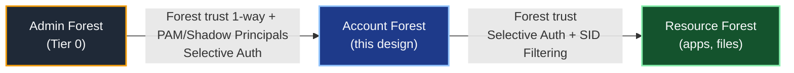
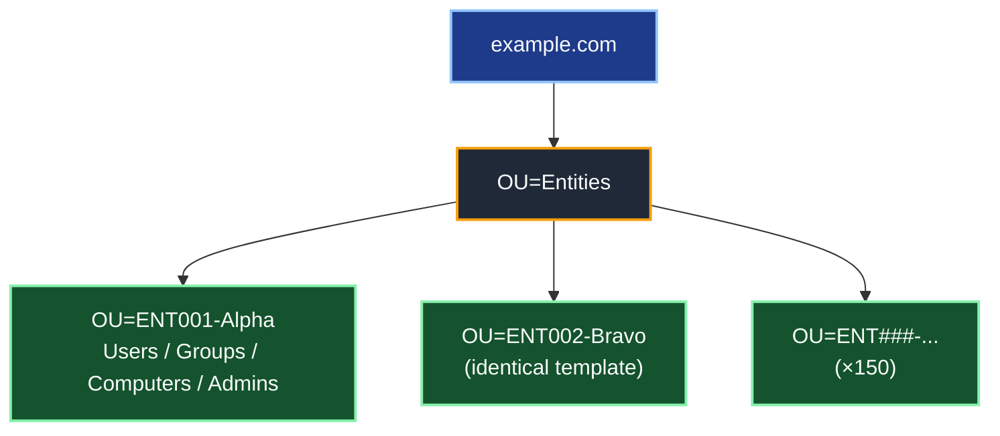

# Active Directory Design Guidelines (Architecture Overview)

## Introduction

This document is an **architecture overview** for designing a new Active Directory (AD) forest — or for reviewing an existing one against good practice. It is deliberately written as a **hub**: it lays out the structural decisions that shape every AD deployment, and links to the deeper, focused articles in this collection for the topics that deserve their own treatment (tiering, DNS scavenging, JIT elevation, foreign security principals).

The guiding philosophy is simple: **the vast majority of "good AD design" is universal.** Whether you are building a single-company forest of 8,000 users or consolidating 150 small entities into one shared infrastructure, roughly 90% of the design is identical. What changes between scenarios is not the *nature* of the model but the *degree* to which certain dials — repetition, isolation, delegation rigor — are turned up.

For that reason, this article presents the **generic model first**, then closes with a dedicated section on one demanding application of it: the **shared forest hosting multiple delegated entities**.

> **🔵 Important — scope.**
>
> This is an *architecture* document. It explains the decisions and the *why*, not every click. For security boundary enforcement it relies on, and points to, the dedicated [Active Directory Tiering Model](Active%20Directory%20Tiering%20Model%20for%20On-Prem%20Environment.md). It is not a build runbook.

### 🗂️ Quick Navigation

- [🌲 1 — Forest and Domain Design](#-1--forest-and-domain-design)
- [🗂️ 2 — Organizational Unit (OU) Design](#-2--organizational-unit-ou-design)
- [🔐 3 — Delegation Model](#-3--delegation-model)
- [🛡️ 4 — Security Baseline and Tier 0](#-4--security-baseline-and-tier-0)
- [🌐 5 — Sites, Replication and Topology](#-5--sites-replication-and-topology)
- [📡 6 — DNS Design](#-6--dns-design)
- [🔗 7 — Trusts](#-7--trusts)
- [📐 8 — Group Policy Strategy](#-8--group-policy-strategy)
- [🛠️ 9 — Tooling and Industrialization](#-9--tooling-and-industrialization)
- [🏢 10 — Applied Scenario: A Shared Forest for Multiple Entities](#-10--applied-scenario-a-shared-forest-for-multiple-entities)
- [📌 11 — Summary of Key Decisions](#-11--summary-of-key-decisions)
- [📚 References](#-references)

### 🎨 Reading Legend

- 🔴 Critical: security boundary or compromise risk
- 🟡 Warning: high chance of lockout or operational breakage
- 🔵 Important: deployment constraint or sequencing requirement
- 🟢 Recommendation: best practice to improve resilience

---

## 🌲 1 — Forest and Domain Design

### 1.1 — One forest, one domain (when you can)

🟢 **Default to a single-domain forest.** Modern AD comfortably handles millions of objects in one domain, so object count is almost never a reason to split.

#### Why a single forest

> 🔴 **The forest — not the domain — is the security boundary in Active Directory.** Every domain in a forest shares the same schema, the same configuration partition, the same Enterprise Admins group, and full transitive trust. A Domain Admin in a child domain can, through well-documented techniques (SID history, trust key abuse, schema/configuration access), reach **any** other domain in the forest. There is therefore **no security isolation between domains of the same forest** — only an *administrative convenience* boundary.

The practical consequences:

- **Splitting into multiple domains does not contain a breach.** If you need a true security/blast-radius boundary (e.g. to separate production from a hostile or untrusted environment), you need a **separate forest**, not another domain. This is exactly why the admin-forest / red-forest pattern uses a *forest*.
- **A single forest gives you one schema, one global catalog, one trust fabric.** Cross-domain operations (GC lookups, universal group membership, Kerberos referrals) all cost something; collapsing to one domain removes that cost entirely.

#### Why a single domain

A single domain is simpler on **every** axis that matters operationally:

| Multi-domain adds… | …and you rarely need it |
|---|---|
| Additional DCs per domain (each domain needs its own resilient pair) | More hardware/VMs, patching, monitoring |
| Inter-domain replication + more complex site topology | More moving parts, more failure modes |
| Two sets of FSMO roles (PDC/RID/Infrastructure per domain) | More Tier 0 to protect and document |
| Cross-domain Kerberos referrals + GC dependency for logon | Subtle auth failures when a GC is unreachable |
| `ForeignSecurityPrincipals` and SID-history baggage | Harder ACL audits, migration debt |

🟢 **Fewer domains = smaller Tier 0 attack surface.** Every domain is another set of privileged groups, KRBTGT accounts, and DCs an attacker can target. Consolidation is a **security win**, not just an ops simplification.

#### Demolishing the usual "we need another domain" arguments

Most requests for a second domain are really requests for something a single domain already provides:

- **"Different password policies per population."** → Solved by **PSOs (Fine-Grained Password Policies)** — multiple coexisting policies in one domain, targeted by group. *Example: a 25-character PSO applied to `Contoso-Tier0-Admins` while standard users keep the default 12-character policy — all inside `corp.contoso.com`.*
- **"Departments/entities must be administered separately."** → Solved by **OU delegation** (§3). Delegation is an *OU* concern, never a *domain* one. *Example: handing `OU=Sales` to the Sales IT team without giving them any rights over `OU=Finance`.*
- **"Different GPOs per population."** → Solved by **OU structure + GPO linking** (§8). *Example: a stricter lockdown GPO linked only to `OU=Call-Center`, a looser one on `OU=Engineering`.*
- **"We want a different DNS namespace per entity."** → Solved by **additional UPN suffixes** and DNS zones, without a new domain. *Example: users in `corp.contoso.com` can still sign in as `alice@fabrikam.com` by adding `fabrikam.com` as a UPN suffix.*
- **"Isolation/security between business units."** → A domain does **not** provide this (see above). If you genuinely need it, the answer is a **separate forest**, and you should weigh that cost deliberately.

#### The legitimate reasons to split

🔵 There *are* real cases — they are just rarer than people assume:

- **A separate forest** (not domain) for a hard security boundary: admin/red forest, an untrusted M&A environment, a DMZ/extranet identity, or a sovereignty/air-gap requirement.
- **A separate domain** within a forest only for: legal/regulatory **replication** constraints that forbid certain data leaving a region, drastically different **DC operational ownership**, or genuinely incompatible **domain-wide** settings that PSOs can't cover.

> 🟢 **Rule of thumb:** start with **one forest, one domain**. Add a **domain** only when a domain-wide constraint forces it, and add a **forest** only when you need a real security boundary. Complexity in AD is a permanent tax — pay it only when you must.

### 1.2 — Functional level

🟢 **Set the Forest and Domain Functional Level to the highest value your DC fleet can support.** On a greenfield forest built entirely on Windows Server 2025, that means going straight to the **Windows Server 2025 functional level** — there is no reason to deploy a new forest at an older level.

#### What the functional level actually controls

A common misconception is that the FFL/DFL "turns on" most modern AD features. It does not. The functional level mainly gates a **small number of directory-wide behaviors** and, above all, **which OS versions are allowed to be domain controllers**:

| Functional level | What it unlocks | DCs allowed |
|---|---|---|
| **Windows Server 2016** | PAM with MIM, Kerberos PKINIT Freshness Extension, rolling of NTLM secrets for "smart card required" accounts | WS2016 → WS2025 |
| **Windows Server 2025** *(new — first new level since 2016)* | **32k database page size** optional feature + general supportability | **WS2025 only** |

> 🔵 **Correction worth knowing:** Windows Server 2019 and 2022 introduced **no** new functional level — both top out at the **2016** level. Windows Server 2025 is the **first new functional level since 2016** (it maps to `DomainLevel 10` / `ForestLevel 10`).

#### The trade-off of raising to the 2025 level

🟡 Raising to the **WS2025 functional level locks every DC to Windows Server 2025**. You can no longer introduce a WS2022 DC afterwards. On a greenfield all-2025 build this is a non-issue; on an existing forest it is a real constraint to weigh.

- The headline payload of the 2025 level is the **32k database page size** — a forest-wide ESE upgrade that lifts long-standing 8k limits. *Concretely: a **multivalued, non-linked** attribute can hold roughly **3,200 values instead of ~1,200**. (Note this does **not** apply to large group membership — `member` is a **linked** attribute with its own replication mechanism and was never bound by that limit.)* The upgrade is **decided at the forest level and requires *all* DCs to be 32k-capable**, which is exactly why **doing it at forest creation is ideal** (retrofitting later is heavier).
- Beyond that, the 2025 level is largely about **supportability** — not a big bag of new end-user features.

#### Don't confuse functional level with OS-level hardening

🟢 Most of the **security value** of Windows Server 2025 comes from the **DC operating system**, *independently of the functional level*. Even at the 2016 FFL, WS2025 DCs give you:

- **Kerberos no longer issues RC4 TGTs**; PKINIT cryptographic agility.
- **LDAP sealing/signing required by default** and **LDAP over TLS 1.3**.
- **SMB signing required by default**, SMB NTLM blocking, SMB rate limiter.
- **Randomized default machine-account passwords**; confidential attributes require an encrypted connection.
- **Delegated Managed Service Accounts (dMSA)** and the latest **Windows LAPS** improvements.
- **Credential Guard on by default**, NUMA scalability (>64 cores).

➡️ **Design takeaway:** choose the OS first (WS2025 everywhere), get most of the security benefit immediately, then set the functional level as high as your DC fleet allows — for a new all-2025 forest, that is the **2025 level**, ideally with the **32k page size** decision made up front.

### 1.3 — Naming

The forest root domain name is chosen **once** and is effectively **permanent** — Microsoft is explicit that this domain "remains the forest root domain for the life cycle of the AD DS deployment." Renaming is, at best, a heavy and constrained operation. So this is a decision worth getting right on day one.

#### The recommended pattern: a dedicated, registered subdomain

🟢 Build the AD name as a **prefix + a suffix you own and have registered** with an internet registrar — typically a **dedicated subdomain** of your public domain:

```
corp.example.com   ←  prefix "corp"  +  registered suffix "example.com"
ad.example.com     ←  prefix "ad"    +  registered suffix "example.com"
```

Why this pattern, per Microsoft guidance:

- 🔵 **Registered = globally unique.** Only names registered with an internet authority are guaranteed unique. If you later **merge with or acquire** an organization that uses the same name, two infrastructures using the same DNS name **cannot interoperate**. A registered name prevents that collision.
- 🔵 **A new prefix creates a clean namespace.** Attaching a *new* prefix to an *existing* registered suffix produces a dedicated AD namespace that integrates with your existing DNS **without modifying the existing infrastructure**.
- 🟢 **Pick a prefix that won't age.** Microsoft recommends **generic prefixes** like `corp` or `ds` — never a product line, OS, business unit, or geographic name, all of which change or become misleading over time.
- 🟢 **Keep it short.** DNS is hierarchical, so a short root keeps every descendant FQDN (and therefore computer names) short and memorable.

#### Names to avoid (and the actual reason)

| Anti-pattern | Why it's a problem (per Microsoft) |
|---|---|
| **Single-label name** (`contoso`, no suffix) | Can't be registered; requires extra configuration; the DNS Server service **can't locate DCs**; domain members **don't do dynamic updates** to single-label zones by default. Microsoft: *"Do not use single-label DNS names."* |
| **`.local` / any unregistered suffix** | Explicitly *not recommended*; `.local` collides with internet-standard special use. You also can't prove ownership, so **public CAs won't issue TLS certificates** for it¹ — friction for LDAPS, ADFS, and other TLS services. |
| **A real internet TLD on the intranet** (`.com`, `.net`, `.org`) | Intranet machines that also reach the internet can hit **name-resolution errors**. |
| **Your exact public domain** (`example.com`) | Forces **split-brain DNS** — you must maintain a duplicate internal copy of the public zone. A dedicated subdomain avoids this entirely. |
| **Acronyms / business-unit / division / geographic names** | Users may not recognize an acronym; BUs and divisions **change and become obsolete or misleading**; hard-to-spell geo names hurt usability. |
| **Underscores (`_`)** | RFC-strict applications **reject** the name; older DNS servers misbehave. |

#### NetBIOS name

- 🔵 The NetBIOS domain name is limited to **15 characters**; if your prefix is ≤ 15 characters, **the NetBIOS name simply equals the prefix** (e.g. prefix `corp` → NetBIOS `CORP`).
- 🟡 Keep it **short and stable** — it is awkward to change later and is what legacy/down-level systems display. Windows uses it in **uppercase** in practice.
- Avoid periods, ampersands, and the other disallowed characters; don't reuse a reserved word (it breaks trusts).

#### A couple of hard limits to respect

- 🔵 **FQDN ≤ 64 characters.** The AD FQDN appears **twice** in every `SYSVOL` GPO path, which is itself bound by the 260-character `MAX_PATH` limit — so the directory restricts the FQDN to 64 characters. Long, deep names eat into that budget.
- 🟢 **Keep the primary DNS suffix aligned** with the AD domain name to avoid a **disjoint namespace** (computer suffix ≠ AD domain), a known source of SRV-registration and locator problems.

> ¹ Industry fact (CA/Browser Forum baseline requirements), not a Microsoft statement: since 2015 public certificate authorities no longer issue TLS certificates for internal-only or unregistered names — one more reason to base AD on a name you actually own.

---

## 🗂️ 2 — Organizational Unit (OU) Design

The OU is the unit of **two things at once**: **delegation** and **GPO linking**. You therefore design the OU tree around those two needs — *not* around the HR org chart.

### 2.1 — Two competing logics

| Logic | Strength | Weakness |
|---|---|---|
| **By object type first** (`Users` / `Groups` / `Computers` at the top) | Clean for **centralized, homogeneous** administration | Painful to delegate by scope |
| **By scope/department first** (a self-contained subtree per perimeter) | Clean **delegation** — hand the whole branch to a local admin | Slightly more repetition |

Whichever you choose, apply it **consistently**. A hybrid that changes logic at different depths becomes unmanageable.

### 2.2 — Generic baseline structure

```
example.com
│
├── OU=_Admin                 ← admin accounts, role/delegation groups, service accounts
├── OU=_Infrastructure        ← centrally managed objects (servers, gMSA), never delegated
├── OU=_Staging               ← pre-staging / unclassified objects before placement
│
├── OU=Departments (or Entities)
│   ├── OU=<Scope-A>
│   │   ├── OU=Users
│   │   ├── OU=Groups
│   │   ├── OU=Computers
│   │   └── OU=Admins         ← local admin accounts/groups for this scope
│   └── OU=<Scope-B>
│       └── (identical template)
│
└── (Domain Controllers stay in the native container)
```

### 2.3 — Rules of thumb

- 🔵 **Use an identical template** for repeated scopes — it is what makes deployment and delegation **scriptable**.
- 🟡 **Use a stable code** (`SCOPE001`) rather than the commercial name (which changes on mergers/renames); put the friendly name as a suffix.
- ⚠️ **Keep depth reasonable** (3–4 levels). Deep trees complicate GPO and delegation with no benefit.
- 🟢 Avoid **Block Inheritance**; favor a clean GPO design instead (see §8).
- 🔵 Protect OUs with **`ProtectedFromAccidentalDeletion`**.
- Note: the native **`Domain Controllers`** container does not move — DCs stay there with the Default Domain Controllers Policy.

---

## 🔐 3 — Delegation Model

### 3.1 — The golden rule: RBAC, never direct ACLs

🔴 **Never delegate rights to a user directly.** Always go through:

```
User  →  Role group  →  ACL / delegation on the OU
```

For each delegated scope, define a small, repeatable set of **role groups**:

| Role group (per scope) | Delegated scope (on the scope's branch) |
|---|---|
| `ROLE-<Scope>-UserAdmin` | Create/modify/disable users, reset passwords (non-admin), manage attributes |
| `ROLE-<Scope>-GroupAdmin` | Create/manage groups and memberships |
| `ROLE-<Scope>-ComputerAdmin` | Join/manage computer objects, read LAPS |
| `ROLE-<Scope>-Helpdesk` | Password reset + unlock only (reduced scope) |

➡️ A local admin placed in the scope-A role groups has **no rights** on scope B. **Isolation by construction.**

### 3.2 — How to apply delegation

- 🔵 Apply delegation as **ACLs on the OU**, inherited to child objects. Define each role's permission set **once**, then apply it **identically** across every scope so the model stays consistent and auditable.
- ⚠️ **Avoid one-off, click-by-click delegation.** N scopes × several roles = hundreds of permission entries — they must be applied **uniformly from a single template**, not hand-crafted per scope (which inevitably drifts).
- 🔴 **Protect admin objects**: local `OU=Admins` and role groups must not be delegable to end users (strict owner + ACL + accidental-deletion protection).
- 🟢 **Windows LAPS**: delegate *read* of the local admin password only on the computers in the scope's own OU.

### 3.3 — Isolation guardrails

- 🔴 **List Object Mode** (`dsHeuristics`) if scopes must not even *enumerate* each other's objects (by default any authenticated user can browse the directory). It strengthens confidentiality but complicates troubleshooting — evaluate the trade-off.
- 🟢 **Confidential attributes** for sensitive attributes when needed.
- ⚠️ Watch **group delegation**: a local GroupAdmin must never be able to add itself to a privileged central group.

---

## 🛡️ 4 — Security Baseline and Tier 0

Security is **not optional plumbing** — it is a structural pillar. The depth of this topic is covered in its own document; this section is the checklist that every design must satisfy.

> **🔵 See the dedicated article:** [Active Directory Tiering Model for On-Premises Environments](Active%20Directory%20Tiering%20Model%20for%20On-Prem%20Environment.md) for the full Tier 0 / Tier 1 / Tier 2 model, PAW, logon restrictions, and GPO hardening.

Baseline checklist:

- 🔴 **Tier 0 isolation**: Domain Controllers, AD-integrated DNS, and anything that can control AD belong to Tier 0. Keep Tier 0 credentials off lower tiers.
- 🔴 **Authentication Policies & Silos** to cage privileged accounts.
- 🔴 **Protected Users** for sensitive admin accounts — ⚠️ but beware Kerberos delegation side effects (these accounts cannot be delegated, which breaks double-hop apps).
- 🟢 **Force Kerberos AES, disable RC4**; require **LDAP signing + channel binding** and **SMB signing**.
- 🟢 **`ms-DS-MachineAccountQuota = 0`** — stop users from joining arbitrary machines (a classic attack vector).
- 🟢 **gMSA / dMSA** for all service accounts instead of static passwords.
- 🟢 Disable or tightly control the built-in **`Administrator`** account; prefer named admin accounts.
- 🔵 **AD backup**: system state of at least 2 DCs, plus a **tested forest recovery** procedure kept offline.

For cross-forest privileged access without permanent Domain Admins, see [Just-in-Time AD Admin Elevation with Shadow Principals (without MIM)](Just-in-Time%20AD%20Admin%20Elevation%20with%20Shadow%20Principals%20(without%20MIM).md).

---

## 🌐 5 — Sites, Replication and Topology

### 5.1 — Domain controllers

- 🔴 **Minimum 2 DCs** for resilience — never run a single DC in production.
- Object count rarely drives DC count; **fault tolerance and geography** do. A few-thousand-object directory is light.
- 🟢 In a single-domain forest, make **all DCs Global Catalog** — there is no downside.

### 5.2 — Sites

- ⚠️ **Sites model NETWORK topology, not organization.** Do not create a site per department/entity. Departments are **OUs**, not **sites**.
- Use **one site** if everything is hosted in one datacenter/region; add sites only where there are distinct physical locations with local DCs.
- 🔵 Map **subnets → sites** correctly so clients are steered to the right DC for logon and DFS.

### 5.3 — FSMO and virtualization

- Place the **PDC Emulator** on a robust, central DC; document all 5 FSMO roles.
- 🔴 For virtualized DCs, ensure **VM-GenerationID** support (modern Hyper-V/VMware) to prevent USN rollback. Hypervisor hosts running DCs are **Tier 0**.

---

## 📡 6 — DNS Design

- 🟢 Use **AD-integrated zones** (multi-master, replicated through AD).
- 🔵 Configure **Aging and Scavenging** from day one — a greenfield forest is the ideal moment to get it right. See [Dns Aging and Scavenging Explained with verification script](Dns%20Aging%20and%20Scavenging%20Explained%20with%20verification%20script.md).
- Set **forwarders** to central resolvers and **conditional forwarders** toward trusted forests (needed for cross-forest name resolution over trusts).
- 🔴 **DNS is a Tier 0 role** (hosted on the DCs). Do not delegate DNS to local admins.
- 🟢 Enable protections: **DNS socket pool**, **cache locking**, and consider **DNSSEC** on critical zones.

---

## 🔗 7 — Trusts

When the forest must interoperate with an administration forest and/or a resource forest:

| Relationship | Recommended trust |
|---|---|
| **Admin forest → account forest** (administration) | **Forest trust**, often **one-way**, ideally paired with **PAM/Shadow Principals** and **Authentication Policies/Silos**. |
| **Account forest ↔ resource forest** | **Forest trust**, transitive, one-way or two-way depending on access direction. |

Security settings:

- 🔴 **Selective Authentication** on the trust: by default (`forest-wide`) every user can authenticate everywhere. Selective auth makes you grant `Allowed to Authenticate` explicitly — strongly recommended in shared scenarios.
- 🔴 **Keep SID Filtering enabled** (default on forest trusts) — it blocks Tier 0 SID injection across the trust.
- 🟢 Force **Kerberos AES**, disable RC4 on trusts.
- 🟢 Use the **minimum trust direction** that satisfies the requirement.

For the SID-stub objects created by cross-forest group membership, see [What are FSPs — Audit and Manage them in AD](What%20are%20FSPs%20-%20Audit%20and%20Manage%20them%20in%20AD.md).



---

## 📐 8 — Group Policy Strategy

- Link a **domain baseline** (common security) high, inherited everywhere.
- Use **per-tier GPOs** (Tier 0 on DCs/infra, Tier 1 on servers), aligned with the tiering model.
- 🟡 **Limit GPO proliferation.** Many scopes × several GPOs each becomes unmanageable. Prefer **common, parameterized GPOs** over per-scope GPOs.
- 🟢 Use **Item-Level Targeting (Group Policy Preferences)** to apply conditional settings by group/OU without multiplying GPOs.
- 🟢 Base the security baseline on the **Microsoft Security Compliance Toolkit** (WS2025 baselines), and keep GPOs under **version control** so configuration is reproducible and reviewable.

---

## 🛠️ 9 — Tooling and Industrialization

The single most valuable design principle in a well-templated forest is **consistency through automation**: identical structures should be produced identically, not rebuilt by hand each time. This section is about *which capabilities to plan for*, not how to script them.

### 9.1 — Capabilities to plan for

| Need | Design choice |
|---|---|
| Forest/DC bootstrap | A **repeatable, documented build** (infrastructure-as-code mindset) rather than manual promotion |
| Security baseline | **Microsoft Security Compliance Toolkit** baselines as the reference, applied uniformly |
| Config as code | Keep **OU structure, GPOs and delegation definitions under version control** |
| GPO reproducibility | Treat GPOs as **versioned artifacts** that can be restored to a known-good state |

### 9.2 — Daily operations

| Need | Design choice |
|---|---|
| Delegation | **RBAC role groups**, never direct ACLs; documented |
| Local machine passwords | **Windows LAPS**, delegated read per scope |
| Service accounts | **gMSA / dMSA** |
| Hygiene & scoring | **PingCastle**, **Purple Knight**, and a recurring AD health review |
| Stale object cleanup | A defined **lifecycle** for inactive users/computers |
| Security monitoring | **Microsoft Defender for Identity (MDI)** on the DCs |

### 9.3 — Templated provisioning

🟢 Where a structure repeats, treat the **entity/scope as a template**: the OU subtree, the role groups, the delegation, the standard GPO links and the accidental-deletion protection should all be defined **once** and produced the **same way every time**. The design goal is that onboarding a new scope is a **single, predictable operation** — this is what keeps a large, delegated forest consistent and sustainable over time.

---

## 🏢 10 — Applied Scenario: A Shared Forest for Multiple Entities

Everything above is **generic**. This section covers the one demanding application that pushes the dials to maximum: **consolidating many independent entities into a single shared forest** (e.g. ~150 small entities of 5–150 people each), administered from an existing admin forest, with identity/provisioning handled elsewhere.

> 🔵 **Key insight:** "multiple entities" is **not** a different *model*. It is the generic delegated-OU model with three dials turned up. The architecture is the same; only the *degree* changes.

### 10.1 — What the multi-entity case actually changes

| Dimension | Impact of the multi-entity case |
|---|---|
| **1. OU symmetry / repetition** | You want an **identical OU template repeated N times** rather than one organic structure → **templated, automated provisioning becomes mandatory**, not optional. |
| **2. Horizontal isolation** | Entity A must not see/touch entity B → **watertight per-scope delegation** + optionally List-Object mode. In a single company, isolation is mostly *vertical* (by tier); here it is also *horizontal* (between peers). |
| **3. Mutually untrusted local admins** | Local IT of 150 entities do not trust each other → the **rigor of delegation isolation becomes critical**, vs admins of one IT department who broadly trust each other. |

That is all. **The multi-entity factor is one of degree (repetition, watertightness, untrusted admins), not of nature.**

### 10.2 — Concrete adaptations

- **OU root** `OU=Entities` with an **identical template** per entity (`Users / Groups / Computers / Admins`), keyed by stable entity code (`ENT001-Alpha`).
- **Templated provisioning is the cornerstone**: onboarding a 151st entity should reproduce the exact same OU tree, role groups, delegation, GPO links and protection as every other entity — predictably and identically.
- **Per-entity role groups** (`ROLE-ENT001-UserAdmin`, …) handed to that entity's local IT only — strict horizontal isolation.
- **Tier 0 stays in the admin forest** via the trust (+ PAM/Shadow Principals); **no permanent human Domain Admin** in the shared forest.
- **Consider List Object Mode** so entities cannot enumerate each other.
- **Sites still follow network topology**, not entities — do not create 150 sites for 150 entities.



---

## 📌 11 — Summary of Key Decisions

| Decision | Recommendation |
|---|---|
| **Forests / domains** | **1 forest, 1 domain** unless a hard constraint forces otherwise |
| **OU design** | Structured for **delegation + GPO**; identical template where repeated |
| **Delegation** | **RBAC role groups** applied as inherited OU ACLs; never direct ACLs |
| **Tier 0** | Isolated (or deported to an admin forest); no permanent human DA |
| **Sites** | Follow **network topology**, not org structure |
| **DCs** | **2+ DCs**, all **GC + DNS** |
| **DNS** | **AD-integrated + scavenging** from day one |
| **Trusts** | **Forest trust + Selective Auth + SID Filtering** |
| **GPO** | Domain baseline + per-tier; avoid GPO proliferation; ILT over per-scope GPOs |
| **Industrialization** | **Templated, repeatable provisioning** of each scope is the cornerstone |
| **Tooling** | LAPS, gMSA/dMSA, PingCastle/Purple Knight, MDI |

---

## 📚 References

- [Active Directory Tiering Model for On-Premises Environments](Active%20Directory%20Tiering%20Model%20for%20On-Prem%20Environment.md)
- [Just-in-Time AD Admin Elevation with Shadow Principals (without MIM)](Just-in-Time%20AD%20Admin%20Elevation%20with%20Shadow%20Principals%20(without%20MIM).md)
- [Dns Aging and Scavenging Explained with verification script](Dns%20Aging%20and%20Scavenging%20Explained%20with%20verification%20script.md)
- [What are FSPs — Audit and Manage them in AD](What%20are%20FSPs%20-%20Audit%20and%20Manage%20them%20in%20AD.md)
- Microsoft — [Best Practices for Securing Active Directory](https://learn.microsoft.com/en-us/windows-server/identity/ad-ds/plan/security-best-practices/best-practices-for-securing-active-directory)
- Microsoft — [Securing privileged access (Enterprise Access Model)](https://learn.microsoft.com/en-us/security/privileged-access-workstations/privileged-access-access-model)
- Microsoft — [Delegating administration by using OU objects](https://learn.microsoft.com/en-us/windows-server/identity/ad-ds/plan/delegating-administration-of-account-ous-and-resource-ous)
