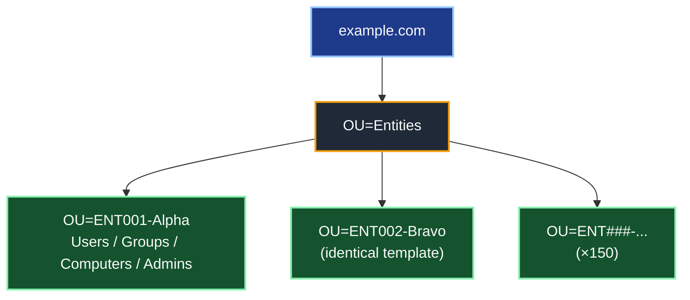

# Active Directory Design Guidelines (Architecture Overview)

## Introduction

This document is an **architecture overview** for designing a new Active Directory (AD) forest — or for reviewing an existing one against good practice. It is deliberately written as a **hub**: it lays out the structural decisions that shape every AD deployment, and links to the deeper, focused articles in this collection for the topics that deserve their own treatment (tiering, DNS scavenging, JIT elevation, foreign security principals).

**Most of "good AD design" is universal.** Whether you're standing up a single-company forest of 8,000 users or folding 150 small entities into one shared infrastructure, about 90% of the work is the same. What really changes from one scenario to the next isn't the *nature* of the model — it's how far you turn up a few dials: how much you **repeat**, how watertight the **isolation** must be, and how strict the **delegation** has to be.

For that reason, this article presents the **generic model first**, then closes with a dedicated section on one demanding application of it: the **shared forest hosting multiple delegated entities**.

> **🔵 Important — scope.**
>
> This is an *architecture* document. It explains the decisions and the *why*, not every click. For security boundary enforcement it relies on, and points to, the dedicated [Active Directory Tiering Model](Active%20Directory%20Tiering%20Model%20for%20On-Prem%20Environment.md). It is not a build runbook.

### 🗂️ Quick Navigation

- [🧭 1 — Positioning and Scope](#-1--positioning-and-scope-before-you-design)
- [🌲 2 — Forest and Domain Design](#-2--forest-and-domain-design)
- [🗂️ 3 — Organizational Unit (OU) Design](#-3--organizational-unit-ou-design)
- [🔐 4 — Delegation Model](#-4--delegation-model)
- [🛡️ 5 — Security Baseline and Tier 0](#-5--security-baseline-and-tier-0)
- [🌐 6 — Sites, Replication and Topology](#-6--sites-replication-and-topology)
- [📡 7 — DNS Design](#-7--dns-design)
- [🔗 8 — Trusts](#-8--trusts)
- [📐 9 — Group Policy Strategy](#-9--group-policy-strategy)
- [🛠️ 10 — Tooling and Industrialization](#-10--tooling-and-industrialization)
- [🏢 11 — Applied Scenario: A Shared Forest for Multiple Entities](#-11--applied-scenario-a-shared-forest-for-multiple-entities)
- [📌 12 — Summary of Key Decisions](#-12--summary-of-key-decisions)
- [📚 References](#-references)

### 🎨 Reading Legend

- 🔴 Critical: security boundary or compromise risk
- 🟡 Warning: high chance of lockout or operational breakage
- 🔵 Important: deployment constraint or sequencing requirement
- 🟢 Recommendation: best practice to improve resilience
- ⚠️ Caution: a common design mistake or nuance worth pausing on

---

## 🧭 1 — Positioning and Scope (Before You Design)

Before the first OU is drawn, four framing decisions determine *whether* and *how* an Active Directory forest should exist at all. They are the most upstream — and most often skipped — design choices. Settle them first: everything in §2–§12 is the **implementation** of the answers you give here.

### 1.1 — Do you still need AD DS at all?

🔵 **Start by justifying the forest's existence.** A 2026 greenfield is no longer an automatic "of course we deploy AD." A brand-new organization can be **cloud-native (Entra ID-only)** — devices Entra-joined, apps integrated with Entra ID, no domain controller anywhere. AD DS earns its place only when something genuinely depends on it:

- **Kerberos / NTLM** authentication for on-premises servers and legacy applications.
- **Group Policy** as the management plane for domain-joined Windows.
- **LDAP** line-of-business applications that bind to a directory.
- **File / print** servers and other on-prem workloads relying on integrated Windows authentication (SQL with Windows auth, older middleware).

➡️ **Design takeaway:** list the *actual* dependencies that require a domain. If the list is empty, you may not need AD DS — and the cheapest forest is the one you never build. If it is not empty, the forest exists to serve *those* dependencies, and that scope should shape how small and contained it can be.

### 1.2 — Hybrid by default: AD DS and Entra ID

🔵 **Almost no modern AD lives alone — design the Entra ID relationship up front.** In practice the forest is synchronized to **Entra ID**, and the *direction* and *tooling* of that sync are architecture decisions:

- **Source of authority.** By default in a hybrid sync, **on-prem AD is authoritative** and objects flow **AD → Entra ID**; cloud edits don't write back unless you deliberately enable writeback. Decide, per object class, *who is master* — it dictates where you create and edit users, groups and devices. Microsoft is now also shipping **Source-of-Authority (SOA) management** to move authority to the cloud per object as part of a broader cloud-first direction, so treat "who is master" as an explicit, evolving choice rather than a given.
- **Connect Sync vs Cloud Sync.** Two sync engines exist. **Microsoft Entra Connect Sync** is the full-featured on-prem sync server; **Microsoft Entra Cloud Sync** is the lightweight, cloud-managed model — multiple thin agents, configuration held in the cloud, native support for **disconnected / multi-forest** topologies, and **cloud-to-AD group provisioning**. Cloud Sync is Microsoft's stated strategic direction for hybrid identity; default to it unless a capability only Connect Sync offers forces your hand.
- **Hybrid join and UPN alignment.** If devices must be both domain-joined and **Hybrid Entra-joined**, the on-prem UPN suffix has to be a **routable, verified domain** in the tenant — which ties straight back to the naming choice in §2.3 (a registered, dedicated subdomain, never `.local`).

➡️ **Design takeaway:** decide the **sync direction (source of authority)**, the **sync engine (Cloud Sync by default)**, and a **routable UPN** before building — they shape naming, the identity lifecycle (§1.3), and even whether some objects should exist on-prem at all.

### 1.3 — Source of authority and the identity lifecycle (Joiner–Mover–Leaver)

🟢 **Decide where identities are born, changed and retired — before you decide where they live.** §11 says "provisioning handled elsewhere"; this is that decision made explicit. It determines the *flow* every object follows:

- **Joiner / Mover / Leaver (JML).** An identity is typically *created* from an authoritative HR / **Identity Governance & Administration (IGA)** source, *moved* (department, role, attributes) as it changes, then *disabled and deleted* on departure. Decide the **chain** — HR system → IGA/provisioning → AD → Entra ID — and which system owns each step.
- **It wires directly into the rest of the design.** A deterministic creation source is what makes the **naming convention** (§3.3) and **templated provisioning** (§10.4, §11) actually hold, and the **Leaver** half is what feeds the **stale-object lifecycle** (§10.2, keyed on `lastLogonTimestamp`).
- **Governance tooling.** Where the lifecycle is rich (access reviews, entitlement management, joiner workflows), **Entra ID Governance** can drive it for hybrid identities — but the *decision* to own JML as a process is independent of any one tool.

➡️ **Design takeaway:** name the **authoritative source** and the **JML owner** for each object class on day one. The directory is the *consumer* of that lifecycle, not its origin.

### 1.4 — Operating model and ownership: who owns Tier 0

🔵 **Name the owner of the forest's most privileged plane before you build it.** Tiering (§5) describes *what* Tier 0 is; this is the prior question of *who operates it* — a governance decision that shapes the whole build:

- **Single team vs. shared / mutualized.** One internal IT team owning everything is a very different model from the shared-forest case (§11), where Tier 0 is **deported to an administration forest** and no single entity owns it directly. Decide which you are *before* §2, because it determines whether you build **one forest or two** and where privileged identities live.
- **Standing privilege is an organizational decision, not just a technical one.** The "**zero permanent Domain Admin**" principle (§5) only holds if an *operating model* backs it — approvals, on-call, break-glass custody. Decide who approves elevation, who holds the break-glass credentials, and who is accountable for Tier 0 hygiene.
- **Document it as a deliverable.** The **FSMO** (Flexible Single Master Operations) placement (§6.4), the recovery custody (§6.7) and the delegation map (§4) are only real if a named owner maintains them.

➡️ **Design takeaway:** an AD forest is also an *operating commitment*. Decide the ownership model — single-team or admin-forest-backed — as the **first architectural fork**, because §2's "one forest or two" follows directly from it.

---

## 🌲 2 — Forest and Domain Design

### 2.1 — One forest, one domain (when you can)

🟢 **Default to a single-domain forest.** Modern AD comfortably handles millions of objects in one domain, so object count is almost never a reason to split.

#### Why a single forest

> 🔴 **The forest — not the domain — is the security boundary in Active Directory.** Every domain in a forest shares the same schema, the same configuration partition, the same Enterprise Admins group, and full transitive trust. A Domain Admin in a child domain can, through well-documented techniques (SID history, trust key abuse, schema/configuration access), reach **any** other domain in the forest. There is therefore **no security isolation between domains of the same forest** — only an *administrative convenience* boundary.

The practical consequences:

- **Splitting into multiple domains does not contain a breach.** If you need a true security/blast-radius boundary (e.g. to separate production from a hostile or untrusted environment), you need a **separate forest**, not another domain. This is exactly why the admin-forest / red-forest pattern uses a *forest*.
- **A single forest gives you one schema, one global catalog, one trust fabric.** Cross-domain operations (GC lookups, universal group membership, Kerberos referrals) all cost something; collapsing to one domain removes that cost entirely.

#### Why a single domain

A single domain is simpler on **every** axis that matters operationally:

| Multi-domain adds… | …and you rarely need it |
|---|---|
| Additional DCs per domain (each domain needs its own resilient pair) | More hardware/VMs, patching, monitoring |
| Inter-domain replication + more complex site topology | More moving parts, more failure modes |
| Two sets of FSMO roles (PDC/RID/Infrastructure per domain) | More Tier 0 to protect and document |
| Cross-domain Kerberos referrals + GC dependency for logon | Subtle auth failures when a GC is unreachable |
| `ForeignSecurityPrincipals` and SID-history baggage | Harder ACL audits, migration debt |

🟢 **Fewer domains = smaller Tier 0 attack surface.** Every domain is another set of privileged groups, KRBTGT accounts, and DCs an attacker can target. Consolidation is a **security win**, not just an ops simplification.

#### The usual "we need another domain" arguments

Most requests for a second domain are really requests for something a single domain already provides:

- **"Different password policies per population."** → Solved by **PSOs (Fine-Grained Password Policies)** — multiple coexisting policies in one domain, targeted by group. *Example: a 25-character PSO applied to `Contoso-Tier0-Admins` while standard users keep the default 12-character policy — all inside `corp.contoso.com`.* *(When several PSOs resolve to one user, the **lowest `msDS-PasswordSettingsPrecedence`** wins — it is not a union of the policies, so design the precedence values deliberately.)*
- **"Departments/entities must be administered separately."** → Solved by **OU delegation** (§4). Delegation is an *OU* concern, never a *domain* one. *Example: handing `OU=Sales` to the Sales IT team without giving them any rights over `OU=Finance`.*
- **"Different GPOs per population."** → Solved by **OU structure + GPO linking** (§9). *Example: a stricter lockdown GPO linked only to `OU=Call-Center`, a looser one on `OU=Engineering`.*
- **"We want a different DNS namespace per entity."** → Solved by **additional UPN suffixes** and DNS zones, without a new domain. *Example: users in `corp.contoso.com` can still sign in as `alice@fabrikam.com` by adding `fabrikam.com` as a UPN suffix.*
- **"Isolation/security between business units."** → A domain does **not** provide this (see above). If you genuinely need it, the answer is a **separate forest**, and you should weigh that cost deliberately.

#### The legitimate reasons to split

🔵 There *are* real cases — they are just rarer than people assume:

- **A separate forest** (not domain) for a hard security boundary: admin/red forest, an untrusted M&A environment, a DMZ/extranet identity, or a sovereignty/air-gap requirement.
- **A separate domain** within a forest only for: legal/regulatory **replication** constraints that forbid certain data leaving a region, drastically different **DC operational ownership**, or genuinely incompatible **domain-wide** settings that PSOs can't cover.

> 🟢 **Rule of thumb:** start with **one forest, one domain**. Add a **domain** only when a domain-wide constraint forces it, and add a **forest** only when you need a real security boundary.

### 2.2 — Functional level

🟢 **Set the Forest and Domain Functional Level to the highest value your DC fleet can support.** On a greenfield forest built entirely on Windows Server 2025, that means going straight to the **Windows Server 2025 functional level** — there is no reason to deploy a new forest at an older level.

#### What the functional level actually controls

A common misconception is that raising the functional level "turns on" most modern AD features. It doesn't. The functional level really does only **two** things:

1. **It sets a minimum OS version for domain controllers** — this is its main job. The level dictates **which Windows Server versions are allowed to be DCs**. *Example: at the 2025 level, every DC must be Windows Server 2025 (you can no longer add a WS2022 DC); at the 2016 level you can freely mix WS2016, 2019, 2022 and 2025 DCs.*
2. **It enables a small number of directory-wide behaviors** — a *handful*, not a big catalog (see the table below).

The table maps each level to the behaviors it unlocks and the DCs it allows:

| Functional level | What it unlocks | DCs allowed |
|---|---|---|
| **Windows Server 2016** | PAM with MIM, Kerberos PKINIT Freshness Extension, rolling of NTLM secrets for "smart card required" accounts | WS2016 → WS2025 |
| **Windows Server 2025** *(new — first new level since 2016)* | **32k database page size** optional feature + general supportability | **WS2025 only** |

> 🔵 **Correction worth knowing:** Windows Server 2019 and 2022 introduced **no** new functional level — both top out at the **2016** level. Windows Server 2025 is the **first new functional level since 2016** (it maps to `DomainLevel 10` / `ForestLevel 10`).

#### The trade-off of raising to the 2025 level

🟡 Raising to the **WS2025 functional level locks every DC to Windows Server 2025**. You can no longer introduce a WS2022 DC afterwards. On a greenfield all-2025 build this is a non-issue; on an existing forest it is a real constraint to weigh.

- The main payload of the 2025 level is the **32k database page size** — a forest-wide ESE upgrade that lifts long-standing 8k limits. *Concretely: a **multivalued, non-linked** attribute can hold roughly **3,200 values instead of ~1,200**. (Note this does **not** apply to large group membership — `member` is a **linked** attribute with its own replication mechanism and was never bound by that limit.)* The upgrade is **decided at the forest level and requires *all* DCs to be 32k-capable**, which is exactly why **doing it at forest creation is ideal** (retrofitting later is heavier).
- Beyond that, the 2025 level is largely about **supportability** — not a big bag of new end-user features.

#### Don't confuse functional level with OS-level hardening

🟢 Most of the **security value** of Windows Server 2025 comes from the **DC operating system**, *independently of the functional level*. Even at the 2016 functional level, WS2025 DCs give you:

- **Kerberos no longer issues RC4 Ticket-Granting Tickets (TGTs)**; PKINIT cryptographic agility.
- **LDAP sealing/signing required by default** and **LDAP over TLS 1.3**.
- **SMB signing required by default**, SMB NTLM blocking, SMB rate limiter.
- **Randomized default machine-account passwords**; confidential attributes require an encrypted connection.
- **Delegated Managed Service Accounts (dMSA)** and the latest **Windows LAPS** improvements.
- **Credential Guard on by default**, NUMA (Non-Uniform Memory Access) scalability (>64 cores).

➡️ **Design takeaway:** choose the OS first (WS2025 everywhere), get most of the security benefit immediately, then set the functional level as high as your DC fleet allows — for a new all-2025 forest, that is the **2025 level**, ideally with the **32k page size** decision made up front.

### 2.3 — Naming

The forest root domain name is chosen **once** and is effectively **permanent** — Microsoft is explicit that this domain "remains the forest root domain for the life cycle of the AD DS deployment." Renaming is, at best, a heavy and constrained operation.

#### The recommended pattern: a dedicated, registered subdomain

🟢 Build the AD name as a **prefix + a suffix you own and have registered** with an internet registrar — typically a **dedicated subdomain** of your public domain:

```
corp.example.com   ←  prefix "corp"  +  registered suffix "example.com"
ad.example.com     ←  prefix "ad"    +  registered suffix "example.com"
```

Why this pattern, per Microsoft guidance:

- 🔵 **Registered = globally unique.** Only names registered with an internet authority are guaranteed unique. If you later **merge with or acquire** an organization that uses the same name, two infrastructures using the same DNS name **cannot interoperate**. A registered name prevents that collision.
- 🔵 **A new prefix creates a clean namespace.** Attaching a *new* prefix to an *existing* registered suffix produces a dedicated AD namespace that integrates with your existing DNS **without modifying the existing infrastructure**.
- 🟢 **Pick a prefix that won't age.** Microsoft recommends **generic prefixes** like `corp` or `ds` — never a product line, OS, business unit, or geographic name, all of which change or become misleading over time.
- 🟢 **Keep it short.** DNS is hierarchical, so a short root keeps every descendant FQDN (and therefore computer names) short and memorable.

#### Names to avoid (and the actual reason)

| Anti-pattern | Why it's a problem (per Microsoft) |
|---|---|
| **Single-label name** (`contoso`, no suffix) | Can't be registered; requires extra configuration; the DNS Server service **can't locate DCs**; domain members **don't do dynamic updates** to single-label zones by default. Microsoft: *"Do not use single-label DNS names."* |
| **`.local` / any unregistered suffix** | Explicitly *not recommended*; `.local` collides with internet-standard special use. You also can't prove ownership, so **public CAs won't issue TLS certificates** for it¹ — friction for LDAPS, AD FS, and other TLS services. |
| **A real internet TLD on the intranet** (`.com`, `.net`, `.org`) | Intranet machines that also reach the internet can hit **name-resolution errors**. |
| **Your exact public domain** (`example.com`) | Forces **split-brain DNS** — you must maintain a duplicate internal copy of the public zone. A dedicated subdomain avoids this entirely. |
| **Acronyms / business-unit / division / geographic names** | Users may not recognize an acronym; BUs and divisions **change and become obsolete or misleading**; hard-to-spell geo names hurt usability. |
| **Underscores (`_`)** | RFC-strict applications **reject** the name; older DNS servers misbehave. |

#### NetBIOS name

- 🔵 The NetBIOS domain name is limited to **15 characters**; if your prefix is ≤ 15 characters, **the NetBIOS name simply equals the prefix** (e.g. prefix `corp` → NetBIOS `CORP`).
- 🟡 Keep it **short and stable** — it is awkward to change later and is what legacy/down-level systems display. Windows uses it in **uppercase** in practice.
- Avoid periods, ampersands, and the other disallowed characters; don't reuse a reserved word (it breaks trusts).

#### A couple of hard limits to respect

- 🔵 **FQDN ≤ 64 characters.** The AD FQDN appears **twice** in every `SYSVOL` GPO path, which is itself bound by the 260-character `MAX_PATH` limit — so the directory restricts the FQDN to 64 characters. Long, deep names eat into that budget.
- 🟢 **Keep the primary DNS suffix aligned** with the AD domain name to avoid a **disjoint namespace** (computer suffix ≠ AD domain), a known source of SRV-registration and locator problems.

> ¹ Industry fact (CA/Browser Forum baseline requirements), not a Microsoft statement: since 2015 public certificate authorities no longer issue TLS certificates for internal-only or unregistered names — one more reason to base AD on a name you actually own.

---

## 🗂️ 3 — Organizational Unit (OU) Design

The OU is the unit of **two things at once**: **delegation** and **GPO linking**. You therefore design the OU tree around those two needs — *not* around the HR org chart. The org chart changes every reorg; administration is far more stable, so the right design question is never *"how is the company organized?"* but:

> **"Who administers what, and which GPOs must apply to what?"**

### 3.1 — The core decision: what goes at the top of the tree?

This is the choice that shapes everything else, and it is usually framed wrongly as an either/or:

| Logic | Strength | Weakness |
|---|---|---|
| **By object type first** (`Users` / `Groups` / `Computers` near the top) | Simple, few OUs, no repetition; centralized, homogeneous administration | You **cannot** cleanly hand "the Sales objects" to a Sales admin |
| **By scope/department first** (a self-contained subtree per perimeter) | Clean **delegation** — hand a whole branch to a local admin, isolated by construction | Slightly more repetition |

🟢 **In reality you almost always do both** — the real question is *which logic sits at the top* (the first sort key). And the answer is dictated by **one thing: delegation**, because **delegation is inherited down a subtree**. So whatever you need to delegate as a unit must be a subtree.

#### What actually decides it

| Decisive question | → Top-level structure |
|---|---|
| Is administration **delegated per perimeter** (local IT teams, separate entities, admins who don't trust each other)? | **Yes → scope/entity first** |
| Is administration **centralized** — one IT team, isolation between populations is not a requirement? | **Yes → object type first** (simpler) |

#### Case A — Centralized administration → object type first

If a **single IT team** runs everything, splitting `Users` / `Computers` / `Groups` at the top is the simplest choice — fewer OUs, no repetition, and it maps naturally to GPO (user vs computer settings are separate anyway):

```
corp.contoso.com
├── OU=Users         (whole company)
├── OU=Computers
└── OU=Groups
```

→ Fits a single-IT organization, or any perimeter where **nobody needs to be isolated from anybody**.

#### Case B — Delegated administration → scope/entity first

The moment you must hand **"all of Sales"** to the Sales IT team **without** letting them touch Finance, Sales has to be a **self-contained subtree** holding its own users, computers and groups:

```
corp.contoso.com
└── OU=Departments
    ├── OU=Sales
    │   ├── OU=Users
    │   ├── OU=Computers
    │   ├── OU=Groups
    │   └── OU=Admins
    └── OU=Finance
        └── (identical template)
```

→ You set **one delegation on `OU=Sales`**, inherited to the whole branch. Isolation by construction.

🔴 **Why Case A breaks here:** if every user lives in one global `OU=Users`, you **cannot** cleanly delegate "the Sales users" to the Sales team — you'd be reduced to per-object ACLs, which is unmanageable and drifts immediately. **Delegation wants a subtree per perimeter.**

#### The nuance: it's a spectrum, not a binary

- 🟢 **Very small organization (single IT, a few dozen seats):** don't over-engineer. The flat object-type model (Case A) is perfectly fine — a per-department tree you never actually delegate is just empty ceremony.
- 🔵 **Growing / multi-team / multi-entity:** the more administration fragments, the further **up** the tree the scope dimension must move. At the extreme (many mutually-untrusted entities), the per-scope subtree becomes mandatory — that's the applied scenario in §11.
- ⚠️ **Whatever you pick, stay consistent.** The one genuinely unmanageable design is a **hybrid that switches logic by depth** (object-type here, scope there, at the same level). Pick the top-level key and apply it uniformly.

> 🟢 **Rule of thumb:** put **scope at the top only to the extent you actually delegate by scope**. No delegation boundary → object type first (simpler). Delegation boundary → scope first (so the boundary is a subtree). Everything else follows from that.

Note that admin/tiering OUs (`_Admin`, `_Infrastructure`, `_Staging` below) are a **separate, transverse axis**: they are organized by *function/tier*, independently of the production scopes — which is itself a deliberate, consistent split, not a contradiction.

### 3.2 — Generic baseline structure

```
example.com
│
├── OU=_Admin                 ← admin accounts, role/delegation groups, service accounts
├── OU=_Infrastructure        ← centrally managed objects (servers, gMSA), never delegated
├── OU=_Staging               ← pre-staging / unclassified objects before placement
│
├── OU=Departments (or Entities)
│   ├── OU=<Scope-A>
│   │   ├── OU=Users
│   │   ├── OU=Groups
│   │   ├── OU=Computers
│   │   │   ├── OU=Servers
│   │   │   └── OU=Workstations
│   │   └── OU=Admins         ← local admin accounts/groups for this scope
│   └── OU=<Scope-B>
│       └── (identical template)
│
└── (Domain Controllers stay in the native container)
```

### 3.3 — Practical rules

- 🔵 **Use an identical template** for repeated scopes — it is what makes deployment and delegation **scriptable**.
- 🟡 **Use a stable code** (`SCOPE001`) rather than the commercial name (which changes on mergers/renames); put the friendly name as a suffix.
- 🟢 **Fix object naming conventions on day one too** — not just OU names. Decide a deterministic, collision-resistant scheme for `samAccountName`/UPN (e.g. `firstname.lastname`, with a documented tie-break rule for duplicates) and for computer names (a short, stable prefix encoding role/site, within the **15-character NetBIOS** limit). A convention chosen up front is far cheaper than renaming thousands of objects later, and it keeps scripted provisioning (§10) predictable.
- 🟢 **Split `Computers` by machine role — at least Servers vs. Workstations.** A server baseline and a workstation baseline are never the same GPO, so separating them is what makes GPO targeting clean (link the server baseline to `OU=Servers`, the workstation baseline to `OU=Workstations`) instead of relying on WMI filters or security-group filtering. Subdivide further by role only where the GPO set genuinely differs (e.g. `Servers/RDS`, `Servers/SQL`) — not for cosmetic grouping.
- ⚠️ **Keep depth reasonable** (3–4 levels). Deep trees complicate GPO and delegation with no benefit.
- 🟢 Avoid **Block Inheritance**; favor a clean GPO design instead (see §9).
- 🔵 Protect OUs with **`ProtectedFromAccidentalDeletion`**.
- 🟢 **Redirect the two default object containers on day one (`redirusr` / `redircmp`).** A user or computer created without an explicit OU lands in the built-in **`CN=Users`** / **`CN=Computers`** containers — and those are **containers, not OUs**, so **no GPO can be linked to them** and you cannot delegate them cleanly. Point the defaults at real OUs once at build time (`redirusr "OU=_Staging,DC=corp,DC=example,DC=com"` and the equivalent `redircmp`) so that even an object created by a down-level tool or a forgotten `-Path` still receives your baseline GPOs and lands somewhere you administer. *(Requires the WS2003 domain functional level or higher — always met on a greenfield build.)*
- Note: the native **`Domain Controllers`** container does not move — DCs stay there with the Default Domain Controllers Policy.

### 3.4 — The administration axis: tiering in the OU tree

🔵 **The production scopes are only one axis; administration is a second, transverse one — and it must have its own OU subtree, organized by *tier*, not by department.** The `_Admin` node in the baseline is where the **tiering model (§5)** physically lands in the directory: it is the structure on which Authentication Policies & Silos, logon-restriction GPOs, and the *zero standing privilege* model are applied. Designing it as a clean tier subtree on day one is what makes all of §5 enforceable later.

```
example.com
└── OU=_Admin
    ├── OU=Tier0                     ← controls the forest itself
    │   ├── OU=Accounts              (DA/EA, Tier 0 admin accounts)
    │   ├── OU=Groups                (Tier 0 role/delegation groups)
    │   ├── OU=ServiceAccounts       (gMSA/dMSA used by Tier 0)
    │   └── OU=PAWs                  (Privileged Access Workstations)
    ├── OU=Tier1                     ← server / application admins
    │   ├── OU=Accounts
    │   ├── OU=Groups
    │   └── OU=ServiceAccounts
    └── OU=Tier2                     ← workstation / helpdesk admins
        ├── OU=Accounts
        ├── OU=Groups
        └── OU=ServiceAccounts
```

- 🔴 **One Authentication Silo per tier** maps directly onto these subtrees, so the boundary you draw in OUs *is* the boundary you enforce in Kerberos.
- 🔴 **An admin account never lives in a production scope OU.** A Tier 0 identity belongs in `_Admin/Tier0/Accounts`, not in `Departments/<Scope>/Admins`; the per-scope `Admins` OU is for **local, lower-tier** delegated roles only.
- 🟢 **Keep the tier axis identical and scriptable** just like the production template — the silos, GPOs and group nesting are then repeatable across tiers.

> 🔵 This is the *shape* of the tiering model in the directory. The full Tier 0/1/2 logic, logon restrictions and per-tier GPO hardening live in the [Active Directory Tiering Model](Active%20Directory%20Tiering%20Model%20for%20On-Prem%20Environment.md) — this section only fixes **where it sits in the OU tree**.

### 3.5 — Object lifecycle: staging and placement

🔵 **Decide how an object *enters* the directory and *moves to its final OU* — placement is a flow, not a one-off.** This is where the `_Staging` OU earns its place and where the **Joiner–Mover–Leaver** lifecycle (§1.3) meets the OU design:

- **Created → staged.** New users/computers land in `_Staging` (or arrive there via `redirusr`/`redircmp`), where they receive a **minimal, safe baseline** GPO and **no production rights** — a deliberate quarantine.
- **Classified → placed.** Provisioning (§10.4) moves the object into its **final scope/tier OU**, at which point the scope's delegation and GPOs apply. The move is the act that grants the object its real posture.
- **Disabled → retired.** On *Leaver*, the object is disabled, moved to a `_Disabled` holding OU (out of all production scopes, stripped of group membership), and deleted after a retention window — feeding the stale-object hygiene of §10.2.

➡️ **Design takeaway:** an OU tree is not only *where objects rest* but *the path they travel*. Define the **entry point, the promotion step, and the exit OU** up front so no object is ever live without having passed through your baseline.

### 3.6 — OU anti-patterns to avoid

> ⚠️ **Quick review checklist — the recurring OU-design mistakes, each covered above:**
>
> - **Modeling the tree on the HR org chart** instead of administration (§3 intro).
> - **Switching the sort key by depth** — object-type here, scope there (§3.1).
> - **Block Inheritance scattered** as invisible GPO exceptions (§3.3, §9).
> - **A flat `Computers` OU** mixing servers and workstations (§3.3).
> - **Over-deep trees** with levels you never delegate or link a GPO to (§3.3).
> - **Privileged accounts left in production scope OUs** instead of the tier subtree (§3.4).

---

## 🔐 4 — Delegation Model

### 4.1 — The golden rule: RBAC, never direct ACLs

🔴 **Never delegate rights to a user directly.** Always go through:

```
User  →  Role group  →  ACL / delegation on the OU
```

For each delegated scope, define a small, repeatable set of **role groups**:

| Role group (per scope) | Delegated scope (on the scope's branch) |
|---|---|
| `ROLE-<Scope>-UserAdmin` | Create/modify/disable users, reset passwords (non-admin), manage attributes |
| `ROLE-<Scope>-GroupAdmin` | Create/manage groups and memberships |
| `ROLE-<Scope>-ComputerAdmin` | Join/manage computer objects, read LAPS |
| `ROLE-<Scope>-Helpdesk` | Password reset + unlock only (reduced scope) |

➡️ A local admin placed in the scope-A role groups has **no rights** on scope B. **Isolation by construction.**

🟢 **Group scope — follow the A-G-DL-P model.** The group that actually *holds the permission* on the OU should be a **Domain Local** group; the **accounts** go into a **Global** group, which is then nested into the Domain Local one (**A**ccounts → **G**lobal → **D**omain **L**ocal → **P**ermission). Domain Local is the scope designed to carry resource permissions, and it can contain Global groups from any domain in the forest — which keeps the model clean if the forest ever grows beyond one domain. In a single-domain forest you can get away with plain Global role groups, but A-G-DL-P costs nothing up front and scales if the forest later grows beyond one domain.

🟢 **Prefer Global over Universal for role groups (single domain).** A **Universal** group has its full membership replicated to **every Global Catalog** in the forest; a **Global** (or Domain Local) group's membership is not. In a single-domain forest, Universal adds needless GC replication for no benefit over Global — so reserve it for genuine cross-domain cases.

🟡 **Keep group nesting flat to avoid Kerberos token bloat.** Every group a user belongs to (directly *and* through nesting, plus `SIDHistory`) adds a SID to their Kerberos ticket. Past a certain count the ticket exceeds the Kerberos **`MaxTokenSize`** and authentication **fails in confusing ways** — broken access to file shares, HTTP 400 "bad request / header too large" on web apps, logon oddities — rather than producing a clear "too many groups" error. So the A-G-DL-P layering above is right, but resist *deep* or redundant nesting: keep memberships purposeful, clean up `adminCount`/`SIDHistory` leftovers, and watch the per-account group count as a design metric on a large or long-lived forest.

### 4.2 — How to apply delegation

- 🔵 Apply delegation as **ACLs on the OU**, inherited to child objects. Define each role's permission set **once**, then apply it **identically** across every scope so the model stays consistent and auditable.
- ⚠️ **Avoid one-off, click-by-click delegation.** N scopes × several roles = hundreds of permission entries — they must be applied **uniformly from a single template**, not hand-crafted per scope (which inevitably drifts).
- 🔴 **Grant the narrowest right set — never `Full Control`.** Delegate only the specific permissions a role needs (e.g. *Reset Password* on user objects, *Create/Delete Computer objects*). `Full Control` — or any permission that includes **`WriteDACL`/`WriteOwner`** — lets the delegate **rewrite the OU's ACL or take ownership** and silently escalate their own rights. Least privilege here is a security boundary, not just tidiness.
- 🔴 **Protect admin objects**: local `OU=Admins` and role groups must not be delegable to end users (strict owner + ACL + accidental-deletion protection).
- 🟢 **Windows LAPS**: delegate *read* of the local admin password only on the computers in the scope's own OU.

### 4.3 — Isolation guardrails

- ⚠️ **Enumeration isolation is a separate question from delegation.** By default any authenticated user can *browse* the whole directory; delegation only stops them *changing* things. If peers must not even **enumerate** each other's objects, AD offers **List Object Mode** — but it is a **forest-wide** change that can break directory-enumerating apps and adds overhead, so treat it as **only-if-required**, never a default. (Implementation detail deported to the Tiering Model / hardening references.)
- 🟢 **Confidential attributes** for sensitive attributes when needed.
- ⚠️ Watch **group delegation**: a local GroupAdmin must never be able to add itself to a privileged central group.

### 4.4 — The AdminSDHolder / SDProp gotcha

🔵 There is one mechanism that **silently overrides OU delegation**, and every delegation design must account for it: AD keeps a master copy of the permissions for its most privileged accounts and, on a schedule, stamps that copy back over them — so any delegation you set on those accounts simply doesn't stick.

- A background process called **SDProp** runs **every 60 minutes on the PDC Emulator**. It compares the ACL of every **protected** account and group against the template ACL on the **`AdminSDHolder`** object (in `CN=System`), and **resets** any that differ.
- Crucially, **inheritance is disabled** on these protected objects — and it **stays disabled even if you move the object into another OU**. They are flagged with **`adminCount = 1`**.
- 🔴 **Consequence for delegation:** an ACL you set on an OU is **inherited** to its children — but a protected object placed in that OU **does not inherit it**. So delegation simply **does not apply** to protected accounts/groups. Worse, an account that *used* to be in a privileged group can be left **orphaned** with `adminCount = 1` and broken inheritance long after it was removed — a frequent source of "why doesn't my delegation work on this one user?".
- The protected set includes **Administrator, Administrators, Domain Admins, Enterprise Admins, Schema Admins, Account/Server/Print/Backup Operators, Domain Controllers, RODC, Replicator, Key/Enterprise Key Admins, and krbtgt**.

➡️ **Design takeaways:** keep **privileged accounts out of delegated production OUs** entirely (they belong in Tier 0 / admin OUs anyway, per §5); **audit for orphaned `adminCount = 1` objects** as part of routine hygiene; and never try to "fix" a protected object's ACL directly — SDProp will revert it within the hour. If you must change protected-object permissions, you edit the `AdminSDHolder` template (with great care).

---

## 🛡️ 5 — Security Baseline and Tier 0

Security is a structural pillar, covered in depth in its own document. This section is the checklist every design must satisfy.

> **🔵 See the dedicated article:** [Active Directory Tiering Model for On-Premises Environments](Active%20Directory%20Tiering%20Model%20for%20On-Prem%20Environment.md) for the full Tier 0 / Tier 1 / Tier 2 model, Privileged Access Workstations (PAW), logon restrictions, and GPO hardening.

Baseline checklist:

- 🔴 **Tier 0 isolation**: Domain Controllers, AD-integrated DNS, and anything that can control AD belong to Tier 0. Keep Tier 0 credentials off lower tiers.
- 🔴 **Treat every domain controller as a single-role appliance.** A DC's attack surface *is* a design choice. Build it on **Server Core** (no GUI, far fewer components to patch), run **nothing else on it** — no additional roles, no line-of-business software, no third-party agents beyond what Tier 0 mandates — and never use it for general browsing or as an admin jump box. The more a DC does, the more code can compromise the directory.
- 🔴 **Authentication Policies & Silos** to cage privileged accounts.
- 🔴 **Protected Users** for sensitive admin accounts — ⚠️ but beware Kerberos delegation side effects (these accounts cannot be delegated, which breaks double-hop apps).
- 🔴 **Treat Kerberos delegation as a design decision, not a default.** Unconstrained delegation is a credential-theft trap — a server granted it caches the TGT of every user who reaches it, so a single compromised host can impersonate a Domain Admin. **Ban unconstrained delegation by design**; where a service genuinely needs to act on a user's behalf, use **constrained delegation** or **Resource-Based Constrained Delegation (RBCD)** scoped to the exact target. Mark every Tier 0 / sensitive account **`Account is sensitive and cannot be delegated`** (or place it in **Protected Users**) so it can never be delegated at all. Audit `userAccountControl` for the `TRUSTED_FOR_DELEGATION` flag as part of hygiene.
- 🟢 **gMSA / dMSA** for all service accounts instead of static passwords. On a WS2025 build, prefer the new **delegated MSA (dMSA)** where you can: its secret is **machine-bound** and never leaves the DC (so a stolen ticket can't be replayed and the account is **kerberoasting-resistant**), and an **existing standard service account can be superseded in place** — `Start-ADServiceAccountMigration` then `Complete-ADServiceAccountMigration` move the SPNs and delegation onto the dMSA and disable the old account, with **no reconfiguration on the servers that consume it**. *(Note: you can't migrate an existing gMSA or legacy MSA to a dMSA — only a standard account.)*
- 🟢 Disable or tightly control the built-in **`Administrator`** account; prefer named admin accounts.
- 🔴 **Design in break-glass (emergency access) accounts.** Standing privilege is removed by design (JIT below), so you need a deliberate way back in when the elevation path itself fails. Provision **at least two emergency Domain/Enterprise Admin accounts**, each with a long random password **split and sealed** (vault or physical safe, under named custody — tie this to the ownership decision in §1.4), **excluded from the JIT/approval workflow** so they always work, and **monitored**: any logon by one of these accounts should raise an immediate alert. They are the last resort, not a daily tool.
- 🔵 **Make auditing and detection a design baseline.** Decide up front *what* the directory must record and *where it goes*: enable the **Advanced Audit Policy** on DCs (account logon, directory-service changes, privilege use), place **SACLs** on the high-value objects (the `AdminSDHolder` object, Tier 0 OUs and groups, the domain root) so changes to them are logged, and **forward DC security logs off-box to a central collector / SIEM** so an attacker who clears a local log can't erase the trail. Plan **Microsoft Defender for Identity** sensor coverage (§10.2) on top. The exhaustive audit-subcategory list is hardening detail (deported to the references); the *decision to capture and centralize* is a design one.
- 🔵 **Forest recoverability**: treat backups and a tested forest-recovery plan as a design pillar in their own right — see **§6.7**.

> 🔵 **This is the *design-level* minimum, not the hardening catalogue.** The items above are the structural security decisions a forest design must bake in. The **exhaustive** hardening surface — protocol and crypto enforcement, OS-level controls, CVE-driven settings, per-tier GPO baselines — is a **separate discipline** that this design hub deliberately does **not** re-list. Apply it in full from the dedicated references: the per-tier GPO hardening in the [Tiering Model](Active%20Directory%20Tiering%20Model%20for%20On-Prem%20Environment.md), the [Microsoft Security Compliance Toolkit](https://www.microsoft.com/en-us/download/details.aspx?id=55319) baselines, and the host-side measures in [WDAC, HVCI, Credential Guard & LSA Protection](../../040%20-%20Endpoint%20Security/OS%20Hardening/WDAC,%20HVCI,%20Credential%20Guard%20&%20LSA%20Protection.md). The rule of thumb: **design decides the structure; the hardening baseline decides the settings — follow it, don't paraphrase it.**

#### Eliminating standing privilege — the JIT decision

🟢 **Design for zero permanent privileged membership.** A clean directory has **no permanent human Domain/Enterprise Admin**: privileged accounts are *empty* of standing rights, and elevation is granted **just-in-time** for a bounded window, then expires on its own. This is a design decision to make up front, because it shapes where your admin identities live and how the forest is built — not a setting you bolt on afterwards.

AD ships **two native JIT mechanisms**, and which one fits is a function of whether you run a separate administration forest:

- 🔵 **TTL group membership (single forest).** Since the 2016 functional level, AD supports **expiring links**: an admin account is added to a privileged group with a **time-to-live**, and the membership is removed automatically when it lapses. It is native, operationally simple, and easy to wrap with an approval or ticket reference — the natural starting point when there is **no admin/bastion forest**. It reduces standing privilege but does **not** create a new trust boundary (if Tier 0 is already compromised, it can be bypassed). See [Active Directory Just In Time Administration in a Single Forest](../How-to/Active%20Directory%20Just%20In%20Time%20Administration/Active%20Directory%20Just%20In%20Time%20Administration.md).
- 🔵 **PAM trust + shadow principals (admin/bastion forest).** AD's **Privileged Access Management Optional Feature** combined with a **forest trust** and **shadow principals** delivers cross-forest JIT elevation, keeping Tier 0 identities entirely outside the production forest — the same model §11 leans on. It adds a real administrative boundary, at the cost of running a second forest (and the PAM feature is **irreversible** once enabled). See [Just-in-Time AD Admin Elevation with Shadow Principals (without MIM)](Just-in-Time%20AD%20Admin%20Elevation%20with%20Shadow%20Principals%20(without%20MIM).md).

➡️ **Design takeaway:** commit to **JIT elevation with near-zero standing privilege** as a principle; pick the *mechanism* (in-forest TTL vs. bastion-forest shadow principals) to match whether an administration forest is part of your model — both are native, neither requires MIM or the cloud.

---

## 🌐 6 — Sites, Replication and Topology

### 6.1 — Domain controllers

- 🔴 **Minimum 2 DCs** for resilience — never run a single DC in production.
- Object count rarely drives DC count; **fault tolerance and geography** do. A few-thousand-object directory is light.
- 🟢 In a single-domain forest, make **all DCs Global Catalog** — there is no downside.
- 🔵 For a **physically insecure location** (branch office, unstaffed closet), prefer a **Read-Only Domain Controller (RODC)**: it holds no writable copy of the directory and, by default, **caches no account secrets** — so a stolen RODC exposes far less than a full DC.
- 🔵 **The RODC's real design lever is its Password Replication Policy (PRP).** "Caches no secrets" is only the *default*: the PRP — an **Allowed** list and a **Denied** list — is what decides *whose* credentials the RODC may cache locally. Deliberately allow only the accounts that genuinely sign in at that site (and never a Tier 0 / privileged account), so a stolen RODC can leak, at worst, that handful of site-local passwords. Design the PRP per site. *(Established RODC behavior.)*

### 6.2 — Centralized or distributed DCs?

This design answer has **changed over time** and deserves a deliberate decision rather than a reflex.

Microsoft characterizes a branch/remote site as one with *"relatively few users, poor physical security, relatively poor network bandwidth to a hub site"*. Historically the deciding factor was that **last point**: slow, unreliable WAN links meant you put a DC (or RODC) in every site so users could still authenticate when the link was congested or down.

> 🟢 **What changed:** the widespread availability of **fast, reliable, often redundant links** (fiber, SD-WAN, 4G/5G failover) has largely removed the *bandwidth* argument. The modern default for most organizations is therefore to **centralize DCs in two or more datacenters** and let remote sites authenticate over the WAN — which also **shrinks the Tier 0 footprint** (fewer physically-exposed DCs to protect, consistent with §2.1 and the RODC note above).

A local DC/RODC is still the right call when one of these holds:

- 🔵 **Authentication must survive a WAN outage** — the site runs business-critical operations that cannot stop if the link drops (factory floor, point-of-sale, healthcare).
- 🔵 **The link is genuinely unreliable or high-latency**, or has no redundant path.
- 🔵 **A large user population** at the site makes WAN authentication traffic significant, or local services (DFS, print, PKI) need a nearby DC.
- 🔴 If you do place one in a **physically insecure** site, make it an **RODC** (no writable copy, no cached secrets by default) — or place **no DC at all** and rely on the WAN.

➡️ **Rule of thumb:** default to **centralized DCs over reliable links**; deploy a **local RODC** only where a WAN outage would actually stop the business or the link can't be trusted. Don't put a writable DC in an unsecured remote closet out of habit.

### 6.3 — Sites

- ⚠️ **Sites model NETWORK topology, not organization.** Do not create a site per department/entity. Departments are **OUs**, not **sites**.
- Use **one site** if everything is hosted in one datacenter/region; add sites only where there are distinct physical locations with local DCs.
- 🔵 Map **subnets → sites** correctly so clients are steered to the right DC for logon and DFS — and declare **every** subnet, including **VPN pools, Wi-Fi ranges and cloud/Azure address space**. A client whose IP matches **no** defined subnet has **no site**, so DC-Locator hands it a DC **at random** — often across the WAN. This is one of the most common and most invisible misconfigurations.
- 🟢 **Find the missing subnets automatically.** Each DC logs every site-less client it is contacted by in `%windir%\debug\netlogon.log` with a `NO_CLIENT_SITE:` entry — scrape that file periodically for an exhaustive list of the subnets you forgot to declare.
- 🟢 **Rename `Default-First-Site-Name` on day one.** Give it a meaningful name (e.g. `DC-Paris`) before you build the topology — it is trivial up front and awkward to untangle once every subnet, link and DC already references it.
- 🔵 **Know how DC-less branches are served.** Through **Automatic Site Coverage**, a DC automatically registers the site-specific SRV records for nearby sites that have **no DC of their own**, taking up coverage by **site-link cost** — so even a DC-less branch is steered to a *predictable* DC, *provided your site-link costs reflect the real network*. *(Established DC-Locator behavior.)*
- 🟢 **Enable "Try Next Closest Site."** This DC-Locator setting makes a client whose own site has no available DC fall back to the **next-closest site by cost** rather than a random DC anywhere in the domain — the right default for a hub-and-spoke topology. *(Established DC-Locator behavior.)*
- Why it matters for replication: **within a site**, DCs replicate almost immediately (change notification, uncompressed) — keep DCs that share a fast LAN in the same site. **Between sites**, replication is **scheduled and compressed** along site links to spare the WAN. Getting subnet-to-site mapping wrong therefore degrades both logon steering *and* replication efficiency.

### 6.4 — FSMO and virtualization

- 🟢 **Keep the five FSMO roles together by default.** On a single-domain forest, the recommended placement is **all five roles on one robust, central DC** — it is simpler, and losing that DC is not an emergency (the roles can be *seized* onto another DC). Only **large or multi-domain, high-load** forests have a reason to split them. The five are two **forest-wide** (Schema Master, Domain Naming Master) plus three **domain-wide** (PDC Emulator, RID Master, Infrastructure Master).
- 🟢 **The PDC Emulator is the one to favor on your strongest DC.** It is by far the busiest role (time root, password changes, lockout processing, the default target of many tools), so if you ever separate a single role, separate that one. Keep the **forest-wide** roles on a forest-root DC.
- ⚠️ **Infrastructure Master must not sit on a Global Catalog — *unless every DC is a GC*.** In a single-domain forest where all DCs are GC (the §6.1 recommendation), the role is inert and placement is irrelevant. The constraint only bites in a **multi-domain** forest with non-GC DCs, where the Infrastructure Master must be a non-GC DC.
- 🔵 **Document who holds what.** The FSMO-holder DC is **Tier 0**; record the placement (and the seize procedure) as part of the operating model (§1.4) and the recovery plan (§6.7).
- 🔴 For virtualized DCs, ensure **VM-GenerationID** support (modern Hyper-V/VMware) to prevent USN rollback. Hypervisor hosts running DCs are **Tier 0**.
- 🔵 The USN-rollback safeguard **only works if the hypervisor exposes a VM-GenerationID**: when the ID changes (snapshot restore, copy), the DC resets its InvocationID and discards its RID pool, forcing safe re-convergence. On a hypervisor that doesn't expose it, you fall back to the old, weaker USN-rollback *quarantine* — another reason to require a modern hypervisor for DCs.
- 🔴 **A snapshot is not a backup.** The VM-GenerationID safeguard prevents *corruption* on a snapshot revert, but it does **not** replace a real **system-state backup** and a **tested forest-recovery** procedure (per §5). Never treat "I can roll back the VM" as your AD recovery plan.

### 6.5 — Time synchronization hierarchy

Time is a structural dependency: the **W32Time** service is essential to **Kerberos V5** — and therefore to AD DS authentication. Kerberos rejects a ticket whose clock skew exceeds the domain's tolerance (**5 minutes** by default), so a forest with drifting clocks silently breaks logon. A greenfield build should decide *where authoritative time lives* on day one.

- 🟢 **The forest-root PDC Emulator is the authoritative time source.** It is the one DC you configure to synchronize with a **reliable external time source** — a trusted NTP server (or, in sensitive/air-gapped environments, a hardware **GPS/radio clock** appliance).
- 🟢 **Everything else follows the domain hierarchy automatically.** Domain members and the other DCs run as time client type `NT5DS`: they sync up the AD hierarchy (members from their authenticating DC, DCs from the PDC Emulator) with **no per-host configuration**. Don't point individual members or DCs at external sources — it only creates competing time roots.
- 🟢 **The PDC Emulator role can move**, so the external-source configuration is a property of *that role*, not of a fixed server. Document it as part of the FSMO placement (§6.4) so a role transfer doesn't orphan the time root.

> 🟡 In a virtualized forest, make sure **host time integration does not fight W32Time** on a DC: a hypervisor that forces guest time sync can override the AD hierarchy and reintroduce skew. Let the AD hierarchy own time on DCs.

### 6.6 — Replication safeguards

A greenfield forest is the moment to confirm the replication-integrity options that are painful to retrofit once data is flowing.

- 🔵 **Keep Strict Replication Consistency on.** It is the default on any forest created at the Windows Server 2003 forest functional level or later, and it must stay on: it stops a DC from inbound-replicating a **lingering object** — an object that was deleted elsewhere while this DC sat offline past the **tombstone lifetime** — by quarantining the stale source instead of letting the ghost spread. A reanimated object (especially a deleted security principal) is both a consistency *and* a security problem, which is exactly why this safeguard matters by design.
- 🟢 **Leave site links transitive unless the network isn't.** By default AD bridges all site links (**"Bridge all site links"** is on), so any site can replicate through any other — usually what you want. Turn it off only when your physical routing is genuinely **non-transitive** (tightly hub-controlled), and then build explicit **site-link bridges** that mirror the real paths.
- 🔵 **SYSVOL replicates with DFSR, not FRS.** On a greenfield WS2025 build this is automatic — the legacy **FRS** engine is fully removed — so there is nothing to migrate; just confirm DFSR and never reintroduce anything that depends on FRS.

### 6.7 — Forest recovery: a design pillar, not a backup job

Forest recovery is the plan for the worst case — the **entire forest** is logically destroyed or compromised (ransomware, a bad schema change, mass deletion, a Tier 0 breach) and must be rebuilt from backups. The decisions that make it possible have to be taken *before* the disaster, not during it.

- 🔴 **A backup is only as good as its restore — and AD restore is not a file restore.** Microsoft publishes a dedicated **AD Forest Recovery Guide**, and the procedure is *not* "restore every DC." You **restore one DC per domain** from a trusted system-state backup, isolate it, clean up the metadata of every other DC, then **redeploy the remaining DCs** from that authoritative core. Treat the guide as a template and write a **custom plan** for your topology.
- 🔵 **Keep backups offline and out of reach of the threat that would trigger the recovery.** Ransomware and a Tier 0 compromise are the realistic triggers, so an online backup the same attacker can reach is worthless. Keep **system-state backups of at least two DCs per domain**, offline / immutable, together with the **DSRM (Directory Services Restore Mode) password** (rotated via Windows LAPS, §10.2) you must enter to perform the restore.
- 🔵 **Recovery hygiene is part of the plan.** A real forest recovery includes **resetting the `krbtgt` account (twice)** and the **trust passwords**, and invalidating cached credentials — the same steps that contain a compromise. Decide this belongs in the runbook up front.
- 🟢 **An untested plan is not a plan — drill it.** Microsoft recommends **practicing the recovery at least once a year**, and after major changes to the Enterprise/Domain Admins membership. Define your **RTO / RPO** (Recovery Time / Recovery Point Objective) for the directory — how fast you must be back, how much change you can lose — and prove the plan meets them on real hardware/VMs, not on paper. Keep a **documented topology map** (DCs, FSMO roles, backup status, trusts) as part of the plan.

➡️ **Design takeaway:** decide *who owns* the recovery (§1.4), *where the offline backups live*, and *how often you drill* — at build time. The §6.4 "a snapshot is not a backup" rule is the same principle; this section is the plan that turns it into a tested capability.

---

## 📡 7 — DNS Design

Domain controllers are located through DNS (via SRV records), so a handful of choices here decide whether logon, replication and trust resolution stay healthy. The defaults on modern Windows Server are sane — the job is mostly to *keep* the safe ones and avoid a couple of classic traps.

- 🟢 Use **AD-integrated zones** (multi-master, replicated through AD).
- 🟢 **Set dynamic updates to "Secure only"** on AD-integrated zones — this is the main security reason to use them. It ties each record to the authenticated computer that owns it, so an unauthenticated host **cannot overwrite or spoof** an existing record (name-takeover protection).
- 🔵 Configure **Aging and Scavenging** from day one — a greenfield forest is the ideal moment to get it right. See [Dns Aging and Scavenging Explained with verification script](Dns%20Aging%20and%20Scavenging%20Explained%20with%20verification%20script.md).
- Set **forwarders** to central resolvers and **conditional forwarders** toward trusted forests (needed for cross-forest name resolution over trusts).
- 🔵 **Point each DC's DNS client at *another* DC first**, then itself (loopback `127.0.0.1` last, never as the only entry). A DC that resolves only against itself can hit the **"DNS island" problem** at boot and fail to locate replication partners.
- 🔴 **DNS is a Tier 0 role** (hosted on the DCs). Do not delegate DNS to local admins.
- 🟢 **Keep the default protections on**: the **DNS socket pool** and **cache locking** are enabled by default on modern Windows Server — don't disable them. Consider **DNSSEC** on critical zones to defend against cache poisoning.
- 🔵 Don't let the AD zone collide with your **public** namespace — base AD on a dedicated subdomain (see §2.3) to avoid a **split-brain** zone you'd have to maintain by hand.

---

## 🔗 8 — Trusts

Trusts come into play the moment your forest has to interoperate with another one — typically an administration forest, a resource forest, or both:

| Relationship | Recommended trust |
|---|---|
| **Admin forest → account forest** (administration) | **Forest trust**, often **one-way**, ideally paired with **PAM/Shadow Principals** and **Authentication Policies/Silos**. |
| **Account forest ↔ resource forest** | **Forest trust**, transitive, one-way or two-way depending on access direction. |

🔵 **Pick the right *type* of trust.** A **forest trust** is **transitive** and spans the whole forest (every domain on both sides), which is what you want for a clean inter-forest boundary. An **external trust** is **non-transitive** and links a single domain to a single domain — use it only for a narrow, legacy domain-to-domain need, not for forest-to-forest interoperability.

Security settings:

- 🔴 **Selective Authentication** on the trust: by default (`forest-wide`) every user can authenticate everywhere. Selective auth makes you grant `Allowed to Authenticate` explicitly — strongly recommended in shared scenarios.
- 🔴 **Keep SID Filtering enabled** (default on forest trusts) — it **discards SIDs from the trusted forest that don't belong to it** (notably an injected `SIDHistory`), which is precisely what blocks a Tier 0 SID-injection attack across the trust. The **only** legitimate reason to relax it is a **migration that relies on `SIDHistory`** — and even then, re-enable it the moment the migration is done.
- 🟢 **Leave TGT delegation disabled across the forest trust** (the default on a new forest trust). It stops a server configured for **unconstrained delegation** in the trusting forest from capturing a TGT of a user coming from the trusted forest — a known cross-forest credential-theft vector.
- 🟢 Force **Kerberos AES**, disable RC4 on trusts.
- 🟢 Use the **minimum trust direction** that satisfies the requirement.

For the SID-stub objects created by cross-forest group membership, see [What are FSPs — Audit and Manage them in AD](What%20are%20FSPs%20-%20Audit%20and%20Manage%20them%20in%20AD.md).

---

## 📐 9 — Group Policy Strategy

GPO is where most of the day-to-day *configuration* lives, and a forest accumulates GPOs faster than any other object. A deliberate strategy — **processing order, filtering, loopback, naming** — is what keeps it auditable.

### 9.1 — Processing order and precedence

🔵 GPOs apply in a fixed order — **Local → Site → Domain → OU** (the classic **LSDOU**) — and, because each stage is applied *after* the previous one, **the last writer wins**: the GPO closest to the object (deepest OU) overrides settings higher up.

- Within a single container, multiple linked GPOs are ordered by **link order** — **link order 1 has the highest precedence** (it is applied last).
- 🟡 **`Enforced`** reverses the usual logic: an *Enforced* link **always wins** and **cannot be overridden by a lower OU**, and it also **punches through a Block Inheritance**.
- 🟡 **`Block Inheritance`** stops parent GPOs from flowing into an OU — but it is a blunt instrument: it blocks *everything* from above (including the domain security baseline), and it is invisible unless you go looking. **Avoid both `Enforced` and `Block Inheritance`** where you can; they break the simple top-to-bottom readability of LSDOU. The one common, legitimate `Enforced` link is the **domain-wide security baseline** you never want a delegated OU admin to override.

### 9.2 — Filtering: who a GPO actually applies to

A GPO linked to an OU applies, by default, to **every** user/computer in that OU. Three mechanisms narrow that down — and one of them has a notorious trap.

- 🔵 **Security filtering** — the normal way to target a subset. By default a new GPO grants **`Authenticated Users`** both **Read** and **Apply group policy**. To target a specific group, you swap the *Apply* right onto that group.
- 🔴 **The `Authenticated Users` trap (post-MS16-072).** Since the June 2016 security update, a GPO is **downloaded in the security context of the *computer* account**, not the user. So if you remove `Authenticated Users` entirely to scope a GPO to, say, `GRP-Sales-Users`, the **computer can no longer read the GPO and it silently stops applying**. **Fix:** when you replace the *Apply* right, **leave a plain `Read` (no Apply) for `Authenticated Users` or `Domain Computers`** so the machine can still fetch the policy. *(Established behavior; Microsoft's MS16-072 KB is the reference — the page is intermittently unavailable today, but the requirement is unchanged.)*
- 🟢 **WMI filtering** — applies a GPO only where a WMI query is true (e.g. only on a given OS build, or only laptops). Powerful, but it is **re-evaluated on every policy refresh**, so it carries a real logon/refresh cost — reserve it for cases a simple OU/security-group split can't express.
- 🟢 **Item-Level Targeting (Group Policy Preferences)** — the preferred granular tool: it targets individual *preference items* by group, OU, site, IP range, OS, etc. **without multiplying GPOs** and is generally cheaper and more flexible than WMI filtering.

### 9.3 — Loopback processing

🔵 **Loopback** makes a machine apply **user-side settings based on the *computer's* location**, not the user's. It is the right tool for **shared / special-purpose machines** — kiosks, classrooms, RDS/VDI session hosts, and DCs — where the user experience must depend on *where they logged in*, not *who they are*.

- **Replace mode** — ignore the user's own GPOs entirely; only the computer-location user settings apply (maximum lockdown, e.g. a kiosk).
- **Merge mode** — apply the user's normal GPOs **then** add the computer-location user settings on top, the latter winning on conflict (e.g. an RDS host that layers extra restrictions over the user's baseline).

### 9.4 — Naming convention

🟢 A GPO's name is its only label in the console, so encode **scope + type + intent** in it. A workable scheme:

```
<scope/tier>-<config>-<purpose>
   SEC-Baseline-Domain          ← domain-wide security baseline (Enforced)
   T0-Computer-DC-Hardening     ← Tier 0, computer config, DC hardening
   U-Sales-Mapped-Drives        ← user config, Sales drive mappings
   C-Laptops-BitLocker          ← computer config, laptop encryption
```

A consistent prefix makes precedence and ownership obvious at a glance and keeps a 200-GPO forest navigable.

### 9.5 — Design principles

- Link a **domain baseline** (common security) high, inherited everywhere — this is the one link worth marking **`Enforced`**.
- Use **per-tier GPOs** (Tier 0 on DCs/infra, Tier 1 on servers), aligned with the tiering model.
- 🟢 **Leave the two built-in GPOs to their reserved purpose.** Keep the **`Default Domain Policy`** for the **domain-wide account policies only** (password, account-lockout and Kerberos settings, which can only be set at the domain root) and the **`Default Domain Controllers Policy`** for the **DCs' user-rights and audit settings**. Everything else goes into **purpose-built GPOs** (per the naming scheme in §9.4) — never dumped into the two defaults. This keeps the foundational policies readable and makes them safe to restore to a known-good state.
- 🟡 **Limit GPO proliferation.** Many scopes × several GPOs each becomes unmanageable. Instead of one GPO per population (`GPO-Sales-Drives`, `GPO-Finance-Drives`, … — all identical bar one value), prefer **a single shared GPO whose individual settings are conditioned per population with Item-Level Targeting** (§9.2): one `U-Drive-Mappings` GPO holding a *map S: → \\\\srv\\sales* item targeted at `GRP-Sales`, a *map S: → \\\\srv\\finance* item targeted at `GRP-Finance`, and so on.
- 🟢 **Disable the unused half of a GPO.** If a GPO carries only computer settings (or only user settings), disable the other half in its details — it **skips that half at processing time** and speeds up logon/startup.
- 🟢 Base the security baseline on the **Microsoft Security Compliance Toolkit** (WS2025 baselines), and keep GPOs under **version control** (backup/export) so configuration is reproducible and reviewable.

---

## 🛠️ 10 — Tooling and Industrialization

The guiding principle of a well-templated forest is **consistency through automation**: identical structures are produced identically, not rebuilt by hand. This section covers *which capabilities to plan for*, not how to script them.

### 10.1 — Capabilities to plan for

| Need | Design choice |
|---|---|
| Forest/DC bootstrap | A **repeatable, documented build** (infrastructure-as-code mindset) rather than manual promotion |
| Security baseline | **Microsoft Security Compliance Toolkit** baselines as the reference, applied uniformly |
| Config as code | Keep **OU structure, GPOs and delegation definitions under version control** |
| GPO reproducibility | Treat GPOs as **versioned artifacts** that can be restored to a known-good state |

🟢 The **Security Compliance Toolkit** is more than a bag of baselines: it ships **Policy Analyzer** and **`LGPO.exe`**, which let you **compare your live GPOs against the Microsoft baseline** (and against each other) to surface redundant, conflicting or drifted settings — exactly the feedback loop "config as code" needs.

🟢 **Lean on the native toolchain before reaching for anything custom.** The build and configuration surface is fully scriptable with in-box Microsoft tooling:

- **`ADDSDeployment`** PowerShell module (`Install-ADDSForest`, `Install-ADDSDomainController`) — promote DCs from a documented script, not the GUI wizard.
- **Active Directory Administrative Center (ADAC)** — the console that surfaces the **Recycle Bin**, **Fine-Grained Password Policies** and **Authentication Policies/Silos**, and that **echoes the equivalent PowerShell** for everything you click (a fast way to turn a GUI action into a repeatable script).
- **AD Recycle Bin** — an **optional feature to enable at build time** (the enablement is **irreversible**); once on, a deleted object can be restored *with* its attributes and group memberships intact. Note the recovery window is **finite**: a deleted object stays fully recoverable for `msDS-deletedObjectLifetime` — which **defaults to the `tombstoneLifetime` (180 days** on a modern forest) — after which it is purged. Know and document both values so "we can always restore it" doesn't quietly expire.
- **KDS Root Key** — create it **early in the build** (`Add-KdsRootKey`). DCs deliberately **wait up to 10 hours** after the key is created before they will hand out gMSA/dMSA passwords, to let it replicate to every DC first. Forgetting this is the classic *"why can't I create my first gMSA?"* — generate the root key at forest-bootstrap time, not the day you finally need the account.
- **GPMC** — back up, export and restore GPOs as files, which is what makes the "GPO as versioned artifact" goal above real.

🟢 **Plan attribute indexing for the attributes your apps actually query.** If a line-of-business application filters LDAP searches on a particular attribute (custom or built-in), adding it to the index (`searchFlags`) turns a directory-wide scan into a fast indexed lookup. It is a cheap, low-risk tuning decision that is best taken deliberately at design time rather than discovered under load.

### 10.2 — Daily operations

| Need | Design choice |
|---|---|
| Delegation | **RBAC role groups**, never direct ACLs; documented |
| Local machine passwords | **Windows LAPS**, delegated read per scope |
| Service accounts | **gMSA / dMSA** |
| Stale object cleanup | A defined **lifecycle** for inactive users/computers |
| Security monitoring | **Microsoft Defender for Identity (MDI)** sensors on Tier 0 identity servers |

🔵 **Plan MDI sensor placement across the whole identity infrastructure.** Microsoft Defender for Identity sensors belong not only on domain controllers but also on **AD CS, AD FS and Entra Connect** servers (all Tier 0) — decide at design time that monitoring follows the identity infrastructure, not just the DCs.

🟢 **Plan to use the in-box Windows LAPS to its full extent.** Beyond rotating each machine's local administrator password, native Windows LAPS can **encrypt** the stored password in AD, keep a **password history**, and **manage the DSRM account password on the DCs** — turning the break-glass DC-recovery credential into a rotated, retrievable secret. Decide to enable these at build time.

🔵 **Key the stale-object lifecycle on the *replicated* attribute.** Query **`lastLogonTimestamp`** (replicated, coarse — updates roughly every 14 days), never `lastLogon` (accurate to the second but **non-replicated**, so meaningless forest-wide). Reading the wrong one is why a cleanup deletes accounts that are actually in use.

### 10.3 — Health, diagnostics and security assessment

🟢 **Plan two recurring, read-only feedback loops at design time.** Both run against a *live* forest, but deciding up front that they exist is an architecture choice:

- **Operational health.** The native diagnostics (`repadmin`, `dcdiag`, `dfsrdiag`, `nltest`, `w32tm`) are scattered per-command and per-DC, so consolidate them into a single scheduled check. The companion [AD Health Check Script](../Tools/AD-HealthCheck/AD%20Health%20Check%20Script.md) auto-discovers every DC, runs the full battery **read-only** as an unattended scheduled task, and returns an exit code a monitor can consume.
- **Security assessment.** Periodically score the directory and map real attack paths with **PingCastle** (risk scoring), **Purple Knight** (indicators of exposure), **BloodHound / SharpHound** (attack-path graphing) and — only if you run AD CS — **Locksmith** (certificate-template `ESC*` paths).

### 10.4 — Templated provisioning

🟢 Where a structure repeats, treat the **entity/scope as a template**: the OU subtree, the role groups, the delegation, the standard GPO links and the accidental-deletion protection should all be defined **once** and produced the **same way every time**. The design goal is that onboarding a new scope is a **single, predictable operation** — this is what keeps a large, delegated forest consistent and sustainable over time.

---

## 🏢 11 — Applied Scenario: A Shared Forest for Multiple Entities

Everything above is **generic**. This section covers the one demanding application that pushes the dials to maximum: **consolidating many independent entities into a single shared forest** (e.g. ~150 small entities of 5–150 people each), administered from an existing admin forest, with identity/provisioning handled elsewhere.

> 🔵 **Key insight:** "multiple entities" is **not** a different *model*. It is the generic delegated-OU model with three dials turned up. The architecture is the same; only the *degree* changes.

### 11.1 — What the multi-entity case actually changes

| Dimension | Impact of the multi-entity case |
|---|---|
| **1. OU symmetry / repetition** | You want an **identical OU template repeated N times** rather than one organic structure → **templated, automated provisioning becomes mandatory**, not optional. |
| **2. Horizontal isolation** | Entity A must not see/touch entity B → **watertight per-scope delegation** + optionally List-Object mode. In a single company, isolation is mostly *vertical* (by tier); here it is also *horizontal* (between peers). |
| **3. Mutually untrusted local admins** | Local IT of 150 entities do not trust each other → the **rigor of delegation isolation becomes critical**, vs admins of one IT department who broadly trust each other. |

**The multi-entity factor is one of degree (repetition, watertightness, untrusted admins), not of nature.**

> 🔴 **Assume the shared-forest security trade-off explicitly.** Because **the forest — not the OU — is the security boundary** (§2.1), per-OU delegation gives entities **administrative** isolation, **not** a security boundary between them. All 150 entities share one schema, one configuration partition and one Tier 0: a compromise of any entity that reaches Tier 0 brings down **every** entity at once. This is the deliberate price of mutualisation — you accept a shared blast radius in exchange for one infrastructure. It is precisely *why* the model **deports Tier 0 to the admin forest** and keeps **no permanent human Domain Admin** in the shared forest (§11.2). If any entity genuinely requires a hard security boundary from the others, it does **not** belong in the shared forest — it needs its own.

### 11.2 — Concrete adaptations

- **OU root** `OU=Entities` with an **identical template** per entity (`Users / Groups / Computers / Admins`), keyed by stable entity code (`ENT001-Alpha`).
- **Templated provisioning is the cornerstone**: onboarding a 151st entity should reproduce the exact same OU tree, role groups, delegation, GPO links and protection as every other entity — predictably and identically.
- **Per-entity role groups** (`ROLE-ENT001-UserAdmin`, …) handed to that entity's local IT only — strict horizontal isolation.
- **Tier 0 stays in the admin forest** via the trust (+ PAM/Shadow Principals); **no permanent human Domain Admin** in the shared forest.
- **Give each entity its own login/mail identity without a new domain**: add a **UPN suffix per entity** (`user@entity-alpha.fr`) on the single shared domain (§2.1) — entities keep their own namespace while the directory stays one domain. Pair it with DNS zones as needed.
- **Don't multiply GPOs per entity.** Reuse the GPO anti-proliferation principle (§9.5): a **shared GPO whose items are scoped per entity with Item-Level Targeting** (targeting `GRP-ENT001-*`) beats minting a fresh GPO set for every one of the 150 entities — which would be unmanageable.
- **Only if peers genuinely require enumeration isolation**, consider **List Object Mode** — a **forest-wide** change that can break directory-enumerating apps, so weigh the cost (§4.3).
- **Cap what a delegated entity can create with directory quotas.** A delegated admin who can create objects can, in principle, create *thousands* of them and bloat the database for everyone in the shared forest. **NTDS directory quotas** (set per security principal on a partition, via `ntdsutil`) put a ceiling on the **number of objects** a given principal may own — a rarely-used but perfect fit for a multi-tenant forest, where it stops one entity's runaway script or abuse from degrading the shared infrastructure.
- **Sites still follow network topology**, not entities — do not create 150 sites for 150 entities.



---

## 📌 12 — Summary of Key Decisions

| Decision | Recommendation |
|---|---|
| **Positioning** | Justify **AD DS vs cloud-native**; design the **Entra ID** sync (source of authority, **Cloud Sync** by default, routable UPN) up front |
| **Identity lifecycle** | Own **JML** from an authoritative HR/IGA source; AD *consumes* the lifecycle and drives stale-object cleanup |
| **Operating model** | Name the **Tier 0 owner** (single team vs admin forest) before deciding one forest or two |
| **Forests / domains** | **1 forest, 1 domain** unless a hard constraint forces otherwise |
| **Functional level** | **WS2025 FFL** on a greenfield all-2025 fleet; decide the **32k page size** at forest creation |
| **Naming** | **Registered, dedicated subdomain** prefix (`corp.example.com`); never single-label or `.local` |
| **OU design** | Structured for **delegation + GPO**; identical template where repeated |
| **Delegation** | **RBAC role groups** applied as inherited OU ACLs; never direct ACLs |
| **Tier 0** | Isolated (or deported to an admin forest); no permanent human DA; **break-glass accounts** sealed and monitored |
| **Domain controllers** | **Single-role appliance** — **Server Core**, no extra roles/software/agents, never an admin jump box |
| **Kerberos delegation** | Ban **unconstrained**; use **constrained / RBCD** scoped; Tier 0 accounts marked *sensitive — cannot be delegated* |
| **Audit / detection** | **Advanced Audit Policy** on DCs + **SACLs** on Tier 0 objects; **forward DC logs to a SIEM**; MDI sensors |
| **Sites** | Follow **network topology**, not org structure; declare **every** subnet (VPN/Wi-Fi/cloud); enable **Try Next Closest Site** |
| **DCs** | **2+ DCs**, all **GC + DNS** |
| **Replication** | **Strict Replication Consistency** on; **SYSVOL on DFSR** (FRS is gone) |
| **Forest recovery** | Offline / immutable backups of **2+ DCs**; **tested annually**; restore one DC per domain per the AD Forest Recovery Guide |
| **DNS** | **AD-integrated + scavenging** from day one |
| **Time** | Forest-root **PDC Emulator** syncs an external source; all else follows the hierarchy (`NT5DS`) |
| **Trusts** | **Forest trust + Selective Auth + SID Filtering + TGT delegation off** |
| **GPO** | Domain baseline + per-tier; avoid GPO proliferation; ILT over per-scope GPOs; keep the two default GPOs reserved |
| **Industrialization** | **Templated, repeatable provisioning** of each scope is the cornerstone |
| **Tooling** | LAPS, gMSA/dMSA, scheduled AD health checks, PingCastle/Purple Knight/BloodHound, MDI |

---

## 📚 References

- [Active Directory Tiering Model for On-Premises Environments](Active%20Directory%20Tiering%20Model%20for%20On-Prem%20Environment.md)
- [Just-in-Time AD Admin Elevation with Shadow Principals (without MIM)](Just-in-Time%20AD%20Admin%20Elevation%20with%20Shadow%20Principals%20(without%20MIM).md)
- [Dns Aging and Scavenging Explained with verification script](Dns%20Aging%20and%20Scavenging%20Explained%20with%20verification%20script.md)
- [What are FSPs — Audit and Manage them in AD](What%20are%20FSPs%20-%20Audit%20and%20Manage%20them%20in%20AD.md)
- Microsoft — [Best Practices for Securing Active Directory](https://learn.microsoft.com/en-us/windows-server/identity/ad-ds/plan/security-best-practices/best-practices-for-securing-active-directory)
- Microsoft — [Securing privileged access (Enterprise Access Model)](https://learn.microsoft.com/en-us/security/privileged-access-workstations/privileged-access-access-model)
- Microsoft — [Delegating administration by using OU objects](https://learn.microsoft.com/en-us/windows-server/identity/ad-ds/plan/delegating-administration-of-account-ous-and-resource-ous)
- Microsoft — [AD Forest Recovery Guide](https://learn.microsoft.com/en-us/windows-server/identity/ad-ds/manage/forest-recovery-guide/ad-forest-recovery-devise-a-plan)
- Microsoft — [What is Microsoft Entra Cloud Sync?](https://learn.microsoft.com/en-us/entra/identity/hybrid/cloud-sync/what-is-cloud-sync)
