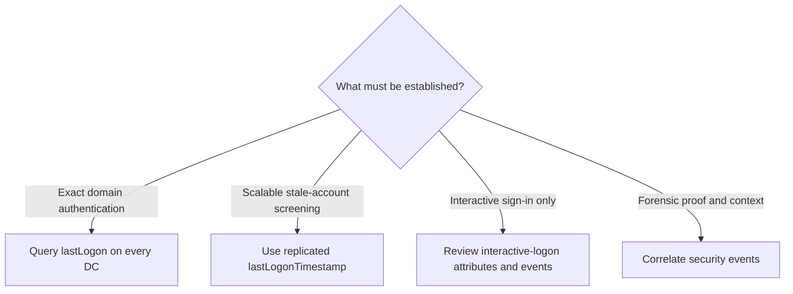

# Active Directory Logon Timestamps: lastLogon, lastLogonTimestamp and Last Interactive Logon

Active Directory exposes several attributes that look like "last logon." They answer different questions, have different replication behavior and cannot replace security-event evidence. Choosing the wrong one can leave active accounts disabled or dormant accounts untouched.

> **TL;DR**
>
> - `lastLogon` is updated on the authenticating domain controller and is not replicated. Query every DC and keep the newest value for precision.
> - `lastLogonTimestamp` is replicated but deliberately coarse. With the default configuration it can lag by roughly 9 to 14 days.
> - `LastLogonDate` is a PowerShell conversion of `lastLogonTimestamp`, not an independent AD attribute.
> - `msDS-LastSuccessfulInteractiveLogonTime` concerns successful interactive sign-in and is not a general account-activity timestamp.
> - Events 4624, 4625, 4768 and 4769 provide activity evidence, but they are logged in different places and retained for a limited time.
> - Treat inactivity as a lifecycle workflow: corroborate, disable, observe, then delete according to policy.

## 1. There is no universal "last used" field



Directory timestamps are state. Events are observations. Neither source is complete by itself.

## 2. Attribute comparison

| Value | Replicated | Update behavior | Appropriate use |
|---|---:|---|---|
| `lastLogon` | No | Updated on the DC that processes a successful logon | Precise last domain logon after querying every DC |
| `lastLogonTimestamp` | Yes | Updated only when the stored value is older than the synchronization threshold | Broad stale-account screening |
| `LastLogonDate` | Inherited from its source | AD PowerShell converts `lastLogonTimestamp` to local `DateTime` | Human-readable reporting |
| `msDS-LastSuccessfulInteractiveLogonTime` | Yes | Records a successful Ctrl+Alt+Delete interactive logon when the feature is in use | Previous interactive-logon information |
| Security events | Forwarded, not AD-replicated | Written when an audited action occurs | Protocol, source, destination, result and timeline evidence |

All four directory values can be absent or zero. That means "unknown," not necessarily "never used."

## 3. Convert AD file times correctly

The raw attributes use Windows file time: 100-nanosecond intervals since 1601-01-01 UTC. Convert them to UTC and keep the time zone explicit.

```powershell
function ConvertFrom-AdFileTime {
    param(
        [AllowNull()]
        [object] $Value
    )

    if ($null -eq $Value -or [long] $Value -le 0) {
        return $null
    }

    [DateTime]::FromFileTimeUtc([long] $Value)
}

$user = Get-ADUser `
    -Identity 'alice' `
    -Properties lastLogon, lastLogonTimestamp

[pscustomobject]@{
    LastLogonUtc          = ConvertFrom-AdFileTime $user.lastLogon
    LastLogonTimestampUtc = ConvertFrom-AdFileTime $user.lastLogonTimestamp
}
```

The `lastLogon` value in this example belongs only to the DC that answered the query.

## 4. lastLogon: precise only after querying every DC

Each DC maintains its own `lastLogon` value and does not replicate it. The largest value returned by all DCs is the account's most recent domain logon known to AD.

```powershell
Import-Module ActiveDirectory

$identity = 'alice'
$observations = foreach ($dc in Get-ADDomainController -Filter *) {
    try {
        $user = Get-ADUser `
            -Identity $identity `
            -Server $dc.HostName `
            -Properties lastLogon `
            -ErrorAction Stop

        [pscustomobject]@{
            DomainController = $dc.HostName
            LastLogonUtc     = if ($user.lastLogon -gt 0) {
                [DateTime]::FromFileTimeUtc([long] $user.lastLogon)
            } else {
                $null
            }
            QuerySucceeded   = $true
            Error            = $null
        }
    } catch {
        [pscustomobject]@{
            DomainController = $dc.HostName
            LastLogonUtc     = $null
            QuerySucceeded   = $false
            Error            = $_.Exception.Message
        }
    }
}

$observations | Sort-Object LastLogonUtc -Descending

$latest = $observations |
    Where-Object QuerySucceeded |
    Sort-Object LastLogonUtc -Descending |
    Select-Object -First 1

$latest
```

Do not call the result authoritative if one or more DC queries failed. The missing DC may hold a newer value. For large inventories, schedule bounded parallel queries and record DC coverage rather than issuing an unthrottled users-by-DC matrix during business hours.

## 5. lastLogonTimestamp: scalable but intentionally coarse

`lastLogonTimestamp` exists to support inactive-account discovery without querying every DC. A successful logon does not necessarily update it. The authenticating DC first compares the current value with the domain's `msDS-LogonTimeSyncInterval`.

With the default 14-day interval, update timing includes randomization to avoid a replication spike. The practical lag is commonly about 9 to 14 days. It is unsuitable for statements such as "this user has not logged on in the last 24 hours."

Inspect the domain setting:

```powershell
$domain = Get-ADDomain
$domainObject = Get-ADObject `
    -Identity $domain.DistinguishedName `
    -Properties 'msDS-LogonTimeSyncInterval'

$configuredInterval = $domainObject.'msDS-LogonTimeSyncInterval'

[pscustomobject]@{
    Domain                 = $domain.DNSRoot
    ConfiguredIntervalDays = $configuredInterval
    EffectiveDefault       = if ($null -eq $configuredInterval) {
        '14 days with update randomization'
    } else {
        "$configuredInterval days"
    }
}
```

Do not reduce the interval casually. More frequent updates create more replication traffic and still do not turn this attribute into forensic telemetry.

### Screen for stale enabled users

The following query finds enabled users whose replicated timestamp is absent or older than 90 days. It reports service indicators that require separate investigation.

```powershell
$inactiveDays = 90
$cutoffUtc = [DateTime]::UtcNow.AddDays(-$inactiveDays)
$cutoffFileTime = $cutoffUtc.ToFileTimeUtc()
$ldapFilter = '(&(objectCategory=person)(objectClass=user)' +
    '(!(userAccountControl:1.2.840.113556.1.4.803:=2))' +
    "(|(!(lastLogonTimestamp=*))(lastLogonTimestamp<=$cutoffFileTime)))"

Get-ADUser `
    -LDAPFilter $ldapFilter `
    -Properties lastLogonTimestamp, servicePrincipalName, PasswordLastSet |
    ForEach-Object {
        [pscustomobject]@{
            SamAccountName       = $_.SamAccountName
            LastLogonTimestampUtc = if ($_.lastLogonTimestamp -gt 0) {
                [DateTime]::FromFileTimeUtc([long] $_.lastLogonTimestamp)
            } else {
                $null
            }
            PasswordLastSet      = $_.PasswordLastSet
            HasSPN               = $_.servicePrincipalName.Count -gt 0
            SPNs                 = $_.servicePrincipalName -join '; '
        }
    } |
    Sort-Object LastLogonTimestampUtc, SamAccountName
```

The output is a review queue. It is not permission to disable the returned accounts.

## 6. LastLogonDate is a convenience property

The Active Directory PowerShell module exposes `LastLogonDate` as a friendly conversion of `lastLogonTimestamp`. It does not query every DC and does not provide better precision.

```powershell
Get-ADUser `
    -Filter * `
    -Properties LastLogonDate, lastLogonTimestamp |
    Select-Object SamAccountName,
                  LastLogonDate,
                  @{Name='RawLastLogonTimestamp'; Expression={$_.lastLogonTimestamp}}
```

Reports should name the source explicitly. A column called only "Last logon" invites the reader to assume precision that the data does not have.

## 7. Last successful interactive logon is narrower

`msDS-LastSuccessfulInteractiveLogonTime` records the time when the correct password was presented during a Ctrl+Alt+Delete interactive logon. Related attributes can track failed interactive attempts and their count.

These values support the **Display information about previous logons during user logon** policy. They are not a replacement for `lastLogonTimestamp` and do not represent network, service, batch or every Remote Desktop authentication path.

```powershell
$interactiveProperties = @(
    'msDS-LastSuccessfulInteractiveLogonTime',
    'msDS-LastFailedInteractiveLogonTime',
    'msDS-FailedInteractiveLogonCount',
    'msDS-FailedInteractiveLogonCountAtLastSuccessfulLogon'
)

$user = Get-ADUser `
    -Identity 'alice' `
    -Properties $interactiveProperties

[pscustomobject]@{
    SamAccountName = $user.SamAccountName
    LastSuccessUtc = ConvertFrom-AdFileTime `
        $user.'msDS-LastSuccessfulInteractiveLogonTime'
    LastFailureUtc = ConvertFrom-AdFileTime `
        $user.'msDS-LastFailedInteractiveLogonTime'
    CurrentFailures = $user.'msDS-FailedInteractiveLogonCount'
    PreviousFailures = $user.'msDS-FailedInteractiveLogonCountAtLastSuccessfulLogon'
}
```

Test the policy before broad deployment. It adds directory writes at interactive sign-in, depends on compatible domain behavior and can make authentication availability more sensitive to directory connectivity.

## 8. Corroborate with security events

Directory values tell you that an attribute changed. Security events can tell you where, how and whether authentication succeeded:

| Event | Location | Evidence |
|---|---|---|
| 4624 | Destination computer | A logon session was created |
| 4625 | Computer that processed the failed attempt | A logon failed, with type and status |
| 4768 | Domain controller | A Kerberos TGT was requested |
| 4769 | Domain controller | A Kerberos service ticket was requested |

For detailed logon-type semantics, see [Windows Logon Types Decoded - Events 4624 and 4625](Windows%20Logon%20Types%20Decoded%20-%20Events%204624%20and%204625.md).

The following targeted example searches recent Kerberos events for one account and extracts named XML fields rather than relying on localized event-message text:

```powershell
$accountName = 'svc_web'
$startTime = (Get-Date).AddHours(-24)
$domainControllers = Get-ADDomainController -Filter *

foreach ($dc in $domainControllers) {
    $events = Get-WinEvent `
        -ComputerName $dc.HostName `
        -FilterHashtable @{
            LogName   = 'Security'
            Id        = 4768, 4769
            StartTime = $startTime
        } `
        -ErrorAction SilentlyContinue

    foreach ($event in $events) {
        $xml = [xml] $event.ToXml()
        $data = @{}
        foreach ($item in $xml.Event.EventData.Data) {
            $data[$item.GetAttribute('Name')] = $item.InnerText
        }

        $targetUser = ($data.TargetUserName -split '@')[0]
        $isAccountRequest = $targetUser -eq $accountName
        $isServiceTarget = $event.Id -eq 4769 -and
            $data.ServiceName -eq $accountName

        if ($isAccountRequest -or $isServiceTarget) {
            [pscustomobject]@{
                TimeCreated     = $event.TimeCreated.ToUniversalTime()
                DomainController = $dc.HostName
                EventId         = $event.Id
                TargetUser      = $data.TargetUserName
                ServiceName     = $data.ServiceName
                ClientAddress   = $data.IpAddress
                Status          = $data.Status
            }
        }
    }
}
```

On busy DCs, use Windows Event Forwarding, Microsoft Sentinel, Defender XDR or another SIEM instead of repeated remote scans. Confirm that the required audit subcategories are enabled and that retention covers the inactivity window.

## 9. The passive service-account trap

A traditional service account can be active even when its own logon timestamps are old. Clients may request Kerberos service tickets for an SPN registered on that account. In event 4769, the service account appears as the service target while the requesting user appears as the account name.

Before classifying an SPN-bearing account as inactive, examine:

- event 4769 `ServiceName` or `ServiceSid` across every DC;
- service configurations, scheduled tasks and IIS application pools;
- SQL Server, middleware and third-party identity mappings;
- password-vault ownership and rotation records;
- NTLM activity, which will not appear as a Kerberos service-ticket request;
- dependencies that run only monthly, quarterly or during disaster recovery.

Prefer gMSAs for supported services, but migration still requires dependency discovery and testing.

## 10. A safe inactive-account lifecycle

Use a staged process rather than deleting from a timestamp report:

1. Define inactivity separately for people, devices and service identities.
2. Use `lastLogonTimestamp` only for the initial broad filter.
3. Aggregate `lastLogon` from every reachable DC for shortlisted accounts.
4. Search centralized 4624, 4768 and 4769 telemetry for the full retention window.
5. Check HR status, application ownership, SPNs, scheduled tasks and password-vault records.
6. Remove unnecessary group membership and move the object to a controlled quarantine OU.
7. Disable the account and monitor for failures during an approved observation period.
8. Delete only after retention, recovery and owner-approval requirements are met.

Preserve the original OU, group memberships, owner, manager and dependency evidence so that an incorrect disablement can be reversed safely.

## 11. Common mistakes

| Mistake | Better interpretation |
|---|---|
| Reading `lastLogon` from one DC | One DC's local observation only |
| Treating `LastLogonDate` as a new precise attribute | Formatted `lastLogonTimestamp` |
| Using a 30-day cutoff with default timestamp lag | Effective evidence window may be much shorter than intended |
| Assuming a null timestamp means never used | The value can be absent for historical or feature reasons |
| Declaring an SPN-bearing account unused from its own timestamp | Check 4769 service-target activity and application dependencies |
| Searching 4624 only on DCs | 4624 is generated on the destination where the session is created |
| Deleting immediately | Disable and observe through a reversible lifecycle |

## References

- [Last-Logon attribute](https://learn.microsoft.com/en-us/windows/win32/adschema/a-lastlogon)
- [Last-Logon-Timestamp attribute](https://learn.microsoft.com/en-us/windows/win32/adschema/a-lastlogontimestamp)
- [ms-DS-Logon-Time-Sync-Interval attribute](https://learn.microsoft.com/en-us/windows/win32/adschema/a-msds-logontimesyncinterval)
- [ms-DS-Last-Successful-Interactive-Logon-Time attribute](https://learn.microsoft.com/en-us/windows/win32/adschema/a-msds-lastsuccessfulinteractivelogontime)
- [Audit event 4624](https://learn.microsoft.com/en-us/windows/security/threat-protection/auditing/event-4624)
- [Audit event 4625](https://learn.microsoft.com/en-us/windows/security/threat-protection/auditing/event-4625)
- [Audit event 4768](https://learn.microsoft.com/en-us/windows/security/threat-protection/auditing/event-4768)
- [Audit event 4769](https://learn.microsoft.com/en-us/windows/security/threat-protection/auditing/event-4769)
- [Windows Logon Types Decoded - Events 4624 and 4625](Windows%20Logon%20Types%20Decoded%20-%20Events%204624%20and%204625.md)