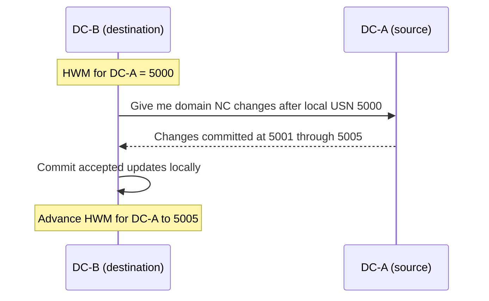
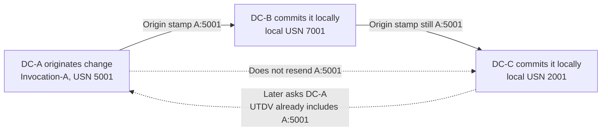
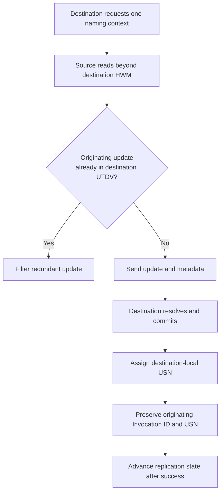
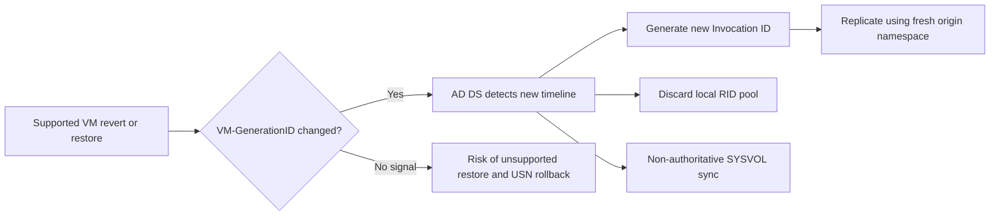

# Active Directory Replication Internals: USNs, Invocation IDs, High-Watermark and Up-to-Dateness Vectors

**Active Directory does not replicate an object simply because one copy has a larger number than another.**

Every domain controller maintains local transaction numbers, attribute-level origin metadata, per-partner cursors and a vector describing changes already known from every replication origin. Those mechanisms let a multi-master directory move an update through several DCs without replaying it forever.

They also explain one of the nastiest Active Directory failure modes: a DC can appear reachable and still own changes that its partners will never accept.

> 🎯 **TL;DR**
>
> - A **USN** is meaningful only within one DC database incarnation.
> - An **Invocation ID** identifies that database incarnation. The pair `(Invocation ID, originating USN)` identifies an originating update.
> - A **high-watermark vector** is a per-source, per-naming-context cursor used to continue replication efficiently.
> - An **up-to-dateness vector** records the highest originating USN already seen from each Invocation ID and prevents replication loops.
> - A receiving DC assigns its own local USN when it commits an inbound change, but the change keeps its original Invocation ID and originating USN in replication metadata.
> - Never restore or revert a DC with a method that Active Directory and the hypervisor do not support. Event **2095** and `Dsa Not Writable = 4` indicate USN rollback quarantine, not a registry value to remove.

---

## 🧭 1 — Four Pieces of State, Four Different Questions

The terminology becomes much easier when each value is tied to the question it answers.

| Mechanism | Scope | Question answered |
|---|---|---|
| **Local USN** | One DC database | In what local order did this DC commit changes? |
| **Invocation ID** | One incarnation of one DC database | Which database incarnation originated this update? |
| **High-watermark vector (HWMV)** | One destination, one source partner, one naming context | How far did this destination read through that source's local change stream? |
| **Up-to-dateness vector (UTDV)** | One DC, one naming context | What is the highest originating update this DC knows from each Invocation ID? |

Two consequences matter immediately:

1. `USN 12000` on `DC-A` has no ordering relationship with `USN 12000` on `DC-B`.
2. Replication state is maintained **per naming context**. Being current for the domain partition does not prove that the configuration, schema, application or DNS partitions are current.

> 🧠 **Mental model:** the high-watermark vector is a bookmark in one partner's local journal. The up-to-dateness vector is a catalog of origin stamps already known from the topology.

---

## 🔢 2 — A USN Is Local, Not Forest-Wide

Each writable DC maintains a monotonically increasing update sequence number counter in its local `ntds.dit`. When the DC commits a directory update, it allocates a new local USN.

For an object, the operational attribute `uSNChanged` exposes the local USN of its latest committed change **on the DC answering the query**. Its value can therefore differ across replicas even when the object data is identical.

```powershell
$Object = "CN=LabGroup,OU=Groups,DC=contoso,DC=com"

Get-ADObject -Identity $Object -Server DC01.contoso.com `
    -Properties uSNChanged, whenChanged |
    Select-Object DistinguishedName, uSNChanged, whenChanged

Get-ADObject -Identity $Object -Server DC02.contoso.com `
    -Properties uSNChanged, whenChanged |
    Select-Object DistinguishedName, uSNChanged, whenChanged
```

Those queries show **local commit state**. They do not, by themselves, identify where an attribute was originally changed.

### Originating update versus replicated commit

Suppose `DC-A` creates `LabGroup`:

| Stage | Local commit USN | Origin stamp retained in metadata |
|---|---:|---|
| `DC-A` originates the object | `5001` | `(Invocation-A, 5001)` |
| `DC-B` receives and commits it | `7001` | `(Invocation-A, 5001)` |
| `DC-C` receives and commits it | `2001` | `(Invocation-A, 5001)` |

`DC-B` and `DC-C` allocate local USNs because they changed their own databases. They do **not** become new origins for the replicated attributes. Their attribute metadata continues to identify `DC-A`'s Invocation ID and originating USN.

This distinction is the foundation of loop prevention.

### Source note captures


---

## 🪪 3 — Invocation ID: The Database Incarnation

A DC has a persistent NTDS Settings object identified by a DSA object GUID. That identity is not the same thing as its **Invocation ID**.

| Identifier | Represents | Normal behavior |
|---|---|---|
| **DSA object GUID** | The DC's NTDS Settings object | Remains associated with that DC object |
| **Invocation ID** | The current incarnation of its directory database | Changes after specific supported restore or virtualization recovery operations |

The Invocation ID gives local USNs a namespace. In simplified form, an originating update is identified by:

$$
(\text{Invocation ID},\ \text{Originating USN})
$$

This is necessary because a restored database may return to an earlier local USN. If the DC starts a new database incarnation with a new Invocation ID, its future changes cannot be confused with updates from the previous timeline.

> 🔵 An Invocation ID change is not automatically a fault. It can be the expected safety response to a supported restore or VM-GenerationID change. The surrounding events and recovery context determine whether it is healthy.

---

## 📍 4 — The High-Watermark Vector: Where Did I Stop Reading?

Active Directory replication is pull-based: the destination DC asks a source DC for changes to a naming context.

For each source partner and naming context, the destination maintains a high-watermark value from the previous successful cycle. It effectively says:

> "Last time I read from this source database, I processed its local changes through USN N."

On the next request, the source can begin after that point instead of scanning its complete database history.



The HWM is deliberately partner-specific. `DC-B`'s cursor for `DC-A` says nothing about `DC-C`, and the cursor for `DC=contoso,DC=com` says nothing about `CN=Configuration,DC=contoso,DC=com`.

### Why the HWM is not enough

A source DC's local stream contains both:

- changes it originated itself;
- changes it previously received from other DCs.

If `DC-B` forwards an update that originated on `DC-A`, it has a new **local commit USN on DC-B**, while its origin stamp still points to `DC-A`. A destination therefore needs more than a bookmark into `DC-B`'s local stream to determine whether it already knows that originating update.

That is the job of the up-to-dateness vector.

---

## 🗺️ 5 — The Up-to-Dateness Vector: What Do I Already Know?

For each naming context, a DC's up-to-dateness vector contains entries conceptually shaped like this:

| Originating Invocation ID | Highest originating USN known |
|---|---:|
| `Invocation-A` | `5005` |
| `Invocation-B` | `7006` |
| `Invocation-C` | `2000` |

When a destination requests changes, it sends its UTDV to the source. The source examines the origin metadata of candidate updates and does not send an update whose originating USN is already covered by the destination's entry for that Invocation ID.

In simplified form, an update is already known when:

$$
\text{Originating USN}_{update} \leq \text{UTDV}[\text{Originating Invocation ID}_{update}]
$$

This suppresses redundant forwarding through a multi-master topology.



> 🧠 **The division of labor:** the HWM narrows the source's search to changes committed since the last cycle; the UTDV removes changes the destination already learned through another path.

---

## 🔄 6 — One Replication Cycle, Step by Step

For a given naming context, a replication cycle can be reduced to this sequence:

1. The destination selects an inbound connection and contacts the source.
2. It presents replication state that includes its previous high-watermark and UTDV.
3. The source examines changes beyond the high-watermark.
4. The source filters out originating updates already represented in the destination's UTDV.
5. The source sends the remaining objects and attributes with their replication metadata.
6. The destination resolves conflicts using replication metadata, then commits accepted changes with new local USNs.
7. After successful processing, the destination advances its partner cursor and incorporates the newly learned origin stamps into its UTDV.



This is a conceptual view, not a packet-level description of `IDL_DRSGetNCChanges`. The protocol also handles object creation and deletion, linked values, partial attribute sets, extended operations and other details. The model above is enough to interpret most operational evidence without pretending that replication is merely a timestamp comparison.

---

## 🧬 7 — Attribute Metadata Is the Evidence

Replication conflict resolution operates primarily at the attribute level. The metadata of an attribute includes values such as:

- version number;
- originating time;
- originating DSA Invocation ID;
- originating USN;
- local USN on the queried replica.

Inspect it with `repadmin`:

```powershell
$Object = "CN=LabUser,OU=Users,DC=contoso,DC=com"

repadmin.exe /showobjmeta DC01.contoso.com $Object
repadmin.exe /showobjmeta DC02.contoso.com $Object
```

Or with the ActiveDirectory PowerShell module:

```powershell
$Object = "CN=LabUser,OU=Users,DC=contoso,DC=com"

Get-ADReplicationAttributeMetadata `
    -Object $Object `
    -Server DC01.contoso.com `
    -ShowAllLinkedValues |
    Sort-Object AttributeName |
    Format-Table AttributeName, Version, LastOriginatingChangeTime, `
        LastOriginatingChangeDirectoryServerInvocationId, OriginatingChangeUsn
```

Compare the metadata from at least two DCs when investigating a divergent object. Do not compare only the visible value or `whenChanged`.

> 🔵 Linked attributes such as group membership can carry per-value replication metadata. `-ShowAllLinkedValues` is useful when one member, rather than the complete `member` attribute, is in dispute.

---

## 🧰 8 — Read Replication State with Current Tools

### Check topology and recent replication results

```powershell
# Forest-wide summary
repadmin.exe /replsummary

# Inbound partners and status for one DC
repadmin.exe /showrepl DC01.contoso.com /all /verbose

# Machine-readable overview for filtering or archival
repadmin.exe /showrepl * /csv
```

PowerShell exposes partner state as objects:

```powershell
Get-ADReplicationPartnerMetadata `
    -Target DC01.contoso.com `
    -Scope Server |
    Sort-Object Partition, Partner |
    Format-Table Partition, Partner, LastReplicationSuccess, `
        LastReplicationResult, ConsecutiveReplicationFailures
```

### Display the up-to-dateness vector

Always name the naming context explicitly:

```powershell
$DomainNC = (Get-ADDomain).DistinguishedName

repadmin.exe /showutdvec DC01.contoso.com $DomainNC /latency

Get-ADReplicationUpToDatenessVectorTable `
    -Target DC01.contoso.com `
    -Scope Server |
    Where-Object Partition -eq $DomainNC |
    Sort-Object Partner |
    Format-Table Partner, UsnFilter, LastReplicationSuccess
```

`/latency` orders the UTDV entries from least current to most current. Treat that view as **origin visibility**, not as a direct replacement for connection-level last-success data.

### Preview changes available from a source

`/showchanges` compares replication state without performing a synchronization:

```powershell
$DomainNC = (Get-ADDomain).DistinguishedName

# Destination first, source second
repadmin.exe /showchanges DC02.contoso.com DC01.contoso.com $DomainNC
```

Use this as focused evidence, not as a forest-wide monitoring loop. Large backlogs can produce substantial output.

> ⚠️ A successful `repadmin /showrepl` proves that recent partner calls succeeded. It does not prove that every object converged or that a reverted DC's new changes are acceptable to its partners.

---

## 💥 9 — How USN Rollback Breaks the Contract

Consider a DC whose current Invocation ID is `Invocation-A` and whose partners have already recorded:

```text
Invocation-A -> originating USN 12000
```

An unsupported snapshot revert returns that DC's database to USN `11000`, but the hypervisor does not signal the rollback and the Invocation ID remains unchanged. The DC then originates a new password change at USN `11001`.

Its partners compare the update with their UTDV:

```text
11001 <= 12000, for the same Invocation-A
```

They conclude that the update is old and already known. The reverted DC may accept local writes, DNS may resolve, LDAP may answer and replication RPC calls may appear successful, while its new changes never converge.

That is USN rollback: **the DC has reused origin stamps that the rest of the topology already retired**.

### Detection and quarantine

Modern AD DS detects known rollback conditions and protects the directory. Key evidence includes:

| Evidence | Meaning |
|---|---|
| **Directory Service event 2095** | AD DS detected an improperly restored database and USN rollback |
| `HKLM\SYSTEM\CurrentControlSet\Services\NTDS\Parameters\Dsa Not Writable` = `4` | The DC is quarantined because of USN rollback |

```powershell
Get-WinEvent -FilterHashtable @{
    LogName      = 'Directory Service'
    Id           = 2095
    StartTime    = (Get-Date).AddDays(-30)
} | Select-Object TimeCreated, Id, ProviderName, Message

Get-ItemProperty `
    -Path 'HKLM:\SYSTEM\CurrentControlSet\Services\NTDS\Parameters' `
    -Name 'Dsa Not Writable' `
    -ErrorAction SilentlyContinue
```

> 🔴 **Do not delete or change `Dsa Not Writable` to force the DC online.** It is a safety control and forensic evidence. Isolate the DC and follow a supported recovery path, typically demotion and rebuild or an appropriate AD-aware system-state restore.

---

## 🛡️ 10 — VM-GenerationID Makes Supported Reverts Detectable

Since Windows Server 2012, a virtualized DC can use VM-GenerationID when the hypervisor exposes the capability correctly.

AD DS stores the generation identifier it last observed. If the value presented by the virtual platform differs from the value stored in the directory database, AD DS recognizes that the VM's execution timeline changed. During the safety response, it:

1. creates a new Invocation ID;
2. discards its current RID pool;
3. stores the new VM-GenerationID;
4. non-authoritatively synchronizes SYSVOL.

The new Invocation ID gives post-restore writes a fresh origin namespace, so partners do not mistake them for updates already seen on the old timeline.



There are three operational limits:

- The guest OS and hypervisor must both support VM-GenerationID.
- The restore, clone or revert workflow must be supported by the virtualization and backup vendors.
- GenerationID protection preserves replication safety; it does not prove application-consistent recovery or replace tested backups.

> 🔴 **A hypervisor snapshot is not an Active Directory backup strategy.** Maintain AD-aware system-state backups and a rehearsed forest-recovery plan.

For the wider trust boundary around virtualized DCs, see [Securing the Hyper-V Fabric Hosting Domain Controllers and Tier 0 Assets](Securing%20the%20Hyper-V%20Fabric%20Hosting%20Domain%20Controllers%20and%20Tier%200%20Assets.md). For disaster recovery, use the [single-domain forest recovery runbook](../How-to/Recovering%20a%20Single-Domain%20Active%20Directory%20Forest.md).

---

## 🔎 11 — A Practical Investigation Workflow

When replication looks healthy but data does not converge, collect evidence in this order.

### Step 1 — Fix the scope

Record:

- the exact object and attribute;
- the DC where the change originated;
- the destination DC where it is missing;
- the affected naming context;
- the approximate change time.

### Step 2 — Establish connection health

```powershell
repadmin.exe /replsummary
repadmin.exe /showrepl DC01.contoso.com /all /verbose
repadmin.exe /showrepl DC02.contoso.com /all /verbose
```

Resolve authentication, DNS, RPC, topology or lingering-object failures before interpreting cursors.

### Step 3 — Compare the object and its metadata

```powershell
$Object = "CN=LabUser,OU=Users,DC=contoso,DC=com"

repadmin.exe /showobjmeta DC01.contoso.com $Object
repadmin.exe /showobjmeta DC02.contoso.com $Object
```

Look for different attribute versions, origin Invocation IDs, originating USNs or originating times. A higher local `uSNChanged` alone does not identify the authoritative value.

### Step 4 — Compare UTD vectors for the correct partition

```powershell
$DomainNC = (Get-ADDomain).DistinguishedName

repadmin.exe /showutdvec DC01.contoso.com $DomainNC /latency
repadmin.exe /showutdvec DC02.contoso.com $DomainNC /latency
```

An unexpected Invocation ID change requires context. An old vector entry can be normal historical knowledge; a current DC whose updates are never advancing requires investigation.

### Step 5 — Check rollback evidence before forcing replication

```powershell
Get-WinEvent -FilterHashtable @{
    LogName   = 'Directory Service'
    Id        = 2095
    StartTime = (Get-Date).AddDays(-30)
}
```

If rollback evidence exists, stop. Repeated `/syncall`, metadata edits or registry changes do not repair a duplicated origin timeline.

### Step 6 — Preserve evidence and choose supported recovery

Document event logs, replication output, object metadata, recent restore or snapshot activity and hypervisor events. Then isolate and rebuild or restore the affected DC through a supported process.

The repository's [AD Health Check Script](../Tools/AD-HealthCheck/AD%20Health%20Check%20Script.md) provides broader health collection, while [Active Directory Design Guidelines](Active%20Directory%20Design%20Guidelines%20%28Architecture%20Overview%29.md) covers the surrounding replication and virtualization safeguards.

---

## 🚫 12 — Common Misreadings

| Misreading | Correct interpretation |
|---|---|
| "The largest USN is the newest copy." | USNs from different DCs are not comparable. Inspect origin metadata and attribute versions. |
| "The receiver incremented its USN, so it originated a new change." | It made a local commit, but retained the original update's Invocation ID and originating USN. |
| "The HWM proves the destination knows every origin." | It is a cursor for one source's local stream. The UTDV represents known origins. |
| "A green replication summary proves convergence." | It proves recent calls succeeded, not that every attribute agrees or that no rollback occurred. |
| "Invocation ID means DC identity." | It identifies one database incarnation; the DSA object GUID identifies the DC's NTDS Settings object. |
| "VM-GenerationID makes snapshots backups." | It prevents specific replication and RID hazards during supported timeline changes. It does not replace AD-aware backup. |
| "`Dsa Not Writable=4` blocks recovery, so remove it." | It is quarantine evidence. Removing it bypasses protection without repairing the replication state. |

---

## ✅ 13 — Operational Takeaways

- Monitor **every naming context**, not only the domain partition.
- Keep `repadmin /replsummary` and partner metadata in routine health checks, but investigate object metadata when convergence is disputed.
- Record snapshot, restore and hypervisor events alongside Directory Service events.
- Require VM-GenerationID support for platforms hosting virtualized DCs.
- Use supported AD-aware backup and restore procedures.
- Rebuild a rolled-back DC instead of trying to manipulate its replication cursors.
- Treat Invocation ID changes as events to explain, not values to normalize manually.

The compact model is worth remembering:

> **Local USN orders one database. Invocation ID names its incarnation. HWM resumes one partner stream. UTDV prevents the topology from replaying an origin it already knows.**

---

## 📚 References

- [Active Directory replication concepts](https://learn.microsoft.com/en-us/windows-server/identity/ad-ds/get-started/replication/active-directory-replication-concepts)
- [Detect and recover from USN rollback](https://learn.microsoft.com/en-us/troubleshoot/windows-server/active-directory/detect-and-recover-from-usn-rollback)
- [Introduction to Active Directory Domain Services virtualization](https://learn.microsoft.com/en-us/windows-server/identity/ad-ds/get-started/virtual-dc/virtualized-domain-controller-architecture)
- [[MS-DRSR]: Directory Replication Service Remote Protocol](https://learn.microsoft.com/en-us/openspecs/windows_protocols/ms-drsr/06205d97-30da-4fdc-a276-3fd831b272e0)
- [Repadmin `/showutdvec` reference](https://learn.microsoft.com/en-us/previous-versions/windows/it-pro/windows-server-2012-r2-and-2012/cc742023%28v=ws.11%29)

---

*Replication is not magic and it is not a timestamp contest. It is a carefully maintained memory of where each change came from and which replicas have already seen it.*