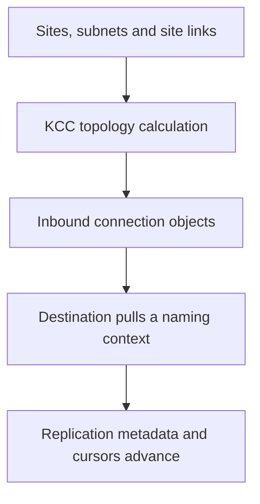
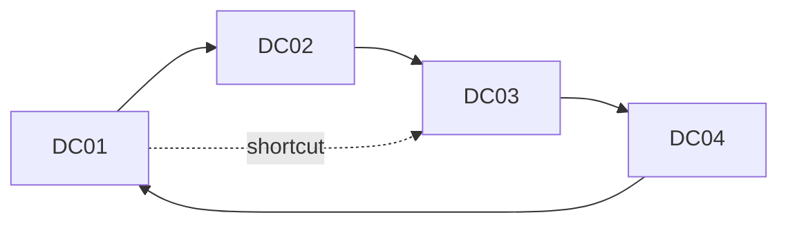
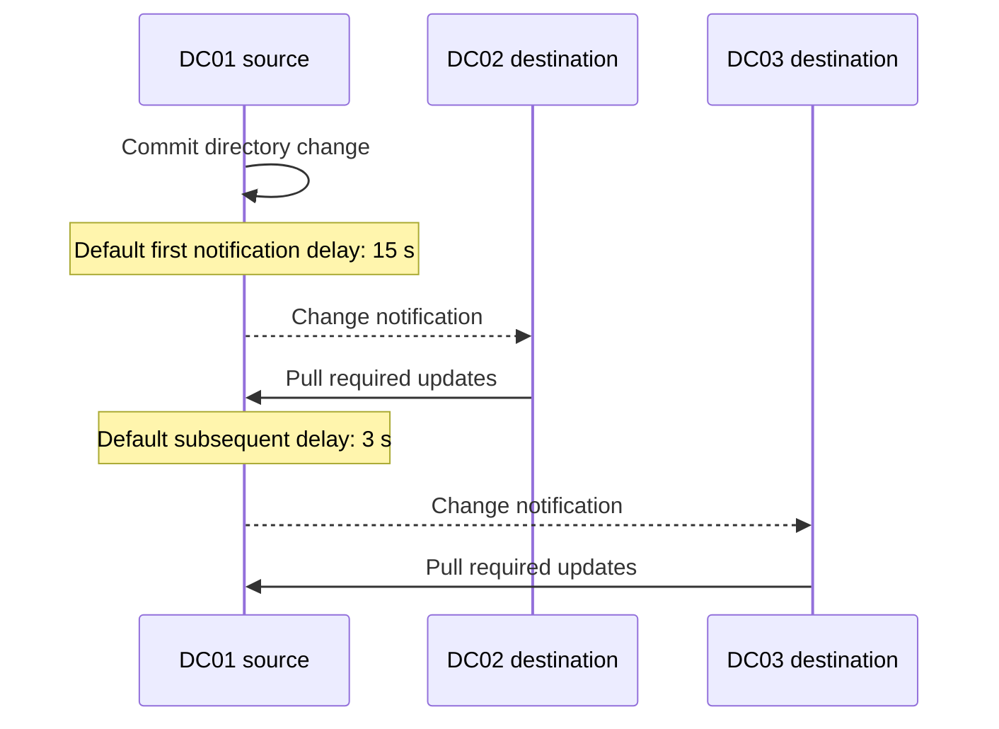
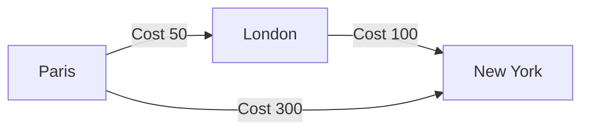

# Active Directory Replication Topology: KCC, Intra-Site, Inter-Site and Site Links

**Active Directory sites do not replicate. Domain controllers replicate naming contexts over connection objects that the topology engine builds from your site design.**

That distinction explains why adding a site link does not create a permanent DC-to-DC tunnel, why a connection object points inbound, and why manually pinning bridgehead servers often turns resilience into an outage.

> 🎯 **TL;DR**
>
> - **Sites and site links** describe network geography, cost and availability.
> - The **KCC** calculates replication topology on every DC.
> - The **ISTG** coordinates inter-site topology for one site.
> - A **connection object belongs to the destination DC** and identifies an inbound source.
> - Intra-site replication normally uses change notification; inter-site replication normally follows the site-link schedule and interval.
> - Prefer automatic bridgehead selection. A manually preferred bridgehead can become a hard dependency.
> - Troubleshoot the naming context, connection and direction involved, not a vague statement that "the sites do not replicate."

---

## 🧭 1 — Separate Design, Topology and Data Flow

Three layers are involved:

| Layer | Main objects/process | Purpose |
|---|---|---|
| **Network model** | Sites, subnets, site links, costs, schedules | Describe reliable network regions and permitted inter-site paths |
| **Calculated topology** | KCC, ISTG, bridgehead selection, connection objects | Select source/destination pairs for each replicated partition |
| **Replication state** | DRS RPC, naming contexts, cursors and metadata | Transfer and apply directory updates |



The topology decides **who can pull from whom**. Replication state decides **which changes are still required**. For the second half, see [Active Directory Replication Internals](Active%20Directory%20Replication%20Internals%20-%20USNs%2C%20Invocation%20IDs%2C%20High-Watermark%20and%20Up-to-Dateness%20Vectors.md).

---

## 🧩 2 — Naming Contexts Are the Unit of Topology

A DC does not hold one indivisible forest database. It hosts replicas of several naming contexts (NCs), commonly:

- its writable domain NC;
- the configuration NC;
- the schema NC;
- `DomainDnsZones` and `ForestDnsZones` application partitions;
- partial domain replicas when it is a Global Catalog.

Topology and replication status can differ by NC. A healthy domain partition does not prove that an AD-integrated DNS partition is healthy.

```powershell
Get-ADRootDSE -Server DC01.contoso.com |
    Select-Object defaultNamingContext, configurationNamingContext, `
        schemaNamingContext, namingContexts

repadmin.exe /showrepl DC01.contoso.com /all /verbose
```

> 🧠 Always name the failing partition in an investigation. "Replication is broken" is not yet a scope.

---

## ⚙️ 3 — What the KCC Actually Does

The Knowledge Consistency Checker runs on every DC and creates or removes inbound connection objects as the environment changes. It calculates separate intra-site and inter-site topologies and reacts to:

- DC promotion or demotion;
- site and subnet changes;
- site-link cost or schedule changes;
- unavailable replication partners;
- the set of NC replicas hosted by each DC.

Within a site, writable DCs are arranged in a bidirectional ring with shortcut connections where needed to keep the path short. The objective is convergence with redundancy, not a full mesh.



The KCC runs periodically and can be triggered for diagnosis:

```powershell
# Recalculate topology on one DC
repadmin.exe /kcc DC01.contoso.com

# Inspect KCC-related Directory Service events
Get-WinEvent -FilterHashtable @{
    LogName   = 'Directory Service'
    StartTime = (Get-Date).AddHours(-4)
} | Where-Object ProviderName -match 'ActiveDirectory|NTDS' |
    Select-Object TimeCreated, Id, LevelDisplayName, Message
```

Do not routinely disable the KCC or replace its topology with manually maintained connections. Manual topology ages badly because the directory changes while the diagram in the change ticket does not.

---

## ➡️ 4 — Connection Objects Are Inbound

A connection object is stored below the **destination** DC's NTDS Settings object. It identifies the source from which that destination can pull changes.

```text
Sites
└─ Paris
   └─ Servers
      └─ DC02
         └─ NTDS Settings
            └─ <connection from DC01>
```

If the connection shown under `DC02` names `DC01` as its source, the direction is:

```text
DC01  ──changes──>  DC02
source              destination / connection owner
```

This direction matters when reading errors and when using `repadmin`:

```powershell
# Show inbound replication as seen by the destination
repadmin.exe /showrepl DC02.contoso.com /all /verbose

# Force one NC from source to destination
$DomainNC = (Get-ADDomain).DistinguishedName
repadmin.exe /replicate DC02.contoso.com DC01.contoso.com $DomainNC
```

> ⚠️ `/replicate` is a diagnostic or operational action. It does not repair bad DNS, RPC reachability, authentication, topology or lingering objects.

---

## 🏢 5 — Intra-Site Replication

An AD site should represent subnets connected by reliable, high-speed networking. Within a site:

- replication is optimized for low latency rather than WAN conservation;
- updates use change notification by default;
- data is not compressed for the normal RPC replication path;
- any suitable DC can participate as a partner.

After a change, the source waits **15 seconds by default** before notifying its first partner, then waits **three seconds by default** between subsequent partner notifications. The destination pulls the changes.



The values are per NC and can be inspected with:

```powershell
$DomainNC = (Get-ADDomain).DistinguishedName
repadmin.exe /notifyopt DC01.contoso.com $DomainNC
```

Changing notification delays rarely fixes a real replication problem. Measure convergence and resource pressure first.

---

## 🌍 6 — Inter-Site Replication

Between sites, the design assumes a comparatively constrained or costly link. Site links provide four important inputs:

| Property | Meaning |
|---|---|
| **Membership** | Sites connected by the logical link |
| **Cost** | Relative path preference; lower total cost wins |
| **Schedule** | Times when replication is permitted |
| **Interval** | Frequency within the permitted schedule |

The default inter-site replication interval is **180 minutes**. The minimum configurable interval in the standard UI is 15 minutes. The interval controls frequency, not the amount of data changed.

```powershell
Get-ADReplicationSiteLink -Filter * -Properties * |
    Select-Object Name, Cost, ReplicationFrequencyInMinutes, `
        SitesIncluded, Options
```

Inter-site traffic is compressed when beneficial. Replication still uses pull semantics: bridgehead DCs provide the inter-site path, but destinations request their missing updates.

### Inter-site change notification

You can enable change notification on a site link when the network is reliable and low latency. This makes changes propagate by notification instead of waiting for the next interval, but it does not turn two sites into one site.

```powershell
# Inspect options; bit 0 (value 1) enables change notification
Get-ADReplicationSiteLink -Identity 'Paris-London' -Properties Options |
    Select-Object Name, Options
```

Document and test this design choice. Enabling notification across every constrained WAN link defeats the purpose of scheduled inter-site replication.

---

## 🧠 7 — ISTG and Bridgehead Servers

One DC in each site holds the **Inter-Site Topology Generator (ISTG)** responsibility. The ISTG coordinates inter-site connection generation for that site. It is not a forest-wide FSMO role and can move automatically.

Bridgehead servers are the DCs selected to carry replication across site boundaries for the relevant transport and NC. By default, eligible bridgeheads are selected automatically.

```powershell
# Identify site topology information and current connections
repadmin.exe /showism
repadmin.exe /showconn DC01.contoso.com

Get-ADReplicationConnection -Filter * |
    Select-Object Name, ReplicateFromDirectoryServer, `
        ReplicateToDirectoryServer, AutoGenerated
```

### Why preferred bridgeheads are risky

When administrators explicitly designate preferred bridgeheads, the KCC limits selection to that set. If every preferred server for a partition or transport is unavailable, automatic selection cannot simply use an otherwise healthy DC.

Use preferred bridgeheads only for a documented constraint such as network routing or firewall policy, and select enough servers for failure tolerance.

---

## 🛣️ 8 — Cost, Transitivity and Site-Link Bridges

The inter-site topology generator computes paths using cumulative site-link cost. A direct network path and a direct site link are not the same thing: site links are topology inputs, not router interfaces.

By default, **Bridge all site links** makes site links transitive for the IP transport. If all networks are fully routed, this is normally appropriate. Disable it only when the network is not fully routed and then model permitted transitivity with explicit site-link bridges.



The calculated Paris-to-New York path through London costs 150 and is preferred over the direct logical link at 300, assuming schedules and partition availability permit it.

Avoid arbitrary rules such as "one site link must contain exactly two sites." Multi-site links are valid when their sites share uniform connectivity, cost and schedule. Use two-site links when you need deterministic per-path control.

---

## 🔎 9 — Troubleshoot the Calculated Path

Use a layered workflow.

### 1. Confirm site and subnet mapping

```powershell
Get-ADReplicationSite -Filter *
Get-ADReplicationSubnet -Filter * -Properties Site |
    Sort-Object Site, Name |
    Format-Table Name, Site

nltest.exe /dsgetsite
```

Missing subnet mappings affect both client DC selection and topology assumptions. DC event 5807 and `%windir%\debug\netlogon.log` help identify clients without a mapped site.

### 2. Inspect site-link inputs

```powershell
Get-ADReplicationSiteLink -Filter * -Properties * |
    Format-List Name, SitesIncluded, Cost, `
        ReplicationFrequencyInMinutes, Schedule, Options
```

### 3. Inspect actual connection objects

```powershell
repadmin.exe /showconn *
repadmin.exe /showrepl * /csv
```

### 4. Verify the network path

```powershell
Resolve-DnsName DC01.contoso.com
Test-NetConnection DC01.contoso.com -Port 135
Test-NetConnection DC01.contoso.com -Port 389
Test-NetConnection DC01.contoso.com -Port 445
```

RPC also needs the configured dynamic RPC port range. A successful test to TCP 135 proves endpoint mapper reachability, not the complete DRS RPC conversation.

### 5. Recalculate only after validating inputs

```powershell
repadmin.exe /kcc DC01.contoso.com
repadmin.exe /showrepl DC01.contoso.com /all /verbose
repadmin.exe /replsummary
```

If KCC repeatedly creates an unexpected path, inspect site-link membership, cost, schedules, hosted NCs and preferred bridgeheads. Deleting the generated connection treats the output, not the input.

---

## 🚫 10 — Common Design Mistakes

| Mistake | Consequence |
|---|---|
| Modeling departments as sites | Sites stop representing network connectivity |
| Leaving subnets unmapped | Clients and DC Locator cannot reliably determine proximity |
| Pinning one preferred bridgehead | One outage can stop inter-site replication |
| Creating manual connections everywhere | KCC cannot adapt the topology cleanly |
| Assuming lower interval reduces data volume | It changes timing, not the amount of directory data changed |
| Treating a site link as a physical circuit | The topology no longer matches actual routing constraints |
| Checking only the domain NC | DNS, schema, configuration or GC replicas may still fail |
| Forcing replication before collecting evidence | The action changes timestamps and obscures the original sequence |

---

## ✅ 11 — Operational Baseline

- Define every client and server subnet, including VPN and cloud ranges.
- Let the KCC create normal connection objects.
- Keep site-link costs and schedules aligned with real routing and business requirements.
- Prefer automatic bridgehead selection.
- Monitor all naming contexts with `repadmin /replsummary` and `/showrepl`.
- Review event 5807 and site-less client entries regularly.
- Test convergence after topology changes, not only TCP reachability.
- Document intentional inter-site change notification and preferred bridgeheads.

The core model is simple:

> **Sites describe the network. The KCC calculates inbound connections. Destinations pull naming-context changes over those connections.**

---

## 📚 References

- [Active Directory Replication Concepts](https://learn.microsoft.com/en-us/windows-server/identity/ad-ds/get-started/replication/active-directory-replication-concepts)
- [Creating a Site Design](https://learn.microsoft.com/en-us/windows-server/identity/ad-ds/plan/creating-a-site-design)
- [Modify the default intra-site DC replication interval](https://learn.microsoft.com/en-us/troubleshoot/windows-server/active-directory/modify-default-intra-site-dc-replication-interval)
- [Get-ADReplicationSiteLink](https://learn.microsoft.com/en-us/powershell/module/activedirectory/get-adreplicationsitelink)
- [Repadmin command reference](https://learn.microsoft.com/en-us/previous-versions/windows/it-pro/windows-server-2012-r2-and-2012/cc770963%28v=ws.11%29)