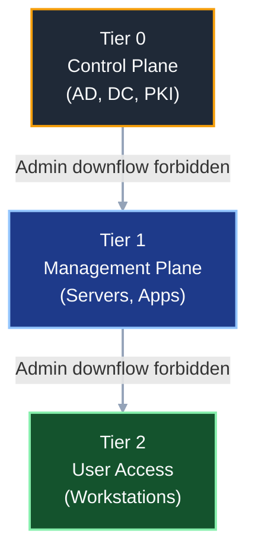

# Active Directory Tiering Model for On-Premises Environments

## Introduction

The **Active Directory Tiering Model** (also known as the **Enterprise Access Model**) is a security architecture designed to contain credential theft and lateral movement within an Active Directory environment. It replaces the legacy ESAE (Enhanced Security Admin Environment) / Red Forest model with a more practical, layered approach.

The core principle is simple: 🔒 **never expose a higher-tier credential on a lower-tier system**. A Domain Admin logging into a workstation leaves cached credentials that an attacker can harvest. Tiering eliminates this by enforcing strict isolation between administrative boundaries.

### The Three Tiers

| Tier | Name | Scope | Examples |
|------|------|-------|----------|
| **🛡️ Tier 0** | Control Plane | Identity infrastructure — anything that can directly control Active Directory | Domain Controllers, AD CS (PKI), AD FS, Entra ID Connect, DNS (AD-integrated), Schema/Configuration partition, DHCP on DCs |
| **⚙️ Tier 1** | Management Plane | Server infrastructure — anything that runs business applications and services | Application servers, file servers, SQL servers, Exchange, SCCM/MECM, Hyper-V/VMware hosts, print servers |
| **💻 Tier 2** | User Access | End-user devices — where users perform day-to-day work | Workstations, laptops, kiosks, thin clients |



### 🔒 Key Rule: Credentials Never Flow Downward

```
Tier 0 credentials → ONLY on Tier 0 systems
Tier 1 credentials → ONLY on Tier 1 systems (and Tier 1 PAWs)
Tier 2 credentials → ONLY on Tier 2 systems

❌ A Tier 0 admin logging into a workstation = catastrophic violation
❌ A Tier 1 admin logging into a workstation = serious violation
❌ A Tier 2 admin logging into a Domain Controller = access denied (enforced)
```

### ⚠️ Why This Matters

Without tiering, a single compromised workstation can lead to full domain compromise in minutes:

1. Attacker compromises a workstation (phishing, exploit, etc.)
2. Attacker harvests cached credentials (Mimikatz, LSASS dump)
3. If a Domain Admin ever logged into that workstation, the attacker now has Domain Admin credentials
4. Attacker performs DCSync, Golden Ticket, or direct DC access → **game over**

Tiering breaks this chain by ensuring that **Domain Admin credentials are never present on workstations**.

## 🗂️ Quick Navigation

- [🧭 Phase 0 — Prerequisites and Scoping](#-phase-0--prerequisites-and-scoping)
- [🏗️ Phase 1 — OU Structure and Group Model Design](#-phase-1--ou-structure-and-group-model-design)
- [🛡️ Phase 2 — Account Isolation and Logon Restrictions](#-phase-2--account-isolation-and-logon-restrictions)
- [💻 Phase 3 — Privileged Access Workstations (PAW)](#-phase-3--privileged-access-workstations-paw)
- [⚙️ Phase 4 — GPO Hardening Per Tier](#-phase-4--gpo-hardening-per-tier)
- [🔐 Phase 5 — Tier 0 Object Protection](#-phase-5--tier-0-object-protection)
- [📡 Phase 6 — Monitoring and Detection](#-phase-6--monitoring-and-detection)
- [🔁 Phase 7 — Operational Procedures and Continuous Improvement](#-phase-7--operational-procedures-and-continuous-improvement)
- [🧩 Phase 8 — Granular Administration: N-Level Model and Profile-Based Delegation](#-phase-8--granular-administration-n-level-model-and-profile-based-delegation)
- [📌 Summary — Prioritized Implementation Order](#-summary--prioritized-implementation-order)
- [🚧 Common Pitfalls and Lessons Learned](#-common-pitfalls-and-lessons-learned)
- [📚 References](#-references)

### 🎨 Reading Legend

- 🔴 Critical: security boundary or compromise risk
- 🟡 Warning: high chance of lockout or operational breakage
- 🔵 Important: deployment constraint or sequencing requirement
- 🟢 Recommendation: best practice to improve resilience

---

## 🧭 Phase 0 — Prerequisites and Scoping

Before touching Active Directory, you need a thorough understanding of your current environment and executive support for the project. This phase is about discovery, classification, and getting organizational buy-in.

### 0.1 — Obtain Executive Sponsorship

Tiering impacts **every IT administrator** in the organization. Without executive sponsorship, the project will stall when teams resist the changes.

**What you need:**
- A formal mandate from the CISO or CIO
- A RACI matrix defining responsibilities across teams (AD, server, network, security, helpdesk)
- Agreed-upon timeline with phases and milestones
- Communication plan for IT staff explaining the "why" — this is not optional, resistance will be significant
- Budget allocation for PAW hardware, potential tooling (MDI, SIEM), and dedicated project time

### 0.2 — Inventory and Classify All Assets

Every computer object, server, and infrastructure component must be mapped to a tier. This is the most labor-intensive step and the foundation of everything that follows.

#### Tier 0 Assets — The Crown Jewels

These are systems that can **directly control Active Directory**. If compromised, the entire domain is compromised.

| Asset | Why It's Tier 0 |
|-------|-----------------|
| Domain Controllers | They ARE Active Directory |
| AD CS servers (Certificate Authority) | Can issue certificates that grant Domain Admin-equivalent access (ESC1-ESC8 attacks) |
| AD FS servers | Control federated authentication; a compromised AD FS server = Golden SAML |
| Entra ID Connect server | Syncs password hashes to the cloud; can modify cloud identities |
| DNS servers (AD-integrated) | Can redirect authentication traffic; DNS is part of the DC role in most deployments |
| SCCM/MECM Site Server (if it manages DCs) | Can deploy code to Domain Controllers = full domain compromise |
| Hyper-V / VMware hosts running DCs | Can snapshot/clone a DC, extract NTDS.dit offline |
| Backup servers that back up DCs | Can restore a DC and extract NTDS.dit |
| PAM/Vault servers (CyberArk, etc.) | Store credentials for Tier 0 accounts |
| MIM (Microsoft Identity Manager) servers | Can manage identities, group memberships, and provision privileged accounts in AD |
| RADIUS/NPS servers authenticating DC access | Control who can authenticate to Tier 0 |

> **🔴 Critical:** Any system that can **deploy code to**, **restore**, or **manage** a Tier 0 asset is itself Tier 0. This is the transitive trust principle.

#### Tier 1 Assets — Servers and Applications

| Asset | Why It's Tier 1 |
|-------|-----------------|
| File servers | Store sensitive business data, but cannot directly control AD |
| SQL servers | Host application databases |
| Application servers (ERP, CRM, LOB) | Run business logic |
| Exchange servers (if not Tier 0) | Exchange has historically had DCSync-capable permissions — verify! |
| SCCM/MECM (if it does NOT manage DCs) | Can deploy code to Tier 1/Tier 2 only |
| Print servers | Infrastructure but no AD control |
| Hyper-V / VMware hosts (not hosting DCs) | Can control VMs at the Tier 1 level |
| WSUS servers | Can push updates to servers |

> **⚠️ Warning about Exchange:** In many environments, the `Exchange Windows Permissions` group has `WriteDACL` on the domain root, which is effectively DCSync. If this is the case, **Exchange is Tier 0**. Audit this with: `Get-ADPermission` or BloodHound.

> **⚠️ Warning about SCCM/MECM:** If SCCM has a client installed on Domain Controllers, or if SCCM administrators can push software to DCs, then SCCM is Tier 0. This is one of the most common misclassifications.

#### Tier 2 Assets — End-User Devices

| Asset | Notes |
|-------|-------|
| Workstations | All employee desktops and laptops |
| Kiosks | Shared-use terminals |
| Conference room PCs | Often unmanaged — still Tier 2 |

#### How to Perform the Inventory

```powershell
# Export all computer objects with their OS and OU location
Get-ADComputer -Filter * -Properties OperatingSystem, DistinguishedName, Description, LastLogonTimestamp |
    Select-Object Name, OperatingSystem, DistinguishedName, Description,
        @{N='LastLogon';E={[DateTime]::FromFileTime($_.LastLogonTimestamp)}} |
    Export-Csv -Path "C:\Tiering\AllComputers.csv" -NoTypeInformation

# Identify Domain Controllers
Get-ADDomainController -Filter * | Select-Object Name, IPv4Address, OperatingSystem, Site

# Identify servers in privileged groups or with privileged SPNs
Get-ADComputer -Filter {OperatingSystem -like "*Server*"} -Properties OperatingSystem, ServicePrincipalName |
    Select-Object Name, OperatingSystem, @{N='SPNs';E={$_.ServicePrincipalName -join '; '}} |
    Export-Csv -Path "C:\Tiering\Servers.csv" -NoTypeInformation
```

### 0.3 — Inventory All Privileged Accounts

You cannot enforce tiering without knowing who holds privileges and at what level.

#### Enumerate Privileged Group Members

```powershell
# Built-in privileged groups to audit
$PrivilegedGroups = @(
    "Domain Admins",
    "Enterprise Admins",
    "Schema Admins",
    "Administrators",
    "Backup Operators",
    "Account Operators",
    "Server Operators",
    "Print Operators",
    "DnsAdmins",
    "Group Policy Creator Owners",
    "Cert Publishers"
)

foreach ($Group in $PrivilegedGroups) {
    Write-Host "`n=== $Group ===" -ForegroundColor Cyan
    try {
        Get-ADGroupMember -Identity $Group -Recursive |
            Select-Object Name, SamAccountName, ObjectClass |
            Format-Table -AutoSize
    } catch {
        Write-Warning "Group '$Group' not found or error: $_"
    }
}
```

#### Identify Service Accounts with Excessive Privileges

```powershell
# Find service accounts that are members of Domain Admins (common bad practice)
Get-ADGroupMember -Identity "Domain Admins" -Recursive |
    Where-Object { $_.Name -match "svc|service|sql|app|batch|task" } |
    Select-Object Name, SamAccountName

# Find accounts with adminCount=1 (have been in a privileged group at some point)
Get-ADUser -Filter {adminCount -eq 1} -Properties adminCount, MemberOf, LastLogonTimestamp, PasswordLastSet |
    Select-Object Name, SamAccountName, Enabled, PasswordLastSet,
        @{N='LastLogon';E={[DateTime]::FromFileTime($_.LastLogonTimestamp)}},
        @{N='GroupCount';E={$_.MemberOf.Count}} |
    Export-Csv -Path "C:\Tiering\AdminCountUsers.csv" -NoTypeInformation
```

#### Detect Tiering Violations (Who Is Logging Where They Shouldn't)

Use Security Event Logs on Domain Controllers to find T0 accounts logging into non-T0 machines:

```powershell
# On Domain Controllers, look for 4624 events (successful logon) from privileged accounts on non-DC machines
# This requires centralized log collection (SIEM) or running on each DC

$DomainAdmins = (Get-ADGroupMember -Identity "Domain Admins" -Recursive).SamAccountName
$DCs = (Get-ADDomainController -Filter *).Name

# Example: Query Security log on a DC for interactive logons
Get-WinEvent -FilterHashtable @{
    LogName = 'Security'
    Id = 4624
    StartTime = (Get-Date).AddDays(-30)
} -MaxEvents 50000 | ForEach-Object {
    $xml = [xml]$_.ToXml()
    $TargetUser = ($xml.Event.EventData.Data | Where-Object { $_.Name -eq 'TargetUserName' }).'#text'
    $WorkstationName = ($xml.Event.EventData.Data | Where-Object { $_.Name -eq 'WorkstationName' }).'#text'
    $LogonType = ($xml.Event.EventData.Data | Where-Object { $_.Name -eq 'LogonType' }).'#text'

    if ($TargetUser -in $DomainAdmins -and $WorkstationName -notin $DCs) {
        [PSCustomObject]@{
            Time = $_.TimeCreated
            User = $TargetUser
            Workstation = $WorkstationName
            LogonType = $LogonType
        }
    }
} | Export-Csv -Path "C:\Tiering\TieringViolations.csv" -NoTypeInformation
```

### 0.4 — Assess the Current OU Structure and GPOs

Understanding the existing structure is critical before designing the tiering OUs.

```powershell
# Export the current OU structure
Get-ADOrganizationalUnit -Filter * -Properties Description |
    Select-Object Name, DistinguishedName, Description |
    Sort-Object DistinguishedName |
    Export-Csv -Path "C:\Tiering\OUStructure.csv" -NoTypeInformation

# Export all GPOs and their links
Get-GPO -All | ForEach-Object {
    $GPO = $_
    $Links = (Get-GPOReport -Guid $GPO.Id -ReportType XML | Select-Xml -XPath '//gpo:LinksTo' -Namespace @{gpo='http://www.microsoft.com/GroupPolicy/Settings'}).Node
    [PSCustomObject]@{
        GPOName = $GPO.DisplayName
        GPOId = $GPO.Id
        Status = $GPO.GpoStatus
        CreationTime = $GPO.CreationTime
        ModificationTime = $GPO.ModificationTime
        Owner = $GPO.Owner
    }
} | Export-Csv -Path "C:\Tiering\GPOInventory.csv" -NoTypeInformation

# Find GPOs linked to Domain Controllers OU
Get-ADOrganizationalUnit -Identity "OU=Domain Controllers,$((Get-ADDomain).DistinguishedName)" |
    Select-Object -ExpandProperty LinkedGroupPolicyObjects |
    ForEach-Object {
        $guid = $_ -replace '.*\{(.*?)\}.*', '$1'
        Get-GPO -Guid $guid | Select-Object DisplayName, Id, GpoStatus
    }
```

### 0.5 — Assess Attack Paths

Run these tools **before** implementing tiering to establish a baseline:

| Tool | Purpose | What To Look For |
|------|---------|-----------------|
| **BloodHound / SharpHound** | Visualize attack paths from any user to Domain Admins | Shortest paths to DA, Kerberoastable accounts with paths to T0, delegation abuse |
| **PingCastle** | AD security health check with a score | Privileged group hygiene, stale accounts, dangerous trusts, Kerberos weaknesses |
| **Purple Knight** | AD security assessment | Similar to PingCastle, different detection engine |
| **[MATI](https://github.com/0xMati/Tech-Blog/tree/main/Security/Active%20Directory/Microsoft%20Active%20Directory%20Threat%20Inspector)** | AD threat inspection with multiplicative scoring | WDigest, RunAsPPL, LSASS protection, Auth Silos, NTLM config, Kerberos encryption, GPO hardening, privileged group hygiene, delegation abuse, tiering OU compliance |
| **Invoke-TrimarcADChecks** | Open-source AD security checks | Focused on common misconfigurations |

```powershell
# Run PingCastle (example)
.\PingCastle.exe --healthcheck --server domain.local

# Run MATI (Microsoft Active Directory Threat Inspector)
.\Invoke-MATI.ps1

# Run SharpHound collector
.\SharpHound.exe -c All --domaincontroller dc01.domain.local
```

Save the reports — you will compare them after tiering is implemented to measure improvement.

### 0.6 — Multi-Domain and Multi-Forest Considerations

Many organizations have child domains, resource forests, or external trusts. Tiering must account for all of them.

#### Trusts and Tier Boundaries

| Trust Type | Tiering Impact |
|------------|---------------|
| **Parent-child (same forest)** | Enterprise Admins in the forest root can control ALL child domains → EA is Tier 0 across the entire forest |
| **External trust (one-way or two-way)** | Verify SID filtering is enabled. Without SID filtering, a compromised trusted domain can inject SIDs (e.g., Enterprise Admins SID) into tickets |
| **Forest trust** | SID filtering is enabled by default. Verify with `netdom trust /d:domain.local /quarantine` |
| **PAM trust (bastion forest)** | Used for MIM PAM (now deprecated) — shadow principals in bastion forest. If already deployed, plan migration to native JIT or third-party PAM |

#### 🧭 Key Rules for Multi-Domain Forests

1. **Enterprise Admins and Schema Admins should only exist in the forest root domain.** Child domain admins should never be EA/SA.
2. **Each domain needs its own tiering structure** — OU hierarchy, groups, GPOs. Do not rely on forest-level GPOs.
3. **Authentication Policies and Silos are per-domain.** You must create them in each domain independently.
4. **Cross-domain admin accounts are Tier 0.** If `t0-john.doe` in `root.local` also administers `child.root.local`, that account is T0 in both domains.
5. **Trusts to external partners must be audited.** Enable SID filtering, enforce selective authentication where possible, and ensure TGT delegation is disabled (`netdom trust /EnableTGTDelegation:No`).

```powershell
# Verify SID filtering status on all trusts
Get-ADTrust -Filter * -Properties SIDFilteringQuarantined, SIDFilteringForestAware, TGTDelegation |
    Select-Object Name, Direction, TrustType, SIDFilteringQuarantined, SIDFilteringForestAware, TGTDelegation |
    Format-Table -AutoSize

# Verify selective authentication on external trusts
Get-ADTrust -Filter {TrustType -eq "External"} -Properties SelectiveAuthentication |
    Select-Object Name, SelectiveAuthentication
```

#### If You Have Multiple Forests

Each forest is an independent security boundary. Tiering must be implemented **per forest**. A compromise in Forest A does not automatically compromise Forest B (assuming SID filtering is intact), but:
- Entra ID Connect may sync from multiple forests → the Connect server is T0 for ALL forests it syncs from
- Shared backup infrastructure across forests makes backup servers T0 for all forests
- Shared PAM vaults (CyberArk) holding credentials for both forests are T0 for both

### ✅ Phase 0 Checklist

- [ ] Executive sponsorship obtained (CISO/CIO mandate)
- [ ] RACI matrix created and communicated to all teams
- [ ] Communication plan shared with IT staff
- [ ] Budget allocated (PAW hardware, tooling, project time)
- [ ] All computer objects exported and classified (T0/T1/T2)
- [ ] All Domain Controllers identified
- [ ] All Tier 0 assets identified (AD CS, AD FS, Entra ID Connect, hypervisors hosting DCs, backup servers, SCCM, PAM)
- [ ] Exchange permissions audited — `Exchange Windows Permissions` WriteDACL checked
- [ ] SCCM scope audited — does it manage Domain Controllers?
- [ ] Hypervisor scope audited — which hosts run DC VMs?
- [ ] All privileged group members enumerated
- [ ] Service accounts in privileged groups identified
- [ ] Accounts with `adminCount=1` reviewed
- [ ] Tiering violations detected (T0 accounts logging into T2 machines)
- [ ] Current OU structure documented
- [ ] All GPOs and their links documented
- [ ] GPO owners verified (no non-admin GPO owners for sensitive GPOs)
- [ ] BloodHound/PingCastle/Purple Knight/MATI baseline reports generated and saved
- [ ] Attack paths from Tier 2 to Tier 0 documented

---

## 🏗️ Phase 1 — OU Structure and Group Model Design

This phase defines the organizational backbone of the tiering model. The OU structure determines where objects live, how GPOs are applied, and how delegation works. The group model determines who has access to what.

### 1.1 — Design the Tiering OU Structure

The goal is a clear, unambiguous structure where every object lives in the correct tier. GPOs are linked at the tier level and inherit downward.

#### Recommended OU Structure

```
domain.local
│
├── Tier 0
│   ├── Accounts          ← T0 admin user accounts (t0-john.doe)
│   ├── Groups            ← T0 security groups (T0-Admins, T0-LogonRestriction, etc.)
│   ├── Service Accounts  ← T0 service accounts and gMSAs
│   ├── Servers           ← T0 servers (AD CS, AD FS, Entra ID Connect, etc.)
│   │                        NOTE: DCs stay in the default "Domain Controllers" OU
│   └── PAW               ← Tier 0 Privileged Access Workstations
│
├── Tier 1
│   ├── Accounts          ← T1 admin user accounts (t1-john.doe)
│   ├── Groups            ← T1 security groups
│   ├── Service Accounts  ← T1 service accounts and gMSAs
│   ├── Servers           ← All Tier 1 servers
│   │   ├── File Servers
│   │   ├── SQL Servers
│   │   ├── Application Servers
│   │   └── ...           ← Sub-OUs by role or business unit (optional)
│   └── PAW               ← Tier 1 Privileged Access Workstations (optional)
│
├── Tier 2
│   ├── Accounts          ← T2 admin user accounts (t2-helpdesk, etc.)
│   ├── Groups            ← T2 security groups
│   ├── Service Accounts  ← T2 service accounts
│   └── Workstations      ← All end-user devices
│       ├── Desktops
│       ├── Laptops
│       └── Kiosks
│
├── Quarantine            ← Staging OU for new/unclassified objects
│   └── Computers         ← Default computer container redirected here (redircmp)
│
├── Standard Users        ← Non-admin user accounts
│   ├── Department A
│   ├── Department B
│   └── ...
│
└── Disabled              ← Disabled accounts and computers awaiting deletion
    ├── Users
    └── Computers
```

#### Implementation Script

```powershell
# Define domain DN
$DomainDN = (Get-ADDomain).DistinguishedName

# === Tier 0 ===
$T0 = New-ADOrganizationalUnit -Name "Tier 0" -Path $DomainDN -Description "Tier 0 - Control Plane (Identity Infrastructure)" -PassThru
New-ADOrganizationalUnit -Name "Accounts"         -Path $T0.DistinguishedName -Description "Tier 0 admin user accounts"
New-ADOrganizationalUnit -Name "Groups"            -Path $T0.DistinguishedName -Description "Tier 0 security groups"
New-ADOrganizationalUnit -Name "Service Accounts"  -Path $T0.DistinguishedName -Description "Tier 0 service accounts and gMSAs"
New-ADOrganizationalUnit -Name "Servers"           -Path $T0.DistinguishedName -Description "Tier 0 servers (AD CS, AD FS, AADConnect, etc.)"
New-ADOrganizationalUnit -Name "PAW"               -Path $T0.DistinguishedName -Description "Tier 0 Privileged Access Workstations"

# === Tier 1 ===
$T1 = New-ADOrganizationalUnit -Name "Tier 1" -Path $DomainDN -Description "Tier 1 - Management Plane (Servers and Applications)" -PassThru
New-ADOrganizationalUnit -Name "Accounts"         -Path $T1.DistinguishedName -Description "Tier 1 admin user accounts"
New-ADOrganizationalUnit -Name "Groups"            -Path $T1.DistinguishedName -Description "Tier 1 security groups"
New-ADOrganizationalUnit -Name "Service Accounts"  -Path $T1.DistinguishedName -Description "Tier 1 service accounts and gMSAs"
$T1Servers = New-ADOrganizationalUnit -Name "Servers" -Path $T1.DistinguishedName -Description "Tier 1 servers" -PassThru
New-ADOrganizationalUnit -Name "File Servers"      -Path $T1Servers.DistinguishedName
New-ADOrganizationalUnit -Name "SQL Servers"       -Path $T1Servers.DistinguishedName
New-ADOrganizationalUnit -Name "Application Servers" -Path $T1Servers.DistinguishedName
New-ADOrganizationalUnit -Name "PAW"               -Path $T1.DistinguishedName -Description "Tier 1 Privileged Access Workstations (optional)"

# === Tier 2 ===
$T2 = New-ADOrganizationalUnit -Name "Tier 2" -Path $DomainDN -Description "Tier 2 - User Access (Workstations)" -PassThru
New-ADOrganizationalUnit -Name "Accounts"         -Path $T2.DistinguishedName -Description "Tier 2 admin user accounts (helpdesk)"
New-ADOrganizationalUnit -Name "Groups"            -Path $T2.DistinguishedName -Description "Tier 2 security groups"
New-ADOrganizationalUnit -Name "Service Accounts"  -Path $T2.DistinguishedName -Description "Tier 2 service accounts"
$T2WS = New-ADOrganizationalUnit -Name "Workstations" -Path $T2.DistinguishedName -Description "End-user devices" -PassThru
New-ADOrganizationalUnit -Name "Desktops"          -Path $T2WS.DistinguishedName
New-ADOrganizationalUnit -Name "Laptops"           -Path $T2WS.DistinguishedName

# === Quarantine ===
$Quarantine = New-ADOrganizationalUnit -Name "Quarantine" -Path $DomainDN -Description "Staging OU for new/unclassified objects" -PassThru
$QuarantineComputers = New-ADOrganizationalUnit -Name "Computers" -Path $Quarantine.DistinguishedName -Description "Default computer landing OU" -PassThru

# Redirect default computer container to Quarantine\Computers
redircmp $QuarantineComputers.DistinguishedName

# === Standard Users ===
New-ADOrganizationalUnit -Name "Standard Users" -Path $DomainDN -Description "Non-admin user accounts"

# === Disabled Objects ===
$Disabled = New-ADOrganizationalUnit -Name "Disabled" -Path $DomainDN -Description "Disabled accounts awaiting deletion" -PassThru
New-ADOrganizationalUnit -Name "Users"     -Path $Disabled.DistinguishedName
New-ADOrganizationalUnit -Name "Computers" -Path $Disabled.DistinguishedName
```

> **🔵 Important:** Do NOT move Domain Controllers out of the default `Domain Controllers` OU. The `Default Domain Controllers Policy` GPO is linked there and is required for proper DC operation.

#### Why Redirect the Default Computer Container?

When a computer joins the domain, it lands in `CN=Computers` by default. This container:
- Cannot have GPOs linked to it (it is a container, not an OU)
- Has no tiering restrictions applied
- Is a security gap

By running `redircmp` to point to `Quarantine\Computers`, new machines land in a staging OU where you can:
- Apply a restrictive baseline GPO
- Review and classify the machine before moving it to the correct tier OU

### 1.2 — Design the Group Model

Groups are the mechanism that ties accounts to permissions and restrictions. Use the **AGDLP model** (Account → Global Group → Domain Local Group → Permission).

#### Tier 0 Groups

| Group Name | Type | Purpose |
|------------|------|---------|
| `T0-Admins` | Global | All Tier 0 admin accounts |
| `T0-PAW-Computers` | Global | All Tier 0 PAW computer objects |
| `T0-Servers` | Global | All Tier 0 server computer objects (excluding DCs) |
| `T0-ServiceAccounts` | Global | All Tier 0 service accounts |
| `T0-DenyLogon-T1` | Domain Local | Used in GPO to deny T0 accounts on T1 machines |
| `T0-DenyLogon-T2` | Domain Local | Used in GPO to deny T0 accounts on T2 machines |

#### Tier 1 Groups

| Group Name | Type | Purpose |
|------------|------|---------|
| `T1-Admins` | Global | All Tier 1 admin accounts |
| `T1-PAW-Computers` | Global | All Tier 1 PAW computer objects |
| `T1-Servers` | Global | All Tier 1 server computer objects |
| `T1-ServiceAccounts` | Global | All Tier 1 service accounts |
| `T1-DenyLogon-T0` | Domain Local | Used in GPO to deny T1 accounts on T0 machines |
| `T1-DenyLogon-T2` | Domain Local | Used in GPO to deny T1 accounts on T2 machines |

#### Tier 2 Groups

| Group Name | Type | Purpose |
|------------|------|---------|
| `T2-Admins` | Global | All Tier 2 admin accounts (helpdesk, desktop support) |
| `T2-Workstations` | Global | All Tier 2 workstation computer objects |
| `T2-ServiceAccounts` | Global | All Tier 2 service accounts |
| `T2-DenyLogon-T0` | Domain Local | Used in GPO to deny T2 accounts on T0 machines |
| `T2-DenyLogon-T1` | Domain Local | Used in GPO to deny T2 accounts on T1 machines |

#### Implementation Script

```powershell
$DomainDN = (Get-ADDomain).DistinguishedName

# --- Tier 0 Groups ---
$T0GroupsOU = "OU=Groups,OU=Tier 0,$DomainDN"
New-ADGroup -Name "T0-Admins"           -GroupScope Global      -GroupCategory Security -Path $T0GroupsOU -Description "All Tier 0 admin accounts"
New-ADGroup -Name "T0-PAW-Computers"    -GroupScope Global      -GroupCategory Security -Path $T0GroupsOU -Description "All Tier 0 PAW computer objects"
New-ADGroup -Name "T0-Servers"          -GroupScope Global      -GroupCategory Security -Path $T0GroupsOU -Description "All Tier 0 server objects (excl. DCs)"
New-ADGroup -Name "T0-ServiceAccounts"  -GroupScope Global      -GroupCategory Security -Path $T0GroupsOU -Description "All Tier 0 service accounts"
New-ADGroup -Name "T0-DenyLogon-T1"     -GroupScope DomainLocal -GroupCategory Security -Path $T0GroupsOU -Description "Deny T0 accounts logon on T1 machines"
New-ADGroup -Name "T0-DenyLogon-T2"     -GroupScope DomainLocal -GroupCategory Security -Path $T0GroupsOU -Description "Deny T0 accounts logon on T2 machines"

# --- Tier 1 Groups ---
$T1GroupsOU = "OU=Groups,OU=Tier 1,$DomainDN"
New-ADGroup -Name "T1-Admins"           -GroupScope Global      -GroupCategory Security -Path $T1GroupsOU -Description "All Tier 1 admin accounts"
New-ADGroup -Name "T1-PAW-Computers"    -GroupScope Global      -GroupCategory Security -Path $T1GroupsOU -Description "All Tier 1 PAW computer objects"
New-ADGroup -Name "T1-Servers"          -GroupScope Global      -GroupCategory Security -Path $T1GroupsOU -Description "All Tier 1 server objects"
New-ADGroup -Name "T1-ServiceAccounts"  -GroupScope Global      -GroupCategory Security -Path $T1GroupsOU -Description "All Tier 1 service accounts"
New-ADGroup -Name "T1-DenyLogon-T0"     -GroupScope DomainLocal -GroupCategory Security -Path $T1GroupsOU -Description "Deny T1 accounts logon on T0 machines"
New-ADGroup -Name "T1-DenyLogon-T2"     -GroupScope DomainLocal -GroupCategory Security -Path $T1GroupsOU -Description "Deny T1 accounts logon on T2 machines"

# --- Tier 2 Groups ---
$T2GroupsOU = "OU=Groups,OU=Tier 2,$DomainDN"
New-ADGroup -Name "T2-Admins"           -GroupScope Global      -GroupCategory Security -Path $T2GroupsOU -Description "All Tier 2 admin accounts (helpdesk)"
New-ADGroup -Name "T2-Workstations"     -GroupScope Global      -GroupCategory Security -Path $T2GroupsOU -Description "All Tier 2 workstation objects"
New-ADGroup -Name "T2-ServiceAccounts"  -GroupScope Global      -GroupCategory Security -Path $T2GroupsOU -Description "All Tier 2 service accounts"
New-ADGroup -Name "T2-DenyLogon-T0"     -GroupScope DomainLocal -GroupCategory Security -Path $T2GroupsOU -Description "Deny T2 accounts logon on T0 machines"
New-ADGroup -Name "T2-DenyLogon-T1"     -GroupScope DomainLocal -GroupCategory Security -Path $T2GroupsOU -Description "Deny T2 accounts logon on T1 machines"

# --- Nest Global Groups into Domain Local Deny Groups ---
# T0 accounts denied on T1 and T2
Add-ADGroupMember -Identity "T0-DenyLogon-T1" -Members "T0-Admins","T0-ServiceAccounts"
Add-ADGroupMember -Identity "T0-DenyLogon-T2" -Members "T0-Admins","T0-ServiceAccounts"

# T1 accounts denied on T0 and T2
Add-ADGroupMember -Identity "T1-DenyLogon-T0" -Members "T1-Admins","T1-ServiceAccounts"
Add-ADGroupMember -Identity "T1-DenyLogon-T2" -Members "T1-Admins","T1-ServiceAccounts"

# T2 accounts denied on T0 and T1
Add-ADGroupMember -Identity "T2-DenyLogon-T0" -Members "T2-Admins","T2-ServiceAccounts"
Add-ADGroupMember -Identity "T2-DenyLogon-T1" -Members "T2-Admins","T2-ServiceAccounts"
```

### 1.3 — Move Existing Objects to the Correct OUs

Now move servers, workstations, and accounts to the correct tier OUs. **Do this in a maintenance window** and test GPO application afterward.

```powershell
# Example: Move a Tier 0 server to the T0 Servers OU
Move-ADObject -Identity "CN=ADCS01,CN=Computers,DC=domain,DC=local" `
              -TargetPath "OU=Servers,OU=Tier 0,DC=domain,DC=local"

# Example: Move workstations from Quarantine to Tier 2
Get-ADComputer -Filter * -SearchBase "OU=Computers,OU=Quarantine,DC=domain,DC=local" |
    Where-Object { $_.OperatingSystem -notlike "*Server*" } |
    Move-ADObject -TargetPath "OU=Desktops,OU=Workstations,OU=Tier 2,DC=domain,DC=local"
```

> **🟡 Caution:** Moving objects changes which GPOs are applied. Verify GPO inheritance with `gpresult /r` on key systems after the move.

### 1.4 — Design the Delegation Model

Tiering defines *who can log on where*. The delegation model defines *who can manage what inside Active Directory*. Without a delegation model, tiering is incomplete — an admin who can't log on to a DC but can reset Domain Admin passwords via ADUC still has Tier 0 power.

#### 🧩 Delegation Principles

1. **No one touches Tier 0 objects except Tier 0 admins.** Period.
2. **Tier 1 admins manage Tier 1 OUs** — create/delete/modify servers, reset server local admin passwords (LAPS), manage server groups.
3. **Tier 2 admins (helpdesk) manage Tier 2 OUs** — reset user passwords, unlock accounts, manage workstation objects, join computers to the domain (in the Quarantine OU only).
4. **Standard users have no delegation anywhere.**
5. **Delegation is applied at the OU level** using the Delegation of Control Wizard or PowerShell `dsacls`.

#### Recommended Delegation Matrix

| Action | Who Can Do It | Where (OU) |
|--------|--------------|------------|
| Create/delete/modify user objects | T0-Admins | `Tier 0\Accounts` |
| Create/delete/modify user objects | T1-Admins | `Tier 1\Accounts` |
| Create/delete/modify user objects | T2-Admins | `Tier 2\Accounts`, `Standard Users` |
| Reset passwords | T0-Admins | `Tier 0\Accounts` |
| Reset passwords | T1-Admins | `Tier 1\Accounts`, `Tier 1\Service Accounts` |
| Reset passwords | T2-Admins | `Tier 2\Accounts`, `Standard Users` |
| Join computers to domain | T2-Admins | `Quarantine\Computers` only |
| Create/delete computer objects | T1-Admins | `Tier 1\Servers` |
| Create/delete computer objects | T2-Admins | `Tier 2\Workstations` |
| Manage group membership | T0-Admins | `Tier 0\Groups` |
| Manage group membership | T1-Admins | `Tier 1\Groups` |
| Manage group membership | T2-Admins | `Tier 2\Groups` |
| Link GPOs | T0-Admins only | `Tier 0`, `Domain Controllers` |
| Link GPOs | T1-Admins | `Tier 1` (with T0 approval for sensitive GPOs) |
| Link GPOs | T2-Admins | None — GPO linking is not a helpdesk function |
| Modify schema / configuration | Schema Admins / Enterprise Admins (T0 only) | Schema / Config partitions |

#### Implementation with `dsacls`

```powershell
$DomainDN = (Get-ADDomain).DistinguishedName

# --- Tier 2 Admins: delegate password reset on Standard Users OU ---
$StandardUsersOU = "OU=Standard Users,$DomainDN"
dsacls $StandardUsersOU /I:S /G "DOMAIN\T2-Admins:CA;Reset Password;user"
dsacls $StandardUsersOU /I:S /G "DOMAIN\T2-Admins:WP;lockoutTime;user"       # Unlock accounts
dsacls $StandardUsersOU /I:S /G "DOMAIN\T2-Admins:WP;pwdLastSet;user"        # Force password change at next logon

# --- Tier 2 Admins: delegate computer join in Quarantine ---
$QuarantineOU = "OU=Computers,OU=Quarantine,$DomainDN"
dsacls $QuarantineOU /I:S /G "DOMAIN\T2-Admins:CC;computer;"                  # Create computer objects
dsacls $QuarantineOU /I:S /G "DOMAIN\T2-Admins:WP;servicePrincipalName;computer"
dsacls $QuarantineOU /I:S /G "DOMAIN\T2-Admins:WP;userAccountControl;computer"

# --- Tier 1 Admins: delegate server management in Tier 1 ---
$T1ServersOU = "OU=Servers,OU=Tier 1,$DomainDN"
dsacls $T1ServersOU /I:S /G "DOMAIN\T1-Admins:GA;computer;"                   # Full control on computer objects
dsacls $T1ServersOU /I:S /G "DOMAIN\T1-Admins:CC;computer;"                   # Create computer objects

# --- Tier 1 Admins: delegate group management in Tier 1 ---
$T1GroupsOU = "OU=Groups,OU=Tier 1,$DomainDN"
dsacls $T1GroupsOU /I:S /G "DOMAIN\T1-Admins:WP;member;group"                 # Manage group membership

# --- CRITICAL: Remove any inherited delegation from Tier 0 OUs ---
# Block inheritance on Tier 0 OU if needed, then re-apply only T0 delegations
# Verify no T1/T2 admin has accidental write access to Tier 0 objects:
(Get-Acl "AD:\OU=Tier 0,$DomainDN").Access |
    Where-Object {
        $_.IdentityReference -match "T1-|T2-|Helpdesk" -and
        $_.ActiveDirectoryRights -match "Write|Create|Delete|GenericAll"
    } | Format-Table IdentityReference, ActiveDirectoryRights, AccessControlType -AutoSize
```

> **🔴 Critical rule:** Tier 2 admins must NEVER have password reset rights on Tier 0 or Tier 1 accounts. Verify this explicitly. A helpdesk operator who can reset a Domain Admin password is effectively Tier 0.

#### Audit Existing Delegations

Before setting up clean delegations, audit what exists today:

```powershell
# Export all non-inherited ACEs on the Tier 0 OU to find unauthorized delegations
$T0OU = "OU=Tier 0,$((Get-ADDomain).DistinguishedName)"
(Get-Acl "AD:\$T0OU").Access |
    Where-Object { $_.IsInherited -eq $false } |
    Select-Object IdentityReference, ActiveDirectoryRights, ObjectType, InheritedObjectType, AccessControlType |
    Format-Table -AutoSize

# Same for Domain Controllers OU
$DCsOU = "OU=Domain Controllers,$((Get-ADDomain).DistinguishedName)"
(Get-Acl "AD:\$DCsOU").Access |
    Where-Object { $_.IsInherited -eq $false } |
    Select-Object IdentityReference, ActiveDirectoryRights, ObjectType, InheritedObjectType, AccessControlType |
    Format-Table -AutoSize
```

### ✅ Phase 1 Checklist

- [ ] Tiering OU structure created (Tier 0, Tier 1, Tier 2, Quarantine, Standard Users, Disabled)
- [ ] Sub-OUs created for Accounts, Groups, Service Accounts, Servers/Workstations, PAW per tier
- [ ] Default computer container redirected to Quarantine (`redircmp`)
- [ ] Domain Controllers confirmed in default `Domain Controllers` OU (not moved)
- [ ] All tiering groups created with correct scope (Global vs. Domain Local)
- [ ] Deny logon groups nested correctly (Global → Domain Local)
- [ ] Existing Tier 0 servers moved to `Tier 0\Servers`
- [ ] Existing Tier 1 servers moved to `Tier 1\Servers`
- [ ] Existing workstations moved to `Tier 2\Workstations`
- [ ] GPO application verified on moved objects (`gpresult /r`)
- [ ] No objects left in default `CN=Computers` container
- [ ] OU protections enabled (Protect object from accidental deletion)
- [ ] Delegation model designed (who can manage what in which OU)
- [ ] Delegations implemented with `dsacls` or Delegation of Control Wizard
- [ ] T2 admins verified: NO password reset rights on Tier 0 or Tier 1 accounts
- [ ] T1 admins verified: NO write access on Tier 0 OUs or Domain Controllers OU
- [ ] Existing unauthorized delegations on Tier 0 OUs removed
- [ ] Delegation audit scripts retained for quarterly reviews

---

## 🛡️ Phase 2 — Account Isolation and Logon Restrictions

This is the phase that actually enforces tiering. Without logon restrictions, the OU structure is just cosmetic.

### 2.1 — Create Dedicated Admin Accounts Per Tier

Every administrator receives **one account per tier** they manage. Their standard user account is never granted admin privileges.

#### Naming Convention

| Account Type | Naming Convention | Example | Tier |
|--------------|-------------------|---------|------|
| Standard user | `firstname.lastname` | `john.doe` | N/A (Standard Users OU) |
| Tier 0 admin | `t0-firstname.lastname` | `t0-john.doe` | Tier 0 |
| Tier 1 admin | `t1-firstname.lastname` | `t1-john.doe` | Tier 1 |
| Tier 2 admin (helpdesk) | `t2-firstname.lastname` | `t2-john.doe` | Tier 2 |

#### Account Creation Script

```powershell
function New-TieredAdminAccount {
    param(
        [Parameter(Mandatory)][ValidateSet("T0","T1","T2")]
        [string]$Tier,

        [Parameter(Mandatory)]
        [string]$FirstName,

        [Parameter(Mandatory)]
        [string]$LastName,

        [Parameter(Mandatory)]
        [securestring]$Password
    )

    $DomainDN = (Get-ADDomain).DistinguishedName
    $SamAccountName = "$Tier-$FirstName.$LastName".ToLower()
    $TargetOU = "OU=Accounts,OU=$($Tier -replace 'T','Tier '), $DomainDN"
    $GroupName = "$Tier-Admins"

    $UserParams = @{
        Name              = $SamAccountName
        SamAccountName    = $SamAccountName
        UserPrincipalName = "$SamAccountName@$((Get-ADDomain).DNSRoot)"
        GivenName         = $FirstName
        Surname           = $LastName
        DisplayName       = "$FirstName $LastName ($Tier Admin)"
        Description       = "$Tier administrative account for $FirstName $LastName"
        Path              = $TargetOU
        AccountPassword   = $Password
        Enabled           = $true
        ChangePasswordAtLogon = $true
        PasswordNeverExpires  = $false
    }

    New-ADUser @UserParams
    Add-ADGroupMember -Identity $GroupName -Members $SamAccountName
    Write-Host "Created $SamAccountName in $TargetOU and added to $GroupName" -ForegroundColor Green
}

# Usage
$pw = Read-Host "Enter password" -AsSecureString
New-TieredAdminAccount -Tier "T0" -FirstName "John" -LastName "Doe" -Password $pw
```

#### Account Hardening for Tier 0 Accounts

Tier 0 accounts require additional hardening:

```powershell
# For each T0 admin account, apply these settings:
$T0Accounts = Get-ADGroupMember -Identity "T0-Admins" | Where-Object { $_.objectClass -eq 'user' }

foreach ($Account in $T0Accounts) {
    Set-ADUser -Identity $Account.SamAccountName -SmartcardLogonRequired $false  # Set to $true if using smartcards
    
    # Add to "Protected Users" group (disables NTLM, enforces Kerberos, no delegation, no caching)
    Add-ADGroupMember -Identity "Protected Users" -Members $Account.SamAccountName

    # Set "Account is sensitive and cannot be delegated"
    $user = Get-ADUser -Identity $Account.SamAccountName -Properties AccountNotDelegated
    Set-ADUser -Identity $Account.SamAccountName -AccountNotDelegated $true
}
```

> **Protected Users group** (Windows Server 2012 R2+): Members cannot authenticate with NTLM, cannot be delegated, have a 4-hour TGT lifetime, and credentials are never cached. This is the single most impactful protection for Tier 0 accounts.

### 2.2 — Enforce Logon Restrictions via GPO

This is the core enforcement mechanism. You need **six GPOs** (or a consolidated approach):

#### GPO Design

| GPO Name | Linked To | Purpose |
|----------|-----------|---------|
| `Tiering - Deny T0 Logon on T1` | `Tier 1` OU (all sub-OUs) | Prevents T0 accounts from logging into T1 machines |
| `Tiering - Deny T0 Logon on T2` | `Tier 2` OU (all sub-OUs) | Prevents T0 accounts from logging into T2 machines |
| `Tiering - Deny T1 Logon on T0` | `Tier 0` OU + Domain Controllers OU | Prevents T1 accounts from logging into T0 machines |
| `Tiering - Deny T1 Logon on T2` | `Tier 2` OU (all sub-OUs) | Prevents T1 accounts from logging into T2 machines |
| `Tiering - Deny T2 Logon on T0` | `Tier 0` OU + Domain Controllers OU | Prevents T2 accounts from logging into T0 machines |
| `Tiering - Deny T2 Logon on T1` | `Tier 1` OU (all sub-OUs) | Prevents T2 accounts from logging into T1 machines |

#### GPO Settings — User Rights Assignment

For each deny GPO, configure these settings under:

**Computer Configuration → Policies → Windows Settings → Security Settings → Local Policies → User Rights Assignment**

| Setting | Value |
|---------|-------|
| **Deny log on locally** | The deny group for that tier combination |
| **Deny log on through Remote Desktop Services** | Same deny group |
| **Deny access to this computer from the network** | Same deny group |
| **Deny log on as a batch job** | Same deny group |
| **Deny log on as a service** | Same deny group |

**Example for "Tiering - Deny T0 Logon on T2"** (linked to Tier 2 OU):

| Setting | Value |
|---------|-------|
| Deny log on locally | `DOMAIN\T0-DenyLogon-T2` |
| Deny log on through Remote Desktop Services | `DOMAIN\T0-DenyLogon-T2` |
| Deny access to this computer from the network | `DOMAIN\T0-DenyLogon-T2` |
| Deny log on as a batch job | `DOMAIN\T0-DenyLogon-T2` |
| Deny log on as a service | `DOMAIN\T0-DenyLogon-T2` |

> **🟡 Warning:** "Deny" rights always override "Allow" rights. A user in both a deny and an allow group will be denied. Test carefully before applying broadly.

> **🟡 Warning:** Do NOT add `Domain Admins` or `Enterprise Admins` to deny groups on DCs. This will lock you out.

#### 🧪 Testing Strategy

1. **Start in audit mode:** Before enforcing, use the scripts from Phase 0.3 to identify current violations. Every violation is a logon that **will break** when you enforce the GPO.
2. **Apply to a test OU first:** Create a `Test` sub-OU in each tier and link the GPO there. Move one test machine to validate.
3. **Use `gpresult /r`** to verify the GPO is applied correctly.
4. **Test all logon types:** Interactive, RDP, network (SMB), service, batch.

```powershell
# Verify GPO application on a target machine
Invoke-Command -ComputerName "TESTSERVER01" -ScriptBlock {
    gpresult /r /scope:computer | Select-String -Pattern "Tiering"
}
```

### 2.3 — Authentication Policies and Silos (Advanced — Optional but Recommended)

**Requires:** Windows Server 2012 R2 Domain Functional Level and Kerberos Armoring (FAST).

Authentication Policies and Silos provide **Kerberos-level enforcement** that is stronger than GPO-based deny logon rights. GPO deny rights can be bypassed in certain scenarios (e.g., a compromised machine not applying GPO). Authentication Policies enforce restrictions **at the DC level** during TGT issuance.

#### ⚙️ How It Works

- An **Authentication Policy** defines conditions under which a TGT will be issued (e.g., "only on Tier 0 machines")
- An **Authentication Silo** groups accounts and policies together
- When an account in a silo requests a TGT, the DC checks whether the request comes from an allowed machine. If not, the TGT is denied.

#### Implementation

```powershell
# Step 1: Ensure domain functional level is 2012 R2+
(Get-ADDomain).DomainMode  # Should be Windows2012R2Domain or higher

# Step 2: Create Authentication Policy for Tier 0
New-ADAuthenticationPolicy -Name "T0-AuthPolicy" `
    -Description "Restricts Tier 0 accounts to Tier 0 machines only" `
    -UserTGTLifetimeMins 240 `
    -Enforce  # Remove -Enforce for audit mode first
    -UserAllowedToAuthenticateFrom (
        New-ADAuthenticationPolicyCriteria -AllowedToAuthenticateFrom `
            "O:SYG:SYD:(XA;OICI;CR;;;WD;(@USER.ad://ext/AuthenticationSilo == `"T0-Silo`"))"
    )

# Step 3: Create Authentication Policy for Tier 0 Computers
# This restricts which accounts can get service tickets to T0 machines
New-ADAuthenticationPolicy -Name "T0-ComputerAuthPolicy" `
    -Description "Only T0 accounts can get service tickets to T0 machines" `
    -ComputerTGTLifetimeMins 240 `
    -ServiceAllowedToAuthenticateFrom (
        New-ADAuthenticationPolicyCriteria -AllowedToAuthenticateFrom `
            "O:SYG:SYD:(XA;OICI;CR;;;WD;(Member_of_any {SID($T0AdminsSID)}))"
    )

# Step 4: Create Authentication Silo for Tier 0
New-ADAuthenticationPolicySilo -Name "T0-Silo" `
    -Description "Tier 0 Authentication Silo" `
    -UserAuthenticationPolicy "T0-AuthPolicy" `
    -ComputerAuthenticationPolicy "T0-ComputerAuthPolicy" `
    -ServiceAuthenticationPolicy "T0-AuthPolicy" `
    -Enforce  # Remove -Enforce for audit mode first

# Step 5: Assign accounts to the silo
$T0Accounts = Get-ADGroupMember -Identity "T0-Admins"
foreach ($acct in $T0Accounts) {
    Set-ADUser -Identity $acct -AuthenticationPolicySilo "T0-Silo"
    Grant-ADAuthenticationPolicySiloAccess -Identity "T0-Silo" -Account $acct
}

# Step 6: Assign T0 computers to the silo
$T0Computers = Get-ADComputer -Filter * -SearchBase "OU=Servers,OU=Tier 0,$((Get-ADDomain).DistinguishedName)"
foreach ($comp in $T0Computers) {
    Set-ADComputer -Identity $comp -AuthenticationPolicySilo "T0-Silo"
    Grant-ADAuthenticationPolicySiloAccess -Identity "T0-Silo" -Account $comp
}
```

> **🟢 Recommendation:** Deploy Authentication Policies in **audit mode** first. Monitor Event ID **105** (Authentication Policy) and **106** (Authentication Silo) in the `AuthenticationPolicyFailures-DomainController` event log on DCs.

### 2.4 — Just-In-Time (JIT) Administration

Even with proper tiering, **permanent standing access** remains a risk: compromised accounts have privileges 24/7 whether or not the admin is working. Just-In-Time administration ensures that privileged group memberships are granted **only when needed** and **automatically revoked** after a defined window.

#### Why JIT Matters for Tiering

| Problem | Without JIT | With JIT |
|---------|------------|----------|
| **Attack surface** | T0 groups (Domain Admins, Enterprise Admins, Schema Admins) have permanent members — always targetable | Groups are **empty by default** — nothing to steal |
| **Lateral movement** | Compromised T0 account has instant domain-level access | Attacker must wait for or trigger a JIT elevation window |
| **Blast radius** | Credential theft = full T0 access indefinitely | Credential theft = T0 access only during the TTL (minutes/hours) |
| **Audit trail** | "Who has access?" requires group membership review | Every elevation generates a time-stamped event — full accountability |

#### Strategy: Empty Groups by Default

The core principle: 🎯

> **Enterprise Admins and Schema Admins should have ZERO permanent members.** Domain Admins should have only the bare minimum (ideally one break-glass account). All other T0 access is granted through JIT.

#### Option 1 — Native Temporary Group Membership (Recommended for On-Prem)

Windows Server 2016 Forest Functional Level (FFL) introduced **Privileged Access Management (PAM) features** that include temporary, time-bound group memberships via the `MemberTimeToLive` (TTL) attribute.

**Prerequisites:**
- Forest Functional Level **2016** or higher
- The PAM optional feature must be enabled (one-time, **irreversible**):

```powershell
# Check if already enabled
Get-ADOptionalFeature -Filter { Name -eq "Privileged Access Management Feature" }

# Enable the PAM feature (irreversible — test in lab first)
Enable-ADOptionalFeature `
    -Identity "Privileged Access Management Feature" `
    -Scope ForestOrConfigurationSet `
    -Target (Get-ADForest).Name
```

**Granting Temporary Membership:**

```powershell
# Add a user to Domain Admins for 1 hour (TTL in minutes)
Add-ADGroupMember -Identity "Domain Admins" `
    -Members "t0-admin-jsmith" `
    -MemberTimeToLive (New-TimeSpan -Hours 1)

# Verify the TTL
Get-ADGroup "Domain Admins" -Properties member -ShowMemberTimeToLive
```

After the TTL expires, the membership is **automatically removed** by Active Directory — no scheduled task, no script, no manual cleanup.

**Building a Self-Service JIT Workflow:**

Since there is no built-in GUI for requesting JIT elevation, you need to build a lightweight workflow:

| Component | Implementation |
|-----------|---------------|
| **Request portal** | PowerShell script, internal web app, or ticketing integration (ServiceNow, Jira) |
| **Approval** | Manager/peer approval via email or portal; for T0 changes, require **dual approval** |
| **Elevation script** | `Add-ADGroupMember` with `-MemberTimeToLive` (called by approved automation, not by the admin themselves) |
| **Audit log** | Log every elevation: who, to which group, TTL, approver, timestamp |
| **Max TTL** | Enforce a maximum TTL (e.g., 4 hours for T0, 8 hours for T1) — never 24h+ |
| **Monitoring** | Alert on any **permanent** additions to T0 groups (Event ID 4728/4756 without TTL) |

**Auditing Temporary Group Memberships:**

```powershell
# List all current temporary memberships in Domain Admins
$group = Get-ADGroup "Domain Admins" -Properties member -ShowMemberTimeToLive
$group.member | ForEach-Object {
    if ($_ -match '<TTL=(\d+)>') {
        [PSCustomObject]@{
            Member = ($_ -replace '<TTL=\d+>,','')
            TTLSeconds = $Matches[1]
            ExpiresIn = [TimeSpan]::FromSeconds($Matches[1])
        }
    }
}

# Find all groups with temporary members across the domain
Get-ADGroup -Filter * -Properties member -ShowMemberTimeToLive |
    Where-Object { ($_.member | Where-Object { $_ -match '<TTL=' }).Count -gt 0 } |
    Select-Object Name, @{N='TempMembers';E={($_.member | Where-Object { $_ -match '<TTL=' }).Count}}
```

#### Option 2 — Entra PIM for Hybrid Environments

If your environment is **hybrid** (Entra ID Connect syncing on-prem groups to Entra ID), you can use **Entra Privileged Identity Management (PIM)** to manage on-prem group memberships:

- Create **Entra ID security groups** that are **written back** to on-prem AD (group writeback v2)
- Configure PIM policies: max duration, approval, MFA on activation, justification required
- Admins request elevation in the Entra portal → group membership syncs to on-prem via Entra ID Connect

**Limitations:** Sync latency (up to 30 minutes with default Entra ID Connect cycle), dependency on cloud availability, not suitable for break-glass scenarios.

#### Option 3 — Third-Party PAM Solutions

Commercial PAM solutions (CyberArk, BeyondTrust, Delinea, One Identity) provide:
- Vaulted credentials with check-out/check-in
- Session recording for privileged access
- JIT elevation with approval workflows
- Integration with ITSM tools

These are powerful but introduce significant cost and complexity. Evaluate whether native JIT (Option 1) meets your requirements before committing to a third-party solution.

> **⚠️ Note on MIM PAM:** Microsoft Identity Manager (MIM) 2016 included a PAM feature that used a bastion forest to provide JIT access. **MIM has reached end of mainstream support (January 2029 extended support end) and Microsoft is not investing in new features.** Do not start new MIM PAM deployments. For new implementations, use **native temporary group membership** (Option 1) or **Entra PIM** (Option 2).

#### 🗺️ JIT Implementation Roadmap

| Step | Action | Timeline |
|------|--------|----------|
| 1 | Verify Forest Functional Level ≥ 2016 | Week 1 |
| 2 | Enable PAM optional feature in **lab** first | Week 1 |
| 3 | Enable PAM optional feature in **production** | Week 2 |
| 4 | Remove permanent members from Enterprise Admins and Schema Admins | Week 2 |
| 5 | Build JIT request/approval workflow (script or portal) | Weeks 2-4 |
| 6 | Define max TTL per group and per tier | Week 2 |
| 7 | Deploy monitoring: alert on permanent additions to T0 groups | Week 3 |
| 8 | Train T0 admins on JIT workflow | Week 3 |
| 9 | Reduce Domain Admins to break-glass + JIT only | Week 4 |
| 10 | Extend JIT to Tier 1 privileged groups | Weeks 5-8 |

### 2.5 — Secrets Management and Password Vaults

Tiering creates multiple admin accounts per person and many service accounts across tiers. Without a structured approach to storing and managing these credentials, admins will revert to sticky notes, shared spreadsheets, or a single password for everything — destroying the separation you just built.

#### 🔐 Core Principle

> **The vault is classified at the tier of the highest-sensitivity secret it contains.** A KeePass database holding both T0 break-glass passwords and T2 LAPS passwords is a **Tier 0 asset** — because compromising it yields T0 access.

This leads to the fundamental rule: **separate vaults per tier**.

#### Choosing a Solution

| Solution | Best For | Tier Separation | Auto-Rotation | Audit Trail | Session Recording | Cost |
|----------|----------|-----------------|---------------|-------------|-------------------|------|
| **🗝️ KeePass / KeePassXC** | Small teams, budget-constrained | Manual (separate `.kdbx` per tier) | No | No native audit | No | Free |
| **🏦 CyberArk PAM** | Enterprise, regulated industries | Built-in safes per tier | Yes | Full audit | Yes | $$$ |
| **🔐 BeyondTrust PM** | Enterprise, session management focus | Policy-based separation | Yes | Full audit | Yes | $$$ |
| **📁 Delinea Secret Server** | Mid-market, good UI | Folder-based separation | Yes | Full audit | Yes | $$ |
| **🧰 HashiCorp Vault** | DevOps-heavy, hybrid/cloud | Namespace/policy-based | Yes (dynamic secrets) | Full audit | No | $ (OSS) / $$ (Enterprise) |
| **☁️ Azure Key Vault** | Hybrid environments with Entra ID | RBAC-based separation | Yes (certificates) | Full audit via Azure Monitor | No | $ |

#### ✅ Recommendation by Environment Size

**Small environment (< 500 users, 1-3 T0 admins):**
Use **KeePass/KeePassXC** with strict discipline:

- Create **one `.kdbx` database per tier**: `T0-Secrets.kdbx`, `T1-Secrets.kdbx`, `T2-Secrets.kdbx`
- T0 database stored on a **T0-only file share** (or locally on the PAW, with offline backup)
- T1/T2 databases stored on their respective tier-restricted shares
- Each database encrypted with a **unique, strong master passphrase** (30+ characters)
- Optionally add a **key file** stored separately from the database (defense in depth)
- **Never open T0 KeePass on a non-T0 machine** — the decrypted secrets exist in memory

```
Physical Safe (sealed envelopes)         T0-Secrets.kdbx
├── Break-glass account passwords        ├── T0 admin account passwords
├── DSRM passwords (all DCs)             ├── T0 service account passwords
└── (printed, one envelope per secret)   ├── AD CS private key passphrase
                                         ├── krbtgt rotation records
T1-Secrets.kdbx                          └── T0 backup encryption keys
├── T1 admin passwords
├── T1 service accounts
├── Application admin accounts
└── Infrastructure credentials
```

> **Break-glass and DSRM passwords belong in a physical safe** — printed on paper, in sealed tamper-evident envelopes, stored in a locked safe accessible only to authorized personnel. These passwords must work when all digital systems are unavailable (PAW destroyed, KeePass file corrupted, network down). Optionally, keep a **secondary copy** in the T0 digital vault for operational convenience, but the physical safe is the **primary** and **authoritative** copy.

KeePass hardening settings (in `Tools → Options → Security`):
- Lock workspace after 300 seconds of inactivity
- Lock workspace when minimizing
- Clear clipboard after 12 seconds
- Use Windows user account as additional key (optional — ties DB to specific PAW)
- Enable secure desktop for master key entry

> **Limitation:** KeePass has **no centralized audit trail**. If compliance requires proof of "who accessed what credential and when," you need an enterprise PAM solution.

**Medium environment (500-5000 users):**
Use **Delinea Secret Server** or **HashiCorp Vault**:

- Deploy Secret Server on a **Tier 0 server** (the vault manages T0 secrets, so it IS T0)
- Create **folders per tier** with RBAC: T0 admins see T0 secrets only, T1 admins see T1 only
- Enable **auto-rotation** for service accounts and local admin passwords
- Integrate with AD groups for access control (use tiered groups: `T0-VaultAdmins`, `T1-VaultUsers`)
- Enable **dual authorization** ("check-out approval") for T0 secrets
- Forward vault audit logs to your SIEM

**Large enterprise (5000+ users, regulated):**
Use **CyberArk** or **BeyondTrust**:

- Deploy CyberArk Vault on a **dedicated, hardened T0 server** (CyberArk calls it the "Vault server" — it must be treated as Tier 0)
- Configure **safes** per tier: `Safe-T0`, `Safe-T1`, `Safe-T2`
- Use **Privileged Session Manager (PSM)** to proxy and record all T0 sessions — admins never see the actual password
- Enable **auto-rotation** for all service accounts, LAPS backup, and break-glass passwords
- Integrate with JIT: CyberArk can grant temporary access to a safe, combining vaulting with JIT
- Use **CPM (Central Policy Manager)** for password rotation policies per tier
- Forward all CyberArk audit events to SIEM

#### What Goes in the Vault

Every secret must have a designated home. If it's not in a vault, it's unmanaged and a risk.

| Secret Type | Tier | Vault Location | Rotation |
|-------------|------|----------------|----------|
| Break-glass domain admin passwords | T0 | **Physical safe** (sealed envelope) — optional secondary copy in T0 vault | After every use (reseal envelope) |
| DSRM (Directory Services Restore Mode) passwords | T0 | **Physical safe** (sealed envelope) — optional secondary copy in T0 vault | Every 180 days (reseal envelope) |
| T0 admin account passwords | T0 | T0 vault | Every 90 days (or per policy) |
| krbtgt rotation records | T0 | T0 vault (documentation entry) | Every 90-180 days |
| AD CS CA private key passphrase | T0 | T0 vault, restricted to PKI admins | On CA renewal |
| T0 backup encryption keys | T0 | T0 vault | On key rotation schedule |
| gMSA secrets | Auto | Managed by AD (no vault needed) | Automatic (30 days default) |
| T1 service account passwords | T1 | T1 vault | Every 90 days |
| Application admin passwords | T1 | T1 vault | Every 90 days |
| LAPS passwords | T0/T1/T2 | Managed by LAPS (stored in AD) | Automatic per LAPS policy |
| T2 support account passwords | T2 | T2 vault | Every 90 days |
| Wi-Fi / VPN shared keys | T2 | T2 vault | Every 180 days |

#### 🚫 Anti-Patterns to Avoid

| Anti-Pattern | Risk | Fix |
|-------------|------|-----|
| One KeePass database for all tiers | T0 compromise via T2 workstation | Separate databases per tier |
| KeePass database on a shared network drive accessible to all IT | Any compromised IT account accesses all secrets | Tier-restricted shares with ACLs |
| Passwords in OneNote, Teams, SharePoint | No encryption at rest, no access control | Move to vault immediately |
| Passwords in GPO Preferences (cpassword) | Trivially decryptable by any domain user | Remove immediately; use LAPS or gMSA |
| Same password for T0 and T1 admin accounts | Compromising T1 = compromising T0 | Unique passwords per account, enforced by vault |
| Storing secrets in scripts or config files | Anyone with file access reads the password | Use gMSA, or retrieve from vault at runtime |
| Browser-saved passwords for admin portals | Extractable via credential theft tools | Disable browser password saving on PAWs |

#### Implementation Roadmap

| Step | Action | Timeline |
|------|--------|----------|
| 1 | Select vault solution based on environment size and budget | Week 1 |
| 2 | Deploy vault infrastructure (classify and place in correct tier OU) | Week 2-3 |
| 3 | Create tier-separated containers (databases/safes/folders) | Week 3 |
| 4 | Migrate break-glass and DSRM passwords to T0 vault first | Week 3 |
| 5 | Migrate T0 admin and service account passwords | Week 4 |
| 6 | Configure auto-rotation for eligible accounts | Week 4-5 |
| 7 | Migrate T1 and T2 secrets | Week 5-6 |
| 8 | Remove all passwords from spreadsheets, OneNote, GPO Preferences | Week 6 |
| 9 | Enable audit logging and forward to SIEM | Week 6 |
| 10 | Train all admins on vault usage per tier | Week 7 |

### ✅ Phase 2 Checklist

- [ ] Naming convention for tiered admin accounts defined and documented
- [ ] All Tier 0 admin accounts created and placed in `Tier 0\Accounts`
- [ ] All Tier 1 admin accounts created and placed in `Tier 1\Accounts`
- [ ] All Tier 2 admin accounts created and placed in `Tier 2\Accounts`
- [ ] Tier 0 accounts added to the `Protected Users` group
- [ ] Tier 0 accounts set to "Account is sensitive and cannot be delegated"
- [ ] All tiered admin accounts added to their respective `Tx-Admins` groups
- [ ] Six logon restriction GPOs created (or consolidated equivalent)
- [ ] Deny logon rights configured for all five logon types in each GPO
- [ ] GPOs linked to the correct OUs (including Domain Controllers OU for T0 protection)
- [ ] GPOs tested on a pilot machine per tier before broad deployment
- [ ] `gpresult /r` validated on pilot machines
- [ ] All logon types tested (interactive, RDP, network, service, batch)
- [ ] Current tiering violations resolved (accounts logging into wrong tiers)
- [ ] Authentication Policies/Silos created in audit mode (if DFL 2012 R2+)
- [ ] Authentication Policy audit events monitored (Event ID 105/106)
- [ ] Authentication Policies switched to enforce mode after validation
- [ ] Break-glass procedure documented (in case of lockout)
- [ ] Old admin accounts disabled (not deleted — keep for attribution in logs) or migrated
- [ ] Forest Functional Level verified ≥ 2016 for PAM feature
- [ ] PAM optional feature enabled (tested in lab first)
- [ ] Enterprise Admins and Schema Admins emptied (zero permanent members)
- [ ] Domain Admins reduced to break-glass account(s) only
- [ ] JIT request/approval workflow built and tested
- [ ] Maximum TTL defined per tier (e.g., 4h T0, 8h T1)
- [ ] Monitoring alert configured for permanent additions to T0 groups
- [ ] T0 admins trained on JIT elevation workflow
- [ ] JIT extended to Tier 1 privileged groups (planned or completed)
- [ ] Vault solution selected and deployed (classified at correct tier)
- [ ] Separate vault containers created per tier (T0/T1/T2)
- [ ] Break-glass and DSRM passwords stored in T0 vault
- [ ] All T0 admin/service account passwords migrated to T0 vault
- [ ] Auto-rotation configured for eligible accounts (if enterprise PAM)
- [ ] T1 and T2 secrets migrated to their respective vaults
- [ ] All passwords removed from spreadsheets, OneNote, GPO Preferences, scripts
- [ ] Vault audit logging enabled and forwarded to SIEM
- [ ] Admins trained on vault usage per tier (T0 vault only from PAW)

---

## 💻 Phase 3 — Privileged Access Workstations (PAW)

PAWs are dedicated, hardened machines from which administrators perform privileged tasks. They ensure that Tier 0 credentials are only ever exposed on Tier 0-trusted hardware.

### 3.1 — PAW Tier 0 — Hardware Requirements

Tier 0 PAWs must be **physical machines** — never VMs on a Tier 1 hypervisor (the hypervisor admin could extract credentials from memory).

| Requirement | Specification |
|-------------|---------------|
| **Hardware** | Dedicated laptop or desktop — not shared, not dual-purpose |
| **TPM** | TPM 2.0 required for BitLocker, Credential Guard, Measured Boot |
| **Secure Boot** | Enabled, UEFI firmware only (no legacy BIOS) |
| **CPU** | Modern CPU with VBS (Virtualization-Based Security) support |
| **Memory** | 16 GB minimum (Credential Guard uses VBS) |
| **Storage** | SSD, encrypted with BitLocker (TPM + PIN) |
| **Network** | Wired connection preferred; Wi-Fi disabled or restricted to admin VLAN |
| **Peripherals** | No USB storage devices; USB ports restricted via GPO |
| **Firmware** | Latest UEFI firmware, password-protected BIOS |

### 3.2 — PAW Tier 0 — Operating System Hardening

Install a **clean** Windows 11 Enterprise (or Windows 10 Enterprise LTSC) from trusted media. Do NOT image from a standard workstation template.

#### OS Configuration

| Setting | Configuration |
|---------|---------------|
| **OS** | Windows 11 Enterprise (latest build) or Windows 10 Enterprise LTSC |
| **Internet access** | **BLOCKED** — no web browsing, no email, no Teams |
| **Office applications** | **NOT installed** |
| **Credential Guard** | Enabled (via GPO or Intune) |
| **Device Guard / WDAC** | Enabled — only allow signed, trusted applications |
| **BitLocker** | Full disk encryption, TPM + PIN |
| **Windows Firewall** | All inbound blocked except RDP from authorized jump servers |
| **Remote Desktop** | Outbound RDP allowed (to connect to DCs/T0 servers only) |
| **AppLocker / WDAC Policy** | Whitelist: MMC, PowerShell (constrained), RSAT tools, RDP client only |
| **Windows Update** | Direct from Microsoft Update or a dedicated T0 WSUS |
| **Antimalware** | Microsoft Defender for Endpoint (if available) or Defender AV with latest definitions |
| **Authentication** | Smartcard or FIDO2 security key required (phishing-resistant MFA); password-only logon disabled via GPO |
| **Local admin** | Only the T0 PAW admin group — no Domain Admins |

#### GPO for Tier 0 PAWs

Create a GPO named `PAW - Tier 0 Hardening` and link it to the `Tier 0\PAW` OU.

Key settings:

```
Computer Configuration → Policies → Administrative Templates:
├── Network
│   ├── DNS Client
│   │   └── Turn off multicast name resolution = Enabled
│   ├── Microsoft Peer-to-Peer Networking Services
│   │   └── Turn off Microsoft Peer-to-Peer Networking Services = Enabled
│   └── WPAD: disable via registry (no GPO native setting)
│
├── Windows Components
│   ├── Internet Explorer → Deny all
│   ├── Microsoft Edge → Deny all
│   ├── Windows Store → Turn off the Store application = Enabled
│   ├── Credential User Interface
│   │   └── Enumerate administrator accounts on elevation = Disabled
│   ├── Remote Desktop Services
│   │   └── Remote Desktop Session Host
│   │       └── Security
│   │           ├── Require use of specific security layer = SSL
│   │           ├── Require Network Level Authentication = Enabled
│   │           └── Set client connection encryption level = High
│   └── Windows Remote Management (WinRM)
│       └── WinRM Service
│           └── Allow remote server management = Disabled (inbound)
│
├── System
│   ├── Credential Delegation
│   │   └── Restrict delegation of credentials to remote servers = Enabled (Require Remote Credential Guard)
│   ├── Device Guard
│   │   └── Turn on Virtualization Based Security = Enabled
│   │       ├── Platform Security Level = Secure Boot and DMA Protection
│   │       ├── Credential Guard = Enabled with UEFI lock
│   │       └── Secure Launch = Enabled
│   └── Device Installation
│       └── Device Installation Restrictions
│           └── Prevent installation of removable devices = Enabled

Computer Configuration → Policies → Windows Settings → Security Settings:
├── Local Policies → User Rights Assignment
│   ├── Deny log on locally = T1-DenyLogon-T0, T2-DenyLogon-T0
│   └── Deny access from network = T1-DenyLogon-T0, T2-DenyLogon-T0
├── Windows Firewall with Advanced Security
│   ├── Inbound: Block all except required (Kerberos, LDAP, DNS to DCs)
│   └── Outbound: Allow RDP to T0 servers/DCs only, block internet
└── Restricted Groups / Preferences
    └── Local Administrators = T0-Admins only (remove all others)
```

#### Network Segmentation for PAWs

PAWs should be on a **dedicated VLAN** with strict firewall rules:

| Source | Destination | Ports | Allow/Deny |
|--------|-------------|-------|------------|
| T0 PAW VLAN | Domain Controllers | 53, 88, 135, 389, 445, 636, 3268, 3269, 3389, 5985, 9389 | Allow |
| T0 PAW VLAN | T0 Servers (AD CS, etc.) | 135, 445, 3389, 5985 | Allow |
| T0 PAW VLAN | Internet | ALL | **Deny** |
| T0 PAW VLAN | T1 Servers | ALL | **Deny** |
| T0 PAW VLAN | T2 Workstations | ALL | **Deny** |
| T0 PAW VLAN | Windows Update (if direct) | 443 | Allow (to Microsoft Update only) |
| Any | T0 PAW VLAN | ALL | **Deny** (no inbound from non-T0) |

### 3.3 — PAW Tier 0 — Management Model

Tier 0 PAWs cannot be managed by Tier 1 tools (SCCM, Intune). They must be self-managed or managed by Tier 0 infrastructure.

| Aspect | Approach |
|--------|----------|
| **Software deployment** | Manual or via T0-only GPO; no SCCM/Intune |
| **Patching** | Dedicated T0 WSUS or manual Windows Update to Microsoft directly |
| **Monitoring** | Forwarded event logs to SIEM via Windows Event Forwarding (WEF) |
| **Backup** | T0 backup infrastructure only; or manual BitLocker recovery key storage |
| **Inventory** | Manual inventory or a T0-only management tool |
| **Incident response** | PAW is rebuilt from scratch (not reimaged from T1 infrastructure) |

### 3.4 — PAW Tier 1 (Optional but Recommended)

For Tier 1, you have two options:

**Option A: Dedicated PAW machines** — Same concept as T0 PAWs but for server administration. Can have internet access through a web proxy, but no email or personal use.

**Option B: Hardened jump servers** — Centralized servers that Tier 1 admins RDP into to manage Tier 1 infrastructure. Cheaper to deploy, easier to manage, but less secure than dedicated hardware.

| Tier 1 PAW Feature | Option A (Dedicated) | Option B (Jump Server) |
|---------------------|---------------------|----------------------|
| Hardware isolation | Yes (physical) | No (shared server) |
| Credential protection | Credential Guard + Remote Credential Guard | Remote Credential Guard (preferred) or Restricted Admin Mode (fallback) |
| Cost | Higher (one per admin) | Lower (shared infrastructure) |
| Management | Same as T0 PAW model | Can use T1 management tools |
| Internet access | Proxy-filtered only | None (RDP only) |

If using jump servers, configure **Remote Credential Guard** (preferred) so administrators retain Single Sign-On (SSO) to network resources from the remote session without ever exposing credentials on the jump server:

```powershell
# Option 1 (PREFERRED): Remote Credential Guard — credentials stay on the source PAW,
# Kerberos requests are redirected back to the PAW. SSO to network resources is preserved.
# Deploy via GPO on the PAW (source machine):
#   Computer Configuration → Admin Templates → System → Credential Delegation
#   "Restrict delegation of credentials to remote servers" = Enabled
#   Mode = Require Remote Credential Guard
#
# Or connect manually:
mstsc /remoteGuard /v:jumpserver01.domain.local

# Option 2 (FALLBACK ONLY): Restricted Admin Mode — use ONLY when the target server
# does not support Remote Credential Guard (Server 2012 R2 or older).
# WARNING: In Restricted Admin Mode you lose SSO — you cannot access any network resources
# (file shares, LDAP, RDP to another host) from the remote session.
New-ItemProperty -Path "HKLM:\System\CurrentControlSet\Control\Lsa" `
    -Name "DisableRestrictedAdmin" -Value 0 -PropertyType DWORD -Force

mstsc /restrictedadmin /v:jumpserver01.domain.local
```

> **🔵 Important:** Restricted Admin Mode should only be used as a **last resort** when Remote Credential Guard is not available. It logs you in as a local administrator on the target, with no access to domain resources from that session. This makes AD administration nearly impossible (no MMC snap-ins, no PowerShell remoting to other servers, no LDAP queries with your identity).

### 3.5 — Remote Credential Guard vs. Restricted Admin Mode

Both prevent credential caching on the remote machine, but **Remote Credential Guard is strictly superior** and should always be used when the infrastructure supports it.

| Feature | Remote Credential Guard | Restricted Admin Mode |
|---------|------------------------|----------------------|
| Credential caching on target | No | No |
| Single Sign-On from target | **Yes** — Kerberos requests redirected to PAW | **No** — logs in as local admin, no domain identity |
| Network resource access from session | **Yes** — file shares, LDAP, RDP hop all work | **No** — cannot reach any network resource |
| AD administration possible | **Yes** — full MMC, PowerShell, RSAT experience | **Severely limited** — no LDAP bind, no remote PS |
| Security against relay attacks | Protected (Kerberos only, no NTLM forwarding) | Potentially exploitable (local admin token on target) |
| Requirements | Windows 10 1607+ / Server 2016+ | Windows 8.1+ / Server 2012 R2+ |
| **Recommendation** | **Always use this** for PAW → DC and PAW → T0/T1 connections | **Fallback only** — when target is Server 2012 R2 or older |

> **Strong recommendation:** Deploy Remote Credential Guard via GPO on all PAWs. Only fall back to Restricted Admin Mode for legacy servers (2012 R2 and older) that do not support RCG. Plan to decommission these legacy servers to eliminate the need for Restricted Admin Mode entirely.

```
# GPO on PAW (source machine):
# Computer Configuration → Administrative Templates → System → Credential Delegation
# "Restrict delegation of credentials to remote servers" = Enabled
# Use mode: Require Remote Credential Guard
#
# This forces ALL outbound RDP from this machine to use Remote Credential Guard.
# If the target does not support it, the connection will fail (by design — prevents
# accidental credential exposure on legacy targets).
```

> **Note:** If you set the GPO mode to "Require Remote Credential Guard" and an admin tries to RDP to a Server 2012 R2 machine, the connection will be refused. This is intentional — it forces the organization to migrate legacy servers or use an explicit exception path.

### ✅ Phase 3 Checklist

- [ ] Tier 0 PAW hardware procured (physical machines, TPM 2.0, Secure Boot, VBS-capable)
- [ ] Clean OS installed from trusted media (not from standard workstation image)
- [ ] BitLocker enabled with TPM + PIN
- [ ] Credential Guard enabled and verified (`msinfo32` → Virtualization-Based Security: Running)
- [ ] WDAC / AppLocker policy applied (whitelist only admin tools)
- [ ] Internet access blocked (firewall or proxy)
- [ ] Email, Office apps, web browsers NOT installed
- [ ] USB storage devices blocked via GPO
- [ ] PAW hardening GPO created and linked to `Tier 0\PAW` OU
- [ ] Dedicated admin VLAN configured for PAWs
- [ ] Firewall rules: PAW → DCs/T0 servers only; all other traffic denied
- [ ] Inbound connections to PAWs blocked from non-T0 sources
- [ ] Remote Credential Guard configured for outbound RDP connections
- [ ] Local administrators group on PAW contains only `T0-Admins` (no Domain Admins)
- [ ] PAW management model defined (no SCCM/Intune; T0-only WSUS or direct Microsoft Update)
- [ ] Event log forwarding configured (WEF to SIEM)
- [ ] Tier 1 PAW or jump server strategy decided (dedicated hardware or shared jump servers)
- [ ] Jump servers hardened if using Option B (Remote Credential Guard preferred; Restricted Admin only for legacy targets)
- [ ] PAW rebuild procedure documented (how to rebuild from scratch if compromised)
- [ ] BitLocker recovery keys stored securely in T0 infrastructure

---

## ⚙️ Phase 4 — GPO Hardening Per Tier

Each tier receives a set of security GPOs that harden the machines within that tier. These GPOs are in addition to the logon restriction GPOs from Phase 2.

### 4.1 — Tier 0 Hardening (Domain Controllers and T0 Servers)

#### GPO: `Hardening - Tier 0 - Domain Controllers`

Link to: `Domain Controllers` OU

**Credential Protection:**

| Setting | Value | Path |
|---------|-------|------|
| WDigest Authentication | Disabled | `HKLM\SYSTEM\CurrentControlSet\Control\SecurityProviders\WDigest\UseLogonCredential = 0` |
| LSASS Protected Mode | Enabled | `HKLM\SYSTEM\CurrentControlSet\Control\Lsa\RunAsPPL = 1` |
| Net Logon: Require strong session key | Enabled | Computer → Windows Settings → Security → Local Policies → Security Options |

> **Important — Credential Guard on DCs:** Microsoft explicitly states: *"Enabling Credential Guard on domain controllers is not recommended. Credential Guard does not provide any added security to domain controllers, and can cause application compatibility issues."* On DCs, rely on **LSASS Protected Mode (RunAsPPL)** and the **Protected Users group** for credential protection. Deploy Credential Guard on **PAWs and member servers** instead.

**Protocol Hardening:**

| Setting | Value | Why |
|---------|-------|-----|
| LDAP signing | Required | Prevents LDAP relay attacks |
| LDAP channel binding | Required | Prevents LDAP relay over TLS |
| SMB signing | Required (both client and server) | Prevents SMB relay attacks |
| NTLMv2 only | Send NTLMv2 / Refuse LM & NTLM | Prevents downgrade attacks |
| Kerberos encryption | AES256-SHA1 minimum | Prevents RC4 (effectively NTLMv1 equivalent) |

```
Computer Configuration → Policies → Windows Settings → Security Settings → Local Policies → Security Options:

- Domain controller: LDAP server signing requirements = Require signing
- Microsoft network server: Digitally sign communications (always) = Enabled
- Microsoft network client: Digitally sign communications (always) = Enabled
- Network security: LAN Manager authentication level = Send NTLMv2 response only. Refuse LM & NTLM
- Network security: Minimum session security for NTLM SSP = Require NTLMv2 AND 128-bit encryption
- Network security: Configure encryption types allowed for Kerberos = AES128, AES256 (disable RC4, DES)
```

**Disable Unnecessary Services:**

```powershell
# Services to disable on Domain Controllers via GPO (Computer Config → Preferences → Services)
$ServicesToDisable = @(
    "Spooler",           # Print Spooler — PrintNightmare attack vector
    "WebClient",         # WebDAV — NTLM relay attack vector
    "RemoteRegistry",    # Remote Registry — enumeration vector
    "WinHttpAutoProxySvc" # WPAD — MITM attack vector
)
```

Configure in GPO under:
`Computer Configuration → Preferences → Control Panel Settings → Services`

For each service: Startup type = Disabled, Service action = Stop

**Auditing Configuration:**

Enable **Advanced Audit Policy** on DCs to capture security-relevant events:

```
Computer Configuration → Policies → Windows Settings → Security Settings → Advanced Audit Policy Configuration:

Account Logon:
  ├── Audit Credential Validation = Success and Failure
  ├── Audit Kerberos Authentication Service = Success and Failure
  └── Audit Kerberos Service Ticket Operations = Success and Failure

Account Management:
  ├── Audit Computer Account Management = Success and Failure
  ├── Audit Security Group Management = Success and Failure
  └── Audit User Account Management = Success and Failure

Detailed Tracking:
  └── Audit Process Creation = Success

DS Access:
  ├── Audit Directory Service Access = Success and Failure
  └── Audit Directory Service Changes = Success and Failure

Logon/Logoff:
  ├── Audit Logon = Success and Failure
  ├── Audit Logoff = Success
  ├── Audit Special Logon = Success
  └── Audit Other Logon/Logoff Events = Success and Failure

Object Access:
  └── Audit SAM = Success and Failure

Policy Change:
  ├── Audit Audit Policy Change = Success and Failure
  └── Audit Authentication Policy Change = Success and Failure

Privilege Use:
  └── Audit Sensitive Privilege Use = Success and Failure

System:
  ├── Audit Security State Change = Success and Failure
  └── Audit Security System Extension = Success and Failure
```

> **🔵 Important:** Also force Advanced Audit Policy to override legacy audit policy:
> `Computer Configuration → Policies → Windows Settings → Security Settings → Local Policies → Security Options`
> `Audit: Force audit policy subcategory settings (Windows Vista or later) to override audit policy category settings = Enabled`

> **🔵 Important:** Increase the Security Event Log size (default 20 MB is far too small):
> `Computer Configuration → Policies → Windows Settings → Security Settings → Event Log`
> `Maximum Security Log size = 1048576 KB (1 GB)` or more

**Enable command-line auditing in process creation events:**

```
Computer Configuration → Administrative Templates → System → Audit Process Creation
  → Include command line in process creation events = Enabled
```

#### GPO: `Hardening - Tier 0 - Servers`

Link to: `Tier 0\Servers` OU (for AD CS, AD FS, Entra ID Connect, etc.)

Apply the same settings as the DC GPO, plus:

| Additional Setting | Value |
|-------------------|-------|
| Windows Remote Management | Restricted to T0 PAW VLAN source IPs |
| Windows Firewall | Block all inbound except required service ports from T0 sources |
| LAPS | Enabled for local admin password management |
| Local admin group | Only `T0-Admins` via Restricted Groups or GPO Preferences |

### 4.2 — Tier 1 Hardening (Servers)

#### GPO: `Hardening - Tier 1 - Servers`

Link to: `Tier 1\Servers` OU

**Credential Protection:**

| Setting | Value |
|---------|-------|
| LAPS (Windows LAPS or Legacy LAPS) | Enabled — unique local admin password per server, rotated every 30 days |
| Credential Guard | Enabled (if compatible with applications; test first — **do NOT enable on Exchange servers**) |
| WDigest | Disabled |
| LSASS Protected Mode | Enabled |

```powershell
# Deploy Windows LAPS via GPO
# Computer Configuration → Policies → Administrative Templates → System → LAPS
# - Enable local admin password management = Enabled
# - Password Settings: length 20+, age 30 days, complexity: large + small + numbers + specials
# - Configure authorized password decryptors = T1-Admins
```

**Local Admin Restriction:**

```
Computer Configuration → Preferences → Control Panel Settings → Local Users and Groups
Action: Replace
Group: Administrators (built-in)
Members:
  - DOMAIN\T1-Admins     (Add)
  - Ensure Domain Admins is NOT in this group on T1 servers
```

> **Why remove Domain Admins from local admins on T1?** Because Domain Admins are Tier 0. If a Domain Admin's credential is cached on a Tier 1 server, that server becomes a path to Tier 0 compromise.

**Application Control:**

| Setting | Value |
|---------|-------|
| AppLocker or WDAC | Restrict executable and script execution to trusted publishers and paths |
| PowerShell | Constrained Language Mode for non-admins; Script Block Logging enabled |

```
Computer Configuration → Administrative Templates → Windows Components → Windows PowerShell:
- Turn on Module Logging = Enabled (log all modules: *)
- Turn on PowerShell Script Block Logging = Enabled
- Turn on Script Execution = Enabled, Allow only signed scripts (if feasible)
```

**Network Protection:**

| Setting | Value |
|---------|-------|
| Windows Firewall | Block inbound from T2 workstations on management ports (5985, 5986, 3389) |
| SMB signing | Required |
| Disable LLMNR | `Computer → Admin Templates → Network → DNS Client → Turn off multicast name resolution = Enabled` |
| Disable NetBIOS | Via DHCP scope options (NetBIOS setting = Disable) or NIC GPO |

### 4.3 — Tier 2 Hardening (Workstations)

#### GPO: `Hardening - Tier 2 - Workstations`

Link to: `Tier 2\Workstations` OU

**Credential Protection:**

| Setting | Value |
|---------|-------|
| LAPS | Enabled — unique local admin password per workstation |
| Credential Guard | Enabled (standard on Windows 11 Enterprise) |
| WDigest | Disabled |

**Lateral Movement Prevention:**

This is critical. Workstations should **not** be able to communicate with each other on management ports:

```
Computer Configuration → Policies → Windows Settings → Security Settings → 
  Windows Firewall with Advanced Security → Inbound Rules:

Block Inbound:
  - SMB (TCP 445) from any workstation subnet → Block
  - RDP (TCP 3389) from any workstation subnet → Block
  - WinRM (TCP 5985, 5986) from any workstation subnet → Block
  - RPC (TCP 135) from any workstation subnet → Block
  
Allow Inbound:
  - SCCM Client (TCP 10123, etc.) from SCCM servers → Allow
  - Windows Remote Management from T2 admin subnet → Allow (for helpdesk)
```

> **Why block workstation-to-workstation SMB?** This is the primary lateral movement vector. An attacker who compromises one workstation uses `psexec`, `wmiexec`, or SMB shares to move to the next one. Blocking port 445 between workstations makes lateral movement significantly harder.

**Application Control:**

| Setting | Value |
|---------|-------|
| AppLocker or WDAC | Recommended: Block execution from user-writable paths (`%TEMP%`, `%APPDATA%`, `Downloads`) |
| PowerShell | Constrained Language Mode for standard users |
| Script execution | Restrict `.vbs`, `.js`, `.wsf`, `.ps1` execution for non-admins |

**Network Protection:**

| Setting | Value |
|---------|-------|
| LLMNR | Disabled |
| NetBIOS over TCP/IP | Disabled |
| WPAD | Disabled (via registry or DHCP) |
| mDNS | Disabled |
| SMB signing | Required (client and server) |

### 4.4 — LAPS Deployment Across All Tiers

LAPS (Local Administrator Password Solution) ensures every machine has a **unique, randomly generated** local administrator password that is stored securely in Active Directory.

#### Windows LAPS (Built-in, Windows 11 / Server 2025+)

```powershell
# Update AD schema for Windows LAPS (run as Schema Admin)
Update-LapsADSchema

# Set permissions: allow the machine to write its own password
Set-LapsADComputerSelfPermission -Identity "OU=Workstations,OU=Tier 2,$((Get-ADDomain).DistinguishedName)"
Set-LapsADComputerSelfPermission -Identity "OU=Servers,OU=Tier 1,$((Get-ADDomain).DistinguishedName)"
Set-LapsADComputerSelfPermission -Identity "OU=Servers,OU=Tier 0,$((Get-ADDomain).DistinguishedName)"

# Grant read permissions to the correct admin tier group
Set-LapsADReadPasswordPermission -Identity "OU=Workstations,OU=Tier 2,$((Get-ADDomain).DistinguishedName)" -AllowedPrincipals "T2-Admins"
Set-LapsADReadPasswordPermission -Identity "OU=Servers,OU=Tier 1,$((Get-ADDomain).DistinguishedName)" -AllowedPrincipals "T1-Admins"
Set-LapsADReadPasswordPermission -Identity "OU=Servers,OU=Tier 0,$((Get-ADDomain).DistinguishedName)" -AllowedPrincipals "T0-Admins"
```

#### LAPS GPO Settings

```
Computer Configuration → Policies → Administrative Templates → System → LAPS:
- Configure password backup directory = Active Directory
- Password Settings:
    - Password Complexity: Large letters + small letters + numbers + specials
    - Password Length: 24
    - Password Age (days): 30
- Name of administrator account to manage: (leave default or specify custom local admin name)
- Enable password encryption: Enabled (Windows LAPS only, recommended)
- Configure authorized password decryptors: <Tier-specific admin group>
```

> **🔴 Critical:** LAPS read permissions must follow tiering. T2-Admins can read T2 LAPS passwords. T1-Admins can read T1 LAPS passwords. T0-Admins can read T0 LAPS passwords. **Never** grant cross-tier LAPS read access.

### 4.5 — NTLM Restriction Roadmap

NTLM is a legacy authentication protocol that is inherently less secure than Kerberos. It is vulnerable to **relay attacks**, **Pass-the-Hash**, and **credential theft**. Eliminating NTLM usage is a critical hardening step, but it cannot be done overnight — many legacy applications still depend on it.

#### Why NTLM Is Dangerous in a Tiered Environment

- **NTLM relay:** An attacker captures an NTLM authentication and relays it to another server (e.g., LDAP on a DC) to gain unauthorized access — no password cracking needed
- **Pass-the-Hash:** NTLM hashes are stored in memory and can be extracted with tools like Mimikatz — Kerberos TGTs are harder to abuse
- **No mutual authentication:** NTLM does not verify the server's identity, making MitM attacks trivial
- **Breaks tiering boundaries:** NTLM relay can cross tier boundaries if not restricted

#### Phase 1: Audit NTLM Usage

Before restricting anything, you must understand where NTLM is used:

```
Computer Configuration → Policies → Windows Settings → Security Settings → Local Policies → Security Options:
- Network security: Restrict NTLM: Audit Incoming NTLM Traffic = Enable auditing for all accounts
- Network security: Restrict NTLM: Audit NTLM authentication in this domain = Enable all
- Network security: Restrict NTLM: Outgoing NTLM traffic to remote servers = Audit all
```

**Key Event IDs on Domain Controllers:**

| Event ID | Log | Description |
|----------|-----|-------------|
| **8001** | Microsoft-Windows-NTLM/Operational | NTLM authentication in the domain (outgoing) |
| **8002** | Microsoft-Windows-NTLM/Operational | NTLM authentication in the domain (incoming to DC) |
| **8003** | Microsoft-Windows-NTLM/Operational | NTLM pass-through authentication |
| **8004** | Microsoft-Windows-NTLM/Operational | NTLM authentication blocked (when restrictions are applied) |

```powershell
# Enable the NTLM operational log on all DCs
wevtutil set-log Microsoft-Windows-NTLM/Operational /enabled:true

# Collect NTLM authentication events from all DCs
$DCs = (Get-ADDomainController -Filter *).HostName
$NTLMEvents = foreach ($DC in $DCs) {
    Get-WinEvent -ComputerName $DC -LogName 'Microsoft-Windows-NTLM/Operational' -MaxEvents 1000 |
        Where-Object { $_.Id -in 8001,8002,8003 } |
        Select-Object @{N='DC';E={$DC}}, TimeCreated, Id,
            @{N='TargetServer';E={$_.Properties[0].Value}},
            @{N='CallingComputer';E={$_.Properties[1].Value}},
            @{N='UserName';E={$_.Properties[2].Value}}
}

# Export for analysis
$NTLMEvents | Export-Csv -Path "C:\Temp\NTLM_Audit.csv" -NoTypeInformation

# Top NTLM consumers
$NTLMEvents | Group-Object TargetServer | Sort-Object Count -Descending | Select-Object -First 20
```

> **Audit for at least 30 days** in production to capture monthly processes (backup jobs, batch scripts, etc.).

#### Phase 2: Identify and Remediate Dependencies

Common NTLM dependencies and their remediation:

| Dependency | Remediation |
|-----------|-------------|
| **Legacy applications** using IP instead of hostname | Configure applications to use FQDN (Kerberos requires SPNs) |
| **Applications with hardcoded NTLM** | Update application, use IIS Windows Auth with Negotiate |
| **Cross-forest trusts without Kerberos** | Ensure proper DNS configuration and trust validation |
| **NAS/Linux devices** using NTLM | Configure Kerberos with keytab files |
| **Load balancers breaking Kerberos** | Configure Kerberos constrained delegation or use alternative authentication |
| **SQL Server connections** using IP | Switch to FQDN connections; register SPNs for SQL service accounts |

#### Phase 3: Restrict NTLM Progressively

Apply restrictions **per tier**, starting with Tier 0 (most critical):

**Step 1 — Tier 0 DCs: Deny NTLM for Tier 0 accounts**
```
Network security: Restrict NTLM: NTLM authentication in this domain = Deny for domain accounts to domain servers
```

Add exceptions to the allowlist only for validated legacy dependencies:
```
Network security: Restrict NTLM: Add server exceptions in this domain = <server1.domain.local>
```

**Step 2 — Tier 0 Servers: Restrict incoming NTLM**
```
Network security: Restrict NTLM: Incoming NTLM traffic = Deny all accounts
```

**Step 3 — Tier 1 Servers: Restrict NTLM**
Repeat the same pattern on Tier 1, adding exceptions as needed.

**Step 4 — Tier 2 Workstations: Restrict outgoing NTLM**
```
Network security: Restrict NTLM: Outgoing NTLM traffic to remote servers = Deny all
```

#### Phase 4: Block and Monitor

Once dependencies are remediated:

```
Network security: Restrict NTLM: NTLM authentication in this domain = Deny all
Network security: Restrict NTLM: Incoming NTLM traffic = Deny all accounts (on all tiers)
```

Monitor Event ID **8004** (blocked NTLM) to catch any missed dependencies.

> **Timeline:** NTLM restriction is typically a 3–6 month project. Do not rush — broken NTLM can cause authentication failures across the environment.

### 4.6 — GPO Inheritance and Tiering Design

In a tiered Active Directory, GPO design must ensure that **higher-tier policies cannot be overridden by lower-tier GPOs**, and that **policy inheritance does not leak across tiers**.

#### Key Principles

1. **Block Inheritance on Tier 0 OUs:** Tier 0 OUs should block inheritance from the domain root to prevent any domain-level GPO from weakening T0 hardening.
2. **Use Enforced (No Override) sparingly:** Only for security baselines that must apply everywhere regardless of blocking.
3. **Loopback Processing on PAW OUs:** Ensures PAW security settings apply even when a T0 admin (whose user object is in the T0 Accounts OU) logs on.
4. **Minimize GPO count:** Fewer GPOs = easier to audit, less risk of conflict.
5. **WMI Filters only when necessary:** They slow down GPO processing; prefer OU-based targeting.

#### GPO Precedence and Tiering

```
                    ┌─────────────────────────────────┐
                    │    Domain Root GPO               │
                    │  (Default Domain Policy)         │
                    │  (Password Policy, Kerberos)     │
                    └────────────────┬────────────────┘
                                     │
          ┌──────────────────────────┼──────────────────────────┐
          │                          │                          │
  ┌───────▼────────┐      ┌─────────▼────────┐      ┌─────────▼────────┐
  │   Tier 0 OU    │      │    Tier 1 OU     │      │    Tier 2 OU     │
  │ ❌ Block Inherit│      │ (inherits domain)│      │ (inherits domain)│
  │ ✅ T0 Hardening│      │ ✅ T1 Hardening  │      │ ✅ T2 Hardening  │
  └───────┬────────┘      └─────────┬────────┘      └─────────┬────────┘
          │                          │                          │
  ┌───────▼────────┐      ┌─────────▼────────┐      ┌─────────▼────────┐
  │ T0\Servers OU  │      │ T1\Servers OU    │      │ T2\Workstations  │
  │ ✅ DC Hardening│      │ ✅ Server Harden │      │ ✅ WS Hardening  │
  │ ✅ DC Firewall │      │                  │      │ ✅ LAPS           │
  └────────────────┘      └──────────────────┘      └──────────────────┘
```

#### Implementing Block Inheritance on Tier 0

```powershell
# Block inheritance on Tier 0 OU
$T0OU = "OU=Tier 0,$((Get-ADDomain).DistinguishedName)"
Set-GPInheritance -Target $T0OU -IsBlocked Yes

# Verify
Get-GPInheritance -Target $T0OU | Select-Object Path, GpoInheritanceBlocked
```

> **🔵 Important:** When you block inheritance on Tier 0, you must explicitly link all necessary GPOs to the T0 OU (password policy via Fine-Grained Password Policy, audit policy, hardening baseline). Nothing from above will flow down.

#### Loopback Processing for PAW OUs

PAW machines are in the `Tier 0\PAW` OU, but the admin logging in has their user object in `Tier 0\Accounts`. Without loopback processing, user-side GPO settings from `Tier 0\Accounts` would apply — not the stricter PAW user settings.

```
Computer Configuration → Policies → Administrative Templates → System → Group Policy:
  - Configure user Group Policy loopback processing mode = Enabled
  - Mode: Replace (PAW settings fully replace user OU settings)
```

```powershell
# Create a GPO for PAW loopback
$pawGPO = New-GPO -Name "PAW-Loopback-Replace"
Set-GPRegistryValue -Name $pawGPO.DisplayName `
    -Key "HKLM\SOFTWARE\Policies\Microsoft\Windows\System" `
    -ValueName "UserPolicyMode" `
    -Type DWord -Value 1  # 1 = Replace

# Link to PAW OU
New-GPLink -Name $pawGPO.DisplayName -Target "OU=PAW,OU=Tier 0,$((Get-ADDomain).DistinguishedName)"
```

#### GPO Naming Convention

Use a consistent naming convention that makes tier ownership obvious:

| Pattern | Example | Description |
|---------|---------|-------------|
| `T{tier}-{target}-{function}` | `T0-DC-Hardening` | Tier 0, applied to DCs, hardening baseline |
| `T{tier}-{target}-{function}` | `T0-PAW-Loopback` | Tier 0, applied to PAWs, loopback config |
| `T{tier}-{target}-{function}` | `T1-SRV-LAPS` | Tier 1, applied to servers, LAPS deployment |
| `T{tier}-{target}-{function}` | `T2-WS-Firewall` | Tier 2, applied to workstations, firewall rules |
| `BASELINE-{function}` | `BASELINE-AuditPolicy` | Enforced domain-wide, not tier-specific |

#### Auditing GPO Compliance

```powershell
# List all GPOs and their links to verify tier alignment
Get-GPO -All | ForEach-Object {
    $gpo = $_
    $links = (Get-GPOReport -Guid $gpo.Id -ReportType XML | 
        Select-Xml "//gpo:LinksTo" -Namespace @{gpo="http://www.microsoft.com/GroupPolicy/Settings/Base"}).Node
    [PSCustomObject]@{
        GPOName = $gpo.DisplayName
        Links = ($links.SOMPath -join "; ")
        Enabled = $gpo.GpoStatus
    }
} | Sort-Object GPOName | Format-Table -AutoSize

# Verify Block Inheritance is set on Tier 0
Get-GPInheritance -Target "OU=Tier 0,$((Get-ADDomain).DistinguishedName)" |
    Select-Object Path, GpoInheritanceBlocked, @{N='InheritedGPOs';E={$_.InheritedGpoLinks.DisplayName -join ', '}}
```

### ✅ Phase 4 Checklist

- [ ] DC hardening GPO created and linked to Domain Controllers OU
- [ ] Credential Guard **NOT** enabled on DCs (not recommended per Microsoft)
- [ ] LSASS Protected Mode (RunAsPPL) enabled on DCs
- [ ] WDigest disabled on all tiers
- [ ] LDAP signing set to Required on DCs
- [ ] LDAP channel binding set to Required on DCs
- [ ] SMB signing required on all tiers (client and server)
- [ ] NTLMv2 only enforced; LM and NTLMv1 refused
- [ ] Kerberos encryption restricted to AES (RC4 and DES disabled)
- [ ] Print Spooler disabled on DCs
- [ ] WebClient service disabled on DCs
- [ ] Advanced Audit Policy configured on DCs
- [ ] Command-line auditing enabled for process creation events
- [ ] Security Event Log size increased to 1 GB+ on DCs
- [ ] Tier 0 server hardening GPO created and linked
- [ ] Tier 1 server hardening GPO created and linked
- [ ] LAPS deployed on all Tier 1 servers
- [ ] Credential Guard deployed on Tier 1 servers (where compatible — **not on Exchange servers**)
- [ ] Domain Admins removed from local admin group on Tier 1 servers
- [ ] AppLocker or WDAC deployed on Tier 1 servers
- [ ] PowerShell Script Block Logging enabled on all tiers
- [ ] Tier 2 workstation hardening GPO created and linked
- [ ] LAPS deployed on all Tier 2 workstations
- [ ] Workstation-to-workstation firewall rules blocking management ports (445, 3389, 5985)
- [ ] LLMNR, NetBIOS, WPAD, mDNS disabled on all tiers
- [ ] LAPS read permissions verified per tier (no cross-tier access)
- [ ] All GPOs tested on pilot machines before broad deployment
- [ ] Basline `gpresult` captured for compliance verification
- [ ] [MATI](https://github.com/0xMati/Tech-Blog/tree/main/Security/Active%20Directory/Microsoft%20Active%20Directory%20Threat%20Inspector) assessment run to validate DC hardening (WDigest, Credential Guard, RunAsPPL, Kerberos encryption, LDAP signing, SMB signing, Print Spooler, etc.)
- [ ] NTLM audit GPO deployed (audit incoming, outgoing, and domain NTLM)
- [ ] NTLM operational event log enabled on all DCs
- [ ] NTLM usage baseline collected for 30+ days
- [ ] NTLM dependencies identified and remediation plan documented
- [ ] NTLM restricted on Tier 0 DCs (deny for domain accounts)
- [ ] NTLM restricted on Tier 0 servers (deny all accounts)
- [ ] NTLM restrictions extended to Tier 1 servers
- [ ] NTLM restrictions extended to Tier 2 workstations
- [ ] NTLM exception list documented and reviewed (minimal entries)
- [ ] Block Inheritance enabled on Tier 0 OU
- [ ] All required GPOs explicitly linked to Tier 0 OU (since inheritance blocked)
- [ ] Loopback Processing (Replace mode) configured on PAW OU
- [ ] GPO naming convention adopted (tier-target-function pattern)
- [ ] GPO-to-OU link audit performed (no cross-tier GPO links)
- [ ] Fine-Grained Password Policy applied to T0 accounts (since DDPP won't inherit)

---

## 🔐 Phase 5 — Tier 0 Object Protection

Even with logon restrictions and PAWs, Active Directory objects must be protected against unauthorized modification. An attacker with write access to a Tier 0 object can escalate privileges without ever logging into a DC.

### 5.1 — Audit and Clean ACLs on Critical Objects

#### Objects to Audit

| Object | DN Path | What to Check |
|--------|---------|---------------|
| Domain root | `DC=domain,DC=local` | Who has `WriteDACL`, `WriteOwner`, `GenericAll` |
| AdminSDHolder | `CN=AdminSDHolder,CN=System,DC=domain,DC=local` | Template ACL applied to all protected objects |
| Schema partition | `CN=Schema,CN=Configuration,DC=domain,DC=local` | Schema Admins only |
| Configuration partition | `CN=Configuration,DC=domain,DC=local` | Enterprise Admins / Domain Admins only |
| Domain Controllers OU | `OU=Domain Controllers,DC=domain,DC=local` | Who can link GPOs, create objects |
| GPOs linked to T0 OUs | By GUID in SYSVOL | Who owns them, who can edit |
| `dSHeuristics` | `CN=Directory Service,CN=Windows NT,CN=Services,CN=Configuration,DC=domain,DC=local` | Should only be writeable by Schema/Enterprise Admins |

#### Auditing ACLs with PowerShell

```powershell
# Check ACLs on the domain root
$DomainDN = (Get-ADDomain).DistinguishedName
(Get-Acl "AD:\$DomainDN").Access |
    Where-Object {
        $_.ActiveDirectoryRights -match "GenericAll|WriteDacl|WriteOwner|GenericWrite" -and
        $_.IdentityReference -notmatch "S-1-5-18|NT AUTHORITY|BUILTIN\\Administrators|Domain Admins|Enterprise Admins"
    } | Format-Table IdentityReference, ActiveDirectoryRights, AccessControlType, InheritanceType -AutoSize

# Check ACLs on AdminSDHolder
(Get-Acl "AD:\CN=AdminSDHolder,CN=System,$DomainDN").Access |
    Where-Object {
        $_.IdentityReference -notmatch "S-1-5-18|NT AUTHORITY|BUILTIN\\Administrators|Domain Admins|Enterprise Admins|Account Operators|Cert Publishers"
    } | Format-Table IdentityReference, ActiveDirectoryRights, AccessControlType -AutoSize

# Check GPO owners and permissions
Get-GPO -All | ForEach-Object {
    $GPO = $_
    $Path = "\\$((Get-ADDomain).DNSRoot)\SYSVOL\$((Get-ADDomain).DNSRoot)\Policies\{$($GPO.Id)}"
    [PSCustomObject]@{
        GPOName = $GPO.DisplayName
        Owner = $GPO.Owner
        Path = $Path
    }
} | Where-Object { $_.Owner -notmatch "Domain Admins|Enterprise Admins" } |
    Format-Table -AutoSize
```

> **Key finding to look for:** Non-admin identities with `WriteDACL` or `GenericAll` on the domain root, AdminSDHolder, or Configuration partition. The most common offender is `Exchange Windows Permissions` with `WriteDACL` on the domain root (which allows DCSync).

#### Remediate Dangerous ACLs

```powershell
# Example: Remove WriteDACL from Exchange Windows Permissions on the domain root
$DomainDN = (Get-ADDomain).DistinguishedName
$acl = Get-Acl "AD:\$DomainDN"
$exchangeGroup = New-Object System.Security.Principal.NTAccount("DOMAIN","Exchange Windows Permissions")

$acl.Access | Where-Object {
    $_.IdentityReference -eq $exchangeGroup -and
    $_.ActiveDirectoryRights -match "WriteDacl"
} | ForEach-Object {
    $acl.RemoveAccessRule($_) | Out-Null
}
Set-Acl "AD:\$DomainDN" $acl
```

> **Caution:** Test ACL changes in a lab environment first. Removing the wrong ACE can break Exchange or other services.

### 5.2 — Protect GPOs Linked to Tier 0

GPOs linked to the `Domain Controllers` OU or `Tier 0` OU are effectively Tier 0 objects. If an attacker can edit these GPOs, they can deploy scripts or configuration changes that execute on DCs.

**Actions:**

1. **Verify GPO ownership:** All T0 GPOs must be owned by `Domain Admins` or `Enterprise Admins`
2. **Remove edit permissions for non-T0 accounts:** Only `T0-Admins` and `Domain Admins` should have Edit/Delete permissions
3. **Block inheritance on T0 OUs from above:** If there are GPOs at the domain root that could be modified by non-T0 accounts, use Block Inheritance on the Tier 0 OU (then re-link essential GPOs directly)

```powershell
# List all GPOs linked to Domain Controllers OU and check permissions
$DCsOU = "OU=Domain Controllers,$((Get-ADDomain).DistinguishedName)"
$LinkedGPOs = (Get-ADOrganizationalUnit -Identity $DCsOU).LinkedGroupPolicyObjects

foreach ($link in $LinkedGPOs) {
    $guid = $link -replace '.*\{(.*?)\}.*', '$1'
    $gpo = Get-GPO -Guid $guid
    Write-Host "`n=== $($gpo.DisplayName) ===" -ForegroundColor Cyan
    Write-Host "Owner: $($gpo.Owner)"

    # Check SYSVOL permissions
    $sysvolPath = "\\$((Get-ADDomain).DNSRoot)\SYSVOL\$((Get-ADDomain).DNSRoot)\Policies\{$guid}"
    (Get-Acl $sysvolPath).Access |
        Where-Object { $_.FileSystemRights -match "Modify|FullControl|Write" } |
        Format-Table IdentityReference, FileSystemRights, AccessControlType -AutoSize
}
```

### 5.3 — Secure the krbtgt Account

The `krbtgt` account is the most sensitive account in Active Directory. Its password hash is used to sign every Kerberos TGT. If compromised, an attacker can forge Golden Tickets.

#### Rotate the krbtgt Password

```powershell
# Use the official Microsoft krbtgt reset script
# Download from: https://github.com/microsoft/New-KrbtgtKeys.ps1
# Or use the built-in method:

# Step 1: Reset krbtgt password (first rotation)
Set-ADAccountPassword -Identity "krbtgt" -Reset -NewPassword (
    ConvertTo-SecureString -String ([System.Web.Security.Membership]::GeneratePassword(64,16)) -AsPlainText -Force
)
Write-Host "First krbtgt password rotation complete at $(Get-Date)" -ForegroundColor Green

# Step 2: WAIT at least 12 hours (must be longer than the maximum TGT lifetime, default 10 hours)
# This allows all existing TGTs signed with the old password to expire

# Step 3: Reset krbtgt password again (second rotation)
Set-ADAccountPassword -Identity "krbtgt" -Reset -NewPassword (
    ConvertTo-SecureString -String ([System.Web.Security.Membership]::GeneratePassword(64,16)) -AsPlainText -Force
)
Write-Host "Second krbtgt password rotation complete at $(Get-Date)" -ForegroundColor Green
```

> **Why twice?** Active Directory keeps the current and previous krbtgt password hashes. The first rotation pushes the old hash to "previous." The second rotation pushes the compromise hash completely out. You **must** wait between rotations to avoid breaking all existing Kerberos tickets.

> **🟢 Recommendation:** Rotate krbtgt every **180 days** at minimum. Some organizations rotate every 90 days.

#### Monitor for Golden Ticket Attacks

| Event ID | Source | Meaning |
|----------|--------|---------|
| 4769 | Security | 🔎 TGS request — look for tickets with anomalous lifetimes (>10 hours) |
| 4768 | Security | 🧭 TGT request — baseline normal patterns |
| Alert | MDI | 🚨 "Suspected Golden Ticket usage" |

### 5.4 — Secure Service Accounts

Service accounts are one of the weakest links in most environments. They often have:
- Passwords that haven't changed in years
- Membership in Domain Admins
- SPNs that make them Kerberoastable
- Interactive logon rights (should be denied)

#### Migrate to Group Managed Service Accounts (gMSA)

gMSAs have 240-character randomly generated passwords that rotate automatically every 30 days. They cannot be Kerberoasted (password is too complex) and cannot be used interactively.

```powershell
# Step 1: Create the KDS root key (one-time, domain-wide)
# In production, use -EffectiveTime (Get-Date).AddHours(-10) to make it available immediately
# In production environments, this should replicate to all DCs first (wait 10 hours normally)
Add-KdsRootKey -EffectiveTime (Get-Date).AddHours(-10)

# Step 2: Create a gMSA
New-ADServiceAccount -Name "gMSA-SQL-T1" `
    -DNSHostName "gMSA-SQL-T1.domain.local" `
    -Description "Tier 1 gMSA for SQL Server service" `
    -PrincipalsAllowedToRetrieveManagedPassword "T1-SQL-Servers" `
    -Path "OU=Service Accounts,OU=Tier 1,$((Get-ADDomain).DistinguishedName)" `
    -KerberosEncryptionType AES256

# Step 3: Install the gMSA on the target server (run on the server)
Install-ADServiceAccount -Identity "gMSA-SQL-T1"

# Step 4: Test the gMSA
Test-ADServiceAccount -Identity "gMSA-SQL-T1"  # Should return True

# Step 5: Configure the service to use the gMSA
# In services.msc: Set "Log on as" to DOMAIN\gMSA-SQL-T1$ (note the $ suffix)
# Password field: leave blank (managed automatically)
```

#### For Service Accounts That Cannot Use gMSA

Some legacy applications don't support gMSA. For those:

| Mitigation | How |
|------------|-----|
| Long, complex password | 25+ characters, randomly generated |
| Automated rotation | Use a PAM tool (CyberArk, etc.) or scheduled task |
| Remove from Domain Admins | Create a dedicated group with minimum required permissions |
| Deny interactive logon | GPO: Deny log on locally for service accounts |
| Set "Account is sensitive and cannot be delegated" | Prevents Kerberos delegation abuse |
| Monitor Kerberoasting | Alert on Event 4769 with RC4 encryption for SPN accounts |

```powershell
# Deny interactive logon for all service accounts across all tiers
# Add T0-ServiceAccounts, T1-ServiceAccounts, T2-ServiceAccounts to:
# "Deny log on locally" in each tier's GPO

# Identify service accounts with SPNs (Kerberoastable)
Get-ADUser -Filter {ServicePrincipalName -ne "$null"} -Properties ServicePrincipalName, PasswordLastSet, MemberOf |
    Select-Object Name, SamAccountName, PasswordLastSet,
        @{N='SPNs';E={$_.ServicePrincipalName -join '; '}},
        @{N='MemberOf';E={($_.MemberOf | ForEach-Object { ($_ -split ',')[0] -replace 'CN=' }) -join '; '}} |
    Export-Csv -Path "C:\Tiering\KerberoastableAccounts.csv" -NoTypeInformation
```

### 5.5 — Secure AD CS (PKI) as Tier 0

AD CS is one of the most commonly exploited Tier 0 components. Certificate-based attacks (ESC1 through ESC13) can grant domain admin access.

**Key hardening actions:**

| Action | Detail |
|--------|--------|
| Audit certificate templates | Look for templates that allow SAN (Subject Alternative Name) specification by the requester → ESC1 |
| Remove `ENROLLEE_SUPPLIES_SUBJECT` | Unless absolutely required, no template should let the enrollee specify the SAN |
| Restrict enrollment permissions | Only authorized groups should be allowed to enroll for each template |
| Remove unnecessary templates | Disable or delete templates that are not in use |
| Audit CA permissions | Only T0 admins should have CA manager/admin roles |
| Place CA servers in T0 OU | They are Tier 0 — treat them accordingly |
| Disable web enrollment if not needed | The web enrollment page is a frequent attack vector — see [ADCS Web Enrollment Hardening](https://github.com/0xMati/Tech-Blog/blob/main/Security/PKI/ADCS%20Web%20Enrollment%20Hardening.md) for a detailed hardening guide |
| Enable CA auditing | Log all certificate requests, issuances, and revocations |

```powershell
# Audit certificate templates for dangerous configurations
# Requires PSPKI module: Install-Module -Name PSPKI
Import-Module PSPKI

Get-CertificateTemplate | ForEach-Object {
    $template = $_
    [PSCustomObject]@{
        Name = $template.Name
        DisplayName = $template.DisplayName
        EnrolleeSuppliesSubject = ($template.Settings.SubjectName -band 1) -eq 1  # CT_FLAG_ENROLLEE_SUPPLIES_SUBJECT
        ClientAuth = $template.Settings.EnhancedKeyUsage -contains "1.3.6.1.5.5.7.3.2"
        AutoEnroll = $template.Settings.EnrollmentFlags -band 0x20
    }
} | Where-Object { $_.EnrolleeSuppliesSubject -and $_.ClientAuth } |
    Format-Table -AutoSize
```

### 5.6 — Backup Infrastructure Tiering

Backup systems are one of the most overlooked attack vectors in a tiered environment. A compromised backup server can **extract the entire AD database (ntds.dit)**, render all tiering controls worthless, and provide full domain compromise. Backup infrastructure must be treated with the same rigor as any other Tier 0 asset.

#### Why Backup Is Tier 0

| Risk | Impact |
|------|--------|
| **Backup agent on DCs** | The agent runs as SYSTEM or with high privileges — a compromised backup server can command the agent to exfiltrate the ntds.dit |
| **Backup data at rest** | Backup files contain full AD database dumps; access to backup storage = access to all credentials |
| **Restore permissions** | Anyone who can restore a DC can inject a backdoor (e.g., add an account to Domain Admins) |
| **Backup server compromise** | If the backup server is on a Tier 1 network, a Tier 1 compromise cascades to Tier 0 |

#### Tiering Rules for Backup

1. **Backup servers that back up Tier 0 assets are Tier 0 assets** — place them in the `Tier 0\Servers` OU
2. **Separate backup infrastructure per tier** if possible:
   - T0 backup server → backs up DCs, AD CS, AD FS, T0 servers only
   - T1 backup server → backs up application servers only
   - T2 backup server → backs up workstations only
3. If separate backup servers per tier are not feasible, **at minimum isolate the T0 backup jobs** with:
   - Separate service accounts per tier (T0 backup service account ≠ T1 account)
   - Separate backup repositories/storage per tier
   - T0 backup admin role restricted to T0 admins only

#### Backup Agent Security

| Setting | Configuration |
|---------|---------------|
| **Agent communication** | Encrypted channel only (TLS); no plaintext management traffic |
| **Agent service account** | gMSA dedicated per tier; do NOT use a shared account across tiers |
| **Agent firewall rules** | DC allows inbound from T0 backup server only on backup ports; block all other backup server IPs |
| **Agent updates** | Managed through T0 change process (same as DC patching) |

#### Protecting Backup Data

```
Tier 0 backup data requirements:
├── Encrypted at rest (AES-256 or equivalent)
├── Encrypted in transit (TLS 1.2+)
├── Stored on isolated storage (not accessible from T1/T2 networks)
├── Access restricted to T0 backup admins only
├── Immutable copies (WORM / air-gapped) for ransomware resilience
└── Retention policy aligned with AD recovery requirements (minimum 60 days)
```

#### Backup Administrator Accounts

- Backup admin accounts that manage T0 backups **must be T0 accounts** (in `Tier 0\Accounts`, with Protected Users membership, Authentication Silo, etc.)
- Backup administration for T0 should be performed from a **PAW** only
- The backup console/web UI for T0 should be accessible only from the T0 network segment

#### Vendor-Specific Considerations

| Product | Key T0 Consideration |
|---------|---------------------|
| **🟢 Veeam** | Veeam server backing up DCs = T0. Use separate Veeam instances or isolated backup jobs. Disable "Guest Processing" credentials sharing across tiers. Use per-job service accounts. |
| **🟠 Commvault** | CommServe managing DC backups = T0. Use separate storage policies per tier. Restrict CommCell console access by tier. |
| **🔵 DPM / Azure Backup** | DPM server backing up DCs = T0. For Azure Backup, the MARS agent on DCs connects to a Recovery Services Vault — restrict vault access to T0 admins via Azure RBAC. |
| **🧩 Windows Server Backup** | Native backup on DCs — simplest option. Backup files stored locally or on isolated T0 share. Ensure share permissions are T0-only. |
| **🟣 Veritas NetBackup** | Master server managing DC backups = T0. Use separate policy domains per tier. |

> **🟢 Recommendation:** For environments where separate backup infrastructure per tier is too costly, **Windows Server Backup on DCs writing to an isolated T0 share** is a practical, low-cost approach that avoids introducing third-party agents on DCs entirely.

#### Validating Backup Tiering

```powershell
# Check which backup agents are installed on Domain Controllers
$DCs = (Get-ADDomainController -Filter *).HostName
foreach ($DC in $DCs) {
    $services = Get-Service -ComputerName $DC |
        Where-Object { $_.DisplayName -match 'Veeam|Commvault|DPM|NetBackup|Backup' }
    if ($services) {
        [PSCustomObject]@{
            DC = $DC
            BackupServices = ($services.DisplayName -join ', ')
            ServiceAccounts = ($services | ForEach-Object {
                (Get-WmiObject Win32_Service -ComputerName $DC -Filter "Name='$($_.Name)'").StartName
            }) -join ', '
        }
    }
}

# Verify backup service accounts are in Tier 0
$backupAccounts = @("svc-backup-t0", "svc-veeam-t0")  # Adjust to your naming
foreach ($acct in $backupAccounts) {
    $user = Get-ADUser -Identity $acct -Properties MemberOf, DistinguishedName
    [PSCustomObject]@{
        Account = $acct
        OU = ($user.DistinguishedName -split ',',2)[1]
        InProtectedUsers = ($user.MemberOf -match 'Protected Users')
        InT0Group = ($user.MemberOf -match 'T0')
    }
}
```

### ✅ Phase 5 Checklist

- [ ] ACLs on domain root object audited — no non-admin `WriteDACL`/`GenericAll`
- [ ] ACLs on AdminSDHolder audited and cleaned
- [ ] ACLs on Configuration partition audited
- [ ] ACLs on Schema partition audited
- [ ] Exchange Windows Permissions `WriteDACL` removed from domain root (if applicable)
- [ ] All GPOs linked to Domain Controllers OU verified (owner = Domain Admins)
- [ ] All GPOs linked to Tier 0 OU verified (no non-T0 edit permissions)
- [ ] Dangerous GPO permissions remediated
- [ ] krbtgt password rotated (two rotations with appropriate interval)
- [ ] krbtgt rotation schedule established (every 90-180 days)
- [ ] Golden Ticket monitoring in place (MDI or Event 4769 alerting)
- [ ] Service accounts inventoried with SPNs, group memberships, and password age
- [ ] Service accounts removed from Domain Admins
- [ ] gMSAs created for all compatible services
- [ ] Legacy service accounts hardened (long passwords, rotation, deny interactive logon)
- [ ] Kerberoasting monitoring configured (Event 4769 with RC4)
- [ ] AD CS servers placed in Tier 0 OU
- [ ] Certificate templates audited for ESC1-ESC8 vulnerabilities
- [ ] `ENROLLEE_SUPPLIES_SUBJECT` removed from templates where not required
- [ ] CA permissions restricted to T0 admins only
- [ ] Web enrollment disabled or hardened (see [ADCS Web Enrollment Hardening](https://github.com/0xMati/Tech-Blog/blob/main/Security/PKI/ADCS%20Web%20Enrollment%20Hardening.md))
- [ ] CA auditing enabled
- [ ] `dSHeuristics` attribute permissions verified
- [ ] Backup servers backing up T0 assets classified as Tier 0
- [ ] Backup servers placed in `Tier 0\Servers` OU (or equivalent)
- [ ] Separate backup service accounts per tier (no shared accounts)
- [ ] T0 backup data encrypted at rest and in transit
- [ ] T0 backup storage isolated from T1/T2 network access
- [ ] Immutable/air-gapped backup copies configured for ransomware resilience
- [ ] Backup admin accounts for T0 are T0 accounts (Protected Users, Auth Silo)
- [ ] T0 backup console accessible from PAW only
- [ ] Backup agents on DCs inventoried and service accounts verified as T0
- [ ] Restore permissions restricted to T0 admins only
- [ ] [MATI](https://github.com/0xMati/Tech-Blog/tree/main/Security/Active%20Directory/Microsoft%20Active%20Directory%20Threat%20Inspector) assessment run to validate T0 object protection (ACLs, privileged groups, Auth Silos, GPO ownership, tiering OU compliance)

---

## 📡 Phase 6 — Monitoring and Detection

Tiering is only effective if you can **detect** and **respond** to violations and attacks. This phase deploys the detection layer.

### 6.1 — Tiering Violation Detection

The most critical alert in a tiered environment: **a Tier 0 account logging into a non-Tier 0 machine.**

#### SIEM Detection Rule Logic

```
// Pseudo-rule for SIEM (Sentinel KQL example)
SecurityEvent
| where EventID == 4624
| where AccountType == "User"
| where Account in (T0_Accounts_Watchlist)
| where Computer !in (T0_Computers_Watchlist)
| project TimeGenerated, Account, Computer, LogonType, IpAddress
| extend Alert = "CRITICAL: Tier 0 account logged into non-Tier 0 machine"
```

```kql
// Microsoft Sentinel KQL — Tier 0 accounts on non-T0 machines
let T0Accounts = dynamic(["t0-john.doe", "t0-jane.smith"]);  // Or use a Watchlist
let T0Computers = dynamic(["DC01", "DC02", "ADCS01", "ADFS01"]);
SecurityEvent
| where EventID == 4624
| where LogonType in (2, 3, 7, 10)  // Interactive, Network, Unlock, RDP
| where TargetUserName in~ (T0Accounts)
| where Computer !in~ (T0Computers)
| project TimeGenerated, TargetUserName, Computer, LogonTypeName, IpAddress, WorkstationName
```

#### Event Log-Based Detection (Without SIEM)

If you don't have a SIEM, use **Windows Event Forwarding (WEF)** to collect events centrally and **Task Scheduler** to alert:

```powershell
# Create a scheduled task on a collector that triggers on tiering violation events
# This monitors forwarded events for T0 accounts on non-T0 machines

$XPath = @"
<QueryList>
  <Query Id="0" Path="ForwardedEvents">
    <Select Path="ForwardedEvents">
      *[System[(EventID=4624)]]
      and
      *[EventData[Data[@Name='TargetUserName'] and (Data='t0-john.doe' or Data='t0-jane.smith')]]
    </Select>
  </Query>
</QueryList>
"@

# Use this XPath filter in Event Viewer subscriptions or Task Scheduler triggers
```

### 6.2 — Deploy Microsoft Defender for Identity (MDI)

MDI is the most effective tool for detecting Active Directory attacks in real time. If budget allows, it should be deployed as part of the tiering project.

**Key MDI detections relevant to tiering:**

| Detection | Relevance |
|-----------|-----------|
| Pass-the-Hash | Detects credential reuse — indicates tiering violation |
| Pass-the-Ticket | Detects Kerberos ticket theft — lateral movement |
| Golden Ticket usage | Detects forged TGTs — krbtgt compromise |
| DCSync | Detects directory replication from non-DC — Tier 0 attack |
| Lateral movement path | Shows attack paths across tiers |
| Suspicious service creation | Detects remote code execution on DCs |
| Reconnaissance (LDAP, SAM-R) | Early warning of an attacker in the network |
| Brute force | Credential attacks against AD accounts |
| Account enumeration | Attacker mapping privileged accounts |

**MDI Deployment:**
1. Deploy an MDI sensor on **every** Domain Controller
2. Configure the MDI sensor to monitor ADFS servers (if applicable)
3. Tag all T0 accounts as "Sensitive" in the MDI portal → Enables "Lateral Movement Path to Sensitive User" alerts
4. Configure entity tags for T0/T1/T2 in MDI

### 6.3 — Windows Event Forwarding (WEF) Architecture

Centralize security events from all tiers to a dedicated collector:

```
Tier 0 machines → WEF Collector (Tier 0) → SIEM
Tier 1 machines → WEF Collector (Tier 1) → SIEM
Tier 2 machines → WEF Collector (Tier 2) → SIEM
```

> **🔵 Important:** If you use a single WEF collector for all tiers, it must be Tier 0 (because it receives Tier 0 events and credentials from Tier 0 machines).

**Key events to collect and alert on:**

| Event ID | Source | What It Detects |
|----------|--------|----------------|
| 4624 | Security | ✅ Successful logon — track by tier |
| 4625 | Security | ❌ Failed logon — brute force detection |
| 4672 | Security | 🔐 Special privileges assigned — T0 privilege use |
| 4728/4732/4756 | Security | ⬆️ Member added to security group — privilege escalation |
| 4768 | Security | 🎫 Kerberos TGT request — authentication patterns |
| 4769 | Security | 🎯 Kerberos TGS request — Kerberoasting detection |
| 4776 | Security | 🧱 NTLM authentication — should be rare in a tiered environment |
| 5136 | Security | 📝 Directory object modified — ACL/attribute changes |
| 5141 | Security | 🗑️ Directory object deleted |
| 4688 | Security | ⚙️ Process creation (with command line) — malicious tool execution |
| 7045 | System | 🧪 New service installed — persistence detection |
| 1102 | Security | 🚨 Audit log cleared — anti-forensics |

### 6.4 — Dashboards and KPIs

Track these metrics monthly to measure tiering health:

| KPI | Target | How to Measure |
|-----|--------|---------------|
| 🚨 Tiering violations (T0 on non-T0) | 0 | SIEM alert count |
| ⚠️ Tiering violations (T1 on T2) | 0 | SIEM alert count |
| 🔑 % of servers with LAPS enabled | 100% | LAPS reporting / AD attribute audit |
| 🔑 % of workstations with LAPS enabled | 100% | LAPS reporting |
| 👑 Members in Domain Admins | Minimum needed | Monthly group review |
| 👑 Members in Enterprise Admins | 0 (only populated during use) | Monthly group review |
| 🧾 Service accounts in Domain Admins | 0 | Monthly audit |
| 🛡️ T0 accounts in Protected Users group | 100% | AD query |
| 🔥 Kerberoastable accounts with weak passwords | 0 | Regular Kerberoast simulation |
| 💤 stale T0 accounts (>90 days inactive) | 0 | AD query on lastLogonTimestamp |
| 🕒 krbtgt password age | <180 days | `(Get-ADUser krbtgt -Properties PasswordLastSet).PasswordLastSet` |
| 🕸️ BloodHound: paths from T2 to T0 | 0 | Quarterly BloodHound assessment |
| 📈 MATI score | ≥ 80/100 | Quarterly [MATI](https://github.com/0xMati/Tech-Blog/tree/main/Security/Active%20Directory/Microsoft%20Active%20Directory%20Threat%20Inspector) assessment |

### ✅ Phase 6 Checklist

- [ ] Tiering violation SIEM rule deployed (T0 account on non-T0 machine)
- [ ] Tiering violation SIEM rule deployed (T1 account on T2 machine)
- [ ] Alert severity set to CRITICAL for T0 violations
- [ ] MDI deployed on all Domain Controllers (if budget allows)
- [ ] T0 accounts tagged as "Sensitive" in MDI
- [ ] Windows Event Forwarding configured for all tiers
- [ ] WEF collector tiered appropriately (T0 collector for T0 events)
- [ ] Key event IDs collected (4624, 4625, 4672, 4728, 4768, 4769, 4776, 5136, 4688, 7045, 1102)
- [ ] Security Event Log retention increased (1 GB+ on DCs, 512 MB on servers)
- [ ] SIEM dashboards created for tiering KPIs
- [ ] Monthly tiering compliance review scheduled
- [ ] Kerberoasting simulation tool scheduled quarterly
- [ ] BloodHound assessment scheduled quarterly
- [ ] [MATI](https://github.com/0xMati/Tech-Blog/tree/main/Security/Active%20Directory/Microsoft%20Active%20Directory%20Threat%20Inspector) assessment scheduled quarterly (track score evolution)
- [ ] Incident response playbook for tiering violations documented
- [ ] Alerting for audit log clearing (Event 1102) configured
- [ ] Alerting for new service installation on DCs (Event 7045) configured

---

## 🔁 Phase 7 — Operational Procedures and Continuous Improvement

Tiering is not a one-time project. Without ongoing maintenance, the model degrades over time as exceptions accumulate and new systems are deployed without classification.

### 👥 7.1 — Onboarding and Offboarding Procedures

#### 🟢 New Administrator Onboarding

1. Determine which tiers the admin needs to manage
2. Create tiered admin accounts (`t0-`, `t1-`, `t2-` prefix) using the script from Phase 2.1
3. Add accounts to the correct `Tx-Admins` groups
4. For T0 admins: add to `Protected Users`, issue a PAW, schedule PAW training
5. Brief the admin on the tiering model and acceptable use policy
6. Document the accounts in the admin register

#### 🔴 Administrator Offboarding

1. Disable all tiered admin accounts immediately (do not delete — retain for log correlation)
2. Remove from all privileged groups
3. Remove from Authentication Silos
4. Rotate any shared credentials the admin had access to
5. Review recent activity of the admin's accounts for anomalies
6. Recover the PAW hardware
7. Move disabled accounts to the `Disabled\Users` OU
8. Schedule account deletion after retention period (90-365 days, per policy)

#### New Server / Workstation Onboarding

1. New computer object lands in `Quarantine\Computers` (via `redircmp`)
2. System administrator classifies the machine (T0/T1/T2)
3. Machine is moved to the correct tier OU
4. GPO application is verified (`gpresult /r`)
5. LAPS is confirmed operational
6. Machine is added to the correct `Tx-Servers` or `T2-Workstations` group
7. For T0 servers: added to Authentication Silo

### 7.2 — Periodic Reviews

| Review | Frequency | Actions |
|--------|-----------|---------|
| **Privileged group membership** | Monthly | Review all T0 groups; remove unnecessary members; verify `Enterprise Admins` is empty |
| **Service account audit** | Quarterly | Check password age, group memberships, SPN exposure; migrate to gMSA where possible |
| **ACL audit** | Quarterly | Re-run ACL audit scripts from Phase 5.1; check for new dangerous delegations |
| **Tiering violation review** | Weekly | Review SIEM alerts; investigate and remediate every violation |
| **GPO review** | Quarterly | Verify GPO links, ownership, and permissions; check for GPO drift |
| **LAPS compliance** | Monthly | Verify all machines have LAPS passwords set and within age policy |
| **BloodHound assessment** | Quarterly | Run SharpHound collector; analyze attack paths; compare with baseline |
| **PingCastle score** | Quarterly | Run health check; compare with baseline; address new findings |
| **MATI score** | Quarterly | Run [MATI](https://github.com/0xMati/Tech-Blog/tree/main/Security/Active%20Directory/Microsoft%20Active%20Directory%20Threat%20Inspector); compare score with baseline; address new Critical/High findings |
| **krbtgt rotation** | Every 90-180 days | Rotate password (twice with interval) |
| **PAW health check** | Monthly | Verify OS patching, Credential Guard status, policy compliance |
| **Authentication Policy audit** | Quarterly | Review silo membership; check for accounts that should be in silos but aren't |

#### Automated Review Script (Monthly)

```powershell
function Invoke-TieringHealthCheck {
    $DomainDN = (Get-ADDomain).DistinguishedName
    $Report = @()

    # Check 1: Domain Admins member count
    $DAMembers = Get-ADGroupMember -Identity "Domain Admins" -Recursive
    $Report += [PSCustomObject]@{
        Check       = "Domain Admins count"
        Value       = $DAMembers.Count
        Status      = if ($DAMembers.Count -le 5) { "OK" } else { "WARNING" }
        Detail      = ($DAMembers.Name -join ", ")
    }

    # Check 2: Enterprise Admins should be empty
    $EAMembers = Get-ADGroupMember -Identity "Enterprise Admins" -Recursive -ErrorAction SilentlyContinue
    $Report += [PSCustomObject]@{
        Check       = "Enterprise Admins count"
        Value       = ($EAMembers | Measure-Object).Count
        Status      = if (($EAMembers | Measure-Object).Count -eq 0) { "OK" } else { "CRITICAL" }
        Detail      = if ($EAMembers) { ($EAMembers.Name -join ", ") } else { "Empty (correct)" }
    }

    # Check 3: krbtgt password age
    $krbtgt = Get-ADUser "krbtgt" -Properties PasswordLastSet
    $krbtgtAge = (New-TimeSpan -Start $krbtgt.PasswordLastSet -End (Get-Date)).Days
    $Report += [PSCustomObject]@{
        Check       = "krbtgt password age (days)"
        Value       = $krbtgtAge
        Status      = if ($krbtgtAge -le 180) { "OK" } elseif ($krbtgtAge -le 365) { "WARNING" } else { "CRITICAL" }
        Detail      = "Last set: $($krbtgt.PasswordLastSet)"
    }

    # Check 4: T0 accounts in Protected Users
    $T0Admins = Get-ADGroupMember -Identity "T0-Admins" -Recursive | Where-Object { $_.objectClass -eq 'user' }
    $ProtectedUsers = Get-ADGroupMember -Identity "Protected Users" -Recursive
    $T0NotProtected = $T0Admins | Where-Object { $_.SID -notin $ProtectedUsers.SID }
    $Report += [PSCustomObject]@{
        Check       = "T0 accounts NOT in Protected Users"
        Value       = ($T0NotProtected | Measure-Object).Count
        Status      = if (($T0NotProtected | Measure-Object).Count -eq 0) { "OK" } else { "CRITICAL" }
        Detail      = if ($T0NotProtected) { ($T0NotProtected.Name -join ", ") } else { "All protected" }
    }

    # Check 5: Service accounts in Domain Admins
    $SvcInDA = $DAMembers | Where-Object { $_.Name -match "svc|service|sql|app|batch|task|gMSA" }
    $Report += [PSCustomObject]@{
        Check       = "Service accounts in Domain Admins"
        Value       = ($SvcInDA | Measure-Object).Count
        Status      = if (($SvcInDA | Measure-Object).Count -eq 0) { "OK" } else { "CRITICAL" }
        Detail      = if ($SvcInDA) { ($SvcInDA.Name -join ", ") } else { "None (correct)" }
    }

    # Check 6: Objects in Quarantine OU (unclassified)
    $Quarantine = Get-ADComputer -Filter * -SearchBase "OU=Quarantine,$DomainDN" -ErrorAction SilentlyContinue
    $Report += [PSCustomObject]@{
        Check       = "Unclassified computers in Quarantine"
        Value       = ($Quarantine | Measure-Object).Count
        Status      = if (($Quarantine | Measure-Object).Count -eq 0) { "OK" } else { "WARNING" }
        Detail      = if ($Quarantine) { ($Quarantine.Name -join ", ") } else { "None" }
    }

    # Output report
    $Report | Format-Table Check, Value, Status, Detail -AutoSize -Wrap

    # Export to CSV
    $Report | Export-Csv -Path "C:\Tiering\MonthlyHealthCheck_$(Get-Date -Format 'yyyyMMdd').csv" -NoTypeInformation
}

Invoke-TieringHealthCheck
```

### 🚨 7.3 — Break-Glass Procedure

A break-glass (emergency access) procedure is essential. If all T0 admin accounts are locked out (e.g., due to a misconfigured Authentication Policy), you need a way back in.

#### 🧯 Break-Glass Account Setup

1. Create **two** break-glass accounts: `BreakGlass-01`, `BreakGlass-02`
2. Set extremely long, randomly generated passwords (30+ characters)
3. Store passwords in **two** separate physical safes (not digital — not in a password manager that depends on AD)
4. Place accounts in `Tier 0\Accounts` OU
5. Add to `Domain Admins` and `T0-Admins`
6. Add to `Protected Users` group
7. **Do NOT** add to Authentication Silos (must be able to log in even if silos are misconfigured)
8. Set `Account is sensitive and cannot be delegated`
9. Set logon hours restriction (optional — deny all hours, unlock only during emergencies)
10. Monitor for **any** use of these accounts — every logon should trigger a CRITICAL alert

```powershell
# Create break-glass accounts
$BG1Password = ConvertTo-SecureString -String ([System.Web.Security.Membership]::GeneratePassword(32,8)) -AsPlainText -Force
$BG2Password = ConvertTo-SecureString -String ([System.Web.Security.Membership]::GeneratePassword(32,8)) -AsPlainText -Force

New-ADUser -Name "BreakGlass-01" -SamAccountName "BreakGlass-01" `
    -UserPrincipalName "BreakGlass-01@$((Get-ADDomain).DNSRoot)" `
    -Description "Emergency break-glass account - DO NOT USE except in documented emergencies" `
    -Path "OU=Accounts,OU=Tier 0,$((Get-ADDomain).DistinguishedName)" `
    -AccountPassword $BG1Password -Enabled $true `
    -PasswordNeverExpires $true `
    -AccountNotDelegated $true

New-ADUser -Name "BreakGlass-02" -SamAccountName "BreakGlass-02" `
    -UserPrincipalName "BreakGlass-02@$((Get-ADDomain).DNSRoot)" `
    -Description "Emergency break-glass account - DO NOT USE except in documented emergencies" `
    -Path "OU=Accounts,OU=Tier 0,$((Get-ADDomain).DistinguishedName)" `
    -AccountPassword $BG2Password -Enabled $true `
    -PasswordNeverExpires $true `
    -AccountNotDelegated $true

# Add to groups
Add-ADGroupMember -Identity "Domain Admins" -Members "BreakGlass-01","BreakGlass-02"
Add-ADGroupMember -Identity "T0-Admins" -Members "BreakGlass-01","BreakGlass-02"
Add-ADGroupMember -Identity "Protected Users" -Members "BreakGlass-01","BreakGlass-02"

# PRINT PASSWORDS - store in separate physical safes, then clear from screen
Write-Host "BreakGlass-01 password: $([System.Runtime.InteropServices.Marshal]::PtrToStringAuto([System.Runtime.InteropServices.Marshal]::SecureStringToBSTR($BG1Password)))" -ForegroundColor Red
Write-Host "BreakGlass-02 password: $([System.Runtime.InteropServices.Marshal]::PtrToStringAuto([System.Runtime.InteropServices.Marshal]::SecureStringToBSTR($BG2Password)))" -ForegroundColor Red
Write-Host "`nSTORE THESE PASSWORDS IN SEPARATE PHYSICAL SAFES. CLEAR THIS SCREEN NOW." -ForegroundColor Yellow
```

#### 🛠️ Break-Glass Usage Process

1. Two authorized persons must be present (dual control)
2. Retrieve password from physical safe
3. Log the emergency in the incident management system
4. Use the break-glass account to resolve the issue
5. After resolution: **rotate the break-glass password immediately**
6. Store new password in the safe
7. Conduct a post-incident review

### 🎓 7.4 — Training and Change Management

| Audience | Training Content |
|----------|-----------------|
| **All IT administrators** | What tiering is, why it exists, the naming convention, which account to use for what, what happens if they violate it (alerts fire) |
| **T0 administrators** | PAW usage, Authentication Silos, break-glass procedure, krbtgt rotation procedure |
| **T1 administrators** | PAW or jump server usage, LAPS password retrieval, service account management |
| **T2 administrators (helpdesk)** | LAPS password retrieval, workstation admin procedures, when to escalate to T1/T0 |
| **Security team** | Tiering violation response, monitoring dashboards, quarterly review procedures, BloodHound analysis |
| **Management** | High-level briefing on risk reduction, KPIs, compliance posture improvement |

**📣 Key messaging points:**
- "This is not about making your job harder — it's about making the attacker's job impossible"
- "If a Domain Admin credential is stolen from your workstation, the entire company is compromised. Tiering prevents this."
- "Yes, you need multiple accounts. Yes, the PAW is restrictive. This is the cost of protecting 10,000+ users and all company data."

### 7.5 — Evolution Toward Hybrid (If Applicable)

If the organization uses or plans to use Entra ID:

| Hybrid Extension | Detail |
|-----------------|--------|
| **Entra ID PIM** | Use Privileged Identity Management for just-in-time access to Entra roles and Azure resources |
| **Conditional Access** | Require PAW device compliance for accessing PIM / Azure Portal / Entra admin center |
| **Device compliance** | Register PAWs in Entra, enforce compliance (BitLocker, Credential Guard, OS version) |
| **Entra ID Connect as T0** | Already classified; ensure the connect server is in T0 OU with T0 hardening |
| **Passwordless for T0** | FIDO2 security keys + Entra for phishing-resistant MFA on PAWs |

### ✅ Phase 7 Checklist

- [ ] Administrator onboarding procedure documented (account creation, group assignment, PAW issuance)
- [ ] Administrator offboarding procedure documented (disable accounts, remove from groups, recover PAW)
- [ ] New server/workstation onboarding procedure documented (Quarantine → classification → tier OU)
- [ ] Monthly privileged group review scheduled and assigned
- [ ] Quarterly service account audit scheduled
- [ ] Quarterly ACL audit scheduled
- [ ] Weekly tiering violation review scheduled
- [ ] Quarterly BloodHound and PingCastle assessments scheduled
- [ ] Automated monthly health check script deployed
- [ ] krbtgt rotation schedule configured (every 90-180 days)
- [ ] Break-glass accounts created (two accounts, separate physical safes)
- [ ] Break-glass procedure documented (dual control, password rotation after use)
- [ ] Break-glass account monitoring configured (CRITICAL alert on any logon)
- [ ] Training delivered to all IT administrators
- [ ] Training delivered to security team (monitoring and response)
- [ ] Training materials documented and accessible
- [ ] Acceptable use policy updated to reflect tiering requirements
- [ ] Hybrid extensions planned (Entra PIM, Conditional Access, device compliance) if applicable

---

## 🧩 Phase 8 — Granular Administration: N-Level Model and Profile-Based Delegation

The three-tier model (T0/T1/T2) defines **where** credentials can be used. It does not define **what** each administrator can do within a tier. In a large or medium-sized team, a flat `T1-Admins` group where every member can administer every server is too broad. Conversely, creating a separate Authentication Silo for every role is overkill and operationally unsustainable.

The N-level model complements tiering by introducing **vertical granularity within each tier** — without changing the security boundary logic.

---

### 🧠 8.1 — Why N-Levels Within Tiers

Without N-levels, every T1 admin can:
- Manage SQL servers, file servers, Exchange servers, and Hyper-V hosts equally
- Modify any T1 service account
- Read all T1 LAPS passwords

This violates the **principle of least privilege** inside the tier. An Exchange admin does not need to log into a SQL server. A backup operator does not need to reset service accounts.

N-levels split the population within each tier into **rings of responsibility**:

| Level | Profile | Scope |
|-------|---------|-------|
| **N1** | Operational / routine | Read-only access, basic operations, limited to a defined scope |
| **N2** | Administration | Full administration of specific platforms or services |
| **N3** | Advanced / privileged | Cross-platform or elevated rights within the tier; closest to the tier ceiling |

N3 at Tier 1 does not have Tier 0 rights — it simply has broader T1 rights than N1 or N2. The tier boundary is still enforced by logon restriction GPOs and Authentication Silos.

---

### 8.2 — N-Level Definition Per Tier

#### Tier 0 — N-Levels

| Level | Name | Scope | Examples |
|-------|------|-------|---------|
| **🔎 T0-N1** | T0 Read / Auditor | Read-only access to T0 infrastructure; monitoring tasks | AD auditor, PKI auditor, MDI operator |
| **🛠️ T0-N2** | T0 Operator | Day-to-day Tier 0 administration within a defined domain | DC operations, AD CS certificate management, AD FS configuration |
| **👑 T0-N3** | T0 Senior / Domain Admin | Enterprise-wide changes; can modify directory structure, schema, forest config | Schema changes, cross-domain configuration, forest-level operations, PKI root CA |

> **T0-N3 is the only level that should ever be (transiently) in `Domain Admins` or `Enterprise Admins`.** T0-N1 and T0-N2 work with delegated rights only.

#### Tier 1 — N-Levels

| Level | Name | Scope | Examples |
|-------|------|-------|---------|
| **🔎 T1-N1** | T1 Support / Monitoring | Read-only server monitoring; restart services; no configuration change | L2 support on servers, application log reading, basic service restart |
| **🛠️ T1-N2** | T1 Administrator | Full admin of one or more specific platforms | Exchange admin, SQL DBA, File server admin, Hyper-V admin, Backup admin |
| **🏁 T1-N3** | T1 Senior / Platform Lead | Cross-platform admin; T1 infrastructure design; gMSA and delegation management | Senior server engineer, platform architect, T1 security delegate |

#### Tier 2 — N-Levels

| Level | Name | Scope | Examples |
|-------|------|-------|---------|
| **📞 T2-N1** | Helpdesk L1 | Password reset, account unlock, basic workstation support | L1 helpdesk, service desk |
| **🧰 T2-N2** | Desktop Administrator | Workstation imaging, software deployment, LAPS retrieval | Desktop support engineer |
| **🧭 T2-N3** | Endpoint Lead / T2 Senior | SCCM/Intune management, workstation policy design, T2 group management | Endpoint management lead |

---

### 8.3 — Extended Group Model

N-levels require a group extension. The existing `Tx-Admins` global groups remain as **aggregating groups** (used in Authentication Silos and for high-level reporting). N-level groups are **nested inside** them.

#### Group Naming Convention

```
T{tier}-N{level}-{PlatformOrFunction}
```

Examples:

| Group Name | Scope | Purpose |
|------------|-------|---------|
| `T0-N1-Auditors` | Global | T0 read-only auditors |
| `T0-N2-DCOps` | Global | T0 DC operations team |
| `T0-N2-PKI` | Global | T0 AD CS / PKI administrators |
| `T0-N2-ADFS` | Global | T0 AD FS administrators |
| `T0-N3-DomainAdmins` | Global | T0 senior admins — JIT elevation to `Domain Admins` |
| `T1-N1-ServerMonitoring` | Global | T1 read-only monitoring accounts |
| `T1-N2-Exchange` | Global | T1 Exchange administrators |
| `T1-N2-SQL` | Global | T1 SQL DBAs |
| `T1-N2-Hyper-V` | Global | T1 Hyper-V / virtualization admins |
| `T1-N2-Backup` | Global | T1 backup operators |
| `T1-N2-FileServer` | Global | T1 file server administrators |
| `T1-N3-PlatformLead` | Global | T1 senior server engineers (cross-platform) |
| `T2-N1-Helpdesk` | Global | T2 L1 helpdesk |
| `T2-N2-Desktop` | Global | T2 desktop support engineers |
| `T2-N3-EndpointLead` | Global | T2 endpoint management leads |

#### Group Nesting Model

```
T0-Admins (Global)                    ← Used in Auth Silo
├── T0-N1-Auditors
├── T0-N2-DCOps
├── T0-N2-PKI
├── T0-N2-ADFS
└── T0-N3-DomainAdmins

T1-Admins (Global)                    ← Used in Auth Silo (if extended to T1)
├── T1-N1-ServerMonitoring
├── T1-N2-Exchange
├── T1-N2-SQL
├── T1-N2-Hyper-V
├── T1-N2-Backup
├── T1-N2-FileServer
└── T1-N3-PlatformLead

T2-Admins (Global)
├── T2-N1-Helpdesk
├── T2-N2-Desktop
└── T2-N3-EndpointLead
```

The **Deny Logon** groups (`T0-DenyLogon-T1`, etc.) from Phase 2 still reference `T0-Admins` — since N-level groups are nested inside `T0-Admins`, the logon restrictions are inherited automatically. No additional GPO changes are needed.

#### Implementation Script

```powershell
$DomainDN = (Get-ADDomain).DistinguishedName

# --- Tier 0 N-Level Groups ---
$T0GroupsOU = "OU=Groups,OU=Tier 0,$DomainDN"
$T0NGroups = @(
    @{ Name="T0-N1-Auditors";        Description="T0 read-only auditors" },
    @{ Name="T0-N2-DCOps";           Description="T0 DC operations team" },
    @{ Name="T0-N2-PKI";             Description="T0 AD CS / PKI administrators" },
    @{ Name="T0-N2-ADFS";            Description="T0 AD FS administrators" },
    @{ Name="T0-N3-DomainAdmins";    Description="T0 senior admins - JIT escalation to Domain Admins" }
)
foreach ($g in $T0NGroups) {
    New-ADGroup -Name $g.Name -GroupScope Global -GroupCategory Security `
        -Path $T0GroupsOU -Description $g.Description
}
# Nest all T0 N-level groups inside T0-Admins
Add-ADGroupMember -Identity "T0-Admins" -Members ($T0NGroups.Name)

# --- Tier 1 N-Level Groups ---
$T1GroupsOU = "OU=Groups,OU=Tier 1,$DomainDN"
$T1NGroups = @(
    @{ Name="T1-N1-ServerMonitoring"; Description="T1 read-only server monitoring" },
    @{ Name="T1-N2-Exchange";         Description="T1 Exchange administrators" },
    @{ Name="T1-N2-SQL";              Description="T1 SQL DBAs" },
    @{ Name="T1-N2-HyperV";           Description="T1 Hyper-V / virtualization admins" },
    @{ Name="T1-N2-Backup";           Description="T1 backup operators" },
    @{ Name="T1-N2-FileServer";       Description="T1 file server administrators" },
    @{ Name="T1-N3-PlatformLead";     Description="T1 senior engineers - cross-platform scope" }
)
foreach ($g in $T1NGroups) {
    New-ADGroup -Name $g.Name -GroupScope Global -GroupCategory Security `
        -Path $T1GroupsOU -Description $g.Description
}
Add-ADGroupMember -Identity "T1-Admins" -Members ($T1NGroups.Name)

# --- Tier 2 N-Level Groups ---
$T2GroupsOU = "OU=Groups,OU=Tier 2,$DomainDN"
$T2NGroups = @(
    @{ Name="T2-N1-Helpdesk";     Description="T2 L1 helpdesk operators" },
    @{ Name="T2-N2-Desktop";      Description="T2 desktop support engineers" },
    @{ Name="T2-N3-EndpointLead"; Description="T2 endpoint management leads" }
)
foreach ($g in $T2NGroups) {
    New-ADGroup -Name $g.Name -GroupScope Global -GroupCategory Security `
        -Path $T2GroupsOU -Description $g.Description
}
Add-ADGroupMember -Identity "T2-Admins" -Members ($T2NGroups.Name)
```

---

### 🏷️ 8.4 — Account Naming Convention with N-Levels

The base convention from Phase 2.1 (`t0-prenom.nom`) is extended with the N-level:

#### Option A — Level Embedded in Account Name (Recommended)

```
{tier}-{level}-{firstname}.{lastname}
```

| Account | Level | Example |
|---------|-------|---------|
| `t0-n3-john.doe` | T0 Senior / Domain Admin | Full T0 privileges via JIT |
| `t0-n2-john.doe` | T0 Operator (DC Ops) | Day-to-day DC administration |
| `t1-n2-john.doe` | T1 Admin (e.g., Exchange) | Exchange server administration |
| `t1-n1-john.doe` | T1 Monitoring | Read-only server monitoring |
| `t2-n1-john.doe` | Helpdesk L1 | Password reset, account unlock |

**Advantage:** Immediately readable in logs — `t0-n3-john.doe` in a Security Event instantly signals the account type and expected behavior.

**Limitation:** If someone changes roles (N2 → N3), the account must be renamed or a new account must be created. Prefer **creating a new account** and disabling the old one (audit trail remains intact).

#### Option B — Level Implicit via Group Membership Only

Keep `t0-john.doe` as the account name, determine the N-level by group membership (`T0-N2-PKI`, `T0-N3-DomainAdmins`, etc.).

**Advantage:** No account rename needed on role change — just modify group membership.

**Limitation:** Less readable in logs. Requires correlating the account name against group membership to determine privilege level during incident response.

#### ✅ Recommendation

Use **Option A** for T0 accounts (visibility in security logs outweighs the cost of recreation on role change) and **Option B** is acceptable for T1/T2 where role changes are more frequent and the security impact of misreading a log event is lower.

---

### 8.5 — Platform-Based Delegation (Profile Métier)

N-level groups alone do not grant rights — they need **AD delegation** to specific OUs and objects, and **local group membership** on specific servers.

#### Delegation Matrix by Platform

| Platform | Group | AD Delegation | Local Group on Target |
|----------|-------|--------------|----------------------|
| **Exchange** | `T1-N2-Exchange` | `OU=Exchange Servers,OU=Servers,OU=Tier 1` — manage computer objects | Local `Administrators` on Exchange servers only |
| **SQL** | `T1-N2-SQL` | `OU=SQL Servers,OU=Servers,OU=Tier 1` — manage computer objects | Local `Administrators` on SQL servers only |
| **Hyper-V** | `T1-N2-HyperV` | `OU=HyperV Hosts,OU=Servers,OU=Tier 1` | Local `Administrators` on Hyper-V hosts only |
| **File Servers** | `T1-N2-FileServer` | `OU=File Servers,OU=Servers,OU=Tier 1` | Local `Administrators` on file servers only |
| **Backup** | `T1-N2-Backup` | `OU=Backup Servers,OU=Servers,OU=Tier 1` — read LAPS T1 | Local `Backup Operators` on target servers |
| **Monitoring** | `T1-N1-ServerMonitoring` | Read-only on `OU=Tier 1` — read computer objects, no write | Local `Remote Management Users` only |
| **DC Ops** | `T0-N2-DCOps` | Delegated: Force GPO refresh, replication management, computer object read/reset on `OU=Domain Controllers` | No local admin on DCs — administration via remote tools only (MMC, RSAT) |
| **PKI** | `T0-N2-PKI` | CA manager role delegated at CA level; `OU=Servers,OU=Tier 0` PKI server object management | Local `Administrators` on AD CS servers only |
| **AD FS** | `T0-N2-ADFS` | `OU=Servers,OU=Tier 0` AD FS server management | Local `Administrators` on AD FS servers only |
| **Auditors** | `T0-N1-Auditors` | Read-only on domain root, Schema, Configuration — no write anywhere | No local admin anywhere |

#### Sub-OU Structure for Platform Targeting (Optional but Recommended)

Within `Tier 1\Servers`, sub-OUs by platform allow GPO-level and delegation-level targeting:

```
Tier 1
└── Servers
    ├── Exchange
    ├── SQL
    ├── HyperV
    ├── FileServers
    ├── Backup
    └── Application
```

```powershell
$T1ServersOU = "OU=Servers,OU=Tier 1,$((Get-ADDomain).DistinguishedName)"

$Platforms = @("Exchange","SQL","HyperV","FileServers","Backup","Application")
foreach ($platform in $Platforms) {
    New-ADOrganizationalUnit -Name $platform -Path $T1ServersOU `
        -Description "Tier 1 - $platform servers"
}
```

Then delegate per sub-OU:

```powershell
$DomainDN = (Get-ADDomain).DistinguishedName
$Domain    = (Get-ADDomain).NetBIOSName

# T1-N2-Exchange: full control on Exchange OU
$ExchangeOU = "OU=Exchange,OU=Servers,OU=Tier 1,$DomainDN"
dsacls $ExchangeOU /I:T /G "${Domain}\T1-N2-Exchange:GA;computer;"

# T1-N1-ServerMonitoring: read-only on entire Tier 1
$T1OU = "OU=Tier 1,$DomainDN"
dsacls $T1OU /I:T /G "${Domain}\T1-N1-ServerMonitoring:GR;;"

# T0-N2-PKI: full control on T0 PKI server objects
$T0ServersOU = "OU=Servers,OU=Tier 0,$DomainDN"
dsacls $T0ServersOU /I:T /G "${Domain}\T0-N2-PKI:GA;computer;" /FILTER:"CN=ADCS*"
```

#### Local Admin Assignment via GPO Preferences (Per Platform)

Rather than applying a single GPO to all of `Tier 1\Servers`, create **per-platform GPOs** linked to the sub-OUs:

| GPO Name | Linked To | Local Admin Group Added |
|----------|-----------|------------------------|
| `T1-Exchange-LocalAdmins` | `Tier 1\Servers\Exchange` | `T1-N2-Exchange`, `T1-N3-PlatformLead` |
| `T1-SQL-LocalAdmins` | `Tier 1\Servers\SQL` | `T1-N2-SQL`, `T1-N3-PlatformLead` |
| `T1-HyperV-LocalAdmins` | `Tier 1\Servers\HyperV` | `T1-N2-HyperV`, `T1-N3-PlatformLead` |
| `T1-FileServer-LocalAdmins` | `Tier 1\Servers\FileServers` | `T1-N2-FileServer`, `T1-N3-PlatformLead` |

Each GPO uses `Computer Configuration → Preferences → Control Panel Settings → Local Users and Groups` with **Action: Update** (not Replace — so existing T0 accounts in local admins are not removed):

```
Group: Administrators
Action: Update
Members to Add:
  - DOMAIN\T1-N2-Exchange   (for the Exchange GPO)
  - DOMAIN\T1-N3-PlatformLead
Members to Remove:
  - DOMAIN\Domain Admins    (always remove — T0 accounts must not be in T1 local admins)
```

> **Why Update instead of Replace?** Replace removes all existing members and rebuilds the group. If Windows LAPS, a break-glass account, or a legitimate local account is in Administrators, Replace will remove it. Use Update to add/remove specific entries without touching others. Use Replace only when you need full control of the local admin group.

---

### 8.6 — Authentication Silos and N-Levels

Authentication Silos from Phase 2.3 operate at the **tier level**, not the N-level. This is by design:

- A silo restricts **which machines** an account class can authenticate to
- N-levels control **what** those accounts can do once authenticated

You do **not** need one silo per N-level. The recommended model is:

| Silo | Covers | Accounts |
|------|--------|---------|
| `T0-Silo` | All T0 accounts authenticate to T0 machines only | All members of `T0-Admins` (which includes all T0 N-level groups via nesting) |
| `T1-Silo` *(optional)* | T1 accounts authenticate to T1 machines and T1 PAWs only | All members of `T1-Admins` |

The N-level groups are nested inside `T0-Admins`, so all T0-N* accounts are automatically enrolled in the T0 silo when you assign the silo to `T0-Admins`. No per-N-level silo configuration is needed.

**Exception — T0-N1 Auditors:**

Auditors may need to query T1 or T2 infrastructure for read-only audit purposes (e.g., running BloodHound or PingCastle from a T0 account). If you enforce the T0 silo strictly, these queries will fail on non-T0 machines.

Options:
1. **Preferred:** Use a **dedicated audit workstation** classified as T0 (in the T0 PAW OU) from which auditors run their tools — the silo is satisfied.
2. **Alternative:** Create a separate `T0-Audit-Silo` with a broader machine scope, and assign only `T0-N1-Auditors` to it.

```powershell
# Example: Create a T0-N1 silo with broader machine scope for auditors
New-ADAuthenticationPolicySilo -Name "T0-Audit-Silo" `
    -Description "T0 Auditors - read access to all tiers from T0 audit workstation" `
    -UserAuthenticationPolicy "T0-AuthPolicy" `
    -Enforce

# Assign only auditor accounts to this silo
$Auditors = Get-ADGroupMember -Identity "T0-N1-Auditors"
foreach ($a in $Auditors) {
    Set-ADUser -Identity $a -AuthenticationPolicySilo "T0-Audit-Silo"
    Grant-ADAuthenticationPolicySiloAccess -Identity "T0-Audit-Silo" -Account $a
}
```

---

### 8.7 — GPO Strategy for N-Levels

**No new logon restriction GPOs are needed for N-levels.** The existing six deny GPOs from Phase 2.2 cover the tier boundary — they apply to `T0-Admins`, `T1-Admins`, and `T2-Admins`, which contain the N-level groups via nesting.

What N-levels add at the GPO layer:

| GPO Purpose | Scope | Detail |
|-------------|-------|--------|
| **Per-platform Local Admin** | Per sub-OU in T1 | Controls local Administrators group per platform (see 8.5) |
| **LAPS read permissions** | Per sub-OU | `T1-N2-Exchange` reads LAPS only on `Tier 1\Servers\Exchange` |
| **WinRM / PS remoting restriction** | Per sub-OU | Only the relevant N2 group can WinRM to each platform |

#### LAPS Read Permissions Per Platform

```powershell
$DomainDN = (Get-ADDomain).DistinguishedName

# Only Exchange admins can read LAPS passwords for Exchange servers
Set-LapsADReadPasswordPermission `
    -Identity "OU=Exchange,OU=Servers,OU=Tier 1,$DomainDN" `
    -AllowedPrincipals "T1-N2-Exchange","T1-N3-PlatformLead"

Set-LapsADReadPasswordPermission `
    -Identity "OU=SQL,OU=Servers,OU=Tier 1,$DomainDN" `
    -AllowedPrincipals "T1-N2-SQL","T1-N3-PlatformLead"

Set-LapsADReadPasswordPermission `
    -Identity "OU=HyperV,OU=Servers,OU=Tier 1,$DomainDN" `
    -AllowedPrincipals "T1-N2-HyperV","T1-N3-PlatformLead"
```

#### WinRM Restriction Per Platform (via Windows Firewall GPO)

```
Computer Configuration → Policies → Windows Settings → Security Settings →
  Windows Firewall with Advanced Security → Inbound Rules:

Rule: "Allow WinRM from T1-N2-Exchange"
  Protocol: TCP, Port 5985-5986
  Remote IP: IP range of the Exchange admin PAW/jump server
  Scope: Linked only to OU=Exchange,OU=Servers,OU=Tier 1
```

This prevents a SQL DBA (`T1-N2-SQL`) from connecting via WinRM to an Exchange server, even though both are T1. The tier boundary is enforced by GPO; the platform boundary is enforced by firewall rules.

---

### 8.8 — Renaming and Migrating Existing Admin Accounts

Most environments have legacy admin accounts that do not follow any naming convention (`administrator`, `jean.dupont`, `admin-sql`, `adminIT`). Migrating these to the tiered naming model is a **high-impact, politically sensitive** operation that must be planned carefully.

#### 🔁 Migration Approach: Create-Then-Disable (Recommended over Rename)

**Do not rename existing accounts.** Renaming a `sAMAccountName` in Active Directory:
- Breaks all service principal names referencing the old name
- Breaks scripts and scheduled tasks using the old name
- Does not change the Security Identifier (SID) — so audit logs referencing the old SID are still accurate, but the display name changes in SIEM reports, which causes confusion
- Breaks any hardcoded references in application configurations

The recommended approach:

```
1. Create the new tiered account (t0-john.doe, t1-n2-john.doe, etc.)
2. Add the new account to the correct N-level group
3. Run both accounts in parallel for a transition period (2-4 weeks)
4. Migrate scheduled tasks, scripts, and service account references to the new account
5. Disable the old account (do NOT delete — the SID must remain for log correlation)
6. Move the disabled old account to the Disabled\Users OU
7. Add a description to the old account: "Replaced by t0-john.doe on YYYY-MM-DD"
8. Schedule deletion after the retention period (90-180 days per policy)
```

#### Migration Script

```powershell
function Invoke-AdminAccountMigration {
    param(
        [Parameter(Mandatory)][string]$OldSamAccountName,
        [Parameter(Mandatory)][string]$NewTier,          # "T0", "T1", "T2"
        [Parameter(Mandatory)][string]$NewLevel,         # "N1", "N2", "N3"
        [Parameter(Mandatory)][string]$FirstName,
        [Parameter(Mandatory)][string]$LastName,
        [Parameter(Mandatory)][string]$NLevelGroup,      # e.g. "T1-N2-Exchange"
        [Parameter(Mandatory)][securestring]$NewPassword
    )

    $DomainDN = (Get-ADDomain).DistinguishedName
    $NewSam   = "$($NewTier.ToLower())-$($NewLevel.ToLower())-$($FirstName.ToLower()).$($LastName.ToLower())"
    $TargetOU = "OU=Accounts,OU=$($NewTier -replace 'T','Tier '),$DomainDN"

    # 1 — Create new tiered account
    New-ADUser `
        -Name              $NewSam `
        -SamAccountName    $NewSam `
        -UserPrincipalName "$NewSam@$((Get-ADDomain).DNSRoot)" `
        -GivenName         $FirstName `
        -Surname           $LastName `
        -DisplayName       "$FirstName $LastName ($NewTier-$NewLevel)" `
        -Description       "$NewTier-$NewLevel admin account for $FirstName $LastName. Replaces: $OldSamAccountName" `
        -Path              $TargetOU `
        -AccountPassword   $NewPassword `
        -Enabled           $true `
        -ChangePasswordAtLogon $true

    # 2 — Add to N-level group (which nests into Tx-Admins automatically)
    Add-ADGroupMember -Identity $NLevelGroup -Members $NewSam

    # 3 — Add T0 accounts to Protected Users (always)
    if ($NewTier -eq "T0") {
        Add-ADGroupMember -Identity "Protected Users" -Members $NewSam
        Set-ADUser -Identity $NewSam -AccountNotDelegated $true
    }

    # 4 — Annotate and disable old account
    $DisabledOU = "OU=Users,OU=Disabled,$DomainDN"
    Set-ADUser -Identity $OldSamAccountName `
        -Description "DISABLED $(Get-Date -Format 'yyyy-MM-dd') — Replaced by $NewSam (tiering migration)"
    Disable-ADAccount -Identity $OldSamAccountName
    Move-ADObject -Identity (Get-ADUser $OldSamAccountName).DistinguishedName `
        -TargetPath $DisabledOU

    Write-Host "[OK] Created: $NewSam → Group: $NLevelGroup" -ForegroundColor Green
    Write-Host "[OK] Disabled: $OldSamAccountName → Moved to Disabled OU" -ForegroundColor Yellow
}

# Example usage
$pw = Read-Host "New account password" -AsSecureString
Invoke-AdminAccountMigration `
    -OldSamAccountName "jean.dupont" `
    -NewTier           "T1" `
    -NewLevel          "N2" `
    -FirstName         "Jean" `
    -LastName          "Dupont" `
    -NLevelGroup       "T1-N2-Exchange" `
    -NewPassword       $pw
```

#### Bulk Audit: Who Still Needs Migration?

```powershell
# Find privileged accounts that do NOT follow the tiered naming convention
$PrivilegedGroups = @(
    "Domain Admins","Enterprise Admins","Schema Admins",
    "T0-Admins","T1-Admins","T2-Admins"
)

$AllPrivAccounts = foreach ($g in $PrivilegedGroups) {
    Get-ADGroupMember -Identity $g -Recursive |
        Where-Object { $_.objectClass -eq 'user' } |
        Select-Object Name, SamAccountName, @{N='SourceGroup';E={$g}}
}

# Flag accounts not matching the tiered naming pattern
$AllPrivAccounts | Where-Object {
    $_.SamAccountName -notmatch '^t[0-2]-(n[1-3]-)?[a-z]+\.[a-z]+'
} | Select-Object SamAccountName, SourceGroup, Name |
    Sort-Object SourceGroup, SamAccountName |
    Format-Table -AutoSize
```

#### Special Case — Service Accounts

Service accounts that have been in `Domain Admins` since the early days are the highest-risk migration. The process differs:

1. **Identify the service** using the account (check `servicePrincipalName`, scheduled tasks, services.msc on servers)
2. **Create a gMSA** to replace it (see Phase 5.4)
3. **Test in staging** — configure the service to use the gMSA, verify operation
4. **Cut over in production** — update service configuration, restart service
5. **Remove old service account from all privileged groups immediately after cutover**
6. **Keep the old account disabled** for 30 days (in case of rollback need), then delete

```powershell
# Find which services on all servers are using a specific account
$TargetAccount = "DOMAIN\svc-old-admin"
$AllServers = Get-ADComputer -Filter {OperatingSystem -like "*Server*"} |
    Select-Object -ExpandProperty Name

foreach ($server in $AllServers) {
    try {
        $services = Get-WmiObject Win32_Service -ComputerName $server -ErrorAction Stop |
            Where-Object { $_.StartName -eq $TargetAccount }
        if ($services) {
            $services | Select-Object @{N='Server';E={$server}}, Name, DisplayName, StartName, State
        }
    } catch {
        Write-Warning "Cannot connect to $server"
    }
}
```

---

### 8.9 — How N-Levels Translate to JIT (Phase 2.4 Revisited)

```mermaid
flowchart LR
    REQ["JIT Request"] --> APR["Approval"]
    APR --> ELEV["TTL Membership\n(Add-ADGroupMember -MemberTimeToLive)"]
    ELEV --> TASK["Privileged Task"]
    TASK --> EXP["TTL Expiry\nMembership removed automatically"]
    EXP --> AUD["Audit Trail\nwho / group / approver / duration"]

    style REQ fill:#1e3a8a,stroke:#93c5fd,stroke-width:2px,color:#f9fafb
    style APR fill:#1e3a8a,stroke:#93c5fd,stroke-width:2px,color:#f9fafb
    style ELEV fill:#1e3a8a,stroke:#93c5fd,stroke-width:2px,color:#f9fafb
    style TASK fill:#1e3a8a,stroke:#93c5fd,stroke-width:2px,color:#f9fafb
    style EXP fill:#1e3a8a,stroke:#93c5fd,stroke-width:2px,color:#f9fafb
    style AUD fill:#1e3a8a,stroke:#93c5fd,stroke-width:2px,color:#f9fafb
    linkStyle 0 stroke:#94a3b8,stroke-width:2px
    linkStyle 1 stroke:#94a3b8,stroke-width:2px
    linkStyle 2 stroke:#94a3b8,stroke-width:2px
    linkStyle 3 stroke:#94a3b8,stroke-width:2px
    linkStyle 4 stroke:#94a3b8,stroke-width:2px
```



With N-levels, JIT becomes more surgical. Instead of granting temporary membership to `Domain Admins` directly, the workflow targets the **narrowest group that satisfies the need**:

| Scenario | JIT Target Group | TTL | Approval Required |
|----------|-----------------|-----|------------------|
| T0-N2 admin needs to force replication | `T0-N2-DCOps` → inherits T0-Admins → already in silo | No elevation needed — already has rights | N/A |
| T0-N2 PKI admin needs to issue a root CA cert | Permanent `T0-N2-PKI` membership | N/A | Dual approval for root CA operations (procedural) |
| T0-N3 admin needs to modify schema | JIT: `T0-N3-DomainAdmins` → then grant Schema Admins temporarily | 1-2 hours | Dual T0-N3 approval |
| T0 admin needs `Enterprise Admins` for cross-domain change | JIT: temporary `Enterprise Admins` membership via TTL | 2 hours max | CISO + second T0-N3 approval |
| T1-N2-Exchange admin needs elevated access for major update | JIT: temporary `T1-N3-PlatformLead` membership | 4 hours | T0-N3 or manager approval |

The key principle: **JIT targets the most granular group that provides the required access**, not the highest group that happens to work.

```powershell
# JIT: Add T0-N3 admin to Schema Admins for 90 minutes
Add-ADGroupMember -Identity "Schema Admins" `
    -Members "t0-n3-john.doe" `
    -MemberTimeToLive (New-TimeSpan -Minutes 90)

# Log the elevation
Write-EventLog -LogName "Application" -Source "JIT-Admin" -EventId 9100 `
    -EntryType Information `
    -Message "JIT elevation: t0-n3-john.doe added to Schema Admins. TTL: 90 min. Approver: t0-n3-jane.smith. Ticket: INC-20260506-001"
```

---

### ✅ Phase 8 Checklist

- [ ] N-level model defined for each tier (N1/N2/N3 scope and population documented)
- [ ] Platform taxonomy established (which platforms exist at T1, assigned to which N-level)
- [ ] N-level groups created per tier (T0-N1 through T2-N3) in correct tier Group OUs
- [ ] N-level groups nested inside `Tx-Admins` (Deny Logon GPOs automatically inherited)
- [ ] Sub-OUs created in `Tier 1\Servers` for each platform (Exchange, SQL, HyperV, etc.)
- [ ] Per-platform delegation applied via `dsacls` (N-level group → platform sub-OU)
- [ ] Per-platform local admin GPOs created and linked to platform sub-OUs
- [ ] `Domain Admins` removed from local Administrators via per-platform GPOs
- [ ] LAPS read permissions scoped per platform sub-OU (not domain-wide T1-Admins read)
- [ ] WinRM firewall rules scoped per platform (N2 group for Exchange cannot WinRM to SQL)
- [ ] Account naming convention documented (Option A for T0, recommendation for T1/T2)
- [ ] Audit of existing privileged accounts completed (identify non-compliant accounts)
- [ ] Migration plan created per non-compliant account (create new → parallel run → disable old)
- [ ] Migration script tested in lab before production deployment
- [ ] Old admin accounts disabled and moved to Disabled OU (not deleted)
- [ ] Old accounts annotated with replacement account name and migration date
- [ ] Service accounts using privileged group membership identified for gMSA migration
- [ ] T0-N1 Auditors silo strategy decided (dedicated audit workstation or separate silo)
- [ ] T0-N1 Auditors enrolled in correct Authentication Silo
- [ ] Authentication Silo verified: all T0 N-level accounts covered via `T0-Admins` nesting
- [ ] JIT workflow updated to target N-level groups (not `Domain Admins` directly)
- [ ] JIT maximum TTL defined per N-level group and scenario
- [ ] Dual approval required for `Schema Admins` and `Enterprise Admins` JIT elevation
- [ ] N-level group membership added to monthly health check review
- [ ] Training updated for T0/T1/T2 admins explaining their N-level scope

---

## 📌 Summary — Prioritized Implementation Order

| Priority | Phase | Actions | Impact |
|----------|-------|---------|--------|
| **⚡ P0 — Quick Wins** | Phase 0 | Asset classification, privileged account inventory, krbtgt rotation, LAPS | Immediately reduces attack surface |
| **🏗️ P1 — Foundations** | Phases 1 + 2 | OU structure, tiering groups, dedicated admin accounts, logon restriction GPOs | Establishes the tiering framework |
| **🔒 P2 — Strong Isolation** | Phases 2 + 3 | PAW deployment, Authentication Policies/Silos, Protected Users group | Effective Tier 0 isolation |
| **🛡️ P3 — Hardening** | Phases 4 + 5 | GPO hardening per tier, gMSA migration, AD CS hardening, ACL cleanup, firewall segmentation | Reduces attack vectors |
| **📡 P4 — Detection** | Phase 6 | MDI, SIEM rules, tiering violation alerts, Windows Event Forwarding | Visibility and response capability |
| **♻️ P5 — Maturity** | Phase 7 | Periodic reviews, health check automation, training, break-glass, hybrid extensions | Long-term sustainability |
| **🧩 P6 — Granularity** | Phase 8 | N-level model (N1/N2/N3), platform-based delegation, account migration, surgical JIT | Least-privilege within tiers; readable audit trail |

---

## 🚧 Common Pitfalls and Lessons Learned

| Pitfall | Explanation | Mitigation |
|---------|-------------|------------|
| **Starting with PAWs** | Without logon restrictions and OU structure, PAWs provide no real protection | Always implement Phases 1 and 2 before Phase 3 |
| **Forgetting hypervisors** | A Hyper-V/VMware admin who hosts DCs is de facto Tier 0 | Classify hypervisors hosting T0 VMs as T0 |
| **SCCM/MECM misclassification** | If SCCM can push code to DCs, it's Tier 0 | Audit SCCM boundaries and client deployment scope |
| **Exchange as Tier 1** | `Exchange Windows Permissions` often has DCSync-equivalent rights | Audit and remediate; classify as T0 if WriteDACL exists |
| **Backup operators ignored** | Anyone who can restore a DC has Tier 0 access | Classify backup infrastructure as T0 |
| **Forgotten service accounts** | Service accounts in Domain Admins since 2009 | Quarterly audit; migrate to gMSA |
| **Not blocking lateral movement** | Workstations can freely communicate on port 445 | Deploy workstation firewall GPO blocking SMB/RDP/WinRM between workstations |
| **Single break-glass account** | If it's compromised or passwords lost, no recovery | Two accounts, two safes, dual control |
| **No monitoring** | Tiering without detection = security theater | Deploy violation alerts before or alongside enforcement |
| **Culture resistance** | Admins don't want to use PAWs and multiple accounts | Executive mandate, clear communication, training, no exceptions |
| **Scope creep in T0** | Being too conservative — putting everything in T0 | Only things that can **directly control AD** are T0. A file server is NOT T0. |
| **Scope creep in T1** | Putting dev/test servers in T1 with production | Consider sub-tiers (T1-Prod, T1-Dev) or separate OUs with different GPOs |
| **No maintenance** | Tiering degrades as new systems are added without classification | Quarantine OU + onboarding procedure + quarterly reviews |
| **GPO conflicts** | Existing GPOs override or conflict with tiering GPOs | Audit all GPOs and their precedence before deploying; use `gpresult /h` |
| **Not testing before enforcement** | Enforcing deny logon GPOs without testing = mass lockout | Always pilot on test OUs first; always have break-glass accounts ready |

---

## 📚 References

- [Microsoft: Securing Privileged Access](https://aka.ms/SPA)
- [Microsoft: Privileged Access Workstations](https://aka.ms/PAW)
- [Microsoft: Enterprise Access Model](https://learn.microsoft.com/en-us/security/privileged-access-workstations/privileged-access-access-model)
- [Microsoft: Authentication Policies and Silos](https://learn.microsoft.com/en-us/windows-server/security/credentials-protection-and-management/authentication-policies-and-authentication-policy-silos)
- [Microsoft: Protected Users Security Group](https://learn.microsoft.com/en-us/windows-server/security/credentials-protection-and-management/protected-users-security-group)
- [Microsoft: Credential Guard](https://learn.microsoft.com/en-us/windows/security/identity-protection/credential-guard/credential-guard)
- [Microsoft: Windows LAPS](https://learn.microsoft.com/en-us/windows-server/identity/laps/laps-overview)
- [Microsoft: Active Directory Administrative Tier Model](https://learn.microsoft.com/en-us/windows-server/identity/ad-ds/plan/security-best-practices/implementing-least-privilege-administrative-models)
- [BloodHound](https://github.com/SpecterOps/BloodHound)
- [PingCastle](https://www.pingcastle.com/)
- [MATI — Microsoft Active Directory Threat Inspector](https://github.com/0xMati/Tech-Blog/tree/main/Security/Active%20Directory/Microsoft%20Active%20Directory%20Threat%20Inspector)

