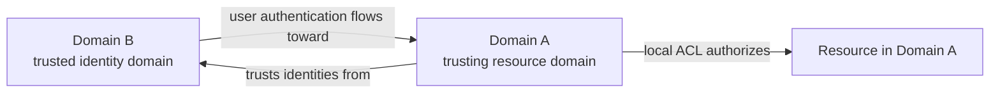
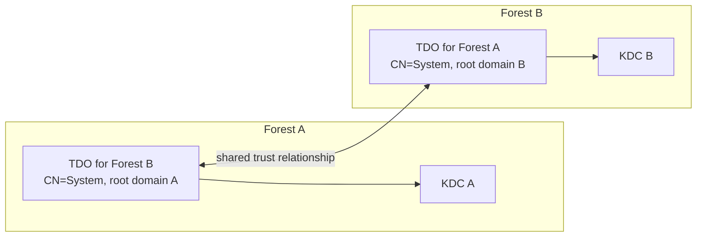
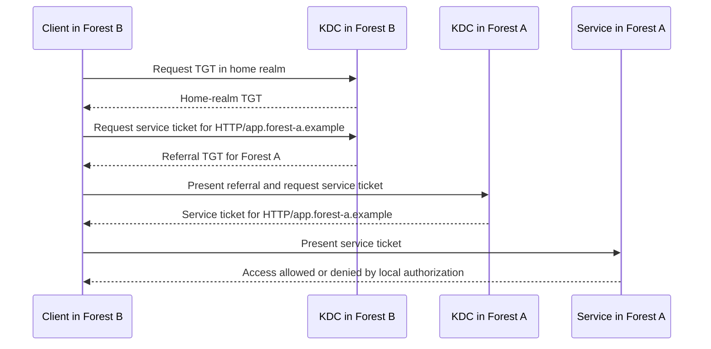
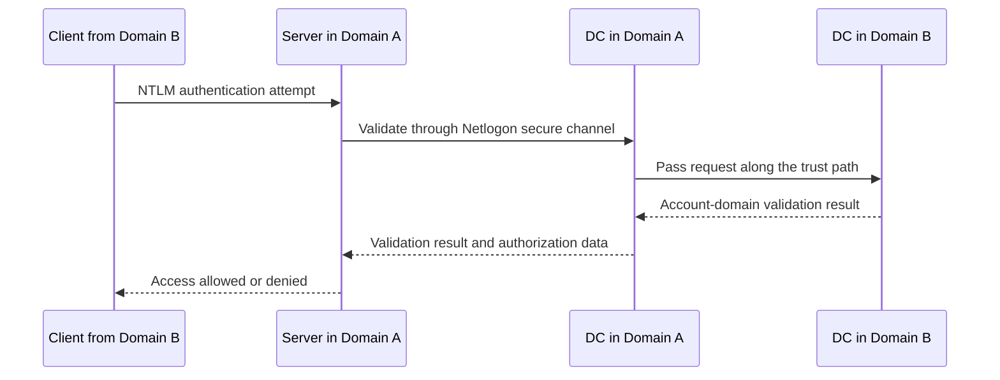

# Active Directory Trusts Explained: Types, Direction, Transitivity, TDOs and Authentication Flows

An Active Directory trust allows identities from one domain or forest to be authorized for resources in another. It does not grant access by itself. It establishes an authentication path; resource owners must still grant permissions, and security controls can restrict where foreign identities may authenticate.

> **TL;DR**
>
> - The **trusted** domain owns the identities. The **trusting** domain owns the resources and accepts authentication from the trusted side.
> - Trust direction and access direction are opposite: if domain A trusts domain B, users from B may be authorized for resources in A.
> - Parent-child and tree-root trusts are automatic, two-way and transitive inside a forest.
> - Forest trusts are transitive between forests through namespace routing; external trusts are narrow and nontransitive.
> - Kerberos crosses a trust through referral TGTs. NTLM uses pass-through authentication over Netlogon secure channels.
> - Each side stores its view of an explicit trust in a Trusted Domain Object (TDO). A healthy view on one side does not prove the other side is healthy.
> - `Get-ADTrust` inventories TDOs; it does not test DNS, network reachability, the remote TDO or a real application logon.

## 1. Authentication is not authorization

A trust answers this question:

> Can this domain accept an authentication statement issued by that domain?

It does not answer:

> Which files, servers or applications may the foreign identity use?

That second decision remains an authorization decision on the resource side. In a common pattern, administrators add a global group from the account domain to a domain-local group in the resource domain, then grant the domain-local group access to the resource.



If **A trusts B**, B is the **trusted domain** and A is the **trusting domain**. Subject to authorization and trust restrictions, B's identities can access A's resources. A's identities do not automatically gain access to B.

The words *incoming* and *outgoing* are easy to misread because tools present them from the local domain's perspective. In design documents and change requests, use an explicit sentence such as:

> `resources.corp.example` trusts identities from `accounts.partner.example`.

Also document the intended access direction. An arrow without a legend is not enough.

## 2. The trust dimensions

Every trust design combines several independent dimensions.

### 2.1 Direction

| Direction | Meaning |
|---|---|
| One-way | One domain accepts identities from the other; access is possible in one direction only |
| Two-way | Each domain accepts identities from the other; effectively two one-way trust directions |

Two-way does not mean that every user can access every resource. ACLs, user rights and selective authentication still apply.

### 2.2 Transitivity

A transitive trust can extend beyond the two directly connected domains according to its trust type and routing rules. A nontransitive trust applies only to the named domains.

Transitivity is not an instruction to create arbitrary chains. Authentication still needs a valid trust path, routable namespaces, reachable domain controllers and compatible security settings at every hop.

### 2.3 Scope and type

| Trust type | Creation | Transitivity | Typical scope |
|---|---|---:|---|
| Parent-child | Automatic when a child domain is created | Yes | Parent and child domains in one forest |
| Tree-root | Automatic when a new tree is created | Yes | Tree roots in one forest |
| Shortcut | Manual | Yes | Reduces a long authentication path between domains in one forest |
| Forest | Manual between forest roots | Yes, through routed forest namespaces | Forest-to-forest access |
| External | Manual | No | One domain to one domain, often for a narrow or legacy requirement |
| Realm | Manual | Configurable | AD domain to a non-Windows Kerberos realm |

Parent-child and tree-root trusts are two-way and transitive. Together they form the automatic trust topology inside a forest. Because all domains in one forest share the Schema and Configuration partitions and forest-wide administrators, separate domains are not independent security boundaries.

A **forest trust** connects two forest roots. It does not merge the directories, replicate their objects or create a shared Global Catalog. It allows authentication referrals for namespaces accepted by the trust.

An **external trust** is deliberately narrower. It connects exactly two domains and does not make either domain's other trust relationships transitive. Do not add external trusts between child domains as supposed shortcuts around an existing forest trust; overlapping paths create ambiguous behavior and a larger security surface.

## 3. Trusted Domain Objects

A domain stores its local representation of a trust as a `trustedDomain` object in:

```text
CN=System,<domain distinguished name>
```

This Trusted Domain Object contains the partner name, direction, type, attributes and trust-related key material. Important attributes and PowerShell projections include:

| LDAP or PowerShell value | Purpose |
|---|---|
| `trustPartner` / `Target` | DNS name of the trust partner |
| `flatName` | NetBIOS name of the partner |
| `trustDirection` / `Direction` | Inbound, outbound or bidirectional from the local TDO perspective |
| `trustType` / `TrustType` | Windows AD, MIT realm or legacy trust type |
| `trustAttributes` | Bitmask describing properties such as forest transitivity, within-forest status and quarantine |
| `msDS-TrustForestTrustInfo` | Forest-trust namespace-routing data |
| `msDS-SupportedEncryptionTypes` | Permitted Kerberos encryption types for referral tickets |
| `whenCreated`, `whenChanged` | Directory timestamps useful for context, not proof of a particular change |



For a two-way explicit trust, both sides maintain their own TDO view. Querying Forest A tells you what Forest A believes; it does not read Forest B's object. Audit both sides and compare them.

The trust secret is not a user password and must not be read or manipulated through low-level directory editors. Use supported trust-management tools to verify or reset it. For the encryption and key-material details, see [Hardening Kerberos Encryption on AD Trusts](../Hardening/RC4%20Hardening/Hardening%20Kerberos%20Encryption%20on%20AD%20Trusts/Hardening%20Kerberos%20Encryption%20on%20AD%20Trusts.md).

## 4. How Kerberos crosses a trust

Assume a user from Forest B accesses an HTTP service in Forest A:



The detailed flow is:

1. The client locates a DC in its account domain and obtains its normal TGT.
2. It asks its home KDC for a ticket to the target SPN.
3. The KDC recognizes that the SPN belongs to another trusted realm and returns a **referral TGT**.
4. The client locates a KDC in the target realm and presents the referral.
5. The target KDC validates the referral through the trust, applies SID and authorization-data rules, then issues the service ticket.
6. The target service validates that ticket and performs its own access check.

A multi-hop intra-forest path can produce several referrals. A forest trust normally gives a direct cross-forest referral when namespace routing identifies the destination forest.

Events 4768 and 4769 are generated on the KDCs that process the requests. A successful referral proves that Kerberos reached a KDC; it does not prove that the application ACL allowed access.

## 5. How NTLM crosses a trust

NTLM does not use Kerberos referral tickets. It relies on pass-through authentication:



The account domain remains authoritative for validating the credential. DCs and the resource server use Netlogon secure channels to pass the request along the trust path.

NTLM fallback can hide Kerberos defects. An application may appear functional while SPN registration, DNS or Kerberos encryption is broken. Monitor the authentication package and remove avoidable NTLM dependencies rather than treating fallback as a valid trust test.

## 6. Namespace routing in forest trusts

A forest trust uses forest-trust information to route names to the correct forest. Routed namespaces can include:

- DNS domain names;
- UPN suffixes;
- SPN suffixes;
- exclusions created to resolve namespace conflicts.

When both forests claim the same suffix, automatic routing cannot safely choose a destination. Administrators must resolve the collision or explicitly exclude a suffix. Common merger problems include duplicate UPN suffixes, stale domains, conflicting child-domain names and applications that construct SPNs from aliases.

Inspect forest-trust suffix routing with supported tools:

```powershell
$trustName = 'partner.example'

netdom.exe trust $env:USERDNSDOMAIN `
    /domain:$trustName `
    /namesuffixes
```

Do not automate `/ToggleSuffix` by a permanently stored number. Microsoft notes that entry ordering can change; list the suffixes immediately before any approved change and verify the selected entry.

DNS resolution and namespace routing are related but different. Routing can identify the correct forest while DNS still fails to locate its DCs. See [How Domain Controllers are Located Across Trusts](How%20Domain%20Controllers%20are%20Located%20Across%20Trusts.md) for the DC Locator path.

## 7. Foreign Security Principals

When a security principal from another forest is added to a domain-local group, Active Directory commonly creates a Foreign Security Principal (FSP) placeholder under `CN=ForeignSecurityPrincipals`. The object represents the foreign SID; it is not a copied user and contains no foreign password.

FSP lifecycle, orphan detection and safe cleanup are covered in [What are FSPs - Audit and Manage them in AD](What%20are%20FSPs%20-%20Audit%20and%20Manage%20them%20in%20AD.md).

## 8. Inventory the local trust view

The following read-only inventory exposes the most useful `Get-ADTrust` projections:

```powershell
Import-Module ActiveDirectory

$trusts = Get-ADTrust `
    -Filter * `
    -Properties whenCreated,
                whenChanged,
                trustAttributes,
                'msDS-SupportedEncryptionTypes'

$trusts | ForEach-Object {
    [pscustomobject]@{
        Name                       = $_.Name
        Source                     = $_.Source
        Target                     = $_.Target
        Direction                  = $_.Direction
        TrustType                  = $_.TrustType
        IntraForest                = $_.IntraForest
        ForestTransitive           = $_.ForestTransitive
        SelectiveAuthentication    = $_.SelectiveAuthentication
        SIDFilteringForestAware    = $_.SIDFilteringForestAware
        SIDFilteringQuarantined    = $_.SIDFilteringQuarantined
        TGTDelegation              = $_.TGTDelegation
        TrustAttributes            = $_.trustAttributes
        SupportedEncryptionTypes   = $_.'msDS-SupportedEncryptionTypes'
        Created                    = $_.whenCreated
        Changed                    = $_.whenChanged
        DistinguishedName          = $_.DistinguishedName
    }
} | Sort-Object IntraForest, Target
```

Interpret every row from the `Source` domain's perspective. `whenChanged` is not a reliable trust-password age field: many unrelated attribute changes update it, and a secret operation is not fully described by this timestamp.

Querying each domain explicitly prevents the current logon domain from silently defining the whole scope:

```powershell
$forest = Get-ADForest

$inventory = foreach ($domainName in $forest.Domains) {
    try {
        Get-ADTrust `
            -Filter * `
            -Server $domainName `
            -Properties trustAttributes,
                        'msDS-SupportedEncryptionTypes' `
            -ErrorAction Stop |
            Select-Object @{Name='QueriedDomain'; Expression={$domainName}},
                          Name,
                          Source,
                          Target,
                          Direction,
                          TrustType,
                          IntraForest,
                          ForestTransitive,
                          SelectiveAuthentication,
                          SIDFilteringForestAware,
                          SIDFilteringQuarantined,
                          TGTDelegation,
                          trustAttributes,
                          'msDS-SupportedEncryptionTypes',
                          DistinguishedName
    } catch {
        [pscustomobject]@{
            QueriedDomain = $domainName
            Name          = $null
            Source        = $null
            Target        = $null
            Direction     = $null
            TrustType     = $null
            IntraForest   = $null
            Error         = $_.Exception.Message
        }
    }
}

$inventory | Sort-Object QueriedDomain, Target
```

An inventory is not a health test. It does not prove that:

- the remote TDO matches;
- DNS can locate remote DCs;
- required ports are reachable in both directions;
- the trust secure-channel secrets agree;
- Kerberos succeeds for a real SPN;
- selective-authentication ACEs permit the intended server;
- the application grants access.

## 9. Design rules

1. Use one forest unless a genuine security, service-isolation or administrative boundary requires another.
2. Create the minimum trust scope and direction required by the business flow.
3. Prefer one forest trust over overlapping forest and external trust paths.
4. Document the trusting side, trusted side, resource flow, owners and expiry or review date.
5. Keep SID filtering enabled except during a tightly controlled migration requirement.
6. Use selective authentication for partner, merger and shared-service scenarios where forest-wide authentication is unnecessary.
7. Keep cross-trust TGT delegation disabled; redesign applications around constrained delegation where required.
8. Harden Kerberos encryption on both TDOs and validate it on the wire.
9. Treat DNS, time, firewall and DC reachability as trust dependencies.
10. Audit both sides because a trust is a bilateral security configuration.

The broader architectural placement of trusts is summarized in [Active Directory Design Guidelines](Active%20Directory%20Design%20Guidelines%20%28Architecture%20Overview%29.md).

## 10. Common misconceptions

| Misconception | Correct model |
|---|---|
| A trust grants access | A trust enables authentication; ACLs and user rights grant access |
| Trust direction equals access direction | Identity access flows opposite to the statement "A trusts B" |
| Two-way means unrestricted | It means two authentication directions; controls still apply |
| Forest trust replicates users | No objects or passwords are copied by the trust |
| Forest trust routes every suffix automatically | Conflicts and exclusions can disable individual namespace routes |
| `Get-ADTrust` proves the trust works | It reads the local TDO only |
| Successful NTLM proves Kerberos works | NTLM fallback can mask Kerberos defects |
| A second external trust is a shortcut trust | Shortcut trusts are intra-forest; overlapping inter-forest paths are a design smell |

## References

- [Get-ADTrust](https://learn.microsoft.com/en-us/powershell/module/activedirectory/get-adtrust)
- [Netdom trust](https://learn.microsoft.com/en-us/windows-server/administration/windows-commands/netdom-trust)
- [Forest design models](https://learn.microsoft.com/en-us/windows-server/identity/ad-ds/plan/forest-design-models)
- [Active Directory security groups](https://learn.microsoft.com/en-us/windows-server/identity/ad-ds/manage/understand-security-groups)
- [How Domain and Forest Trusts Work](https://learn.microsoft.com/en-us/previous-versions/windows/it-pro/windows-server-2003/cc773178(v=ws.10))
- [Active Directory Design Guidelines](Active%20Directory%20Design%20Guidelines%20%28Architecture%20Overview%29.md)
- [How Domain Controllers are Located Across Trusts](How%20Domain%20Controllers%20are%20Located%20Across%20Trusts.md)
- [What are FSPs - Audit and Manage them in AD](What%20are%20FSPs%20-%20Audit%20and%20Manage%20them%20in%20AD.md)
- [Hardening Kerberos Encryption on AD Trusts](../Hardening/RC4%20Hardening/Hardening%20Kerberos%20Encryption%20on%20AD%20Trusts/Hardening%20Kerberos%20Encryption%20on%20AD%20Trusts.md)
