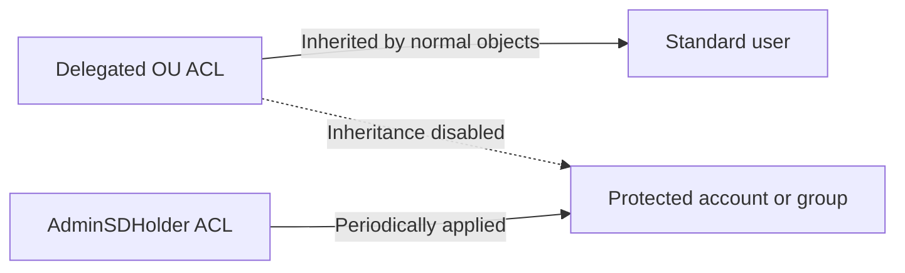

# AdminSDHolder and SDProp: Protected Accounts, adminCount and Safe Cleanup

Active Directory protects highly privileged accounts and groups from delegated administrators by applying a controlled security descriptor. This protection is essential, but its side effects often appear later as broken OU delegation, disabled inheritance and apparently orphaned `adminCount=1` values.

> **TL;DR**
>
> - `CN=AdminSDHolder,CN=System,<domain DN>` is the ACL template for protected objects.
> - The PDC Emulator periodically reapplies that template and disables inheritance on protected accounts and groups.
> - Nested membership in a protected group can trigger protection.
> - `adminCount=1` is useful evidence, but it is not a live membership flag.
> - Removing an account from a privileged group does not automatically restore its inherited permissions.
> - Never bulk-clear `adminCount` or enable inheritance before proving that each object is no longer protected.

## 1. Why the mechanism exists

OU delegation is inherited. Without an exception, an operator who controls an OU containing a Domain Admin account could reset that account's password, change its attributes or rewrite its ACL. AdminSDHolder creates that exception for the directory's most privileged identities.



The mechanism separates two administrative planes:

- data administrators can manage ordinary objects through OU delegation;
- service administrators retain control over protected identities through the AdminSDHolder template.

This is not a complete Tier 0 model. It is one defensive control inside it. Account separation, privileged workstations, logon restrictions and just-in-time membership remain necessary; see [Active Directory Tiering Model for On-Premises Environments](Active%20Directory%20Tiering%20Model%20for%20On-Prem%20Environment.md).

## 2. The three moving parts

### 2.1 AdminSDHolder

Each domain has its own template object:

```text
CN=AdminSDHolder,CN=System,DC=contoso,DC=com
```

Its discretionary ACL becomes the reference ACL for protected accounts and groups in that domain. Changing this ACL is therefore a domain-wide privileged change, not a fix for one user.

### 2.2 The protected-object process

The PDC Emulator runs the protected-object task periodically, normally every 60 minutes. For an object that is currently protected, the process:

1. compares its security descriptor with the AdminSDHolder template;
2. applies the protected ACL when required;
3. disables ACL inheritance on the object;
4. sets `adminCount` to `1`.

Editing the ACL directly on a currently protected user is temporary. The next cycle can overwrite the edit.

### 2.3 Protected groups and transitive membership

Protection is driven by membership in built-in administrative groups and can follow nested membership. The exact protected set depends on the operating system and domain history; current Microsoft documentation identifies protection per default group.

Common protected groups include:

- Administrators;
- Domain Admins;
- Enterprise Admins and Schema Admins in the forest root domain;
- Account Operators, Server Operators, Print Operators and Backup Operators;
- Domain Controllers and Read-only Domain Controllers;
- Key Admins and Enterprise Key Admins;
- Replicator.

The built-in Administrator and `krbtgt` accounts also receive protection. Do not maintain a hard-coded group list as the only audit source; verify the current Microsoft group reference and the actual ACL state in each domain.

## 3. What adminCount does and does not prove

`adminCount=1` means that the object has been processed as protected. It does **not** prove that the object is still a member of a protected group.

| Observation | Safe conclusion |
|---|---|
| `adminCount=1`, inheritance disabled, privileged membership present | Object is expected to be protected |
| `adminCount=1`, no obvious direct privileged membership | Investigate nested membership before cleanup |
| `adminCount=1`, no privileged path, inheritance disabled | Likely stale protection state; candidate for reviewed cleanup |
| `adminCount` absent or `0` | Not proof that the ACL is healthy or that the identity is unprivileged |

When an account leaves the protected set, Active Directory does not automatically restore its old inherited ACL. The stale state is intentional: automatically enabling inheritance could unexpectedly expose a formerly privileged object to delegated operators.

## 4. Why delegation appears to fail

A typical failure follows this sequence:

1. A support team receives Reset Password permission on an OU.
2. A user in that OU becomes a member of Domain Admins.
3. The protection task disables inheritance and stamps the protected ACL.
4. The user later leaves Domain Admins.
5. The help desk still cannot reset that user's password because inheritance remains disabled.

Moving the account to another OU does not repair it. Adding the delegation again to the parent OU does not repair it either. The object's security descriptor must be reviewed after all privileged membership paths have been removed.

## 5. Audit before changing anything

Run the audit with an account that can read directory security descriptors. Start by locating the PDC Emulator and the AdminSDHolder object:

```powershell
Import-Module ActiveDirectory

$domain = Get-ADDomain
$pdc = $domain.PDCEmulator
$adminSDHolderDn = "CN=AdminSDHolder,CN=System,$($domain.DistinguishedName)"

[pscustomobject]@{
    Domain            = $domain.DNSRoot
    PDCEmulator       = $pdc
    AdminSDHolder     = $adminSDHolderDn
}
```

Inventory users and groups marked with `adminCount=1`:

```powershell
$properties = 'adminCount', 'nTSecurityDescriptor', 'memberOf', 'whenChanged'

$candidates = Get-ADObject `
    -LDAPFilter '(|(&(objectCategory=person)(objectClass=user)(adminCount=1))(&(objectCategory=group)(adminCount=1)))' `
    -Properties $properties

$candidates | ForEach-Object {
    [pscustomobject]@{
        Name                = $_.Name
        ObjectClass         = $_.ObjectClass
        DistinguishedName   = $_.DistinguishedName
        AdminCount          = $_.adminCount
        InheritanceDisabled = $_.nTSecurityDescriptor.AreAccessRulesProtected
        WhenChanged         = $_.whenChanged
    }
} | Sort-Object ObjectClass, Name
```

`AreAccessRulesProtected = True` means ACL inheritance is disabled. The result is an investigation queue, not a cleanup list.

### Check direct and nested membership

For a candidate user, inspect its complete authorization-group expansion:

```powershell
$identity = 'alice.admin'

Get-ADAccountAuthorizationGroup -Identity $identity |
    Select-Object Name, DistinguishedName |
    Sort-Object Name
```

Also examine group nesting from the privileged-group side:

```powershell
$privilegedGroups = @(
    'Administrators',
    'Domain Admins',
    'Enterprise Admins',
    'Schema Admins',
    'Account Operators',
    'Server Operators',
    'Print Operators',
    'Backup Operators'
)

foreach ($groupName in $privilegedGroups) {
    $group = Get-ADGroup -Identity $groupName -ErrorAction SilentlyContinue
    if (-not $group) {
        continue
    }

    Get-ADGroupMember -Identity $group -Recursive |
        Select-Object @{Name='ProtectedGroup'; Expression={$group.Name}},
                      Name,
                      ObjectClass,
                      DistinguishedName
}
```

This list is a practical starting point, not an authoritative reimplementation of the operating system's protected-set logic. Include organization-specific Tier 0 groups in the review even though custom groups do not automatically trigger AdminSDHolder.

## 6. Protect the template itself

Export the AdminSDHolder ACL before any approved modification:

```powershell
$domainDn = (Get-ADDomain).DistinguishedName
$adminSDHolderPath = "AD:\CN=AdminSDHolder,CN=System,$domainDn"
$backupPath = Join-Path $env:TEMP 'AdminSDHolder-Acl.xml'

Get-Acl -Path $adminSDHolderPath |
    Export-Clixml -Path $backupPath

Get-Acl -Path $adminSDHolderPath |
    Select-Object Owner, Sddl
```

Review nonstandard principals and powerful rights such as `GenericAll`, `WriteDacl`, `WriteOwner`, extended password-reset rights and write access to group membership. An unexpected ACE on AdminSDHolder is a Tier 0 finding because it can be propagated to every protected identity.

Do not customize AdminSDHolder merely to make help-desk delegation work on privileged users. Keep privileged identities in dedicated administrative OUs and delegate ordinary identities separately.

## 7. Safe cleanup workflow

Only clean a candidate after proving all of the following:

- it is no longer directly or transitively in a protected group;
- no scheduled process will add it back;
- its intended OU ACL has been reviewed;
- its existing explicit ACEs and owner have been exported;
- the identity owner has approved restoration of inheritance.

Back up the candidate's descriptor:

```powershell
$identity = 'alice.formeradmin'
$candidate = Get-ADUser -Identity $identity -Properties adminCount
$adPath = "AD:\$($candidate.DistinguishedName)"
$backupPath = Join-Path $env:TEMP "$($candidate.SamAccountName)-Acl.xml"

Get-Acl -Path $adPath | Export-Clixml -Path $backupPath
Get-Acl -Path $adPath | Select-Object Owner, Sddl
```

Preview clearing the marker:

```powershell
Set-ADObject `
    -Identity $candidate.DistinguishedName `
    -Clear adminCount `
    -WhatIf
```

After change approval, enable inheritance with the directory ACL tool and clear the stale marker:

```powershell
dsacls.exe $candidate.DistinguishedName /P:N

Set-ADObject `
    -Identity $candidate.DistinguishedName `
    -Clear adminCount
```

`dsacls /P:N` enables inherited permissions; it does not mean "remove all explicit permissions." Review the resulting ACL instead of assuming the parent OU is correct.

Validate the object immediately and again after more than one protection interval:

```powershell
$validated = Get-ADUser `
    -Identity $candidate.DistinguishedName `
    -Properties adminCount, nTSecurityDescriptor

[pscustomobject]@{
    SamAccountName      = $validated.SamAccountName
    AdminCount          = $validated.adminCount
    InheritanceDisabled = $validated.nTSecurityDescriptor.AreAccessRulesProtected
}
```

If protection returns, stop. The object still has a protected membership path or an automation process restored one. Repeatedly clearing the state hides the cause.

## 8. Forcing the process is rarely necessary

Microsoft documents a RootDSE operation for triggering the protected-object check. It is useful in controlled troubleshooting, but normal administration should not depend on forcing it. Waiting for the scheduled process is safer and proves that the final state remains stable.

Never lower the protection interval to make a cleanup project finish faster. That increases directory work and does not replace correct membership analysis.

## 9. Monitoring recommendations

Monitor changes to:

- the AdminSDHolder security descriptor;
- privileged group membership;
- `adminCount` on privileged identities;
- ownership and ACLs on the domain root and Tier 0 OUs;
- accounts unexpectedly regaining disabled inheritance.

Use Advanced Audit Policy and an explicit SACL on high-value directory objects, then forward DC Security logs to a collector that administrators of the monitored domain cannot erase. Periodically compare the AdminSDHolder SDDL with an approved baseline.

## 10. Common mistakes

| Mistake | Why it fails |
|---|---|
| Clearing every `adminCount=1` value | Some objects are still legitimately protected |
| Treating `adminCount=1` as current membership | The value can remain after membership ends |
| Editing a protected user's ACL directly | The protected-object process can overwrite it |
| Moving the user to another OU | Moving does not enable inheritance |
| Delegating help-desk rights through AdminSDHolder | Extends those rights to every protected object |
| Excluding built-in groups through `dsHeuristics` as a shortcut | Weakens a security boundary and creates difficult-to-audit behavior |
| Running cleanup only once | Nested membership or automation can restore protection later |

## References

- [Active Directory Security Groups](https://learn.microsoft.com/en-us/windows-server/identity/ad-ds/manage/understand-security-groups)
- [Appendix C: Protected Accounts and Groups in Active Directory](https://learn.microsoft.com/en-us/windows-server/identity/ad-ds/plan/security-best-practices/appendix-c--protected-accounts-and-groups-in-active-directory)
- [AdminCount attribute](https://learn.microsoft.com/en-us/windows/win32/adschema/a-admincount)
- [Get-ADAccountAuthorizationGroup](https://learn.microsoft.com/en-us/powershell/module/activedirectory/get-adaccountauthorizationgroup)
- [DSACLs](https://learn.microsoft.com/en-us/previous-versions/windows/it-pro/windows-server-2012-r2-and-2012/cc771151(v=ws.11))
- [Active Directory Tiering Model for On-Premises Environments](Active%20Directory%20Tiering%20Model%20for%20On-Prem%20Environment.md)