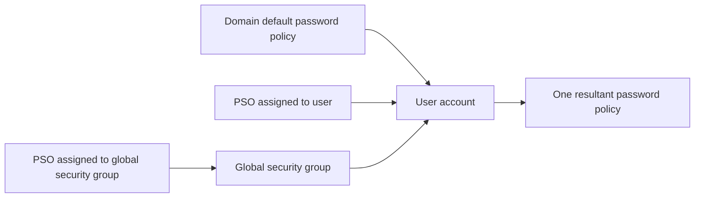
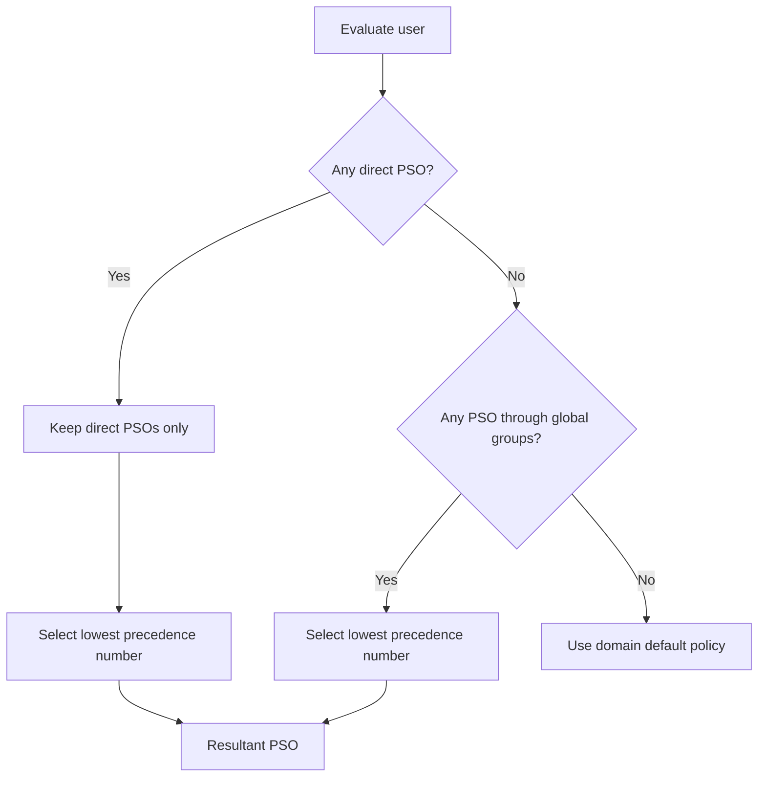

# Fine-Grained Password Policies: Precedence, Scope and Resultant Policy

Fine-Grained Password Policies (FGPPs) let one Active Directory domain enforce different password and account-lockout policies for different users. They are stored as Password Settings Objects (PSOs) in Active Directory, not as Group Policy Objects, and their precedence rules are often misunderstood.

> **TL;DR**
>
> - A PSO can apply directly to a user or to a **global security group**.
> - PSOs cannot be linked to an OU, computer, distribution group or another domain.
> - A directly assigned PSO wins over PSOs inherited through group membership.
> - Among candidates at the same assignment level, the **lowest precedence number wins**.
> - Always query the resultant policy for a user; do not infer it from one group membership.

## 1. FGPP is not Group Policy

The domain's default password and account-lockout policy comes from the domain-level account policy, normally maintained in the Default Domain Policy. An FGPP is different: it is an `msDS-PasswordSettings` object under:

```text
CN=Password Settings Container,CN=System,<domain distinguished name>
```



Key boundaries:

- PSOs configure password and account-lockout policy only.
- They do not contain Administrative Template, audit, user-right or device settings.
- They replicate as AD objects, not through SYSVOL.
- They are not visible as GPO links in GPMC or `gpresult`.
- They affect domain user accounts, not local accounts on member computers.

Current Microsoft guidance requires a Windows Server 2012 or later domain functional level for the supported ADAC/PowerShell workflow. Windows Server 2022 and Windows Server 2025 support the same PSO model.

## 2. What a PSO contains

| PowerShell property | AD attribute | Purpose |
|---|---|---|
| `Precedence` | `msDS-PasswordSettingsPrecedence` | Resolves competing PSOs; lower wins |
| `MinPasswordLength` | `msDS-MinimumPasswordLength` | Minimum password length |
| `PasswordHistoryCount` | `msDS-PasswordHistoryLength` | Number of previous passwords retained |
| `MinPasswordAge` | `msDS-MinimumPasswordAge` | Minimum time before another password change |
| `MaxPasswordAge` | `msDS-MaximumPasswordAge` | Maximum password lifetime |
| `ComplexityEnabled` | `msDS-PasswordComplexityEnabled` | Enables Windows password complexity rules |
| `ReversibleEncryptionEnabled` | `msDS-PasswordReversibleEncryptionEnabled` | Controls reversible password storage |
| `LockoutThreshold` | `msDS-LockoutThreshold` | Failed attempts before lockout |
| `LockoutObservationWindow` | `msDS-LockoutObservationWindow` | Window for resetting the failed-attempt counter |
| `LockoutDuration` | `msDS-LockoutDuration` | Automatic lockout duration; zero requires manual unlock |
| `AppliesTo` | `msDS-PSOAppliesTo` | Direct user and global-group subjects |

FGPP does not provide modern banned-password or password-risk detection by itself. Microsoft Entra Password Protection for on-premises AD DS complements classic password policy by rejecting known weak terms and custom banned words.

## 3. Scope rules

A PSO can be assigned to:

- an individual user;
- a global security group in the same domain.

It cannot be assigned directly to:

- an OU;
- a computer;
- a distribution group;
- a domain local or universal group;
- a group or user in another domain.

Use dedicated global security groups such as `GG-PasswordPolicy-Privileged` instead of assigning PSOs directly to many users. Group-based assignment makes ownership and review clearer. Reserve direct assignment for explicit exceptions because direct PSOs outrank every group-derived PSO.

## 4. Resultant-policy algorithm

Active Directory selects one resultant PSO for each user:

1. Find PSOs assigned directly to the user.
2. If one or more direct PSOs exist, discard all group-derived candidates.
3. From the direct candidates, select the lowest `Precedence` value.
4. If no direct PSO exists, find PSOs applying through the user's global security groups.
5. Select the group-derived PSO with the lowest `Precedence` value.
6. If no PSO applies, use the domain default password policy.



Precedence is priority, not strength. Active Directory does not merge the strictest properties from several PSOs. A PSO with precedence `100` wins over one with `200` even if some of its settings are less restrictive.

Leave gaps between precedence values, for example `100`, `200` and `300`, so a future policy can be inserted without renumbering existing PSOs. The Active Directory PowerShell cmdlet rejects a precedence value already used by another PSO.

## 5. Create a PSO with PowerShell

The following is an example policy, not a universal baseline. Align password age, length and lockout settings with the organization's authentication architecture and recovery process.

```powershell
Import-Module ActiveDirectory

$policyParameters = @{
    Name                           = 'PSO-Privileged-Accounts'
    DisplayName                    = 'Privileged account password policy'
    Description                    = 'Example PSO for the privileged account population.'
    Precedence                     = 100
    MinPasswordLength              = 16
    PasswordHistoryCount           = 24
    MinPasswordAge                 = New-TimeSpan -Days 1
    MaxPasswordAge                 = New-TimeSpan -Days 180
    ComplexityEnabled              = $true
    ReversibleEncryptionEnabled    = $false
    LockoutThreshold               = 10
    LockoutObservationWindow       = New-TimeSpan -Minutes 15
    LockoutDuration                = New-TimeSpan -Minutes 15
    ProtectedFromAccidentalDeletion = $true
}

New-ADFineGrainedPasswordPolicy @policyParameters
```

Assign it to a global security group:

```powershell
$policyName = 'PSO-Privileged-Accounts'
$subject = Get-ADGroup -Identity 'GG-PasswordPolicy-Privileged'

if ($subject.GroupCategory -ne 'Security' -or $subject.GroupScope -ne 'Global') {
    throw 'The FGPP subject must be a global security group.'
}

Add-ADFineGrainedPasswordPolicySubject `
    -Identity $policyName `
    -Subjects $subject
```

Use a writable domain controller. The creation and assignment cmdlets do not work against a read-only domain controller.

## 6. Create and review with ADAC

Active Directory Administrative Center (ADAC) provides the supported graphical interface:

1. Run `dsac.exe`.
2. Open the target domain.
3. Navigate to **System** > **Password Settings Container**.
4. Select **New** > **Password Settings**.
5. Configure all password, lockout, precedence and subject fields.
6. Enable protection from accidental deletion.

ADAC's **Windows PowerShell History** pane shows the cmdlets generated by GUI actions. Use that history as a starting point for reviewed automation rather than repeating production changes manually.

## 7. Query the resultant policy

Never decide which policy applies by comparing only the PSOs visible on one group. Ask Active Directory for the resultant policy:

```powershell
$user = Get-ADUser -Identity 'ada.lovelace'
$resultantPolicy = Get-ADUserResultantPasswordPolicy -Identity $user

if ($null -eq $resultantPolicy) {
    Get-ADDefaultDomainPasswordPolicy
} else {
    $resultantPolicy | Select-Object Name, Precedence,
        MinPasswordLength, PasswordHistoryCount,
        MinPasswordAge, MaxPasswordAge,
        ComplexityEnabled, ReversibleEncryptionEnabled,
        LockoutThreshold, LockoutObservationWindow, LockoutDuration
}
```

`Get-ADUserResultantPasswordPolicy` reads the constructed `msDS-ResultantPSO` attribute. If it returns no PSO, the domain default policy applies.

Pin all comparison commands to one writable DC when validating a recent change, then test another DC after replication:

```powershell
$domain = Get-ADDomain
$pdc = $domain.PDCEmulator

Get-ADUserResultantPasswordPolicy `
    -Identity 'ada.lovelace' `
    -Server $pdc
```

This avoids mistaking normal replication convergence for a precedence error.

### 7.1 Read the account's computed password expiry

The constructed [`msDS-UserPasswordExpiryTimeComputed` attribute](https://learn.microsoft.com/en-us/windows/win32/adschema/a-msds-userpasswordexpirytimecomputed) reports the account's calculated password expiry from the queried DC. Prefer it to blindly adding the domain default maximum age to `pwdLastSet`: the resultant PSO and account flags can change the result.

| Raw value | Interpretation |
|---|---|
| Not returned | Unknown in this observation; do not convert it to zero |
| `0` | The computed result reflects a password-change-required state, such as `pwdLastSet = 0`; not a date in 1601 |
| `9223372036854775807` | No finite password-expiry date is reported by this computation |
| A valid positive Windows FILETIME | A finite expiry instant; convert explicitly to UTC |
| Negative or out-of-range value | Invalid input; do not invent an expiry date |

"No finite computed expiry" is not synonymous with "this account can always log on." Account expiry, disablement, smart-card requirements, lockout and other authentication restrictions remain separate. See [Understanding UserAccountControl](Understanding%20UserAccountControl%20-%20Flags,%20Computed%20State%20and%20Safe%20Changes.md).

```powershell
function Convert-ADPasswordExpiry {
    [CmdletBinding()]
    param(
        [Parameter(Mandatory)]
        [AllowNull()]
        [Nullable[long]]$FileTime
    )

    $state = 'NotReturned'
    $expiresUtc = $null
    if ($null -ne $FileTime) {
        if ($FileTime -eq 0) {
            $state = 'PasswordChangeRequired'
        } elseif ($FileTime -eq [long]::MaxValue) {
            $state = 'NoComputedExpiry'
        } elseif ($FileTime -lt 0) {
            $state = 'InvalidValue'
        } else {
            try {
                $expiresUtc = [datetime]::FromFileTimeUtc([long]$FileTime)
                $state = 'FiniteExpiry'
            } catch [ArgumentOutOfRangeException] {
                $state = 'InvalidValue'
            }
        }
    }

    [pscustomobject]@{
        RawFileTime = $FileTime
        State = $state
        ExpiresUtc = $expiresUtc
    }
}
```

Query a bounded population from one DC without casting an absent attribute to an integer first:

```powershell
$domainController = 'dc01.corp.example'
$observedUtc = [datetime]::UtcNow
$users = Get-ADUser -Filter { Enabled -eq $true } `
    -SearchBase 'OU=Users,DC=corp,DC=example' -SearchScope Subtree `
    -Server $domainController -Properties 'msDS-UserPasswordExpiryTimeComputed',
        PasswordNeverExpires, SmartcardLogonRequired -ErrorAction Stop

foreach ($account in $users) {
    $expiry = Convert-ADPasswordExpiry -FileTime $account.'msDS-UserPasswordExpiryTimeComputed'
    [pscustomobject]@{
        User = $account.SamAccountName
        ObjectGUID = $account.ObjectGUID
        SourceDC = $domainController
        ObservedUtc = $observedUtc
        ExpiryState = $expiry.State
        ExpiresUtc = $expiry.ExpiresUtc
        PasswordNeverExpires = $account.PasswordNeverExpires
        SmartcardLogonRequired = $account.SmartcardLogonRequired
    }
}
```

Do not automatically reset passwords or rewrite `PasswordNeverExpires` from this report. Validate unexpected results against the account flags, `pwdLastSet`, resultant policy and another DC after replication. A notification system should retain the observation time and distinguish a finite expiry from an unknown result.

## 8. Inventory every PSO and subject

```powershell
$policies = Get-ADFineGrainedPasswordPolicy -Filter * |
    Sort-Object Precedence

foreach ($policy in $policies) {
    $subjects = Get-ADFineGrainedPasswordPolicySubject -Identity $policy

    [pscustomobject]@{
        Name              = $policy.Name
        Precedence        = $policy.Precedence
        MinPasswordLength = $policy.MinPasswordLength
        MaxPasswordAge    = $policy.MaxPasswordAge
        LockoutThreshold  = $policy.LockoutThreshold
        Subjects          = ($subjects.DistinguishedName -join '; ')
    }
}
```

Review the output for:

- direct user assignments that bypass the group design;
- overlapping groups whose members receive an unexpected lower-numbered PSO;
- policies with no subjects;
- reversible encryption;
- inconsistent lockout duration and observation windows;
- descriptions that do not identify owner, purpose and review date.

## 9. Audit a population's effective policy

Resultant-policy calculation for every user can be expensive in a large domain. Start with the managed population or process users in controlled batches.

```powershell
$group = Get-ADGroup -Identity 'GG-PasswordPolicy-Privileged'
$users = Get-ADGroupMember -Identity $group -Recursive |
    Where-Object objectClass -eq 'user' |
    Get-ADUser

$results = foreach ($user in $users) {
    $policy = Get-ADUserResultantPasswordPolicy `
        -Identity $user `
        -ErrorAction SilentlyContinue

    [pscustomobject]@{
        UserPrincipalName = $user.UserPrincipalName
        ResultantPolicy   = if ($policy) { $policy.Name } else { '<Domain default>' }
        Precedence        = if ($policy) { $policy.Precedence } else { $null }
    }
}

$results | Sort-Object ResultantPolicy, UserPrincipalName
```

Treat an unexpected domain-default result as a scope problem, not as evidence that FGPP is unavailable. Verify group category, group scope, membership, replication and the PSO's `AppliesTo` values.

## 10. Roll out without locking out the organization

Changing PSO assignment changes the policy used for subsequent password and lockout evaluations. A shorter maximum password age can make an existing password immediately due for change based on `pwdLastSet`.

A controlled rollout should:

1. Inventory current resultant policies and password ages.
2. Model overlap between direct assignments and global groups.
3. Test with noncritical accounts on the target domain functional level.
4. Verify help-desk unlock and password-reset procedures.
5. Add a small pilot group and wait for AD replication.
6. Query the resultant PSO from more than one writable DC.
7. Expand membership in measured batches.
8. Monitor lockouts, reset failures and support volume.

Do not use an aggressively low lockout threshold as a substitute for multifactor authentication, risk detection or monitoring. It can turn password spraying into a denial-of-service event.

## 11. Common mistakes

| Mistake | Actual behavior |
|---|---|
| Linking a PSO to an OU | Unsupported; PSOs apply to users or global security groups |
| Assuming the strictest properties are merged | One entire PSO wins |
| Assuming the smallest number always wins globally | Direct assignments are evaluated before group assignments |
| Looking for FGPP in `gpresult` | PSOs are AD objects, not GPOs |
| Applying a PSO to a universal group | Unsupported scope for `msDS-PSOAppliesTo` |
| Querying immediately through any DC | Replication latency can show the previous resultant policy |
| Editing with ADSI Edit | Bypasses the validation and safety of ADAC/PowerShell |
| Deleting the Default Domain Policy | Does not remove PSOs and damages unrelated domain policy |

## 12. Historical source-note captures

The original notes captured both generations of administration. They are retained in source order for historical context; the UI, domain name and example values are illustrative and must not be copied as a security baseline.

### 12.1 Creating a Password Settings object with ADSI Edit


Early FGPP procedures commonly used ADSI Edit because Windows Server 2008 did not provide the later ADAC workflow. ADSI Edit remains a low-level editor, not the recommended creation method.

### 12.2 Creating Password Settings with ADAC


ADAC exposes policy values and direct subjects in one validated interface. Current Windows Server releases retain this management model, alongside the Active Directory PowerShell module.

## References

- [Configure fine-grained password policies for AD DS](https://learn.microsoft.com/en-us/windows-server/identity/ad-ds/get-started/adac/fine-grained-password-policies)
- [New-ADFineGrainedPasswordPolicy](https://learn.microsoft.com/en-us/powershell/module/activedirectory/new-adfinegrainedpasswordpolicy)
- [Add-ADFineGrainedPasswordPolicySubject](https://learn.microsoft.com/en-us/powershell/module/activedirectory/add-adfinegrainedpasswordpolicysubject)
- [Get-ADUserResultantPasswordPolicy](https://learn.microsoft.com/en-us/powershell/module/activedirectory/get-aduserresultantpasswordpolicy)
- [Get-ADFineGrainedPasswordPolicySubject](https://learn.microsoft.com/en-us/powershell/module/activedirectory/get-adfinegrainedpasswordpolicysubject)
- [Microsoft Entra Password Protection for on-premises AD DS](https://learn.microsoft.com/en-us/entra/identity/authentication/concept-password-ban-bad-on-premises)