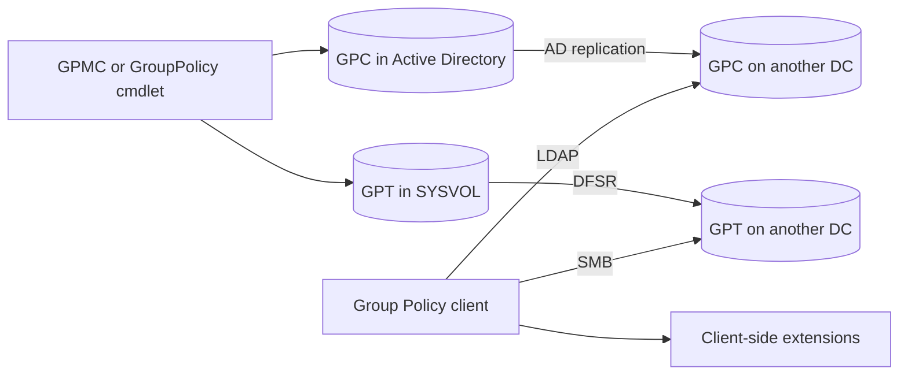
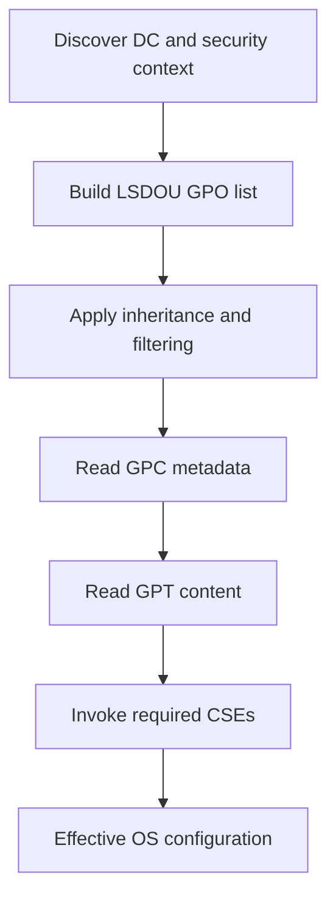

# Group Policy Internals: GPC, GPT, Version Numbers and Client-Side Extensions

A Group Policy Object is a distributed contract between Active Directory, SYSVOL and the client-side extensions that materialize settings. Understanding those boundaries explains why a GPO can exist in GPMC, appear in `gpresult`, and still fail to configure the operating system.

> **TL;DR**
>
> - A domain GPO has two coordinated halves: the **Group Policy Container** in Active Directory and the **Group Policy Template** in SYSVOL.
> - The GPC replicates through AD replication; the GPT replicates through DFSR in supported modern domains.
> - The 32-bit version value contains the **user version in the high 16 bits** and the **computer version in the low 16 bits**.
> - Administrative Templates describe registry policy settings; they are not copied into every modern GPO.
> - The Group Policy service builds the applicable GPO list, then invokes the relevant client-side extensions (CSEs).

## 1. One GPO, two replicated components

| Component | Location | Main contents | Replication engine |
|---|---|---|---|
| Group Policy Container (GPC) | `CN={GUID},CN=Policies,CN=System,<domain DN>` | Identity, status, versions, extensions, ACL, WMI filter reference | Active Directory replication |
| Group Policy Template (GPT) | `\\<domain>\SYSVOL\<domain>\Policies\{GUID}` | `gpt.ini`, `Registry.pol`, scripts, security templates and preference XML | DFSR |

The same GPO GUID binds the two components together. The GPC attribute `gPCFileSysPath` tells clients where to find the GPT.



This split is why “AD replication is healthy” is not sufficient evidence that Group Policy is healthy. The GPC can converge while its corresponding GPT is missing or stale on one domain controller.

> FRS was historically used for SYSVOL, but supported modern deployments should use DFSR. Do not design new diagnostics or recovery procedures around FRS-era assumptions.

## 2. What the GPC stores

Useful GPC attributes include:

| Attribute | Purpose |
|---|---|
| `name` | GPO GUID in braces |
| `displayName` | Administrator-facing name |
| `gPCFileSysPath` | UNC path to the GPT |
| `versionNumber` | Combined user/computer version |
| `flags` | Indicates whether user or computer configuration is disabled |
| `gPCMachineExtensionNames` | CSE and administrative snap-in pairs required for computer settings |
| `gPCUserExtensionNames` | CSE and administrative snap-in pairs required for user settings |
| `gPCWQLFilter` | WMI filter reference, when configured |

You can inspect a GPC directly without changing it:

```powershell
Import-Module ActiveDirectory

$gpoId = '{11111111-2222-3333-4444-555555555555}'
$domainDn = (Get-ADDomain).DistinguishedName
$gpcDn = "CN=$gpoId,CN=Policies,CN=System,$domainDn"

Get-ADObject -Identity $gpcDn -Properties @(
    'displayName'
    'gPCFileSysPath'
    'versionNumber'
    'flags'
    'gPCMachineExtensionNames'
    'gPCUserExtensionNames'
    'gPCWQLFilter'
)
```

Use the Group Policy module for normal administration. Direct LDAP inspection is diagnostic; editing these attributes manually can leave the GPC and GPT inconsistent.

## 3. What the GPT stores

A GPT is a directory under:

```text
\\example.com\SYSVOL\example.com\Policies\{GPO-GUID}
```

Typical content includes:

| Path or file | Purpose |
|---|---|
| `gpt.ini` | GPT version and basic metadata |
| `Machine\Registry.pol` | Computer registry policy settings |
| `User\Registry.pol` | User registry policy settings |
| `Machine\Microsoft\Windows NT\SecEdit\GptTmpl.inf` | Security settings managed by the Security CSE |
| `Machine\Preferences` / `User\Preferences` | Group Policy Preferences XML |
| `Machine\Scripts` / `User\Scripts` | Startup, shutdown, logon or logoff scripts |

Not every GPO has every path. Extensions create their required files only when the corresponding settings are configured.

The GPT is not a supported hand-editing interface. Editing `Registry.pol`, preference XML or `gpt.ini` outside supported tools can bypass version updates and create a state clients do not process as intended.

## 4. Decode the version correctly

The GPC `versionNumber` and the GPT `gpt.ini` version are 32-bit values. They contain two independent 16-bit counters:

$$
\text{Version} = (\text{UserVersion} \ll 16) + \text{ComputerVersion}
$$

Therefore:

$$
\text{UserVersion} = \text{Version} \gg 16
$$

$$
\text{ComputerVersion} = \text{Version} \mathbin{\&} 0xFFFF
$$

This distinction corrects a common legacy-note error: for `0x002C0003`, the user version is `44` and the computer version is `3`, not the reverse.

```powershell
function ConvertFrom-GpoVersion {
    param(
        [Parameter(Mandatory, ValueFromPipeline)]
        [uint32]$Version
    )

    process {
        [pscustomobject]@{
            RawVersion     = $Version
            HexVersion     = '0x{0:X8}' -f $Version
            UserVersion    = $Version -shr 16
            ComputerVersion = $Version -band 0xFFFF
        }
    }
}

[uint32]0x002C0003 | ConvertFrom-GpoVersion
```

Expected result:

```text
RawVersion HexVersion UserVersion ComputerVersion
---------- ---------- ----------- ---------------
2883587    0x002C0003 44          3
```

When only user settings change, only the user counter increments. The same applies independently to computer settings. Wraparound and exceptional administrative operations exist, so treat version comparison as consistency evidence, not as an audit history.

## 5. Compare GPC and GPT versions

`Get-GPO` exposes the directory and SYSVOL versions separately:

```powershell
Import-Module GroupPolicy

Get-GPO -All | Select-Object DisplayName, Id,
    UserVersion,
    ComputerVersion,
    WmiFilter,
    GpoStatus
```

For a detailed and portable snapshot, use an XML report:

```powershell
$reportPath = Join-Path $env:TEMP 'GpoReport.xml'
Get-GPOReport -All -ReportType Xml -Path $reportPath
[xml]$report = Get-Content -LiteralPath $reportPath -Raw
```

GPMC may show a version mismatch when the GPC and GPT observed through the selected domain controller do not agree. Before repairing anything, establish:

1. Which domain controller supplied the GPC.
2. Which SYSVOL replica supplied the GPT.
3. Whether AD replication is healthy.
4. Whether DFSR replication is healthy.
5. Whether the discrepancy is transient during normal convergence or persistent.

Do not “fix” a mismatch by incrementing `gpt.ini` or copying a policy folder from an arbitrary DC. Use the [Group Policy troubleshooting workflow](<../Troubleshoot/Group Policy Troubleshooting - From gpresult to the Actual Root Cause.md>) to identify the failing replication layer.

## 6. Administrative Templates and the Central Store

ADMX and language-specific ADML files define how Administrative Template settings are displayed and which registry values they manage. They do not contain the configured policy values themselves; those values are written into `Registry.pol`.

Without a Central Store, an editor uses the local definitions under:

```text
%windir%\PolicyDefinitions
```

With a Central Store, domain administrators use:

```text
\\<domain>\SYSVOL\<domain>\Policies\PolicyDefinitions
```

The Central Store gives all GPO editors a consistent set of definitions. It is not automatically populated or upgraded by installing a newer Windows client. Updating it is an administrative deployment that should be tested, backed up and versioned.

Key distinctions:

- ADMX files are language-neutral definitions.
- ADML files provide localized display text.
- A missing ADML can prevent an editor from rendering settings in that language.
- Removing a definition does not automatically remove settings already present in `Registry.pol`.
- Legacy ADM files can be stored in individual GPTs and are not managed through the ADMX Central Store.

## 7. From GPO list to effective configuration

The client processes policy in layers:

1. Discover a domain controller and determine the user/computer identity.
2. Build the applicable list using local, site, domain and OU scope.
3. Apply inheritance, enforced links, security filtering and WMI filtering.
4. Read GPC metadata through LDAP.
5. Read extension data from the GPT through SMB.
6. Invoke the CSEs required by the selected GPOs.
7. Materialize settings in the operating system.



An “applied” GPO in RSoP means it entered the applicable processing list. It does not guarantee that every preference item, script or extension completed successfully.

## 8. Foreground and background processing

Computer policy is processed at startup and user policy at sign-in. This foreground processing can be synchronous or asynchronous according to the operating system state and configured policy.

Afterward, clients and member servers normally refresh policy every 90 minutes with a random offset of up to 30 minutes. Domain controllers normally refresh computer policy every five minutes.

Not every extension fully processes in the background. Software Installation and Folder Redirection are examples of settings that require foreground processing. Some changes can request synchronous processing at the next startup or sign-in.

`gpupdate /force` asks extensions to reprocess settings even when versions did not change. It does not bypass scope, permissions, connectivity, extension rules or foreground-only requirements.

## 9. Client-side extensions

The Group Policy service coordinates processing, but CSEs understand specific setting families. Examples include Registry, Security, Scripts, Folder Redirection, Software Installation, Advanced Audit Policy and Group Policy Preferences.

Installed registrations are under:

```text
HKLM\SOFTWARE\Microsoft\Windows NT\CurrentVersion\Winlogon\GPExtensions
```

Enumerate the affected system instead of relying on a static GUID list copied from another Windows release:

```powershell
$extensionsPath = 'HKLM:\SOFTWARE\Microsoft\Windows NT\CurrentVersion\Winlogon\GPExtensions'

Get-ChildItem -LiteralPath $extensionsPath | ForEach-Object {
    $properties = Get-ItemProperty -LiteralPath $_.PSPath

    [pscustomobject]@{
        ExtensionId       = $_.PSChildName
        DllName           = $properties.DllName
        ProcessGroupPolicy = $properties.ProcessGroupPolicy
        NoBackgroundPolicy = $properties.NoBackgroundPolicy
        NoSlowLink         = $properties.NoSlowLink
        RequiresSuccessfulRegistry = $properties.RequiresSuccessfulRegistry
    }
} | Sort-Object ExtensionId
```

The registration can indicate constraints such as no background processing or no processing over a slow link. Actual behavior also depends on the extension and policy data. For diagnostics, events 4016 and 5016 in `Microsoft-Windows-GroupPolicy/Operational` identify extension start and completion for a processing Activity ID.

## 10. Policy versus preference

Both are delivered through Group Policy infrastructure, but their semantics differ:

| Policy | Preference |
|---|---|
| Intended to enforce managed state | Intended to configure a preferred state |
| Often removed or changed when policy no longer applies | Can leave the configured value behind depending on action and options |
| Commonly stored in `Registry.pol` or extension-specific policy files | Commonly stored as XML under `Preferences` |
| Filtering occurs at GPO level | Supports item-level targeting per preference item |

Preference actions (`Create`, `Replace`, `Update`, `Delete`) and options such as **Apply once and do not reapply** materially change behavior. A preference item can therefore remain effective even after an administrator sees the GPO as no longer applicable. That persistence is not proof that current processing succeeded.

## 11. Read-only inspection checklist

```powershell
Import-Module GroupPolicy

# Inventory all GPOs and their split versions.
Get-GPO -All |
    Sort-Object DisplayName |
    Select-Object DisplayName, Id, GpoStatus,
        UserVersion, ComputerVersion, ModificationTime

# Export human-readable and machine-readable reports.
$output = Join-Path $env:TEMP 'GPO-Inventory'
New-Item -Path $output -ItemType Directory -Force | Out-Null

Get-GPOReport -All -ReportType Html -Path (Join-Path $output 'All-GPOs.html')
Get-GPOReport -All -ReportType Xml -Path (Join-Path $output 'All-GPOs.xml')
```

Use this inventory to answer structural questions. Use `gpresult`, the Group Policy Operational log and extension-specific state to answer whether a setting applied to a particular user and computer.

## References

- [Group Policy processing for Windows](https://learn.microsoft.com/en-us/windows-server/identity/ad-ds/manage/group-policy/group-policy-processing)
- [Group Policy settings reference](https://learn.microsoft.com/en-us/windows/client-management/mdm/policy-configuration-service-provider)
- [Create and manage a Central Store](https://learn.microsoft.com/en-us/troubleshoot/windows-client/group-policy/create-and-manage-central-store)
- [ProcessGroupPolicy callback function](https://learn.microsoft.com/en-us/windows/win32/api/userenv/nc-userenv-pfnprocessgrouppolicy)
- [Get-GPO](https://learn.microsoft.com/en-us/powershell/module/grouppolicy/get-gpo)
- [Get-GPOReport](https://learn.microsoft.com/en-us/powershell/module/grouppolicy/get-gporeport)