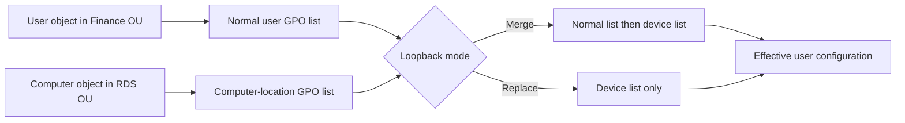
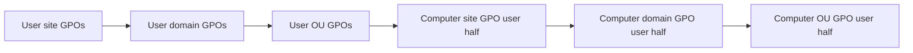
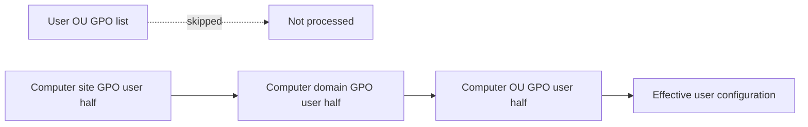

# Group Policy Loopback Processing: Merge, Replace and Troubleshooting

Group Policy normally determines user settings from the user's location in Active Directory. Loopback processing changes that rule on designated computers so the user experience can follow the device: an RDS host, kiosk, classroom, privileged access workstation or other tightly managed endpoint.

> **TL;DR**
>
> - Loopback is a **computer setting** that changes how **user settings** are selected at sign-in.
> - **Merge** applies the user's normal GPO list first, then the computer-location user list with higher precedence.
> - **Replace** skips the user's normal GPO list and uses only user settings selected from the computer's location.
> - Link loopback user-setting GPOs where the **computer account** resides, not where the user resides.
> - Validate both computer and user RSoP. An applied loopback-enabling GPO does not prove that the intended user-setting GPO applied.

## 1. The problem loopback solves

Consider this directory layout:

```text
OU=Users
  OU=Finance
    CN=Ada

OU=Computers
  OU=RDS
    CN=RDSH-01
```

Without loopback, Ada receives user settings linked to `OU=Finance`, regardless of which computer she uses. That behavior is correct for a personal workstation but often wrong on `RDSH-01`, where every session might require the same Start menu, redirected folders, application restrictions and session limits.

Loopback tells the client to evaluate user settings by using GPOs in the computer's scope. It does not move the user, change group membership or convert user settings into computer settings.



## 2. Normal, Merge and Replace

| Mode | User GPO list | Computer-location user GPO list | Typical use |
|---|---|---|---|
| Disabled | Applied | Not used | Personal workstations |
| Merge | Applied first | Appended and given higher precedence | RDS/VDI with common restrictions plus user personalization |
| Replace | Not gathered | Used exclusively | Kiosks, classrooms, PAWs and tightly controlled shared systems |

### Merge

Merge preserves the user's normal policy and then processes user settings selected from the computer's scope. If both lists configure the same policy setting, the computer-location list normally wins because it is processed later.



Use Merge when users should retain normal settings while the special-purpose computer adds or overrides a controlled subset.

### Replace

Replace does not gather the user's normal GPO list. The client processes user settings only from GPOs in the computer's scope.



Use Replace when the computer must present a predictable user environment independent of the user's normal OU. Remember that “replace” replaces the GPO list, not every value already present in the user profile. Tattooing preference settings, local changes and settings from other management channels can remain.

## 3. Recommended design

Separate the mechanism from its payload:

| GPO | Configuration | Link | Suggested status |
|---|---|---|---|
| `C-RDS-Loopback-Merge` | Enables loopback under Computer Configuration | RDS computer OU | User settings disabled |
| `U-RDS-Session-Restrictions` | Contains the loopback user settings | RDS computer OU | Computer settings disabled |
| `U-RDS-Drive-Mappings` | Contains targeted user preferences | RDS computer OU | Computer settings disabled |

This is not a technical requirement. It is an operational pattern that makes these questions easier to answer:

- Did the computer receive the loopback mode?
- Which GPO supplied a particular user setting?
- Is a failure in computer filtering or user filtering?
- Can the user-setting payload be changed without changing the loopback mechanism?

Avoid enabling loopback in a broad domain-level GPO unless every descendant computer is intentionally in scope. Keep special-purpose computers in dedicated OUs and link loopback there.

## 4. Configure loopback

In Group Policy Management Editor, configure:

```text
Computer Configuration
  Policies
    Administrative Templates
      System
        Group Policy
          Configure user Group Policy loopback processing mode
```

Set the policy to **Enabled**, then select **Merge** or **Replace**.

The setting is stored in the computer-side registry policy. Prefer configuring it through GPMC, a known-good GPO backup or your policy-as-code workflow rather than editing a client registry directly. A local registry change is not a substitute for correctly scoping the domain GPO.

Create and link an empty GPO with PowerShell, then configure the mode in GPMC:

```powershell
Import-Module GroupPolicy

$gpoName = 'C-RDS-Loopback-Merge'
$targetOu = 'OU=RDS,OU=Computers,DC=contoso,DC=com'

$gpo = New-GPO -Name $gpoName -Comment 'Enables loopback Merge mode on RDS hosts.'
New-GPLink -Guid $gpo.Id -Target $targetOu -LinkEnabled Yes
Set-GPO -Guid $gpo.Id -GpoStatus UserSettingsDisabled
```

Create user-setting GPOs separately and link them to the same computer OU:

```powershell
$userGpo = New-GPO -Name 'U-RDS-Session-Restrictions' `
    -Comment 'User restrictions selected through RDS loopback processing.'

New-GPLink -Guid $userGpo.Id -Target $targetOu -LinkEnabled Yes
Set-GPO -Guid $userGpo.Id -GpoStatus ComputerSettingsDisabled
```

Disabling the unused half reduces ambiguity. Do not disable the computer half of the GPO that enables loopback or the user half of a payload GPO.

## 5. Security filtering

Loopback involves two distinct decisions:

1. The computer must be allowed to apply the GPO that enables loopback.
2. The signing-in user must be allowed to apply the user-setting GPOs selected from the computer's scope.

Since the MS16-072 hardening change, the computer also needs **Read** access to user GPOs so it can retrieve them. A robust filtering model is:

- grant the target computer group **Read** and **Apply Group Policy** on the loopback-enabling GPO;
- grant the intended user group **Read** and **Apply Group Policy** on a loopback user-setting GPO;
- retain **Read**, without **Apply Group Policy**, for `Authenticated Users` or `Domain Computers` when needed for computer retrieval.

Inspect permissions instead of inferring them from the Security Filtering pane:

```powershell
Get-GPPermission -Name 'C-RDS-Loopback-Merge' -All |
    Sort-Object Trustee |
    Format-Table Trustee, Permission, Inherited

Get-GPPermission -Name 'U-RDS-Session-Restrictions' -All |
    Sort-Object Trustee |
    Format-Table Trustee, Permission, Inherited
```

Do not try to filter loopback user settings by denying the computer account access to the user-setting GPO. Since MS16-072, the computer account must retain at least **Read** permission to retrieve user-setting GPOs before user filtering is evaluated. Use user **Apply Group Policy** permissions to control who receives the settings; Deny ACEs or missing computer Read access break the earlier retrieval step.

## 6. Precedence still matters

Loopback changes which user GPO list is built; it does not discard normal Group Policy precedence rules inside that list.

- Site, domain and OU order still applies.
- A child OU normally has higher precedence than its parent.
- At one container, link order 1 has the highest precedence.
- Enforced links and Block Inheritance still affect list construction.
- Security and WMI filtering still decide whether a GPO enters the list.
- Group Policy Preferences item-level targeting is evaluated by the preference extension after the GPO is selected.

In Merge mode, computer-location user GPOs are appended after the user's normal list and therefore take precedence when settings conflict. In Replace mode, there is no user-location list to conflict with.

## 7. Validate the design before rollout

Use Group Policy Modeling in GPMC to simulate the user, computer, site, security groups and WMI results. Modeling is a planning tool; confirm the deployed behavior with logging from a real sign-in.

On a pilot computer, refresh computer policy first, then start a new user session:

```powershell
gpupdate.exe /target:computer /force
```

Sign out and sign back in. Loopback affects user policy at sign-in, and some client-side extensions process only in the foreground. Running only `gpupdate /target:user` in an existing session is not a complete loopback test.

Capture both scopes from an elevated prompt:

```powershell
$output = Join-Path $env:TEMP 'Loopback-RSoP'
New-Item -Path $output -ItemType Directory -Force | Out-Null

gpresult.exe /scope computer /h (Join-Path $output 'Computer.html') /f
gpresult.exe /scope user /h (Join-Path $output 'User.html') /f
gpresult.exe /r /scope computer
gpresult.exe /r /scope user
```

Verify:

- the computer report includes the GPO that enables loopback;
- the user report lists the expected computer-location user GPOs;
- Replace mode omits the user's normal user-location GPOs;
- Merge mode includes both lists and shows the expected winning GPO;
- denied GPOs have an explainable security or WMI reason.

## 8. Follow one processing activity

The operational log is:

```text
Applications and Services Logs
  Microsoft
    Windows
      GroupPolicy
        Operational
```

Correlate events by **Activity ID**. Do not combine an event from computer startup, a background refresh and a user sign-in into one diagnosis.

```powershell
$logName = 'Microsoft-Windows-GroupPolicy/Operational'

Get-WinEvent -FilterHashtable @{
    LogName   = $logName
    StartTime = (Get-Date).AddHours(-2)
} | Select-Object TimeCreated, Id, ActivityId, LevelDisplayName, Message |
    Sort-Object TimeCreated
```

The useful sequence is:

1. Confirm that the computer processed the loopback setting.
2. Identify the user sign-in processing Activity ID.
3. Inspect GPO discovery and denied reasons for that activity.
4. Follow client-side extension start, completion and error events.
5. Validate the resulting operating-system state.

For the complete event and connectivity workflow, use [Group Policy Troubleshooting: From gpresult to the Actual Root Cause](<../Troubleshoot/Group Policy Troubleshooting - From gpresult to the Actual Root Cause.md>).

## 9. Common failure patterns

| Symptom | Likely cause | Discriminating check |
|---|---|---|
| Normal user GPOs still apply in Replace mode | Loopback-enabling GPO did not apply to the computer | Computer `gpresult` and computer-side event activity |
| Normal user GPOs disappear, but replacement settings are absent | User payload GPO is unlinked, disabled or filtered | User `gpresult`, including denied GPOs |
| Merge applies the wrong winner | Link order, Enforced link or a later GPO configures the same setting | Winning GPO in HTML RSoP |
| Works for one user but not another | User security filtering, group token or item-level targeting | User token plus GPO permissions and targeting result |
| Works after the second sign-in or restart | Foreground processing requirement or asynchronous first sign-in | Operational log and extension behavior |
| GPO appears applied but one setting is missing | CSE failure, unsupported setting or preference action | Extension events and actual configured state |
| Policy differs between hosts in the same OU | Replication, DC selection, local policy or host-specific filtering | DC name, GPC/GPT versions and per-host RSoP |

## 10. Design mistakes to avoid

### Applying loopback to ordinary user workstations

Loopback is for computers whose role should determine the user environment. Applying Replace mode broadly can silently remove expected user policies and make delegation boundaries hard to reason about.

### Linking payload GPOs to the user's OU

The point of loopback is to select user settings from the computer's scope. Link the payload to the special-purpose computer OU. A user-OU link belongs to the normal user list and is skipped in Replace mode.

### Mixing Merge and Replace without a deliberate precedence design

If several applicable computer GPOs configure loopback differently, the winning computer policy determines the mode. Keep one authoritative loopback setting per computer scope and verify the winner in computer RSoP.

### Testing only with an administrator

Administrators often have different group membership, filtering and user rights. Test a representative standard account, an excluded account and any privileged account expected to use the system.

### Treating RSoP as proof of execution

RSoP establishes scope and precedence. It does not prove that every script, preference item, registry operation or extension completed. Confirm the final state and inspect the matching Activity ID.

## 11. Deployment checklist

- [ ] Dedicated OU contains only the intended special-purpose computers.
- [ ] One computer GPO enables the chosen loopback mode.
- [ ] Loopback user-setting GPOs are linked in the computer's scope.
- [ ] Unused computer/user halves are disabled on separate mechanism and payload GPOs.
- [ ] Computer and user permissions include the required Read and Apply rights.
- [ ] Modeling shows the intended normal, Merge or Replace list.
- [ ] Pilot validation includes a fresh sign-in and both RSoP scopes.
- [ ] Conflicts, preference persistence and foreground-only extensions are tested.
- [ ] Rollback consists of disabling the loopback link and payload links, not ad hoc registry edits.

## References

- [Group Policy processing for Windows](https://learn.microsoft.com/en-us/windows-server/identity/ad-ds/manage/group-policy/group-policy-processing)
- [Loopback processing of Group Policy](https://learn.microsoft.com/en-us/troubleshoot/windows-server/group-policy/loopback-processing-of-group-policy)
- [MS16-072: Security update for Group Policy](https://support.microsoft.com/help/3163622)
- [Get-GPResultantSetOfPolicy](https://learn.microsoft.com/en-us/powershell/module/grouppolicy/get-gpresultantsetofpolicy)
- [gpresult](https://learn.microsoft.com/en-us/windows-server/administration/windows-commands/gpresult)