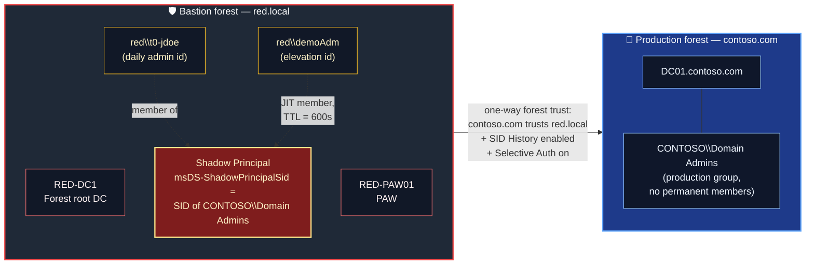

# Just-in-Time AD Admin Elevation with Shadow Principals (without MIM)

## Introduction

When organizations look at **Privileged Access Management for Active Directory**, two products dominate the conversation: **Microsoft Identity Manager (MIM)** and **Entra Privileged Identity Management (PIM)**. Both are excellent, but both have a cost:

- **MIM PAM** requires a full MIM deployment (SQL, SharePoint, portal), licensing, and several weeks of engineering effort.
- **Entra PIM for Groups** (with Cloud Sync group writeback) is the modern path forward — but it requires Entra ID P2 licensing, network connectivity to Microsoft 365, and a degree of cloud trust that some sovereign / air-gapped / defense environments simply cannot accept.

What very few people know is that **Active Directory itself ships with a built-in PAM engine** since Windows Server 2016. The feature is called the **Privileged Access Management Optional Feature**, and combined with a **forest trust** and **shadow principals**, it lets you build a fully functional **just-in-time admin elevation system across forests — without MIM, without Entra, without any third-party tool**.

That capability is the subject of this article. It is sometimes called the **PAM Trust** pattern, or the **Bastion Forest** pattern. It is the on-prem, native, no-license, no-cloud answer to "*how do I stop having permanent Domain Admins?*"

> **🔵 Important — what this article is, and what it is not.**
>
> This is **not** a "MIM replacement" sales pitch. The bastion forest pattern delivers the *mechanics* of JIT elevation (time-bound group membership, KDC ticket lifetime cap, cross-forest SID injection). It does **not** deliver a request portal, an approval workflow, MFA-on-elevation, or audit dashboards. We discuss this explicitly in [§ 8 — What this pattern does NOT solve](#-8--what-this-pattern-does-not-solve).
>
> This article is for architects and AD engineers who want to **understand the engine** and decide whether it fits their threat model.

### 🗂️ Quick Navigation

- [🧱 1 — Why this article](#-1--why-this-article)
- [🧠 2 — Concepts you need to master first](#-2--concepts-you-need-to-master-first)
- [🏗️ 3 — Architecture overview](#-3--architecture-overview)
- [📋 4 — Prerequisites](#-4--prerequisites)
- [🤝 5 — Building the bastion forest and the trust](#-5--building-the-bastion-forest-and-the-trust)
- [👥 6 — Creating shadow principals](#-6--creating-shadow-principals)
- [⏱️ 7 — End-to-end demo: just-in-time elevation](#-7--end-to-end-demo-just-in-time-elevation)
- [⚠️ 8 — What this pattern does NOT solve](#-8--what-this-pattern-does-not-solve)
- [📊 9 — When to use this vs. MIM PAM vs. Entra PIM for Groups](#-9--when-to-use-this-vs-mim-pam-vs-entra-pim-for-groups)
- [🩺 10 — Troubleshooting and common pitfalls](#-10--troubleshooting-and-common-pitfalls)
- [🧹 11 — Cleanup and decommissioning](#-11--cleanup-and-decommissioning)
- [📚 12 — References](#-12--references)

### 🎨 Reading Legend

- 🔴 Critical: security boundary, irreversible change, or compromise risk
- 🟡 Warning: high chance of lockout, breakage, or operational confusion
- 🔵 Important: deployment constraint, sequencing requirement, or design decision
- 🟢 Recommendation: best practice to improve resilience or maintainability

> **🔴 Critical — Enabling the PAM Optional Feature is *irreversible*.** Once activated on the bastion forest, it cannot be disabled. The change is per-forest, not per-domain. Plan accordingly.

### 📐 Lab conventions used in this article

| Element | Production forest | Bastion (admin) forest |
|---|---|---|
| Forest / Root domain FQDN | `contoso.com` | `red.local` |
| NetBIOS name | `CONTOSO` | `RED` |
| Domain Controller | `DC01.contoso.com` | `RED-DC1.red.local` |
| Member server example | `FILE01.contoso.com` | `RED-PAW01.red.local` (PAW for the bastion) |
| Standard helpdesk user | `contoso\jdoe` | n/a |
| Tier 0 admin identity | n/a — should not exist permanently | `red\t0-jdoe` |
| Demo elevation account | n/a | `red\demoAdm` |
| Shadow groups in `red.local` | n/a | `T0-Admins-Contoso-EA`, `T0-Admins-Contoso-DA`, `T0-Admins-Contoso-SA` |

These names are used throughout the article so every command you see can be copy-pasted with a simple search-and-replace.

---

## 🧱 1 — Why this article

### 1.1 — The problem with permanent Domain Admins

Walk into any AD environment that hasn't gone through a maturity program and you will find:

- A handful of accounts that are **permanent** members of `Domain Admins`, `Enterprise Admins`, or `Administrators`.
- Those accounts log on to jump servers, helpdesk workstations, sometimes their owner's daily-driver laptop.
- Their passwords are rotated *maybe* once a year, and only when someone leaves the team.

Every one of those accounts is a **standing privilege**. Standing privilege is what attackers monetize: Mimikatz, Kerberoast, AS-REP roast, OverPass-The-Hash, PrintNightmare, Zerologon — every named AD attack of the last decade exists because at some point a high-value credential was *available to be stolen*.

The mature answer is: **no permanent privilege, and just-in-time elevation when needed**. That is what the PAM feature plus a bastion forest delivers.

### 1.2 — Where this pattern sits in the landscape

The vendor landscape for JIT admin elevation on AD looks like this in 2026:

| Tool | What it adds on top of the AD engine | Where it falls short |
|---|---|---|
| **Microsoft Identity Manager (MIM) PAM** | Request portal, approval workflow, MFA on elevation, audit reports, automated provisioning of shadow groups | Heavy stack (MIM Service + Portal + SharePoint + SQL), already in extended support (mainstream support ended in 2022), on-prem only, slow to deploy |
| **Entra Privileged Identity Management for Groups + Cloud Sync group writeback** | Cloud-native UX, MFA / Conditional Access on activation, approval workflows, access reviews, audit logs in Entra | Requires Entra ID P2, requires the on-prem groups to be syncable to Entra, requires network egress to Microsoft 365 |
| **Third-party vaulting (CyberArk, Delinea, BeyondTrust, ...)** | Vaulted privileged accounts, session recording, password rotation, just-in-time access | Significant licensing cost, often does not actually solve the "no standing privilege in AD" problem unless paired with native PAM |
| **Bastion forest + PAM Trust + shadow principals (this article)** | Native AD, no licensing, no portal needed, works fully air-gapped | Manual elevation (PowerShell), no UX, no MFA on elevation, no approval workflow, no built-in reporting |

The bastion forest pattern is **the foundation that MIM PAM is built on top of**. MIM does not invent a new elevation mechanism — it provides a portal that calls the exact same APIs we use manually in this article.

### 1.3 — Who should read this

This article is for you if:

- You operate an AD environment and want to **eliminate standing Domain Admins** without buying anything.
- You evaluate MIM PAM and want to understand what it actually does under the hood.
- You operate a **sovereign / classified / air-gapped** environment where Entra ID is off the table.
- You already have a Tier 0 design (if not, read [Active Directory Tiering Model for On-Premises Environments](Active%20Directory%20Tiering%20Model%20for%20On-Prem%20Environment.md) first — the bastion forest is essentially "Tier 0 in its own forest").

---

## 🧠 2 — Concepts you need to master first

Five concepts must be crystal-clear before you start touching commands. Skipping this section is the most common reason people get lost three steps into the build.

### 2.1 — SID (Security Identifier)

A **SID** is the binary identity of every security principal in Windows. It looks like `S-1-5-21-3623811015-3361044348-30300820-1013`. The last block (`-1013`) is the **RID**, unique within a domain. The rest identifies the issuing domain.

**Everything in Windows authorization is SID-based**, not name-based. ACLs, tokens, group memberships, Kerberos PAC — all SIDs. Names are just labels the SAM resolves for human convenience.

### 2.2 — Security principal and access token

A **security principal** is anything that can be granted permissions: users, computers, groups, gMSAs. Each carries a SID.

When you log on, the **LSA** builds an **access token** containing your user SID **and** the SIDs of every group you belong to (recursively). That token is what every permission check evaluates against. If `Domain Admins`' SID is in your token, you are a Domain Admin **for the duration of that session**.

This is the lever the PAM feature pulls: by inserting and removing a SID from your token at the right time, you become and stop being privileged — no password change, no account swap.

### 2.3 — SID History

The `sIDHistory` attribute carries **additional SIDs** that a principal "also is". It exists for migration scenarios: when you move a user from one domain to another, the new account keeps the *old* SID in `sIDHistory` so existing ACLs continue to grant access.

By default, AD does **SID Filtering** across trusts: SIDs from a foreign domain that don't belong there are stripped out of the authentication PAC. Without SID Filtering, an attacker on one side could forge SIDs of the other side. **Enabling SID History across a trust = disabling SID Filtering in that direction**, so this is *only* acceptable when the source domain is more trusted than the target — which is exactly the case for a bastion → production trust.

### 2.4 — Shadow Principals (`msDS-ShadowPrincipal`)

A **shadow principal** is a special object in the `red.local` (bastion) forest that **carries a foreign SID** — specifically, the SID of a privileged group in the production forest (e.g. the SID of `CONTOSO\Domain Admins`).

The shadow principal object:

- Lives in `CN=Shadow Principal Configuration,CN=Services,CN=Configuration,DC=red,DC=local`.
- Has object class `msDS-ShadowPrincipal`.
- Carries the foreign SID in attribute `msDS-ShadowPrincipalSid`.
- **Can be used as a group** in the bastion forest: you add members to it just like any group.

When a member of the shadow principal authenticates **back to the production forest**, the KDC injects the foreign SID into their PAC. From `CONTOSO`'s point of view, the authenticated principal **is a member of `CONTOSO\Domain Admins`** — even though no `Domain Admins` membership exists on the production side.

That is the core trick. You never grant production privileges to a bastion account directly; you grant them via a shadow principal that *represents* a production group.

### 2.5 — PAM Optional Feature and Linked Attribute TTL

The **Privileged Access Management Optional Feature** is an AD forest-wide optional feature, introduced in Windows Server 2016. Enabling it:

- Requires a Forest Functional Level of **Windows Server 2016 or higher**.
- Unlocks the **shadow principal** object class for normal use.
- Unlocks **expiring linked attributes** (linked-attribute TTL) — currently pre-configured by the schema only for `member` / `memberOf`.

**Linked Attribute TTL** is the second magic ingredient. Normally, `member` is a permanent multi-value attribute. With the PAM feature enabled, you can add a member with a **time-to-live in seconds**, using a special DN syntax:

```text
<TTL=600,CN=demoAdm,CN=Users,DC=red,DC=local>
```

After 600 seconds, the link is removed automatically by AD. No scheduled task, no MIM workflow — it is the **AD database engine itself** that expires the link.

Even better: the **KDC** on a 2016+ DC reads those TTLs and **caps the TGT lifetime** to the shortest time-bound membership of the requester. So an elevated user does not even keep a stale ticket past the elevation window: their next ticket renewal fails as soon as the TTL is gone.

> **🔵 Important — Irreversibility.** Enabling the PAM Optional Feature is a one-way door. There is no `Disable-ADOptionalFeature` for it. The schema changes and the unlocked behaviors stay forever. Run it on a **dedicated bastion forest**, never on your production forest.

### 2.6 — The PIM trust attribute (`TRUST_ATTRIBUTE_PIM_TRUST`)

This is the concept most articles about the bastion pattern silently skip — and the single most common reason a correctly-built lab produces **zero** elevation. Enabling SID History on the trust ([§ 2.3](#23--sid-history)) is *necessary but not sufficient*.

Here is the subtlety. SID filtering normally strips, from an incoming trust, any SID whose domain portion belongs to the **trusting (production) forest itself** — because a foreign forest presenting *your own* domain's SIDs looks exactly like a SID-spoofing attack. But that is *precisely* what a shadow principal does: it presents the SID of `CONTOSO\Domain Admins` (a production SID) from inside `red.local`. With only `/enableSidHistory:yes`, that production-domain SID is still filtered out, and the elevation appears to do nothing.

The flag that tells the production KDC "*this specific trust is a Privileged Access Management trust, so honor same-forest SIDs carried by the bastion*" is the trust attribute **`TRUST_ATTRIBUTE_PIM_TRUST` (bit `0x400`)** on the trusted-domain object (TDO). This is exactly the bit that MIM's `New-PAMTrust` cmdlet sets under the hood. Building the pattern *without* MIM means you must set it yourself — either via `netdom … /EnablePIMTrust:Yes` (where supported) or directly on the TDO's `trustAttributes` via LDAP. Both methods are shown in [§ 5.3](#53--create-the-trust-from-the-production-side).

> **🔴 Critical — SID History alone will not elevate.** If you follow only the `/enableSidHistory:yes` guidance you will find that `whoami /groups` on the production DC never shows the injected group. The `TRUST_ATTRIBUTE_PIM_TRUST` bit is the missing half of the mechanism.

---

## 🏗️ 3 — Architecture overview

### 3.1 — The big picture

You build a **second, small, hardened forest** (`red.local`) that contains nothing except:

- A pair of Domain Controllers (`RED-DC1`, `RED-DC2`).
- One or two Privileged Access Workstations (`RED-PAW01`, ...).
- A small directory: a few hardened admin accounts (`red\t0-jdoe`, `red\demoAdm`, ...), some shadow principals, and the groups that govern who can elevate.
- No file shares, no print servers, no business apps. Nothing that a user ever logs onto interactively except admins doing admin work.

You then create **a one-way forest trust** from `contoso.com` (production) trusting `red.local` (bastion):

- The arrow points **production trusts bastion** — accounts from `red.local` can be authorized in `contoso.com`, but not the other way.
- The trust is **forest** (not external), so SID injection via shadow principals works across all domains in `contoso.com`.
- The trust **allows SID History** (which implicitly disables SID Filtering in that direction).
- The trust uses **Selective Authentication** so only explicitly granted servers in `contoso.com` accept logon from `red.local`.



### 3.2 — Authentication walk-through

When `red\demoAdm` (a temporarily-elevated user) connects to `DC01.contoso.com`:

1. `demoAdm` requests a TGT from `RED-DC1` in `red.local`. The TGT lifetime is **capped to 600 seconds** because that is the lowest TTL among its time-bound memberships (the shadow principal membership).
2. `demoAdm` requests a referral TGT to `contoso.com`.
3. `contoso.com`'s KDC validates the referral and **inspects the PAC**. It sees the SID of `CONTOSO\Domain Admins` (carried via the shadow principal and re-injected because SID History is allowed on the trust).
4. The service ticket for `DC01` is built. `demoAdm` connects to `DC01` *as a Domain Admin of `CONTOSO`*, but only for the next 10 minutes, and only because `RED-PAW01` is on the `Allowed-To-Authenticate` list of `DC01` (Selective Authentication).
5. At T+600s, the linked-attribute TTL expires. The shadow principal membership disappears in `red.local`. The next ticket request `demoAdm` makes will not contain the privileged SID. The session quietly de-elevates.

### 3.3 — The three boundaries you are setting up

| Boundary | Enforced by | What it protects |
|---|---|---|
| **Forest separation** | Two independent AD forests, two independent schemas, two independent DCs | A compromise of `contoso.com` cannot pivot to `red.local` because there is no inbound trust |
| **Selective Authentication** | Trust property + `Allowed-To-Authenticate` ACE on each `contoso.com` server you allow | A compromised `red.local` PAW can only reach the *very specific* `contoso.com` resources you whitelist |
| **Time-bound elevation** | PAM Optional Feature + linked-attribute TTL + KDC ticket cap | A stolen `demoAdm` credential is only useful while the TTL window is open; after that, the SID is gone from the next ticket |

---

## 📋 4 — Prerequisites

> **🔴 Critical — Do not start until every item below is true.** The PAM feature activation is irreversible, and trust creation in the wrong order produces stale TDOs that are painful to clean up. Treat this as a pre-flight checklist.

### 4.1 — Production forest (`contoso.com`)

- The forest functional level itself does **not** need to be raised on the production side — but every production DC that will issue tickets to elevated bastion users **must run Windows Server 2016 or higher**. Otherwise the foreign SID injection from the shadow principal is silently dropped from the PAC, and the elevation appears to do nothing.
- A working Tier 0 design — see [Active Directory Tiering Model for On-Premises Environments](Active%20Directory%20Tiering%20Model%20for%20On-Prem%20Environment.md).
- An empty `Domain Admins` group (the target state) — at minimum, you have already mapped which production groups will be represented by shadow principals: typically `Enterprise Admins`, `Domain Admins`, `Schema Admins`, `Administrators` and any custom Tier 0 groups.
- Two-way DNS resolution between `contoso.com` and `red.local` configured: **conditional forwarders** on `contoso.com` pointing to `red.local`'s DNS, and vice versa. **No stub zones, no AD-integrated cross-forest replication.**

### 4.2 — Bastion forest (`red.local`)

- **Brand new** forest, built from scratch, never connected to production replication.
- Forest functional level: **Windows Server 2016 minimum**. Strongly recommended: Windows Server 2022 or 2025 for the latest PAC hardening (CVE-2022-37967 / Netlogon enforcement, Kerberos PAC signature).
- Two Domain Controllers, both Server Core, in different physical locations if possible.
- One or more dedicated PAWs that are **the only machines from which `red.local` admin accounts ever log in**.
- A very tight OU structure: `Admins/`, `Workstations/`, `ShadowGroups/`. Nothing else.
- No file shares, print services, web servers, AD CS — nothing that introduces attack surface.

> **🟢 Recommendation — Treat the bastion forest like a HSM.** Read-only DCs are not appropriate (they can't host the PAM feature). Server Core. No GUI. No Edge. No third-party agents except your EDR. Backups handled by a dedicated, isolated backup target.

### 4.3 — The trust

- Trust type: **forest trust**, **one-way**. From `contoso.com`'s point of view it is **incoming** (production trusts bastion); from `red.local`'s point of view it is **outgoing**. In `netdom` syntax it is created from `contoso.com` with `/domain:red.local /add /twoway:no`.
- **`/enableSidHistory:yes`** — required for shadow principal SID injection to survive the trust. This flag relaxes SID filtering on this incoming forest trust so that foreign SIDs carried in the PAC are not stripped.
- **`TRUST_ATTRIBUTE_PIM_TRUST` (bit `0x400`) set on the TDO** — required so that same-forest SIDs (such as `CONTOSO\Domain Admins`, injected via a shadow principal) are honored rather than filtered as spoofing. This is the bit MIM's `New-PAMTrust` sets; without MIM you set it yourself (see [§ 2.6](#26--the-pim-trust-attribute-trust_attribute_pim_trust) and [§ 5.3](#53--create-the-trust-from-the-production-side)). **Missing this bit is the number-one cause of "elevation does nothing".**
- **`/SelectiveAuth:yes`** — required so a compromised bastion identity cannot suddenly browse `contoso.com` end-to-end. With Selective Auth, every authentication target server in `contoso.com` must be individually whitelisted via an `Allowed-To-Authenticate` ACE on its computer object.
- Do **not** enable trust quarantine — it strips foreign SIDs and would defeat the entire pattern.

### 4.4 — Identities

- A dedicated **Schema Admin / Enterprise Admin** of the **bastion forest** is needed to enable the PAM feature. Note: it must be of the **bastion forest**, not the production forest — a common confusion.
- At least one **Tier 0 admin** identity in `red.local` per administrator (e.g. `red\t0-jdoe`).
- A **separate elevation account** per scope (e.g. `red\demoAdm`). Mixing daily-driver bastion admin and elevation account is OK technically but defeats the audit clarity.

### 4.5 — Tooling on the bastion DC / PAW

```powershell
# Confirm we are on the right OS
[System.Environment]::OSVersion.Version
(Get-CimInstance Win32_OperatingSystem).Caption

# Confirm ADWS, AD module, RSAT
Get-Service ADWS
Get-Module -ListAvailable ActiveDirectory

# Confirm DSAC and LDP are present (they are by default with AD DS role / RSAT)
Get-Command -Name dsac.exe, ldp.exe
```

---

## 🤝 5 — Building the bastion forest and the trust

This section assumes the bastion forest `red.local` already exists with at least one Windows Server 2016+ DC, and that DNS is set up bidirectionally with conditional forwarders.

### 5.1 — Raise the bastion forest functional level

```powershell
# On RED-DC1, in red.local
Get-ADForest red.local | Select-Object Name, ForestMode, DomainNamingMaster, SchemaMaster
Get-ADDomain red.local | Select-Object Name, DomainMode, PDCEmulator

# If needed, raise to 2016 (or higher)
Set-ADForestMode -Identity red.local -ForestMode Windows2016Forest -Confirm:$true
Set-ADDomainMode -Identity red.local -DomainMode Windows2016Domain -Confirm:$true
```

> **🟡 Warning:** Raising the forest functional level is **irreversible** in practice (downgrades exist only under very narrow conditions). Make sure you have no Server 2012 R2 DCs in the bastion forest before doing this.

### 5.2 — Enable the PAM Optional Feature in the bastion forest

```powershell
# On RED-DC1, logged in as an Enterprise Admin of red.local
Get-ADOptionalFeature -Filter * | Select-Object Name, EnabledScopes, RequiredForestMode

Enable-ADOptionalFeature `
    -Identity 'Privileged Access Management Feature' `
    -Scope ForestOrConfigurationSet `
    -Target red.local

# Confirm
Get-ADOptionalFeature -Filter "Name -eq 'Privileged Access Management Feature'" |
    Select-Object Name, EnabledScopes
```

The `EnabledScopes` column should now contain the DN of the bastion forest's `Partitions` container.

> **🔴 Critical — Last chance to back out.** Until this command runs, you can rebuild the bastion forest. After it runs, the schema and partition state carry the PAM feature permanently. Be sure.

### 5.3 — Create the trust from the production side

Run on a Domain Controller of `contoso.com`, as Enterprise Admin of `contoso.com`. The command is **`netdom`** — `New-ADTrust` does not support every option we need.

```powershell
netdom trust contoso.com `
    /domain:red.local `
    /add `
    /twoway:no `
    /transitive:yes `
    /enableSidHistory:yes `
    /SelectiveAuth:yes `
    /usero:Administrator@red.local `
    /passwordo:* `
    /userd:Administrator@contoso.com `
    /passwordd:*
```

Read this carefully:

- `/twoway:no` — we want one-way only. The direction created by `netdom trust X /domain:Y /add` from forest X creates a trust where **X trusts Y** (i.e., users from Y can be authorized in X).
- `/enableSidHistory:yes` — relaxes SID filtering inbound on the trust. Mandatory for shadow principal SID injection.
- `/SelectiveAuth:yes` — turn on selective authentication on the trust. We will then individually whitelist target servers.
- `/usero` / `/passwordo` — credentials of an Enterprise Admin in the **other** (bastion) forest. `/userd` / `/passwordd` — Enterprise Admin in **this** (production) forest. Using `*` prompts interactively, which is what you want — do not put passwords on the command line.

#### Set the PIM trust bit (`TRUST_ATTRIBUTE_PIM_TRUST`)

The command above builds a normal SID-History-enabled forest trust. It does **not**, on its own, set the `TRUST_ATTRIBUTE_PIM_TRUST` (`0x400`) bit that makes same-forest SID injection work (see [§ 2.6](#26--the-pim-trust-attribute-trust_attribute_pim_trust)). You must set it explicitly, using one of the two methods below.

**Method A — `netdom` (simplest, but not on every build).** Recent `netdom` versions expose the switch directly:

```powershell
# On a contoso.com DC, as Enterprise Admin
netdom trust contoso.com /domain:red.local /EnablePIMTrust:Yes
```

> **🔵 Important — `/EnablePIMTrust` is not present on all `netdom` builds.** If the switch is rejected as unknown, use Method B. The canonical, always-available path is MIM's `New-PAMTrust` cmdlet — but since this article builds the pattern *without* MIM, Method B is the supported no-MIM equivalent.

**Method B — set the `trustAttributes` bit directly via LDAP.** This flips bit `0x400` on the trusted-domain object without touching MIM or any specific `netdom` build:

```powershell
# On a contoso.com DC, as Enterprise Admin
$TdoDN = "CN=red.local,CN=System,DC=contoso,DC=com"
$Tdo   = Get-ADObject -Identity $TdoDN -Properties trustAttributes

# 0x400 = TRUST_ATTRIBUTE_PIM_TRUST. Preserve existing bits (SID history, forest transitive, etc.)
$NewAttrs = $Tdo.trustAttributes -bor 0x400
Set-ADObject -Identity $TdoDN -Replace @{ trustAttributes = $NewAttrs }

# Confirm the bit is set
(Get-ADObject -Identity $TdoDN -Properties trustAttributes).trustAttributes -band 0x400
# Expected output: 1024  (i.e. the 0x400 bit is present)
```

> **🔴 Critical — do not clobber the other bits.** Always OR (`-bor`) the new bit onto the existing value. Overwriting `trustAttributes` with a bare `0x400` would wipe forest-transitivity and SID-history relaxation and silently break the trust.

### 5.4 — Verify trust health

```powershell
# On a contoso.com DC
nltest /domain_trusts /v /all_trusts

netdom trust contoso.com /domain:red.local /verify
netdom trust contoso.com /domain:red.local /verify /kerberos

Get-ADTrust -Filter "Target -eq 'red.local'" |
    Format-List Name, Direction, TrustType, SelectiveAuthentication,
                SIDFilteringForestAware, SIDFilteringQuarantined,
                ForestTransitive, IntraForest

# Confirm the PIM trust bit (0x400) is set on the TDO
$TdoDN = "CN=red.local,CN=System,DC=contoso,DC=com"
(Get-ADObject -Identity $TdoDN -Properties trustAttributes).trustAttributes -band 0x400
# Expected: 1024  (0 means the PIM trust bit is NOT set — shadow principal SID injection will fail)
```

Expected:

- `Direction` = `Inbound` (red.local users can authenticate into contoso.com)
- `SelectiveAuthentication` = `True`
- `SIDFilteringForestAware` = `False` (i.e. SID filtering is **disabled** — the unintuitive boolean here means "this trust is not filtering forest SIDs")
- `SIDFilteringQuarantined` = `False`
- **`trustAttributes -band 0x400` = `1024`** (the `TRUST_ATTRIBUTE_PIM_TRUST` bit is set)

> **🟡 Warning — Common pitfall: stale TDO.** If you ever recreate the bastion forest from scratch (lab iterations), **delete the trust on the production side first**, otherwise you end up with a `trustedDomain` object pointing at a vanished forest and a stale Kerberos referral chain. Cleanup: `netdom trust contoso.com /domain:red.local /remove /force` on the production DC, then `Get-ADObject -Filter "objectClass -eq 'trustedDomain'" -SearchBase "CN=System,DC=contoso,DC=com" | Remove-ADObject -Recursive -Confirm:$true` for orphans.

### 5.5 — Whitelist target production servers (Selective Authentication)

Selective Auth means **nobody from `red.local` can authenticate to *anything* in `contoso.com`** by default. You whitelist per-server, via the `Allowed-To-Authenticate` ACE.

The cleanest way: do it in **Active Directory Users and Computers** on a `contoso.com` DC, with **Advanced Features** enabled.

1. Find the computer object of the target server in `contoso.com` (e.g. `DC01`).
2. Properties → Security → Add → Locations → choose `red.local` → pick the group of bastion users authorized to manage that target (e.g. a `red.local` group named `Allowed-To-Auth-CONTOSO-DCs`).
3. Grant the `Allowed to authenticate` permission on the *computer object*.

The PowerShell equivalent (less convenient because you must hand-build the ACE with the correct extended-right GUID `68B1D179-0D15-4D4F-AB71-46152E79A7BC` for `Allowed-To-Authenticate`):

```powershell
# On a contoso.com DC, as Domain Admin
$Target = Get-ADComputer -Identity DC01
$TargetDN = $Target.DistinguishedName
$AuthGroupSid = (Get-ADGroup -Server red.local -Identity 'Allowed-To-Auth-CONTOSO-DCs').SID

$Acl = Get-Acl "AD:$TargetDN"
$Identity = [System.Security.Principal.SecurityIdentifier]$AuthGroupSid
$AceType  = [System.Security.AccessControl.AccessControlType]::Allow
$AdRights = [System.DirectoryServices.ActiveDirectoryRights]::ExtendedRight
$ExtRight = [Guid]'68B1D179-0D15-4D4F-AB71-46152E79A7BC'  # Allowed-To-Authenticate

$Ace = New-Object System.DirectoryServices.ActiveDirectoryAccessRule(
    $Identity, $AdRights, $AceType, $ExtRight
)
$Acl.AddAccessRule($Ace)
Set-Acl -AclObject $Acl -Path "AD:$TargetDN"
```

> **🔵 Important — minimum scope.** Only whitelist the servers where the elevated identity actually needs to land: typically your DCs, your AD CS servers, your Entra Connect server. **Never whitelist domain-wide** (e.g. on the Computers container) — that would defeat the point of Selective Auth.

---

## 👥 6 — Creating shadow principals

### 6.1 — Find the SIDs of the production groups you want to represent

Run on a `contoso.com` DC:

```powershell
$Groups = 'Enterprise Admins','Domain Admins','Schema Admins','Administrators'
foreach ($g in $Groups) {
    Get-ADGroup -Identity $g -Properties ObjectSid |
        Select-Object Name, @{N='SID';E={$_.ObjectSid.Value}}
}
```

Copy these SIDs aside — you will need them on the bastion side. Example output for the rest of this article:

| Production group | SID (example) |
|---|---|
| `CONTOSO\Enterprise Admins` | `S-1-5-21-3623811015-3361044348-30300820-519` |
| `CONTOSO\Domain Admins`     | `S-1-5-21-3623811015-3361044348-30300820-512` |
| `CONTOSO\Schema Admins`     | `S-1-5-21-3623811015-3361044348-30300820-518` |
| `CONTOSO\Administrators`    | `S-1-5-32-544` (well-known) |

> **🔵 Important — well-known SIDs.** Built-in `Administrators` has the well-known SID `S-1-5-32-544` everywhere. You generally do **not** want to shadow it: every Windows machine treats it as local admin. Prefer shadowing the domain groups (`-512`, `-519`, ...) and let those groups be members of the local `Administrators` group of the right tier-0 servers, which is the standard tiering pattern.

### 6.2 — Create the shadow principal objects in the bastion forest

Shadow principals live under `CN=Shadow Principal Configuration,CN=Services,CN=Configuration,DC=red,DC=local`. They are created with `New-ADObject`, type `msDS-ShadowPrincipal`, carrying the foreign SID in `msDS-ShadowPrincipalSid`.

```powershell
# On RED-DC1, as Enterprise Admin of red.local
$ShadowConfigDN = 'CN=Shadow Principal Configuration,CN=Services,CN=Configuration,DC=red,DC=local'

# 1) Domain Admins of CONTOSO
New-ADObject `
    -Name 'T0-Admins-Contoso-DA' `
    -Type 'msDS-ShadowPrincipal' `
    -Path $ShadowConfigDN `
    -OtherAttributes @{ 'msDS-ShadowPrincipalSid' = 'S-1-5-21-3623811015-3361044348-30300820-512' }

# 2) Enterprise Admins of CONTOSO
New-ADObject `
    -Name 'T0-Admins-Contoso-EA' `
    -Type 'msDS-ShadowPrincipal' `
    -Path $ShadowConfigDN `
    -OtherAttributes @{ 'msDS-ShadowPrincipalSid' = 'S-1-5-21-3623811015-3361044348-30300820-519' }

# 3) Schema Admins of CONTOSO
New-ADObject `
    -Name 'T0-Admins-Contoso-SA' `
    -Type 'msDS-ShadowPrincipal' `
    -Path $ShadowConfigDN `
    -OtherAttributes @{ 'msDS-ShadowPrincipalSid' = 'S-1-5-21-3623811015-3361044348-30300820-518' }
```

> **🟡 Warning — "schema constraint" / "object class violation" error.** If `New-ADObject` returns *"the parameter is incorrect"* or *"a constraint violation occurred"*, the most likely cause is that the PAM Optional Feature is not actually enabled in `red.local`. Re-run `Get-ADOptionalFeature -Filter "Name -eq 'Privileged Access Management Feature'" | Select-Object EnabledScopes`. The `EnabledScopes` column **must** contain the DN of the bastion's `Partitions` container.

### 6.3 — Verify the shadow principals via ADSI Edit / LDP

```powershell
# Quick check: list everything under the Shadow Principal Configuration container
Get-ADObject -SearchBase $ShadowConfigDN -Filter * -Properties msDS-ShadowPrincipalSid |
    Select-Object Name, ObjectClass, @{N='ShadowSid';E={$_.'msDS-ShadowPrincipalSid'}}
```

For a more graphical confirmation, open **ADSI Edit**, connect to the **Configuration** naming context, navigate to `CN=Services` → `CN=Shadow Principal Configuration`, and you should see each object with its `msDS-ShadowPrincipalSid` matching the production SIDs.

### 6.4 — Make a daily-driver bastion admin a permanent member (optional)

In many designs, your daily Tier 0 admins (`red\t0-jdoe`) **are** legitimate, full-time owners of the Tier 0 role. You can make them permanent members of the shadow principal. They will be effective `Domain Admins` of `contoso.com` whenever they need to be, but only **from a PAW**, only **to a whitelisted server**, and only **with no impact on the production directory itself** (their SID is in their token, not in any production group's `member` attribute).

```powershell
# Use Set-ADObject rather than Add-ADGroupMember: shadow principals are not
# objectClass=group, so the AD module's group cmdlets are not guaranteed to
# accept them on every Windows Server build. Set-ADObject is the canonical path.
$ShadowDN  = (Get-ADObject -SearchBase $ShadowConfigDN `
                -Filter "Name -eq 'T0-Admins-Contoso-DA'").DistinguishedName
$T0JdoeDN  = (Get-ADUser -Identity 't0-jdoe').DistinguishedName

Set-ADObject -Identity $ShadowDN -Add @{ 'member' = $T0JdoeDN }
```

Note that this is a *permanent* membership — no `<TTL=...>` prefix. The next section shows the time-bound variant.

---

## ⏱️ 7 — End-to-end demo: just-in-time elevation

This is the section that ties everything together. We will:

1. Create a fresh, completely unprivileged bastion user `red\demoAdm`.
2. Add `demoAdm` to the bastion-side group already authorized by Selective Auth on `DC01.contoso.com` — without this, even a fully-elevated user cannot reach the target.
3. Confirm `demoAdm` still cannot do anything privileged on `contoso.com` (Selective Auth lets the connection through, but no production privileges yet).
4. Add `demoAdm` to the shadow principal **with a TTL of 600 seconds**.
5. Observe the TTL via **LDP.exe**.
6. Run a privileged command against `contoso.com`.
7. Wait for the TTL to expire and confirm they are no longer privileged.

### 7.1 — Create the demo elevation account

```powershell
# On RED-DC1, as Domain Admin of red.local
$Pwd = Read-Host -AsSecureString -Prompt 'Password for red\demoAdm'

New-ADUser `
    -Name 'demoAdm' `
    -SamAccountName 'demoAdm' `
    -UserPrincipalName 'demoAdm@red.local' `
    -AccountPassword $Pwd `
    -Enabled $true `
    -Path 'OU=Admins,DC=red,DC=local' `
    -Description 'Demo just-in-time elevation account (article)'
```

`demoAdm` is at this point a completely vanilla Domain User of `red.local`. They are not a member of anything privileged in either forest.

### 7.2 — Allow `demoAdm` to traverse Selective Authentication

Elevation alone is not enough: with Selective Auth on the trust, `demoAdm` cannot even reach `DC01.contoso.com` to be evaluated as a Domain Admin until they are explicitly authorized to authenticate.

The simplest hygienic pattern is to gate this with a bastion group (`Allowed-To-Auth-CONTOSO-DCs`, created in [§ 5.5](#55--whitelist-target-production-servers-selective-authentication)), and make `demoAdm` a member.

```powershell
# On RED-DC1
Add-ADGroupMember -Identity 'Allowed-To-Auth-CONTOSO-DCs' -Members 'demoAdm'
```

First, confirm the connection is still rejected because no production privileges exist yet. From `RED-PAW01`, logged in as `red\demoAdm`:

```powershell
klist purge
# Open a remote session against a production DC — connection authenticates,
# but the session itself fails because demoAdm has no production privileges.
Enter-PSSession -ComputerName DC01.contoso.com -Authentication Kerberos
# Expected: Access denied — "the user has not been granted the requested logon type at this computer"
# (because demoAdm is not in any group that has remote PowerShell rights on DC01)
```

### 7.3 — Elevate with a TTL of 600 seconds

This is the key command of the entire article. Run from a bastion privileged session (typically as a member of `red.local`'s `Domain Admins`).

```powershell
# On RED-DC1
$DemoAdmDN = (Get-ADUser -Identity demoAdm).DistinguishedName
$ShadowDN  = (Get-ADObject -SearchBase $ShadowConfigDN -Filter "Name -eq 'T0-Admins-Contoso-DA'").DistinguishedName

# The TTL syntax: <TTL=<seconds>,<full DN of the member>>
Set-ADObject -Identity $ShadowDN `
    -Add @{ 'member' = "<TTL=600,$DemoAdmDN>" }
```

That is it. `demoAdm` is now, for the next ten minutes:

- A member of the `T0-Admins-Contoso-DA` shadow principal in `red.local`.
- Carrier of the SID of `CONTOSO\Domain Admins` in any new Kerberos ticket they request against `contoso.com`.
- Constrained by the trust's Selective Auth ACE — i.e. they can only land on the production servers you previously whitelisted.

### 7.4 — Observe the TTL via LDP.exe

`LDP.exe` is the only built-in tool that can show the TTL of a linked attribute. You need to send the **LDAP_SERVER_LINK_TTL_OID** control: `1.2.840.113556.1.4.2309`.

1. On `RED-DC1`, launch **LDP.exe**.
2. *Connection* → *Connect* → `RED-DC1.red.local`, port `389`. *Bind* as a privileged user.
3. *Options* → *Controls*. In **Load Predefined**, you will not find it — type it manually:
   - Control type: `1.2.840.113556.1.4.2309`
   - Control value: leave empty.
   - Server: check, Critical: check.
   - Click **Check in**.
4. *View* → *Tree* → `CN=Shadow Principal Configuration,CN=Services,CN=Configuration,DC=red,DC=local`.
5. Expand and select the `T0-Admins-Contoso-DA` object. The `member` attribute should now display each value with its remaining TTL:

```text
member: <TTL=587,CN=demoAdm,OU=Admins,DC=red,DC=local>
```

Each LDP refresh decreases the value. At zero, the link is removed by AD and disappears from the result.

### 7.5 — Run a privileged operation against production

From `RED-PAW01`, logged in as `red\demoAdm`, within the 600-second window:

```powershell
# Get a fresh ticket so the new SID is in the PAC
klist purge
Enter-PSSession -ComputerName DC01.contoso.com -Authentication Kerberos

# Inside the remote session
whoami /groups | Select-String 'Domain Admins'
# Should show: CONTOSO\Domain Admins   Group   Mandatory group, Enabled by default, Enabled group
```

`demoAdm` is now visibly a Domain Admin of `CONTOSO` on the production DC — without ever having been added to the production `Domain Admins` group itself. There is no membership change to audit on the `contoso.com` side. The audit trail is entirely on the **bastion** side: the `Set-ADObject -Add @{member=...}` is logged on `RED-DC1`.

> **🟢 Recommendation — Centralize the bastion audit trail.** Configure auditing on the `Shadow Principal Configuration` container in `red.local` (Audit → Success → `Write Property`) and forward `RED-DC1`'s Security log to your SIEM. That gives you a single, queryable record of every just-in-time elevation: who elevated whom, into which shadow principal, with which TTL.

### 7.6 — Wait and observe the de-elevation

After 600 seconds:

```powershell
# In the remote session — request a fresh ticket
klist purge
Get-ADUser -Server contoso.com -Identity Administrator
# Expected: Access denied — the SID of CONTOSO\Domain Admins is no longer in the new ticket
```

> **🟡 Warning — Kerberos ticket caveat.** A ticket already issued during the elevation window remains technically valid until it expires on its own clock — *but* on a Windows Server 2016+ KDC, the **TGT lifetime is automatically capped to the lowest TTL** of the user's time-bound memberships. So a 600s elevation produces a TGT with a 600s lifetime, not the default 10 hours. If your KDCs are 2012 R2, the cap does **not** apply and the user keeps the elevated TGT until natural expiry. This is one of the reasons every contoso.com DC that issues PAC entries for shadow principal members must be 2016+.

---

## ⚠️ 8 — What this pattern does NOT solve

Be honest with yourself and your security team. The PAM Trust + shadow principals pattern is a **mechanism**, not a **product**. It delivers cryptographically-enforced just-in-time elevation, but here is everything it does **not** include — and what you need to bolt on.

### 8.1 — No request portal

There is no web page where a user clicks "Elevate me now" and an approver clicks "Approve". The elevation is a PowerShell command run by someone privileged in the bastion forest. In practice, this means **someone in your Tier 0 team always has to be available** to perform the `Set-ADObject -Add @{member=...}` call.

Mitigations:

- A self-service portal calling a constrained PowerShell endpoint (JEA — Just Enough Administration) — you write maybe 200 lines of PowerShell to expose a `Request-Elevation` cmdlet to non-admins.
- An ITSM workflow (ServiceNow, JIRA SD) where requesters file a ticket and an on-call admin runs the elevation.
- Stick to MIM PAM or Entra PIM if a polished UX is non-negotiable.

### 8.2 — No approval workflow

Once you give an admin the right to elevate `demoAdm`, that admin can do it any time, for any TTL, with no second approver. The bastion forest is your unit of trust — admins inside it are by definition privileged.

Mitigations:

- A JEA endpoint that requires a second admin to co-sign a request (custom).
- Two-person rule via PIM for Groups / MIM PAM if approvals are mandatory.

### 8.3 — No MFA on elevation

The elevation command is just LDAP. There is no native way to require an MFA challenge before adding `demoAdm` to the shadow principal.

Mitigations:

- Require smart-card sign-on on every bastion admin account (`Smart card is required for interactive logon`), which puts MFA *at session start* rather than *at elevation*.
- Wrap the elevation in a custom flow that calls a TOTP provider before executing the LDAP write.
- Use Entra PIM for Groups + Cloud Sync writeback if MFA-on-activation is a hard requirement and Entra is acceptable.

### 8.4 — No native reporting

You will see *that* a `member` link was added on the shadow principal in the bastion DC's Security log, but no built-in dashboard tells you "*last week, 17 elevations were performed against `T0-Admins-Contoso-DA`, average duration 47 minutes*". You build that yourself on top of your SIEM.

### 8.5 — No revocation API beyond "remove the link"

If you elevate someone for 8 hours and need to cut them off after 30 minutes, the operational primitive is `Set-ADObject -Remove @{member=...}` — and the user **keeps their current Kerberos service tickets** until they expire (default 10 hours minus the elevation cap). Real revocation requires kicking sessions on the target server, which is out of scope of this pattern.

### 8.6 — No protection against compromise of the bastion itself

If `red.local` is compromised, the attacker can mint elevations at will into `contoso.com`. **The bastion is now your single most valuable target**. Every recommendation about hardening (Tier 0 isolation, PAW, EDR, no internet egress, strict change management, attested boot) applies to the bastion **even more** than it does to production.

---

## 📊 9 — When to use this vs. MIM PAM vs. Entra PIM for Groups

There is no universally right answer. Pick the row that matches your constraints.

| Constraint / scenario | Best fit | Why |
|---|---|---|
| Air-gapped / classified environment, no cloud allowed | **Bastion forest + shadow principals (this article)** | Only on-prem, no licensing, no cloud, fully native AD |
| Large enterprise, hybrid AD + Entra, P2 licensing already owned | **Entra PIM for Groups + Cloud Sync writeback** | Best UX, MFA + Conditional Access on elevation, native audit, no on-prem product to maintain |
| Existing MIM deployment for identity synchronization or self-service | **MIM PAM** (sits naturally next to your MIM install) | Reuses the existing stack, mature workflow engine, fits regulated industries that already have MIM |
| Need approval workflow and request portal, but no Entra | **MIM PAM** | The portal and workflow engine are MIM's distinguishing value vs. the bastion forest |
| Small team, no budget, urgent need to remove standing Domain Admins | **Bastion forest + shadow principals** | Cheapest, fastest, no procurement cycle |
| You need MFA-enforced elevation, you have Entra P2 | **Entra PIM for Groups** | Conditional Access integration is the cleanest way to enforce MFA at the moment of elevation |
| Sovereign cloud / defence with strict data-residency rules and no Entra ID | **Bastion forest + shadow principals** | Stays inside the boundary entirely |
| You want to start with the native engine now and add a portal later | **Bastion forest + shadow principals**, then **JEA portal** | The bastion forest pattern is forward-compatible: any portal can be added as a thin LDAP/PowerShell wrapper on top |

> **🟢 Recommendation — these are not mutually exclusive.** A common pattern in 2026 is to deploy the bastion forest pattern for the very small set of "break-glass / nuclear" admin operations (Schema Admin, Enterprise Admin, Forest Recovery), and to use Entra PIM for Groups for everyday Tier 1 / Tier 2 admin scenarios. You get the air-gappable last-resort capability *and* the polished cloud UX for routine work.

---

## 🩺 10 — Troubleshooting and common pitfalls

### 10.1 — `Enable-ADOptionalFeature` returns "operation is not supported"

Cause: the forest functional level is below Windows Server 2016, or the cmdlet was run against the wrong target.

Fix:

```powershell
Get-ADForest red.local | Select-Object ForestMode
Set-ADForestMode -Identity red.local -ForestMode Windows2016Forest

Enable-ADOptionalFeature `
    -Identity 'Privileged Access Management Feature' `
    -Scope ForestOrConfigurationSet `
    -Target red.local
```

### 10.2 — `New-ADObject` of type `msDS-ShadowPrincipal` returns "constraint violation" / "object class violation"

Cause: the PAM feature is not actually enabled in this forest (the schema knows about the class, but the partition state is not flipped).

Fix:

```powershell
Get-ADOptionalFeature -Filter "Name -eq 'Privileged Access Management Feature'" |
    Select-Object Name, EnabledScopes
# EnabledScopes must list "CN=Partitions,CN=Configuration,DC=red,DC=local"
```

If empty, re-run `Enable-ADOptionalFeature` (§ 5.2) as Enterprise Admin of the bastion forest.

### 10.3 — `Set-ADObject -Add @{member="<TTL=600,...>"}` succeeds but the link never expires

Cause: you ran it on a Windows Server 2012 R2 DC, or against a forest where the PAM feature is not enabled. The TTL syntax is silently parsed as a regular DN (the `<TTL=...>` prefix is ignored), so the link becomes permanent.

Fix: target the operation at a Windows Server 2016+ DC of the bastion forest, after confirming `Get-ADOptionalFeature` shows the PAM feature enabled.

```powershell
Set-ADObject -Server RED-DC1.red.local -Identity $ShadowDN `
    -Add @{ 'member' = "<TTL=600,$DemoAdmDN>" }
```

### 10.4 — Elevated user does not see the production SID in `whoami /groups`

Most likely causes and how to diagnose each:

| Symptom | Likely cause | Diagnosis |
|---|---|---|
| `whoami /groups` shows nothing from CONTOSO at all | Old Kerberos ticket from before the elevation | `klist purge` then retry |
| Bastion SIDs are there but no production SID | `TRUST_ATTRIBUTE_PIM_TRUST` bit not set on the TDO (most common), or SID filtering still active | `(Get-ADObject "CN=red.local,CN=System,DC=contoso,DC=com" -Properties trustAttributes).trustAttributes -band 0x400` must return `1024`. Also check `Get-ADTrust ... \| FL SIDFilteringForestAware` (must be `False`) |
| Production SID is there but access denied on the target | Selective Auth ACE missing on the target server | Verify the `Allowed-To-Authenticate` ACE on the target's computer object |
| Works against some DCs but not others | Mixed-version DCs in production | Confirm every production DC that may serve the user is Server 2016+ |
| Works for some accounts but not new ones | Replication latency between bastion DCs | Force `repadmin /syncall RED-DC1 /e /A /P` then retry |

### 10.5 — Stale TDO after lab reset

If you destroy and recreate the bastion forest without first deleting the trust on the production side, you end up with a `trustedDomain` object on `contoso.com` that points to a forest with new SIDs. Symptoms: every authentication attempt from the new bastion returns `KRB_AP_ERR_MODIFIED` or `STATUS_TRUSTED_DOMAIN_FAILURE`.

Fix:

```powershell
# On a contoso.com DC, as Enterprise Admin
netdom trust contoso.com /domain:red.local /remove /force

# Confirm no orphans remain
Get-ADObject -SearchBase "CN=System,DC=contoso,DC=com" `
    -Filter "objectClass -eq 'trustedDomain' -and Name -eq 'red.local'" |
    Remove-ADObject -Recursive -Confirm:$true

# Then rebuild the trust from scratch (§ 5.3)
```

### 10.6 — Name suffix routing conflicts

If `red.local`'s UPN suffix or any of its additional name suffixes collides with anything declared on the `contoso.com` side (typical mistake: someone added `red.local` as a UPN suffix on production), Kerberos referrals get confused.

Fix: check via *Active Directory Domains and Trusts* → right-click the trust → *Name Suffix Routing* tab on the production side. Disable any suffix routing for `red.local` that is not strictly required. On a one-way trust, you usually want *only* the root namespace `red.local` to be enabled and nothing else.

### 10.7 — TGT lifetime is not capped to the TTL

Cause: the user is authenticating through a Windows Server 2012 R2 KDC in the production forest. The ticket lifetime cap behavior was introduced with the PAM feature in 2016.

Fix: upgrade all production DCs that will serve elevated users to Windows Server 2016 or higher. This is non-negotiable for the security guarantee of this pattern.

---

## 🧹 11 — Cleanup and decommissioning

If you decide to abandon the bastion forest pattern (typically because you migrated to Entra PIM for Groups), the cleanup order matters.

### 11.1 — Stop creating new elevations and let in-flight ones expire

Communicate to your admin team, then revoke any delegated rights granted to non-Enterprise-Admin operators on the `Shadow Principal Configuration` container. Inspect the ACL with `Get-Acl "AD:CN=Shadow Principal Configuration,CN=Services,CN=Configuration,DC=red,DC=local"`, identify each ACE that allows write to your delegated bastion operators, and remove it (e.g. via `dsacls` or `Set-Acl` after editing the ACL object). Once only Enterprise Admins can write, no new elevations can be issued.

Wait for the longest TTL you allow (typically 8 hours) to elapse so that all in-flight elevations age out naturally.

### 11.2 — Remove the shadow principals

```powershell
Get-ADObject -SearchBase $ShadowConfigDN -Filter "objectClass -eq 'msDS-ShadowPrincipal'" |
    Remove-ADObject -Confirm:$true
```

### 11.3 — Remove the trust

```powershell
# On a contoso.com DC, as Enterprise Admin
netdom trust contoso.com /domain:red.local /remove /force
```

### 11.4 — Decommission the bastion forest

Demote and remove `RED-DC1` / `RED-DC2`, retire PAWs, archive the audit trail. The PAM feature stays "enabled" in the schema of the bastion forest — but the bastion forest no longer exists, so this is harmless.

> **🔴 Critical — Never re-enable the trust on a previously-decommissioned bastion.** Recreating the bastion forest with the same name and the same SIDs is impossible (new install = new SIDs); any leftover shadow principals on the *production* side, or any backup-restored bastion DC, are a credential-injection attack vector. If you ever rebuild, build a brand-new forest with a brand-new name (e.g. `crimson.local`).

---

## 📚 12 — References

### Official Microsoft documentation

- [What's new in Active Directory Domain Services for Windows Server 2016 — Privileged access management](https://learn.microsoft.com/en-us/windows-server/identity/whats-new-active-directory-domain-services#privileged-access-management) — original announcement; covers bastion forest, shadow principals, expiring links, KDC TGT lifetime cap.
- [Enable-ADOptionalFeature (ActiveDirectory)](https://learn.microsoft.com/en-us/powershell/module/activedirectory/enable-adoptionalfeature) — cmdlet reference and irreversibility statement.
- [New-ADObject (ActiveDirectory)](https://learn.microsoft.com/en-us/powershell/module/activedirectory/new-adobject) — used here to create `msDS-ShadowPrincipal` objects.
- [Set-ADObject (ActiveDirectory)](https://learn.microsoft.com/en-us/powershell/module/activedirectory/set-adobject) — TTL syntax for time-bound links.
- [Securing Active Directory administrative groups and accounts](https://learn.microsoft.com/en-us/windows-server/identity/ad-ds/plan/security-best-practices/appendix-g--securing-administrators-groups-in-active-directory) — Tier 0 hardening recommendations applicable to the bastion forest.
- [Configuring selective authentication settings](https://learn.microsoft.com/en-us/previous-versions/windows/it-pro/windows-server-2008-R2-and-2008/cc794747(v=ws.10)) — `Allowed-To-Authenticate` ACE mechanics.
- [Forest trust and SID filtering](https://learn.microsoft.com/en-us/troubleshoot/windows-server/active-directory/security-considerations-of-trusts) — exact semantics of `/enableSidHistory` and quarantine.
- [\[MS-ADTS\]: trustAttributes](https://learn.microsoft.com/en-us/openspecs/windows_protocols/ms-adts/e9a2d23c-c31e-4a6f-88a0-6646fdb51a3c) — authoritative bit definitions, including `TRUST_ATTRIBUTE_PIM_TRUST` (`0x400`) set in [§ 5.3](#53--create-the-trust-from-the-production-side).
- [Microsoft Identity Manager Privileged Access Management](https://learn.microsoft.com/en-us/microsoft-identity-manager/pam/privileged-identity-management-for-active-directory-domain-services) — for comparison; same engine, with a portal and workflow on top.
- [Govern on-premises Active Directory groups using Entra Privileged Identity Management](https://learn.microsoft.com/en-us/entra/id-governance/pim-for-groups-cloud-sync) — modern alternative covered in [§ 9](#-9--when-to-use-this-vs-mim-pam-vs-entra-pim-for-groups).

### Useful related articles in this blog

- [Active Directory Tiering Model for On-Premises Environments](Active%20Directory%20Tiering%20Model%20for%20On-Prem%20Environment.md) — strongly recommended prerequisite reading.

### Security research (understand the abuse side)

- [How NOT to use the PAM trust — Leveraging Shadow Principals for Cross Forest Attacks (Nikhil "SamratAshok" Mittal)](http://www.labofapenetrationtester.com/2019/04/abusing-PAM.html) — why the `TRUST_ATTRIBUTE_PIM_TRUST` bit and the bastion forest are such high-value targets, and how the same primitive is abused if the bastion is compromised.

### LDAP control reference

- LDAP control OID **`1.2.840.113556.1.4.2309`** — `LDAP_SERVER_LINK_TTL_OID`. Required in LDP.exe to see the remaining seconds on a time-bound link.

---

> **🟢 Final word.** The bastion forest pattern is not glamorous, and it will not appear on a vendor slide deck. But it is the **bedrock primitive** of just-in-time admin in Active Directory, and the only one that works with zero licensing in a fully disconnected environment. Even if you ultimately deploy Entra PIM for Groups or MIM PAM, understanding this engine makes you a better architect of either of those.
