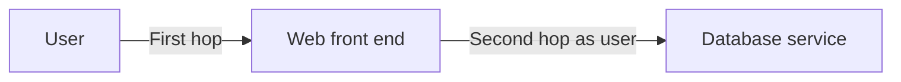
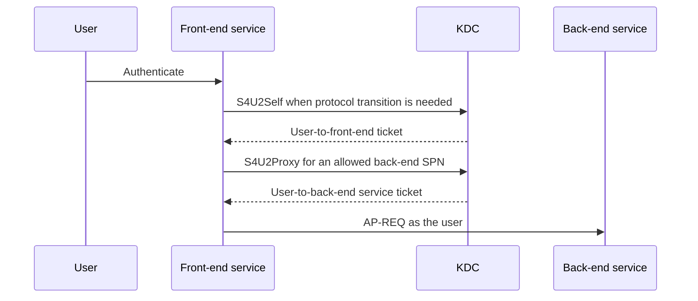

# Kerberos Delegation Explained: KCD, Protocol Transition and RBCD

**Kerberos delegation solves the second hop by allowing a front-end service to obtain a back-end service ticket in a user's name. The security question is who grants that right, to which service, and from which initial authentication.**

> 🎯 **TL;DR**
>
> - Avoid unconstrained delegation.
> - Traditional KCD stores allowed back-end SPNs on the front-end account.
> - Protocol transition uses S4U2Self when the user did not present Kerberos to the front end.
> - RBCD stores allowed front-end principals on the back-end account.
> - RBCD shifts control to the resource owner and supports cross-domain scenarios.
> - SPN ownership, account ACLs and the identity running the service are part of the security boundary.

---

## 🧭 1 — The Second-Hop Problem

A user authenticates to a web service, which must access a database as that user:



Without delegation, the front end normally has only its own service identity for the second hop. Forwarding a password is not the Kerberos solution. Delegation lets the KDC issue a constrained service ticket representing the user.

---

## 🎟️ 2 — Tickets and S4U in One View

| Operation | Purpose |
|---|---|
| **AS exchange** | User obtains a TGT |
| **TGS exchange** | User obtains a service ticket to the front end |
| **S4U2Self** | Front end obtains a ticket to itself for a named user |
| **S4U2Proxy** | Front end exchanges an eligible user ticket for a ticket to an allowed back end |



S4U does not give a service the user's password or TGT. It gives the service a KDC-mediated path to a specific service ticket.

---

## 🧱 3 — Compare the Delegation Models

| Model | Configuration lives on | Scope | Recommended use |
|---|---|---|---|
| **Unconstrained** | Front-end account | Broad; receives reusable delegated credentials | Retire wherever possible |
| **Traditional KCD** | Front-end account | Listed back-end SPNs | Same-domain and centrally administered applications |
| **KCD with protocol transition** | Front-end account | Listed SPNs, even when first hop is not Kerberos | Only when the application requires transition |
| **RBCD** | Back-end account | Listed front-end security principals | Preferred when resource owners should control trust |

The storage direction is the easiest way to remember the difference:

```text
Traditional KCD:
  FRONTEND.msDS-AllowedToDelegateTo = back-end SPNs

RBCD:
  BACKEND.msDS-AllowedToActOnBehalfOfOtherIdentity = front-end principals
```

---

## ➡️ 4 — Traditional KCD

Traditional constrained delegation answers:

> Which services may this front-end identity delegate users to?

The `msDS-AllowedToDelegateTo` attribute on the front-end service account contains exact back-end SPNs.

```powershell
$FrontEnd = 'WEB01'
$BackEndSpns = @(
    'HTTP/api01.contoso.com'
    'MSSQLSvc/sql01.contoso.com:1433'
)

Set-ADComputer -Identity $FrontEnd `
    -Replace @{ 'msDS-AllowedToDelegateTo' = $BackEndSpns }
```

Inspect both delegation configuration and SPNs:

```powershell
Get-ADComputer WEB01 -Properties `
    msDS-AllowedToDelegateTo, TrustedToAuthForDelegation |
    Select-Object Name, msDS-AllowedToDelegateTo, `
        TrustedToAuthForDelegation

setspn.exe -Q HTTP/api01.contoso.com
setspn.exe -Q MSSQLSvc/sql01.contoso.com:1433
```

With **Kerberos only**, the front end needs an eligible Kerberos service ticket from the user. It cannot turn an arbitrary non-Kerberos first hop into a delegated identity.

---

## 🔄 5 — Protocol Transition

Protocol transition allows the front end to assert a user identity through S4U2Self before S4U2Proxy. In the traditional model, this is the **Use any authentication protocol** option and sets `TrustedToAuthForDelegation`.

```powershell
Set-ADAccountControl -Identity 'WEB01$' `
    -TrustedToAuthForDelegation $true
```

This is a larger trust grant than Kerberos-only KCD. A compromised front-end service can request a ticket to itself for users without possessing their credentials, then attempt delegation to its configured back ends.

Use it only when:

- the application genuinely receives a non-Kerberos first hop;
- the front-end identity is dedicated and tightly administered;
- back-end SPNs are minimal and exact;
- sensitive users are protected from delegation;
- service-host compromise is in the threat model.

---

## ⬅️ 6 — Resource-Based Constrained Delegation

RBCD reverses the decision:

> Which front-end principals may act on behalf of users to this resource?

The authorization is stored as a security descriptor in `msDS-AllowedToActOnBehalfOfOtherIdentity` on the back-end account. PowerShell exposes it through `PrincipalsAllowedToDelegateToAccount`.

```powershell
$FrontEnd = Get-ADComputer -Identity WEB01
$Current = (Get-ADComputer -Identity API01 `
    -Properties PrincipalsAllowedToDelegateToAccount).
    PrincipalsAllowedToDelegateToAccount

$Allowed = @($Current) + $FrontEnd |
    Sort-Object DistinguishedName -Unique

Set-ADComputer -Identity API01 `
    -PrincipalsAllowedToDelegateToAccount $Allowed
```

Read the effective list:

```powershell
Get-ADComputer API01 `
    -Properties PrincipalsAllowedToDelegateToAccount |
    Select-Object -ExpandProperty PrincipalsAllowedToDelegateToAccount
```

Remove all RBCD authorization only when that is the intended change:

```powershell
Set-ADComputer -Identity API01 `
    -PrincipalsAllowedToDelegateToAccount $null
```

> ⚠️ Setting this property replaces the security descriptor. Preserve existing principals when adding one.

---

## 🌐 7 — Why RBCD Is Different

RBCD has three important properties:

1. The back-end resource owner controls which front ends it trusts.
2. It can support front-end and resource services in different domains.
3. The KDC permits protocol transition for the RBCD flow as though the traditional transition bit were set.

That third property is frequently missed. Do not assume RBCD is "Kerberos-only KCD configured backwards." The resource authorization and the service's ACLs are the controlling boundaries.

Windows adds identity-assertion SIDs that a back end can use in access control:

| SID | Meaning |
|---|---|
| `S-1-18-1` | Authentication authority asserted the identity from client credentials |
| `S-1-18-2` | A service asserted the identity through protocol transition |

A sensitive back end can distinguish those paths in its authorization policy.

---

## 🪪 8 — SPNs and Service Identities

Delegation is evaluated for the account running the service and the SPN requested by the client. Common failures include:

- the SPN is missing;
- the SPN is duplicated;
- the client uses an alias with no matching SPN;
- the SPN belongs to a different account than the service process;
- a service moved from a computer account to a gMSA but delegation did not move;
- the client falls back to NTLM before the expected Kerberos path begins.

```powershell
setspn.exe -Q HTTP/app.contoso.com
setspn.exe -X -F

Get-ADServiceAccount WebApp01 -Properties ServicePrincipalNames |
    Select-Object Name, ServicePrincipalNames
```

Prefer a dedicated gMSA or service account when multiple hosts share one service identity. Configure delegation on the identity that owns the SPN, not merely on the server where the executable happens to run.

---

## 🛡️ 9 — Security Boundaries

Delegation can be blocked for sensitive identities:

```powershell
Set-ADAccountControl -Identity 'Tier0Admin' `
    -AccountNotDelegated $true
```

Membership in **Protected Users** adds further authentication protections and prevents delegation scenarios that require forwardable credentials.

For RBCD, write access to the back-end computer object or specifically to `msDS-AllowedToActOnBehalfOfOtherIdentity` is security-sensitive. An attacker who can control that value and a front-end principal can create an impersonation path.

Audit:

```powershell
Get-ADComputer -LDAPFilter `
    '(msDS-AllowedToActOnBehalfOfOtherIdentity=*)' `
    -Properties PrincipalsAllowedToDelegateToAccount |
    Select-Object Name, PrincipalsAllowedToDelegateToAccount

Get-ADObject (Get-ADDomain).DistinguishedName `
    -Properties ms-DS-MachineAccountQuota |
    Select-Object ms-DS-MachineAccountQuota
```

Also review who can create computer accounts and who can modify target computer/service-account ACLs.

### Who is allowed to configure delegation?

The administrator configuring delegation and the service using delegation are different principals. Do not assign **Enable computer and user accounts to be trusted for delegation** to an application account merely because the application uses S4U.

For AD DS administration, `SeEnableDelegationPrivilege` is evaluated on the DC processing the change. Granting it on an administrative workstation or member server does not grant the corresponding AD authority. It also does not grant write access to directory objects.

| Configuration change | Object holding the setting | Administrative checks |
|---|---|---|
| Unconstrained delegation: `TrustedForDelegation` | Front-end computer or service account, `userAccountControl` | Relevant object-write permissions and the delegation privilege for the protected UAC change |
| Protocol transition: `TrustedToAuthForDelegation` | Front-end account, `userAccountControl` | Relevant object-write permissions and the delegation privilege; not a substitute for the traditional KCD target list |
| Traditional KCD destinations: `msDS-AllowedToDelegateTo` | Front-end account | Write access plus `SeEnableDelegationPrivilege`; MS-ADTS explicitly requires the privilege when this attribute is modified |
| RBCD: `msDS-AllowedToActOnBehalfOfOtherIdentity` | Back-end resource account | Permission to write the resource's RBCD descriptor; this is not gated by the same delegation privilege |

The RBCD descriptor identifies which front ends the KDC may accept for delegation. The outer directory object's DACL determines who may **change that descriptor**. Those are two different authorization decisions.

Audit direct and inherited attribute-write permissions and paths that can change the DACL or ownership. Do not equate an object owner with an unconditional right to write every attribute; evaluate the effective ACL and the applicable owner-rights protections. A UI checkbox being unavailable is not an effective-permission audit either.

For a failed administrative change, identify the DC that processed it, check that DC's effective User Rights Assignment and the caller's applicable group/token state, then inspect write permissions on the exact front-end or back-end object. `whoami /priv` on the administrator's workstation does not report rights evaluated on a remote DC.

Keep this authority limited to the administrators managing the affected service identities. Broadly delegating Full Control or the delegation privilege to a help-desk group creates a much larger authority than managing one application's configuration. Use [Auditing User Rights Assignment Across Windows Systems](../How-to/Auditing%20User%20Rights%20Assignment%20Across%20Windows%20Systems.md) for the policy side, and review AD object ACLs separately.

---

## 🔎 10 — Troubleshooting Workflow

1. Identify the user, front-end service identity and back-end SPN.
2. Prove the first-hop protocol; do not infer Kerberos from a successful login.
3. Verify unique SPN ownership.
4. Read delegation from the correct object and direction.
5. Check `AccountNotDelegated`, Protected Users and authentication policies.
6. Purge only the test session's ticket cache, then reproduce.
7. Inspect KDC event 4769 and service-side event 4624.

```powershell
klist.exe
klist.exe get HTTP/api01.contoso.com

Get-WinEvent -FilterHashtable @{
    LogName = 'Security'
    Id      = 4769
} -MaxEvents 20 |
    Select-Object TimeCreated, Id, Message
```

Useful failure distinctions:

| Symptom | Likely area |
|---|---|
| `KDC_ERR_S_PRINCIPAL_UNKNOWN` | Missing or malformed SPN |
| `KDC_ERR_PRINCIPAL_NOT_UNIQUE` | Duplicate SPN |
| First hop uses NTLM unexpectedly | DNS alias, SPN or client configuration |
| S4U2Proxy denied | Delegation direction, target SPN or user protection |
| Ticket exists but access denied | Back-end authorization, not Kerberos issuance |

---

## ✅ 11 — Design Checklist

- Use RBCD when resource owners should control incoming delegation.
- Use traditional KCD only for an explicit application requirement.
- Enable protocol transition only when the first hop requires it.
- Avoid unconstrained delegation.
- Give each service a dedicated, managed identity.
- Keep SPNs unique and exact.
- Mark privileged accounts as non-delegable and use Protected Users where compatible.
- Protect ACLs on service and computer objects.
- Monitor RBCD attributes and delegation-related UAC flags.
- Validate the full client → front end → KDC → back end path.

The core distinction is:

> **Traditional KCD says where a front end may delegate. RBCD says which front ends a resource will trust.**

---

## 📚 References

- [Kerberos constrained delegation overview](https://learn.microsoft.com/en-us/windows-server/security/kerberos/kerberos-constrained-delegation-overview)
- [MS-SFU: Kerberos Protocol Extensions for Service for User](https://learn.microsoft.com/en-us/openspecs/windows_protocols/ms-sfu/3bff5864-8135-400e-bdd9-33b552051d94)
- [Set-ADComputer](https://learn.microsoft.com/en-us/powershell/module/activedirectory/set-adcomputer)
- [Set-ADAccountControl](https://learn.microsoft.com/en-us/powershell/module/activedirectory/set-adaccountcontrol)
- [Protected Users security group](https://learn.microsoft.com/en-us/windows-server/security/credentials-protection-and-management/protected-users-security-group)
- [Enable computer and user accounts to be trusted for delegation](https://learn.microsoft.com/en-us/windows/security/threat-protection/security-policy-settings/enable-computer-and-user-accounts-to-be-trusted-for-delegation)
- [MS-ADTS: modify-operation security considerations](https://learn.microsoft.com/en-us/openspecs/windows_protocols/ms-adts/c714e48c-ea21-48b0-913d-fc065ab3dda3)