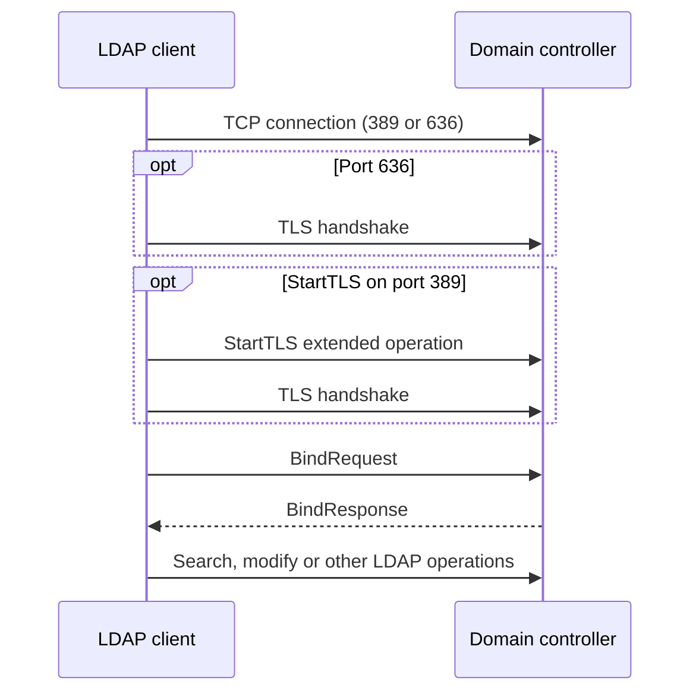

# LDAP Bind Anatomy: Anonymous, Simple, SASL, Kerberos and TLS

An LDAP connection is not automatically an authenticated session. The client first opens a transport, then normally sends a **BindRequest** that establishes the authentication state used by later searches and updates. The bind method, the selected authentication protocol, and the transport protection are related, but they are not the same decision.

> **TL;DR**
>
> - A bind establishes the LDAP connection's authentication state; it does not encrypt LDAP by itself.
> - A simple bind sends a distinguished name and password in a form that must be protected by TLS.
> - SASL is a framework. In Windows environments, GSS-SPNEGO (`Negotiate`) normally selects Kerberos when possible and can fall back to NTLM.
> - LDAP signing provides integrity. SASL sealing or TLS provides confidentiality. Channel binding ties authentication to a particular TLS channel.
> - Port 636 starts TLS before LDAP. StartTLS upgrades an existing connection on port 389 before credentials are sent.

## 1. Connection, TLS and bind are separate stages

The basic sequence is:



These stages answer different questions:

| Stage | Question |
|---|---|
| TCP connection | Can the client reach the LDAP service? |
| TLS handshake | Is the server certificate trusted, and is the transport encrypted? |
| LDAP bind | Which identity, if any, is associated with this connection? |
| Authorization | May that identity read or modify the requested object or attribute? |

A successful TLS handshake does not authenticate an LDAP user. A successful bind does not prove that subsequent LDAP messages are confidential.

## 2. The bind changes connection state

An LDAP bind is not a permanent login to the directory. It changes the authentication state of one LDAP connection. Operations sent on that connection are evaluated using that state until the connection is closed or rebound.

Before a successful authenticated bind, the connection is unauthenticated. Active Directory then applies its anonymous-access behavior. In a default modern AD DS environment, anonymous access is tightly restricted, although the RootDSE can expose discovery information without an authenticated bind.

Do not confuse these cases:

| Case | What the client sends | Resulting state |
|---|---|---|
| No bind yet | No BindRequest | Unbound/unauthenticated connection |
| Anonymous simple bind | Empty name and empty password | Anonymous state |
| Simple bind with credentials | Name and password | Authenticated if accepted |
| SASL bind | Mechanism-specific token exchange | Authenticated if the selected mechanism succeeds |

An empty password is especially dangerous in application code. Depending on server and API behavior, it can result in an anonymous bind instead of a failed password authentication. Applications should reject missing secrets before calling the LDAP library.

## 3. Simple bind

A simple bind carries two LDAP fields:

1. A name, commonly the user's distinguished name or another AD-supported name form.
2. A password.

The password is not protected by the simple-bind mechanism. Base64 seen in an LDAP packet display is encoding, not encryption. A simple bind must therefore run only after a trusted TLS channel has been established.

Safe patterns are:

- LDAPS on TCP 636, where TLS starts immediately.
- StartTLS on TCP 389, where the client upgrades the connection before sending the bind.

Unsafe patterns include a simple bind over clear TCP 389 and any client that silently continues after StartTLS fails. Requiring LDAP signing on domain controllers rejects simple binds over nonencrypted connections.

## 4. SASL is a framework, not a protocol name

Simple Authentication and Security Layer (SASL) lets LDAP use an authentication mechanism and optionally negotiate message integrity or confidentiality. Active Directory supports mechanisms including `GSS-SPNEGO`, `GSSAPI`, `EXTERNAL`, and `DIGEST-MD5`, although modern Windows-integrated clients primarily use SPNEGO or GSSAPI.

The terms commonly seen in Windows tools map as follows:

| Label | Meaning |
|---|---|
| SASL | Framework used by the LDAP bind |
| GSS-SPNEGO / Negotiate | Negotiates an underlying security protocol |
| Kerberos | Preferred protocol when prerequisites such as SPNs and connectivity are satisfied |
| NTLM | Possible Negotiate fallback when Kerberos cannot be used |
| GSSAPI | Kerberos-oriented GSS-API mechanism |

`Negotiate` in a log or API does not prove that Kerberos was used. Confirm the selected protocol with tickets, security events, ETW, or a packet trace.

## 5. Kerberos and the LDAP SPN

For Kerberos, the client requests a service ticket for the LDAP service, normally an SPN such as:

```text
ldap/dc01.example.com
```

The client must use a name that can be mapped to the correct SPN. Connecting by IP address, using an unexpected alias, missing DNS information, duplicate SPNs, or unavailable KDC connectivity can prevent Kerberos. Negotiate may then select NTLM if policy and the calling application permit it.

Useful checks include:

```powershell
# Inspect tickets in the current logon session.
klist

# Ask AD for registrations that match the LDAP service name.
setspn -Q ldap/dc01.example.com

# Verify name resolution before blaming authentication.
Resolve-DnsName dc01.example.com
```

Run `klist` in the security context of the affected process. A ticket in an administrator's interactive session says nothing about a service running under another account.

## 6. Signing, sealing, TLS and channel binding

These controls solve different problems:

| Control | Integrity | Confidentiality | Binds authentication to TLS |
|---|---:|---:|---:|
| Unsigned LDAP | No | No | No |
| SASL signing | Yes | No | No |
| SASL sealing | Yes | Yes | No |
| TLS (LDAPS or StartTLS) | Yes | Yes | Not by itself |
| TLS plus channel binding | Yes | Yes | Yes |

**LDAP signing** protects LDAP messages against undetected modification. **Sealing** encrypts the SASL-protected LDAP payload. **TLS** protects the transport and authenticates the server when certificate validation succeeds. **Channel binding** uses a Channel Binding Token to prove that the application authentication happened over the same TLS channel.

Channel binding is relevant to authentication over TLS; it is not a replacement for certificate validation. A client still needs to trust the issuing CA and connect with a name covered by the certificate.

For rollout procedures, use the existing guides:

- [Audit and Enforcement for LDAP Signing](../Hardening/Audit%20and%20Enforcement%20for%20LDAP%20Signing.md)
- [Audit and Enforcement for Channel Binding Token](../Hardening/Audit%20and%20Enforcement%20for%20Channel%20Binding%20Token.md)
- [Audit LDAP Binds and Queries with Regedit](../Hardening/Audit%20LDAP%20Binds%20and%20Queries%20with%20Regedit.md)

## 7. LDAPS and StartTLS

Both choices can provide TLS protection, but their startup differs:

| Mode | Typical port | First application exchange |
|---|---:|---|
| LDAPS | 636 | TLS handshake, then LDAP |
| Global Catalog over TLS | 3269 | TLS handshake, then LDAP |
| StartTLS | 389 | LDAP StartTLS extended operation, then TLS handshake |

For LDAPS, a domain controller certificate must include Server Authentication, have an associated private key, chain to a CA trusted by the client, and identify the server name used by the client. StartTLS has the same certificate-validation requirement.

Never describe port 389 as necessarily cleartext. It can carry signed and sealed SASL traffic or be upgraded with StartTLS. Conversely, seeing port 636 proves that TLS was attempted, not that the client correctly validated the certificate.

## 8. Windows Server 2025 behavior

New Windows Server 2025 Active Directory deployments have a stronger default LDAP posture than older deployments. Microsoft documents LDAP signing enforcement for new deployments, channel binding set to **When supported**, client encryption preferred by default, and channel-binding auditing enabled. Upgrades preserve existing policy to avoid silently breaking legacy clients.

Windows Server 2025 also supports TLS 1.3 for LDAP over TLS through Schannel. This does not remove the need to inventory bind types, validate certificates, or remediate clients that request unsigned communication.

Treat defaults as deployment context, not as proof of effective policy. Verify the domain controller policies and observe actual client behavior.

## 9. Troubleshooting with LDP and logs

### Test the transport first

```powershell
Test-NetConnection dc01.example.com -Port 389
Test-NetConnection dc01.example.com -Port 636
```

A successful TCP test proves only that something accepted the connection. It does not validate LDAP, TLS, the certificate, or credentials.

With `ldp.exe`:

1. Use **Connection > Connect** and specify the server FQDN.
2. For LDAPS, use port 636 and select **SSL**.
3. Use **Connection > Bind** only after the connection succeeds.
4. Record the selected bind method instead of reporting only that the bind worked.

For StartTLS, use a client that explicitly supports the StartTLS LDAP extended operation. Do not emulate it by selecting the SSL option for port 389.

### Inspect domain controller events

The Directory Service log can identify clients that still use insecure binds. Common evidence includes:

| Event | Practical meaning |
|---:|---|
| 2886 | The domain controller does not require LDAP signing |
| 2887 | Summary of unsigned binds observed during the interval |
| 2889 | Per-client insecure-bind details when the required diagnostics are enabled |
| 3039 | A channel-binding problem or missing CBT under the applicable policy |
| 3074 / 3075 | Newer channel-binding audit detail on supported systems |

Event availability and wording depend on OS updates and audit configuration. Use events to identify the client, then inspect that application's LDAP API settings and packet behavior.

### Read a packet trace by layers

When reviewing a trace, answer in order:

1. Which destination name and port did the client use?
2. Was there a TLS handshake or StartTLS operation?
3. If TLS was used, did certificate validation succeed on the client?
4. Was the bind simple or SASL?
5. If SASL used Negotiate, did it select Kerberos or NTLM?
6. Were LDAP messages signed or sealed?
7. Did the server return an LDAP result code, or did a lower layer fail first?

This avoids treating every `invalidCredentials`, `strongerAuthRequired`, TLS alert, or connection reset as the same problem.

## 10. A practical decision table

| Client capability | Recommended approach |
|---|---|
| Windows-integrated application | SASL Negotiate with signing or sealing; verify Kerberos where expected |
| Cross-platform application with username/password | Simple bind only over validated TLS |
| Client supports StartTLS correctly | Upgrade before binding and fail closed if TLS cannot be established |
| Legacy client supports neither signing nor TLS | Upgrade, replace, or isolate it; do not weaken every DC indefinitely |

The secure outcome is not tied to one port or one API checkbox. It comes from a valid combination of authentication, integrity, confidentiality, certificate validation, and policy enforcement.

## References

- [LDAP signing for Active Directory Domain Services](https://learn.microsoft.com/en-us/windows-server/identity/ad-ds/ldap-signing)
- [Configure certificates for LDAP over SSL in Active Directory Domain Services](https://learn.microsoft.com/en-us/windows-server/identity/ad-ds/configure-ldap-signing-certificates)
- [MS-ADTS: SASL Authentication](https://learn.microsoft.com/en-us/openspecs/windows_protocols/ms-adts/989e0748-0953-455d-9d37-d08dfbf3998b)
- [MS-ADTS: Simple Authentication](https://learn.microsoft.com/en-us/openspecs/windows_protocols/ms-adts/8d14201e-ea25-4bdf-a71e-2d0d699a7e7f)
- [LDAP session security settings and requirements](https://learn.microsoft.com/en-us/troubleshoot/windows-server/active-directory/enable-ldap-signing-in-windows-server)