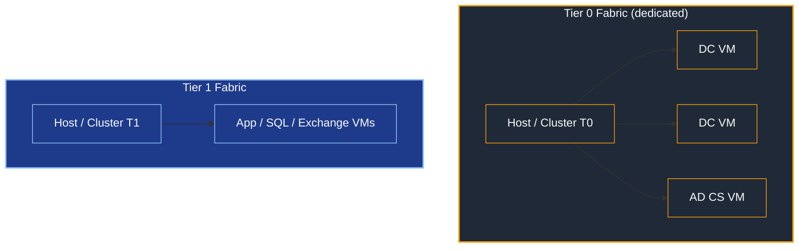

# Securing the Hyper-V Fabric Hosting Domain Controllers and Tier 0 Assets

## Introduction

When a Domain Controller — or any other Tier 0 asset (AD CS, AD FS, Entra Connect) — runs as a virtual machine, the **hypervisor that hosts it becomes part of the identity control plane**. Whoever controls the host controls the guest: they can mount its virtual disk, dump its memory, attach a debugger, or clone it offline. For a DC, that means walking away with `NTDS.dit` and the entire forest.

This article is a **concept and architecture** guide, not a Hyper-V configuration deep dive — virtualization is its own discipline, and the host-OS hardening itself belongs to the platform team and the security baselines. The goal here is to answer the questions an **identity architect** must own: *which tier does the fabric belong to, who is allowed to administer it, and what design choices keep a virtualized DC from quietly becoming the weakest link.* Examples use **Hyper-V**, with **VMware (vSphere/ESXi)** parallels where they matter; the principles apply to both, standalone or clustered.

> **🔵 Important — scope.** This is on-prem, identity-architecture guidance. It defines tiering, administration model, and design decisions for the virtualization fabric. It does **not** reproduce Hyper-V/VMware build procedures or OS hardening — those are deported to the platform team and the **Microsoft Security Baselines / Security Compliance Toolkit** (and the 040 endpoint-hardening material). It complements the [Active Directory Tiering Model for On-Prem Environment](Active%20Directory%20Tiering%20Model%20for%20On-Prem%20Environment.md) and the [Active Directory Design Guidelines (Architecture Overview)](Active%20Directory%20Design%20Guidelines%20%28Architecture%20Overview%29.md).

### 🎨 Reading Legend

- 🔴 Critical: security boundary or compromise risk
- 🟡 Warning: high chance of lockout or operational breakage
- 🔵 Important: deployment constraint or sequencing requirement
- 🟢 Recommendation: best practice to improve resilience
- ⚠️ Caution: a common design mistake or nuance worth pausing on

---

## 1. The Core Principle: the Fabric Inherits the Tier of its Highest Guest

A virtualization host is **not** a neutral box that merely "runs" workloads. The host administrator has **total control over every guest**: mount or copy a VHDX, snapshot and revert, capture live memory, attach a kernel debugger, or read the VM's saved state. None of these touch the guest OS login — they bypass it entirely.

The consequence is a single rule that drives the rest of this article:

> **🔴 A host inherits the tier of the highest-tiered guest it runs.** A host that runs a Domain Controller **is a Tier 0 system**. A host that runs any Tier 0 asset is Tier 0. A host that runs only Tier 1 workloads is Tier 1. The host can never be *lower* than its most sensitive guest.

This is the **clean-source principle** applied to the fabric layer: the security of an object depends on the security of everything that can control it. A DC's security therefore depends on its host, its host's storage, its host's backup system, and its host's administrators — all of which are pulled up to Tier 0.

> **⚠️ The classic mistake:** assuming the platform's `T1-N2-Hyper-V` admins can manage the host that runs the DCs "because it's just virtualization." Giving a Tier 1 admin control of a host that runs a DC is functionally identical to **handing them Domain Admin**. The virtualization job title does not change the tier of the asset.

| Mechanism on the host | What it gives an attacker on a DC guest |
|-----------------------|-----------------------------------------|
| Mount / copy the VHDX | Offline copy of `NTDS.dit` → DCSync-equivalent, full credential dump |
| Capture live memory / saved state | LSASS secrets, Kerberos keys, the `krbtgt` hash in memory |
| Snapshot + revert | USN rollback risk; replay of a previous AD state |
| Attach a debugger / inject | Arbitrary code in the DC's kernel context |

> **VMware parallel:** the same holds for an ESXi host and vCenter. A vCenter administrator who can manage the cluster running the DCs is a Tier 0 principal; vCenter itself becomes a Tier 0 management system.

---

## 2. Architecture Decision: Dedicated Tier 0 Fabric vs. Mixed Fabric

The first design decision is whether Tier 0 guests share hosts with lower-tier workloads.

> **🟢 Recommendation: run Tier 0 guests on a dedicated, physically separate fabric.** A host (or cluster) that runs DCs and Tier 0 assets should run **nothing else** — no Tier 1 application VMs, no Tier 2 desktops. The moment a lower-tier guest shares the host, a **hypervisor escape** from that less-trusted guest lands directly on the DCs.

| Option | What it means | Verdict |
|--------|---------------|---------|
| **Dedicated T0 fabric** | Separate hosts/cluster for DCs + T0 assets only | **Recommended** — clean blast radius, simplest to reason about |
| **Mixed fabric** | T0 guests share hosts with T1/T2 guests | **Avoid** — a lower-tier guest escape reaches the DCs; the whole host is forced to T0 anyway, so you lose the "savings" |

> **🔵 The "savings" of a mixed fabric are an illusion.** Because the host inherits Tier 0 the instant it runs one DC, every other guest on it must *also* be treated as Tier 0 (storage, backup, admins). You don't save a host — you contaminate the workloads that share it. A dedicated fabric is usually *cheaper* in total once you account for that.

> **🟢 Keep at least one physical DC where practical.** Virtualizing 100% of DCs makes the entire identity plane depend on the fabric's availability and integrity. A single physical DC (or a DC on an independent fabric) is a valuable recovery anchor — see forest recovery in the Design Guidelines.

---

## 3. Administration Model for the Tier 0 Host

If the host is Tier 0, it is administered **exactly like any other Tier 0 system**.

- **🔴 Administered by Tier 0 accounts only.** The host's local administrators and hypervisor-management rights go to dedicated **Tier 0 admin accounts**, never to `T1-N2-Hyper-V` or general virtualization staff. If your platform team must operate it, they need *Tier 0 identities and Tier 0 PAWs* for that task — they do not get to use their Tier 1 credentials.
- **🔴 Managed from a Tier 0 PAW.** All host management (Hyper-V Manager, Failover Cluster Manager, PowerShell remoting, the console) happens from a **Tier 0 Privileged Access Workstation**, over the Tier 0 admin path — never from a general-purpose admin desktop. See the PAW section of the Tiering Model.
- **🔴 No lower-tier management plane.** A Tier 0 host is **not** enrolled in a Tier 1 management product. No SCVMM/MECM/Intune instance that also manages Tier 1 may manage it (that would make the T0 host controllable from T1). If you use SCVMM for the T0 fabric, that SCVMM instance is itself Tier 0 and dedicated.
- **🟢 Minimal parent partition.** Install the host as **Server Core** (or the equivalent minimal footprint), run no extra roles or agents in the parent partition, and keep its attack surface as small as a DC's. The parent partition is a Tier 0 surface.
- **🟢 Domain membership choice.** Joining the T0 hosts to the production domain they host creates a **circular dependency** (the fabric needs AD to authenticate; AD needs the fabric to run). Options: keep a physical DC so authentication never fully depends on the fabric, accept the dependency with documented break-glass, or — at high assurance — a separate **management/bastion forest** for the fabric. Pick deliberately and document it.

> **⚠️ "Hyper-V Administrators" is not a least-privilege group.** Membership in the local `Hyper-V Administrators` group grants full control of all guests, including the DCs — it is a Tier 0 grant. Treat it with the same care as `Domain Admins`. (VMware: any vCenter role with VM device/console/snapshot rights on the DC VMs is equivalent.)

---

## 4. Storage and the VHDX Problem

A Domain Controller's virtual disk **is** `NTDS.dit`. Anyone who can read that file off the storage layer has the credential database — no logon required.

- **🔴 The storage layer is Tier 0.** The SAN/NAS/S2D volume, the storage fabric, and the **storage administrators** for the DC VHDX files are all Tier 0. A storage admin who can copy a LUN can copy a DC.
- **🟢 Isolate Tier 0 storage.** DC and Tier 0 VHDX files live on **dedicated volumes/datastores** that lower-tier storage operators cannot reach. Don't park a DC disk on the general VM datastore.
- **🟢 Encrypt the guest at rest.** Use **BitLocker inside the DC guest** backed by a **virtual TPM (vTPM)** so the disk content is protected even if the VHDX is copied off the host. (VMware: VM encryption + vTPM.) This raises the bar on an offline-disk-theft path.
- **🔵 vTPM keys are themselves Tier 0.** Enabling vTPM/guest encryption introduces a key-protection dependency (Hyper-V Key Protector / Host Guardian, or vCenter's KMS). Whoever holds those keys can unlock the guest → that key service is Tier 0. Guarded Fabric formalizes this (§7).

---

## 5. Backup and Snapshots

Backup is the most commonly overlooked Tier 0 contamination path.

> **🔴 A host-level backup of a DC is a copy of `NTDS.dit`.** If your backup system images the DC VM from the host, those backup files — and the backup infrastructure, its operators, and its restore console — are **Tier 0**. A backup admin who can restore a DC image anywhere can extract the forest.

- **🟢 Prefer in-guest system-state backup** for DCs over host-level VM images, so the AD recovery artifact follows the AD-aware, Tier 0 backup path rather than the general VM-backup path. At minimum, ensure DC backups are AD-consistent and Tier 0-scoped.
- **🔴 A snapshot is not a backup.** Snapshots/checkpoints are not a recovery strategy for AD — you still need a real **system-state backup** and a **tested forest-recovery procedure**. (See forest recovery in the Design Guidelines.)
- **🔴 USN rollback / VM-GenerationID.** Reverting a DC to an earlier snapshot can cause **USN rollback** and silent replication divergence. Modern hypervisors expose a **VM-GenerationID** that lets the DC detect the revert, reset its `InvocationID` and discard its RID pool to re-converge safely — but this only works if the hypervisor exposes it, and it does **not** make snapshots a substitute for backup. (Detailed in [Design Guidelines §6.4](Active%20Directory%20Design%20Guidelines%20%28Architecture%20Overview%29.md).)

---

## 6. Live Migration, Clustering, and the Network Fabric

Clustering a Tier 0 fabric is supported and often desirable for availability — but it moves **DC memory and state across the network**, which adds requirements.

- **🔴 Live Migration moves the DC's live memory** (and thus its secrets) between hosts. That traffic must be **encrypted and authenticated** (Hyper-V: Kerberos/CredSSP with constrained delegation, or SMB encryption for storage; VMware: encrypted vMotion) and must run on an **isolated Tier 0 network**, never on a shared/flat management LAN.
- **🔴 No mixed-tier cluster.** Every node of a cluster that hosts DCs is Tier 0, and Tier 0 memory may transit any node during migration. A cluster that mixes T0 and lower-tier nodes lets T0 state land on a lower-tier host — **forbidden**. Cluster boundaries must align with tier boundaries.
- **🔵 Tier 0 fabric networks are Tier 0.** The management OS network, the live-migration network, the cluster/heartbeat network, and the storage network for the T0 fabric are all **isolated Tier 0 segments**. Apply the same host-isolation logic used elsewhere (segment by tier; restrict management endpoints to the Tier 0 PAW path).
- **⚠️ Beware host time integration on virtualized DCs.** A hypervisor that forces guest time sync can override the AD time hierarchy and reintroduce skew. **Let the AD hierarchy own time on DCs** and disable host-to-guest time sync for them.

---

## 7. Guarded Fabric, Shielded VMs, and HGS (Advanced)

For high-assurance environments, Windows Server offers **Guarded Fabric** with **Shielded VMs**, governed by the **Host Guardian Service (HGS)**. The concept — what it buys and what it costs — matters to the architect even though the build-out is a platform-team project.

**What it does (concept):**

- **Attestation:** hosts must prove they are healthy and trusted (TPM-based attestation, measured boot, code integrity) before HGS releases the keys needed to **run** a shielded VM.
- **Shielded VMs:** the guest is encrypted (vTPM + BitLocker), its console/keyboard-video access is blocked, and a host or fabric admin **cannot** read its disk or memory. This directly closes the §1 attack paths (mount VHDX, dump memory) against a rogue or compromised host admin.
- **Result:** it raises the bar so that *being a host administrator is no longer enough* to compromise a DC guest — exactly the separation we want for Tier 0.

**What it costs / what to know:**

- **🔴 HGS is itself Tier 0.** HGS holds the attestation and key-protection authority for the whole guarded fabric — compromising HGS compromises the protection. It must be deployed, isolated, and administered as a **Tier 0 system** (ideally on its own small, dedicated footprint, separate from the fabric it guards). You move the crown jewels, you don't eliminate them.
- **🔵 Attestation mode matters.** Prefer **TPM-trusted attestation** (hardware-rooted, TPM 2.0 + UEFI Secure Boot) over the weaker host-key attestation, which trusts a host on the strength of a key rather than measured health.
- **⚠️ Operational complexity is real.** Guarded Fabric adds moving parts (HGS HA, attestation policies, key management, recovery procedures) and can complicate troubleshooting and DR. Adopt it where the threat model justifies it — not reflexively.
- **VMware parallel:** there is no identical product, but the building blocks overlap — **vTPM + VM encryption + a KMS/native key provider + host attestation (TPM/Secure Boot)** achieve comparable goals with different tooling.

> **🟢 Decision guidance:** if you cannot fully trust every fabric administrator with Tier 0, **Guarded Fabric / Shielded VMs is the mechanism that lets you virtualize DCs without granting the host admin implicit Domain Admin.** If your fabric admins are already vetted Tier 0 staff on a dedicated fabric, a well-isolated standard fabric (§2–§6) may be sufficient — weigh the assurance gain against the complexity.

---

## 8. Anti-Patterns to Avoid

| Anti-pattern | Why it breaks the model |
|--------------|-------------------------|
| Letting `T1-N2-Hyper-V` / platform staff manage the host that runs DCs | Equivalent to granting them Domain Admin (§1, §3) |
| Mixing Tier 0 and Tier 1/2 guests on the same host or cluster | A lower-tier guest escape reaches the DCs (§2) |
| Managing the Tier 0 host from a general admin desktop | Exposes Tier 0 control on a lower-tier workstation — use a Tier 0 PAW (§3) |
| Host-level VM backup of a DC into the general backup system | Makes the backup infra + operators Tier 0 unknowingly (§5) |
| Treating a snapshot as the AD recovery plan | No real backup, USN-rollback risk (§5) |
| DC VHDX on the shared/general datastore | Storage operators can copy `NTDS.dit` (§4) |
| Managing the T0 fabric from a Tier 1 SCVMM/vCenter | The T0 host becomes controllable from Tier 1 (§3) |
| Adopting Guarded Fabric but treating HGS as "just another server" | HGS is Tier 0 — mis-scoping it negates the protection (§7) |

---

## ✅ Design Checklist

- [ ] Every host that runs a DC or Tier 0 asset is classified and treated as **Tier 0**
- [ ] Tier 0 guests run on a **dedicated fabric** (no lower-tier guests on the same host/cluster)
- [ ] At least one recovery anchor exists (physical DC or DC on an independent fabric)
- [ ] Host administration restricted to **Tier 0 accounts**, from a **Tier 0 PAW**
- [ ] No Tier 1 management plane (SCVMM/MECM/vCenter) controls the Tier 0 hosts
- [ ] Parent partition minimized (Server Core, no extra roles/agents)
- [ ] Domain-membership / circular-dependency decision made and documented
- [ ] DC/Tier 0 VHDX files on **isolated Tier 0 storage**; storage admins are Tier 0
- [ ] Guest encryption (BitLocker + vTPM) considered; key-protection service scoped Tier 0
- [ ] DC backups are AD-consistent, in-guest where possible, and Tier 0-scoped
- [ ] Forest-recovery procedure tested (snapshots are not the plan)
- [ ] VM-GenerationID-capable hypervisor confirmed for all virtualized DCs
- [ ] Cluster boundaries align with tier boundaries (no mixed-tier cluster)
- [ ] Live Migration encrypted and on an isolated Tier 0 network
- [ ] Host time sync disabled for DC guests (AD hierarchy owns time)
- [ ] Guarded Fabric / Shielded VMs evaluated; if adopted, **HGS deployed and administered as Tier 0**

---

## References

- [Active Directory Tiering Model for On-Prem Environment](Active%20Directory%20Tiering%20Model%20for%20On-Prem%20Environment.md) — tier definitions, PAW, Deny-logon GPOs, N-level model
- [Active Directory Design Guidelines (Architecture Overview)](Active%20Directory%20Design%20Guidelines%20%28Architecture%20Overview%29.md) — §6.4 FSMO and virtualization, VM-GenerationID, forest recovery
- Microsoft Security Baselines / Security Compliance Toolkit — host OS hardening (deported)
