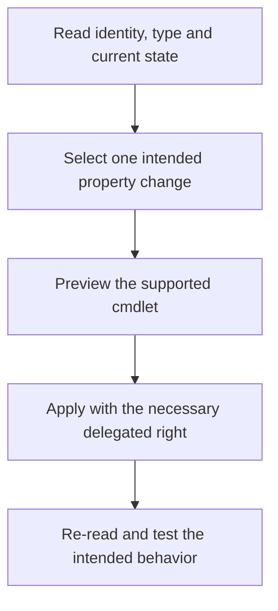

# Understanding UserAccountControl: Flags, Computed State and Safe Changes

**`512` is not a complete account-health diagnosis, and replacing an account's flags with `512` is not a repair strategy.**

`userAccountControl` is an AD bit field. Several independent flags can be set simultaneously, and the decimal value is their combination. Current account state also depends on computed attributes, password policy, object permissions and logon restrictions outside this field.

The interpretation below applies to Windows Server 2022/2025 AD DS. It replaces memorized tables of composite values with explicit bit tests and supported account-management cmdlets.

> **TL;DR**
> - Test individual bits; do not compare the entire attribute with one familiar number.
> - An unset disabled bit does not prove that logon is possible.
> - Read computed lockout/password-expired state separately.
> - "User cannot change password" is an object-permission setting, not a raw UAC-bit toggle.
> - Change the intended property with the AD cmdlets and preserve unrelated settings.

## 1. Understand a composite value

| Value | Relevant bits | What it actually tells you |
|---|---|---|
| `512` / `0x200` | NORMAL_ACCOUNT | Normal user-account type; no ACCOUNTDISABLE bit in this value |
| `514` / `0x202` | NORMAL_ACCOUNT + ACCOUNTDISABLE | Normal user account marked disabled |
| `544` / `0x220` | NORMAL_ACCOUNT + PASSWD_NOTREQD | Password-not-required flag is set; this does not prove the password is blank |
| `66048` / `0x10200` | NORMAL_ACCOUNT + DONT_EXPIRE_PASSWORD | Password age is not enforced through the normal expiration rule for this account |

Testing `userAccountControl -eq 514` misses disabled accounts with additional flags. Test `($value -band 2) -ne 0` instead. These examples describe the bits, not every account's effective authentication behavior.

Do not transfer default user-account values to computer, DC, trust or managed service account objects. Their account type and service-managed state are different.

## 2. Separate stored flags from effective state

| Question | Relevant evidence |
|---|---|
| Is the disabled bit set? | `userAccountControl` ACCOUNTDISABLE; AD module `Enabled` projection |
| Is the account locked out now? | AD module `LockedOut`, `lockoutTime`, effective lockout policy and computed state |
| Is the password expired? | `PasswordExpired`, `msDS-User-Account-Control-Computed`, password policy and `pwdLastSet` |
| When is the password due to expire? | `msDS-UserPasswordExpiryTimeComputed`, including its special values |
| Has the account expired? | `accountExpires` / `AccountExpirationDate`, a different condition from password expiration |
| Can the user change the password? | Change-password permissions on the object; not a direct raw UAC-bit assignment |
| Can the identity log on to this machine? | Account state plus authentication policy, logon rights, denies and the actual protocol |

On current AD DS, do not diagnose lockout or password expiry solely from historical LOCKOUT/PASSWORD_EXPIRED entries in a UAC table. The computed attribute has those state bits. Likewise, a nonzero `lockoutTime` alone is not proof that the lockout duration has not elapsed.

## 3. Read one account from one DC

Use the AD PowerShell module from a management host with directory-read access. Pin the observation to a DC so a recent change is not confused with replication convergence:

```powershell
Import-Module ActiveDirectory -ErrorAction Stop
$domainController = 'dc01.corp.example'
$user = Get-ADUser -Identity 'LabUser' -Server $domainController -Properties `
    userAccountControl, 'msDS-User-Account-Control-Computed',
    'msDS-UserPasswordExpiryTimeComputed', pwdLastSet, lockoutTime,
    LockedOut, PasswordExpired, PasswordNeverExpires, PasswordNotRequired,
    SmartcardLogonRequired, AccountExpirationDate -ErrorAction Stop

$user | Select-Object ObjectGUID, SID, SamAccountName, Enabled,
    userAccountControl, 'msDS-User-Account-Control-Computed',
    LockedOut, PasswordExpired, PasswordNeverExpires, PasswordNotRequired,
    SmartcardLogonRequired, AccountExpirationDate, pwdLastSet, lockoutTime
```

The cmdlet projections are convenient, but retain the raw values and source DC for investigation. Do not publish a full directory export when a scoped account observation answers the question.

## 4. Decode flags without losing unrecognized bits

This helper reports a selected set of commonly useful stored flags. It is an interpretation aid, not a list of values that may safely be written to every account type. Bits outside the listed set remain visible as `UnmappedBits`.

```powershell
function Convert-UserAccountControlFlags {
    [CmdletBinding()]
    param([Parameter(Mandatory)][uint32]$Value)

    $flags = [ordered]@{
        SCRIPT = 0x00000001
        ACCOUNTDISABLE = 0x00000002
        HOMEDIR_REQUIRED = 0x00000008
        PASSWD_NOTREQD = 0x00000020
        ENCRYPTED_TEXT_PWD_ALLOWED = 0x00000080
        TEMP_DUPLICATE_ACCOUNT = 0x00000100
        NORMAL_ACCOUNT = 0x00000200
        INTERDOMAIN_TRUST_ACCOUNT = 0x00000800
        WORKSTATION_TRUST_ACCOUNT = 0x00001000
        SERVER_TRUST_ACCOUNT = 0x00002000
        DONT_EXPIRE_PASSWORD = 0x00010000
        SMARTCARD_REQUIRED = 0x00040000
        TRUSTED_FOR_DELEGATION = 0x00080000
        NOT_DELEGATED = 0x00100000
        USE_DES_KEY_ONLY = 0x00200000
        DONT_REQ_PREAUTH = 0x00400000
        TRUSTED_TO_AUTH_FOR_DELEGATION = 0x01000000
        PARTIAL_SECRETS_ACCOUNT = 0x04000000
    }

    [uint32]$knownMask = 0
    $setFlags = New-Object 'System.Collections.Generic.List[string]'
    foreach ($entry in $flags.GetEnumerator()) {
        [uint32]$mask = $entry.Value
        $knownMask = $knownMask -bor $mask
        if (($Value -band $mask) -ne 0) { $setFlags.Add($entry.Key) }
    }
    [uint32]$unmapped = $Value -band ([uint32]::MaxValue -bxor $knownMask)

    [pscustomobject]@{
        DecimalValue = $Value
        HexValue = '0x{0:X8}' -f $Value
        AccountDisableBitSet = ($Value -band 2) -ne 0
        Flags = $setFlags.ToArray()
        UnmappedBits = '0x{0:X8}' -f $unmapped
    }
}

Convert-UserAccountControlFlags -Value ([uint32]$user.userAccountControl)
```

An unmapped bit is a reason to identify the account type and consult the relevant schema/protocol documentation. It is not permission to clear it. The helper deliberately does not merge the computed attribute into the stored field.

## 5. Use server-side bit matching for inventories

LDAP matching rule `1.2.840.113556.1.4.803` performs a bitwise AND test. For example, inventory disabled user accounts under one OU:

```powershell
Get-ADUser -LDAPFilter '(userAccountControl:1.2.840.113556.1.4.803:=2)' `
    -SearchBase 'OU=Users,DC=corp,DC=example' -SearchScope Subtree `
    -Server $domainController -Properties userAccountControl -ErrorAction Stop |
    Select-Object ObjectGUID, SamAccountName, Enabled, userAccountControl
```

Use `Get-ADUser` for user accounts and select the intended population explicitly. A forest-wide list mixing users, trusts and domain controllers produces misleading remediation candidates.

For PASSWD_NOTREQD, use [Auditing Password-Not-Required Accounts](../Hardening/Auditing%20Password-Not-Required%20Accounts%20in%20Active%20Directory%20-%20PASSWD_NOTREQD%20and%20Safe%20Remediation.md). That flag neither proves an empty password nor justifies rewriting the whole attribute.

## 6. Prefer supported property-level changes



For a selected user whose password-not-required exception has been reviewed, preview the property-level change:

```powershell
Set-ADAccountControl -Identity $user.ObjectGUID -Server $domainController `
    -PasswordNotRequired $false -WhatIf
```

Apply without `-WhatIf` only when the intended change and its dependencies are understood. Use `Enable-ADAccount`, `Disable-ADAccount`, `Unlock-ADAccount`, `Set-ADAccountExpiration` or `Set-ADAccountControl` according to the actual operation. These are not interchangeable fixes for a failed sign-in.

Do not replace the entire `userAccountControl` value with a canned integer. Doing so can erase unrelated delegation, smart-card, password-policy or account-type settings. Even a manual read/modify/write of the complete integer can overwrite a concurrent change.

Some flags are maintained by AD itself or require additional privileges. For delegation behavior and prerequisites, see [Kerberos Delegation Explained](Kerberos%20Delegation%20Explained%20-%20KCD,%20Protocol%20Transition%20and%20RBCD.md). Disabling preauthentication or enabling weak encryption is not a generic sign-in repair.

## 7. Verify what changed and what did not

After an actual change, re-read the same object by its GUID from the selected DC:

```powershell
$after = Get-ADUser -Identity $user.ObjectGUID -Server $domainController `
    -Properties userAccountControl, PasswordNotRequired, PasswordNeverExpires,
        SmartcardLogonRequired -ErrorAction Stop

$after | Select-Object ObjectGUID, SamAccountName, Enabled,
    userAccountControl, PasswordNotRequired, PasswordNeverExpires,
    SmartcardLogonRequired

Convert-UserAccountControlFlags -Value ([uint32]$after.userAccountControl)
```

Compare the before/after intended property and unrelated flags, then check replication to another relevant DC. Test the specific authentication or authorization behavior with a fresh appropriate session. `-WhatIf` should leave the object unchanged.

For expiration, consult the [resultant password-policy guide](Fine-Grained%20Password%20Policies%20-%20Precedence,%20Scope%20and%20Resultant%20Policy.md). A password-policy change can alter calculated expiration without changing the entire stored UAC value.

## References

- [Microsoft: UserAccountControl property flags](https://learn.microsoft.com/en-us/troubleshoot/windows-server/active-directory/useraccountcontrol-manipulate-account-properties)
- [Microsoft: ms-DS-User-Account-Control-Computed](https://learn.microsoft.com/en-us/windows/win32/adschema/a-msds-user-account-control-computed)
- [Microsoft: Set-ADAccountControl](https://learn.microsoft.com/en-us/powershell/module/activedirectory/set-adaccountcontrol)
- [Microsoft: Get-ADUser](https://learn.microsoft.com/en-us/powershell/module/activedirectory/get-aduser)