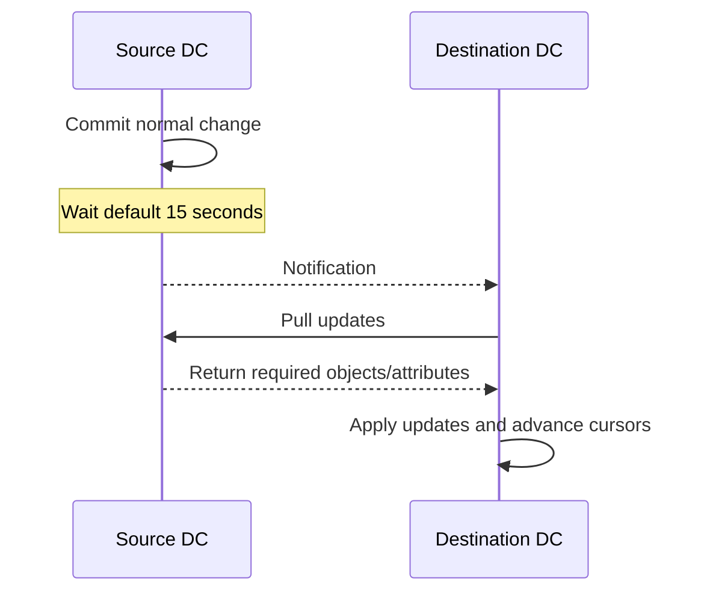
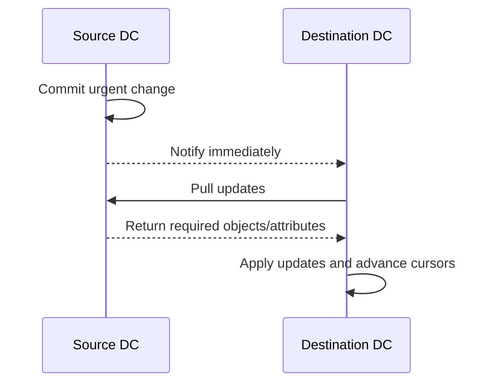
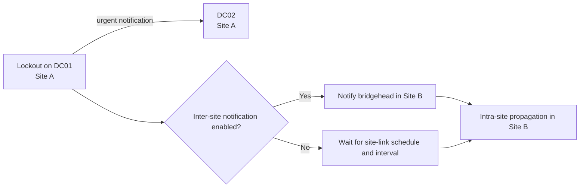
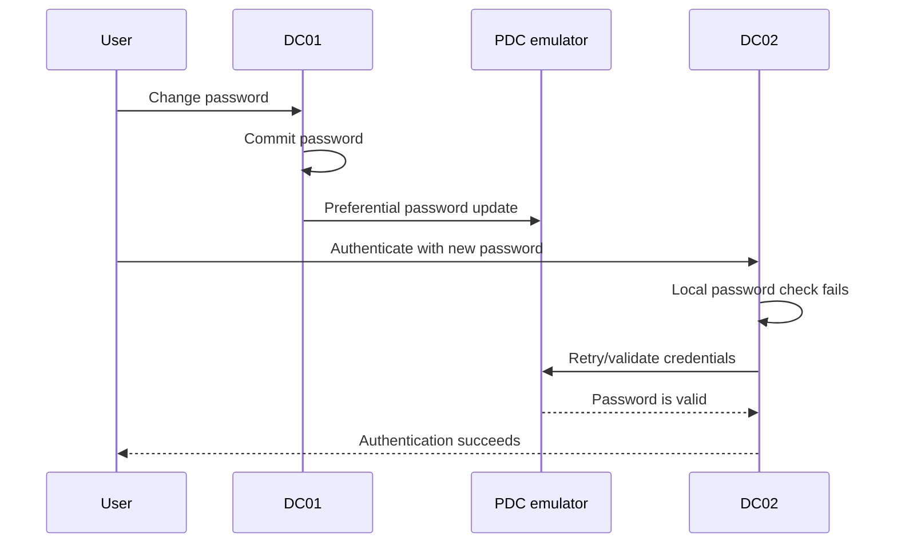

# Urgent Replication Is Not Immediate Convergence

**In Active Directory, "urgent" describes when a source sends a change notification. It does not promise that every domain controller already has the change.**

This matters most during account lockouts, password changes and incident response. Treating urgent replication as a forest-wide synchronous commit leads to false conclusions about both security and availability.

> 🎯 **TL;DR**
>
> - Normal intra-site replication notifies the first partner after 15 seconds by default.
> - Urgent replication removes that notification delay for selected security-sensitive changes.
> - The destination still has to pull, receive and apply the update.
> - Inter-site schedules still apply unless change notification is enabled on the site link.
> - Password changes use a separate PDC emulator optimization; do not describe them as ordinary urgent replication.
> - A forced synchronization is an administrative action, not urgent replication.

---

## 🧭 1 — Five Mechanisms That Are Often Confused

| Mechanism | Trigger | What changes | What it does not guarantee |
|---|---|---|---|
| **Normal change notification** | A directory update | Source notifies partners after the normal delay | Immediate forest-wide convergence |
| **Urgent replication** | Selected security-sensitive updates | Source sends notification without the normal delay | Bypassing closed inter-site schedules or failures |
| **Scheduled inter-site replication** | Site-link schedule and interval | Bridgehead destinations pull eligible changes | Low-latency propagation |
| **Inter-site change notification** | Site-link option | Inter-site partners use notification rather than waiting for the interval | Healthy DNS, RPC or replication state |
| **Forced synchronization** | Administrator or automation | Explicitly requests replication | A durable repair of the underlying fault |

The calculated paths behind these mechanisms are covered in [Active Directory Replication Topology](Active%20Directory%20Replication%20Topology%20-%20KCC%2C%20Intra-Site%2C%20Inter-Site%20and%20Site%20Links.md).

---

## ⏱️ 2 — Normal Notification Versus Urgent Notification

For normal intra-site changes, the source DC waits 15 seconds by default before notifying its first partner and three seconds between subsequent partners.



For an urgent change, the source skips the normal notification delay:



Only the first timing step changed. Name resolution, authentication, RPC, the connection object, the destination's state and the replication operation still matter.

---

## 🔐 3 — Which Changes Are Urgent?

Account lockout is the operationally important example. Windows has also historically applied urgent notification to selected domain security-policy, trust/LSA-secret, DC-account and RID-master changes.

Do not generalize that behavior to every security-related attribute. In particular:

- disabling a user is not a synchronous broadcast to every DC;
- removing a group member can still be subject to topology and schedule latency;
- manually unlocking an account should not be assumed to follow the lockout propagation path;
- deleting or moving an object does not become urgent because the object is privileged.

When the security requirement is "access must stop everywhere by time $T$", measure the relevant change in your topology instead of relying on the label.

---

## 🌍 4 — Why Site Boundaries Still Matter

Urgent replication uses change notification. If an inter-site connection does not use change notification, the change waits for a permitted site-link window and replication interval.



This yields the essential rule:

> **Urgent replication is immediate notification where notification is already part of the connection behavior.**

It does not open a closed schedule, create a missing connection or route around a broken WAN by itself.

Inspect the relevant site-link configuration:

```powershell
Get-ADReplicationSiteLink -Filter * -Properties Options, Schedule |
    Select-Object Name, Cost, ReplicationFrequencyInMinutes, `
        Options, Schedule, SitesIncluded
```

The `Options` bitmask must be interpreted deliberately. Bit `0x1` enables change notification; bit `0x2` enables reciprocal change notification. Do not overwrite unrelated bits when changing it.

---

## 🔑 5 — Password Changes Are a Different Optimization

A password changed on a writable DC is preferentially forwarded to the PDC emulator without waiting for the normal site-link schedule. This protects the common sequence where a user changes a password on one DC and immediately authenticates against another.

If a DC rejects a password locally, it can consult the PDC emulator before returning a bad-password failure. The PDC emulator is therefore a domain-wide point of recent-password knowledge, not the only DC that accepts password changes.



Important consequences:

- PDC reachability reduces user-visible failures during password convergence.
- If forwarding to the PDC fails, normal replication still carries the password update.
- The mechanism does not make every DC current at the time the password change returns.
- PDC unavailability changes this safety net but does not stop all domain authentication.

---

## 🔒 6 — Account Lockout Is Distributed State

Bad-password attempts are observed by the DCs processing those authentications. The PDC emulator has special importance for consolidating lockout decisions, but `badPwdCount` should not be treated as a normally replicated forest-wide counter.

Useful attributes include:

```powershell
$User = 'alice'

Get-ADUser $User -Properties LockedOut, lockoutTime, badPwdCount, `
    badPasswordTime, LastBadPasswordAttempt |
    Select-Object SamAccountName, LockedOut, lockoutTime, `
        badPwdCount, badPasswordTime, LastBadPasswordAttempt
```

For a DC-by-DC view, query each writable DC explicitly:

```powershell
$User = 'alice'
$DomainControllers = Get-ADDomainController -Filter * |
    Where-Object IsReadOnly -eq $false

$Results = foreach ($DomainController in $DomainControllers) {
    Get-ADUser $User -Server $DomainController.HostName `
        -Properties LockedOut, lockoutTime, badPwdCount, badPasswordTime |
        Select-Object @{Name = 'DomainController'; Expression = {
            $DomainController.HostName
        }}, LockedOut, lockoutTime, badPwdCount, badPasswordTime
}

$Results | Sort-Object DomainController | Format-Table -AutoSize
```

Interpret the output as observations at specific replicas. Do not sum `badPwdCount` values as if they were shards of one authoritative counter.

---

## 🧪 7 — Measure Convergence Without Guessing

Use a harmless lab attribute or test object. Record the originating DC and UTC time, then query every replica directly.

```powershell
$User = 'CN=Replication Test,OU=Lab,DC=contoso,DC=com'
$OriginatingDC = 'DC01.contoso.com'
$Marker = 'replication-test-{0:yyyyMMddTHHmmss.fffffffZ}' -f `
    [DateTime]::UtcNow

Set-ADObject -Identity $User -Server $OriginatingDC `
    -Replace @{ description = $Marker }

$DomainControllers = Get-ADDomainController -Filter *
$Observations = foreach ($DomainController in $DomainControllers) {
    $Stopwatch = [System.Diagnostics.Stopwatch]::StartNew()
    do {
        $Value = (Get-ADObject -Identity $User `
            -Server $DomainController.HostName `
            -Properties description).description
        if ($Value -ne $Marker) {
            Start-Sleep -Milliseconds 250
        }
    } until ($Value -eq $Marker -or $Stopwatch.Elapsed.TotalMinutes -ge 10)

    [pscustomobject]@{
        DomainController = $DomainController.HostName
        Converged        = $Value -eq $Marker
        Seconds          = [math]::Round($Stopwatch.Elapsed.TotalSeconds, 2)
    }
}

$Observations | Sort-Object Seconds | Format-Table -AutoSize
```

Run tests only against a purpose-built object and choose a timeout appropriate to the site-link schedule. The script measures one update; it does not prove that all NCs and directions are healthy.

---

## 🛠️ 8 — Forced Replication: Use It as a Probe

To request one NC from a known source to a destination:

```powershell
$DomainNC = (Get-ADDomain).DistinguishedName
repadmin.exe /replicate DC02.contoso.com DC01.contoso.com $DomainNC
```

To synchronize one object between two DCs:

```powershell
$ObjectDN = 'CN=Replication Test,OU=Lab,DC=contoso,DC=com'
Sync-ADObject -Object $ObjectDN `
    -Source DC01.contoso.com `
    -Destination DC02.contoso.com
```

These operations answer a useful question: **can this destination pull this scope from this source now?** A successful force does not explain why scheduled convergence was late. A failed force provides an error close to the affected path, but the root cause may still be DNS, RPC, Kerberos, topology, permissions or replication state.

Collect evidence first:

```powershell
repadmin.exe /showrepl DC02.contoso.com /all /verbose
repadmin.exe /showutdvec DC02.contoso.com `
    (Get-ADDomain).DistinguishedName
repadmin.exe /replsummary
```

---

## 🚫 9 — Statements to Retire

| Misleading statement | Better statement |
|---|---|
| "Urgent means every DC updates immediately" | The source notifies eligible partners immediately; convergence still follows topology |
| "Password changes use urgent replication" | Passwords have preferential PDC forwarding plus normal replication |
| "The PDC owns all authentication" | Any suitable DC authenticates; the PDC provides special fallback behavior |
| "Account unlock is the reverse of urgent lockout" | Do not assume unlock has the same propagation semantics |
| "`repadmin /syncall` fixes replication" | It requests replication and may expose the failing path |
| "`whenChanged` proves origin time" | `whenChanged` is local replica state and changes when the update is applied |

For authoritative origin metadata, inspect the replicated attribute metadata rather than `whenChanged`:

```powershell
repadmin.exe /showobjmeta DC02.contoso.com `
    'CN=Replication Test,OU=Lab,DC=contoso,DC=com'
```

---

## ✅ 10 — Incident Checklist

When a sensitive change appears late:

1. Identify the object, attribute and originating DC.
2. Identify the destination DC that returned stale behavior.
3. Confirm both DCs host the relevant NC.
4. Inspect the inbound connection and last replication result.
5. Determine whether the path is intra-site or inter-site.
6. For inter-site paths, check schedule, interval and notification options.
7. Verify DNS, RPC and Kerberos between the actual partners.
8. Compare replicated metadata and up-to-dateness vectors.
9. Force one scoped replication only after collecting evidence.
10. Measure end-to-end convergence after the repair.

The useful mental model is precise:

> **Urgency changes when notification starts. Convergence still depends on every pull and hop that follows.**

---

## 📚 References

- [Active Directory Replication Concepts](https://learn.microsoft.com/en-us/windows-server/identity/ad-ds/get-started/replication/active-directory-replication-concepts)
- [Modify the default intra-site DC replication interval](https://learn.microsoft.com/en-us/troubleshoot/windows-server/active-directory/modify-default-intra-site-dc-replication-interval)
- [Active Directory FSMO roles](https://learn.microsoft.com/en-us/troubleshoot/windows-server/active-directory/fsmo-roles)
- [Planning operations master role placement](https://learn.microsoft.com/en-us/windows-server/identity/ad-ds/plan/planning-operations-master-role-placement)
- [Repadmin command reference](https://learn.microsoft.com/en-us/previous-versions/windows/it-pro/windows-server-2012-r2-and-2012/cc770963%28v=ws.11%29)