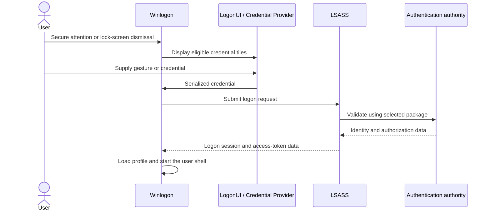
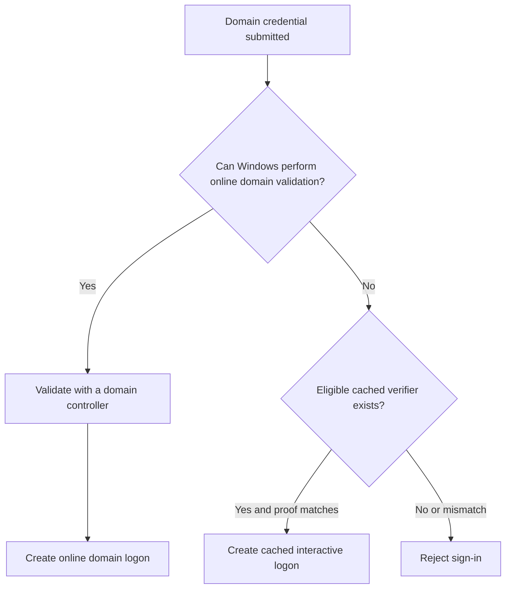
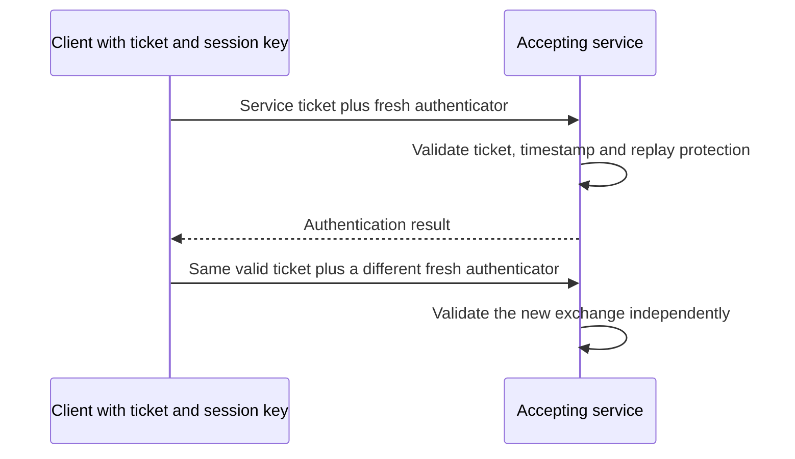

# Windows Interactive Logon: From Credential Provider to Kerberos Ticket Cache

Windows sign-in is not one fixed sequence in which a password is always checked locally and then sent to a domain controller. The path depends on the account authority, device join state, credential type, network availability and configured security features.

> **TL;DR**
>
> - Credential Providers collect and serialize proofs; they do not make the authorization decision.
> - Winlogon and LogonUI orchestrate the secure desktop. LSASS and its authentication packages validate the sign-in and create the logon session.
> - An online AD DS password sign-in normally contacts a domain controller. Cached domain logon is a fallback when a DC cannot validate the user, not a mandatory first stage.
> - Windows Hello for Business proves possession of a private key unlocked by a gesture; the PIN is not a domain password.
> - A Kerberos TGT, a Microsoft Entra Primary Refresh Token and a Windows access token are different artifacts for different trust systems.
> - Credential Guard isolates reusable secrets, but it does not protect every credential path or prevent misuse of an already compromised session.

## 1. The components and their responsibilities

| Component | Responsibility |
|---|---|
| Secure desktop | Isolates trusted sign-in UI from the normal user desktop |
| Winlogon | Coordinates interactive sign-in, lock/unlock and session startup |
| LogonUI | Hosts the visual sign-in experience and enumerates credential tiles |
| Credential Provider | Collects and serializes a password, smart-card proof, Hello gesture or another credential |
| LSASS / LSA | Enforces local security policy and coordinates authentication packages and logon sessions |
| Authentication package / SSP | Implements a validation or security protocol such as Kerberos, NTLM, Negotiate or CloudAP |
| Domain controller | Validates AD DS identities and runs the KDC for Kerberos |
| SAM | Stores and validates local accounts |
| CloudAP | Handles modern Windows authentication with Microsoft Entra ID |

Credential Providers are extensible input components. A provider may display a password tile, smart-card tile, Windows Hello tile, security key tile or vendor-specific method. It packages the selected proof into the format expected by the target authentication package.

That distinction matters: hiding the password provider changes the available input path, but it is not itself an authentication enforcement boundary. LSASS and the authentication authority decide whether the serialized proof is accepted.

## 2. The common orchestration path



The authority in this diagram is not always the same:

- The local SAM validates a local account.
- An AD DS domain controller validates an online domain sign-in.
- A local cached verifier can validate an offline domain password sign-in.
- Microsoft Entra ID and CloudAP participate in an Entra account sign-in.
- A key-based flow can prove possession of a Windows Hello for Business key.

After successful authentication, LSA creates a logon session with a locally unique logon identifier (LUID). Windows builds access tokens containing the user's SID, group SIDs, privileges, integrity information and other authorization data. Winlogon can then load the profile and start the shell, normally `explorer.exe`.

## 3. Online AD DS password sign-in

On a domain-joined device with domain controller connectivity, the normal path is online domain validation:

1. The password Credential Provider serializes the submitted domain name, user name and password.
2. Winlogon submits the interactive logon request to LSA.
3. LSA selects the applicable authentication package.
4. The workstation locates a domain controller and validates the domain identity.
5. The domain supplies authorization data used to construct the local token.
6. Kerberos credentials, including a TGT when the Kerberos path succeeds, can be associated with the new logon session.

This flow depends on more than reachability to any domain controller. DNS, DC Locator, time synchronization, the computer secure channel, account state, logon rights and KDC behavior can all affect the result.

The password is not first validated against the cached domain verifier as a compulsory step. Windows uses online validation when it can reach the required domain services. Cached interactive logon is an availability path used when online domain validation is unavailable.

## 4. Cached interactive domain logon

Windows can store cached domain account information so that a user can sign in to a domain member while disconnected from a domain controller. These entries are salted password-derived verifiers, often called Domain Cached Credentials. They are not the user's reversible password, NT hash or Kerberos TGT, and they cannot be presented directly to another computer for network authentication.



Important consequences:

- A cached logon permits local interactive access; it does not mean the domain controller authenticated the current attempt.
- The resulting desktop can start without a fresh TGT. Kerberos tickets may be acquired later when domain connectivity returns.
- If the domain password changed elsewhere, the old password can still match the workstation's stale cached verifier while offline. The new password becomes usable after an online sign-in updates local state.
- Account disablement, expiry, group changes and new logon restrictions may not be known during an offline cached validation.

The policy **Interactive logon: Number of previous logons to cache** controls how many domain users can have cached logon information. Setting it to zero removes the offline availability benefit and can prevent mobile or disconnected users from signing in.

## 5. Kerberos tickets are session artifacts

A successful domain sign-in and a populated Kerberos ticket cache are related but not identical observations. A logon session can initially have no usable TGT, and tickets can be requested later as resources are accessed.

Use `klist` in the affected user's context:

```powershell
# Show Kerberos tickets for the current logon session.
klist

# Show the current logon sessions and their LUIDs.
klist sessions
```

A typical cache can contain:

- A TGT for the user's domain.
- Referral TGTs when traversing domains or forests.
- Service tickets for CIFS, HTTP, LDAP or other SPNs.

Do not infer the initial sign-in protocol solely from one later service ticket. Ticket acquisition is demand-driven, and a process can run in a different logon session from the administrator inspecting it.

### 5.1 Lifetime and renewal are separate limits

The KDC constrains the requested validity according to policy and the credentials used to obtain the ticket. Read the actual ticket fields rather than treating a familiar default as a guarantee for every identity:

| Field or flag | Meaning |
|---|---|
| Start Time | Beginning of the ticket's validity interval |
| End Time | End of that ticket instance's validity |
| Renewable flag | Renewal can be requested if the applicable conditions are met |
| Renew Time / renew-till | Upper boundary for the renewed validity, not an extension that happens without a KDC exchange |
| Forwardable flag | A delegation-related property, not the same thing as renewable |

Renew a renewable ticket while it remains valid and before the renewable limit is reached. Renewal requires the KDC and can be refused; it is not unlimited offline authentication. Acquiring a new initial TGT is a different operation. Ticket encryption and session-key encryption are also distinct fields in `klist` output.

A successful renewal does not recreate the current Windows process token or guarantee that its authorization state reflects every recent directory change. For a membership-change test, establish the needed fresh logon and ticket state explicitly.

Likewise, a service-ticket expiry does not necessarily tear down an already authenticated SMB connection, database session or application cookie at that instant. Those sessions have their own reauthentication and lifetime behavior. Do not promise immediate revocation of every session merely from a password or group change.

### 5.2 Reusing a ticket is not replaying an authenticator

Kerberos credentials include the ticket and the session key needed to use it. A client can reuse an unexpired service ticket, but a new authentication exchange includes a fresh **authenticator** protected with that session key. The authenticator carries time and identity information that the accepting service validates.



Clock-skew checks limit the accepted time window. A common five-minute skew tolerance is not the ticket's lifetime. Replay protection, normally a replay cache unless the protocol supplies an appropriate alternative, prevents reuse of the same authenticator within that window. A timestamp alone does not stop a duplicate request sent immediately afterward.

Theft of both the ticket and its session key is a different problem from replaying captured request bytes: possession of the key allows fresh authenticators. Replay detection does not replace protection of credentials in memory and credential caches.

Services sharing a principal/key need a supported replay-protection design across their accepting instances. Do not disable the replay cache to work around duplicate-authenticator errors. Also distinguish authentication replay protection from integrity and confidentiality of subsequent application traffic: Kerberos authentication alone does not automatically encrypt every later HTTP or application message.

For SPN, ticket-cache and error analysis, see [Troubleshooting Kerberos Authentication](../Troubleshoot/Troubleshooting%20Kerberos%20Authentication%20-%20SPNs,%20Tickets,%20Error%20Codes%20and%20NTLM%20Fallback.md). For authorization-data growth, see [Kerberos Token Bloat](../Troubleshoot/Kerberos%20Token%20Bloat%20-%20PAC%20Size,%20MaxTokenSize%20and%20HTTP%20Limits.md).

## 6. Windows Hello for Business

Windows Hello for Business replaces reusable password authentication with asymmetric key authentication. The user gesture, such as a PIN or biometric, unlocks use of a private key associated with that user and device. The PIN is local to the device and is not transmitted to a domain controller or Microsoft Entra ID as the user's password.

The broad flow is:

1. LogonUI displays the Windows Hello for Business Credential Provider.
2. The user supplies a PIN or biometric gesture.
3. The provider packages proof associated with the protected private key.
4. LSASS passes the proof to CloudAP or Kerberos according to device state and trust model.
5. The identity provider verifies a signature made with the private key.
6. Windows creates the logon session and obtains the applicable cloud or Kerberos artifacts.

For on-premises AD DS access, the exact Kerberos path depends on the configured trust:

| Trust model | Simplified AD DS path |
|---|---|
| Cloud Kerberos trust | Microsoft Entra issues a partial TGT; an AD DS KDC validates it and returns a full TGT |
| Key trust | The KDC validates key-based Kerberos preauthentication against the user's registered public key |
| Certificate trust | The KDC validates certificate-based preauthentication and its trust chain |

Line of sight to a domain controller remains relevant when a full on-premises TGT must be obtained.

## 7. Entra joined and hybrid joined devices

The primary authentication authority differs by join state.

### Microsoft Entra joined

On an Entra joined device, CloudAP validates the organizational identity with Microsoft Entra ID during first online sign-in. A successful flow can issue a Primary Refresh Token (PRT), which supports cloud SSO through brokers such as Web Account Manager.

For subsequent sign-ins, CloudAP can use cached sign-in state when the internet is unavailable. The PRT is renewed when connectivity and policy permit. This cache is distinct from classic AD DS cached domain logon information.

An Entra joined device can still obtain SSO to on-premises AD DS resources when identity synchronization, domain information, network line of sight and the chosen passwordless trust model are correctly configured. It does not become domain joined merely because it can obtain an on-premises Kerberos ticket.

### Microsoft Entra hybrid joined

On a hybrid joined device, AD DS is normally the primary authority for Windows sign-in, while CloudAP obtains or renews the PRT for cloud SSO. With Windows Hello for Business cloud Kerberos trust, CloudAP and Kerberos participate in a coordinated flow that can return both cloud and on-premises artifacts.

Do not use “hybrid” as a protocol name. It is a device state; the actual transaction can involve Kerberos, CloudAP, a PRT, a partial TGT, WAM and different network dependencies.

## 8. PRT, TGT and access token are not interchangeable

| Artifact | Issuer / creator | Main use |
|---|---|---|
| Windows access token | Local LSA | Local authorization for processes and securable objects |
| Kerberos TGT | KDC | Request Kerberos service tickets |
| Kerberos service ticket | KDC | Authenticate to a particular SPN-backed service |
| PRT | Microsoft Entra ID | Brokered SSO and acquisition of cloud tokens |
| OAuth access token | Microsoft Entra ID or another authorization server | Access a specific application/API audience |

A PRT is an opaque, device-bound artifact handled by Windows components; it is not a Kerberos ticket. WAM can use the PRT to request application tokens. Kerberos uses a TGT to request service tickets. A local Windows access token is what processes use for local authorization after the logon session is created.

## 9. What LSASS retains

LSASS manages logon sessions and credentials needed for single sign-on. Depending on credential type, policy and enabled protections, associated material can include Kerberos tickets, NTLM-related secrets, certificates, keys or cloud authentication state.

This does not mean every sign-in deposits a plaintext password in LSASS. Password, smart-card, Windows Hello, Remote Credential Guard and Credential Guard scenarios have materially different secret exposure.

### Credential Guard

Credential Guard uses virtualization-based security to isolate selected secrets in `LSAIso.exe`. The normal LSA communicates with the isolated component instead of exposing those reusable secrets directly in ordinary operating-system memory.

Credential Guard protects high-value material such as NTLM hashes and Kerberos TGTs, subject to documented limitations. It does not protect:

- Local account and Microsoft account secrets in the same way.
- Credentials explicitly supplied to an application or unsupported authentication package.
- Windows cached domain logon verifiers, which are local validation data rather than reusable network credentials.
- Kerberos service tickets, although TGTs are protected.
- The credential input path from keyloggers.
- Use of the privileges of a session that an attacker has already compromised.

It can also change compatibility: protocols that require delegation of reusable credentials or unsupported legacy proofs may lose transparent SSO.

## 10. Unlock is not always a fresh sign-in

Unlocking an existing session and creating a new interactive logon are different operations. Unlock normally proves that the user may regain access to an existing session. It does not necessarily recreate the profile, access token, PRT or Kerberos cache.

This is visible in security auditing: a new console sign-in is commonly Logon Type 2, while workstation unlock is Logon Type 7. Remote Desktop and cached paths have their own logon types. The companion article [Windows Logon Types Decoded: Events 4624 and 4625](Windows%20Logon%20Types%20Decoded%20-%20Events%204624%20and%204625.md) explains those records.

## 11. A practical troubleshooting workflow

### Identify the device and user state

```powershell
# Device join state, tenant details and SSO status.
dsregcmd /status

# Current Kerberos tickets.
klist

# Current user and expanded token information.
whoami /all
```

Run `dsregcmd /status` in the signed-in user's context when interpreting the user and SSO sections. An elevated console can show a different user context.

### Separate the stages

Ask these questions in order:

1. Which Credential Provider tile was selected?
2. Is the identity local, AD DS, Microsoft Entra ID or federated through another authority?
3. Is the device workgroup, domain joined, Entra joined or hybrid joined?
4. Was online validation available, or did Windows use cached state?
5. Was the proof a password, smart card, Hello key, FIDO2 key or another credential?
6. Was a Windows logon session created successfully?
7. Which post-logon artifact is missing: TGT, service ticket, PRT or application access token?

### Use the right evidence

| Evidence | Best use |
|---|---|
| Security events 4624/4625 | Successful or failed local logon session creation |
| Kerberos events 4768/4769 | TGT and service-ticket activity on domain controllers |
| `klist` | Tickets associated with a particular local logon session |
| `dsregcmd /status` | Device registration, join and user SSO state |
| User Device Registration log | Device registration and join problems |
| AAD/Operational log | CloudAP and Entra authentication evidence |
| Netlogon log | DC discovery and domain secure-channel investigation |

The absence of a PRT is not evidence that the Windows desktop sign-in failed. On a hybrid joined device, AD DS sign-in can succeed while asynchronous PRT acquisition fails. Similarly, a desktop opened through cached domain logon can succeed while no current TGT exists.

## 12. Common misconceptions

| Misconception | Correct model |
|---|---|
| “Windows always checks cached credentials first.” | Windows uses online domain validation when available; cached validation is an offline fallback. |
| “The Credential Provider authenticates the user.” | It collects and serializes proof; LSA and the authentication authority validate it. |
| “A Hello PIN is a shorter domain password.” | It unlocks a device-bound private key and is not sent as the domain password. |
| “A successful desktop sign-in guarantees a Kerberos TGT.” | Cached and cloud paths can create a session before an on-premises TGT is available. |
| “A PRT is the cloud equivalent of a local access token.” | A PRT supports brokered cloud token acquisition; the access token authorizes local processes. |
| “Credential Guard protects every credential.” | It isolates selected reusable secrets and has explicit scope and compatibility limits. |

## References

- [Credentials Processes in Windows Authentication](https://learn.microsoft.com/en-us/windows-server/security/windows-authentication/credentials-processes-in-windows-authentication)
- [Winlogon and Credential Providers](https://learn.microsoft.com/en-us/windows/win32/secauthn/winlogon-and-credential-providers)
- [Authentication Packages](https://learn.microsoft.com/en-us/windows/win32/secauthn/authentication-packages)
- [How Windows Hello for Business authentication works](https://learn.microsoft.com/en-us/windows/security/identity-protection/hello-for-business/how-it-works-authentication)
- [Understanding Primary Refresh Token in Microsoft Entra ID](https://learn.microsoft.com/en-us/entra/identity/devices/concept-primary-refresh-token)
- [How SSO to on-premises resources works on Microsoft Entra joined devices](https://learn.microsoft.com/en-us/entra/identity/devices/device-sso-to-on-premises-resources)
- [How Credential Guard works](https://learn.microsoft.com/en-us/windows/security/identity-protection/credential-guard/how-it-works)
- [Klist ticket-cache reference](https://learn.microsoft.com/en-us/windows-server/administration/windows-commands/klist)
- [RFC 4120: renewable tickets and authenticator replay protection](https://www.rfc-editor.org/rfc/rfc4120.html)