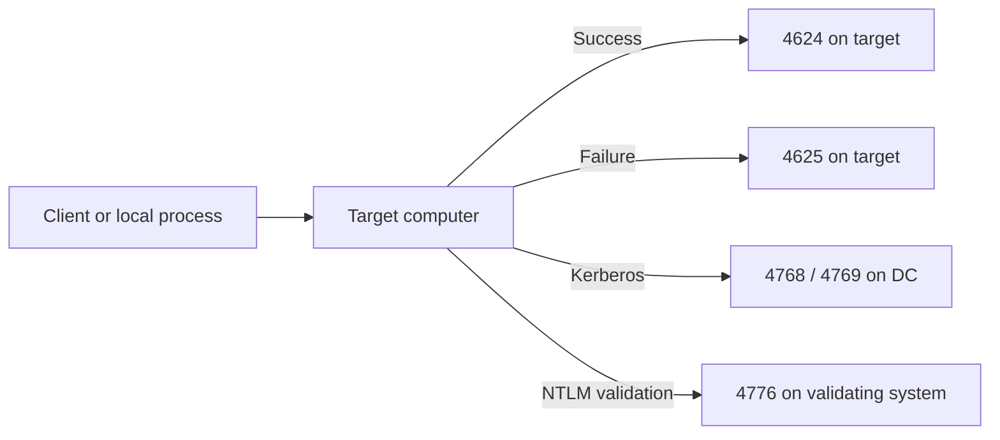

# Windows Logon Types Decoded: Events 4624 and 4625

Security events 4624 and 4625 describe the creation or rejection of a Windows logon session on the computer where the attempt was processed. The **Logon Type** identifies the session context. It is not, by itself, a verdict about the protocol, intent or risk.

> **TL;DR**
>
> - Event 4624 records a successful logon session; 4625 records a failed attempt.
> - Logon Type 3 is normal for file shares, remote management and many service-to-service connections.
> - Logon Type 8 means the authentication package received reusable credentials in unhashed form; it does not mean the password crossed the network as plaintext.
> - Logon Type 9 keeps the caller's local identity but supplies different credentials for outbound access.
> - Interpret the type with the target account, source, process, authentication package, Logon ID and, for failures, Status/SubStatus.

## 1. Where the events are written

Event 4624 is generated on the destination computer when Windows creates a logon session. Event 4625 is generated on the computer where Windows processed and rejected the logon attempt.

That location is critical. A failed connection to a member server can produce 4625 on the member server, while related Kerberos or NTLM evidence appears on a domain controller. A workstation can also record a local failure that never reached a DC.



Do not search only domain controller logs for every 4624 or 4625. Start with the system where the logon session should have been created.

## 2. The logon types that matter most

| Type | Name | Typical scenario |
|---:|---|---|
| 2 | Interactive | Console sign-in or a local interactive process such as `runas` without `/netonly` |
| 3 | Network | SMB, remote registry, WinRM-related access and other network authentication |
| 4 | Batch | Scheduled task or another batch logon |
| 5 | Service | Service Control Manager starts a service under an account |
| 7 | Unlock | User unlocks an existing workstation session |
| 8 | NetworkCleartext | A network logon where the authentication package receives the password in unhashed form |
| 9 | NewCredentials | Existing local token with alternate credentials for outbound connections |
| 10 | RemoteInteractive | Remote Desktop or Terminal Services interactive session |
| 11 | CachedInteractive | Domain interactive sign-in validated using locally cached domain information |

Types 0, 12 and 13 also exist but are less common in day-to-day investigations: System, CachedRemoteInteractive and CachedUnlock respectively.

## 3. Type 2: Interactive

Type 2 creates an interactive session on the local computer. The obvious case is a user signing in at the console, but a local process can also request an interactive logon through APIs.

Inspect:

- The target account and domain.
- The **Logon Process**, often `User32` for normal interactive sign-in.
- The caller process and Subject account.
- Whether the token is elevated and whether event 4672 assigns special privileges.

A Type 2 event does not prove physical presence. Console redirection, virtualization consoles and software invoking logon APIs can produce local interactive semantics.

## 4. Type 3: Network

Type 3 is the most frequently misclassified logon type. It means the destination created a network logon session. Common causes include:

- Access to an SMB file share.
- Computer-account authentication between domain members.
- Remote administration and management protocols.
- Application servers accepting Windows-integrated authentication.
- A service accessing another server.

A Type 3 event is not inherently lateral movement. Determine whether the account, source, destination, process and protocol are expected together.

Fields may be incomplete. Microsoft notes that the source workstation or IP depends on what the authenticating service supplied to LSASS. Kerberos network logons may lack a workstation name; NTLM logons may lack TCP/IP details. A dash or loopback address is evidence to interpret, not automatic proof of evasion.

## 5. Types 4 and 5: Batch and service

### Type 4: Batch

Task Scheduler commonly creates Type 4 sessions for tasks configured to run whether the user is logged on or not. Investigate unexpected privileged accounts, unusual task definitions and caller processes.

Useful companion events include:

- Task Scheduler Operational events.
- Security event 4698 for scheduled task creation when auditing is enabled.
- Process creation event 4688.

### Type 5: Service

The Service Control Manager creates Type 5 sessions when starting a service under a service account. Correlate with System log events 7036 and 7045, service configuration, and process creation evidence.

Type 5 for a gMSA or dedicated service account can be entirely normal. A human administrative account repeatedly used for services is a design and credential-exposure concern even when no compromise is present.

## 6. Type 7: Unlock

Type 7 restores access to an existing locked workstation session. It is different from creating a new console session and normally does not reload the user profile or reconstruct all authentication state.

For investigations, distinguish:

- Initial Type 2 sign-in.
- Type 7 unlocks of that session.
- Event 4800 workstation lock.
- Event 4801 workstation unlock.

The [interactive logon article](Windows%20Interactive%20Logon%20-%20From%20Credential%20Provider%20to%20Kerberos%20Ticket%20Cache.md) explains how the underlying session and credential artifacts are created.

## 7. Type 8: NetworkCleartext

The name is easy to overread. Type 8 means the user's password was passed to the authentication package in unhashed form so that the package could process it. It does **not** mean Windows sent that password across the network in plaintext. Built-in packages protect the network exchange according to the selected protocol.

Type 8 can appear with applications that need reusable credentials for a network logon, including some web authentication and legacy application paths. The security questions are:

1. Which process received or submitted the credential?
2. Which authentication package was used?
3. Was the application channel protected?
4. Why did the application require a reusable secret instead of integrated or key-based authentication?

The local exposure of a supplied password can still be important. Do not dismiss Type 8 merely because the network transfer is protected.

## 8. Type 9: NewCredentials

Type 9 is commonly generated by:

```powershell
runas /netonly /user:EXAMPLE\AdminUser powershell.exe
```

Windows clones the caller's existing token for local activity and associates alternate credentials with the new logon session for outbound network authentication. As a result:

- Local file and registry access still use the original local identity.
- Remote connections attempt to use the supplied alternate identity.
- The remote credentials are not necessarily validated when `runas` starts; failure may occur only when the process accesses a remote resource.

In event 4624 version 2, **Network Account Name** and **Network Account Domain** can expose the outbound identity for NewCredentials sessions. Correlate Type 9 with event 4648, which records an attempt to log on using explicit credentials.

## 9. Type 10: RemoteInteractive

Type 10 normally represents an RDP/Terminal Services session. It identifies remote interactive semantics, not a guarantee that a password was delegated to the destination.

The credential exposure depends on the mode and configuration:

- Normal RDP and CredSSP behavior.
- Network Level Authentication.
- Restricted Admin mode.
- Remote Credential Guard.
- Windows Hello for Business or smart-card paths.

Event 4624 version 2 includes a **Restricted Admin Mode** field for Type 10. Also inspect TerminalServices LocalSessionManager and RemoteConnectionManager operational logs, source address, target account and session reconnect behavior.

## 10. Type 11: CachedInteractive

Type 11 means a domain interactive sign-in was validated with cached domain account information because a domain controller did not validate the current attempt. The cache contains a local password verifier, not a reusable domain password or Kerberos ticket.

A successful Type 11 event therefore does not prove current DC connectivity, current account state or possession of a fresh TGT. Network authentication can fail after the desktop opens until connectivity and domain credentials are re-established.

Type 11 is normal for mobile devices outside the corporate network. It deserves attention when it appears on systems that should always have domain connectivity, especially privileged access workstations and servers.

## 11. Read 4624 by sections

The event schema has versions, and not every field is populated in every context. Read it as a collection of roles:

| Section | Question |
|---|---|
| Subject | Which local security context requested or reported the logon? |
| Logon Information | Which session type was created? |
| New Logon | Which account received the new session and what is its Logon ID? |
| Process Information | Which local process requested it? |
| Network Information | What source information was supplied? |
| Detailed Authentication | Which logon process and authentication package handled it? |

The **Authentication Package** can be `Kerberos`, `NTLM` or `Negotiate`. `Negotiate` is a selector and does not by itself prove that Kerberos won. Use Kerberos ticket events or protocol evidence when that distinction matters.

The hexadecimal **Logon ID** is the strongest local correlation key for the session. It can connect 4624 with events such as 4634/4647 logoff, 4672 special privileges, object-access events and process activity that records the same LUID. Reused values are possible after reboot, so retain computer and time context.

## 12. Read 4625 differently

Event 4625 describes an attempt for which no successful target logon session was created. Its fields therefore do not map perfectly to 4624. Focus on:

- **Account For Which Logon Failed** rather than assuming the Subject is the failed identity.
- **Logon Type** to understand the requested session.
- **Caller Process Name/ID** for a locally initiated request.
- **Workstation Name**, source address and source port when populated.
- **Authentication Package** and NTLM subpackage.
- **Status** and **SubStatus** together.

Common NTSTATUS values include:

| Code | Meaning commonly relevant to 4625 |
|---|---|
| `0xC000005E` | No logon servers are available |
| `0xC0000064` | User name does not exist |
| `0xC000006A` | Incorrect password |
| `0xC000006D` | Generic bad user name or authentication information |
| `0xC000006F` | Logon outside authorized hours |
| `0xC0000070` | Logon from an unauthorized workstation |
| `0xC0000071` | Password expired |
| `0xC0000072` | Account disabled |
| `0xC000015B` | Requested logon type has not been granted |
| `0xC0000193` | Account expired |
| `0xC0000234` | Account locked out |

Status can be generic while SubStatus provides the precise reason. Preserve both original hexadecimal values and resolve them against the current NTSTATUS reference. The displayed **Failure Reason** is useful but can be localized or less specific.

### Message identifiers are not protocol error codes

The raw XML `FailureReason` value can look like `%%2307`. This is a parameter-message identifier that the event provider uses to render a description, not a Kerberos error number or an NTSTATUS value. Other values such as `%%2305` or `%%2313` belong to that same event-message mechanism; do not strip the percent signs and look them up in a Kerberos error table.

| Value and location | Interpretation |
|---|---|
| `FailureReason = %%2307` in the documented 4625 example | Message-resource identifier used for the event's displayed reason |
| `Status = 0xC0000234` in that example | NTSTATUS: account locked out |
| `SubStatus = 0x0` | No additional substatus; it does not turn the failed event into a success |
| `0x18` in a Kerberos error response | Kerberos protocol error 24, preauthentication failed; a different namespace |

Preserve the provider, event ID/version, raw FailureReason, Status and SubStatus when forwarding events. A collector without the source provider's message resources may display the identifier instead of its localized description. Do not use a hand-maintained message-text table as the sole diagnosis when the structured status fields are available.

Use [Troubleshooting Kerberos Authentication](../Troubleshoot/Troubleshooting%20Kerberos%20Authentication%20-%20SPNs,%20Tickets,%20Error%20Codes%20and%20NTLM%20Fallback.md) for protocol errors and [Auditing and Reducing NTLM](../Hardening/Auditing%20and%20Reducing%20NTLM%20-%20Versions,%20Dependencies,%20Exceptions%20and%20Enforcement.md) when the evidence identifies NTLM.

## 13. Query and normalize the events

Start with a narrow time window. Security logs can be large:

```powershell
$startTime = (Get-Date).AddHours(-4)

$events = Get-WinEvent -FilterHashtable @{
    LogName   = 'Security'
    Id        = 4624, 4625
    StartTime = $startTime
}

$events | Select-Object TimeCreated, Id, MachineName -First 50
```

The event's `Properties` array is version-sensitive. Parsing named XML fields is safer for reusable investigation scripts:

```powershell
function Convert-SecurityLogonEvent {
    param(
        [Parameter(Mandatory, ValueFromPipeline)]
        [System.Diagnostics.Eventing.Reader.EventRecord]$Event
    )

    process {
        [xml]$xml = $Event.ToXml()
        $data = @{}

        foreach ($item in $xml.Event.EventData.Data) {
            $data[$item.GetAttribute('Name')] = $item.InnerText
        }

        [pscustomobject]@{
            TimeCreated          = $Event.TimeCreated
            Computer             = $Event.MachineName
            EventId              = $Event.Id
            TargetAccount        = '{0}\{1}' -f $data.TargetDomainName, $data.TargetUserName
            TargetLogonId        = $data.TargetLogonId
            LogonType            = $data.LogonType
            AuthenticationPackage = $data.AuthenticationPackageName
            LogonProcess         = $data.LogonProcessName
            Workstation          = $data.WorkstationName
            SourceAddress        = $data.IpAddress
            SourcePort           = $data.IpPort
            ProcessName          = $data.ProcessName
            Status               = $data.Status
            SubStatus            = $data.SubStatus
        }
    }
}

$events | Convert-SecurityLogonEvent | Format-Table -AutoSize
```

For account names supplied by another process, normalize first and then filter. Avoid embedding untrusted input in an XPath expression.

### Named-field XPath for a fixed investigation

A field name is part of the evidence. In 4624, `TargetUserName` identifies the new logon; in 4625 it identifies the account whose logon failed. `SubjectUserName` describes the caller/reporting context and is often SYSTEM, not the identity being investigated.

For a fixed account and domain, the following query selects network logons or failed network logons during the preceding 24 hours. The XML can also be used in an Event Viewer custom view:

```powershell
$logonQuery = @'
<QueryList>
    <Query Id="0" Path="Security">
        <Select Path="Security">
            *[System[(EventID=4624 or EventID=4625) and TimeCreated[timediff(@SystemTime) &lt;= 86400000]]]
            and *[EventData[Data[@Name='TargetUserName']='LabUser' and Data[@Name='TargetDomainName']='CORP' and Data[@Name='LogonType']='3']]
        </Select>
    </Query>
</QueryList>
'@

Get-WinEvent -FilterXml $logonQuery -ErrorAction Stop |
        Convert-SecurityLogonEvent | Format-Table -AutoSize
```

Match the name and domain as they appear in the event XML; XML names and XPath string comparisons are case-sensitive. `&lt;` is XML escaping for `<`, not part of the underlying XPath operator. Windows Event Log implements a restricted XPath subset, so generic XPath functions such as `contains()` are not a portable way to filter these logs.

Avoid a predicate that searches every `Data` element for a SID or account name without specifying `@Name`. A null SID (`S-1-0-0`) in a Subject or unresolved field does not automatically mean an anonymous logon; the well-known Anonymous Logon SID is `S-1-5-7`. Read the field and event context before classifying it.

The same field names do not have the same roles in all event types: in 4769, `TargetUserName` is the **ticket requester**, while `ServiceName` identifies the service account. Use the [RC4 inventory query examples](../Hardening/RC4%20Hardening/2.%20Legacy%20Dependency%20Mapping%20and%20Technical%20Inventory.md) for Kerberos ticket filtering rather than adapting a 4624 query by changing only the event ID.

## 14. A correlation workflow

For each event of interest:

1. Confirm the destination computer and timestamp.
2. Identify the target account, not just the Subject.
3. Interpret the Logon Type as a requested session context.
4. Inspect the local caller process and source fields.
5. Determine the actual protocol behind `Negotiate` when relevant.
6. For 4624, correlate the Logon ID with privileges, process and logoff events.
7. For 4625, decode Status and SubStatus and look for repetition patterns.
8. Pivot to DC Kerberos/NTLM events, endpoint telemetry and application logs.

High-signal patterns come from combinations, for example:

- Type 3 from a new source to many servers using one privileged account.
- Repeated `0xC000006A` failures followed by success for the same account and source.
- Type 9 plus 4648 and an unexpected administrative process.
- Type 5 for a human administrator account on a server where no such service is approved.
- Type 10 from an unusual source combined with special privileges and new process activity.

Volume alone is rarely enough. Computer accounts, scanners, management systems and service retries can generate large numbers of legitimate events.

## 15. Common interpretation mistakes

| Mistake | Better interpretation |
|---|---|
| “Type 3 is lateral movement.” | It is any network logon; assess account, source, target, process and protocol. |
| “Type 8 sent the password in plaintext.” | The package received an unhashed password locally; built-in packages protect network transmission. |
| “Type 9 changes the local user.” | Local access keeps the original token; alternate credentials apply outbound. |
| “Negotiate means Kerberos.” | Negotiate can select Kerberos or NTLM. |
| “4625 must be on the DC.” | It appears where the failed logon was processed; DC evidence may be in other event IDs. |
| “A blank IP proves tampering.” | Source fields depend on data supplied by the authenticating component. |
| “The Subject is the account that logged on.” | Subject is often the requester; use New Logon or the failed target-account section. |

## References

- [4624(S): An account was successfully logged on](https://learn.microsoft.com/en-us/windows/security/threat-protection/auditing/event-4624)
- [4625(F): An account failed to log on](https://learn.microsoft.com/en-us/windows/security/threat-protection/auditing/event-4625)
- [Audit Logon](https://learn.microsoft.com/en-us/windows/security/threat-protection/auditing/audit-logon)
- [NTSTATUS values](https://learn.microsoft.com/en-us/openspecs/windows_protocols/ms-erref/596a1078-e883-4972-9bbc-49e60bebca55)
- [Credentials Processes in Windows Authentication](https://learn.microsoft.com/en-us/windows-server/security/windows-authentication/credentials-processes-in-windows-authentication)
- [Windows Event Log XPath restrictions and structured queries](https://learn.microsoft.com/en-us/windows/win32/wes/consuming-events)