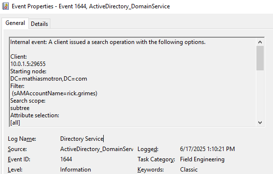

# Audit LDAP Binds and Queries with Regedit
🗓️ Published: 2025-06-17

## Enable auditing of LDAP binds and queries via the Windows Registry

To diagnose and secure your Active Directory infrastructure, you can enable on the Domain Controller side detailed logging of **all** LDAP connections (binds) and LDAP operations (SearchRequest, Add/Modify/Delete, etc.) using registry keys. Here's how:

> This setting is the **prerequisite** for the [Audit and Enforcement for LDAP Signing](Audit%20and%20Enforcement%20for%20LDAP%20Signing.md) and [Audit and Enforcement for Channel Binding Token](Audit%20and%20Enforcement%20for%20Channel%20Binding%20Token.md) articles, which rely on the verbose LDAP interface events surfaced here.

---

### 1. NTDS Diagnostics settings location

All LDAP diagnostics are configured under the following registry key:

```
HKEY_LOCAL_MACHINE
 └─ SYSTEM
    └─ CurrentControlSet
       └─ Services
          └─ NTDS
             └─ Diagnostics
```

In this key, two DWORD values are of particular interest:

| Value name                        | Category number | Description                                                                           |
|-----------------------------------|-----------------|---------------------------------------------------------------------------------------|
| **15 Field Engineering Events**   | 15              | Field Engineering events (advanced configuration and troubleshooting logs)           |
| **16 LDAP Interface Events**      | 16              | Detailed logs of **all** LDAP operations (bind, search, controls, etc.)               |

---

### 2. Enable Field Engineering (Category 15)

1. Open **Regedit** (Start → `regedit.exe`).  
2. Navigate to `HKLM:\SYSTEM\CurrentControlSet\Services\NTDS\Diagnostics`.  
3. Create or modify the DWORD named `15 Field Engineering Events`:  
   - **Type**: `REG_DWORD`  
   - **Value data**:  
     - `0` → Off (default)  
     - `1` → Errors only  
     - `2` → Warnings  
     - **`5` → Verbose (log everything)**  
4. Restart the **Active Directory Domain Services** service (or reboot the DC).

> **Use case**: Category 15 is enabled to capture configuration events, referrals, redirections, or internal AD engine errors, without detailing each LDAP request. In practice, this category is rarely needed outside of Microsoft Support troubleshooting — **Category 16 covers most operational and security audit needs**.

---

### 3. Enable LDAP Interface Logging (Category 16)

1. In the same `NTDS\Diagnostics` key, create or modify the DWORD `16 LDAP Interface Events`:  
   - **Type**: `REG_DWORD`  
   - **Value data**:  
     - `0` → Off  
     - `1` → Errors only  
     - `2` → Warnings  
     - **`5` → Verbose (log everything)**  
2. Also restart the **Active Directory Domain Services** service.

> **Use case**: Category 16 in verbose mode logs every LDAP operation on ports 389/636 – SearchRequest, Bind (simple or SASL), Add/Modify/Delete, including filters, returned attributes, and controls (DirSync, paged-results, etc.).

---

### 4. Where to view the logs?

- **Event Viewer** → **Applications and Services Logs** → **Directory Service**
- Provider: `Microsoft-Windows-ActiveDirectory_DomainService`

Key events to look for once Category 16 = 5:

| Event ID | Meaning |
|---|---|
| **1644** | Search query statistics (filter, attributes, base DN, client IP, elapsed time, rows returned). Historically known as “expensive / inefficient / slow LDAP query”. At verbose level it is emitted for **all** LDAP searches, which makes it the workhorse event for LDAP auditing. |
| **1138** | Internal LDAP processing events (resource usage, query optimizer). |
| **2886** | The DC is **not** requiring signing (advisory, emitted at startup if applicable). |
| **2887** | Summary count of unsigned / clear simple binds received over the last 24h. |
| **2888** | Detail event for each unsigned SASL bind (client IP, account, binding type). |
| **2889** | Detail event for each clear-text simple bind on port 389 (client IP, account, binding type). |

> The exact set of events depends on the operating system version of the DC. For LDAPS-specific tracking (channel binding, SSL bind details), see also Schannel events on the **System** log.


---

### 5. Difference between Category 15 and Category 16

| Criterion                        | Category 15 (Field Engineering)         | Category 16 (LDAP Interface)                              |
|----------------------------------|-----------------------------------------|------------------------------------------------------------|
| **Purpose**                      | Internal diagnostics & advanced errors  | Exhaustive logging of all LDAP operations                  |
| **Event types**                  | Referrals, redirections, engine errors  | Query, Bind, Add/Modify/Delete, controls, filters, etc.   |
| **Data volume**                  | Moderate                                | Very high (potentially thousands of events/hour)           |
| **Recommended usage**            | Bug troubleshooting, Microsoft support  | Audit, troubleshooting, compliance, and forensic analysis  |

---

#### Example PowerShell script for GPO startup to deploy these values

```powershell
New-ItemProperty -Path 'HKLM:\SYSTEM\CurrentControlSet\Services\NTDS\Diagnostics' `
  -Name '15 Field Engineering Events'    -PropertyType DWord -Value 5 -Force
New-ItemProperty -Path 'HKLM:\SYSTEM\CurrentControlSet\Services\NTDS\Diagnostics' `
  -Name '16 LDAP Interface Events'       -PropertyType DWord -Value 5 -Force

Restart-Service ntds -Force
```

---

> **Caution**:  
> - In verbose mode, the **Directory Service** log can grow very quickly (potentially thousands of events per hour on a busy DC). Plan for log rotation, increase the log max size (`wevtutil sl "Directory Service" /ms:524288000` = 500 MB), or forward to a SIEM.  
> - `Restart-Service ntds -Force` **restarts Active Directory Domain Services**, which interrupts authentication on the targeted DC for a few seconds. In production, do it **one DC at a time**, never in parallel, ideally during off-hours, and validate replication health (`repadmin /replsummary`) before moving to the next DC.
> - To distinguish LDAP simple binds vs LDAPS, correlate with Schannel events on the System log (provider `Schannel`), or use events **2888 / 2889** described above.

### Revert after audit

Once the audit is complete, revert the verbose logging to keep the Directory Service log clean:

```powershell
Set-ItemProperty -Path 'HKLM:\SYSTEM\CurrentControlSet\Services\NTDS\Diagnostics' `
  -Name '15 Field Engineering Events' -Value 0
Set-ItemProperty -Path 'HKLM:\SYSTEM\CurrentControlSet\Services\NTDS\Diagnostics' `
  -Name '16 LDAP Interface Events'    -Value 0
Restart-Service ntds -Force
```

---

With this configuration, you will have a complete record of all LDAP connections and queries to your domain controllers.

## References

- [Configure Active Directory diagnostic event logging (KB 314980)](https://learn.microsoft.com/troubleshoot/windows-server/active-directory/configure-ad-event-logging)
- [How to find expensive, inefficient, and long running Active Directory queries](https://learn.microsoft.com/troubleshoot/windows-server/active-directory/find-expensive-inefficient-long-running-queries)
- [2020 LDAP channel binding and LDAP signing requirements for Windows](https://learn.microsoft.com/troubleshoot/windows-server/active-directory/2020-ldap-channel-binding-and-ldap-signing-requirements-for-windows)

