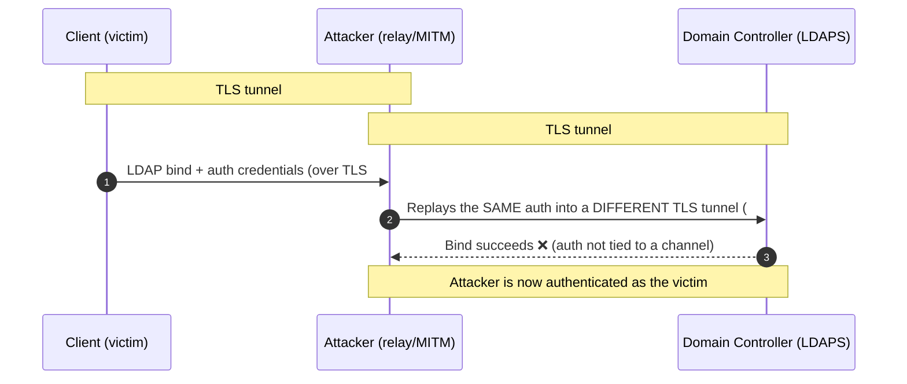
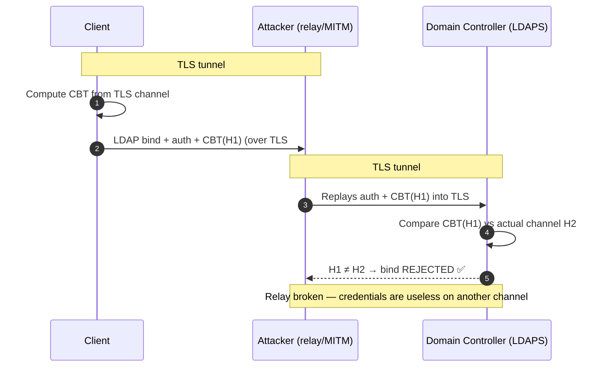
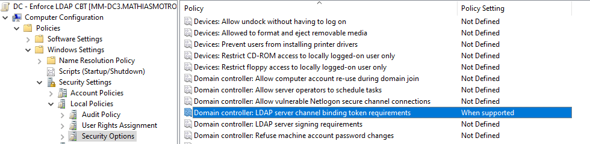
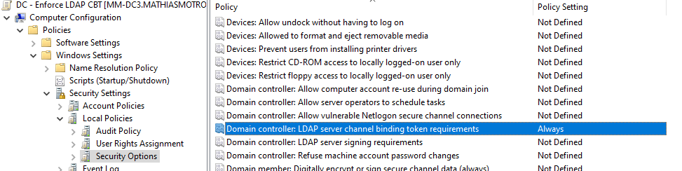

# Audit and Enforcement for Channel Binding Token
🗓️ Published: 2025-12-03

## Introduction

This note documents a safe rollout to enforce **Channel Binding Tokens (CBT)** for LDAPS on Windows Server DCs. CBT cryptographically ties the LDAP authentication to the underlying TLS channel, preventing channel-reuse/MITM tricks.

 **Prereqs:** valid DC LDAPS certificates, TLS 1.2 enabled on DCs, and basic LDAPS validation in your environment.

## How Channel Binding Tokens work and what they protect against

### The problem: TLS alone doesn't bind authentication to the channel

When a client connects to a DC over LDAPS, two independent things happen:

1. A **TLS tunnel** is established (certificate + session keys) — this encrypts the traffic.
2. An **LDAP bind** authenticates the user (e.g. SASL/GSSAPI with Kerberos or NTLM).

The catch: by default, the authentication step has **no idea which TLS tunnel it is running inside**. The cryptographic proof of identity is not tied to the specific encrypted channel. That gap is exactly what an attacker exploits in an **LDAPS relay / man-in-the-middle** attack.



Because the authentication material is valid on **any** channel, the attacker can terminate the victim's TLS session, open a brand-new one to the DC, and forward the credentials. The DC can't tell the two tunnels apart.

### The fix: bind the authentication to the exact TLS channel

A **Channel Binding Token (CBT)** is a fingerprint of the **server's TLS certificate/channel** (`tls-server-end-point`) that the client mixes into its authentication exchange. The DC then verifies that the CBT presented inside the bind matches the **actual TLS channel** the bind arrived on.



Now the stolen authentication is **worthless on any other tunnel**: the CBT computed for tunnel #1 will never match tunnel #2, so the DC rejects the relayed bind.

### But why can't the attacker just swap CBT(H1) for CBT(H2)?

This is the subtle part. At first glance the attacker seems to have two options to defeat the check — both fail:

| Attacker's move | What happens | Result |
|---|---|---|
| **Keep CBT(H1)** and relay it into tunnel #2 | The DC computes the *real* channel hash (H2) and compares: `H1 ≠ H2` | ❌ Rejected |
| **Replace it with CBT(H2)** to match tunnel #2 | The CBT is **not** a clear-text field — it's folded into the authentication's integrity signature (**MIC**), which is keyed by the client's secret | ❌ Can't re-sign |

The key insight: the CBT is **not sent as an editable plain value**. It is mixed into a cryptographic integrity check computed by the client:

- **Kerberos / SPNEGO** → the **MIC** in the `AP-REQ` authenticator
- **NTLM** → the `MIC` field + `MsvAvChannelBindings` AV_PAIR inside the NTLMv2 response

That signature is produced with a **session key derived from the client's secret** (password/key) — something the attacker does **not** possess. So if the attacker edits the CBT, the signature no longer matches; and to recompute a valid signature over CBT(H2), they would need the victim's secret.

> 🔐 **In one sentence:** the **CBT** binds the authentication to the *channel*, and the **MIC** binds the CBT to the *identity*. The attacker can break neither without the victim's secret — which is exactly why NTLM/Kerberos relay to LDAPS (as used in **PetitPotam → AD CS / ESC8** attacks) is neutralized once `LdapEnforceChannelBinding = 2`.

### Where the setting fits

`LdapEnforceChannelBinding` on the DC controls how strictly the DC checks the CBT:

| Value | Mode | Behavior | Posture |
|---|---|---|---|
| `0` | Disabled | CBT never checked | ❌ Vulnerable to LDAPS relay |
| `1` | When supported | Checked **if** the client sends one; legacy clients still allowed | ⚠️ Transitional (audit) |
| `2` | Required | Every LDAPS bind **must** present a valid CBT | ✅ Protected |

> 🔑 **Key idea:** CBT closes the gap between the *encrypted channel* (TLS) and the *authenticated identity* (LDAP bind). Setting `2 = Required` is what actually stops the relay; `1 = When supported` only **logs** the gap so you can find legacy clients first (events **3074 / 3075**).

## Rollout strategy (two steps)

1. **Phase 1 — When supported (`LdapEnforceChannelBinding = 1`)**
   - **Purpose:** detect and fix legacy clients/libraries that don't present CBT.
   - **Actions:** monitor **Directory Service ▸ LDAP Interface Events** for bind failures, validate LDAPS with `Ldp.exe`, and inventory any failing apps/middlewares.

2. **Phase 2 — Required (`LdapEnforceChannelBinding = 2`)**
   - **Purpose:** enforce CBT for all LDAPS binds.
   - **Actions:** after remediation, flip to **Required** and keep monitoring for residual failures.

> ⚠️ **Compatibility warning before Phase 2:** moving to `Required` will reject any LDAPS bind that doesn't present a valid CBT. Known impact areas: legacy NPS/RADIUS deployments, older Java/Oracle/IBM LDAP client libraries, third-party identity appliances, scanners and printers using LDAPS, and any in-house app using a non-Windows LDAP stack. **Do not skip Phase 1** — it's there to surface these clients via events 3074 / 3075 *before* you start blocking traffic.

## Phase 0 - Server-side posture check (DC settings for CBT)

> This check is **read-only** and should be run before any change to establish the current posture across all DCs.

```powershell
<#
CBT (Channel Binding Tokens) Audit for Domain Controllers
- PowerShell 5.1
- Embedded DC list (no parameters)
- Read-only: checks CBT registry on each DC via WinRM (Invoke-Command)
- Single colored audit section + robust per-DC summary

CBT key (on DC):
  HKLM\SYSTEM\CurrentControlSet\Services\NTDS\Parameters\LdapEnforceChannelBinding (DWORD)
    0 = Disabled
    1 = WhenSupported
    2 = Required
    (absent) = NotConfigured (treated as Disabled for risk posture)

Compliance policy:
  - Required        => Compliant
  - WhenSupported   => Warning
  - Disabled/absent => Failed
#>

cls

# --- Embedded DC list ---
$dcs = @(
  'MM-DC1.mathiasmotron.com',
  'MM-DC2.mathiasmotron.com',
  'MM-DC3.mathiasmotron.com'
)

# --- Remote audit payload (runs locally on each DC) ---
$remoteScript = {
  function Get-RegDword {
    param([string]$Path,[string]$Name)
    if (Test-Path -Path $Path) {
      try { (Get-ItemProperty -Path $Path -ErrorAction Stop).$Name } catch { $null }
    } else { $null }
  }

  $base = 'HKLM:\SYSTEM\CurrentControlSet\Services\NTDS\Parameters'
  $cbt  = Get-RegDword -Path $base -Name 'LdapEnforceChannelBinding'

  # Derive human-readable state for CBT
  $cbtState = 'NotConfigured'
  if     ($cbt -eq 0) { $cbtState = 'Disabled' }
  elseif ($cbt -eq 1) { $cbtState = 'WhenSupported' }
  elseif ($cbt -eq 2) { $cbtState = 'Required' }

  [pscustomobject]@{
    Computer   = $env:COMPUTERNAME
    Effective  = $cbtState
    Raw        = $(if($cbt -ne $null){$cbt}else{'(absent)'})
    RegPath    = $base
    RegValue   = 'LdapEnforceChannelBinding'
  }
}

# --- Collect results from each DC ---
$raw = @()
foreach ($dc in $dcs) {
  try {
    $res = Invoke-Command -ComputerName $dc -ScriptBlock $remoteScript -ErrorAction Stop
    $raw += $res
  } catch {
    $raw += [pscustomobject]@{
      Computer   = $dc
      Effective  = 'Unreachable/AccessDenied'
      Raw        = '(n/a)'
      RegPath    = '(n/a)'
      RegValue   = 'LdapEnforceChannelBinding'
    }
  }
}

# --- Compliance scoring ---
$withStatus = foreach ($r in $raw) {
  $status = 'Warning'
  if     ($r.Effective -eq 'Required')                    { $status = 'Compliant' }
  elseif ($r.Effective -eq 'WhenSupported')               { $status = 'Warning'   }
  elseif ($r.Effective -in @('Disabled','NotConfigured')) { $status = 'Failed'    }
  elseif ($r.Effective -eq 'Unreachable/AccessDenied')    { $status = 'Failed'    }

  [pscustomobject]@{
    Computer   = $r.Computer
    Effective  = $r.Effective
    Raw        = $r.Raw
    Status     = $status
    RegPath    = $r.RegPath
    RegValue   = $r.RegValue
  }
}

# --- Single colored CBT audit section ---
Write-Host ""
Write-Host "=== CBT audit (LdapEnforceChannelBinding) ===" -ForegroundColor Cyan

# Header
$header = "{0,-18} {1,-14} {2,-8} {3,-10} {4}" -f 'Computer','Effective','Raw','Status','RegistryPath\Value'
Write-Host $header -ForegroundColor Gray
Write-Host ('-' * ($header.Length + 20)) -ForegroundColor DarkGray

# Rows
foreach ($o in ($withStatus | Sort-Object Computer)) {
  $color = 'Yellow'
  if     ($o.Status -eq 'Compliant') { $color = 'Green' }
  elseif ($o.Status -eq 'Failed')    { $color = 'Red'   }

  $right = "{0}\{1}" -f $o.RegPath, $o.RegValue
  $line  = "{0,-18} {1,-14} {2,-8} {3,-10} {4}" -f $o.Computer, $o.Effective, $o.Raw, $o.Status, $right
  Write-Host $line -ForegroundColor $color
}

# --- Summary per DC (robust counting) ---
Write-Host ""
Write-Host "=== Summary per DC ===" -ForegroundColor Cyan

$summary = $withStatus |
  Group-Object Computer |
  ForEach-Object {
    $c   = $_.Name
    $sts = @($_.Group | ForEach-Object { $_.Status })   # force array
    $ok  = (@($sts | Where-Object { $_ -eq 'Compliant' })).Count
    $wrn = (@($sts | Where-Object { $_ -eq 'Warning'   })).Count
    $ko  = (@($sts | Where-Object { $_ -eq 'Failed'    })).Count
    [pscustomobject]@{
      Computer  = $c
      Compliant = [int]$ok
      Warning   = [int]$wrn
      Failed    = [int]$ko
    }
  }

$summary | Sort-Object Computer | Format-Table -AutoSize

# --- (Optional) CSV export ---
# $csv = Join-Path (Get-Location) ("CBT_Audit_{0:yyyyMMdd_HHmmss}.csv" -f (Get-Date))
# $withStatus | Export-Csv -NoTypeInformation -Encoding UTF8 -Path $csv
# Write-Host ("Export CSV -> {0}" -f $csv) -ForegroundColor Cyan
```

## Rollout to Phase 1 — When supported

### Apply to the **Domain Controllers**:

- `HKLM\SYSTEM\CurrentControlSet\Services\NTDS\Parameters\LdapEnforceChannelBinding` (DWORD)
  - `1` = **When supported** (Phase 1)

- Or with GPO:



### Increase Logs verbosity to track CBT Events

- Increase Logs verbosity
  - Enable LDAP interface diagnostics to see these consistently:
HKLM\SYSTEM\CurrentControlSet\Services\NTDS\Diagnostics → “16 LDAP Interface Events” = 5 (REG_DWORD).

**You can check LDAP Diagnostics Logs settings and RegKey value on DC with this script:**
```powershell
<#
Check "16 LDAP Interface Events" = 5 on Domain Controllers
- PowerShell 5.1
- Embedded DC list (no parameters)
- Read-only via WinRM
- Colored output + per-DC summary

Registry:
HKLM\SYSTEM\CurrentControlSet\Services\NTDS\Diagnostics
  "16 LDAP Interface Events" (REG_DWORD)
Target value: 5
#>

cls

# --- Embedded DC list ---
$dcs = @(
  'MM-DC1.mathiasmotron.com',
  'MM-DC2.mathiasmotron.com',
  'MM-DC3.mathiasmotron.com'
)

# --- Remote probe (runs on each DC) ---
$remoteScript = {
  $path = 'HKLM:\SYSTEM\CurrentControlSet\Services\NTDS\Diagnostics'
  $name = '16 LDAP Interface Events'

  $raw  = $null
  if (Test-Path $path) {
    try { $raw = (Get-ItemProperty -Path $path -ErrorAction Stop)."$name" } catch { $raw = $null }
  }

  # Derive status
  $effective = if ($raw -ne $null) { [string]$raw } else { '(absent)' }
  $status =
    if ($raw -eq 5) { 'Compliant' }
    elseif ($raw -eq $null) { 'Failed' }
    else { 'Warning' }  # present but not 5

  [pscustomobject]@{
    Computer = $env:COMPUTERNAME
    Path     = $path
    Name     = $name
    Raw      = $effective
    Status   = $status
  }
}

# --- Collect ---
$rows = @()
foreach ($dc in $dcs) {
  try {
    $rows += Invoke-Command -ComputerName $dc -ScriptBlock $remoteScript -ErrorAction Stop
  } catch {
    $rows += [pscustomobject]@{
      Computer = $dc
      Path     = 'HKLM:\SYSTEM\CurrentControlSet\Services\NTDS\Diagnostics'
      Name     = '16 LDAP Interface Events'
      Raw      = '(unreachable)'
      Status   = 'Failed'
    }
  }
}

# --- Pretty colored table ---
Write-Host ""
Write-Host '=== LDAP Interface Events level (target = 5) ===' -ForegroundColor Cyan
$header = "{0,-18} {1,-8} {2,-10} {3}" -f 'Computer','Raw','Status','RegistryPath\Name'
Write-Host $header -ForegroundColor Gray
Write-Host ('-' * ($header.Length + 20)) -ForegroundColor DarkGray

foreach ($r in ($rows | Sort-Object Computer)) {
  $color = if ($r.Status -eq 'Compliant') { 'Green' } elseif ($r.Status -eq 'Failed') { 'Red' } else { 'Yellow' }
  $line  = "{0,-18} {1,-8} {2,-10} {3}\{4}" -f $r.Computer, $r.Raw, $r.Status, $r.Path, $r.Name
  Write-Host $line -ForegroundColor $color
}

# --- Summary per DC ---
Write-Host ""
Write-Host "=== Summary per DC ===" -ForegroundColor Cyan
$summary = $rows | Group-Object Computer | ForEach-Object {
  $c   = $_.Name
  $sts = @($_.Group | ForEach-Object { $_.Status })
  [pscustomobject]@{
    Computer  = $c
    Compliant = (@($sts | Where-Object { $_ -eq 'Compliant' })).Count
    Warning   = (@($sts | Where-Object { $_ -eq 'Warning'   })).Count
    Failed    = (@($sts | Where-Object { $_ -eq 'Failed'    })).Count
  }
}
$summary | Sort-Object Computer | Format-Table -AutoSize
```

**If you need to change LDAP Diagnostics Logs settings and RegKey '16 LDAP Interface Events' value to '5' on DC, use this script:**
```powershell
<#
Set "16 LDAP Interface Events" = 5 on Domain Controllers
- PowerShell 5.1
- Embedded DC list (no parameters)
- Creates the Diagnostics key if missing
- Colored output + before/after + summary
#>

cls

# --- Embedded DC list ---
$dcs = @(
  'MM-DC1.mathiasmotron.com',
  'MM-DC2.mathiasmotron.com',
  'MM-DC3.mathiasmotron.com'
)

# --- Target registry ---
$Path    = 'HKLM:\SYSTEM\CurrentControlSet\Services\NTDS\Diagnostics'
$Name    = '16 LDAP Interface Events'
$Desired = 5   # REG_DWORD

# --- Remote setter (runs on each DC) ---
$remoteScript = {
  param([string]$Path,[string]$Name,[int]$Desired)

  function Get-RegValue {
    param([string]$P,[string]$N)
    if (Test-Path -Path $P) {
      try { (Get-ItemProperty -Path $P -ErrorAction Stop).$N } catch { $null }
    } else { $null }
  }

  $before = Get-RegValue -P $Path -N $Name

  # Ensure key exists
  try { New-Item -Path $Path -Force -ErrorAction Stop | Out-Null } catch {}

  # Set value
  $setOK = $true
  try {
    if ($before -ne $Desired) {
      New-ItemProperty -Path $Path -Name $Name -Value $Desired -PropertyType DWord -Force -ErrorAction Stop | Out-Null
    } else {
      # already desired: still enforce to be safe
      New-ItemProperty -Path $Path -Name $Name -Value $Desired -PropertyType DWord -Force -ErrorAction Stop | Out-Null
    }
  } catch {
    $setOK = $false
    $errMsg = $_.Exception.Message
  }

  $after = Get-RegValue -P $Path -N $Name

  $status = if ($setOK -and ($after -eq $Desired)) { 'Success' } else { 'Failed' }
  $note   = if ($status -eq 'Failed') { $errMsg } else { '' }

  [pscustomobject]@{
    Computer = $env:COMPUTERNAME
    Path     = $Path
    Name     = $Name
    Before   = $(if($before -ne $null){[string]$before}else{'(absent)'})
    After    = $(if($after  -ne $null){[string]$after }else{'(absent)'})
    Desired  = [string]$Desired
    Status   = $status
    Note     = $note
  }
}

# --- Execute on all DCs ---
$results = @()
foreach ($dc in $dcs) {
  try {
    $results += Invoke-Command -ComputerName $dc -ScriptBlock $remoteScript -ArgumentList $Path,$Name,$Desired -ErrorAction Stop
  } catch {
    $results += [pscustomobject]@{
      Computer = $dc
      Path     = $Path
      Name     = $Name
      Before   = '(n/a)'
      After    = '(n/a)'
      Desired  = [string]$Desired
      Status   = 'Failed'
      Note     = "Unreachable/AccessDenied: $($_.Exception.Message)"
    }
  }
}

# --- Pretty colored output ---
Write-Host ""
Write-Host '=== Set "16 LDAP Interface Events" to 5 ===' -ForegroundColor Cyan
$header = "{0,-18} {1,-10} {2,-10} {3,-8} {4}" -f 'Computer','Before','After','Status','RegistryPath\Name'
Write-Host $header -ForegroundColor Gray
Write-Host ('-' * ($header.Length + 20)) -ForegroundColor DarkGray

foreach ($r in ($results | Sort-Object Computer)) {
  $color = if ($r.Status -eq 'Success') { 'Green' } else { 'Red' }
  $line  = "{0,-18} {1,-10} {2,-10} {3,-8} {4}\{5}" -f $r.Computer,$r.Before,$r.After,$r.Status,$r.Path,$r.Name
  Write-Host $line -ForegroundColor $color
  if ($r.Note) { Write-Host ("  -> " + $r.Note) -ForegroundColor DarkYellow }
}

# --- Summary ---
Write-Host ""
Write-Host "=== Summary ===" -ForegroundColor Cyan
$ok = (@($results | Where-Object { $_.Status -eq 'Success' })).Count
$ko = (@($results | Where-Object { $_.Status -ne 'Success' })).Count
[pscustomobject]@{ Success=$ok; Failed=$ko } | Format-Table -AutoSize
```

### Monitor Events for client not CBT Capable

- Here’s what to watch when you’re in “When supported” mode:

Event Viewer → Applications and Services Logs ▸ Directory Service
Source: Microsoft-Windows-ActiveDirectory_DomainService.

- Key event IDs (Directory Service log on DCs):
  - 3039 — A client performed an LDAP bind over SSL/TLS and failed CBT validation (malformed/invalid CBT).
  - 3074 — The client sent a CBT but it was invalid and would have failed if enforcement were enabled.
  - 3075 — The client did not send a CBT and would have failed if enforcement were enabled.

- Reading tips:
* 3075 (no CBT) → clients/libs that don’t support CBT → upgrade/replace.
* 3074 (invalid CBT) → clients send bad CBT → fix TLS terminators/libraries/config.
* 3039 → actual failures even in “When supported”.

**PS Script to Track CBT Events on DC:**
```powershell
<#
CBT Monitoring on Domain Controllers (Directory Service events)
- PowerShell 5.1
- No parameters: embedded DC list, adjustable lookback window
- Collects event IDs: 3039 (failed CBT), 3074 (invalid CBT would-fail), 3075 (no CBT would-fail)
- Pretty colored output + per-DC and per-Event summaries
- CSV export block is commented out (optional)

Notes:
- Log: "Applications and Services Logs\Directory Service"
- Provider: Microsoft-Windows-ActiveDirectory_DomainService
- Increase verbosity if needed:
  HKLM:\SYSTEM\CurrentControlSet\Services\NTDS\Diagnostics
  "16 LDAP Interface Events" (REG_DWORD) = 2..5
#>

cls

# --- Configuration (edit here) ---
$LookbackHours   = 168      # 7 days
$ExportCsvMain   = $false   # CSV export is disabled; block is commented below
$ShowTopSections = $false   # set $true to print "Top Clients / Top Accounts"
$TopN            = 10
$OutDir          = Join-Path $PWD ("CBT_Monitor_{0:yyyyMMdd_HHmmss}" -f (Get-Date))

# Embedded DC list
$dcs = @(
  'MM-DC1.mathiasmotron.com',
  'MM-DC2.mathiasmotron.com',
  'MM-DC3.mathiasmotron.com'
)

# Event IDs of interest
$EventIds = 3039,3074,3075

# --- Remote query payload (runs on each DC) ---
$remoteScript = {
  param([int]$Hours,[int[]]$Ids)

  # Helper: Safe Get-WinEvent query for Directory Service (provider + Id + time)
  $start = (Get-Date).AddHours(-1 * $Hours)
  $fh = @{
    ProviderName = 'Microsoft-Windows-ActiveDirectory_DomainService'
    Id           = $Ids
    StartTime    = $start
    LogName      = 'Directory Service'
  }

  # Extract useful fields from the event (Message is free text; we regex a few hints)
  function Parse-Event {
    param([System.Diagnostics.Eventing.Reader.EventRecord]$ev)

    $msg = $null
    try { $msg = $ev.FormatDescription() } catch { $msg = $null }

    # Attempt to extract client IP and account-like tokens from the message
    $clientIp = $null
    $account  = $null

    if ($msg) {
      # IPv4 candidate
      $ipMatch = [regex]::Match($msg, '(?<ip>\b\d{1,3}(?:\.\d{1,3}){3}\b)')
      if ($ipMatch.Success) { $clientIp = $ipMatch.Groups['ip'].Value }

      # Account-like tokens (UPN or DOMAIN\user)
      $upnMatch = [regex]::Match($msg, '(?<upn>[A-Za-z0-9._%-]+@[A-Za-z0-9.-]+\.[A-Za-z]{2,})')
      if ($upnMatch.Success) { $account = $upnMatch.Groups['upn'].Value }
      if (-not $account) {
        $samMatch = [regex]::Match($msg, '(?<sam>\b[A-Za-z0-9_.-]+\\[A-Za-z0-9_.$-]+\b)')
        if ($samMatch.Success) { $account = $samMatch.Groups['sam'].Value }
      }
    }

    [pscustomobject]@{
      DC           = $env:COMPUTERNAME
      TimeCreated  = $ev.TimeCreated
      EventId      = $ev.Id
      Level        = $ev.LevelDisplayName
      ClientIP     = $(if($clientIp){$clientIp}else{'(n/a)'})
      Account      = $(if($account){$account}else{'(n/a)'})
      Message      = $(if($msg){$msg}else{'(message unavailable)'})
    }
  }

  $out = New-Object System.Collections.Generic.List[object]

  # Get events quietly; treat "no results" as not an error
  $events = Get-WinEvent -FilterHashtable $fh -ErrorAction SilentlyContinue
  if ($events) {
    foreach ($e in $events) { $out.Add( (Parse-Event -ev $e) ) | Out-Null }
  }

  $out
}

# --- Collect from all DCs ---
$all = @()
foreach ($dc in $dcs) {
  try {
    $res = Invoke-Command -ComputerName $dc -ScriptBlock $remoteScript -ArgumentList $LookbackHours, $EventIds -ErrorAction Stop
    $all += $res
  } catch {
    # Only add a row if the DC is unreachable; do not confuse with "no events"
    $all += [pscustomobject]@{
      DC           = $dc
      TimeCreated  = Get-Date
      EventId      = '(n/a)'
      Level        = 'Error'
      ClientIP     = '(n/a)'
      Account      = '(n/a)'
      Message      = "Unreachable/AccessDenied: $($_.Exception.Message)"
    }
  }
}

# --- Color map by EventId ---
function Get-Color {
  param([string]$id)
  # 3039 = real CBT failure (red), 3074/3075 = would-fail (yellow), others/errors = magenta
  if ($id -eq '3039') { return 'Red' }
  if ($id -eq '3074' -or $id -eq '3075') { return 'Yellow' }
  return 'Magenta'
}

# --- Main table (colored rows) ---
Write-Host ""
Write-Host ("=== CBT Events (last {0} hours) ===" -f $LookbackHours) -ForegroundColor Cyan
$header = "{0,-16} {1,-19} {2,-6} {3,-10} {4,-15} {5,-28} {6}" -f 'DC','TimeCreated','ID','Level','ClientIP','Account','Message (truncated)'
Write-Host $header -ForegroundColor Gray
Write-Host ('-' * ($header.Length + 30)) -ForegroundColor DarkGray

$anyRows = $false
foreach ($row in ($all | Sort-Object TimeCreated)) {
  $anyRows = $true
  $color = Get-Color -id ($row.EventId.ToString())
  $msgShort = $row.Message
  if ($msgShort -and $msgShort.Length -gt 120) { $msgShort = $msgShort.Substring(0,120) + '...' }
  $line = "{0,-16} {1,-19:yyyy-MM-dd HH:mm:ss} {2,-6} {3,-10} {4,-15} {5,-28} {6}" -f `
          $row.DC, $row.TimeCreated, $row.EventId, $row.Level, $row.ClientIP, $row.Account, $msgShort
  Write-Host $line -ForegroundColor $color
}
if (-not $anyRows) {
  Write-Host "(no CBT-related events found in the selected window)" -ForegroundColor DarkGray
}

# --- Optional Top sections ---
if ($ShowTopSections -and $all.Count -gt 0) {
  Write-Host ""
  Write-Host ("=== Top Clients (by ClientIP) — Top {0} ===" -f $TopN) -ForegroundColor Cyan
  $topIp = $all |
    Where-Object { $_.EventId -in $EventIds } |
    Group-Object ClientIP |
    ForEach-Object { [pscustomobject]@{ ClientIP=$_.Name; Count=$_.Count } } |
    Sort-Object Count -Descending |
    Select-Object -First $TopN
  if ($topIp) { $topIp | Format-Table -AutoSize } else { Write-Host "(none)" -ForegroundColor DarkGray }

  Write-Host ""
  Write-Host ("=== Top Accounts — Top {0} ===" -f $TopN) -ForegroundColor Cyan
  $topAcct = $all |
    Where-Object { $_.EventId -in $EventIds } |
    Group-Object Account |
    ForEach-Object { [pscustomobject]@{ Account=$_.Name; Count=$_.Count } } |
    Sort-Object Count -Descending |
    Select-Object -First $TopN
  if ($topAcct) { $topAcct | Format-Table -AutoSize } else { Write-Host "(none)" -ForegroundColor DarkGray }
}

# --- Summaries ---
Write-Host ""
Write-Host "=== Summary by DC ===" -ForegroundColor Cyan
$byDc = $all | Where-Object { $_.EventId -in $EventIds } | Group-Object DC | ForEach-Object {
  $name = $_.Name
  $n3039 = (@($_.Group | Where-Object {$_.EventId -eq 3039})).Count
  $n3074 = (@($_.Group | Where-Object {$_.EventId -eq 3074})).Count
  $n3075 = (@($_.Group | Where-Object {$_.EventId -eq 3075})).Count
  [pscustomobject]@{
    DC     = $name
    E3039  = $n3039
    E3074  = $n3074
    E3075  = $n3075
    Total  = $n3039 + $n3074 + $n3075
  }
}
if ($byDc) { $byDc | Sort-Object DC | Format-Table -AutoSize } else { Write-Host "(no data)" -ForegroundColor DarkGray }

Write-Host ""
Write-Host "=== Summary by EventId ===" -ForegroundColor Cyan
$byId = $all | Where-Object { $_.EventId -in $EventIds } | Group-Object EventId | ForEach-Object {
  [pscustomobject]@{ EventId = $_.Name; Count = $_.Count }
}
if ($byId) { $byId | Sort-Object EventId | Format-Table -AutoSize } else { Write-Host "(no data)" -ForegroundColor DarkGray }

# --- Optional CSV exports (COMMENTED) ---
<# 
if ($ExportCsvMain) {
  if (-not (Test-Path $OutDir)) { New-Item -ItemType Directory -Path $OutDir | Out-Null }
  $all  | Export-Csv -NoTypeInformation -Encoding UTF8 -Path (Join-Path $OutDir 'CBT_Events_Detail.csv')
  if ($byDc) { $byDc | Export-Csv -NoTypeInformation -Encoding UTF8 -Path (Join-Path $OutDir 'CBT_Events_SummaryByDC.csv') }
  if ($byId) { $byId | Export-Csv -NoTypeInformation -Encoding UTF8 -Path (Join-Path $OutDir 'CBT_Events_SummaryByEventId.csv') }
  Write-Host ("CSV exports -> {0}" -f $OutDir) -ForegroundColor Cyan
}
#>

Write-Host ""
Write-Host "Legend: 3039=failed CBT (RED), 3074=invalid CBT would-fail (YELLOW), 3075=no CBT would-fail (YELLOW)" -ForegroundColor Gray
```

## Rollout to Phase 2 — Required

Apply to the **Domain Controllers**:

- `HKLM\SYSTEM\CurrentControlSet\Services\NTDS\Parameters\LdapEnforceChannelBinding` (DWORD)
  - `2` = **Required** (Phase 2, target state)

- Or with GPO:



## References

- [Microsoft Security Advisory ADV190023 — Microsoft Guidance for Enabling LDAP Channel Binding and LDAP Signing](https://msrc.microsoft.com/update-guide/vulnerability/ADV190023)
- [2020 LDAP channel binding and LDAP signing requirements for Windows](https://learn.microsoft.com/troubleshoot/windows-server/active-directory/2020-ldap-channel-binding-and-ldap-signing-requirements-for-windows)
- [Use the LDAP signing and channel binding events to track non-compliant devices](https://techcommunity.microsoft.com/blog/coreinfrastructureandsecurityblog/use-the-ldap-signing-and-channel-binding-events-to-track-non-compliant-d/3253033)

