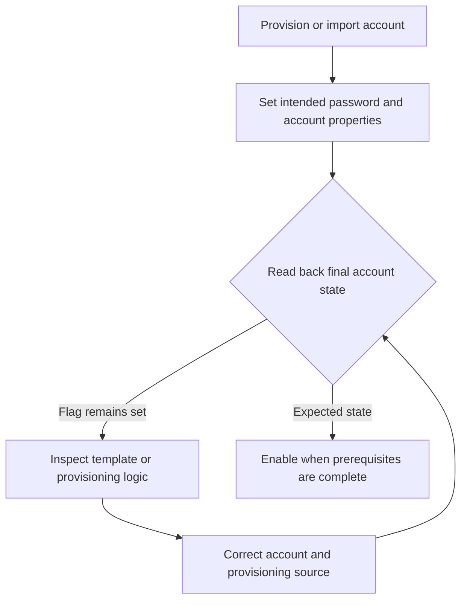

# Auditing Password-Not-Required Accounts in Active Directory: PASSWD_NOTREQD and Safe Remediation

**Password not required is a configuration exception, not a password inventory.** An account with `PasswordNotRequired = True` can still have a long, nonempty password. The flag is worth investigating because it permits a password-not-required state, not because reading it reveals the account's current secret.

This guide covers ordinary AD DS user accounts, including conventional user-based service accounts, on supported Windows Server versions such as 2022 and 2025. Computer, trust and managed service accounts require their own lifecycle rules.

> **TL;DR**
>
> - `PASSWD_NOTREQD` is bit `0x20` (decimal 32) in `userAccountControl`; `PasswordNotRequired` is its PowerShell projection.
> - The flag does not prove the current password is blank and does not make an arbitrary password valid.
> - Audit account type, enabled state, owner, dependencies and provisioning history before remediation.
> - Clear the specific flag with `Set-ADAccountControl`; do not overwrite the entire UAC bitmask.
> - Removing the flag is not password rotation or proof of password strength.
> - Do not test an entire domain by attempting empty-password logons.

## 1. Interpret the setting correctly

Microsoft defines `ADS_UF_PASSWD_NOTREQD` as "No password is required." It is a user-account-control flag; it is not a plaintext password attribute and not the same setting as Password never expires.

| Observation | What it establishes |
|---|---|
| `PasswordNotRequired = True` | The password-not-required flag is set |
| `PasswordNotRequired = False` | The flag is clear; this is not an audit of the current secret's strength |
| A recent `PasswordLastSet` | A recorded password-setting event, not the password's length or randomness |
| `pwdLastSet = 0` | Commonly a must-change-at-next-logon state; not proof of a blank password |
| Account disabled | Ordinary sign-in is blocked; an unsafe flag can remain relevant if the account is later enabled |
| A password-policy object applies | The intended resultant policy; it does not independently attest to every existing password |

Do not assume that a minimum-length or fine-grained policy makes the flag irrelevant. Password set/reset operations and ordinary password changes do not have identical semantics. Remove unnecessary exceptions and establish the desired credential state through supported account-management operations.

The local security policy **Accounts: Limit local account use of blank passwords to console logon only** applies to local accounts, not domain-account logons. It does not compensate for this AD setting.

## 2. Why the flag survives provisioning

Common causes include low-level object creation, old import tools, copied account templates and provisioning jobs that set `userAccountControl` as a numeric constant without preserving the intended flags.

Do not generalize one creation API's initial state to all tools. ADUC, `New-ADUser`, LDAP-based provisioning and third-party products can follow different sequences for creating an object, setting its password and enabling it.



An inventory that is clean today but dirty after tomorrow's import needs a provisioning fix, not a nightly blind cleanup job.

## 3. Inventory normal user accounts without testing passwords

Run from RSAT with directory-read access to the intended domain. The filter deliberately selects normal user accounts with `PASSWD_NOTREQD`, including disabled accounts, and avoids sweeping up computers and trust accounts:

```powershell
Import-Module ActiveDirectory

$queryDc = 'dc01.corp.example'
$domainDn = (Get-ADRootDSE -Server $queryDc).DefaultNamingContext
$filter = '(&(objectCategory=person)(objectClass=user)(userAccountControl:1.2.840.113556.1.4.803:=512)(userAccountControl:1.2.840.113556.1.4.803:=32))'

$candidates = @(Get-ADUser -Server $queryDc -SearchBase $domainDn `
    -LDAPFilter $filter -Properties PasswordNotRequired, PasswordLastSet,
        PasswordNeverExpires, SmartcardLogonRequired, servicePrincipalName,
        adminCount, whenCreated, userAccountControl -ErrorAction Stop)

$candidates | Select-Object SamAccountName, ObjectGUID, SID, Enabled,
    PasswordNotRequired, PasswordLastSet, PasswordNeverExpires,
    SmartcardLogonRequired, servicePrincipalName, adminCount, whenCreated,
    DistinguishedName | Sort-Object Enabled, SamAccountName
```

The LDAP matching rule `1.2.840.113556.1.4.803` performs a bitwise AND test. Decimal 512 selects `NORMAL_ACCOUNT`; decimal 32 selects `PASSWD_NOTREQD`. The query neither reads password material nor attempts authentication as any candidate.

This is a **single-domain** inventory. Repeat against each intended domain and retain its queried DC, query time and collection status. A failed domain query is not zero findings, and querying a forest-root DC does not automatically search every domain.

Avoid exporting free-text descriptions or comments unless needed; they can contain unrelated sensitive data. Do not publish raw account inventories.

## 4. Triage the candidates

| Candidate | Next step |
|---|---|
| Active human account | Identify owner and remove an unexplained exception; assess whether credential renewal is needed |
| User-based service account | Map services, scheduled tasks and applications before any password reset |
| Disabled staging account | Verify the provisioning lifecycle cannot enable it with the flag still set |
| Built-in or special account | Apply the account-specific procedure, not a bulk user remediation |
| Privileged identity | Prioritize review, credential state and recent use |
| Recently created cohort | Investigate the shared creation template or job |

`adminCount = 1` is not a definitive privileged-membership test. Conversely, a clear value does not prove that a user is unprivileged. Use effective group membership and the [AdminSDHolder and SDProp guide](../Concepts/AdminSDHolder%20and%20SDProp%20-%20Protected%20Accounts,%20adminCount%20and%20Safe%20Cleanup.md) to interpret that context.

An SPN suggests a service dependency, but its absence does not rule out a scheduled task or application using the account. See [How to identify AD user accounts used as service accounts](../How-to/Identify%20AD%20user%20accounts%20used%20as%20service%20accounts/How%20to%20identify%20AD%20user%20accounts%20used%20as%20service%20accounts.md).

For one reviewed account, inspect the intended password policy:

```powershell
$candidate = Get-ADUser -Identity 'LabUser' -Server $queryDc `
    -Properties PasswordNotRequired, PasswordLastSet, userAccountControl -ErrorAction Stop

$resultantPolicy = Get-ADUserResultantPasswordPolicy -Identity $candidate `
    -Server $queryDc -ErrorAction Stop

if ($null -eq $resultantPolicy) {
    Get-ADDefaultDomainPasswordPolicy -Identity $domainDn -Server $queryDc
} else {
    $resultantPolicy
}
```

No resultant PSO means the domain policy applies; it does not mean the user has no password policy. The scope and precedence rules are explained in [Fine-Grained Password Policies](../Concepts/Fine-Grained%20Password%20Policies%20-%20Precedence,%20Scope%20and%20Resultant%20Policy.md).

## 5. Remove one reviewed exception

Use a writable DC and an identity with the necessary permission to update the account. Local elevation alone does not grant directory write access. The following preparation rejects non-normal and built-in accounts from this generic path and previews the exact flag change:

```powershell
if (($candidate.userAccountControl -band 0x200) -eq 0) {
    throw 'This procedure is for a normal user account.'
}
if ($candidate.SID.Value -match '-(500|501|502)$') {
    throw 'Use the built-in account-specific procedure.'
}
if (-not $candidate.PasswordNotRequired) {
    throw 'The selected account no longer has PasswordNotRequired set.'
}

$candidateGuid = $candidate.ObjectGUID
$beforeUac = [int]$candidate.userAccountControl

Set-ADAccountControl -Identity $candidateGuid -Server $queryDc `
    -PasswordNotRequired $false -WhatIf
```

`-WhatIf` previews intent. It does not prove the DC will accept the write or that the current password meets policy. Re-read the object if time has passed since review, then perform the same targeted operation:

```powershell
Set-ADAccountControl -Identity $candidateGuid -Server $queryDc `
    -PasswordNotRequired $false -Confirm -ErrorAction Stop
```

Do not replace `userAccountControl` with 512 or another "normal" constant. That can alter disabled state, expiry, smart-card and other unrelated flags. The named parameter expresses the one change being requested.

If the DC rejects the write because of the current password/account state, retain the exact error and resolve that state. Do not weaken the domain policy or re-enable the exception as a permanent workaround. A disabled account that has never received a valid password may need its provisioning completed before the flag can be cleared.

## 6. Credential renewal is a separate decision

Clearing the flag neither rotates the password nor establishes that an old password is strong. When the credential is unknown, suspected blank or potentially exposed, handle a password reset through the account's normal lifecycle.

For a reviewed ordinary user account, a targeted reset can accept a secret directly from the operator:

```powershell
$newPassword = Read-Host 'Enter the new password for the reviewed account' -AsSecureString
try {
    if ($newPassword.Length -eq 0) {
        throw 'A nonempty password is required for this reset.'
    }
    Set-ADAccountPassword -Identity $candidateGuid -Server $queryDc `
        -Reset -NewPassword $newPassword -Confirm -ErrorAction Stop
} finally {
    $newPassword.Dispose()
}
```

A nonempty string check is not password-policy validation; the DC still evaluates the operation. After a required reset, repeat the flag-removal operation if it previously failed. Choose must-change-at-next-logon behavior according to the human account's access method; do not impose it on unattended service accounts.

For a service account, coordinate the new credential in every dependent workload and test it before closing the change. Prefer a managed service account where the application supports it. Computer, trust, `krbtgt` and managed-service-account passwords must not be reset by this generic user workflow.

Do not run empty-password authentication attempts across the candidate list. Besides creating lockout and alert noise, some LDAP empty-password bind semantics can yield unauthenticated access rather than proving the supplied user authenticated. Attribute auditing does not need credential guessing.

## 7. Verify the flag and preserve unrelated state

Read from the same DC after the change, then from a second DC after replication has converged:

```powershell
$after = Get-ADUser -Identity $candidateGuid -Server $queryDc `
    -Properties PasswordNotRequired, PasswordLastSet, userAccountControl -ErrorAction Stop

if ($after.PasswordNotRequired) {
    throw 'PasswordNotRequired is still enabled.'
}

$otherBitsChanged = ($beforeUac -bxor [int]$after.userAccountControl) -band (-bnot 0x20)
[pscustomobject]@{
    Account = $after.SamAccountName
    ObjectGuid = $after.ObjectGUID
    PasswordNotRequired = $after.PasswordNotRequired
    Enabled = $after.Enabled
    PasswordLastSet = $after.PasswordLastSet
    UnrelatedUacBitsChanged = $otherBitsChanged -ne 0
}
```

If unrelated bits changed, investigate concurrent administration rather than automatically writing the old bitmask back. Also test the intended user or application flow and review provisioning results after the next scheduled run.

The completion criteria are an expected flag state, a known credential-management decision, functioning dependencies and no recurrence from provisioning. A successful cmdlet call alone covers only one of those.

## 8. Monitor the cause, not just the count

Track new accounts and account changes through events 4720 and 4738 when the corresponding audit policy is enabled. Correlate password-reset activity with 4724 and relevant directory changes with 5136 where the appropriate SACL is present.

Maintain the account GUID, domain, first-seen date, enabled state, owner, reason for the exception and remediation outcome. An expected delay in a central assessment dashboard does not overrule a direct post-change read of AD, but replication and later automation can still change the final state.

Microsoft Defender for Identity identifies Password not required as an insecure account attribute. Use that assessment as a finding to validate, not as evidence that a password value was inspected.

## References

- [ADS_USER_FLAG_ENUM](https://learn.microsoft.com/en-us/windows/win32/api/iads/ne-iads-ads_user_flag_enum)
- [Set-ADAccountControl](https://learn.microsoft.com/en-us/powershell/module/activedirectory/set-adaccountcontrol)
- [Get-ADUser](https://learn.microsoft.com/en-us/powershell/module/activedirectory/get-aduser)
- [Set-ADAccountPassword](https://learn.microsoft.com/en-us/powershell/module/activedirectory/set-adaccountpassword)
- [Microsoft Defender for Identity account assessments](https://learn.microsoft.com/en-us/defender-for-identity/security-posture-assessments/accounts#unsecure-account-attributes)
- [Local-account blank-password restrictions](https://learn.microsoft.com/en-us/windows/security/threat-protection/security-policy-settings/accounts-limit-local-account-use-of-blank-passwords-to-console-logon-only)