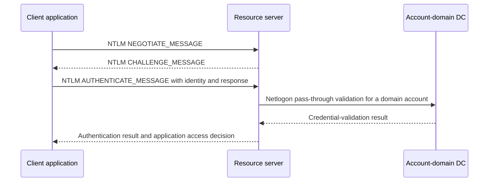
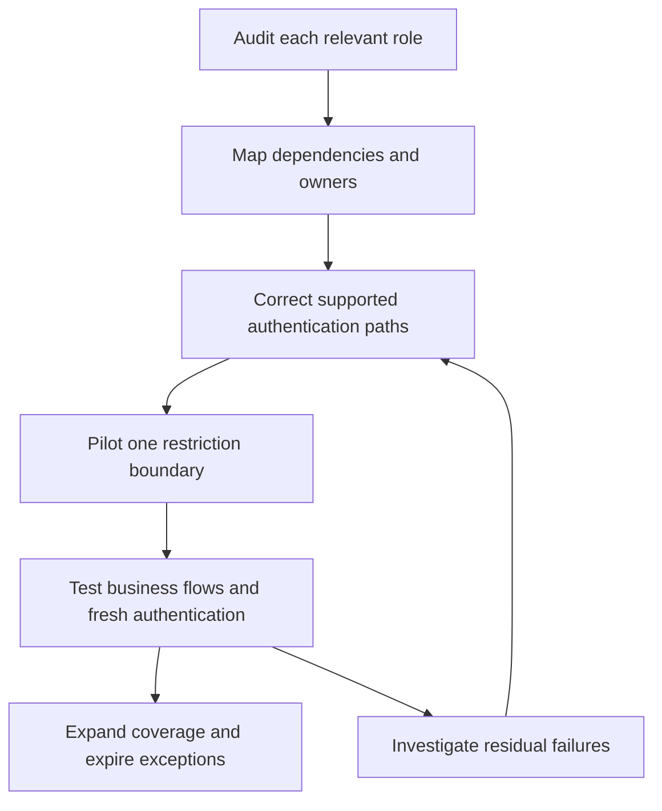

# Auditing and Reducing NTLM: Versions, Dependencies, Exceptions and Enforcement

**An NTLM reduction project is an application-dependency project, not a registry-setting contest.** Before blocking authentication, identify which client, process, identity and target still use it, why Kerberos or another supported mechanism is not used, and how the owner will remove that dependency.

This guide covers Windows Server 2022 and 2025 environments. Version and patch level matter: Windows Server 2025 removes NTLMv1, while NTLMv2 remains available despite being deprecated. Deprecation does not mean that all NTLM authentication has already been disabled.

> **TL;DR**
>
> - Audit clients, resource servers and domain controllers; no single event source sees every NTLM flow.
> - `Negotiate` is a protocol selector, not proof of Kerberos. Conversely, "not Kerberos" is not sufficient evidence of NTLM.
> - In event 4624, explicitly select `AuthenticationPackageName = NTLM` and retain the NTLM subpackage when reported.
> - Event 4776 records credential validation at the account authority. It does not reliably identify the application server or distinguish NTLMv1 from NTLMv2.
> - Audit-only Restrict NTLM policies write to the NTLM Operational log; they are separate from Security-log audit subcategories.
> - Remediate dependencies, pilot one restriction boundary, then expand. Exceptions need an exact target, owner and expiry.

## 1. Keep the versions and protections separate

| Term | Meaning and current implication |
|---|---|
| LM | Obsolete authentication/credential technology; not an acceptable compatibility target |
| NTLMv1 | Legacy challenge-response authentication; removed from Windows Server 2025 |
| NTLMv2 | Stronger challenge-response construction, but still a legacy dependency to reduce |
| LAN Manager authentication level | Controls response/version compatibility; refusing LM/NTLMv1 is not the same as blocking NTLMv2 |
| Restrict NTLM policies | Audit or restrict NTLM by outgoing, incoming or domain-validation boundary |
| Negotiate / SPNEGO | Selects a supported authentication mechanism, normally preferring Kerberos when its prerequisites are met |
| Signing, channel binding and Extended Protection | Protocol/application-specific protections; not interchangeable with replacing NTLM |

NTLMv2 is not simply "NTLM with TLS". Authentication, message signing/sealing and transport encryption are different properties. Keeping NTLMv2 does not automatically solve relay risks, and enabling Credential Guard does not remove every NTLM use.

Do not confuse the NT password hash with a captured NTLM challenge-response, or NTLM version with SMB version. A current SMB connection can still authenticate with NTLM.

## 2. Understand the observation points

For a domain identity, the resource server normally uses Netlogon pass-through validation to an appropriate DC. For a local account, the resource computer's local account database is the authority.



The DC validates the domain credential; the server still creates the relevant logon context and performs resource authorization. A successful validation is not proof that the application granted access.

| Observation point | Evidence | Blind spot |
|---|---|---|
| Client | Outgoing NTLM Operational events, sometimes process and target information | Does not by itself prove the resource authorized the request |
| Resource server | Incoming NTLM Operational events and Security 4624/4625 | A logon event may lack the initiating client process |
| Domain controller | Domain NTLM audit events, including 8004 where configured, and Security 4776 | Local-account validation on a member server need not reach a DC |

Cross-domain validation can traverse trust relationships. Do not assume that a trust requires NTLM or that every cross-forest operation uses it. Kerberos supports cross-realm authentication through appropriate trusts and name routing.

## 3. Deploy audit policy to the correct roles

Under **Computer Configuration > Policies > Windows Settings > Security Settings > Local Policies > Security Options**, configure the appropriate audit-only settings:

| Policy | Audit setting | Where it is useful |
|---|---|---|
| Network security: Restrict NTLM: Outgoing NTLM traffic to remote servers | Audit all | Clients and servers that initiate connections |
| Network security: Restrict NTLM: Audit Incoming NTLM Traffic | Enable auditing for all accounts | Resource servers accepting connections |
| Network security: Restrict NTLM: Audit NTLM authentication in this domain | Enable all | Domain controllers in each relevant domain |

These settings do not block NTLM. Incoming audit and incoming enforcement are separate policies. The outgoing policy combines Allow, Audit and Deny choices, so verify the selected value before linking the GPO.

Also enable the relevant **Advanced Audit Policy** subcategories: Audit Logon for 4624/4625 on resource systems, and Audit Credential Validation for 4776 on credential authorities. These Security-log policies do not enable the NTLM Operational provider's audit policy by themselves.

Read the build and effective policy from representative systems:

```powershell
Get-CimInstance -ClassName Win32_OperatingSystem |
    Select-Object Caption, Version, BuildNumber

gpresult.exe /scope computer /r
auditpol.exe /get /subcategory:"Logon"
auditpol.exe /get /subcategory:"Credential Validation"
```

The subcategory names above are English display names. On localized systems, use `auditpol /list /subcategory:* /v` to identify names or GUIDs. The `gpresult /r` summary identifies applied GPOs; inspect the effective setting in a detailed Group Policy result when confirming a particular value.

Audit all relevant DCs, not only the PDC emulator. Existing Defender for Identity or other management tooling may already configure auditing; compare effective settings and avoid competing policy sources. A policy configured on one DC is not an estate-wide observation window.

## 4. Verify logging before trusting an empty result

```powershell
$logName = 'Microsoft-Windows-NTLM/Operational'

Get-WinEvent -ListLog $logName -ErrorAction Stop |
    Select-Object LogName, IsEnabled, RecordCount, FileSize, MaximumSizeInBytes, LogMode

Get-WinEvent -ListProvider 'Microsoft-Windows-NTLM' -ErrorAction Stop |
    Select-Object -ExpandProperty Events |
    Select-Object Id, Version, Level, Description
```

Record channel availability, retention, forwarding and the OS build. Verify collection against a known business flow that currently uses NTLM, without weakening its authentication policy. Do not create a production fallback dependency merely to generate an event.

The classic Operational events include the 8001-8004 family, but newer builds can expose additional events and fields. Read the provider metadata and event text for the target build instead of imposing one hard-coded schema on every machine. A channel that is disabled, inaccessible or rolled over is missing evidence, not proof of zero NTLM use.

Collect a bounded interval from one source:

```powershell
$computer = 'app01.corp.example'
$startTime = (Get-Date).AddHours(-24)
$endTime = Get-Date

Get-WinEvent -ComputerName $computer -FilterHashtable @{
    LogName = 'Microsoft-Windows-NTLM/Operational'
    StartTime = $startTime
    EndTime = $endTime
} -ErrorAction Stop |
    Select-Object TimeCreated, Id, Version, MachineName, RecordId, Message
```

For a migration inventory, centralize collection and cover the actual workload cycle: scheduled jobs, failover paths, administrative tasks and rarely used applications. Do not sum client, server and DC event counts as though they were independent authentication attempts; one flow can appear at multiple points.

## 5. Identify explicit NTLM logons in Security events

The following helper accepts only Security event 4624 with an explicit NTLM authentication package. It retains unknown subpackage values rather than silently classifying them as NTLMv1 or NTLMv2:

```powershell
function Convert-NtlmLogonEvent {
    [CmdletBinding()]
    param([Parameter(Mandatory)][xml]$EventXml)

    if ([int]$EventXml.Event.System.EventID -ne 4624 -or
        $EventXml.Event.System.Provider.GetAttribute('Name') -ne 'Microsoft-Windows-Security-Auditing') {
        return
    }

    $data = @{}
    foreach ($item in $EventXml.Event.EventData.Data) {
        $data[$item.GetAttribute('Name')] = $item.InnerText
    }
    if ($data['AuthenticationPackageName'] -ne 'NTLM') { return }

    $subpackage = $data['LmPackageName']
    $versionEvidence = 'Not established'
    if ($subpackage -in 'NTLM V1', 'NTLM V2', 'LM') {
        $versionEvidence = $subpackage
    }

    [pscustomobject]@{
        TimeUtc = ([datetimeoffset]$EventXml.Event.System.TimeCreated.SystemTime).UtcDateTime
        Computer = [string]$EventXml.Event.System.Computer
        RecordId = [long]$EventXml.Event.System.EventRecordID
        Account = '{0}\{1}' -f $data['TargetDomainName'], $data['TargetUserName']
        AccountSid = $data['TargetUserSid']
        LogonType = $data['LogonType']
        LogonId = $data['TargetLogonId']
        AuthenticationPackage = $data['AuthenticationPackageName']
        RawSubpackage = $subpackage
        VersionEvidence = $versionEvidence
        SourceAddress = $data['IpAddress']
        Workstation = $data['WorkstationName']
        ProcessName = $data['ProcessName']
    }
}
```

Use a named-field filter on the resource server, then normalize the results:

```powershell
$resourceServer = 'app01.corp.example'
$ntlmQuery = @'
<QueryList>
  <Query Id="0" Path="Security">
    <Select Path="Security">
      *[System[(EventID=4624) and TimeCreated[timediff(@SystemTime) &lt;= 86400000]]]
      and *[EventData[Data[@Name='AuthenticationPackageName']='NTLM']]
    </Select>
  </Query>
</QueryList>
'@

$ntlmLogons = @(Get-WinEvent -ComputerName $resourceServer -FilterXml $ntlmQuery -ErrorAction Stop |
    ForEach-Object { Convert-NtlmLogonEvent -EventXml ([xml]$_.ToXml()) })

$ntlmLogons | Group-Object Computer, Account, SourceAddress, VersionEvidence |
    Sort-Object Count -Descending | Select-Object Count, Name
```

This is a useful positive-evidence query, not an exhaustive NTLM detector. `Negotiate`, missing fields and authentication paths that do not create the selected event require other evidence. In particular:

- `AuthenticationPackageName != Kerberos` also matches unrelated or unspecified packages.
- A missing `LmPackageName` is not proof of NTLMv1.
- Anonymous/null-session records need separate interpretation; an NTLM V1 label in such a record is not sufficient proof of an NTLMv1 password exchange.
- `LogonType = 3` means a network logon, not a specific authentication protocol.
- The event's local process field is not necessarily the client application that initiated the connection.

Keep the raw XML and collection context for ambiguous records. See [Windows Logon Types Decoded](../Concepts/Windows%20Logon%20Types%20Decoded%20-%20Events%204624%20and%204625.md) for event roles and correlation limits.

## 6. Add credential-authority evidence

For domain-account validation, query the relevant DCs or their central event collection:

```powershell
$domainController = 'dc01.corp.example'

Get-WinEvent -ComputerName $domainController -FilterHashtable @{
    LogName = 'Security'
    ProviderName = 'Microsoft-Windows-Security-Auditing'
    Id = 4776
    StartTime = (Get-Date).AddHours(-24)
} -ErrorAction Stop |
    Select-Object TimeCreated, Id, MachineName, RecordId, Message
```

Event 4776 identifies credential validation and its result, with a source workstation when supplied. It does not provide the complete source-process-to-resource mapping. Its `MICROSOFT_AUTHENTICATION_PACKAGE_V1_0` package name is **not a statement that NTLMv1 was used**.

Correlate it with resource-side 4624/4625 and NTLM Operational events. Local accounts can be validated by the resource computer instead of a domain DC. A successful validation does not establish that a share, database or web application authorized the request.

## 7. Turn events into an application backlog

| Field | Purpose |
|---|---|
| Client and initiating process, when known | Identifies what must change |
| Target name as used by the client | Exposes IP addresses, aliases and name mismatches |
| Actual resource server and service identity | Separates namespace, load balancer and back-end roles |
| Identity authority | Distinguishes local accounts, domain accounts and trust paths |
| Protocol/version evidence and event locations | Documents what is known rather than inferred |
| Frequency and business cycle | Captures intermittent dependencies |
| Owner, remediation and retest | Makes the finding actionable |
| Exception scope and expiry | Prevents compatibility allowances becoming permanent |

Typical causes include hard-coded NTLM APIs, access by IP address, missing/incorrect SPNs, service-account changes, local accounts, absent domain connectivity and applications whose supported authentication design is not Kerberos.

Using Negotiate is generally preferable to explicitly selecting NTLM, but it does not guarantee Kerberos. Correct names and SPN ownership, service identity and connectivity must also be in place. Some Kerberos failures terminate authentication instead of safely falling back.

Use [Troubleshooting Kerberos Authentication](../Troubleshoot/Troubleshooting%20Kerberos%20Authentication%20-%20SPNs,%20Tickets,%20Error%20Codes%20and%20NTLM%20Fallback.md) to prove the intended replacement flow before denying the existing one.

Where Kerberos is the intended solution, use [Kerberos Delegation Explained](../Concepts/Kerberos%20Delegation%20Explained%20-%20KCD,%20Protocol%20Transition%20and%20RBCD.md) for multi-hop applications. Enabling unconstrained delegation is not an NTLM migration strategy.

## 8. Restrict in stages



Choose the boundary deliberately:

| Restriction | What it controls | Exception model |
|---|---|---|
| Outgoing NTLM on a client/server | Authentication initiated by that machine | Companion remote-server exception policy, using the documented server-name matching rules |
| Incoming NTLM on a resource server | Authentication accepted by that server, with domain/all-account choices | Scope the deployment and selected policy; do not assume outgoing exceptions bypass an incoming deny |
| NTLM authentication in a domain | Validation handled by the domain's DCs | Companion domain server-exception policy for applicable cases |

An exception at one boundary does not override a denial at another. Windows Server 2025 also has SMB-specific NTLM controls; evaluate them as a separate protocol scope rather than assuming they govern HTTP, SQL and every other application.

Test fresh authentication, alternate client names, service restarts and failover paths. Existing sessions can remain usable even when new logons are blocked. Keep a defined rollback to the previous policy for the affected pilot, not a domain-wide change that obscures the failing dependency.

Do not replace an NTLM exception with disabled signing, disabled Extended Protection, a shared privileged account or credentials embedded in a script. Such changes trade one authentication problem for a broader security problem.

## 9. Define completion and residual risk

Completion means that collection covers the intended systems and business cycles, migrated applications use their intended authentication mechanism, restrictions behave as tested, and remaining exceptions are explicit and time-bound.

An empty DC query does not mean the environment is NTLM-free. Retain coverage failures, local-account paths, non-Windows systems and unsupported telemetry as separate unknowns. Audit mode provides visibility; it is not enforcement.

## References

- [NTLM overview](https://learn.microsoft.com/en-us/windows-server/security/kerberos/ntlm-overview)
- [Windows Server removed and deprecated features](https://learn.microsoft.com/en-us/windows-server/get-started/removed-deprecated-features-windows-server)
- [Audit NTLM authentication in this domain](https://learn.microsoft.com/en-us/windows/security/threat-protection/security-policy-settings/network-security-restrict-ntlm-audit-ntlm-authentication-in-this-domain)
- [Audit incoming NTLM traffic](https://learn.microsoft.com/en-us/windows/security/threat-protection/security-policy-settings/network-security-restrict-ntlm-audit-incoming-ntlm-traffic)
- [Outgoing NTLM traffic policy](https://learn.microsoft.com/en-us/windows/security/threat-protection/security-policy-settings/network-security-restrict-ntlm-outgoing-ntlm-traffic-to-remote-servers)
- [Windows event auditing and NTLM collection for Defender for Identity](https://learn.microsoft.com/en-us/defender-for-identity/deploy/configure-windows-event-collection)
- [Event 4624](https://learn.microsoft.com/en-us/windows/security/threat-protection/auditing/event-4624)
- [Event 4776](https://learn.microsoft.com/en-us/windows/security/threat-protection/auditing/event-4776)