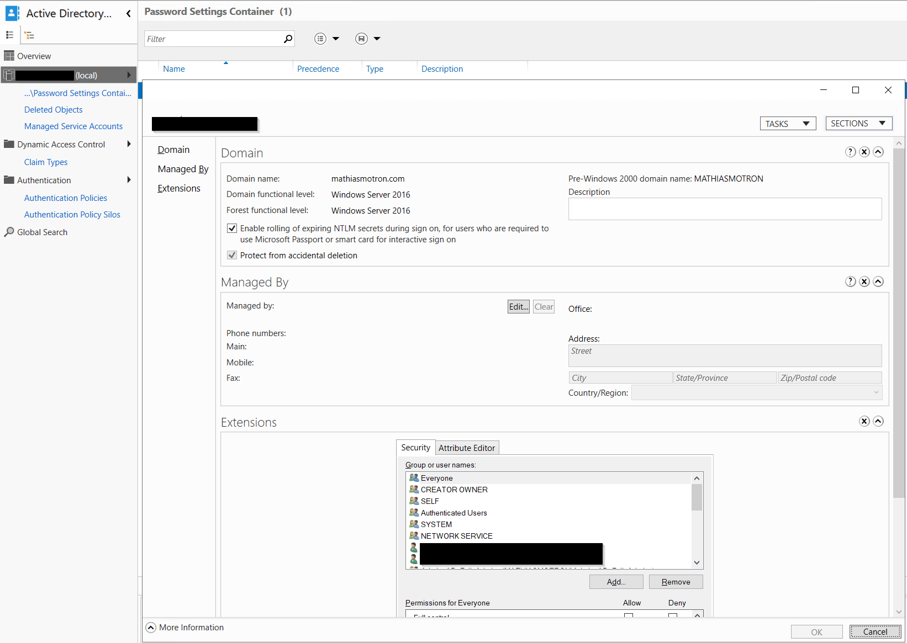
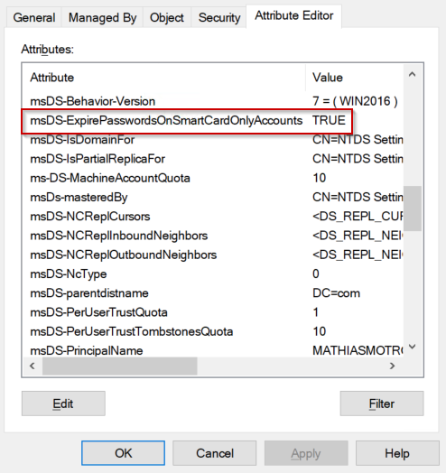
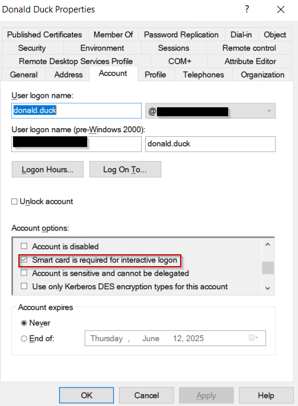
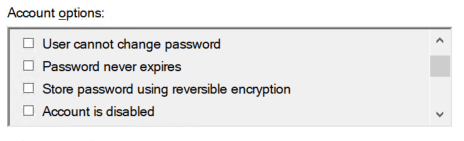
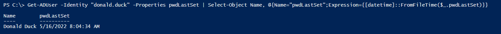
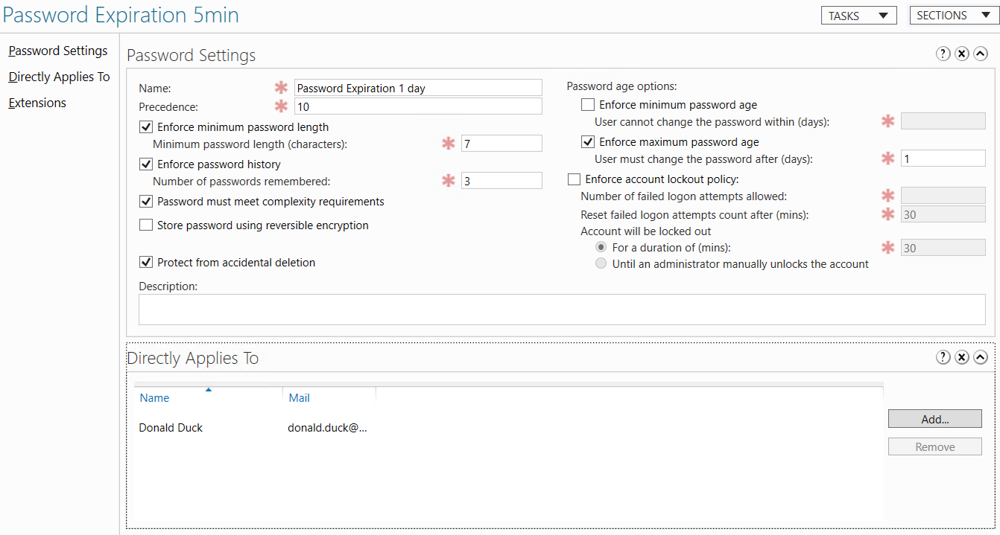

# 🔄 Automatic Password Rotation for SCRIL Accounts in Active Directory
🗓️ Published: 2025-05-13

## 🔹 Introduction

In Active Directory, enabling the setting **Smart Card is Required for Interactive Logon (SCRIL)** enforces strong authentication by preventing users from signing in using a password. When this flag is set, the user's password is replaced with a random, unknown value, effectively eliminating password-based access.

However, by default, this password **never expires**, which creates a **security risk**: the associated NTLM hash remains valid indefinitely and can be exploited in pass-the-hash attacks.

Starting with **Windows Server 2016**, a domain-level feature introduces **automatic rotation of passwords** for SCRIL-enabled accounts. This ensures that NTLM hashes are regularly replaced — improving security posture without requiring manual intervention or scripts.

This article explains the prerequisites, how the mechanism works, how to test it in a lab (even without a physical smart card), and best practices to adopt in production environments.

---

## ✅ Prerequisites

To enable automatic password rotation for SCRIL (Smart Card is Required for Interactive Logon) accounts, the following conditions must be met in the Active Directory environment:

**Domain Functional Level = Windows Server 2016 or higher**
 Required for the domain controller to support this feature. (Note: Microsoft documents this as a **domain** functional level requirement, not a forest-wide one — a single Windows Server 2016+ DFL domain is enough even in a multi-domain forest.)

**`msDS-ExpirePasswordsOnSmartCardOnlyAccounts = TRUE`**
Enables password rotation at the domain level.
This is a domain-wide attribute (set on the **domain root object**, not via GPO) introduced in Windows Server 2016. You can enable it with PowerShell:

```powershell
Set-ADObject -Identity (Get-ADDomain).DistinguishedName `
             -Replace @{'msDS-ExpirePasswordsOnSmartCardOnlyAccounts'=$true}
```





**`SmartcardRequired = TRUE` on the user account**
This enables the SCRIL flag.
It can be set using Active Directory Users and Computers or PowerShell.



**`PasswordNeverExpires = FALSE`**
The user account must allow password expiration. 
If set to TRUE, the rotation mechanism is bypassed.



**A valid `pwdLastSet` value**
A password must exist on the account. If not, expiration and rotation will not trigger.



**Password expiration policy applied** (via GPO or FGPP)
The domain or Fine-Grained Password Policy must define a `maxPwdAge` greater than zero.



---

## 🔁 Password Rotation Logic

When all prerequisites are met, Active Directory can automatically rotate the password of a SCRIL-enabled account. This process ensures that NTLM secrets are periodically updated without manual intervention.

### Password Rotation Happens at Logon
The domain controller **only evaluates expiration during user logon**. If the password is expired:
- A new secure random password is generated automatically with a random 128-bit value.
- The `pwdLastSet` attribute is updated.
- The NTLM hash changes, reducing the risk of hash reuse attacks.

⚠️ Rotation **does not happen in the background** — only when a user logs on **and** the password is expired.

### Rotation is Invisible to the User
Since SCRIL users never interact with their password:
- No prompt is shown.
- No user action is needed.
- The operation is transparent and secure.

---

## ⚠️ Warnings & Recommendations

- 🔁 **Password rotation only occurs at logon** and **only if the password is expired**.
- ❌ Avoid setting `PasswordNeverExpires = TRUE` — this will block expiration and thus prevent rotation.
- 🔐 Ensure accounts have a valid `pwdLastSet` value — if missing or set to `0`, password expiration won’t trigger.
- 🧪 Use a test account and FGPP with short expiration (e.g. 5 minutes) to verify the behavior in lab.
- ⚙️ Prefer gradual rollout using Fine-Grained Password Policies (FGPP) for controlled deployment.
- 🛡️ **NTLM fallback caveat**: even with SCRIL, applications and protocols that still rely on the NTLM hash (legacy LDAP simple bind, RDP NLA fallback, some VPN/RADIUS supplicants, third-party agents reading cached secrets) will break right after a rotation until they re-authenticate with the new hash. Inventory NTLM-dependent integrations before broad rollout.
- 🔍 Monitor `pwdLastSet` and authentication logs to confirm rotation is working as expected.

### ❓ FAQ

- **Does this work with service accounts?** → ❌ No, it’s meant for interactive logon users only (and SCRIL itself doesn’t make sense for service accounts — use gMSA instead).
- **Can the rotation be scheduled or forced?** → ❌ No, only evaluated at logon. If you need a forced rotation, reset the password manually (`Set-ADAccountPassword`) or temporarily flip `pwdLastSet` via ADSI.
- **Does it work in hybrid environments with Entra ID?** → ⚠️ Partially. With SCRIL on, the account has **no usable on-prem password**, so Entra ID Connect cannot sync a meaningful password hash — the cloud identity has no PHS-backed password either. Recommended companion controls for cloud sign-in: **Cloud Kerberos Trust** (so on-prem SSO keeps working from cloud-joined devices), **WHfB Cloud Trust**, **FIDO2 / passkeys**, or **certificate-based authentication (Entra ID CBA)**.

- 🧰 Use tools such as PtHTools by NSA Cybersecurity to detect accounts that haven’t had their NTLM secrets rotated and assess pass-the-hash exposure:
<https://github.com/nsacyber/Pass-the-Hash-Guidance/tree/master/PtHTools>


---

## 📚 References

- [Smart Card is required for interactive logon (Microsoft Learn)](https://learn.microsoft.com/windows/security/threat-protection/security-policy-settings/smart-card-is-required-for-interactive-logon)
- [msDS-ExpirePasswordsOnSmartCardOnlyAccounts (Microsoft Learn)](https://learn.microsoft.com/openspecs/windows_protocols/ms-ada2/c1ef0e63-cf6e-4ef1-aa9a-2dc11b6a4f25)
- [NSA — Pass-the-Hash Guidance & Tools](https://github.com/nsacyber/Pass-the-Hash-Guidance)
