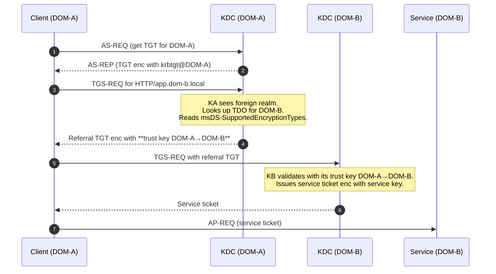
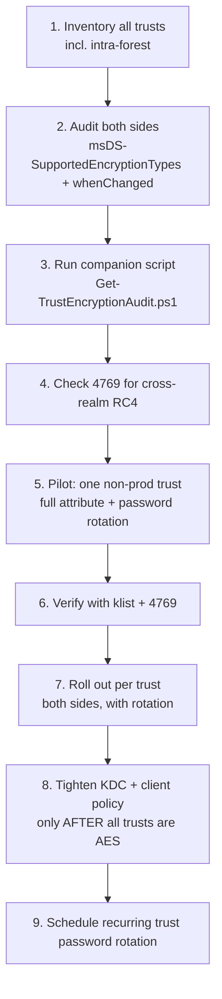

# Hardening Kerberos Encryption on Active Directory Trusts
🗓️ Published: 2026-05-21

## TL;DR

If you hardened Kerberos on your domain (KB5021131 / CVE-2022-37966) but never touched the **Trusted Domain Objects (TDOs)**, your forest still issues **RC4 referral tickets** across every trust. The directory looks clean, the DCs look clean, and yet `4769` keeps showing RC4 for `krbtgt/REMOTE.LOCAL`. That is the gap this article closes.

- 🎯 **The real attribute is `msDS-SupportedEncryptionTypes` on the TDO** — not the GUI checkbox, not `ksetup /listenctypes`, not the KDC default.
- 🔁 **Both sides of every trust must be updated**, and **the trust password must be rotated** afterwards so AES keys are actually materialized.
- 🧨 **Forgetting just one TDO** leaves a downgrade path open. **Banning RC4 on the DCs without fixing the TDOs first** breaks cross-realm authentication.

If you want to read just two sections, read [The 3 control points](#-the-3-control-points-and-why-gui-alone-is-not-enough) and [Remediation procedure](#-remediation-procedure).

---

## Why this matters 🔍

Kerberos hardening usually focuses on local accounts: `msDS-SupportedEncryptionTypes` on users, computers, and service accounts; `DefaultDomainSupportedEncTypes` on the KDC; the GPO **Network security: Configure encryption types allowed for Kerberos**.

Those controls are necessary, but they all operate **inside one domain**. The moment a ticket has to cross a trust, the rules change. The KDC stops looking at the user's account and starts looking at the **TDO of the destination realm**. If that TDO still allows RC4, the referral ticket goes out in RC4 — even if every other knob in the environment screams "AES only".

That is the trap. You harden the comptes, you harden the KDC, you harden the clients. You think you are done. And then a quick `klist` after a cross-forest logon shows a `krbtgt/REMOTE.LOCAL` ticket in `RC4_HMAC_MD5`, and you realize the trust has been silently downgrading the entire crypto story for years.

> 🕵️ **Threat angle.** Cross-realm RC4 is one of the favorite tools of red teamers: RC4 referral tickets are crackable offline (no salt, MD5-derived), the trust account password is rarely rotated in practice, and the resulting forged TGT can be reused to forge inter-realm tickets. This is the trust-key equivalent of a Golden Ticket — and it survives most "we did the AES migration" claims.

---

## Anatomy of a trust 🧠

### The Trusted Domain Object (TDO)

Every trust — forest, external, MIT realm, intra-forest parent/child, shortcut — is materialized in AD as a **`trustedDomain`** object living under `CN=System,DC=<domain>`. From an outsider's perspective, the trust is "a relationship between two domains". From AD's perspective, it is **two objects** (one per side), holding **passwords, attributes, and metadata**.

A trust has two TDOs because trust passwords are stored on **both sides** independently. The KDC of domain `A` knows the secret it shares with domain `B`. The KDC of domain `B` knows the same secret from the other side. The two sides must stay in sync, which is why rotating a trust password is more involved than rotating a regular account password.

### The key attributes

| Attribute | Role |
|---|---|
| `flatName` | Short NetBIOS name of the trusted domain |
| `trustPartner` | DNS name of the trusted domain |
| `trustDirection` | `1` = Inbound, `2` = Outbound, `3` = Bidirectional |
| `trustType` | `1` = downlevel/NT4, `2` = uplevel/AD, `3` = MIT realm, `4` = DCE (legacy) |
| `trustAttributes` | Bitmask: transitivity, forest, within-forest, MIT, **`0x100` = USES_AES_KEYS** |
| **`msDS-SupportedEncryptionTypes`** | **The bitmask that actually controls referral ticket encryption** |
| `whenChanged` | Useful proxy to know if the TDO was recently rotated |

### The trust password and its derived keys

A trust password is a long random secret negotiated when the trust is created. From this secret, AD **derives** multiple cryptographic keys, **one per supported encryption type**:

- DES-CBC-MD5 (`0x1`) — legacy
- DES-CBC-CRC (`0x2`) — legacy
- RC4-HMAC (`0x4`)
- AES128-CTS-HMAC-SHA1-96 (`0x8`)
- AES256-CTS-HMAC-SHA1-96 (`0x10`)

**Critical point:** changing `msDS-SupportedEncryptionTypes` only *declares* which enctypes are allowed. The corresponding **keys are only derived when the trust password is (re)set**. If you flip the attribute to "AES only" but never rotate the trust password, the KDC has nothing to encrypt the referral ticket with, and falls back to whichever key still exists — usually RC4.

This is the same mechanic as for regular service accounts after enabling AES on `msDS-SupportedEncryptionTypes`: the attribute promises, the secret rotation delivers.

### The Kerberos cross-realm flow



The enctype of the **referral TGT** in step 4 is the one that depends on the TDO. If the TDO allows only RC4, that referral TGT is RC4. End of story.

---

## All trust types side by side 📊

| Type | `trustType` | `trustAttributes` bits | Transitive? | Where do the TDOs live? | RC4 risk |
|---|---|---|---|---|---|
| **Forest trust** | 2 (AD) | `FOREST_TRANSITIVE` (`0x8`) | ✅ Within forests | Root domain of each forest | High if old — created pre-2016 default to RC4 + AES |
| **External trust** | 2 (AD) | none of the above | ❌ | Each participating domain | High — often legacy, often forgotten |
| **Realm trust (MIT/Heimdal)** | 3 (MIT) | `NON_TRANSITIVE` or transitive depending on creation | Variable | Local domain only (the remote side is non-Windows) | Highest — depends on the MIT side's `krb5.conf` |
| **Parent ↔ Child (intra-forest)** | 2 (AD) | `WITHIN_FOREST` (`0x20`) | ✅ Auto | Each domain in the forest | Often overlooked — auto-created, never audited |
| **Shortcut / Cross-link trust** | 2 (AD) | `WITHIN_FOREST` (`0x20`) | ✅ | Each domain involved | Same as parent/child |
| **Downlevel / NT4-style** | 1 | usually `NON_TRANSITIVE` | ❌ | Local domain | Very high — DES/RC4 only |

> 💡 **Yes, intra-forest trusts count.** A forest built in 2008 and never reset to AES carries RC4 trust keys between every parent and every child. Auto-created does **not** mean auto-modernized.

---

## The 3 control points (and why GUI alone is not enough) 🛠️

This is the single most misunderstood part of the topic. Three different settings live in three different places, and they do **not** mean the same thing.

### Control 1 — `msDS-SupportedEncryptionTypes` (the one that actually controls ticket encryption)

- **Where**: attribute on the TDO in `CN=System,DC=<domain>`
- **Type**: bitmask
- **What it does**: tells the local KDC *"when issuing a referral ticket for this trust, use one of these enctypes"*
- **Hardened value**: `0x18` = AES128 + AES256

This is the attribute the KDC consults to pick the enctype of the referral TGT. It is also the attribute most monitoring tools and most blog posts forget about.

### Control 2 — `trustAttributes` bit `0x100` (the declarative GUI checkbox)

- **Where**: same TDO, different attribute
- **GUI**: *Active Directory Domains and Trusts* → trust properties → **"The other domain supports Kerberos AES Encryption"**
- **What it does**: declares that the **other** side supports AES. This is purely **informational** — it does not by itself force AES usage
- **Effect if checked but `msDS-SupportedEncryptionTypes` is still RC4-only**: nothing useful. You declared "they support AES", but you also declared "I only support RC4 myself". The intersection wins. RC4 it is.

### Control 3 — the trust password (the cryptographic reality)

- **Where**: stored on both sides of the trust, in the TDO and in the LSA secrets
- **Rotation**: should happen every 30 days by default, **rarely does in practice**
- **What it does**: provides the **shared secret** from which the per-enctype keys are derived. If the password has not been rotated since AES was enabled, no usable AES key exists, regardless of what `msDS-SupportedEncryptionTypes` says

### Comparison — same goal, very different tools

| Tool | What it modifies | Sufficient on its own? |
|---|---|---|
| **GUI** — *Domains and Trusts* checkbox | `trustAttributes` bit `0x100` | ❌ No. Declarative only. |
| **`ksetup /setenctypeattr <realm> AES256-CTS-HMAC-SHA1-96 AES128-CTS-HMAC-SHA1-96`** | `msDS-SupportedEncryptionTypes` | ⚠️ One side only. Must repeat on the other side + rotate password. |
| **`netdom trust <local> /Domain:<remote> /EncType:AES256`** | `msDS-SupportedEncryptionTypes` | ⚠️ Same as ksetup. Slightly more flexible (remote creds). |
| **`Set-ADObject "CN=remote.local,CN=System,DC=local" -Replace @{ 'msDS-SupportedEncryptionTypes' = 0x18 }`** | `msDS-SupportedEncryptionTypes` | ⚠️ Same as ksetup. Native PowerShell, scriptable. |
| **`netdom trust <local> /Domain:<remote> /Reset`** | Rotates the trust password (re-derives all enctype keys) | ✅ This is the missing step everyone forgets. |
| **`ksetup /listenctypes`** | Reads the **local client** registry value | ❌ Not the TDO — common confusion source |

> ⚠️ **The trap of the GUI.** Checking the "other domain supports AES" box feels like the AES switch. It is not. It changes `trustAttributes` and nothing else. Without `msDS-SupportedEncryptionTypes = 0x18` **and** a password rotation, your trust still ships RC4.

---

## What breaks if you forget the TDO 💥

There are three classic "I hardened Kerberos on the DCs" patterns, and each one interacts differently with stale trust TDOs.

### Scenario A — Setting `DefaultDomainSupportedEncTypes = 0x18` on the DCs

`HKLM\SYSTEM\CurrentControlSet\Services\Kdc\DefaultDomainSupportedEncTypes = 0x18`

- This value only applies to **accounts where `msDS-SupportedEncryptionTypes` is unset or `0`**
- TDOs almost always have `msDS-SupportedEncryptionTypes` explicitly set (often to a value that includes RC4)
- **Outcome**: TDOs are **ignored** by this default. Trust traffic continues in whatever the TDO says.
- **Symptom**: nothing breaks, but nothing improves. False sense of security.

### Scenario B — GPO *Network security: Configure encryption types allowed for Kerberos* set to AES only

This GPO writes `HKLM\SYSTEM\CurrentControlSet\Control\Lsa\Kerberos\Parameters\SupportedEncryptionTypes` and controls the **Kerberos client** capability set of the machine.

- When the DC needs to talk to another realm's KDC, it acts as a Kerberos client
- If the client capabilities exclude RC4, **the DC refuses to use a referral TGT chiffré in RC4**
- **Outcome**: cross-realm authentication breaks the moment the client tries to use a stale-RC4 trust
- **Symptom**: `KDC_ERR_ETYPE_NOTSUPP` (0x18) in event `4769`, `Target Name: krbtgt/REMOTE.LOCAL`, often followed by silent NTLM fallback (event `4624` Logon Type 3 with `Authentication Package: NTLM`)

### Scenario C — Enabling enforcement modes for CVE-2022-37966 / 37967 (`KrbtgtFullPacSignature`, etc.)

- Not strictly an enctype change, but trust keys derived from old passwords without AES material trip the same code paths
- **Symptom**: weird intermittent cross-realm failures, often blamed on "DNS" or "replication"

### Symptom → cause mapping

| Symptom | Likely cause | Where to look |
|---|---|---|
| Cross-domain logon works but **feels slow** | Kerberos cross-realm failing, falling back to NTLM | Event `4625` on the target server, `4624` Logon Type 3 with `NTLM` package |
| `klist` shows TGT cross-realm in `RC4_HMAC_MD5` | Remote TDO still RC4-only **or** trust password not rotated since AES enablement | `Get-ADTrust -Properties msDS-SupportedEncryptionTypes`, `whenChanged` on the TDO |
| Event `4769` with `Failure code 0x18`, target `krbtgt/REMOTE.LOCAL` | Client refuses RC4, TDO offers RC4 | TDO on the source side + GPO Kerberos enctype on the client/DC |
| Event `4769` `Failure code 0xD` (`KDC_ERR_BADOPTION`) on cross-realm | Often related to trust attributes / forest routing, not enctype | `trustAttributes`, `msDS-TrustForestTrustInfo` |
| `Get-ADTrust` says `Trust OK` but `nltest /trusted_domains` shows `NO_TRUST` for that realm | Trust password desynchronization between the two sides | Re-establish with `netdom trust /Reset` |

---

## Audit procedure 🕵️

The goal of the audit is to answer four questions for every trust:

1. What does **my side's TDO** declare in `msDS-SupportedEncryptionTypes`?
2. What does **the other side's TDO** declare?
3. When was the **trust password** last rotated? (`whenChanged` on the TDO)
4. Are there **observed RC4 referral tickets** in `4769`?

### Step 1 — Inventory all trusts (including intra-forest)

```powershell
# All trusts visible from this domain, with the attributes that matter
Get-ADTrust -Filter * -Properties msDS-SupportedEncryptionTypes, trustAttributes, whenChanged |
    Select-Object Name, Direction, ForestTransitive, IntraForest, TrustType,
                  @{n='EncTypes';e={ '0x{0:X}' -f ($_.'msDS-SupportedEncryptionTypes' -as [int]) }},
                  @{n='TrustAttrHex';e={ '0x{0:X}' -f $_.trustAttributes }},
                  whenChanged |
    Format-Table -AutoSize
```

### Step 2 — Read both sides of every trust

You cannot trust your own side to tell you what the other side believes. Run the same audit **on a DC of the remote domain** (or use a privileged session there). The two `msDS-SupportedEncryptionTypes` values must match the hardened state on both sides.

### Step 3 — Check `4769` for cross-realm RC4

On any DC of the source realm, with auditing enabled for "Kerberos Service Ticket Operations":

```powershell
Get-WinEvent -FilterHashtable @{ LogName='Security'; Id=4769; StartTime=(Get-Date).AddHours(-24) } |
    ForEach-Object {
        $xml = [xml]$_.ToXml()
        $svc = ($xml.Event.EventData.Data | Where-Object Name -eq 'ServiceName').'#text'
        $enc = ($xml.Event.EventData.Data | Where-Object Name -eq 'TicketEncryptionType').'#text'
        if ($svc -like 'krbtgt/*' -and $enc -eq '0x17') {
            [pscustomobject]@{
                Time   = $_.TimeCreated
                Client = ($xml.Event.EventData.Data | Where-Object Name -eq 'TargetUserName').'#text'
                Realm  = $svc
                Enc    = $enc   # 0x17 = RC4_HMAC_MD5
            }
        }
    } | Sort-Object Realm, Client -Unique | Format-Table -AutoSize
```

`TicketEncryptionType = 0x17` on a service name starting with `krbtgt/` is the smoking gun: a referral TGT was issued in RC4.

> 💡 **Common enctype codes in event 4769:**
> - `0x1` DES-CBC-CRC, `0x3` DES-CBC-MD5 (legacy)
> - `0x11` AES128-CTS-HMAC-SHA1-96
> - `0x12` AES256-CTS-HMAC-SHA1-96
> - `0x17` RC4-HMAC
> - `0xFFFFFFFF` unknown — usually means the audit subsystem could not parse the ticket

### Step 4 — Companion script

A consolidated audit is provided next to this article:

📜 [`Get-TrustEncryptionAudit.ps1`](Get-TrustEncryptionAudit.ps1)

It enumerates every trust visible from the local domain, decodes `msDS-SupportedEncryptionTypes` and `trustAttributes` into human-readable flags, classifies each trust (`AES-only` / `Mixed` / `RC4-only` / `Unset` / `Legacy-DES`), shows when the TDO was last modified (proxy for password rotation), and can optionally export to CSV/JSON.

Sample output:

```
Trust            Direction       Type    Transitive   EncTypes (hex)   Flags                Class      LastChange
----            ----------       ----    ----------   --------------   -----                -----      ----------
forest-b.lab    Bidirectional    Forest  True         0x1C             RC4+AES128+AES256    Mixed      2024-08-12
ext.legacy.lab  Outbound         AD      False        0x4              RC4                  RC4-only   2019-02-03  <-- 🔴
child.local     Bidirectional    AD      True         0x18             AES128+AES256        AES-only   2026-05-19
MIT.EXAMPLE     Outbound         MIT     False        0x0              (none / default)     Unset      2017-11-04  <-- ⚠️
```

---

## Remediation procedure 🚀

The fix follows the same pattern for every trust type: **modify the attribute → declare AES support → rotate the password → verify**. Skipping any step leaves the trust in a half-hardened state.

> 🛑 **Production caveat.** Before you touch a TDO on a production trust, validate the change in a lab that mirrors your trust topology. Plan a maintenance window for the password rotation — short outage possible while the new keys converge.

### Step 1 — Update `msDS-SupportedEncryptionTypes` on the TDO (both sides)

Pick **one** of the equivalent forms:

```powershell
# PowerShell, scriptable
$tdoDN = (Get-ADTrust -Identity 'forest-b.lab').DistinguishedName
Set-ADObject -Identity $tdoDN -Replace @{ 'msDS-SupportedEncryptionTypes' = 0x18 }
```

```cmd
:: ksetup, classic
ksetup /setenctypeattr forest-b.lab AES256-CTS-HMAC-SHA1-96 AES128-CTS-HMAC-SHA1-96
```

```cmd
:: netdom, lets you target a remote DC with explicit credentials
netdom trust local.lab /Domain:forest-b.lab /EncType:AES256
```

Repeat on the **remote** side. The TDO on the other domain is a different object — modifying yours does not propagate.

### Step 2 — Update `trustAttributes` (the GUI checkbox)

Open *Active Directory Domains and Trusts* on a DC of each side → properties of the trust → check **"The other domain supports Kerberos AES Encryption"**. Or do it from PowerShell:

```powershell
# Add the USES_AES_KEYS bit (0x100) without disturbing the other flags
$trust = Get-ADTrust -Identity 'forest-b.lab' -Properties trustAttributes
$new = $trust.trustAttributes -bor 0x100
Set-ADObject -Identity $trust.DistinguishedName -Replace @{ trustAttributes = $new }
```

This step is **declarative** — it doesn't enforce anything, but Microsoft tooling and some monitoring solutions key off this bit to decide whether AES is "officially" enabled. Setting it makes the configuration consistent.

### Step 3 — Rotate the trust password

This is the step that actually materializes AES keys. Both forms work:

```cmd
:: Reset from one side only — the other side picks up the new password on next negotiation
netdom trust local.lab /Domain:forest-b.lab /Reset /UserO:LOCAL\admin /PasswordO:* /UserD:DOMB\admin /PasswordD:*
```

```cmd
:: Cleaner: explicitly rotate from the source side
netdom trust local.lab /Domain:forest-b.lab /ResetOneSide /Server:dc1.local.lab /UserO:LOCAL\admin /PasswordO:*
```

After the rotation, both TDOs hold a freshly derived AES128 + AES256 key (and an RC4 key, which Windows always derives but will not use anymore if the enctype attribute forbids it).

### Step 4 — Verify

```powershell
# Purge tickets to force re-acquisition
klist purge

# Trigger a cross-realm authentication (e.g. browse a remote share, or use runas /netonly)

# Inspect the new TGT — KerbTicket Encryption Type must be AES-256 or AES-128
klist
```

Look at the `KerbTicket Encryption Type` line for the `krbtgt/REMOTE.LAB` ticket. It should now say `AES-256-CTS-HMAC-SHA1-96` (or `AES-128`). If it still says `RC4-HMAC`, either the attribute was not propagated yet, the password was not rotated, or you tested from a client whose own enctype policy still allows RC4.

For a wider check, re-run the audit script and confirm the `EncTypes (hex)` column shows `0x18` on both sides and that `4769` no longer reports `TicketEncryptionType=0x17` for `krbtgt/REMOTE.LAB`.

---

## Realm trusts (MIT / Heimdal) — special handling 🐧

Realm trusts to non-Windows KDCs are the odd one out: only **your side** is an AD TDO with an `msDS-SupportedEncryptionTypes` attribute. The other side is a Unix-style `krb5.conf` and an MIT or Heimdal KDC database.

- **Your side**: same procedure as above (`ksetup /setenctypeattr <REALM> AES256-CTS-HMAC-SHA1-96 AES128-CTS-HMAC-SHA1-96`)
- **Their side**: in `krb5.conf` under `[libdefaults]`:
  ```ini
  default_tkt_enctypes = aes256-cts-hmac-sha1-96 aes128-cts-hmac-sha1-96
  default_tgs_enctypes = aes256-cts-hmac-sha1-96 aes128-cts-hmac-sha1-96
  permitted_enctypes   = aes256-cts-hmac-sha1-96 aes128-cts-hmac-sha1-96
  ```
- **The shared secret**: must be re-created on both sides simultaneously using `ksetup /addkdc` and the appropriate `kadmin` commands. The key derivation now produces AES material on both ends.

> 💡 **No PAC.** Realm trusts do not carry the PAC — no SIDs, no group memberships across the boundary. Hardening here is purely about the on-wire crypto, not about Windows-style authorization.

---

## Common pitfalls ⚠️

- **Updating only one side of the trust.** The KDC of side A picks its enctype from its own TDO. The KDC of side B from its own. If only one is hardened, half of the cross-realm traffic stays on RC4.
- **Checking the GUI box and stopping there.** `trustAttributes` bit `0x100` is declarative. `msDS-SupportedEncryptionTypes` is the operative attribute.
- **Modifying the attribute but not rotating the trust password.** No AES keys exist until the password is reset. The KDC then either falls back to RC4 or fails with `KDC_ERR_ETYPE_NOTSUPP`.
- **Confusing `ksetup /listenctypes` with the TDO.** `ksetup /listenctypes` reads the local **client** `HKLM\...\Kerberos\Parameters\SupportedEncryptionTypes`. The TDO lives in AD and is read with `Get-ADTrust -Properties msDS-SupportedEncryptionTypes`.
- **Forgetting intra-forest trusts.** Parent ↔ child and shortcut trusts have TDOs too. Forests built on 2003/2008 schemas often carry RC4-only or DES+RC4 internal trusts.
- **Trust password rotation that never happens.** The default is 30 days but Windows never rotates automatically without a kick. Treat trust password rotation as a planned maintenance, not a background task.
- **Banning RC4 on the DC client side first.** If the GPO *Network security: Configure encryption types allowed for Kerberos* drops RC4 before any TDO is upgraded, cross-realm logons start failing immediately. Always: **TDO first → password rotation → then tighten the client enctype policy.**
- **Audit blind spots from a single DC.** Replication delays may make a freshly-modified TDO look stale from another DC. Pin the audit to the PDC emulator or wait for convergence.

---

## Recommended migration path 🧭



The sequence matters: **never tighten KDC or client enctype policy before every TDO is on AES**, otherwise you ship an outage. Audit drives the order — leave the noisiest, most legacy trust for last and pilot the cleanest one first.

---

## References 📚

- [KB5021131 — How to manage the Kerberos protocol changes related to CVE-2022-37966](https://support.microsoft.com/en-us/topic/kb5021131-how-to-manage-the-kerberos-protocol-changes-related-to-cve-2022-37966-fd837ac3-cdec-4e76-a6ec-86e67501407d)
- [CVE-2022-37966 — Windows Kerberos Elevation of Privilege Vulnerability](https://msrc.microsoft.com/update-guide/vulnerability/CVE-2022-37966)
- [CVE-2022-37967 — Windows Kerberos Elevation of Privilege Vulnerability](https://msrc.microsoft.com/update-guide/vulnerability/CVE-2022-37967)
- [`msDS-SupportedEncryptionTypes` (AD Schema)](https://learn.microsoft.com/en-us/windows/win32/adschema/a-msds-supportedencryptiontypes)
- [`trustAttributes` flags (MS-ADTS)](https://learn.microsoft.com/openspecs/windows_protocols/ms-adts/e9a2d23c-c31e-4a6f-88a0-6646fdb51a3c)
- [Trusted Domain Object structure (MS-LSAD)](https://learn.microsoft.com/openspecs/windows_protocols/ms-lsad/64f01abf-c5e5-453b-9d8d-d9a5fcdc4ee5)
- [Decrypting the Selection of Supported Kerberos Encryption Types (TechCommunity)](https://techcommunity.microsoft.com/blog/askds/decrypting-the-selection-of-supported-kerberos-encryption-types/1628797)
- [Network security: Configure encryption types allowed for Kerberos](https://learn.microsoft.com/en-us/windows/security/threat-protection/security-policy-settings/network-security-configure-encryption-types-allowed-for-kerberos)
- [Event 4769 — Audit Kerberos Service Ticket Operations](https://learn.microsoft.com/en-us/windows/security/threat-protection/auditing/event-4769)
- [`netdom trust` command reference](https://learn.microsoft.com/en-us/previous-versions/windows/it-pro/windows-server-2012-r2-and-2012/cc835085(v=ws.11))
- [`ksetup` command reference](https://learn.microsoft.com/en-us/windows-server/administration/windows-commands/ksetup)
- [How AD trust passwords work — Trust password change](https://learn.microsoft.com/en-us/troubleshoot/windows-server/active-directory/trust-passwords-automatic-updates)
- [RFC 3962 — AES Encryption for Kerberos 5](https://www.rfc-editor.org/rfc/rfc3962)
- [RFC 4757 — RC4-HMAC Kerberos encryption (legacy)](https://www.rfc-editor.org/rfc/rfc4757)
- Related article in this repo: [Audit and Enforcement of Kerberos Encryption Type](../Audit%20and%20Enforcement%20of%20Kerberos%20Encryption%20Type/Audit%20and%20Enforcement%20of%20Kerberos%20Encryption%20Type.md)
