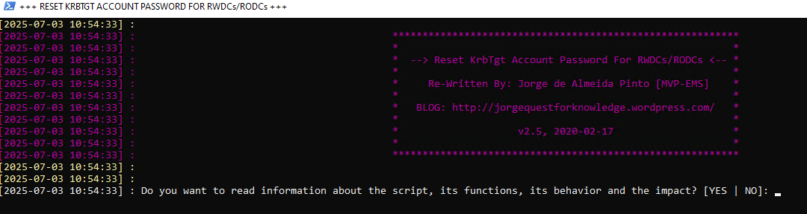
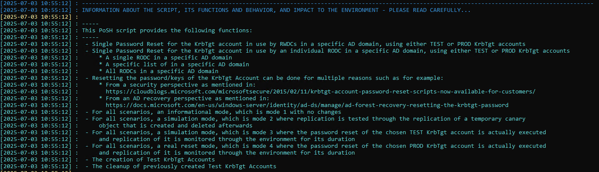
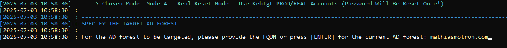

# MDI Recommendation – krbtgt Account Password Rotation
🗓️ Published: 2025-07-03

Hey everyone!

Got a couple minutes? To keep your Active Directory running smoothly and block any sneaky Golden Ticket moves, Microsoft Defender for Identity suggests resetting your krbtgt account password every 180 days. It’s a quick win for big security gains!

🔗 https://learn.microsoft.com/en-us/defender-for-identity/change-password-krbtgt-account

That said, many industry audits show that doing it once a year is sufficient for most organizations—provided you’ve got solid monitoring and response procedures in place.

---

### 🎯 Why Rotate the krbtgt Password?

Think of the krbtgt account as the secret ingredient Microsoft uses to sign every Kerberos ticket in your domain. If an attacker ever gets their hands on that secret, they can whip up unlimited “Golden Tickets” and wander through your network like they own the place. By swapping out the krbtgt password on a regular cadence:

- **Old tickets die**: any ticket signed with the previous key instantly becomes invalid.
- **Golden Tickets get cut off** – even if someone forged one yesterday, it won’t work once the key’s changed.
- **You stay one step ahead** – regular rotation means you’re always rotating away from potential compromises, not toward them.

In short, rotating the krbtgt password is a good policy against undetectable, domain-wide breaks.

---

### 🔄 Double-Reset Process: Why Twice and Why 10 Hours?

When you rotate the **krbtgt** password, it’s not a one-and-done deal. Here’s the logic behind the “double reset” and the 10-hour pause:

1. **Password History = 2**  
   - AD keeps the two most recent passwords for **krbtgt** in its history.  
   - **First reset** replaces the current key, pushing the previous key into slot #2.  
   - **Second reset** pushes that first new key into slot #2 and drops the old key completely—so no DC can fall back on an outdated password.

2. **Ticket Lifetime = 10 Hours**  
   - By default, both user and service Kerberos tickets live for up to **10 hours**.  
   - Resetting again sooner risks invalidating tickets still in use.  
   - **Waiting at least 10 hours** makes sure every ticket signed with the first new key has expired before you clear it out on the second reset.

3. **Replication Needs Time**  
   - All DCs must replicate the first new password before the second reset.  
   - Rushing the second reset can cause “old key” errors on lagging DCs.  
   - Use `repadmin /replsummary` or check the krbtgt metadata to confirm full replication before round two.

**Recipe for a clean switchover:**  
1. **Reset #1** → New key goes live.  
2. **Wait ≥ 10 hours** → Tickets expire & replication completes.  
3. **Reset #2** → Password history purged; old keys gone for good.

---

### 💥 Potential Impacts & Risks

In theory, rotating the krbtgt password should be impact-free—Kerberos continues issuing and validating tickets as usual, old tickets expire naturally, and users never notice a thing.
However, if you trigger the second reset before waiting at least 10 hours !

If authentication outages may happen, impacted servers will need to be restarted, or at least the Kerberos cache for the Local System needs to be deleted.

---

### ⚡ Executing the New-KrbtgtKeys.ps1 Script

You can grab Microsoft’s community-archived script here:  
🔗 https://github.com/microsoftarchive/New-KrbtgtKeys.ps1/blob/master/New-KrbtgtKeys.ps1

- Run the script New-KrbtgtKeys.ps1

- You can review practical information about it:

- Run !

> **Notes:**
> - This script is **not Microsoft-supported** — run it at your own risk and review the code beforehand. Microsoft also provides an [official guidance & PowerShell snippet](https://learn.microsoft.com/en-us/windows-server/identity/ad-ds/manage/ad-forest-recovery-resetting-the-krbtgt-password) if you prefer a minimal, auditable script.
> - Always test in a **lab / non-prod domain** first, and confirm replication has converged between the two resets (`repadmin /replsummary`, `repadmin /showrepl`).
> - For RODC-specific resets, use the dedicated mode and scope (e.g. `-Scope AllRODCs` or specify individual servers). See the next section for why this matters.

## 📜 The `New-KrbtgtKeys.ps1` script

The full script (≈ 3 700 lines) is stored next to this article:

📂 [Krbtgt rotation script/New-KrbtgtKeys.ps1](Krbtgt%20rotation%20script/New-KrbtgtKeys.ps1)

Original sources:
- GitHub (archived): https://github.com/microsoftarchive/New-KrbtgtKeys.ps1/blob/master/New-KrbtgtKeys.ps1
- Author: Jorge de Almeida Pinto (MVP-EMS) — http://jorgequestforknowledge.wordpress.com/

> ⚠️ **Heads-up:** the upstream repo lives under `microsoftarchive`, which means it is **no longer maintained by Microsoft**. Treat the script as community code — review it, test it in a lab, and keep your own copy under change control. Microsoft's own Defender for Identity guidance now points to the manual reset procedure (see References) rather than this script.

## 🔁 Don't forget RODC krbtgt accounts

Each Read-Only Domain Controller has its **own** krbtgt account named `krbtgt_<NNNNN>` (where `NNNNN` is the RODC's KrbTgt secret ID, visible via `Get-ADUser -Filter "Name -like 'krbtgt_*'"`). These accounts:

- Are **not rotated** by resetting the main `krbtgt` account.
- Sign tickets issued by their respective RODC.
- Should be rotated on the same cadence as the main krbtgt (the script supports this via mode 4 + RODC scope).

If you only rotate the central `krbtgt`, RODC-issued Golden Tickets remain valid until the per-RODC accounts are rotated too.

## 📚 References

- [Defender for Identity — How to change the krbtgt account password](https://learn.microsoft.com/en-us/defender-for-identity/change-password-krbtgt-account)
- [AD Forest Recovery — Resetting the krbtgt password](https://learn.microsoft.com/en-us/windows-server/identity/ad-ds/manage/ad-forest-recovery-resetting-the-krbtgt-password)
- [MS-KILE: Kerberos Protocol Extensions (krbtgt key usage)](https://learn.microsoft.com/openspecs/windows_protocols/ms-kile/)
- [RODC krbtgt account explained](https://learn.microsoft.com/en-us/windows-server/identity/ad-ds/deploy/rodc/rodc-frequently-asked-questions)
- [`New-KrbtgtKeys.ps1` — archived GitHub repo](https://github.com/microsoftarchive/New-KrbtgtKeys.ps1)