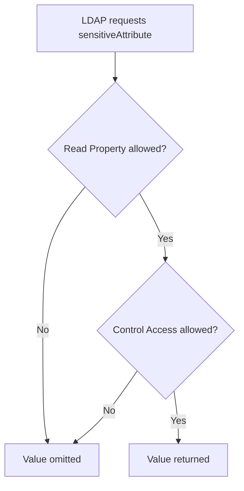

# Protecting Sensitive Attributes in Active Directory

**Marking an attribute confidential adds a second access check. Reading it requires both `READ_PROPERTY` and `CONTROL_ACCESS`. It does not encrypt the value, stop replication or turn Active Directory into a secrets vault.**

> 🎯 **TL;DR**
>
> - Confidentiality is bit `0x80` (`128`) in the schema attribute's `searchFlags`.
> - Preserve all existing bits: use a bitwise OR, not `searchFlags = 128` blindly.
> - Base-schema attributes with `FLAG_SCHEMA_BASE_OBJECT` (`systemFlags` bit `0x10`) cannot be made confidential this way.
> - Delegate an object-specific **Control Access** ACE for the attribute, plus Read Property.
> - The value still replicates to writable DCs and remains accessible to highly privileged administrators.
> - Test schema and ACL changes in a representative lab before production.

---

## 🧭 1 — What the Confidential Flag Changes

Normally, an LDAP caller with `READ_PROPERTY` can read an attribute. When `fCONFIDENTIAL` is set, AD DS requires:

$$
\text{READ\_PROPERTY} \land \text{CONTROL\_ACCESS}
$$

If either check fails, the server treats the value as absent from the LDAP result. The check also affects whether the attribute can satisfy an LDAP search filter.



This is an authorization control, not cryptographic protection.

---

## 🔍 2 — Check the Attribute Before Changing It

Schema changes are forest-wide. Start by reading the current definition from the schema naming context:

```powershell
$AttributeName = 'customSensitiveData'
$SchemaNC = (Get-ADRootDSE).schemaNamingContext

$Attribute = Get-ADObject `
    -SearchBase $SchemaNC `
    -LDAPFilter "(&(objectClass=attributeSchema)(lDAPDisplayName=$AttributeName))" `
    -Properties lDAPDisplayName, searchFlags, systemFlags, schemaIDGUID, `
        attributeSecurityGUID, isMemberOfPartialAttributeSet

$Attribute | Select-Object lDAPDisplayName, searchFlags, systemFlags, `
    schemaIDGUID, attributeSecurityGUID, isMemberOfPartialAttributeSet
```

Validate all of the following:

- the attribute is the intended one;
- `systemFlags` does not include `0x10` (`FLAG_SCHEMA_BASE_OBJECT`);
- the current `searchFlags` value is recorded;
- existing index, ANR, preserve-on-delete or RODC-filter bits are understood;
- applications and synchronization products that read the attribute are inventoried.

```powershell
$IsBaseSchema = ($Attribute.systemFlags -band 0x10) -ne 0
$IsConfidential = ($Attribute.searchFlags -band 0x80) -ne 0

[pscustomobject]@{
    Attribute      = $Attribute.lDAPDisplayName
    IsBaseSchema   = $IsBaseSchema
    IsConfidential = $IsConfidential
    SearchFlags    = $Attribute.searchFlags
}
```

> ⚠️ Do not attempt this procedure on a base-schema attribute. Create a fit-for-purpose custom schema attribute instead.

---

## 🧮 3 — Preserve the Existing `searchFlags`

`searchFlags` is a bitmask:

| Bit | Hex | Meaning |
|---:|---:|---|
| 0 | `0x01` | Indexed |
| 1 | `0x02` | Containerized index |
| 2 | `0x04` | Ambiguous Name Resolution |
| 3 | `0x08` | Preserve on delete |
| 7 | `0x80` | Confidential |
| 8 | `0x100` | Never audit individual values |
| 9 | `0x200` | RODC filtered attribute set |

Calculate the new value with bitwise OR:

```powershell
$CurrentSearchFlags = [int]$Attribute.searchFlags
$NewSearchFlags = $CurrentSearchFlags -bor 0x80

[pscustomobject]@{
    Current = $CurrentSearchFlags
    New     = $NewSearchFlags
}
```

For example, an indexed attribute at `1` becomes `129`, not `128`. Assigning `128` directly would silently remove the index bit.

---

## 🛠️ 4 — Set the Confidential Bit

Perform schema changes only through the organization's schema-change process and against the schema master.

```powershell
$SchemaMaster = (Get-ADForest).SchemaMaster

Set-ADObject -Identity $Attribute.DistinguishedName `
    -Server $SchemaMaster `
    -Replace @{ searchFlags = $NewSearchFlags }
```

Verify from the schema master and another DC after replication:

```powershell
$Servers = @($SchemaMaster, (Get-ADDomainController -Discover).HostName) |
    Select-Object -Unique

$Results = foreach ($Server in $Servers) {
    Get-ADObject -Identity $Attribute.DistinguishedName `
        -Server $Server -Properties searchFlags |
        Select-Object @{Name = 'Server'; Expression = { $Server }}, `
            searchFlags
}

$Results | Format-Table -AutoSize
```

ADSI Edit can connect directly to the Schema naming context, as shown in the source note:


Prefer scripted, reviewed changes because they preserve the before/after values and reduce accidental bitmask replacement.

---

## 🔐 5 — Delegate the Narrowest Read Right

The confidential flag denies ordinary readers. Applications that legitimately require the value need both Read Property and Control Access for that attribute.

Use an object-specific ACE scoped to:

- a dedicated reader group;
- the one confidential attribute;
- the intended object class;
- the narrowest OU or container;
- inherited child objects only when required.

The original LDP ACE dialog illustrates the required controls:


Avoid granting generic **All Extended Rights** at OU or domain scope. Generic Control Access includes powerful rights unrelated to this attribute.

After updating the DACL, verify both an authorized and an unauthorized identity:

```powershell
$TargetUser = 'CN=Lab User,OU=Lab,DC=contoso,DC=com'

Get-ADUser -Identity $TargetUser `
    -Properties customSensitiveData |
    Select-Object SamAccountName, customSensitiveData
```

Run the query in separate sessions under the two identities. An omitted value is expected for the unauthorized reader.

---

## 🧱 6 — Confidential Does Not Mean Secret

The flag does not provide:

- encryption of the attribute inside `ntds.dit`;
- application-level encryption or key separation;
- protection from Domain Admins, Enterprise Admins or equivalent directory control;
- protection from backups, snapshots or offline database access;
- exclusion from writable-DC replication;
- automatic exclusion from the Global Catalog;
- automatic exclusion from RODCs.

For RODCs, `fRODCFilteredAttribute` is a separate `searchFlags` bit (`0x200`) with separate eligibility and operational consequences. For Global Catalog replication, inspect `isMemberOfPartialAttributeSet` separately.

Do not store reusable passwords, private keys or high-impact application secrets in a custom AD attribute merely because it is confidential. Use a dedicated secret-management system.

---

## 🧪 7 — Test Matrix

| Test | Expected result |
|---|---|
| Unauthorized direct read | Attribute omitted |
| Unauthorized LDAP filter on value | Object does not match based on that value |
| Authorized reader with both rights | Value returned |
| Reader with only Read Property | Value omitted |
| Reader with only Control Access | Value omitted |
| Query against multiple writable DCs | Same authorization outcome after replication |
| Backup/privileged recovery path | Documented as outside this control's boundary |

Also test applications that request `*`, explicit attribute lists, DirSync or Global Catalog results. Do not assume every connector interprets an omitted attribute the same way.

---

## 🔎 8 — Audit Existing Confidential Attributes

```powershell
$SchemaNC = (Get-ADRootDSE).schemaNamingContext

Get-ADObject -SearchBase $SchemaNC `
    -LDAPFilter '(&(objectClass=attributeSchema)(searchFlags:1.2.840.113556.1.4.803:=128))' `
    -Properties lDAPDisplayName, searchFlags, systemFlags, `
        isMemberOfPartialAttributeSet |
    Select-Object lDAPDisplayName, searchFlags, systemFlags, `
        isMemberOfPartialAttributeSet |
    Sort-Object lDAPDisplayName
```

For each result, review:

- business owner and data classification;
- groups with object-specific Control Access;
- inherited generic extended rights;
- replication to GC and RODC replicas;
- applications that fail open or fail closed when the value is absent;
- auditing on the target objects and schema-change process.

---

## ✅ 9 — Deployment Checklist

1. Confirm a confidential AD attribute is the right storage design.
2. Use a custom, non-base-schema attribute.
3. Record current `searchFlags` and calculate `current -bor 0x80`.
4. Test schema replication and application compatibility in a lab.
5. Grant Read Property and object-specific Control Access to a dedicated group.
6. Validate allowed and denied identities against multiple DCs.
7. Review GC, RODC, backup and privileged-access exposure separately.
8. Monitor schema and ACL changes after deployment.

The boundary is precise:

> **Confidential attributes restrict ordinary LDAP reads through ACLs. They do not replace encryption, privileged-access control or secret management.**

---

## 📚 References

- [MS-ADTS: Search Flags](https://learn.microsoft.com/en-us/openspecs/windows_protocols/ms-adts/7c1cdf82-1ecc-4834-827e-d26ff95fb207)
- [MS-ADTS: Extended Access Checks](https://learn.microsoft.com/en-us/openspecs/windows_protocols/ms-adts/e6685d31-5d87-42d0-8a5f-e55d337f47cd)
- [Mark an attribute as confidential](https://learn.microsoft.com/en-us/troubleshoot/windows-server/windows-security/mark-attribute-as-confidential)
- [Characteristics of attributes](https://learn.microsoft.com/en-us/windows/win32/ad/characteristics-of-attributes)