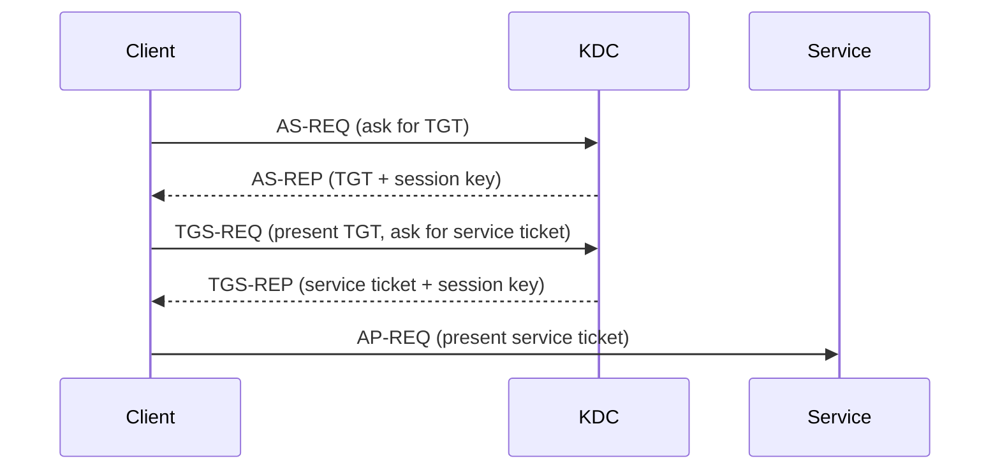
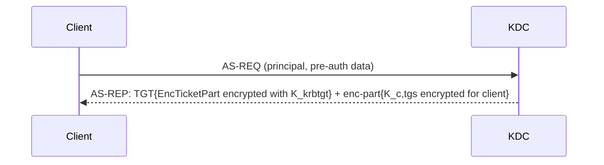
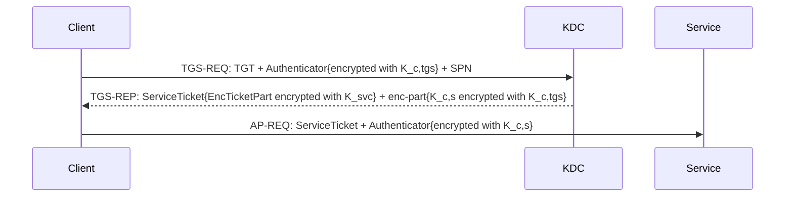
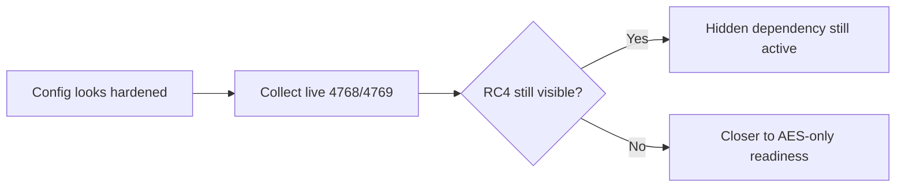
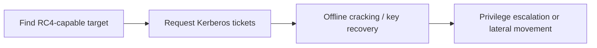

# RC4 Fundamentals, Obsolescence, and Risks of Continued Use

Short version: if RC4 still shows up in your Kerberos flow, your AD is running legacy crypto in production.

This article is a technical baseline for engineers who want proof, not vibes:

- where RC4 still hides,
- why it is obsolete,
- what attackers gain when it stays,
- what breaks when you disable it too early.

Lab smell test: if someone says "we are AES-only" but cannot show recent 4769 evidence, assume RC4 is still lurking somewhere.

## 1. Where RC4 still appears in Kerberos 👀

### Kerberos flow refresher (TGT, TGS, and what is actually encrypted)

If this part is fuzzy, RC4 analysis becomes guesswork.

High-level rule before going deep:

- TGT flow (AS) gets you a ticket to talk to the KDC later.
- TGS flow gets you a ticket for the target service.
- Ticket blob encryption and session-key-related encryption are different things, and can show mixed AES/RC4 behavior.

Detailed breakdown is in the next sections, with per-step "encrypted with", "who decrypts", and where session keys are duplicated.

### Deep Dive 1: TGT Flow (AS Exchange)

If you are new to Kerberos, keep this first mental model:

- The client carries tickets, but usually cannot read ticket internals.
- The KDC generates temporary session keys.
- Long-term keys protect ticket blobs, session keys protect short-lived exchanges.

Three key families to separate:

| Key family | What it is | Typical owner |
| --- | --- | --- |
| Long-term key | Key derived from account secret/password material | `krbtgt`, service account, user/computer account |
| Session key | Temporary key generated per Kerberos exchange | Shared by two actors for one auth context |
| Message protection key usage | Key usage that encrypts Kerberos blobs (`enc-part`, `EncTicketPart`) | Depends on message and recipient |

TGT objective:

- Client gets a ticket to request future service tickets from the KDC.
- Ticket internals are encrypted for `krbtgt`, not for the client.

#### Full TGT crypto flow (AS exchange) step by step

Notation used:

- `K_user`: user/computer long-term key.
- `K_krbtgt`: `krbtgt` long-term key.
- `K_c,tgs`: client-to-KDC session key (for TGT context).

Where the user password and encryption type (etype) enter the AS flow:

| Moment | What is used | Why it matters |
| --- | --- | --- |
| Client key derivation | User password material is transformed into long-term Kerberos keys (`K_user`) per etype. | No password-derived key, no valid pre-auth proof. |
| AS-REQ etype proposal | Client advertises supported etypes (for example AES256/AES128/RC4). | Defines what crypto options are on the table. |
| KDC pre-auth check | KDC uses matching account key/etype to validate pre-auth (for example encrypted timestamp). | This is where password knowledge is actually proven. |
| AS-REP client `enc-part` | KDC encrypts client reply part with the client-side key context for the selected etype. | Client can recover `K_c,tgs` only if it has the right password-derived key material. |

Beginner translation:

- Password is not sent directly.
- Password-derived keys are used to prove identity during pre-auth.
- Etype decides which key flavor is used (AES vs RC4 path).
- If account/client still allow RC4, the AS exchange can still negotiate legacy crypto.

Quick mental model for AD:

- AES key path: password -> string-to-key derivation for AES keys.
- RC4 key path: password -> NT hash-equivalent key material used by RC4-HMAC context.
- Same user password can therefore indirectly feed multiple Kerberos key types.

AS/TGT step-by-step table:

| Step | Message part | What happens | Encrypted with | Who can decrypt | Why it exists |
| --- | --- | --- | --- | --- | --- |
| 1 | AS-REQ (identity + options) | Client asks for a TGT and lists Kerberos capabilities. | Not the sensitive part yet | KDC reads request metadata | Starts negotiation and policy evaluation |
| 2 | AS-REQ pre-auth data (for example encrypted timestamp/PA data) | Client proves it knows its account secret. | Key derived from `K_user` context | KDC | Blocks trivial impersonation and replay abuse |
| 3 | KDC validation | KDC validates user, policy, pre-auth, account state, time skew. | Internal validation | KDC | Ensures ticket is only issued to a valid principal |
| 4 | KDC generates `K_c,tgs` | KDC creates a fresh session key for client-to-KDC usage. | Generated by KDC | N/A at generation time | Creates short-lived key material for later TGS requests |
| 5 | TGT `EncTicketPart` in AS-REP | KDC builds TGT internals (client identity, flags, PAC/lifetime, `K_c,tgs`). | `K_krbtgt` | KDC/`krbtgt` only | Makes TGT opaque to client and tamper-resistant |
| 6 | AS-REP `enc-part` for client | KDC sends client-readable encrypted reply containing `K_c,tgs` and timing data. | Client-readable key context (`K_user`) | Client | Gives client the same session key without exposing ticket internals |
| 7 | Client stores outputs | Client caches TGT (opaque blob) + extracted `K_c,tgs`. | N/A (storage) | Client uses `K_c,tgs`; cannot read TGT internals | Prepares next phase (`TGS-REQ`) |

Important consequence:

- `K_c,tgs` is present in two encrypted places on purpose.
- Client learns `K_c,tgs` from AS-REP `enc-part`.
- KDC re-obtains `K_c,tgs` later by decrypting TGT blob.

Worked example (concrete):

| Stage | Concrete example |
| --- | --- |
| Identity | User `alice@corp.contoso.com` signs in from `WKSTN-07`. |
| AS-REQ | Client asks KDC for TGT and sends pre-auth proof. |
| KDC issue | KDC generates fresh `K_c,tgs = 9f...` (example value). |
| TGT part | KDC writes `alice`, validity window, flags, and `K_c,tgs` into `EncTicketPart`, then encrypts with `K_krbtgt`. |
| Client part | KDC sends AS-REP `enc-part` that also contains `K_c,tgs`, encrypted so `alice` can read it. |
| Client result | `alice` workstation now has: 1) opaque TGT blob, 2) usable `K_c,tgs` for the next TGS request. |

How to read this example in RC4/AES investigations:

- TGT blob encryption follows `krbtgt` key material and policy at issuance time.
- Client-readable AS-REP encryption context can differ from other later fields.
- So one "AES-looking" signal is not enough to declare the whole Kerberos path AES-only.

### Deep Dive 2: TGS Flow (Service Ticket Exchange)

TGS objective:

- Client requests a ticket for a specific target service (SPN).
- Ticket internals are encrypted for the target service, not for the client.

#### Full TGS crypto flow step by step

Notation used:

- `K_c,tgs`: client-to-KDC session key (from TGT).
- `K_svc`: service account long-term key.
- `K_c,s`: client-to-service session key (for target service).

TGS/service ticket step-by-step table:

| Step | Message part | What happens | Encrypted with | Who can decrypt | Why it exists |
| --- | --- | --- | --- | --- | --- |
| 1 | TGS-REQ (TGT + service request) | Client asks KDC for a ticket to a specific SPN and sends its existing TGT. | TGT internals are already encrypted from AS flow | KDC can open TGT internals via `K_krbtgt` | Lets KDC identify client context and requested target service |
| 2 | TGS-REQ authenticator | Client proves live possession of `K_c,tgs`. | `K_c,tgs` | KDC | Prevents replay of a stolen TGT without session-key possession |
| 3 | KDC validation and policy check | KDC validates TGT lifetime/flags, client rights, and service account state. | Internal validation | KDC | Ensures service ticket is issued only for valid and authorized context |
| 4 | KDC generates `K_c,s` | KDC creates fresh client-to-service session key. | Generated by KDC | N/A at generation time | Creates short-lived key material for client/service exchange |
| 5 | Service ticket `EncTicketPart` in TGS-REP | KDC builds service ticket internals (client identity, authz/PAC context, `K_c,s`). | `K_svc` | Target service only | Makes service ticket opaque to client and tamper-resistant |
| 6 | TGS-REP `enc-part` for client | KDC sends client-readable encrypted reply containing `K_c,s` and ticket metadata. | `K_c,tgs` | Client | Gives client the same session key without exposing service-ticket internals |
| 7 | AP-REQ authenticator to service | Client proves possession of `K_c,s` when presenting service ticket. | `K_c,s` | Target service | Proves caller is the same principal bound to the ticket/session key |

Important consequence:

- `K_c,s` is also duplicated in two encrypted containers.
- Client gets `K_c,s` from TGS-REP `enc-part`.
- Service gets `K_c,s` by decrypting service ticket blob.
- This is why client and service can mutually validate without sharing long-term keys.

Worked example (concrete):

| Stage | Concrete example |
| --- | --- |
| Target request | `alice@corp.contoso.com` requests `MSSQLSvc/sql01.corp.contoso.com:1433`. |
| TGS-REQ | Client sends TGT + authenticator encrypted with `K_c,tgs`. |
| KDC issue | KDC generates fresh `K_c,s = a7...` (example value). |
| Service ticket part | KDC writes `alice`, authorization context, and `K_c,s` into service `EncTicketPart`, then encrypts with `K_svc` for `sql01` service account. |
| Client part | KDC sends TGS-REP `enc-part` containing `K_c,s`, encrypted with `K_c,tgs` so only `alice` client context can read it. |
| AP use | Client presents service ticket to `sql01` and sends authenticator encrypted with `K_c,s`; service decrypts ticket, recovers `K_c,s`, validates authenticator. |

How to read this example in RC4/AES investigations:

- If `K_svc` path still permits RC4, service ticket encryption can stay RC4 even when other parts look modern.
- `TGS-REP enc-part` protection follows `K_c,tgs` context, which may not match service ticket enctype behavior.
- This is why 4769 service ticket encryption evidence is usually the decisive runtime signal.

#### AP Use (Presenting the Service Ticket)

1. Client sends AP-REQ to service:
	- Service ticket.
	- Authenticator encrypted with `K_c,s`.
2. Service decrypts ticket with `K_svc`, extracts `K_c,s`, verifies authenticator.

This proves both parties hold the same session key, without exposing long-term keys.

### Session Key Recap (After TGT and TGS)

Where the session key appears:

| Location | Encrypted for | Why it exists |
| --- | --- | --- |
| Inside ticket blob (`EncTicketPart`) | Ticket recipient (`krbtgt` for TGT, service key for service ticket) | So the recipient can recover session key when ticket is presented |
| Inside reply encrypted part (`AS-REP` or `TGS-REP` `enc-part`) | Client | So the client also learns the same session key |

So yes, the session key is inside the ticket blob, but not only there.

#### Why RC4/AES confusion happens in real investigations

- Ticket blob encryption algorithm is tied to recipient long-term key material and enctype policy.
- Reply/authenticator encryption depends on client/session negotiation context.
- Therefore mixed observations are normal: one part can be AES while another still lands on RC4.
- For exposure ranking, prioritize 4769 service ticket encryption evidence over assumptions from static config alone.

#### Why this matters for RC4 analysis

- Ticket encryption type answers: how the ticket blob itself was sealed.
- Session key encryption-related fields answer: how temporary key material was protected/delivered.
- These can differ in practice, which is why mixed AES/RC4 observations happen.

Common analyst mistake:

- Seeing one AES indicator and declaring the whole flow AES-only.
- Correct approach is field-by-field interpretation, especially on 4769 for service ticket exposure.

RC4 usually survives by accident, not by design.

Common locations include:

- Service ticket issuance where target identities still have RC4-usable or stale key material.
- Account bitmasks that still contain RC4 in msDS-SupportedEncryptionTypes.
- Trust referrals where TDO settings and trust password history still allow RC4.
- Legacy clients or third-party Kerberos stacks with weak enctype negotiation.

Concrete example:

- Service account `svc_sql_legacy` is set to `0x1C` and password has not been rotated in years.
- DC is patched, GPO looks modern, dashboard is green.
- 4769 still emits RC4 tickets for MSSQLSvc SPNs.
- Result: "hardened" config, legacy crypto on the wire.

Fast reality check:

- Config can look clean.
- 4768 and 4769 can still show RC4 on the wire.

That config-vs-runtime gap is where most RC4 projects fail late.

Quick triage query idea:

- Start with 4769.
- Group by target service and ticket encryption type.
- Prioritize high-volume RC4 target services first.

### 4768 and 4769 field map (what to read first)

Field availability can vary by OS build/patch level, but this priority order works in most modern AD estates.

| Priority | Event | Field | Why it matters for RC4 |
| --- | --- | --- | --- |
| 1 | 4769 | Ticket Encryption Type | Primary runtime proof of RC4 on service tickets. |
| 2 | 4769 | Service Name / Target account | Tells you which SPN/service identity still emits RC4. |
| 3 | 4768 | Ticket Encryption Type | Baseline on AS flow; useful context but less decisive for service risk than 4769. |
| 4 | 4768/4769 | Client Advertised Encryption Types | Shows what the client actually offered during negotiation. |
| 5 | 4768/4769 | Service or Account Supported Encryption Types | Explains whether RC4 remains enabled in account capability flags. |
| 6 | 4768/4769 | Session Key Encryption Type | Helps explain mixed outcomes (for example AES session key with RC4 ticket path). |

Fast interpretation rules:

- 4769 + RC4 + high-value SPN: treat as priority remediation target.
- 4768 looks clean but 4769 still shows RC4: issue is usually service-side capability or key history, not only client policy.
- Client advertises AES-only but RC4 still appears: investigate service/trust configuration and key lifecycle.
- Supported types say AES-capable, runtime still RC4: treat static configuration as insufficient evidence.

## 2. Why RC4 is obsolete in AD security posture 🧨

RC4 is legacy crypto. Not "old but fine". Legacy.

Technical reasons in one block:

- RC4-HMAC lacks the security properties expected from current enterprise cryptographic baselines.
- RC4 keeps downgrade paths alive in mixed environments.
- RC4 tickets increase exposure to offline cracking and Kerberos abuse paths.
- Microsoft hardening direction is clearly AES-first, then AES-only.

Operational truth:

- Environments that stay in RC4-compatible mode often accumulate hidden dependencies.
- The longer RC4 remains enabled, the harder controlled removal becomes.

Engineering interpretation:

- RC4 debt compounds like technical debt with interest.
- Every month you wait, migration scope usually gets bigger, not smaller.

## 3. Security risks of keeping RC4 enabled 🔓

Keeping RC4 enabled leaves a weaker lane open in an otherwise modern auth stack.

Main risks:

- Easier abuse of weak Kerberos paths around service identities and SPNs.
- Better conditions for Kerberoasting-style tradecraft against legacy targets.
- Trust-layer weakness when referral tickets remain on RC4.
- False confidence from static checks that ignore runtime ticket evidence.

Practical takeaway:

If RC4 is available anywhere, that is where offensive effort will go first.

Example chain in the wild:

- Identify SPN account with RC4-friendly ticket path.
- Request TGS repeatedly.
- Crack offline.
- Reuse recovered secret for lateral movement and privilege escalation attempts.

## 4. RC4 attack paths you actually see in AD 🎯

RC4 rarely appears alone. It usually appears inside a larger attack chain.

| Attack path | What attacker does | Why RC4 helps | Typical detection clue |
| --- | --- | --- | --- |
| Kerberoasting on weak service identities | Requests TGS for SPN accounts, then cracks offline | RC4 service ticket material is generally easier to crack than modern AES targets | High volume of 4769 tied to SPN accounts and RC4 ticket types |
| Trust ticket abuse across domains/forests | Targets trust referrals and trust account material | RC4 referral tickets increase exposure if trust keys are stale or weakly managed | 4769 patterns around `krbtgt/REMOTE` with RC4 indicators |
| Encryption downgrade behavior | Forces or exploits RC4-capable negotiation paths | If RC4 is still allowed (`0x1C`, legacy clients, mixed settings), downgrade remains possible | Drift in encryption settings plus unexpected RC4 reappearance after hardening |
| Credential theft + lateral movement acceleration | Uses cracked service credentials to pivot | RC4-compatible legacy islands are often the easiest pivot points in mature AD | Same identities repeatedly involved in RC4 tickets + lateral auth spikes |

Bottom line: RC4 does not create every attack, but it lowers attacker cost on several high-impact paths.

If your red team keeps finding a fast path, check where RC4 still exists before buying new tooling.

## 5. Operational risks of unplanned RC4 disablement ⚙️

Turning off RC4 too early is a classic "security change broke prod" event.

Typical failure patterns:

- Legacy applications fail to obtain service tickets after policy tightening.
- Cross-domain or cross-forest authentication breaks when trust prerequisites are incomplete.
- Service accounts with stale keys fail when AES enforcement is applied.
- Sudden increase in Kerberos errors and fallback behavior under production load.

Common outage signature:

- Change window starts.
- 4769 failures and auth retries spike.
- One legacy app pool starts failing tickets.
- Ops rolls back because service owner has no dependency inventory.

RC4 retirement is never a single toggle. It is an evidence-driven sequence.

## 6. What "ready for RC4 removal" means technically ✅

Readiness is measurable. No assumptions.

Minimum evidence set:

- Directory posture reviewed (msDS-SupportedEncryptionTypes on relevant principals).
- KDC default posture reviewed (DefaultDomainSupportedEncTypes where applicable).
- Trust posture reviewed (TDO enctype policy plus trust password recency).
- Live Kerberos telemetry reviewed (4768 and 4769 trends over a representative window).
- Residual RC4 cases classified into remediable now vs controlled temporary exception.

Useful technical markers:

- 0x04 means RC4-only: direct remediation target.
- 0x1C means AES plus RC4: still downgrade-capable.
- 0x18 is usually the AES target state for accounts that should be RC4-free.
- 4769 with RC4 patterns after "hardening" means your migration is not done yet.

Mini decoding examples:

- `0x1C` on a service account = "AES-capable" but still RC4-allowed.
- `0x18` without secret rotation can still fail expectation if usable AES keys are missing.
- Trust set to AES policy but old trust password can keep referral behavior in a bad state.

| Marker | Meaning | Engineering signal |
| --- | --- | --- |
| `0x04` | RC4 only | Immediate remediation target |
| `0x1C` | AES + RC4 | Still downgrade-capable |
| `0x18` | AES128 + AES256 | Typical RC4-free account target |
| `4769 + RC4` | RC4 ticket still issued | Runtime proof that work remains |

Scope note:

- This article stays on fundamentals, risks, and readiness signals.
- Detailed rollout topics (CVE-2026-20833 phases, Kdcsvc 201-209 events, registry rollout controls, and exception handling for non-Windows keytabs) belong to a dedicated implementation article.

If these checks are incomplete, treat RC4 disablement as high risk.

| Symptom | Likely cause | First technical action |
| --- | --- | --- |
| 4769 still shows RC4 for same SPNs | Service identities still RC4-allowed or stale keys | Review account enctype + rotate secret + re-test |
| AES policy set but behavior unchanged | Config applied, runtime evidence missing | Validate 4768/4769 over representative period |
| Cross-forest auth breaks after tightening | Trust prerequisites incomplete | Audit TDO settings and trust key lifecycle |

## 7. Recommended next technical steps

Once this baseline is established, the next engineering actions should be:

- Build a dependency inventory from directory data and live Kerberos events.
- Classify residual RC4 usage into immediate remediation vs temporary exceptions.
- Define and validate an AES migration sequence before enforcement changes.
- Confirm each change with runtime ticket evidence, not only static configuration.

Suggested execution order:

1. Fix high-volume RC4 SPN targets first.
2. Fix trust-related RC4 paths second.
3. Re-measure ticket telemetry.
4. Enforce harder settings only after runtime evidence is stable.

## Related technical references already in this repository

- 060 - Active Directory/Hardening/Audit and Enforcement of Kerberos Encryption Type/Audit and Enforcement of Kerberos Encryption Type.md
- 060 - Active Directory/Hardening/Weak supported encryption algorithms on DCs.md
- 060 - Active Directory/Hardening/Hardening Kerberos Encryption on AD Trusts/Hardening Kerberos Encryption on AD Trusts.md
- 020 - Microsoft Defender/Defender for Identity/Reporting/RC4 HMAC Report.md
