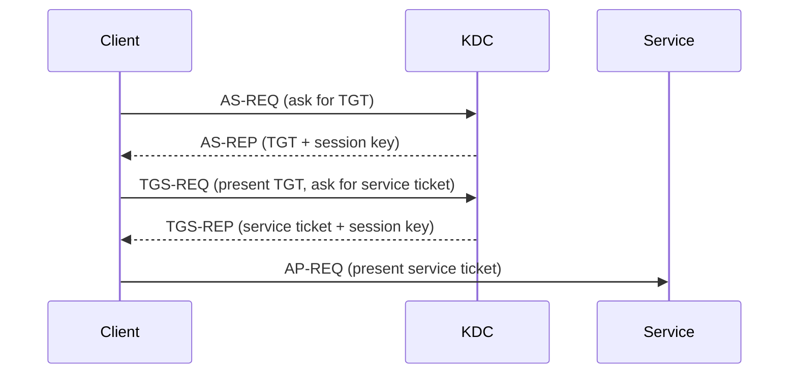
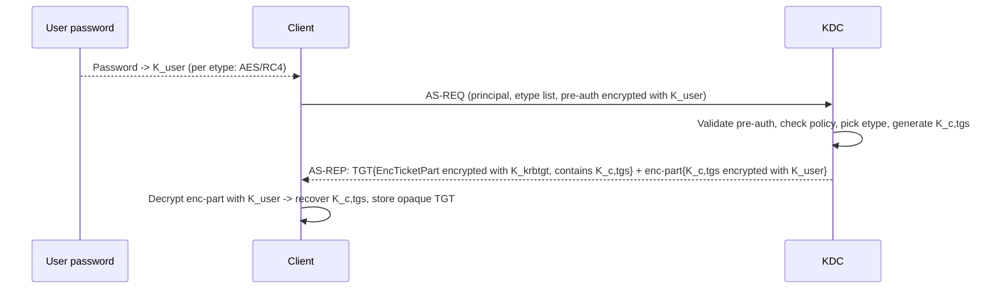
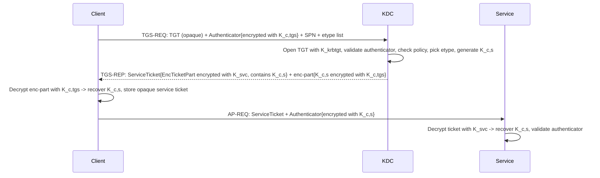
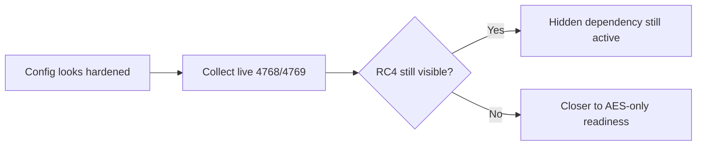
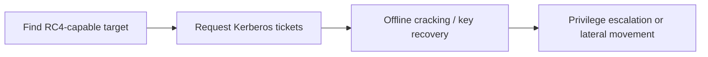

# RC4 Fundamentals, Obsolescence, and Risks of Continued Use

Short version: if RC4 still shows up in your Kerberos flow, your AD is running legacy crypto in production.

This article is a technical baseline for engineers who want proof, not vibes:

- where RC4 still hides,
- why it is obsolete,
- what attackers gain when it stays,
- what breaks when you disable it too early.

Lab smell test: if someone says "we are AES-only" but cannot show recent 4769 evidence, assume RC4 is still lurking somewhere.

## 0. RC4 and Kerberos in 60 seconds 🧭

No prior Kerberos knowledge needed. Just two simple ideas.

What is RC4 here:

- RC4 is an old encryption algorithm still allowed by Active Directory in some flows.
- In Kerberos, RC4 is the legacy alternative to AES.
- AES is the modern target. RC4 is the lane attackers prefer.

Kerberos in everyday language (airport analogy):

- Kerberos = the whole airport authentication system.
- The KDC (Key Distribution Center) = immigration / passport control (a domain controller).
- A TGT (Ticket Granting Ticket) = your passport, stamped by immigration: it does not board you on any plane, but it lets you ask for boarding passes at any gate.
- A service ticket = a boarding pass for one specific flight (one specific service, like SQL or a file share).
- A session key = a short-lived shared secret, like a single-use confirmation code. A new one is created at each step:
  - after the TGT step: shared between the client and the KDC (used for later requests to immigration).
  - after the service ticket step: shared between the client and the target service (used to prove identity at the gate).
- A long-term key = a stable identity badge linked to an account password (user, computer, service, or `krbtgt`).

Why RC4 matters in this story:

- Passports, boarding passes and confirmation codes can be "sealed" with AES or with RC4.
- If anything in the chain still seals with RC4, attackers get an easier door.
- Goal of this article: see clearly where RC4 still appears, and why it is dangerous if you leave it.

## 1. Where RC4 still appears in Kerberos 👀

### Kerberos flow refresher (TGT, TGS, and what is actually encrypted)

If the previous airport analogy is clear, this section will feel natural.

High-level rule before going deep:

- TGT flow (AS) gets you a ticket to talk to the KDC later.
- TGS flow gets you a ticket for the target service.
- Ticket blob encryption and session-key-related encryption are different things, and can show mixed AES/RC4 behavior.

Detailed breakdown is in the next sections, with per-step "encrypted with", "who decrypts", and where session keys are duplicated.

### Deep Dive 1: TGT Flow (AS Exchange)

Plain-English version first:

- You arrive at immigration (the KDC).
- You prove you are you by showing something only you know (your password, indirectly).
- Immigration stamps your passport (TGT) and gives you a one-day confirmation code (session key) so you can come back to any gate later and ask for boarding passes.

TGT objective:

- Client authenticates to the KDC and obtains a TGT.
- Ticket internals are encrypted for `krbtgt`, not for the client.

Notation (read once, then you are good):

- `K_user`: a key derived from the user password (a different one per encryption type, like AES or RC4).
- `K_krbtgt`: the special key of the KDC's internal `krbtgt` account.
- `K_c,tgs`: the short-lived session key between client and KDC.
- Etype ("encryption type"): which algorithm is used (AES256, AES128, RC4).

The whole TGT flow in one diagram:

The whole TGT flow in one table:

| Step | Who | Action | Input / Key used | Output | Why it matters for RC4 |
| --- | --- | --- | --- | --- | --- |
| 1 | Client | Derive long-term key from password per supported etype | Password + etype (AES256/AES128/RC4) | `K_user` (one per etype) | Same password feeds AES key and RC4 key in parallel |
| 2 | Client | Send AS-REQ with identity and supported etype list | Principal name, etype list | AS-REQ on the wire | If RC4 is still in the list, downgrade remains possible |
| 3 | Client | Add pre-auth (typically encrypted timestamp) | Encrypted with `K_user` of chosen etype | Pre-auth blob in AS-REQ | This is the actual proof of password knowledge |
| 4 | KDC | Validate pre-auth and policy | KDC reads account key for matching etype | Decision: accept or reject | KDC picks the etype it will use for AS-REP |
| 5 | KDC | Generate fresh session key | RNG | `K_c,tgs` | Temporary, scoped to TGT context |
| 6 | KDC | Build TGT internals (`EncTicketPart`) | Client identity, flags, lifetime, `K_c,tgs` encrypted with `K_krbtgt` | Opaque TGT blob | Ticket blob etype follows `krbtgt` keys/policy |
| 7 | KDC | Build AS-REP `enc-part` for client | `K_c,tgs` and timing data encrypted with `K_user` | Client-readable encrypted part | Etype here can differ from ticket blob etype |
| 8 | Client | Decrypt AS-REP `enc-part` | `K_user` (right etype) | Recovers `K_c,tgs` | Without correct key/etype, login fails |
| 9 | Client | Cache outputs | Stores TGT (opaque) + `K_c,tgs` | Ready for TGS-REQ | Client never sees TGT internals |

Concrete example to make it real:

- Identity: `alice@corp.contoso.com` from `WKSTN-07`.
- Alice types her password. Workstation derives `K_user_AES256` and `K_user_RC4`.
- Client sends AS-REQ proposing AES256, AES128, RC4.
- Pre-auth is encrypted with `K_user_AES256` (best mutual etype).
- KDC validates pre-auth, generates `K_c,tgs = 9f...`.
- KDC builds TGT: `EncTicketPart` (containing `alice`, flags, `K_c,tgs`) encrypted with `K_krbtgt`.
- KDC builds AS-REP `enc-part`: `K_c,tgs` encrypted with `K_user_AES256`.
- Workstation decrypts `enc-part` -> stores TGT (opaque) and `K_c,tgs`.

How to read this for RC4/AES:

- TGT blob etype is driven by `krbtgt` key material and policy.
- AS-REP `enc-part` etype is driven by negotiated client/account etype.
- They can differ, so a single "AES" signal does not prove an AES-only path.
- If RC4 keys remain valid on the account, RC4 path can still be selected silently.

### Deep Dive 2: TGS Flow (Service Ticket Exchange)

Plain-English version first:

- You go back to the airline desk, show your stamped passport (TGT), and ask for a boarding pass to a specific flight (a service like SQL).
- The desk prints a boarding pass that only that flight's gate can read, and gives you a new confirmation code (session key) for that flight.
- You walk to the gate, hand over the boarding pass and use the new code to prove you are the right passenger.

TGS objective:

- Client requests a ticket for a specific target service (SPN).
- Ticket internals are encrypted for the target service, not for the client.

Notation:

- `K_c,tgs`: session key between client and KDC (you already have it from the TGT step).
- `K_svc`: long-term key of the target service account (derived from its password).
- `K_c,s`: short-lived session key between client and target service.
- SPN: a name for the service you want to talk to (for example `MSSQLSvc/sql01...`).

The whole TGS flow in one diagram:

The whole TGS flow in one table:

| Step | Who | Action | Input / Key used | Output | Why it matters for RC4 |
| --- | --- | --- | --- | --- | --- |
| 1 | Client | Build TGS-REQ for target SPN | TGT (opaque) + supported etypes + SPN | TGS-REQ on the wire | Etype list still allowing RC4 keeps legacy path open |
| 2 | Client | Add authenticator proving live possession of `K_c,tgs` | Timestamp encrypted with `K_c,tgs` | Authenticator blob | Prevents replay of a stolen TGT alone |
| 3 | KDC | Open TGT internals | `K_krbtgt` | Recovers client identity, flags, `K_c,tgs` | Verifies the TGT is genuine |
| 4 | KDC | Validate authenticator, policy, service account state | `K_c,tgs` for authenticator | Decision: accept or reject | KDC picks the etype for the service ticket based on `K_svc` capabilities |
| 5 | KDC | Generate fresh session key | RNG | `K_c,s` | Temporary, scoped to client/service |
| 6 | KDC | Build service ticket internals (`EncTicketPart`) | Client identity, authz/PAC, `K_c,s` encrypted with `K_svc` | Opaque service ticket blob | Ticket blob etype follows service account keys/policy (the main RC4 hotspot) |
| 7 | KDC | Build TGS-REP `enc-part` for client | `K_c,s` and ticket metadata encrypted with `K_c,tgs` | Client-readable encrypted part | Etype here follows `K_c,tgs`, may differ from ticket blob etype |
| 8 | Client | Decrypt TGS-REP `enc-part` | `K_c,tgs` | Recovers `K_c,s` | Required to authenticate to the service |
| 9 | Client | Send AP-REQ to service | Service ticket + authenticator encrypted with `K_c,s` | AP-REQ on the wire | Service ticket blob still flows with its own etype |
| 10 | Service | Decrypt service ticket | `K_svc` | Recovers `K_c,s` and PAC | If `K_svc` is RC4-capable and selected, this is RC4-on-the-wire |
| 11 | Service | Validate authenticator | `K_c,s` | Client authenticated | Closes the mutual proof |

Concrete example to make it real:

- `alice@corp.contoso.com` requests `MSSQLSvc/sql01.corp.contoso.com:1433`.
- Workstation sends TGS-REQ: TGT + authenticator (encrypted with `K_c,tgs`) + SPN + etype list (AES256, AES128, RC4).
- KDC opens TGT with `K_krbtgt`, validates authenticator, looks up `svc_sql01` account etype capabilities.
- KDC generates `K_c,s = a7...`.
- Service ticket: `EncTicketPart` with `alice` identity, PAC, and `K_c,s`, encrypted with `K_svc` (etype selected based on service account support).
- TGS-REP `enc-part`: `K_c,s` and metadata encrypted with `K_c,tgs`.
- Workstation decrypts `enc-part`, stores opaque service ticket + `K_c,s`.
- AP-REQ: service ticket + authenticator encrypted with `K_c,s` sent to `sql01`.
- `sql01` decrypts ticket with `K_svc`, recovers `K_c,s`, validates authenticator.

How to read this for RC4/AES:

- Service ticket etype is driven by `K_svc` keys and account configuration (this is where Kerberoasting risk concentrates).
- TGS-REP `enc-part` etype is driven by `K_c,tgs` context.
- They can differ, so 4769 service ticket encryption type is the decisive runtime signal.
- A service account with stale keys or `0x1C` capability can keep RC4 alive on the wire even when client and policy look modern.

### Session Key Recap (After TGT and TGS)

Where the session key appears:

| Location | Encrypted for | Why it exists |
| --- | --- | --- |
| Inside ticket blob (`EncTicketPart`) | Ticket recipient (`krbtgt` for TGT, service key for service ticket) | So the recipient can recover session key when ticket is presented |
| Inside reply encrypted part (`AS-REP` or `TGS-REP` `enc-part`) | Client | So the client also learns the same session key |

So yes, the session key is inside the ticket blob, but not only there.

The one rule to remember:

- Ticket blob etype follows the recipient's long-term key (`krbtgt` for TGT, service key for service ticket).
- Reply `enc-part` etype follows the client/session context.
- They can disagree. That is why an "AES-looking" indicator alone is not proof of an AES-only path.
- For service exposure, trust the 4769 service ticket encryption type first.

RC4 usually survives by accident, not by design.

Common locations include:

- Service ticket issuance where target identities still have RC4-usable or stale key material.
- Account bitmasks that still contain RC4 in msDS-SupportedEncryptionTypes.
- Trust referrals where TDO settings and trust password history still allow RC4.
- Legacy clients or third-party Kerberos stacks with weak enctype negotiation.

Concrete example:

- Service account `svc_sql_legacy` is set to `0x1C` and password has not been rotated in years.
- DC is patched, GPO looks modern, dashboard is green.
- 4769 still emits RC4 tickets for MSSQLSvc SPNs.
- Result: "hardened" config, legacy crypto on the wire.

Fast reality check:

- Config can look clean.
- 4768 and 4769 can still show RC4 on the wire.

That config-vs-runtime gap is where most RC4 projects fail late.

Quick triage query idea:

- Start with 4769.
- Group by target service and ticket encryption type.
- Prioritize high-volume RC4 target services first.

### 4768 and 4769 field map (what to read first)

Field availability can vary by OS build/patch level, but this priority order works in most modern AD estates.

| Priority | Event | Field | Why it matters for RC4 |
| --- | --- | --- | --- |
| 1 | 4769 | Ticket Encryption Type | Primary runtime proof of RC4 on service tickets. |
| 2 | 4769 | Service Name / Target account | Tells you which SPN/service identity still emits RC4. |
| 3 | 4768 | Ticket Encryption Type | Baseline on AS flow; useful context but less decisive for service risk than 4769. |
| 4 | 4768/4769 | Client Advertised Encryption Types | Shows what the client actually offered during negotiation. |
| 5 | 4768/4769 | Service or Account Supported Encryption Types | Explains whether RC4 remains enabled in account capability flags. |
| 6 | 4768/4769 | Session Key Encryption Type | Helps explain mixed outcomes (for example AES session key with RC4 ticket path). |

Fast interpretation rules:

- 4769 + RC4 + high-value SPN: treat as priority remediation target.
- 4768 looks clean but 4769 still shows RC4: issue is usually service-side capability or key history, not only client policy.
- Client advertises AES-only but RC4 still appears: investigate service/trust configuration and key lifecycle.
- Supported types say AES-capable, runtime still RC4: treat static configuration as insufficient evidence.

## 2. Why RC4 is obsolete in AD security posture 🧨

Plain-English version:

- RC4 is a 1990s stream cipher.
- Modern crypto standards have moved on.
- Keeping RC4 enabled in 2026 is like keeping a copy of your house key under the doormat "just in case".

Technical reasons in one block:

- RC4-HMAC lacks the security properties expected from current enterprise cryptographic baselines.
- RC4 keeps downgrade paths alive in mixed environments.
- RC4 tickets increase exposure to offline cracking and Kerberos abuse paths.
- Microsoft hardening direction is clearly AES-first, then AES-only.

Operational truth:

- Environments that stay in RC4-compatible mode often accumulate hidden dependencies.
- The longer RC4 remains enabled, the harder controlled removal becomes.

Engineering interpretation:

- RC4 debt compounds like technical debt with interest.
- Every month you wait, migration scope usually gets bigger, not smaller.

## 3. Security risks of keeping RC4 enabled 🔓

Plain-English version:

- Even if everything else is modern, one RC4 lane is enough for attackers to focus on.
- Most real-world attack chains in AD start at the weakest crypto path available.

Main risks:

- Easier abuse of weak Kerberos paths around service identities and SPNs.
- Better conditions for Kerberoasting-style tradecraft against legacy targets.
- Trust-layer weakness when referral tickets remain on RC4.
- False confidence from static checks that ignore runtime ticket evidence.

Practical takeaway:

If RC4 is available anywhere, that is where offensive effort will go first.

Example chain in the wild:

- Identify SPN account with RC4-friendly ticket path.
- Request TGS repeatedly.
- Crack offline.
- Reuse recovered secret for lateral movement and privilege escalation attempts.

## 4. RC4 attack paths you actually see in AD 🎯

RC4 rarely appears alone. It usually appears inside a larger attack chain.

| Attack path | What attacker does | Why RC4 helps | Typical detection clue |
| --- | --- | --- | --- |
| Kerberoasting on weak service identities | Requests TGS for SPN accounts, then cracks offline | RC4 service ticket material is generally easier to crack than modern AES targets | High volume of 4769 tied to SPN accounts and RC4 ticket types |
| Trust ticket abuse across domains/forests | Targets trust referrals and trust account material | RC4 referral tickets increase exposure if trust keys are stale or weakly managed | 4769 patterns around `krbtgt/REMOTE` with RC4 indicators |
| Encryption downgrade behavior | Forces or exploits RC4-capable negotiation paths | If RC4 is still allowed (`0x1C`, legacy clients, mixed settings), downgrade remains possible | Drift in encryption settings plus unexpected RC4 reappearance after hardening |
| Credential theft + lateral movement acceleration | Uses cracked service credentials to pivot | RC4-compatible legacy islands are often the easiest pivot points in mature AD | Same identities repeatedly involved in RC4 tickets + lateral auth spikes |

Bottom line: RC4 does not create every attack, but it lowers attacker cost on several high-impact paths.

If your red team keeps finding a fast path, check where RC4 still exists before buying new tooling.

## 5. Operational risks of unplanned RC4 disablement ⚙️

Turning off RC4 too early is a classic "security change broke prod" event.

Typical failure patterns:

- Legacy applications fail to obtain service tickets after policy tightening.
- Cross-domain or cross-forest authentication breaks when trust prerequisites are incomplete.
- Service accounts with stale keys fail when AES enforcement is applied.
- Sudden increase in Kerberos errors and fallback behavior under production load.

Common outage signature:

- Change window starts.
- 4769 failures and auth retries spike.
- One legacy app pool starts failing tickets.
- Ops rolls back because service owner has no dependency inventory.

RC4 retirement is never a single toggle. It is an evidence-driven sequence.

## 6. What "ready for RC4 removal" means technically ✅

Readiness is measurable. No assumptions.

Minimum evidence set:

- Directory posture reviewed (msDS-SupportedEncryptionTypes on relevant principals).
- KDC default posture reviewed (DefaultDomainSupportedEncTypes where applicable).
- Trust posture reviewed (TDO enctype policy plus trust password recency).
- Live Kerberos telemetry reviewed (4768 and 4769 trends over a representative window).
- Residual RC4 cases classified into remediable now vs controlled temporary exception.

Useful technical markers:

- 0x04 means RC4-only: direct remediation target.
- 0x1C means AES plus RC4: still downgrade-capable.
- 0x18 is usually the AES target state for accounts that should be RC4-free.
- 4769 with RC4 patterns after "hardening" means your migration is not done yet.

Mini decoding examples:

- `0x1C` on a service account = "AES-capable" but still RC4-allowed.
- `0x18` without secret rotation can still fail expectation if usable AES keys are missing.
- Trust set to AES policy but old trust password can keep referral behavior in a bad state.

| Marker | Meaning | Engineering signal |
| --- | --- | --- |
| `0x04` | RC4 only | Immediate remediation target |
| `0x1C` | AES + RC4 | Still downgrade-capable |
| `0x18` | AES128 + AES256 | Typical RC4-free account target |
| `4769 + RC4` | RC4 ticket still issued | Runtime proof that work remains |

Scope note:

- This article stays on fundamentals, risks, and readiness signals.
- Detailed rollout topics (CVE-2026-20833 phases, Kdcsvc 201-209 events, registry rollout controls, and exception handling for non-Windows keytabs) belong to a dedicated implementation article.

If these checks are incomplete, treat RC4 disablement as high risk.

| Symptom | Likely cause | First technical action |
| --- | --- | --- |
| 4769 still shows RC4 for same SPNs | Service identities still RC4-allowed or stale keys | Review account enctype + rotate secret + re-test |
| AES policy set but behavior unchanged | Config applied, runtime evidence missing | Validate 4768/4769 over representative period |
| Cross-forest auth breaks after tightening | Trust prerequisites incomplete | Audit TDO settings and trust key lifecycle |

## 7. Recommended next technical steps

Once this baseline is established, the next engineering actions should be:

- Build a dependency inventory from directory data and live Kerberos events.
- Classify residual RC4 usage into immediate remediation vs temporary exceptions.
- Define and validate an AES migration sequence before enforcement changes.
- Confirm each change with runtime ticket evidence, not only static configuration.

Suggested execution order:

1. Fix high-volume RC4 SPN targets first.
2. Fix trust-related RC4 paths second.
3. Re-measure ticket telemetry.
4. Enforce harder settings only after runtime evidence is stable.

## Related technical references already in this repository

- 060 - Active Directory/Hardening/Audit and Enforcement of Kerberos Encryption Type/Audit and Enforcement of Kerberos Encryption Type.md
- 060 - Active Directory/Hardening/Weak supported encryption algorithms on DCs.md
- 060 - Active Directory/Hardening/Hardening Kerberos Encryption on AD Trusts/Hardening Kerberos Encryption on AD Trusts.md
- 020 - Microsoft Defender/Defender for Identity/Reporting/RC4 HMAC Report.md
