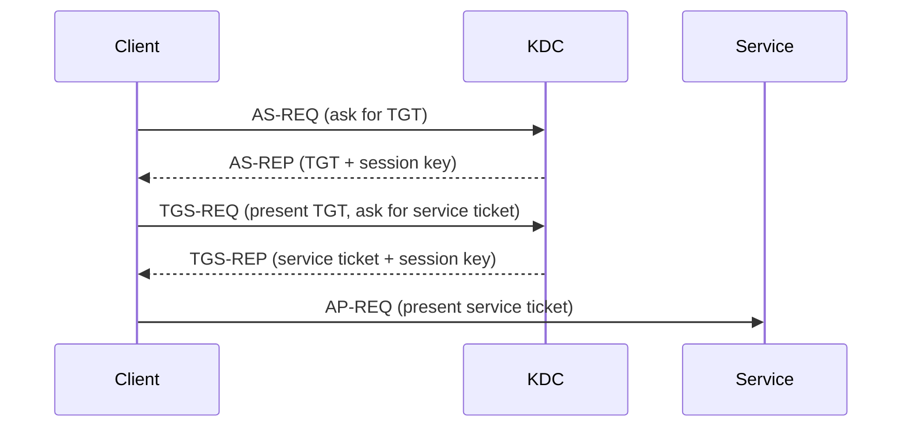
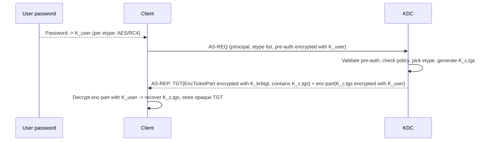
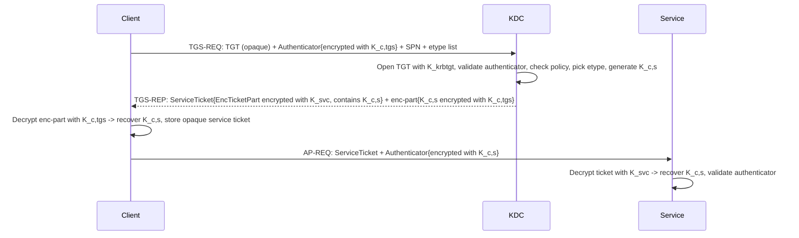

# RC4 Fundamentals, Obsolescence, and Risks of Continued Use

> **Article 1 of 3 — RC4 Hardening series.** Read in order:
>
> 1. **Fundamentals, obsolescence, and risks** *(this article)* — *why* RC4 is dangerous and what attackers actually do with it.
> 2. [Legacy Dependency Mapping and Technical Inventory](./2.%20Legacy%20Dependency%20Mapping%20and%20Technical%20Inventory.md) — *where* RC4 still lives in your estate.
> 3. [Remediation, AES Migration, Cutover, and RC4 Extinction](./3.%20Remediation%2C%20AES%20Migration%2C%20Cutover%2C%20and%20RC4%20Extinction.md) — *how* to remove it without breaking production.

Short version: if RC4 still shows up in your Kerberos flow, your AD is running legacy crypto in production.

This article is a technical baseline for engineers who want proof, not vibes:

- where RC4 still hides,
- why it is obsolete,
- what attackers gain when it stays,
- what breaks when you disable it too early.

Quick reality check: if someone claims *"we are AES-only"* but cannot back it up with recent `4769` event evidence, assume RC4 is still lurking somewhere. A clean declarative state (`msDS-SupportedEncryptionTypes` set to AES on every account) does **not** prove what the KDC actually emits on the wire — only the runtime tickets do.

## Scope and non-scope 🎯

This series is about **RC4 inside Kerberos** in Active Directory. A few adjacent topics that share the name "RC4" or look related are explicitly out of scope — clarifying them upfront avoids wasted effort:

| Topic | Same RC4? | Where it lives | Treated in this series? |
| --- | --- | --- | --- |
| **RC4-HMAC in Kerberos** (etype `0x17`) | Yes — the algorithm sealing AS-REP `enc-part` and service tickets | KDC, AD accounts, trusts (TDOs) | **Yes — this is the entire series** |
| **RC4 in TLS / Schannel** | Same algorithm, different protocol — RC4 cipher suites in HTTPS/LDAPS | Web servers, LDAPS endpoints, Schannel registry | No — separate hardening track |
| **NTLM / NT hash** | **No.** NT hash is `MD4(UTF-16LE(password))`. Common confusion with RC4-HMAC because RC4-HMAC reuses the NT hash as `K_user`, but the cipher itself is not used in NTLM authentication | NTLM authentication flows | No — disabling NTLM is the natural next hardening track once RC4 is gone |
| **DES Kerberos etypes** (`0x01`, `0x02`) | Different algorithm, **even worse** than RC4 (56-bit keys, broken since the 1990s) | Same place as RC4 in AD (bitmask, accounts, trusts) | If you find DES still enabled anywhere, treat it as **priority 0** — same procedure as RC4 but more urgent. The remediation playbook in article 3 applies identically |
| **AES-SHA2 Kerberos etypes** (RFC 8009: `aes128-cts-hmac-sha256-128`, `aes256-cts-hmac-sha384-192`) | Different — newer SHA-2-based KDF | Not implemented by Windows AD as of 2026 | Forward-looking only — Windows still uses the SHA-1-based AES etypes (`0x11`/`0x12`) |

If your question is about RC4 in TLS, NTLM hardening, or DES, the architectural ideas in this series transfer but the configuration surfaces differ. Stop here and use the appropriate dedicated reference instead.

## 1. RC4 and Kerberos in 60 seconds 🧭

No prior Kerberos knowledge needed. Just two simple ideas.

What is RC4 here:

- RC4 is an old encryption algorithm still allowed by Active Directory in some flows.
- In Kerberos, RC4 is the legacy alternative to AES.
- AES is the modern target. RC4 is the lane attackers prefer.

Kerberos in everyday language (airport analogy):

- Kerberos = the whole airport authentication system.
- The KDC (Key Distribution Center) = immigration / passport control (a domain controller).
- A TGT (Ticket Granting Ticket) = your passport, stamped by immigration: it does not board you on any plane, but it lets you ask for boarding passes at any gate.
- A service ticket = a boarding pass for one specific flight (one specific service, like SQL or a file share).
- A session key = a short-lived shared secret, like a single-use confirmation code. A new one is created at each step:
  - after the TGT step: shared between the client and the KDC (used for later requests to immigration).
  - after the service ticket step: shared between the client and the target service (used to prove identity at the gate).
- A long-term key = a stable identity badge linked to an account password (user, computer, service, or `krbtgt`).

Why RC4 matters in this story:

- Passports, boarding passes and confirmation codes can be "sealed" with AES or with RC4.
- If anything in the chain still seals with RC4, attackers get an easier door.
- Goal of this article: see clearly where RC4 still appears, and why it is dangerous if you leave it.

## 2. Two kinds of keys, and why attackers only care about one 🔑

Before the wire-level diagrams, one distinction unlocks the rest of the article. Kerberos uses two very different kinds of keys, and they don't have the same value to an attacker:

| Key type | Where it comes from | Lifetime | Value to an attacker |
| --- | --- | --- | --- |
| **Long-term key** | Derived from a password (user, computer, service account, `krbtgt`). The KDC stores it; the account owner can re-derive it from the password. | Months to years (until next password change). | **The prize.** Cracking it = full account compromise, usable until rotation. |
| **Session key** | Generated randomly by the KDC for each ticket exchange. Never derived from a password. | Minutes to hours (ticket lifetime). | Not worth cracking. Even if recovered, expires fast and is scoped to one specific exchange. |

> 🔑 **What "long-term key" actually means.** Active Directory never stores passwords in cleartext (with the rare and discouraged exception of *reversible encryption*). When a password is set on an account, AD runs it through one or more **Key Derivation Functions (KDFs)** and stores the resulting keys. Here is the full pipeline in one picture:
>
> ```
>                              ┌──────────────────────────────────────────────┐
>                              │                  Password                    │
>                              └───────────────────────┬──────────────────────┘
>                                                      │
>                            ┌─────────────────────────┴─────────────────────────┐
>                            │                                                   │
>             ALWAYS run ────┤                                    Run ONLY if    │
>             (no condition) │                                    DFL ≥ 2008 ────┤
>                            │                                    AND DC ≥ 2008  │
>                            ▼                                                   ▼
>          ┌──────────────────────────────┐               ┌─────────────────────────────────┐
>          │   MD4( UTF-16LE(password) )  │               │ PBKDF2(pwd + salt, 4096, SHA-1) │
>          │   no salt, no iteration      │               │ salt = per-account (see note)   │
>          └──────────────┬───────────────┘               └────────────────┬────────────────┘
>                         │ 128-bit key                                    │  → 128-bit (AES128)
>                         │                                                │  → 256-bit (AES256)
>                         ▼                                                ▼
>          ┌──────────────────────────────┐               ┌─────────────────────────────────┐
>          │ Stored behind  `unicodePwd`  │               │ Stored in `supplementalCredentials`
>          │ (write-only attribute,       │               │ → sub-blob `Primary:Kerberos-Newer-Keys`
>          │ in NTDS.dit)                 │               │
>          │                              │               │ Same access restrictions.
>          │ Readable only via DCSync     │               │ Readable only via DCSync /
>          │ / local DC tools.            │               │ local DC tools.
>          └──────────────┬───────────────┘               └────────────────┬────────────────┘
>                         │                                                │
>                         │ This single 128-bit value is reused as:        │
>                         │                                                │
>                         ├───► The "NT hash"  (NTLM, cached creds,        │
>                         │     pass-the-hash, NetNTLMv2, WDigest legacy)  │
>                         │                                                │
>                         └───► The "RC4-HMAC key" K, used as-is by        │
>                               Kerberos RC4-HMAC (RFC 4757) to seal       │
>                               tickets. NO additional derivation.         │
>                                                                          │
>                                                                          └───► Used by Kerberos
>                                                                                AES128-CTS-HMAC-SHA1-96
>                                                                                and AES256-CTS-HMAC-SHA1-96
>                                                                                to seal tickets. NOT used
>                                                                                by NTLM. Distinct from
>                                                                                the NT hash.
> ```
>
> > 🚩 **Three things to notice on this picture:**
> >
> > 1. **The NT hash is always there.** It is written every time a password is set, with zero conditions. There is no "disable NT hash" switch — the only way to lose it is to require a smart-card-only logon (`Smart card is required for interactive logon`), which forces a random password but still produces a hash. Disabling NTLM does **not** remove the hash on disk; it only blocks the NTLM negotiation at runtime.
> > 2. **The AES keys are conditional.** They exist only when the password was set or changed on `DFL ≥ 2008` with a DC running `≥ 2008`. An account whose password has not been touched since pre-2008 has *no* AES keys, even if `msDS-SupportedEncryptionTypes` is set to `0x18`. **Setting the attribute does not generate keys — only a password rotation does.** This is the *stale-key trap*, central to Article 2 and the trust annex.
> > 3. **The NT hash has two jobs.** That same 128-bit value is *both* the NTLM credential *and* the Kerberos RC4-HMAC key, with no transformation between the two roles. Cracking a ticket sealed with RC4-HMAC therefore recovers NTLM credentials *for free* — no further cracking step required. AES keys, by contrast, are completely separate from NTLM: a cracked AES key does not yield NT hash material.
>
> **Where and when does the KDF actually run?** Not on every Kerberos message. The KDF is a *deterministic* function (same password → same key), so it is run **only when a fresh password enters the system**, and the result is reused from then on. There are exactly three moments to know:
>
> ```
> ┌────────────────────────────────────────────────────────────────────────┐
> │  1. SET PASSWORD  — when an account's password is created or changed   │
> ├────────────────────────────────────────────────────────────────────────┤
> │  Where: on the DC that processes the change (typically the PDC         │
> │         emulator, or whichever DC handled the kpasswd / SAMR call).    │
> │  Action: receives the cleartext password → runs MD4 + PBKDF2 once →    │
> │          writes the resulting keys into NTDS.dit                       │
> │          (NT hash behind `unicodePwd`, AES keys in                     │
> │          `supplementalCredentials`/Primary:Kerberos-Newer-Keys).       │
> │  Frequency: once per password change.                                  │
> │  The cleartext password is then wiped from the DC's memory.            │
> │  The new keys replicate to other DCs as part of normal AD replication. │
> └────────────────────────────────────────────────────────────────────────┘
>
> ┌────────────────────────────────────────────────────────────────────────┐
> │  2. LOGON  — when a client needs to authenticate                       │
> ├────────────────────────────────────────────────────────────────────────┤
> │  Where: on the client machine (Winlogon, RDP, runas, service startup,  │
> │         scheduled task, gMSA fetch — anything that obtains a password  │
> │         and needs to talk to a KDC).                                   │
> │  Action: receives the cleartext password (typed by the user, or pulled │
> │          from the LSA Secrets store for service / machine accounts) →  │
> │          runs the same MD4 + PBKDF2 → places the keys in LSASS.        │
> │  Frequency: once per logon.                                            │
> │  Used to: seal the AS-REQ, decrypt the AS-REP, and stay cached in      │
> │           LSASS for every later TGS-REQ during the session.            │
> └────────────────────────────────────────────────────────────────────────┘
>
> ┌────────────────────────────────────────────────────────────────────────┐
> │  3. TICKET ISSUANCE  — when the KDC processes an AS-REQ or TGS-REQ     │
> ├────────────────────────────────────────────────────────────────────────┤
> │  Where: on whichever DC is acting as KDC.                              │
> │  Action: reads the already-stored keys directly from NTDS.dit and uses │
> │          them to seal the ticket and the session-key envelope.         │
> │  KDF re-run? ❌ NEVER. The KDC never sees the cleartext password.      │
> │             It only sees the keys produced at moment ①.                │
> └────────────────────────────────────────────────────────────────────────┘
> ```
>
> > 🧠 **The asymmetry that makes the picture click.** The KDC and the client both end up holding the same key, but they get there by completely different paths:
> >
> > - **The client** (moment ②) holds the password in cleartext for a few milliseconds and *re-derives* the key locally.
> > - **The KDC** (moment ③) never sees the password and *reads* the key from disk — that key was placed there at moment ① on whichever DC originally processed the password set.
> > - **Once the ticket flow starts** (TGT renewal, TGS-REQ, service ticket presentation), neither side runs the KDF anymore. Both reuse the keys they already have, plus the random *session keys* the KDC generated when issuing each ticket.
> >
> > That is the operational definition of a *shared-secret* protocol: a single value (the password) is the seed, two independent derivations land on the same key without ever exchanging it, and from then on everything runs on the cached result.
>
> Three operational consequences worth keeping in mind:
>
> - **The cleartext password only exists briefly, in two places: the DC that processed the change (moment ①) and the client at logon (moment ②).** It is wiped immediately after derivation. Only the *derived keys* remain — in `NTDS.dit` for the long term, in LSASS for the session. That is exactly why `mimikatz sekurlsa::logonpasswords` recovers NT hashes and Kerberos keys (those *do* persist in LSASS) but only recovers cleartext passwords in specific configurations such as WDigest enabled.
> - **The password never travels on the wire.** No Kerberos message contains the password, nor even the long-term keys themselves — only ciphertext encrypted with them.
> - **The keys live in LSASS for the whole session.** That is what enables fast service-to-service Kerberos (no re-prompt for a password every time you open a new SMB share), and at the same time what makes pass-the-hash and pass-the-ticket attacks work: an attacker with `SeDebugPrivilege` can read those cached keys and tickets out of LSASS and reuse them elsewhere.
>
> **And this is exactly why RC4 is dangerous.** AES doesn't change *what* is protected (the same password sits behind both branches). It changes *how slow* the brute-force pipeline is — one MD4 per candidate password for RC4, versus 4096 SHA-1 rounds plus a per-account salt for AES. The salt also defeats precomputed rainbow tables, which is a separate and equally important defense.

> 🎟️ **What "session key" actually means.** This is the *other* kind of key in Kerberos, and it works the exact opposite way of the long-term key. Same picture as before, in one shot:
>
> ```
>                              ┌──────────────────────────────────────┐
>                              │              The KDC                 │
>                              └──────────────────┬───────────────────┘
>                                                 │
>                                Random byte generator (CSPRNG)
>                                                 │
>                                                 ▼
>                              ┌──────────────────────────────────────┐
>                              │   A fresh random 128 / 256-bit value │
>                              │   Generated ONCE per ticket emitted  │
>                              │   Tied to: this client + this target │
>                              └──────────────────┬───────────────────┘
>                                                 │
>                  ┌──────────────────────────────┴────────────────────────────┐
>                  │                                                           │
>                  ▼                                                           ▼
>     ┌─────────────────────────────┐                       ┌────────────────────────────────┐
>     │  Sealed inside the TICKET   │                       │  Sealed inside the AS-REP /    │
>     │  itself, with the long-term │                       │  TGS-REP body, with the        │
>     │  key of the TARGET account  │                       │  REQUESTING client's long-term │
>     │  (K_krbtgt for TGT,         │                       │  key (or the previous session  │
>     │   K_svc  for service ticket)│                       │  key for TGS-REP)              │
>     │                             │                       │                                │
>     │  → only the target can      │                       │  → only the requesting client  │
>     │    open this side           │                       │    can open this side          │
>     └─────────────────────────────┘                       └────────────────────────────────┘
>
>     Result: client and target both end up holding the SAME random session key,
>     without it ever traveling in cleartext on the wire.
> ```
>
> **What the session key is actually used for.** Once both ends hold it, the session key has three concrete jobs in the rest of the exchange:
>
> 1. **Sign the *authenticator*** the client sends on the next message — a fresh timestamp encrypted with the session key. This proves *"I am the same client that received this ticket, right now"* and stops anyone who only stole the ticket blob from replaying it. The TGT's `K_c,tgs` signs the authenticator on `TGS-REQ`; the service ticket's `K_c,s` signs the authenticator on `AP-REQ`.
> 2. **Mutually authenticate the target.** Optionally, the target replies with its own message encrypted with the same session key — proving it could open the ticket, i.e. that it really holds the long-term key it claims to have. Without this, a client could be talking to an impostor that intercepted the ticket but cannot decrypt it.
> 3. **Protect application traffic afterwards.** Once `AP-REQ` succeeds, GSSAPI / SSPI use the session key (or sub-keys derived from it) to sign and/or encrypt every subsequent message of the application protocol — SMB signing/sealing, LDAP signing, RPC integrity/privacy, etc. This is how Kerberos protects an entire SMB or RPC session, not just the initial handshake.
>
> So the session key is the **operational key that does the per-exchange work**: every authenticator, every per-message signature, every confidentiality wrap. The long-term key only gets touched at the boundary (sealing the envelope, decrypting the AS-REP enc-part once at logon) — after that, all the live cryptography rides on session keys.
>
> Compared to the long-term key:
>
> | Property | Long-term key (K_krbtgt, K_svc) | Session key |
> | --- | --- | --- |
> | **Origin** | Derived from a password (`KDF(password)`) | Random, generated by the KDC |
> | **Where it lives** | NTDS.dit (DC) + LSASS (client) — *persistent* | LSASS only, on both ends — *ephemeral* |
> | **Lifetime** | Months to years (until next password change) | Minutes to hours (ticket lifetime, typically 10h max) |
> | **Predictable from anything else?** | Yes — anyone with the password gets it | No — pure random output, not tied to any reusable secret |
> | **Reusable?** | Across every ticket, every protocol that touches that account | One single Kerberos exchange (this client ↔ this target). New ticket = new session key |
> | **Value to an attacker** | Pass-the-hash, overpass-the-hash, full account compromise, persistent | Decrypts only that one captured exchange — no lateral pivot, no replay |
>
> **Why attackers don't bother attacking the session key.** Even with infinite GPU, brute-forcing a random 128-bit value is computationally infeasible — there is no password to guess, no dictionary to try. And even if it were recovered, it expires fast and unlocks exactly one already-finished exchange. That is why every Kerberos attack you have heard of (Kerberoasting, AS-REP roasting, overpass-the-hash, Golden / Silver Tickets) targets the **long-term** key. The session key is the protocol's *plumbing*; the long-term key is the *prize*.
>
> **One nuance to keep in mind for later.** When we talk about *"the encryption type of a ticket"*, we are really tracking **two** decisions made by the KDC:
>
> 1. The enctype used to **seal the ticket envelope** (long-term key of the target account → driven by the target's `msDS-SupportedEncryptionTypes` and what keys actually exist in `supplementalCredentials`).
> 2. The enctype used as the **session key** (a random value produced for that ticket, but with a chosen length / format).
>
> These two can disagree — and this is the heart of the November 2022 KDC change (KB5021131): the session key now defaults to AES even when the envelope is RC4, which closes the largest Kerberoasting blind spot in legacy estates. We will come back to this distinction in §3's deep dives, in the `4768`/`4769` field map (article 2), and again when discussing trust hardening.

## 3. Kerberos exchanges, end-to-end 🔁

### Notation used in the rest of this article

The Deep Dives below describe Kerberos as **sealed envelopes**: a ticket is an opaque blob that only the holder of the right long-term key can open. To keep the schemas readable we use a single notation throughout — `K_<owner>` always means *"the long-term or session key belonging to this party"*.

**A ticket, in one picture** — same mental model as the trust hardening annex:

```text
┌────────────────────────────────────────────────────────────────┐
│  Kerberos ticket  (envelope sealed with K_target)              │
│                                                                │
│  Ticket Encryption Type  ←  driven by the TARGET's long-term   │
│                             key (K_krbtgt for a TGT,           │
│                             K_svc for a service ticket)        │
│                                                                │
│   ┌────────────────────────────────────────────────────────┐   │
│   │  Session key  (K_c,tgs in a TGT, K_c,s in a svc tkt)   │   │
│   │  Plus: client identity (PAC, SIDs), validity, flags    │   │
│   │                                                        │   │
│   │  Session Key Type  ←  driven by what the CLIENT        │   │
│   │                       advertised + KDC policy          │   │
│   └────────────────────────────────────────────────────────┘   │
└────────────────────────────────────────────────────────────────┘
```

**What sits inside the envelope, besides the session key.** The inner box is the `EncTicketPart` (RFC 4120 §5.3). On top of the session key it carries everything the target needs to make an authorization decision without calling back to the KDC:

- **Client identity** — the principal name (e.g. `alice@CORP.CONTOSO.COM`) and, on Windows, the **PAC** (*Privilege Attribute Certificate*): a Microsoft extension blob containing the user's **SID**, group **SIDs**, and other authorization data. This is what makes a Kerberos ticket usable for AD authorization in one round-trip — no extra LDAP lookup needed at the service.
- **Validity window** — `authtime`, `starttime`, `endtime`, `renew-till`. Outside this window the ticket is rejected even if the signature checks out. This is why clock skew between client, KDC and service has to stay within ~5 minutes by default.
- **Flags** — single bits the KDC turned on at issuance: `forwardable`, `renewable`, `proxiable`, `pre-authent`, `ok-as-delegate`, etc. They control what the holder is allowed to do with the ticket downstream (delegation, renewal, S4U…).

All of that is sealed under the same envelope as the session key — so any tamper attempt invalidates the integrity check and the target rejects the ticket.

Two etypes, one ticket — and they can disagree (envelope can be RC4 while the session key inside is AES, or vice-versa). That is the whole `Ticket Encryption Type` vs `Session Encryption Type` distinction you will see on `4768` / `4769` events — covered in detail in **article 2** alongside the rest of the runtime inventory queries — and again in the trust annex.

> 🧠 **A *ticket* is one envelope, not two.** The ticket itself is a single sealed blob. What has *two* sealed parts is the **KDC response message** (`AS-REP` for the TGT step, `TGS-REP` for the service-ticket step) that delivers the ticket to the client. That response bundles the ticket (sealed for the target) **plus** an `enc-part` (sealed for the requester) that hands the client its own copy of the session key. You will see that two-part structure spelled out in Deep Dive 1 below — the schema above is the ticket on its own, which is what travels onward in TGS-REQ and AP-REQ.

**Key reference table** — every `K_x` you will see in the Deep Dives:

> **Reading the subscripts.** Two conventions are at play:
>
> - `K_<owner>` (single name) → a **long-term key** belonging to one principal: `K_user`, `K_krbtgt`, `K_svc`. Derived from that account's password by the KDF pipeline shown in §2 🔑. Stable. Stored on disk.
> - `K_<a>,<b>` (two names separated by a comma) → a **session key shared between two parties** `a` and `b`. The comma is the standard RFC 4120 notation for *"key shared between A and B"*, **not** an index. Random. Ephemeral. So `K_c,tgs` means *"the key shared between the **c**lient and the **tgs** role of the KDC"* (TGS = *Ticket-Granting Service*, the KDC's internal ticket-issuing role); `K_c,s` means *"the key shared between the **c**lient and the target **s**ervice"*. Talking to the TGS = talking to the KDC; the two terms are interchangeable here.

| Notation | What it is | Who holds it | Lifetime | Where it is used |
| --- | --- | --- | --- | --- |
| **`K_user`** | Long-term key derived from the user's password (one per etype: AES256, AES128, RC4) | Client (in memory after logon) + KDC (read from NTDS.dit) | Until password change | Seals AS-REQ pre-auth and AS-REP enc-part |
| **`K_krbtgt`** | Long-term key of the KDC's internal `krbtgt` account | KDCs in the domain | Until krbtgt password rotation | Seals every TGT envelope in the domain |
| **`K_svc`** | Long-term key of a service account (one per etype) | KDC (NTDS.dit) + the service host (keytab / LSASS) | Until service password change | Seals every service ticket targeting that SPN |
| **`K_c,tgs`** | Short-lived session key between client and KDC (TGS role) — lives **inside the TGT** | Client + KDC (via the TGT) | TGT lifetime (~10h default) | Seals TGS-REQ authenticator and TGS-REP enc-part |
| **`K_c,s`** | Short-lived session key between client and target service — lives **inside the service ticket** | Client + service (via the service ticket) | Service ticket lifetime (~10h default) | Seals AP-REQ authenticator and any subsequent app-level Kerberos integrity/confidentiality |

**Reading rule** — when you see a notation in the schemas:

- `K_user`, `K_krbtgt`, `K_svc` → **long-term keys**, password-derived, persistent on disk → **the attacker's actual target** (offline cracking, Kerberoasting, AS-REP roasting).
- `K_c,tgs`, `K_c,s` → **session keys**, random, ephemeral, never written to disk on the KDC → not worth attacking directly (see §2's 🎟️ encart).
- `{X}_K` → "X sealed with key K". Example: `{TGT}_K_krbtgt` means *"the TGT envelope, sealed with K_krbtgt"*.

### 3.1 Kerberos flow refresher (TGT, TGS, and what is actually encrypted)

If the previous airport analogy is clear, this section will feel natural.



High-level rule before going deep:

- TGT flow (AS) gets you a ticket to talk to the KDC later.
- TGS flow gets you a ticket for the target service.
- Ticket blob encryption and session-key-related encryption are different things, and can show mixed AES/RC4 behavior.

Detailed breakdown is in the next sections, with per-step "encrypted with", "who decrypts", and where session keys are duplicated.

### 3.2 Deep Dive 1: TGT Flow (AS Exchange)

Plain-English version first:

- You arrive at immigration (the KDC).
- You prove you are you by showing something only you know (your password, indirectly).
- Immigration stamps your passport (TGT) and gives you a one-day confirmation code (session key) so you can come back to any **airline desk** later and ask for boarding passes. (The "gate" comes later in Deep Dive 2 — that's where you actually board, i.e. talk to the service.)

TGT objective:

- Client authenticates to the KDC and obtains a TGT.
- Ticket internals are encrypted for `krbtgt`, not for the client.

Notation (read once, then you are good):

- `K_user`: the user's **long-term key**, derived from the user password (a different one per encryption type — AES256, AES128, RC4).
- `K_krbtgt`: the **long-term key** of the KDC's internal `krbtgt` account (same kind of password-derived key as any other account, just that the `krbtgt` password is system-managed and rotated via the dedicated double-reset procedure).
- `K_c,tgs`: the short-lived **session key** between client and KDC, generated randomly by the KDC for this TGT.
- Etype ("encryption type"): which algorithm is used (AES256, AES128, RC4).

The whole TGT flow in one diagram:



> 🧠 **How to read the AS-REP line.** The `+` is **concatenation** — the AS-REP is a single message that carries **two sealed blobs side by side**, not one inside the other:
>
> - **`TGT{...}`** — sealed with `K_krbtgt`. The client **cannot open it** (it doesn't have `K_krbtgt`). It just stores the blob as-is and replays it untouched in every later `TGS-REQ`. The KDC will re-open it itself with `K_krbtgt` when it sees it come back.
> - **`enc-part{...}`** — sealed with `K_user`. The client **opens this immediately** (it has `K_user` from logon) to extract the random session key `K_c,tgs`.
>
> Both blobs contain the same `K_c,tgs`, packaged for two different recipients. After the AS-REP, the client holds: an **opaque passport** (the TGT — meaningful only to the KDC) **plus** the **session key** that proves *"I'm the holder of that passport"* on every subsequent request. The two travel together — possessing one without the other is useless. This is exactly why pass-the-ticket attacks need to steal both out of LSASS, not just the ticket.

The whole TGT flow in one table:

| Step | Who | Action | Input / Key used | Output | Why it matters for RC4 |
| --- | --- | --- | --- | --- | --- |
| 1 | Client | Derive long-term key from password per supported etype | Password + etype (AES256/AES128/RC4) | `K_user` (one per etype) | Same password feeds AES key and RC4 key in parallel |
| 2 | Client | Send AS-REQ with identity and supported etype list | Principal name, etype list | AS-REQ on the wire | If RC4 is still in the list, downgrade remains possible |
| 3 | Client | Add pre-auth (typically encrypted timestamp) | Encrypted with `K_user` of chosen etype | Pre-auth blob in AS-REQ | This is the actual proof of password knowledge |
| 4 | KDC | Validate pre-auth and policy | KDC reads account key for matching etype | Decision: accept or reject | KDC picks the etype it will use for AS-REP |
| 5 | KDC | Generate fresh session key | CSPRNG | `K_c,tgs` | Temporary, scoped to TGT context |
| 6 | KDC | Build TGT internals (`EncTicketPart`) | `{client identity, flags, lifetime, K_c,tgs}` sealed with `K_krbtgt` | Opaque TGT blob | Ticket blob etype follows `krbtgt` keys/policy |
| 7 | KDC | Build AS-REP `enc-part` for client | `K_c,tgs`, client nonce (anti-replay) and timing data encrypted with `K_user` | Client-readable encrypted part | Etype here can differ from ticket blob etype |
| 8 | Client | Decrypt AS-REP `enc-part` | `K_user` (right etype) | Recovers `K_c,tgs` | Without correct key/etype, login fails |
| 9 | Client | Cache outputs | Stores TGT (opaque) + `K_c,tgs` | Ready for TGS-REQ | Client never sees TGT internals |

Concrete example to make it real:

- Identity: `alice@corp.contoso.com` from `WKSTN-07`.
- Alice types her password. Workstation derives `K_user_AES256` and `K_user_RC4`.
- Client sends AS-REQ proposing AES256, AES128, RC4.
- Pre-auth is encrypted with `K_user_AES256` (best mutual etype).
- KDC validates pre-auth, generates `K_c,tgs = 9f...`.
- KDC builds TGT: `EncTicketPart` (containing `alice`, flags, `K_c,tgs`) encrypted with `K_krbtgt`.
- KDC builds AS-REP `enc-part`: `K_c,tgs` encrypted with `K_user_AES256`.
- Workstation decrypts `enc-part` -> stores TGT (opaque) and `K_c,tgs`.

How to read this for RC4/AES:

- TGT blob etype is driven by `krbtgt` key material and policy.
- AS-REP `enc-part` etype is driven by negotiated client/account etype — so the two can disagree on the same TGT.
- If RC4 keys remain valid on the account, the RC4 path can still be selected silently.

### 3.3 Deep Dive 2: TGS Flow (Service Ticket Exchange)

Plain-English version first:

- You go back to the airline desk and ask for a boarding pass to a specific flight (a service like SQL). You hand over **two things**: your stamped passport (the TGT) **and** the confirmation code from the immigration step (the session key `K_c,tgs`) — used to sign a fresh timestamp that proves you are the same traveler who got that passport, not someone who picked it up from the floor.
- The desk prints a boarding pass that only that flight's gate can read, and gives you a new confirmation code (session key `K_c,s`) for that flight.
- You walk to the gate, hand over the boarding pass and use the new code to prove you are the right passenger.

TGS objective:

- Client requests a ticket for a specific target service (SPN).
- Ticket internals are encrypted for the target service, not for the client.

Notation:

- `K_c,tgs`: the **session key** between client and KDC (you already have it from the TGT step).
- `K_svc`: the **long-term key** of the target service account (derived from its password, just like `K_user` and `K_krbtgt`).
- `K_c,s`: the short-lived **session key** between client and target service, generated randomly by the KDC for this service ticket.
- SPN: a name for the service you want to talk to (for example `MSSQLSvc/sql01...`).

The whole TGS flow in one diagram:



The whole TGS flow in one table:

| Step | Who | Action | Input / Key used | Output | Why it matters for RC4 |
| --- | --- | --- | --- | --- | --- |
| 1 | Client | Build TGS-REQ for target SPN | TGT (opaque) + client-supported etypes + SPN | TGS-REQ on the wire | This list constrains the **`TGS-REP enc-part` etype only**, not the service ticket envelope. Allowing RC4 here keeps the client-side downgrade path open. |
| 2 | Client | Add authenticator proving live possession of `K_c,tgs` | Timestamp encrypted with `K_c,tgs` | Authenticator blob | Prevents replay of a stolen TGT alone |
| 3 | KDC | Open TGT internals | `K_krbtgt` | Recovers client identity, flags, `K_c,tgs` | Verifies the TGT is genuine |
| 4 | KDC | Validate authenticator, policy, service account state | `K_c,tgs` for authenticator | Decision: accept or reject | KDC picks the etype for the service ticket based on `K_svc` capabilities |
| 5 | KDC | Generate fresh session key | CSPRNG | `K_c,s` | Temporary, scoped to client/service |
| 6 | KDC | Build service ticket internals (`EncTicketPart`) | `{client identity, flags, lifetime, authz/PAC, K_c,s}` sealed with `K_svc` | Opaque service ticket blob | Ticket blob etype follows service account keys/policy (the main RC4 hotspot) |
| 7 | KDC | Build TGS-REP `enc-part` for client | `K_c,s`, client nonce (anti-replay), service name and ticket lifetime encrypted with `K_c,tgs` | Client-readable encrypted part | Etype here follows `K_c,tgs`, may differ from ticket blob etype |
| 8 | Client | Decrypt TGS-REP `enc-part` | `K_c,tgs` | Recovers `K_c,s` | Required to authenticate to the service |
| 9 | Client | Cache outputs | Stores service ticket (opaque) + `K_c,s` | Reusable until ticket expiry (~10h) | A single 4769 can cover many later app-level connections to the same SPN |
| 10 | Client | Send AP-REQ to service | Service ticket + authenticator encrypted with `K_c,s` | AP-REQ on the wire | Service ticket blob still flows with its own etype |
| 11 | Service | Decrypt service ticket | `K_svc` | Recovers `K_c,s` and PAC | If `K_svc` is RC4-capable and selected, this is RC4-on-the-wire |
| 12 | Service | Validate authenticator | `K_c,s` | Client authenticated | Closes the mutual proof |

Concrete example to make it real:

- `alice@corp.contoso.com` requests `MSSQLSvc/sql01.corp.contoso.com:1433`.
- Workstation sends TGS-REQ: TGT + authenticator (encrypted with `K_c,tgs`) + SPN + etype list (AES256, AES128, RC4).
- KDC opens TGT with `K_krbtgt`, validates authenticator, looks up `svc_sql01` account etype capabilities — both AES256 and RC4 keys are present, so the KDC picks **AES256**.
- KDC generates `K_c,s = a7...`.
- Service ticket: `EncTicketPart` with `alice` identity, flags, lifetime, PAC, and `K_c,s`, encrypted with `K_svc_AES256`.
- TGS-REP `enc-part`: `K_c,s` and metadata encrypted with `K_c,tgs` (AES256, inherited from the TGT step).
- Workstation decrypts `enc-part`, **caches** opaque service ticket + `K_c,s` for reuse during the ticket lifetime (~10h).
- AP-REQ: service ticket + authenticator encrypted with `K_c,s` sent to `sql01`.
- `sql01` decrypts ticket with `K_svc_AES256`, recovers `K_c,s`, validates authenticator.

How to read this for RC4/AES:

- Service ticket etype is driven by `K_svc` keys and account configuration (this is where Kerberoasting risk concentrates).
- TGS-REP `enc-part` etype is driven by `K_c,tgs` context — so the two can disagree, and the **4769 service ticket encryption type** is the decisive runtime signal.
- A service account with stale keys or `0x1C` capability can keep RC4 alive on the wire even when client and policy look modern.

## 4. Why RC4 is dangerous: weak crypto + the attacks it enables 🧨

§3 explained *how* Kerberos works and *where* RC4 sits inside the cryptography. Now: why a single RC4 ticket leaking onto the wire is enough to matter.

Online password guessing against AD is slow and loud: account lockout, network round-trips, logs on every DC. **Offline cracking against a captured ticket has none of that.** Once the encrypted blob is on the attacker's disk, they can try billions of candidate passwords per second on their own GPUs, with zero contact back to your AD until they want to *use* the recovered credential. You cannot rate-limit it, lock it out, or even see it.

That single fact drives everything below. The argument runs in three steps:

- **why** the crypto is weak — RC4's password-to-key derivation is orders of magnitude cheaper to brute-force than AES's;
- **where** that weakness is actually exposed on the wire — only two of the four Kerberos envelopes are realistically attackable;
- **how** an attacker turns it into a domain compromise — two concrete walkthroughs (Kerberoasting on the TGS flow, AS-REP roasting on the TGT flow).

### Why RC4 cracks so much faster than AES (the real reason)

**First, let's clear up a common confusion.** If you've read about RC4 elsewhere, you've probably seen headlines like *"RC4 is broken"*, *"RC4 NOMORE breaks HTTPS"*, or *"FMS killed WEP Wi-Fi"*. These are real attacks — but they exploit a specific weakness: when the **same RC4 key is reused to encrypt millions of messages**, statistical biases in the output eventually leak the plaintext. They need volume.

**That's not the situation in Kerberos.** Each ticket is encrypted **once**, with a key used for that one blob. There is no traffic volume to mine, no biases to accumulate. So if your mental model of *"why RC4 is dangerous"* is *"the cipher itself is weak"*, that model is wrong for Kerberos. Drop it before reading on, or the rest of this section won't click.

**So where is the real weakness?** It's not in the cipher at all — it's one step earlier, in **how the password becomes a key**.

Recall the §2 🔑 encart: a password can never be used directly as a cryptographic key. Active Directory pipes it through a *Key Derivation Function* (KDF) to produce the long-term key. RC4 and AES use **completely different KDFs**, with completely different costs to brute-force.

| Algorithm | Long-term key derivation from password | Salt | GPU cost per password guess |
| --- | --- | --- | --- |
| **RC4-HMAC** | `K = MD4(UTF-16LE(password))` — *one* MD4 hash, no salt, no iteration | **None** | ~80 **billion** guesses/sec on a single modern GPU (RTX 4090-class) |
| **AES128 / AES256** | `K = PBKDF2-HMAC-SHA1(password, salt, 4096 iterations)` — per-account salt derived from the principal (`<REALM><sAMAccountName>` for users, `<REALM>host<machine>.<dns-domain>` for computers, per MS-KILE §3.1.1.2) | **Yes** | ~200 **thousand** guesses/sec — same hardware |

That's a **~400 000× speed gap**, *for the same hardware and the same password*. PBKDF2 is designed to be deliberately slow — 4096 rounds of HMAC-SHA1 per attempt — exactly to make brute force expensive. MD4 is from 1990 and was never meant to slow anything down.

**Concrete time-to-crack on the same GPU rig:**

| Password strength | RC4 (MD4) | AES (PBKDF2-4096) |
| --- | --- | --- |
| Weak / dictionary-based (10–12 chars, e.g. `Summer2025!`) | **seconds to minutes** | hours to days |
| Random and long (25+ chars, gMSA-style) | infeasible | infeasible |

That second row is why **MITRE M1027** (long service passwords) is the real backstop, and **M1041** (prefer AES over RC4) is only the speed bump. Both controls combine: AES makes weak passwords survive longer; long passwords survive *both* algorithms.

**The salt adds two more wins for AES, beyond raw speed:**

1. **No rainbow tables.** RC4-HMAC has no salt — `K = MD4(password)` is the same value everywhere on Earth for the same password. An attacker can pre-compute a giant `password → K` lookup table once and reuse it forever, against any RC4 ticket from any organization. AES's per-account salt (derived from the principal name, so unique per account) makes every account's key unique, so any pre-computed table would have to be redone per account — useless in practice.
2. **No cross-account shortcut.** If five service accounts share the password `Summer2025!`, RC4 gives them all the **same** long-term key. Crack one, you've cracked all five. AES with five different salts gives five different keys; cracking each one costs the full PBKDF2 effort.

**Bottom line.** RC4 isn't dangerous because the cipher is broken — it's dangerous because the *password-to-key step* is 400 000× cheaper to brute-force and shares effort across identical passwords. Disabling RC4 closes that cheap lane. AES's lane stays open but is slow enough that a strong random password makes it impassable. **That is why "AES + long password" is the real target state, not just "AES".**

### Which envelopes are actually attackable ⚠️

A common misread: *"the session key is RC4, so it can be cracked"*. Not really. What attackers crack offline is **the long-term key that seals the envelope**, not the session key inside it. The session key is only recovered as a side effect once the envelope is broken.

And not every envelope is realistically attackable. The TGT and TGS flows together produce four envelopes, with very different exposure:

| Flow | Envelope | Sealed with | Realistic offline attack |
| --- | --- | --- | --- |
| TGT | Ticket blob (`EncTicketPart`) | `K_krbtgt` | No — `K_krbtgt` is random and very long. |
| TGT | AS-REP `enc-part` (carries `K_c,tgs`) | `K_user` | **AS-REP roasting**, but only if pre-auth is disabled on the account. |
| TGS | Service ticket blob (`EncTicketPart`) | `K_svc` | **Kerberoasting**, available to any authenticated user requesting a TGS for an SPN. |
| TGS | TGS-REP `enc-part` (carries `K_c,s`) | `K_c,tgs` (session key, short-lived) | No — not a stable long-term key. |

Practical reading:

- On the **TGT flow**, RC4 exposure is bounded: only accounts with pre-auth disabled are realistically attackable.
- On the **TGS flow**, exposure is broad and continuous: any standard domain user can request a service ticket for any SPN and crack it offline. RC4 makes this dramatically cheaper than AES, which is why Kerberoasting is the dominant real-world risk wherever RC4 service tickets are still issued.
- Both RC4 and AES envelopes can be Kerberoasted — hashcat supports `13100` (RC4 TGS-REP), `19600` (AES128 TGS-REP), `19700` (AES256 TGS-REP). The difference is **throughput**, not feasibility (see the KDF cost table above).
- A session key etype, taken alone, does not indicate exploitability. Only the envelope etype combined with the long-term key strength does. That is why **`Ticket Encryption Type`** is the priority signal on `4769`, not `Session Key Encryption Type` — it reflects the long-term key actually under attack.

> 🧠 **If you've heard "RC4 session key = vulnerable", here's what that actually meant.** Two legitimate reasons that phrasing exists, neither of which contradicts the rule above:
>
> - **Configuration signal, not crypto weakness.** SIEM rules and Defender for Identity alerts that flag "RC4 session key in 4769" are really detecting *"this account still has RC4 keys in `supplementalCredentials`"* — the session key etype just reflects the account's etype inventory. It's a hygiene flag, not a crackable target.
> - **Pre-KB5021131 downgrade trick (closed November 2022).** On unpatched KDCs, a TGT carrying an RC4 session key could pull a service ticket envelope down to RC4 — even on a service account that should have been AES-only — when `msDS-SupportedEncryptionTypes` was empty on the target. The session key wasn't being *cracked*; it was being used as a **negotiation signal** to force the KDC down a cheaper-to-Kerberoast path. KB5021131 makes session keys default to AES and decouples service-ticket etype selection from the TGT's session key, closing that path on patched DCs.
>
> Both stories explain why session key etype shows up in tooling and writeups — and why neither contradicts the fact that the *crackable* key is always the long-term one sealing the envelope.

The two walkthroughs below show what these two attackable envelopes look like in practice.

### Kerberoasting walkthrough: what an attacker actually does 🔍

Theory only sinks in once you see the moves. Imagine a penetration tester (or attacker) who already has any low-privilege domain account — a help desk user, an intern, a stolen contractor account. No special rights, just "a domain user". Here is what comes next.

**Step 1 — List the targets (no alarm raised).**

With any valid AD user, they query the directory for accounts that have an SPN attached. Service accounts running SQL, IIS, custom apps, scheduled tasks — they all have one.

```powershell
Get-ADUser -Filter { ServicePrincipalName -like "*" } -Properties ServicePrincipalName
```

Output: a list of service accounts and their SPNs. This is a single read-only LDAP query that any authenticated user is allowed to do. No detection signal here.

**Step 2 — Request service tickets (also looks legitimate).**

For each interesting SPN, they ask the KDC for a service ticket, exactly like a real client would when connecting to SQL:

```powershell
Add-Type -AssemblyName System.IdentityModel
New-Object System.IdentityModel.Tokens.KerberosRequestorSecurityToken `
  -ArgumentList "MSSQLSvc/sql01.corp.contoso.com:1433"
```

The KDC returns a TGS-REP. Inside it: the service ticket sealed with `K_svc` (the service account's long-term key, derived from its password). On the DC, this generates a single `4769` event — visually identical to a legitimate SQL connection attempt.

**Step 3 — Extract the encrypted blob.**

Tools like Rubeus (Windows) or Impacket's `GetUserSPNs.py` (Linux) dump the encrypted `EncTicketPart` out of the ticket into a hashcat-compatible file. Still zero malicious traffic toward AD.

**Step 4 — Crack offline.**

The blob now lives on the attacker's laptop. They run:

```bash
hashcat -m 13100 ticket.hash wordlist.txt   # RC4 service ticket
hashcat -m 19600 ticket.hash wordlist.txt   # AES128 service ticket
hashcat -m 19700 ticket.hash wordlist.txt   # AES256 service ticket
```

If the ticket was RC4 and the service password is weak, the cleartext password comes out in seconds. Your AD sees absolutely nothing.

**Step 5 — Use the recovered password.**

The attacker now logs in as the service account. Depending on what that account can do — often local admin on a database server, sometimes way more on legacy installs — they pivot, escalate, or stage further attacks.

What this whole walkthrough proves:

- Steps 1 and 2 are **indistinguishable from normal activity**. They cannot be "detected" in isolation; only volume + correlation helps.
- Steps 3 and 4 happen **entirely off your network**. No firewall, no SIEM rule, no account lockout can stop them.
- The only real defense is making step 4 too expensive. **RC4 makes step 4 cheap. AES makes it costly. A long random password makes it infeasible.**

That is the entire reason this article exists.

### AS-REP roasting walkthrough: the legacy variant 🪤

Kerberoasting attacks the **TGS flow**. AS-REP roasting attacks the **TGT flow**, but only against accounts where Kerberos pre-authentication has been disabled (`UF_DONT_REQUIRE_PREAUTH` in `userAccountControl`, bit `0x400000`). Pre-auth is enabled by default, so AS-REP roasting is rarer than Kerberoasting — but every estate has a few legacy accounts where it was switched off years ago "to make some old client work" and never reverted. Each of those is a free, silent offline-cracking target.

**Step 1 — Find vulnerable accounts** (any authenticated user can do this with a single LDAP query):

```powershell
Get-ADUser -Filter { DoesNotRequirePreAuth -eq $true } `
           -Properties DoesNotRequirePreAuth, msDS-SupportedEncryptionTypes, PasswordLastSet
```

No special privilege needed. No log signal worth alerting on (it is a routine LDAP read).

**Step 2 — Request an AS-REP without pre-auth.** Because the flag says it's allowed, the KDC issues an AS-REP without the usual encrypted-timestamp pre-auth proof — and the `enc-part` containing `K_c,tgs` comes back sealed with `K_user` (the password-derived long-term key). Same target as Kerberoasting, different envelope.

```powershell
# Rubeus syntax
Rubeus.exe asreproast /user:legacy_account /format:hashcat /outfile:asrep.hash
```

On the DC, this generates a single `4768` event. Visually identical to a legitimate logon attempt by that legacy account.

**Step 3 — Crack offline.** The AS-REP `enc-part` is now on the attacker's laptop, exactly like a Kerberoasting blob:

```bash
hashcat -m 18200 asrep.hash wordlist.txt   # AS-REP roasting (RC4-HMAC)
```

Mode `18200` is RC4 AS-REP roasting. AES variants exist (`19800`/`19900`) but throughput collapses for the same MD4-vs-PBKDF2 reason explained earlier.

**The structural defenses** (no exotic tooling required):

- **Re-enable pre-authentication** on every account where it was disabled. That single flip eliminates AS-REP roasting for that account regardless of whether RC4 is still capable. This is almost always the right answer — the original reason for disabling pre-auth has usually been obsolete for years.
- **PKINIT / smartcard logon** — accounts that authenticate via certificate don't derive `K_user` from a password; the AS exchange uses a Diffie-Hellman key authenticated by the cert. AS-REP roasting becomes structurally impossible on those accounts, regardless of RC4. See article 3 for the conceptual fit alongside other compensating controls.
- **FAST / Kerberos armoring** — wraps the AS exchange in an encrypted tunnel so the AS-REP `enc-part` is never directly observable on the wire. See article 3.

Quick-win audit query to run during the inventory phase (article 2):

```powershell
# Every DONT_REQ_PREAUTH account in the domain, with its etype capability and password age
Get-ADUser -Filter { DoesNotRequirePreAuth -eq $true } `
           -Properties DoesNotRequirePreAuth, msDS-SupportedEncryptionTypes, PasswordLastSet |
  Select-Object Name, msDS-SupportedEncryptionTypes, PasswordLastSet |
  Sort-Object PasswordLastSet
```

Most rows in that output are free wins: re-enable pre-auth, move on. The few that genuinely cannot have pre-auth re-enabled belong on the exception list with the same discipline as any other RC4 exception (article 3 §6).

### Beyond direct cracking: where RC4 still helps an attacker

Kerberoasting and AS-REP roasting are the two attacks RC4 *enables directly*. A few other paths use RC4 as a **cost-reducer** rather than a primary vector — they would still work without RC4, just much more expensively. Worth naming once each, with the mechanism made explicit, then pointing to the section that actually treats them.

**1. Trust ticket abuse across forests/domains.** When two domains trust each other, a user from DomainA reaching a service in DomainB does so via a **referral ticket** — a TGT-like blob sealed with the **trust password's long-term key**, shared between the two domains' KDCs. That key is functionally a `K_user` for the trust itself.

Two facts make RC4 trusts cheap to abuse:

- Trust passwords are **rarely rotated** in practice (Microsoft recommends 30 days; many estates haven't rotated since the trust was created years ago).
- Most trust objects (TDOs) default to RC4 because nobody flipped `msDS-SupportedEncryptionTypes` to AES **and** rotated the password afterwards — the stale-key trap from §2 🔑.

If an attacker compromises that trust key (DCSync, Kerberoasting an over-privileged account, LSASS dump on a DC), they can **forge referral tickets** for any DomainA user toward DomainB — the cross-forest cousin of the Golden Ticket. RC4 makes the trust key more crackable to begin with, lowering the bar for the whole chain. → Detailed in the [trust hardening annex](../Hardening%20Kerberos%20Encryption%20on%20AD%20Trusts/Hardening%20Kerberos%20Encryption%20on%20AD%20Trusts.md) and article 3.

**2. Encryption downgrade.** When a service account has `msDS-SupportedEncryptionTypes = 0x1C` (AES + RC4), the KDC accepts both. If the **client** explicitly asks for RC4 in its TGS-REQ etype list, the KDC obeys and issues an RC4 service ticket — even though AES keys exist. Tools expose this directly:

```
Rubeus.exe kerberoast /tgtdeleg /enctype:rc4
```

The attacker gets a hashcat-mode-`13100` blob (RC4) instead of `19700` (AES256), buying the **400 000× speed factor** from the §4 KDF cost table for free, just by asking. The fix is structural: drop the RC4 bit from the bitmask (`0x1C` → `0x18`) and the KDC will refuse with `KDC_ERR_ETYPE_NOSUPP`, regardless of what the client requests. → Bitmask decoded in §6; remediation in article 3.

**3. Post-cracking lateral movement.** Once the service password is recovered (step 4 of the Kerberoasting walkthrough), the attacker has a **cleartext password**. From there, lateral movement is generic — pass-the-hash, overpass-the-hash, runas, RDP, WinRM — none of it is RC4-specific anymore. But the attacker only got there *because* step 4 was cheap. With AES, that step takes hours instead of seconds, leaving time for volume-based detections (unusual TGS-REQ density, anomalous service-account usage, EDR signals on cracking infrastructure) to fire. RC4 is the **on-ramp** that makes the entire intrusion economical. → Lateral movement defenses (Credential Guard, LAPS, tiering) are an entire hardening track of their own.

**The pattern.** In all three cases, removing RC4 doesn't kill the attack — it removes the **accelerator**. That's enough: every order of magnitude added to attack cost is a defensive win, because attackers are economic actors with finite budget. *"AES makes the attack expensive, long passwords make it infeasible, removing RC4 makes both true at once"* is the underlying reason this whole migration is worth doing.

### Why this compounds over time

- Environments that stay in RC4-compatible mode often accumulate hidden dependencies — the two walkthroughs above generalize to whatever weakly-passworded service or pre-auth-disabled account exists in the estate.
- The longer RC4 remains enabled, the harder controlled removal becomes: every new application onboarded into a mixed environment can silently inherit the RC4 path.
- RC4 debt compounds like technical debt with interest. Every month you wait, migration scope usually gets bigger, not smaller.

## 5. Operational risks of unplanned RC4 disablement ⚙️

> ⚠️ **The assumption behind this whole section.** A clean static configuration (GPO + `msDS-SupportedEncryptionTypes`) does **not** prove RC4 is gone — only live `4768`/`4769` telemetry does. The outage below is what happens when a team forgets that. Article 2 covers how to read that telemetry properly; article 1 just needs you to accept the premise.

Turning off RC4 too early is a classic *"security change broke prod"* event. The failure pattern is so consistent across AD estates that it is worth walking through one full timeline rather than listing categories abstractly — the categories will fall out of the timeline naturally at the end.

### A typical RC4 disablement outage, hour by hour

A real-world scenario that plays out the same way in many environments:

- **09:00** — Change window opens. Ops applies a GPO setting `Network security: Configure encryption types allowed for Kerberos` to AES-only on all DCs. Interactive logons keep working. Dashboards green. Team is confident.
- **10:42** — First helpdesk ticket: *"Our Java-based ETL job to SQL01 is failing with `KRB_AP_ERR_BAD_INTEGRITY`."* The app uses MIT Kerberos via a `krb5.conf` file that explicitly pinned `default_tkt_enctypes = rc4-hmac` five years ago. Nobody remembered.
- **11:20** — Second app down: a third-party appliance authenticating to AD via Heimdal Kerberos, also locked to RC4 in its config.
- **11:55** — Cross-forest authentication from a partner domain starts failing. The trust was switched to AES in the GPO, but the trust password hasn't been rotated since 2019 — so no AES trust key was ever derived. The trust object advertises AES but has no usable AES key material.
- **12:30** — Ops rolls back the GPO. Auth comes back. Post-mortem says *"AES enforcement caused outage"*. Project is parked for six months.

### Mapping each incident to its root cause

The timeline above looks like four independent fires, but each one falls into a recognizable failure category. Same picture, in one table:

| Timeline event | Technical root cause | Failure category | Where to detect it before the change |
| --- | --- | --- | --- |
| **10:42** — Java ETL `KRB_AP_ERR_BAD_INTEGRITY` | `krb5.conf` pinned `default_tkt_enctypes = rc4-hmac` years ago — the client *demands* RC4 and won't fall back | **Client-side enctype lock** | `4769` events showing RC4 service tickets requested by that source IP, even though the target SPN advertises `0x18` (article 2) |
| **11:20** — Heimdal appliance | Same pattern: vendor appliance hard-codes RC4 in its keytab/config, no negotiation possible | **Client-side enctype lock** (vendor-driven) | Same as above — 4769 telemetry per source, plus appliance config audit |
| **11:55** — Cross-forest auth fails | TDO `msDS-SupportedEncryptionTypes` set to AES, but trust password not rotated since 2019 → no AES key in `supplementalCredentials` | **Stale-key trap** (the §2 🔑 trap on a trust object) | Trust password age + presence of AES sub-blob in TDO keys (trust hardening annex) |
| **12:30** — Rollback + 6-month parking | Post-mortem misattributes root cause: *"AES caused this"* instead of *"we changed config without runtime evidence"* | **Wrong post-mortem framing** | Not technical — process: require 4768/4769 baseline before any enforcement change |

**The pattern under the four incidents.** Three of the four are the *same mistake at different scales*: changing the **declarative state** (GPO, attribute) without first verifying with **runtime evidence** (4768/4769) that no live flow still depends on RC4. The fourth (the post-mortem) is what makes it a six-month delay instead of a one-day learning event.

This is the exact failure mode the rest of the article is designed to prevent: §6 defines what "runtime evidence" looks like in practice, and article 2 turns it into queries you can run before touching any GPO.

## 6. What "ready for RC4 removal" means technically ✅

Readiness is **measurable, not asserted**. Before any enforcement change, five pieces of evidence have to be on the table:

- **Directory posture** — `msDS-SupportedEncryptionTypes` reviewed on relevant principals (users, computers, gMSAs, service accounts). This is the **per-account** declaration: *"for this specific principal, which etypes is the KDC allowed to use?"* Stored on the object itself in NTDS.dit, replicated like any other attribute.
- **KDC default posture** — `DefaultDomainSupportedEncTypes` registry value on each DC (`HKLM\SYSTEM\CurrentControlSet\Services\Kdc`). This is the **fallback** the KDC applies when an account's `msDS-SupportedEncryptionTypes` is `0` or missing — i.e. when the directory says nothing. Not replicated; it's a per-DC registry value, so it has to be checked (and aligned) on every DC. Default behavior changed with the November 2022 patch (KB5021131): unset accounts now resolve to AES only, but only on patched DCs whose registry hasn't been overridden to put RC4 back.

> 🧠 **Why both matter, and why they can disagree.** A service account can have `msDS-SupportedEncryptionTypes = 0` (the most common state on legacy accounts — the attribute was never set) and still issue tickets just fine, because the KDC falls back to its default. If one DC has `DefaultDomainSupportedEncTypes` overridden to `0x1C` (AES + RC4) and another has `0x18` (AES only), the **same account will get different ticket etypes depending on which DC handled the request** — invisibly, with no attribute change to point at. That's why both layers have to be on the table: the attribute tells you *what's declared*, the registry tells you *what happens when nothing is declared*.

- **Trust posture** — TDO enctype policy **and** trust password recency (the stale-key trap from §2 🔑 hits trusts hardest).
- **Live Kerberos telemetry** — `4768` and `4769` event trends over a representative window (full business cycle including weekends, batch jobs, partner connections).
- **Residual RC4 cases classified** — split into *remediable now* vs *controlled temporary exception* with an owner and a target date.

The first four answer *"what's the state?"*; the fifth converts that state into a workplan. Articles 2 and 3 turn each of these into concrete queries; this section gives you the **decoding toolkit** they all depend on.

### Reading the bitmask values you'll see everywhere

`msDS-SupportedEncryptionTypes` and the related GPO/registry values are **bitmasks**: each bit position is an on/off flag for one specific Kerberos etype. Once you see them in binary, every "weird hex value" reads at a glance.

| Bit value (hex) | Decimal | Binary | Algorithm |
| --- | --- | --- | --- |
| `0x01` | `1` | `00000001` | DES-CBC-CRC (long-dead — flag for immediate removal if found) |
| `0x02` | `2` | `00000010` | DES-CBC-MD5 (long-dead — same) |
| `0x04` | `4` | `00000100` | RC4-HMAC |
| `0x08` | `8` | `00001000` | AES128-CTS-HMAC-SHA1-96 |
| `0x10` | `16` | `00010000` | AES256-CTS-HMAC-SHA1-96 |

A real value is a **bitwise OR** of the enabled flags (since the bits don't overlap, OR is just addition). Here are the combinations you will actually encounter in production, in increasing order of "AES-cleanliness":

| Combined value (hex) | Decimal | Binary | Bits set | What it means |
| --- | --- | --- | --- | --- |
| `0x00` | `0` | `00000000` | none | **Default policy applies.** On most domains that still includes RC4 today. Audit the DC default before assuming anything. |
| `0x04` | `4` | `00000100` | RC4 | **RC4 only.** Worst-case service account — no AES capability declared at all. Top remediation priority. |
| `0x14` | `20` | `00010100` | RC4 + AES256 | Partial migration: RC4 still allowed alongside AES256 (no AES128). Uncommon but seen on hand-edited service accounts. Downgrade-capable. |
| `0x18` | `24` | `00011000` | AES128 + AES256 | **Modern target state — AES only, no RC4.** Verify password recency (stale-key trap) before celebrating. |
| `0x1C` | `28` | `00011100` | RC4 + AES128 + AES256 | **AES + RC4 — the most common transitional state in the wild.** Looks AES-capable but RC4 is still on the menu. Fix by clearing the `0x04` bit. |
| `0x1F` | `31` | `00011111` | DES + RC4 + AES | All etypes enabled including DES. Should never appear in 2026 — if you see it, DES is still on somewhere. Priority 0 (per the scope table). |

> ⚠️ **Same hex, two meanings — the trap that produces wrong inventories.** `0x18` lives in two completely different namespaces:
>
> - In **`msDS-SupportedEncryptionTypes`** (AD attribute, GPO, registry) → `0x18` = `0x08 | 0x10` = AES128 + AES256. The desired target state.
> - In the **`Ticket Encryption Type` field of `4768` / `4769` events** → `0x18` = `RC4-HMAC-EXP` (export-grade RC4). AES values in this field are `0x11` (AES128) and `0x12` (AES256) — **not** `0x18`.
>
> Same hex literal, opposite meaning. Scripts that treat the attribute and the event field as the same enum will report AES-clean estates that are actually still emitting RC4 tickets on the wire. Article 2 walks through both namespaces side by side and gives you the right column to read for each query.

> 🪤 **Reminder — the stale-key trap (from §2 🔑).** Setting `msDS-SupportedEncryptionTypes` to `0x18` does **not** create AES keys; it only declares which etypes the KDC is *allowed* to use for that account. The actual AES keys land in `supplementalCredentials` → `Primary:Kerberos-Newer-Keys` only when a password set/change runs through the KDF pipeline on a DC ≥ 2008 with DFL ≥ 2008. An account whose password predates AES support — or a trust whose password hasn't been rotated since RC4-only days — can advertise `0x18` but **have no AES key material on disk**. Every Kerberos request to it will then fail with `KDC_ERR_ETYPE_NOSUPP` once RC4 is removed. **Capability declaration ≠ key existence. Always pair the bitmask with a recent password rotation before enforcing.**

### Quick-reference decoder

The values you'll see most often, with the engineering action they imply. This is the **single table** to keep open in another tab while reading articles 2 and 3:

| Value | Where you see it | Meaning | Engineering signal |
| --- | --- | --- | --- |
| `0x04` (decimal `4`) | `msDS-SupportedEncryptionTypes` | RC4 only | High-priority remediation target |
| `0x1C` (decimal `28`) | `msDS-SupportedEncryptionTypes` | AES + RC4 | Downgrade-capable — fix by clearing the `0x04` bit |
| `0x18` (decimal `24`) | `msDS-SupportedEncryptionTypes` | AES128 + AES256 | Target state — but verify password recency (stale-key trap) |
| `0x00` / missing | `msDS-SupportedEncryptionTypes` | Default policy applies | Audit the DC default; usually still includes RC4 |
| `0x17` | `Ticket Encryption Type` in `4768`/`4769` | RC4-HMAC ticket on the wire | Live RC4 in production — migration not done |
| `0x18` | `Ticket Encryption Type` in `4768`/`4769` | RC4-HMAC-EXP (export RC4) | Same priority as `0x17` — do **not** confuse with the attribute |
| `0x11` / `0x12` | `Ticket Encryption Type` in `4768`/`4769` | AES128 / AES256 ticket | Healthy runtime signal |

### When evidence is incomplete: failure-mode → first action

If only part of the evidence set is on the table, treat any disablement as high-risk. The three patterns from §5's outage map directly to the missing piece of evidence:

| Symptom | Likely cause | First technical action |
| --- | --- | --- |
| `4769` still shows RC4 for the same SPNs after "hardening" | Service identity still RC4-allowed, **or** AES key absent due to stale password | Clear `0x04` from the attribute **and** rotate the secret — re-test on next 4769 |
| AES policy applied but ticket telemetry unchanged | Static config changed without runtime validation | Build the 4768/4769 baseline first (article 2), then re-evaluate |
| Cross-forest auth breaks after enforcement | TDO posture incomplete (etype attribute or trust password age) | Audit TDO settings + rotate trust password — see [trust hardening annex](../Hardening%20Kerberos%20Encryption%20on%20AD%20Trusts/Hardening%20Kerberos%20Encryption%20on%20AD%20Trusts.md) |

### Scope: what this article covers and what it doesn't

§6 stops at the **readiness signals**. The actual rollout — Microsoft's phased-rollout CVEs and `Kdcsvc` events, `KrbtgtFullPacSignature` and `DefaultDomainSupportedEncTypes` registry sequencing, exception handling for non-Windows keytabs (Java, Heimdal, MIT) — belongs to **article 3** and the dedicated annexes. The split is deliberate: readiness criteria are generic and stable, but rollout sequencing depends on the Microsoft patch cycle and on which non-Windows clients you have to keep alive during the transition.

## 7. Recommended next technical steps

Once this baseline is established, the next engineering actions should be:

- Build a dependency inventory from directory data and live Kerberos events.
- Classify residual RC4 usage into immediate remediation vs temporary exceptions.
- Define and validate an AES migration sequence before enforcement changes.
- Confirm each change with runtime ticket evidence, not only static configuration.

Suggested execution order:

1. Fix high-volume RC4 SPN targets first.
2. Fix trust-related RC4 paths second.
3. Re-measure ticket telemetry.
4. Enforce harder settings only after runtime evidence is stable.

## Related technical references already in this repository

- [Audit and Enforcement of Kerberos Encryption Type](../Audit%20and%20Enforcement%20of%20Kerberos%20Encryption%20Type/Audit%20and%20Enforcement%20of%20Kerberos%20Encryption%20Type.md)
- [Weak supported encryption algorithms on DCs](../Weak%20supported%20encryption%20algorithms%20on%20DCs.md)
- [Hardening Kerberos Encryption on AD Trusts](../Hardening%20Kerberos%20Encryption%20on%20AD%20Trusts/Hardening%20Kerberos%20Encryption%20on%20AD%20Trusts.md)
- [RC4 HMAC Report (Defender for Identity)](../../../020%20-%20Microsoft%20Defender/Defender%20for%20Identity/Reporting/RC4%20HMAC%20Report.md)

## Glossary (quick reference) 📖

| Term | One-line meaning |
| --- | --- |
| **KDC** | Key Distribution Center. The Kerberos brain inside every Active Directory domain controller. Issues tickets. |
| **TGT** | Ticket Granting Ticket. Your stamped "passport" from the KDC, used to ask for service tickets later. |
| **Service ticket (TGS)** | Boarding pass for one specific service. Issued by the KDC when you present a valid TGT and an SPN. |
| **SPN** | Service Principal Name. The unique name of a service in AD (e.g. `MSSQLSvc/sql01.corp.contoso.com:1433`). |
| **`krbtgt`** | Special hidden AD account whose long-term key seals every TGT in the domain. Its compromise = Golden Ticket = full domain takeover. |
| **Long-term key** | A key derived from an account password (user, computer, service, `krbtgt`). Lives as long as the password. The thing attackers want to crack. |
| **Session key** | A random, short-lived key generated by the KDC for one ticket exchange. Useless after the ticket expires. Not the attacker's goal. |
| **etype / Encryption Type** | Which algorithm a key/ticket uses: RC4-HMAC, AES128, AES256, etc. Each algorithm = one bit in `msDS-SupportedEncryptionTypes`. |
| **`msDS-SupportedEncryptionTypes`** | AD attribute on user/computer/trust objects listing allowed etypes as a bitmask (e.g. `0x18`, `0x1C`). |
| **PAC** | Privilege Attribute Certificate. Authorization data (SIDs, group memberships) embedded in service tickets by the KDC. |
| **AS-REQ / AS-REP** | First exchange: client asks KDC for a TGT (request / reply). Generates event `4768` on the DC. |
| **TGS-REQ / TGS-REP** | Second exchange: client presents TGT, asks for a service ticket. Generates event `4769`. |
| **AP-REQ** | Final exchange: client presents the service ticket to the actual service. No DC log; visible only on the service host. |
| **Kerberoasting** | Attack where any domain user requests TGS-REPs for SPN-bound accounts, extracts the ticket blob, and brute-forces the service password offline. |
| **AS-REP roasting** | Variant targeting accounts where Kerberos pre-authentication is disabled — the AS-REP `enc-part` can be cracked the same way. |
| **Pre-authentication** | Encrypted timestamp the client adds to AS-REQ to prove password knowledge before the KDC issues anything. Enabled by default. |
| **`4768` / `4769`** | Windows DC security events: AS exchange (TGT issuance) and TGS exchange (service ticket issuance). Primary RC4 evidence source. |
| **`0x04` / `0x18` / `0x1C`** | Common bitmask values: RC4-only / AES-only / AES+RC4. See §6 for full decoding. |
| **Bitwise OR / bitmask** | Combining multiple flags into one integer by setting their bits. `0x08 | 0x10 = 0x18`. Reading it = looking at which bits are on. |
