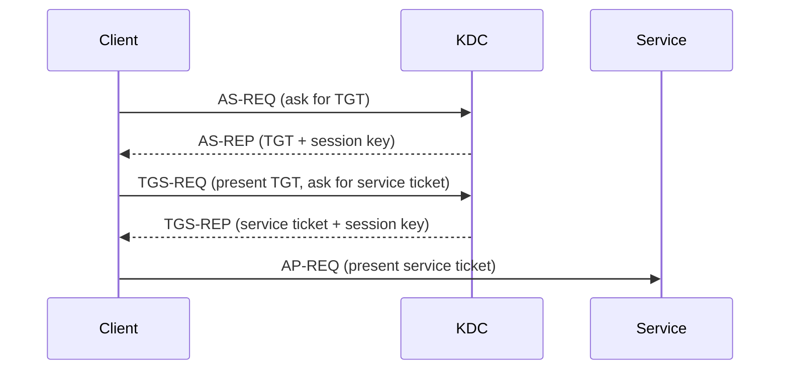
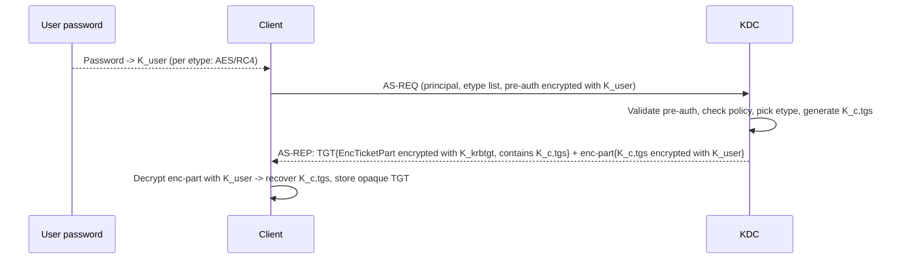
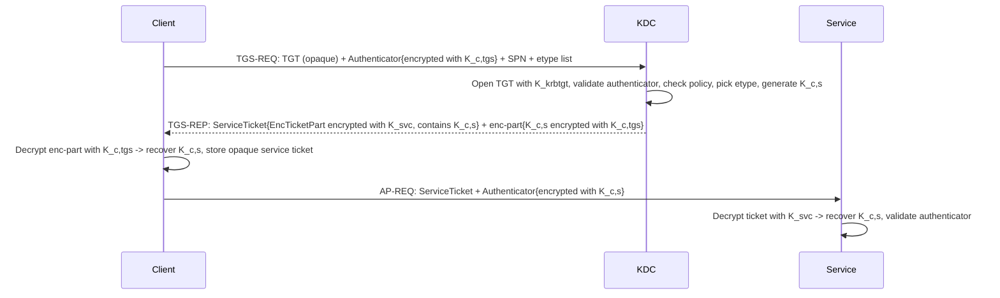
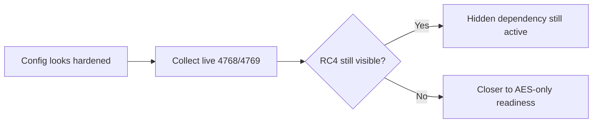
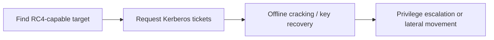

# RC4 Fundamentals, Obsolescence, and Risks of Continued Use

> **Article 1 of 3 — RC4 Hardening series.** Read in order:
>
> 1. **Fundamentals, obsolescence, and risks** *(this article)* — *why* RC4 is dangerous and what attackers actually do with it.
> 2. [Legacy Dependency Mapping and Technical Inventory](./2.%20Legacy%20Dependency%20Mapping%20and%20Technical%20Inventory.md) — *where* RC4 still lives in your estate.
> 3. [Remediation, AES Migration, Cutover, and RC4 Extinction](./3.%20Remediation%2C%20AES%20Migration%2C%20Cutover%2C%20and%20RC4%20Extinction.md) — *how* to remove it without breaking production.

Short version: if RC4 still shows up in your Kerberos flow, your AD is running legacy crypto in production.

This article is a technical baseline for engineers who want proof, not vibes:

- where RC4 still hides,
- why it is obsolete,
- what attackers gain when it stays,
- what breaks when you disable it too early.

Quick reality check: if someone claims *"we are AES-only"* but cannot back it up with recent `4769` event evidence, assume RC4 is still lurking somewhere. A clean declarative state (`msDS-SupportedEncryptionTypes` set to AES on every account) does **not** prove what the KDC actually emits on the wire — only the runtime tickets do.

## Scope and non-scope 🎯

This series is about **RC4 inside Kerberos** in Active Directory. A few adjacent topics that share the name "RC4" or look related are explicitly out of scope — clarifying them upfront avoids wasted effort:

| Topic | Same RC4? | Where it lives | Treated in this series? |
| --- | --- | --- | --- |
| **RC4-HMAC in Kerberos** (etype `0x17`) | Yes — the algorithm sealing AS-REP `enc-part` and service tickets | KDC, AD accounts, trusts (TDOs) | **Yes — this is the entire series** |
| **RC4 in TLS / Schannel** | Same algorithm, different protocol — RC4 cipher suites in HTTPS/LDAPS | Web servers, LDAPS endpoints, Schannel registry | No — separate hardening track |
| **NTLM / NT hash** | **No.** NT hash is `MD4(UTF-16LE(password))`. Common confusion with RC4-HMAC because RC4-HMAC reuses the NT hash as `K_user`, but the cipher itself is not used in NTLM authentication | NTLM authentication flows | No — disabling NTLM is the natural next hardening track once RC4 is gone |
| **DES Kerberos etypes** (`0x01`, `0x02`) | Different algorithm, **even worse** than RC4 (56-bit keys, broken since the 1990s) | Same place as RC4 in AD (bitmask, accounts, trusts) | If you find DES still enabled anywhere, treat it as **priority 0** — same procedure as RC4 but more urgent. The remediation playbook in article 3 applies identically |
| **AES-SHA2 Kerberos etypes** (RFC 8009: `aes128-cts-hmac-sha256-128`, `aes256-cts-hmac-sha384-192`) | Different — newer SHA-2-based KDF | Not implemented by Windows AD as of 2026 | Forward-looking only — Windows still uses the SHA-1-based AES etypes (`0x11`/`0x12`) |

If your question is about RC4 in TLS, NTLM hardening, or DES, the architectural ideas in this series transfer but the configuration surfaces differ. Stop here and use the appropriate dedicated reference instead.

## 1. RC4 and Kerberos in 60 seconds 🧭

No prior Kerberos knowledge needed. Just two simple ideas.

What is RC4 here:

- RC4 is an old encryption algorithm still allowed by Active Directory in some flows.
- In Kerberos, RC4 is the legacy alternative to AES.
- AES is the modern target. RC4 is the lane attackers prefer.

Kerberos in everyday language (airport analogy):

- Kerberos = the whole airport authentication system.
- The KDC (Key Distribution Center) = immigration / passport control (a domain controller).
- A TGT (Ticket Granting Ticket) = your passport, stamped by immigration: it does not board you on any plane, but it lets you ask for boarding passes at any gate.
- A service ticket = a boarding pass for one specific flight (one specific service, like SQL or a file share).
- A session key = a short-lived shared secret, like a single-use confirmation code. A new one is created at each step:
  - after the TGT step: shared between the client and the KDC (used for later requests to immigration).
  - after the service ticket step: shared between the client and the target service (used to prove identity at the gate).
- A long-term key = a stable identity badge linked to an account password (user, computer, service, or `krbtgt`).

Why RC4 matters in this story:

- Passports, boarding passes and confirmation codes can be "sealed" with AES or with RC4.
- If anything in the chain still seals with RC4, attackers get an easier door.
- Goal of this article: see clearly where RC4 still appears, and why it is dangerous if you leave it.

## 2. Two kinds of keys, and why attackers only care about one 🔑

Before the wire-level diagrams, one distinction unlocks the rest of the article. Kerberos uses two very different kinds of keys, and they don't have the same value to an attacker:

| Key type | Where it comes from | Lifetime | Value to an attacker |
| --- | --- | --- | --- |
| **Long-term key** | Derived from a password (user, computer, service account, `krbtgt`). The KDC stores it; the account owner can re-derive it from the password. | Months to years (until next password change). | **The prize.** Cracking it = full account compromise, usable until rotation. |
| **Session key** | Generated randomly by the KDC for each ticket exchange. Never derived from a password. | Minutes to hours (ticket lifetime). | Not worth cracking. Even if recovered, expires fast and is scoped to one specific exchange. |

> 🔑 **What "long-term key" actually means.** Active Directory never stores passwords in cleartext (with the rare and discouraged exception of *reversible encryption*). When a password is set on an account, AD runs it through one or more **Key Derivation Functions (KDFs)** and stores the resulting keys. Here is the full pipeline in one picture:
>
> ```
>                              ┌──────────────────────────────────────────────┐
>                              │                  Password                    │
>                              └───────────────────────┬──────────────────────┘
>                                                      │
>                            ┌─────────────────────────┴─────────────────────────┐
>                            │                                                   │
>             ALWAYS run ────┤                                    Run ONLY if    │
>             (no condition) │                                    DFL ≥ 2008 ────┤
>                            │                                    AND DC ≥ 2008  │
>                            ▼                                                   ▼
>          ┌──────────────────────────────┐               ┌─────────────────────────────────┐
>          │   MD4( UTF-16LE(password) )  │               │ PBKDF2(pwd + salt, 4096, SHA-1) │
>          │   no salt, no iteration      │               │ salt = <REALM><principalName>   │
>          └──────────────┬───────────────┘               └────────────────┬────────────────┘
>                         │ 128-bit key                                    │  → 128-bit (AES128)
>                         │                                                │  → 256-bit (AES256)
>                         ▼                                                ▼
>          ┌──────────────────────────────┐               ┌─────────────────────────────────┐
>          │ Stored behind  `unicodePwd`  │               │ Stored in `supplementalCredentials`
>          │ (write-only attribute,       │               │ → sub-blob `Primary:Kerberos-Newer-Keys`
>          │ in NTDS.dit)                 │               │
>          │                              │               │ Same access restrictions.
>          │ Readable only via DCSync     │               │ Readable only via DCSync /
>          │ / local DC tools.            │               │ local DC tools.
>          └──────────────┬───────────────┘               └────────────────┬────────────────┘
>                         │                                                │
>                         │ This single 128-bit value is reused as:        │
>                         │                                                │
>                         ├───► The "NT hash"  (NTLM, cached creds,        │
>                         │     pass-the-hash, NetNTLMv2, WDigest legacy)  │
>                         │                                                │
>                         └───► The "RC4-HMAC key" K, used as-is by        │
>                               Kerberos RC4-HMAC (RFC 4757) to seal       │
>                               tickets. NO additional derivation.         │
>                                                                          │
>                                                                          └───► Used by Kerberos
>                                                                                AES128-CTS-HMAC-SHA1-96
>                                                                                and AES256-CTS-HMAC-SHA1-96
>                                                                                to seal tickets. NOT used
>                                                                                by NTLM. Distinct from
>                                                                                the NT hash.
> ```
>
> > 🚩 **Three things to notice on this picture:**
> >
> > 1. **The NT hash is always there.** It is written every time a password is set, with zero conditions. There is no "disable NT hash" switch — the only way to lose it is to require a smart-card-only logon (`Smart card is required for interactive logon`), which forces a random password but still produces a hash. Disabling NTLM does **not** remove the hash on disk; it only blocks the NTLM negotiation at runtime.
> > 2. **The AES keys are conditional.** They exist only when the password was set or changed on `DFL ≥ 2008` with a DC running `≥ 2008`. An account whose password has not been touched since pre-2008 has *no* AES keys, even if `msDS-SupportedEncryptionTypes` is set to `0x18`. **Setting the attribute does not generate keys — only a password rotation does.** This is the *stale-key trap*, central to Article 2 and the trust annex.
> > 3. **The NT hash has two jobs.** That same 128-bit value is *both* the NTLM credential *and* the Kerberos RC4-HMAC key, with no transformation between the two roles. Cracking a ticket sealed with RC4-HMAC therefore recovers NTLM credentials *for free* — no further cracking step required. AES keys, by contrast, are completely separate from NTLM: a cracked AES key does not yield NT hash material.
>
> **Where and when does the KDF actually run?** Not on every Kerberos message. The KDF is a *deterministic* function (same password → same key), so it is run **only when a fresh password enters the system**, and the result is reused from then on. There are exactly three moments to know:
>
> ```
> ┌────────────────────────────────────────────────────────────────────────┐
> │  1. SET PASSWORD  — when an account's password is created or changed   │
> ├────────────────────────────────────────────────────────────────────────┤
> │  Where: on the DC that processes the change (typically the PDC         │
> │         emulator, or whichever DC handled the kpasswd / SAMR call).    │
> │  Action: receives the cleartext password → runs MD4 + PBKDF2 once →    │
> │          writes the resulting keys into NTDS.dit                       │
> │          (NT hash behind `unicodePwd`, AES keys in                     │
> │          `supplementalCredentials`/Primary:Kerberos-Newer-Keys).       │
> │  Frequency: once per password change.                                  │
> │  The cleartext password is then wiped from the DC's memory.            │
> │  The new keys replicate to other DCs as part of normal AD replication. │
> └────────────────────────────────────────────────────────────────────────┘
>
> ┌────────────────────────────────────────────────────────────────────────┐
> │  2. LOGON  — when a client needs to authenticate                       │
> ├────────────────────────────────────────────────────────────────────────┤
> │  Where: on the client machine (Winlogon, RDP, runas, service startup,  │
> │         scheduled task, gMSA fetch — anything that obtains a password  │
> │         and needs to talk to a KDC).                                   │
> │  Action: receives the cleartext password (typed by the user, or pulled │
> │          from the LSA Secrets store for service / machine accounts) →  │
> │          runs the same MD4 + PBKDF2 → places the keys in LSASS.        │
> │  Frequency: once per logon.                                            │
> │  Used to: seal the AS-REQ, decrypt the AS-REP, and stay cached in      │
> │           LSASS for every later TGS-REQ during the session.            │
> └────────────────────────────────────────────────────────────────────────┘
>
> ┌────────────────────────────────────────────────────────────────────────┐
> │  3. TICKET ISSUANCE  — when the KDC processes an AS-REQ or TGS-REQ     │
> ├────────────────────────────────────────────────────────────────────────┤
> │  Where: on whichever DC is acting as KDC.                              │
> │  Action: reads the already-stored keys directly from NTDS.dit and uses │
> │          them to seal the ticket and the session-key envelope.         │
> │  KDF re-run? ❌ NEVER. The KDC never sees the cleartext password.      │
> │             It only sees the keys produced at moment ①.                │
> └────────────────────────────────────────────────────────────────────────┘
> ```
>
> > 🧠 **The asymmetry that makes the picture click.** The KDC and the client both end up holding the same key, but they get there by completely different paths:
> >
> > - **The client** (moment ②) holds the password in cleartext for a few milliseconds and *re-derives* the key locally.
> > - **The KDC** (moment ③) never sees the password and *reads* the key from disk — that key was placed there at moment ① on whichever DC originally processed the password set.
> > - **Once the ticket flow starts** (TGT renewal, TGS-REQ, service ticket presentation), neither side runs the KDF anymore. Both reuse the keys they already have, plus the random *session keys* the KDC generated when issuing each ticket.
> >
> > That is the operational definition of a *shared-secret* protocol: a single value (the password) is the seed, two independent derivations land on the same key without ever exchanging it, and from then on everything runs on the cached result.
>
> Three operational consequences worth keeping in mind:
>
> - **The cleartext password only exists briefly, in two places: the DC that processed the change (moment ①) and the client at logon (moment ②).** It is wiped immediately after derivation. Only the *derived keys* remain — in `NTDS.dit` for the long term, in LSASS for the session. That is exactly why `mimikatz sekurlsa::logonpasswords` recovers NT hashes and Kerberos keys (those *do* persist in LSASS) but only recovers cleartext passwords in specific configurations such as WDigest enabled.
> - **The password never travels on the wire.** No Kerberos message contains the password, nor even the long-term keys themselves — only ciphertext encrypted with them.
> - **The keys live in LSASS for the whole session.** That is what enables fast service-to-service Kerberos (no re-prompt for a password every time you open a new SMB share), and at the same time what makes pass-the-hash and pass-the-ticket attacks work: an attacker with `SeDebugPrivilege` can read those cached keys and tickets out of LSASS and reuse them elsewhere.
>
> **And this is exactly why RC4 is dangerous.** AES doesn't change *what* is protected (the same password sits behind both branches). It changes *how slow* the brute-force pipeline is — one MD4 per candidate password for RC4, versus 4096 SHA-1 rounds plus a per-account salt for AES. The salt also defeats precomputed rainbow tables, which is a separate and equally important defense.

> 🎟️ **What "session key" actually means.** This is the *other* kind of key in Kerberos, and it works the exact opposite way of the long-term key. Same picture as before, in one shot:
>
> ```
>                              ┌──────────────────────────────────────┐
>                              │              The KDC                 │
>                              └──────────────────┬───────────────────┘
>                                                 │
>                                Random byte generator (CSPRNG)
>                                                 │
>                                                 ▼
>                              ┌──────────────────────────────────────┐
>                              │   A fresh random 128 / 256-bit value │
>                              │   Generated ONCE per ticket emitted  │
>                              │   Tied to: this client + this target │
>                              └──────────────────┬───────────────────┘
>                                                 │
>                  ┌──────────────────────────────┴────────────────────────────┐
>                  │                                                           │
>                  ▼                                                           ▼
>     ┌─────────────────────────────┐                       ┌────────────────────────────────┐
>     │  Sealed inside the TICKET   │                       │  Sealed inside the AS-REP /    │
>     │  itself, with the long-term │                       │  TGS-REP body, with the        │
>     │  key of the TARGET account  │                       │  REQUESTING client's long-term │
>     │  (K_krbtgt for TGT,         │                       │  key (or the previous session  │
>     │   K_svc  for service ticket)│                       │  key for TGS-REP)              │
>     │                             │                       │                                │
>     │  → only the target can      │                       │  → only the requesting client  │
>     │    open this side           │                       │    can open this side          │
>     └─────────────────────────────┘                       └────────────────────────────────┘
>
>     Result: client and target both end up holding the SAME random session key,
>     without it ever traveling in cleartext on the wire.
> ```
>
> **What the session key is actually used for.** Once both ends hold it, the session key has three concrete jobs in the rest of the exchange:
>
> 1. **Sign the *authenticator*** the client sends on the next message — a fresh timestamp encrypted with the session key. This proves *"I am the same client that received this ticket, right now"* and stops anyone who only stole the ticket blob from replaying it. The TGT's `K_c,tgs` signs the authenticator on `TGS-REQ`; the service ticket's `K_c,s` signs the authenticator on `AP-REQ`.
> 2. **Mutually authenticate the target.** Optionally, the target replies with its own message encrypted with the same session key — proving it could open the ticket, i.e. that it really holds the long-term key it claims to have. Without this, a client could be talking to an impostor that intercepted the ticket but cannot decrypt it.
> 3. **Protect application traffic afterwards.** Once `AP-REQ` succeeds, GSSAPI / SSPI use the session key (or sub-keys derived from it) to sign and/or encrypt every subsequent message of the application protocol — SMB signing/sealing, LDAP signing, RPC integrity/privacy, etc. This is how Kerberos protects an entire SMB or RPC session, not just the initial handshake.
>
> So the session key is the **operational key that does the per-exchange work**: every authenticator, every per-message signature, every confidentiality wrap. The long-term key only gets touched at the boundary (sealing the envelope, decrypting the AS-REP enc-part once at logon) — after that, all the live cryptography rides on session keys.
>
> Compared to the long-term key:
>
> | Property | Long-term key (K_krbtgt, K_svc) | Session key |
> | --- | --- | --- |
> | **Origin** | Derived from a password (`KDF(password)`) | Random, generated by the KDC |
> | **Where it lives** | NTDS.dit (DC) + LSASS (client) — *persistent* | LSASS only, on both ends — *ephemeral* |
> | **Lifetime** | Months to years (until next password change) | Minutes to hours (ticket lifetime, typically 10h max) |
> | **Predictable from anything else?** | Yes — anyone with the password gets it | No — pure random output, not tied to any reusable secret |
> | **Reusable?** | Across every ticket, every protocol that touches that account | One single Kerberos exchange (this client ↔ this target). New ticket = new session key |
> | **Value to an attacker** | Pass-the-hash, overpass-the-hash, full account compromise, persistent | Decrypts only that one captured exchange — no lateral pivot, no replay |
>
> **Why attackers don't bother attacking the session key.** Even with infinite GPU, brute-forcing a random 128-bit value is computationally infeasible — there is no password to guess, no dictionary to try. And even if it were recovered, it expires fast and unlocks exactly one already-finished exchange. That is why every Kerberos attack you have heard of (Kerberoasting, AS-REP roasting, overpass-the-hash, Golden / Silver Tickets) targets the **long-term** key. The session key is the protocol's *plumbing*; the long-term key is the *prize*.
>
> **One nuance to keep in mind for later.** When we talk about *"the encryption type of a ticket"*, we are really tracking **two** decisions made by the KDC:
>
> 1. The enctype used to **seal the ticket envelope** (long-term key of the target account → driven by the target's `msDS-SupportedEncryptionTypes` and what keys actually exist in `supplementalCredentials`).
> 2. The enctype used as the **session key** (a random value produced for that ticket, but with a chosen length / format).
>
> These two can disagree — and this is the heart of the November 2022 KDC change (KB5021131): the session key now defaults to AES even when the envelope is RC4, which closes the largest Kerberoasting blind spot in legacy estates. We will come back to this distinction in §3's deep dives, in the audit field map (§4 *4768/4769*), and again when discussing trust hardening.

## 3. Kerberos exchanges, end-to-end 🔁

### Notation used in the rest of this article

The Deep Dives below describe Kerberos as **sealed envelopes**: a ticket is an opaque blob that only the holder of the right long-term key can open. To keep the schemas readable we use a single notation throughout — `K_<owner>` always means *"the long-term or session key belonging to this party"*.

**A ticket, in one picture** — same mental model as the trust hardening annex:

```text
┌────────────────────────────────────────────────────────────────┐
│  Kerberos ticket  (envelope sealed with K_target)              │
│                                                                │
│  Ticket Encryption Type  ←  driven by the TARGET's long-term   │
│                             key (K_krbtgt for a TGT,           │
│                             K_svc for a service ticket)        │
│                                                                │
│   ┌────────────────────────────────────────────────────────┐   │
│   │  Session key  (K_c,tgs in a TGT, K_c,s in a svc tkt)   │   │
│   │  Plus: client identity (PAC, SIDs), validity, flags    │   │
│   │                                                        │   │
│   │  Session Key Type  ←  driven by what the CLIENT        │   │
│   │                       advertised + KDC policy          │   │
│   └────────────────────────────────────────────────────────┘   │
└────────────────────────────────────────────────────────────────┘
```

**What sits inside the envelope, besides the session key.** The inner box is the `EncTicketPart` (RFC 4120 §5.3). On top of the session key it carries everything the target needs to make an authorization decision without calling back to the KDC:

- **Client identity** — the principal name (e.g. `alice@CORP.CONTOSO.COM`) and, on Windows, the **PAC** (*Privilege Attribute Certificate*): a Microsoft extension blob containing the user's **SID**, group **SIDs**, and other authorization data. This is what makes a Kerberos ticket usable for AD authorization in one round-trip — no extra LDAP lookup needed at the service.
- **Validity window** — `authtime`, `starttime`, `endtime`, `renew-till`. Outside this window the ticket is rejected even if the signature checks out. This is why clock skew between client, KDC and service has to stay within ~5 minutes by default.
- **Flags** — single bits the KDC turned on at issuance: `forwardable`, `renewable`, `proxiable`, `pre-authent`, `ok-as-delegate`, etc. They control what the holder is allowed to do with the ticket downstream (delegation, renewal, S4U…).

All of that is sealed under the same envelope as the session key — so any tamper attempt invalidates the integrity check and the target rejects the ticket.

Two etypes, one ticket — and they can disagree (envelope can be RC4 while the session key inside is AES, or vice-versa). That is the whole `Ticket Encryption Type` vs `Session Encryption Type` distinction you will see on `4768` / `4769` events in §4 and in the trust annex.

> 🧠 **A *ticket* is one envelope, not two.** The ticket itself is a single sealed blob. What has *two* sealed parts is the **KDC response message** (`AS-REP` for the TGT step, `TGS-REP` for the service-ticket step) that delivers the ticket to the client. That response bundles the ticket (sealed for the target) **plus** an `enc-part` (sealed for the requester) that hands the client its own copy of the session key. You will see that two-part structure spelled out in Deep Dive 1 below — the schema above is the ticket on its own, which is what travels onward in TGS-REQ and AP-REQ.

**Key reference table** — every `K_x` you will see in the Deep Dives:

> **Reading the subscripts.** Two conventions are at play:
>
> - `K_<owner>` (single name) → a **long-term key** belonging to one principal: `K_user`, `K_krbtgt`, `K_svc`. Derived from that account's password by the KDF pipeline shown in §2 🔑. Stable. Stored on disk.
> - `K_<a>,<b>` (two names separated by a comma) → a **session key shared between two parties** `a` and `b`. The comma is the standard RFC 4120 notation for *"key shared between A and B"*, **not** an index. Random. Ephemeral. So `K_c,tgs` means *"the key shared between the **c**lient and the **tgs** role of the KDC"* (TGS = *Ticket-Granting Service*, the KDC's internal ticket-issuing role); `K_c,s` means *"the key shared between the **c**lient and the target **s**ervice"*. Talking to the TGS = talking to the KDC; the two terms are interchangeable here.

| Notation | What it is | Who holds it | Lifetime | Where it is used |
| --- | --- | --- | --- | --- |
| **`K_user`** | Long-term key derived from the user's password (one per etype: AES256, AES128, RC4) | Client (in memory after logon) + KDC (read from NTDS.dit) | Until password change | Seals AS-REQ pre-auth and AS-REP enc-part |
| **`K_krbtgt`** | Long-term key of the KDC's internal `krbtgt` account | KDCs in the domain | Until krbtgt password rotation | Seals every TGT envelope in the domain |
| **`K_svc`** | Long-term key of a service account (one per etype) | KDC (NTDS.dit) + the service host (keytab / LSASS) | Until service password change | Seals every service ticket targeting that SPN |
| **`K_c,tgs`** | Short-lived session key between client and KDC (TGS role) — lives **inside the TGT** | Client + KDC (via the TGT) | TGT lifetime (~10h default) | Seals TGS-REQ authenticator and TGS-REP enc-part |
| **`K_c,s`** | Short-lived session key between client and target service — lives **inside the service ticket** | Client + service (via the service ticket) | Service ticket lifetime (~10h default) | Seals AP-REQ authenticator and any subsequent app-level Kerberos integrity/confidentiality |

**Reading rule** — when you see a notation in the schemas:

- `K_user`, `K_krbtgt`, `K_svc` → **long-term keys**, password-derived, persistent on disk → **the attacker's actual target** (offline cracking, Kerberoasting, AS-REP roasting).
- `K_c,tgs`, `K_c,s` → **session keys**, random, ephemeral, never written to disk on the KDC → not worth attacking directly (see §2's 🎟️ encart).
- `{X}_K` → "X sealed with key K". Example: `{TGT}_K_krbtgt` means *"the TGT envelope, sealed with K_krbtgt"*.

### 3.1 Kerberos flow refresher (TGT, TGS, and what is actually encrypted)

If the previous airport analogy is clear, this section will feel natural.



High-level rule before going deep:

- TGT flow (AS) gets you a ticket to talk to the KDC later.
- TGS flow gets you a ticket for the target service.
- Ticket blob encryption and session-key-related encryption are different things, and can show mixed AES/RC4 behavior.

Detailed breakdown is in the next sections, with per-step "encrypted with", "who decrypts", and where session keys are duplicated.

### 3.2 Deep Dive 1: TGT Flow (AS Exchange)

Plain-English version first:

- You arrive at immigration (the KDC).
- You prove you are you by showing something only you know (your password, indirectly).
- Immigration stamps your passport (TGT) and gives you a one-day confirmation code (session key) so you can come back to any **airline desk** later and ask for boarding passes. (The "gate" comes later in Deep Dive 2 — that's where you actually board, i.e. talk to the service.)

TGT objective:

- Client authenticates to the KDC and obtains a TGT.
- Ticket internals are encrypted for `krbtgt`, not for the client.

Notation (read once, then you are good):

- `K_user`: a key derived from the user password (a different one per encryption type, like AES or RC4).
- `K_krbtgt`: the special key of the KDC's internal `krbtgt` account.
- `K_c,tgs`: the short-lived session key between client and KDC.
- Etype ("encryption type"): which algorithm is used (AES256, AES128, RC4).

The whole TGT flow in one diagram:



The whole TGT flow in one table:

| Step | Who | Action | Input / Key used | Output | Why it matters for RC4 |
| --- | --- | --- | --- | --- | --- |
| 1 | Client | Derive long-term key from password per supported etype | Password + etype (AES256/AES128/RC4) | `K_user` (one per etype) | Same password feeds AES key and RC4 key in parallel |
| 2 | Client | Send AS-REQ with identity and supported etype list | Principal name, etype list | AS-REQ on the wire | If RC4 is still in the list, downgrade remains possible |
| 3 | Client | Add pre-auth (typically encrypted timestamp) | Encrypted with `K_user` of chosen etype | Pre-auth blob in AS-REQ | This is the actual proof of password knowledge |
| 4 | KDC | Validate pre-auth and policy | KDC reads account key for matching etype | Decision: accept or reject | KDC picks the etype it will use for AS-REP |
| 5 | KDC | Generate fresh session key | RNG | `K_c,tgs` | Temporary, scoped to TGT context |
| 6 | KDC | Build TGT internals (`EncTicketPart`) | Client identity, flags, lifetime, `K_c,tgs` encrypted with `K_krbtgt` | Opaque TGT blob | Ticket blob etype follows `krbtgt` keys/policy |
| 7 | KDC | Build AS-REP `enc-part` for client | `K_c,tgs`, client nonce (anti-replay) and timing data encrypted with `K_user` | Client-readable encrypted part | Etype here can differ from ticket blob etype |
| 8 | Client | Decrypt AS-REP `enc-part` | `K_user` (right etype) | Recovers `K_c,tgs` | Without correct key/etype, login fails |
| 9 | Client | Cache outputs | Stores TGT (opaque) + `K_c,tgs` | Ready for TGS-REQ | Client never sees TGT internals |

Concrete example to make it real:

- Identity: `alice@corp.contoso.com` from `WKSTN-07`.
- Alice types her password. Workstation derives `K_user_AES256` and `K_user_RC4`.
- Client sends AS-REQ proposing AES256, AES128, RC4.
- Pre-auth is encrypted with `K_user_AES256` (best mutual etype).
- KDC validates pre-auth, generates `K_c,tgs = 9f...`.
- KDC builds TGT: `EncTicketPart` (containing `alice`, flags, `K_c,tgs`) encrypted with `K_krbtgt`.
- KDC builds AS-REP `enc-part`: `K_c,tgs` encrypted with `K_user_AES256`.
- Workstation decrypts `enc-part` -> stores TGT (opaque) and `K_c,tgs`.

How to read this for RC4/AES:

- TGT blob etype is driven by `krbtgt` key material and policy.
- AS-REP `enc-part` etype is driven by negotiated client/account etype.
- They can differ, so a single "AES" signal does not prove an AES-only path.
- If RC4 keys remain valid on the account, RC4 path can still be selected silently.

### 3.3 Deep Dive 2: TGS Flow (Service Ticket Exchange)

Plain-English version first:

- You go back to the airline desk, show your stamped passport (TGT), and ask for a boarding pass to a specific flight (a service like SQL).
- The desk prints a boarding pass that only that flight's gate can read, and gives you a new confirmation code (session key) for that flight.
- You walk to the gate, hand over the boarding pass and use the new code to prove you are the right passenger.

TGS objective:

- Client requests a ticket for a specific target service (SPN).
- Ticket internals are encrypted for the target service, not for the client.

Notation:

- `K_c,tgs`: session key between client and KDC (you already have it from the TGT step).
- `K_svc`: long-term key of the target service account (derived from its password).
- `K_c,s`: short-lived session key between client and target service.
- SPN: a name for the service you want to talk to (for example `MSSQLSvc/sql01...`).

The whole TGS flow in one diagram:



The whole TGS flow in one table:

| Step | Who | Action | Input / Key used | Output | Why it matters for RC4 |
| --- | --- | --- | --- | --- | --- |
| 1 | Client | Build TGS-REQ for target SPN | TGT (opaque) + supported etypes + SPN | TGS-REQ on the wire | Etype list still allowing RC4 keeps legacy path open |
| 2 | Client | Add authenticator proving live possession of `K_c,tgs` | Timestamp encrypted with `K_c,tgs` | Authenticator blob | Prevents replay of a stolen TGT alone |
| 3 | KDC | Open TGT internals | `K_krbtgt` | Recovers client identity, flags, `K_c,tgs` | Verifies the TGT is genuine |
| 4 | KDC | Validate authenticator, policy, service account state | `K_c,tgs` for authenticator | Decision: accept or reject | KDC picks the etype for the service ticket based on `K_svc` capabilities |
| 5 | KDC | Generate fresh session key | RNG | `K_c,s` | Temporary, scoped to client/service |
| 6 | KDC | Build service ticket internals (`EncTicketPart`) | Client identity, authz/PAC, `K_c,s` encrypted with `K_svc` | Opaque service ticket blob | Ticket blob etype follows service account keys/policy (the main RC4 hotspot) |
| 7 | KDC | Build TGS-REP `enc-part` for client | `K_c,s` and ticket metadata encrypted with `K_c,tgs` | Client-readable encrypted part | Etype here follows `K_c,tgs`, may differ from ticket blob etype |
| 8 | Client | Decrypt TGS-REP `enc-part` | `K_c,tgs` | Recovers `K_c,s` | Required to authenticate to the service |
| 9 | Client | Send AP-REQ to service | Service ticket + authenticator encrypted with `K_c,s` | AP-REQ on the wire | Service ticket blob still flows with its own etype |
| 10 | Service | Decrypt service ticket | `K_svc` | Recovers `K_c,s` and PAC | If `K_svc` is RC4-capable and selected, this is RC4-on-the-wire |
| 11 | Service | Validate authenticator | `K_c,s` | Client authenticated | Closes the mutual proof |

Concrete example to make it real:

- `alice@corp.contoso.com` requests `MSSQLSvc/sql01.corp.contoso.com:1433`.
- Workstation sends TGS-REQ: TGT + authenticator (encrypted with `K_c,tgs`) + SPN + etype list (AES256, AES128, RC4).
- KDC opens TGT with `K_krbtgt`, validates authenticator, looks up `svc_sql01` account etype capabilities.
- KDC generates `K_c,s = a7...`.
- Service ticket: `EncTicketPart` with `alice` identity, PAC, and `K_c,s`, encrypted with `K_svc` (etype selected based on service account support).
- TGS-REP `enc-part`: `K_c,s` and metadata encrypted with `K_c,tgs`.
- Workstation decrypts `enc-part`, stores opaque service ticket + `K_c,s`.
- AP-REQ: service ticket + authenticator encrypted with `K_c,s` sent to `sql01`.
- `sql01` decrypts ticket with `K_svc`, recovers `K_c,s`, validates authenticator.

How to read this for RC4/AES:

- Service ticket etype is driven by `K_svc` keys and account configuration (this is where Kerberoasting risk concentrates).
- TGS-REP `enc-part` etype is driven by `K_c,tgs` context.
- They can differ, so 4769 service ticket encryption type is the decisive runtime signal.
- A service account with stale keys or `0x1C` capability can keep RC4 alive on the wire even when client and policy look modern.

### 3.4 Session Key Recap (After TGT and TGS)

Where the session key appears:

| Location | Encrypted for | Why it exists |
| --- | --- | --- |
| Inside ticket blob (`EncTicketPart`) | Ticket recipient (`krbtgt` for TGT, service key for service ticket) | So the recipient can recover session key when ticket is presented |
| Inside reply encrypted part (`AS-REP` or `TGS-REP` `enc-part`) | Client | So the client also learns the same session key |

So yes, the session key is inside the ticket blob, but not only there.

The one rule to remember:

- Ticket blob etype follows the recipient's long-term key (`krbtgt` for TGT, service key for service ticket).
- Reply `enc-part` etype follows the client/session context.
- They can disagree. That is why an "AES-looking" indicator alone is not proof of an AES-only path.
- For service exposure, trust the 4769 service ticket encryption type first.

#### Important nuance: what RC4 actually exposes ⚠️

A common misread: "the session key is RC4, so it can be cracked". Not really.

What attackers crack offline is **the long-term key that seals the envelope**, not the session key inside it. The session key is only recovered as a side effect once the envelope is broken.

But not every envelope is realistically attackable. The TGT and TGS flows together produce four envelopes, with very different exposure:

| Flow | Envelope | Sealed with | Realistic offline attack |
| --- | --- | --- | --- |
| TGT | Ticket blob (`EncTicketPart`) | `K_krbtgt` | No — `K_krbtgt` is random and very long. |
| TGT | AS-REP `enc-part` (carries `K_c,tgs`) | `K_user` | **AS-REP roasting**, but only if pre-auth is disabled on the account. |
| TGS | Service ticket blob (`EncTicketPart`) | `K_svc` | **Kerberoasting**, available to any authenticated user requesting a TGS for an SPN. |
| TGS | TGS-REP `enc-part` (carries `K_c,s`) | `K_c,tgs` (session key, short-lived) | No — not a stable long-term key. |

Practical reading:

- On the **TGT flow**, RC4 exposure is bounded: only accounts with pre-auth disabled are realistically attackable.
- On the **TGS flow**, exposure is broad and continuous: any standard domain user can request a service ticket for any SPN and crack it offline. RC4 makes this dramatically cheaper than AES, which is why Kerberoasting is the dominant real-world risk wherever RC4 service tickets are still issued.

Direct consequence on the session key itself:

- Both RC4 and AES envelopes can be Kerberoasted. Hashcat supports the three modes accordingly: `13100` (RC4 TGS-REP), `19600` (AES128 TGS-REP), `19700` (AES256 TGS-REP). The difference is **throughput**, not feasibility: cracking RC4 envelopes is orders of magnitude faster than AES, which is why weak service passwords fall almost instantly with RC4 and only the weakest ones fall with AES.
- The decisive factor for exploitability is **service password complexity**, not the algorithm. RC4 lowers the bar dramatically but does not create the vulnerability. AES raises the bar but does not eliminate it — which is why MITRE ATT&CK mitigation `M1041` recommends AES *and* `M1027` recommends 25+ character passwords for service accounts.
- A session key etype, taken alone, does not indicate exploitability. Only the envelope etype combined with the long-term key strength does.

That is why **`Ticket Encryption Type`** is the priority signal on 4769, not `Session Key Encryption Type`. The envelope etype reflects the long-term key actually under attack.

##### Why RC4 cracks so much faster than AES (the real reason)

This isn't about RC4 being a "broken cipher" in the academic sense. The famous RC4 biases (RC4 NOMORE, FMS, etc.) need millions of ciphertexts encrypted with the same key and **do not apply to a single Kerberos ticket**. The real throughput gap is in how the long-term key is derived from the password:

| Algorithm | Long-term key derivation from password | Salt | Cost per password guess on a GPU |
| --- | --- | --- | --- |
| RC4-HMAC | `K = MD4(UTF-16LE(password))` | None | 1 MD4 hash — tens of billions/sec |
| AES128 / AES256 | `K = PBKDF2-HMAC-SHA1(password, salt, 4096 iterations)` | Yes (realm + principal) | ~4096 HMAC-SHA1 rounds — hundreds of thousands/sec |

Real-world consequence on a modern GPU rig:

- A weak service password (10-12 chars, dictionary-derived) falls in **seconds** against RC4, **hours to days** against AES.
- A strong, random 25+ character password is computationally infeasible against either — which is exactly why MITRE M1027 (long service passwords) exists as the backstop to M1041 (prefer AES over RC4).
- The absence of salt on RC4 also enables precomputed rainbow tables and shared-effort cracking across accounts using the same password. AES's per-principal salt kills that shortcut.

That is why RC4 disablement is a hardening step, not a silver bullet. It removes the cheap lane; password quality removes the lane entirely.

## 4. Where RC4 still appears in practice 👀

§3 explained *how* Kerberos works and *where* RC4 sits inside the cryptography. This section switches to the operational view: **where does RC4 actually show up at runtime, and how do you find it in your audit data?**

RC4 usually survives by accident, not by design.

Common locations include:

- Service ticket issuance where target identities still have RC4-usable or stale key material.
- Account bitmasks that still contain RC4 in msDS-SupportedEncryptionTypes.
- Trust referrals where TDO settings and trust password history still allow RC4.
- Legacy clients or third-party Kerberos stacks with weak enctype negotiation.

Concrete example:

- Service account `svc_sql_legacy` is set to `0x1C` and password has not been rotated in years.
- DC is patched, GPO looks modern, dashboard is green.
- 4769 still emits RC4 tickets for MSSQLSvc SPNs.
- Result: "hardened" config, legacy crypto on the wire.

Fast reality check:

- Config can look clean.
- 4768 and 4769 can still show RC4 on the wire.



That config-vs-runtime gap is where most RC4 projects fail late.

Quick triage query idea:

- Start with 4769.
- Group by target service and ticket encryption type.
- Prioritize high-volume RC4 target services first.

### 4768 and 4769 field map (what to read first)

Field availability and meaning vary by OS build and patch level. Two important inflection points:

- **Before the January 2025 cumulative update (Server 2016+)**, the `Ticket Encryption Type` field on `4768` actually reflected the **session key** etype, not the TGT envelope etype. This is counter-intuitive but documented by Microsoft (see external references). It also means `4768` was — and still is — the right tool to identify **RC4-only client devices**, because the session key etype is negotiated from what the client advertised in AS-REQ.
- **From the January 2025 cumulative update onward**, `4768`/`4769` have richer fields: `Ticket Encryption Type` now reports the actual ticket envelope etype, a separate `Session Encryption Type` reports the session key etype, and new fields expose `MSDS-SupportedEncryptionTypes`, `Available Keys`, `Advertized Etypes`, and `Pre-Authentication EncryptionType`. Article 2 leverages these for inventory.

| Priority | Event | Field | Why it matters for RC4 |
| --- | --- | --- | --- |
| 1 | 4769 | Ticket Encryption Type | Primary runtime proof of RC4 on service tickets. |
| 2 | 4769 | Service Name / Target account | Tells you which SPN/service identity still emits RC4. |
| 3 | 4768 | Ticket Encryption Type (pre Jan 2025) / Session Encryption Type (post Jan 2025) | Reveals the **client's** RC4 capability. With DFL ≥ 2008 and a `krbtgt` that has AES keys, the actual TGT envelope is almost always AES regardless — so this field is really telling you about the requesting device. |
| 4 | 4768/4769 | Client Advertised / Advertized Etypes | What the client offered during negotiation. Decisive for client-side RC4 dependency hunting. |
| 5 | 4768/4769 | Service or Account Supported Encryption Types (`MSDS-SupportedEncryptionTypes` post Jan 2025) | Whether RC4 remains enabled in account capability flags. |
| 6 | 4768/4769 | Available Keys (post Jan 2025) | Direct evidence of stale-key trap: AES-SHA1 absent ⇒ password predates AES support, regardless of advertised capability. |

Fast interpretation rules:

- 4769 + RC4 + high-value SPN: treat as priority remediation target.
- 4768 looks clean but 4769 still shows RC4: issue is usually service-side capability or key history, not only client policy.
- 4768 shows RC4 in `Ticket Encryption Type` (pre Jan 2025) or `Session Encryption Type` (post Jan 2025) for a given client repeatedly: that **client device** is RC4-only on AS-REQ. Hunt the device, not the account.
- Client advertises AES-only but RC4 still appears on TGS: investigate service/trust configuration and key lifecycle.
- Supported types say AES-capable, runtime still RC4: treat static configuration as insufficient evidence.

### Why offline cracking is the whole problem

Now that you have seen tickets emitted (§3) and the places where RC4 still leaks onto the wire (§4), here is why a single RC4 ticket showing up in your logs is enough to matter.

Online password guessing against AD is slow and loud: account lockout, network round-trips, logs on every DC. Offline cracking against a captured ticket has none of that. Once the encrypted blob is on the attacker's disk, they can try billions of candidate passwords per second on their own GPUs, with no contact back to your AD until they want to *use* the recovered credential.

That is why a single RC4 service ticket leaving the wire is enough: the actual attack happens entirely off your network, and you cannot rate-limit it, lock it out, or even see it.

Keep this picture in mind for the rest of the article:

- **Long-term key** = password-derived = stable target = attacker goal.
- **Session key** = random = ephemeral = collateral, not the goal.
- **Encryption algorithm** = lever on cracking speed, not on cracking feasibility.

## 5. Why RC4 is obsolete in AD security posture 🧨

Plain-English version:

- RC4 is a 1990s stream cipher.
- Modern crypto standards have moved on.
- Keeping RC4 enabled in 2026 is like keeping a copy of your house key under the doormat "just in case".

Technical reasons in one block:

- RC4-HMAC lacks the security properties expected from current enterprise cryptographic baselines.
- RC4 keeps downgrade paths alive in mixed environments.
- RC4 tickets increase exposure to offline cracking and Kerberos abuse paths.
- Microsoft hardening direction is clearly AES-first, then AES-only.

Operational truth:

- Environments that stay in RC4-compatible mode often accumulate hidden dependencies.
- The longer RC4 remains enabled, the harder controlled removal becomes.

Engineering interpretation:

- RC4 debt compounds like technical debt with interest.
- Every month you wait, migration scope usually gets bigger, not smaller.

## 6. Security risks of keeping RC4 enabled 🔓

Plain-English version:

- Even if everything else is modern, one RC4 lane is enough for attackers to focus on.
- Most real-world attack chains in AD start at the weakest crypto path available.

Main risks:

- Easier abuse of weak Kerberos paths around service identities and SPNs.
- Better conditions for Kerberoasting-style tradecraft against legacy targets.
- Trust-layer weakness when referral tickets remain on RC4.
- False confidence from static checks that ignore runtime ticket evidence.

Practical takeaway:

If RC4 is available anywhere, that is where offensive effort will go first.

### Kerberoasting walkthrough: what an attacker actually does 🔍

Theory only sinks in once you see the moves. Imagine a penetration tester (or attacker) who already has any low-privilege domain account — a help desk user, an intern, a stolen contractor account. No special rights, just "a domain user". Here is what comes next.

**Step 1 — List the targets (no alarm raised).**

With any valid AD user, they query the directory for accounts that have an SPN attached. Service accounts running SQL, IIS, custom apps, scheduled tasks — they all have one.

```powershell
Get-ADUser -Filter { ServicePrincipalName -like "*" } -Properties ServicePrincipalName
```

Output: a list of service accounts and their SPNs. This is a single read-only LDAP query that any authenticated user is allowed to do. No detection signal here.

**Step 2 — Request service tickets (also looks legitimate).**

For each interesting SPN, they ask the KDC for a service ticket, exactly like a real client would when connecting to SQL:

```powershell
Add-Type -AssemblyName System.IdentityModel
New-Object System.IdentityModel.Tokens.KerberosRequestorSecurityToken `
  -ArgumentList "MSSQLSvc/sql01.corp.contoso.com:1433"
```

The KDC returns a TGS-REP. Inside it: the service ticket sealed with `K_svc` (the service account's long-term key, derived from its password). On the DC, this generates a single `4769` event — visually identical to a legitimate SQL connection attempt.

**Step 3 — Extract the encrypted blob.**

Tools like Rubeus (Windows) or Impacket's `GetUserSPNs.py` (Linux) dump the encrypted `EncTicketPart` out of the ticket into a hashcat-compatible file. Still zero malicious traffic toward AD.

**Step 4 — Crack offline.**

The blob now lives on the attacker's laptop. They run:

```bash
hashcat -m 13100 ticket.hash wordlist.txt   # RC4 service ticket
hashcat -m 19600 ticket.hash wordlist.txt   # AES128 service ticket
hashcat -m 19700 ticket.hash wordlist.txt   # AES256 service ticket
```

If the ticket was RC4 and the service password is weak, the cleartext password comes out in seconds. Your AD sees absolutely nothing.

**Step 5 — Use the recovered password.**

The attacker now logs in as the service account. Depending on what that account can do — often local admin on a database server, sometimes way more on legacy installs — they pivot, escalate, or stage further attacks.

What this whole walkthrough proves:

- Steps 1 and 2 are **indistinguishable from normal activity**. They cannot be "detected" in isolation; only volume + correlation helps.
- Steps 3 and 4 happen **entirely off your network**. No firewall, no SIEM rule, no account lockout can stop them.
- The only real defense is making step 4 too expensive. **RC4 makes step 4 cheap. AES makes it costly. A long random password makes it infeasible.**

That is the entire reason this article exists.

### AS-REP roasting walkthrough: the legacy variant 🪤

Kerberoasting attacks the **TGS flow**. AS-REP roasting attacks the **TGT flow**, but only against accounts where Kerberos pre-authentication has been disabled (`UF_DONT_REQUIRE_PREAUTH` in `userAccountControl`, bit `0x400000`). Pre-auth is enabled by default, so AS-REP roasting is rarer than Kerberoasting — but every estate has a few legacy accounts where it was switched off years ago "to make some old client work" and never reverted. Each of those is a free, silent offline-cracking target.

**Step 1 — Find vulnerable accounts** (any authenticated user can do this with a single LDAP query):

```powershell
Get-ADUser -Filter { DoesNotRequirePreAuth -eq $true } `
           -Properties DoesNotRequirePreAuth, msDS-SupportedEncryptionTypes, PasswordLastSet
```

No special privilege needed. No log signal worth alerting on (it is a routine LDAP read).

**Step 2 — Request an AS-REP without pre-auth.** Because the flag says it's allowed, the KDC issues an AS-REP without the usual encrypted-timestamp pre-auth proof — and the `enc-part` containing `K_c,tgs` comes back sealed with `K_user` (the password-derived long-term key). Same target as Kerberoasting, different envelope.

```powershell
# Rubeus syntax
Rubeus.exe asreproast /user:legacy_account /format:hashcat /outfile:asrep.hash
```

On the DC, this generates a single `4768` event. Visually identical to a legitimate logon attempt by that legacy account.

**Step 3 — Crack offline.** The AS-REP `enc-part` is now on the attacker's laptop, exactly like a Kerberoasting blob:

```bash
hashcat -m 18200 asrep.hash wordlist.txt   # AS-REP roasting (RC4-HMAC)
```

Mode `18200` is RC4 AS-REP roasting. AES variants exist (`19800`/`19900`) but throughput collapses for the same MD4-vs-PBKDF2 reason explained earlier.

**The structural defenses** (no exotic tooling required):

- **Re-enable pre-authentication** on every account where it was disabled. That single flip eliminates AS-REP roasting for that account regardless of whether RC4 is still capable. This is almost always the right answer — the original reason for disabling pre-auth has usually been obsolete for years.
- **PKINIT / smartcard logon** — accounts that authenticate via certificate don't derive `K_user` from a password; the AS exchange uses a Diffie-Hellman key authenticated by the cert. AS-REP roasting becomes structurally impossible on those accounts, regardless of RC4. See article 3 for the conceptual fit alongside other compensating controls.
- **FAST / Kerberos armoring** — wraps the AS exchange in an encrypted tunnel so the AS-REP `enc-part` is never directly observable on the wire. See article 3.

Quick-win audit query to run during the inventory phase (article 2):

```powershell
# Every DONT_REQ_PREAUTH account in the domain, with its etype capability and password age
Get-ADUser -Filter { DoesNotRequirePreAuth -eq $true } `
           -Properties DoesNotRequirePreAuth, msDS-SupportedEncryptionTypes, PasswordLastSet |
  Select-Object Name, msDS-SupportedEncryptionTypes, PasswordLastSet |
  Sort-Object PasswordLastSet
```

Most rows in that output are free wins: re-enable pre-auth, move on. The few that genuinely cannot have pre-auth re-enabled belong on the exception list with the same discipline as any other RC4 exception (article 3 §6).

## 7. RC4 attack paths you actually see in AD 🎯

RC4 rarely appears alone. It usually appears inside a larger attack chain.

| Attack path | What attacker does | Why RC4 helps | Typical detection clue |
| --- | --- | --- | --- |
| Kerberoasting on weak service identities | Requests TGS for SPN accounts, then cracks offline | RC4 service ticket material is generally easier to crack than modern AES targets | High volume of 4769 tied to SPN accounts and RC4 ticket types |
| Trust ticket abuse across domains/forests | Targets trust referrals and trust account material | RC4 referral tickets increase exposure if trust keys are stale or weakly managed | 4769 patterns where `Service Name = krbtgt/<target-realm>` with RC4 ticket encryption type |
| Encryption downgrade behavior | Forces or exploits RC4-capable negotiation paths | If RC4 is still allowed (`0x1C`, legacy clients, mixed settings), downgrade remains possible | Drift in encryption settings plus unexpected RC4 reappearance after hardening |
| Credential theft + lateral movement acceleration | Uses cracked service credentials to pivot | RC4-compatible legacy islands are often the easiest pivot points in mature AD | Same identities repeatedly involved in RC4 tickets + lateral auth spikes |



Bottom line: RC4 does not create every attack, but it lowers attacker cost on several high-impact paths.

If your red team keeps finding a fast path, check where RC4 still exists before buying new tooling.

## 8. Operational risks of unplanned RC4 disablement ⚙️

Turning off RC4 too early is a classic "security change broke prod" event.

Typical failure patterns:

- Legacy applications fail to obtain service tickets after policy tightening.
- Cross-domain or cross-forest authentication breaks when trust prerequisites are incomplete.
- Service accounts with stale keys fail when AES enforcement is applied.
- Sudden increase in Kerberos errors and fallback behavior under production load.

### A typical RC4 disablement outage, hour by hour

Let's make it concrete. A real-world failure scenario that plays out the same way in many AD estates:

- **09:00** — Change window opens. Ops applies a GPO setting `Network security: Configure encryption types allowed for Kerberos` to AES-only on all DCs. Interactive logons keep working. Dashboards green. Team is confident.
- **10:42** — First helpdesk ticket: *"Our Java-based ETL job to SQL01 is failing with `KRB_AP_ERR_BAD_INTEGRITY`."* The app uses MIT Kerberos via a `krb5.conf` file that explicitly pinned `default_tkt_enctypes = rc4-hmac` five years ago. Nobody remembered.
- **11:20** — Second app down: a third-party appliance authenticating to AD via Heimdal Kerberos, also locked to RC4 in its config.
- **11:55** — Cross-forest authentication from a partner domain starts failing. The trust was switched to AES in the GPO, but the trust password hasn't been rotated since 2019 — so no AES trust key was ever derived. The trust object advertises AES but has no usable AES key material.
- **12:30** — Ops rolls back the GPO. Auth comes back. Post-mortem says "AES enforcement caused outage". Project is parked for six months.

What actually happened in one line: **the static configuration was changed without first proving via 4768/4769 logs that no live flow still depended on RC4.**

That is the failure mode the rest of this article is designed to prevent.

RC4 retirement is never a single toggle. It is an evidence-driven sequence.

## 9. What "ready for RC4 removal" means technically ✅

Readiness is measurable. No assumptions.

Minimum evidence set:

- Directory posture reviewed (msDS-SupportedEncryptionTypes on relevant principals).
- KDC default posture reviewed (DefaultDomainSupportedEncTypes where applicable).
- Trust posture reviewed (TDO enctype policy plus trust password recency).
- Live Kerberos telemetry reviewed (4768 and 4769 trends over a representative window).
- Residual RC4 cases classified into remediable now vs controlled temporary exception.

### How to read those `0x04` / `0x18` / `0x1C` values

Before using these numbers, you need to know how they encode information. They are **bitmasks**: each bit position is an on/off flag for one specific encryption algorithm. Once you see them in binary, the meaning is obvious.

| Bit value | Binary | Algorithm |
| --- | --- | --- |
| `0x01` | `00000001` | DES-CBC-CRC (long-dead) |
| `0x02` | `00000010` | DES-CBC-MD5 (long-dead) |
| `0x04` | `00000100` | RC4-HMAC |
| `0x08` | `00001000` | AES128-CTS-HMAC-SHA1-96 |
| `0x10` | `00010000` | AES256-CTS-HMAC-SHA1-96 |

A real value combines all enabled flags with a bitwise OR (which, because the bits don't overlap, is just an addition):

- `0x04` = `00000100` = **RC4 only**. Worst case for a service account.
- `0x18` = `0x08 | 0x10` = `00011000` = **AES128 + AES256, no RC4**. The modern target state.
- `0x1C` = `0x04 | 0x08 | 0x10` = `00011100` = **AES + RC4 still allowed**. Looks AES-capable but RC4 is still on the table.

When you read AD attributes, the value often appears in decimal:

- `msDS-SupportedEncryptionTypes = 4` → hex `0x04` → RC4 only.
- `msDS-SupportedEncryptionTypes = 24` → hex `0x18` → AES128 + AES256.
- `msDS-SupportedEncryptionTypes = 28` → hex `0x1C` → AES + RC4.
- `msDS-SupportedEncryptionTypes = 0` (or attribute missing) → default policy applies (often still includes RC4).

Now the markers below should read naturally.

Useful technical markers:

- 0x04 means RC4-only: direct remediation target.
- 0x1C means AES plus RC4: still downgrade-capable.
- 0x18 is usually the AES target state for accounts that should be RC4-free.
- 4769 with RC4 patterns after "hardening" means your migration is not done yet.

Mini decoding examples:

- `0x1C` on a service account = "AES-capable" but still RC4-allowed.
- `0x18` without secret rotation can still fail expectation: AD only derives AES keys at password set time, so an account whose password predates AES support will advertise `0x18` but have no usable AES key material until the next password change.
- Trust set to AES policy but old trust password can keep referral behavior in a bad state.

| Marker | Meaning | Engineering signal |
| --- | --- | --- |
| `0x04` | RC4 only | Immediate remediation target |
| `0x1C` | AES + RC4 | Still downgrade-capable |
| `0x18` | AES128 + AES256 | Typical RC4-free account target |
| `4769 + RC4` | RC4 ticket still issued | Runtime proof that work remains |

> ⚠️ **`0x18` lives in two namespaces, do not confuse them.**
>
> - In `msDS-SupportedEncryptionTypes` (the AD attribute), `0x18` = `0x08 | 0x10` = AES128 + AES256. This is the target capability state.
> - In the `Ticket Encryption Type` field of a `4768`/`4769` event, `0x18` is **not** AES — it is `RC4-HMAC-EXP` (the export-grade variant of RC4-HMAC). AES values in that field are `0x11` (AES128) and `0x12` (AES256).
>
> Same hex value, completely different meaning depending on where you read it. Tooling that treats them interchangeably will produce wrong inventory results.

Scope note:

- This article stays on fundamentals, risks, and readiness signals.
- Detailed rollout topics (Microsoft phased-rollout CVEs and Kdcsvc events, registry rollout controls, and exception handling for non-Windows keytabs) belong to article 3 and the dedicated annexes.

If these checks are incomplete, treat RC4 disablement as high risk.

| Symptom | Likely cause | First technical action |
| --- | --- | --- |
| 4769 still shows RC4 for same SPNs | Service identities still RC4-allowed or stale keys | Review account enctype + rotate secret + re-test |
| AES policy set but behavior unchanged | Config applied, runtime evidence missing | Validate 4768/4769 over representative period |
| Cross-forest auth breaks after tightening | Trust prerequisites incomplete | Audit TDO settings and trust key lifecycle |

## 10. Recommended next technical steps

Once this baseline is established, the next engineering actions should be:

- Build a dependency inventory from directory data and live Kerberos events.
- Classify residual RC4 usage into immediate remediation vs temporary exceptions.
- Define and validate an AES migration sequence before enforcement changes.
- Confirm each change with runtime ticket evidence, not only static configuration.

Suggested execution order:

1. Fix high-volume RC4 SPN targets first.
2. Fix trust-related RC4 paths second.
3. Re-measure ticket telemetry.
4. Enforce harder settings only after runtime evidence is stable.

## Related technical references already in this repository

- [Audit and Enforcement of Kerberos Encryption Type](../Audit%20and%20Enforcement%20of%20Kerberos%20Encryption%20Type/Audit%20and%20Enforcement%20of%20Kerberos%20Encryption%20Type.md)
- [Weak supported encryption algorithms on DCs](../Weak%20supported%20encryption%20algorithms%20on%20DCs.md)
- [Hardening Kerberos Encryption on AD Trusts](../Hardening%20Kerberos%20Encryption%20on%20AD%20Trusts/Hardening%20Kerberos%20Encryption%20on%20AD%20Trusts.md)
- [RC4 HMAC Report (Defender for Identity)](../../../020%20-%20Microsoft%20Defender/Defender%20for%20Identity/Reporting/RC4%20HMAC%20Report.md)

## Glossary (quick reference) 📖

| Term | One-line meaning |
| --- | --- |
| **KDC** | Key Distribution Center. The Kerberos brain inside every Active Directory domain controller. Issues tickets. |
| **TGT** | Ticket Granting Ticket. Your stamped "passport" from the KDC, used to ask for service tickets later. |
| **Service ticket (TGS)** | Boarding pass for one specific service. Issued by the KDC when you present a valid TGT and an SPN. |
| **SPN** | Service Principal Name. The unique name of a service in AD (e.g. `MSSQLSvc/sql01.corp.contoso.com:1433`). |
| **`krbtgt`** | Special hidden AD account whose long-term key seals every TGT in the domain. Its compromise = Golden Ticket = full domain takeover. |
| **Long-term key** | A key derived from an account password (user, computer, service, `krbtgt`). Lives as long as the password. The thing attackers want to crack. |
| **Session key** | A random, short-lived key generated by the KDC for one ticket exchange. Useless after the ticket expires. Not the attacker's goal. |
| **etype / Encryption Type** | Which algorithm a key/ticket uses: RC4-HMAC, AES128, AES256, etc. Each algorithm = one bit in `msDS-SupportedEncryptionTypes`. |
| **`msDS-SupportedEncryptionTypes`** | AD attribute on user/computer/trust objects listing allowed etypes as a bitmask (e.g. `0x18`, `0x1C`). |
| **PAC** | Privilege Attribute Certificate. Authorization data (SIDs, group memberships) embedded in service tickets by the KDC. |
| **AS-REQ / AS-REP** | First exchange: client asks KDC for a TGT (request / reply). Generates event `4768` on the DC. |
| **TGS-REQ / TGS-REP** | Second exchange: client presents TGT, asks for a service ticket. Generates event `4769`. |
| **AP-REQ** | Final exchange: client presents the service ticket to the actual service. No DC log; visible only on the service host. |
| **Kerberoasting** | Attack where any domain user requests TGS-REPs for SPN-bound accounts, extracts the ticket blob, and brute-forces the service password offline. |
| **AS-REP roasting** | Variant targeting accounts where Kerberos pre-authentication is disabled — the AS-REP `enc-part` can be cracked the same way. |
| **Pre-authentication** | Encrypted timestamp the client adds to AS-REQ to prove password knowledge before the KDC issues anything. Enabled by default. |
| **`4768` / `4769`** | Windows DC security events: AS exchange (TGT issuance) and TGS exchange (service ticket issuance). Primary RC4 evidence source. |
| **`0x04` / `0x18` / `0x1C`** | Common bitmask values: RC4-only / AES-only / AES+RC4. See §9 for full decoding. |
| **Bitwise OR / bitmask** | Combining multiple flags into one integer by setting their bits. `0x08 | 0x10 = 0x18`. Reading it = looking at which bits are on. |
