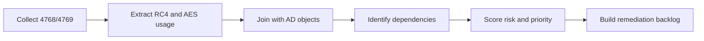

# Legacy Dependency Mapping and Technical Inventory

Goal: build an actionable RC4 dependency inventory that can drive remediation without breaking production.

## 0. What this article actually delivers 📋

The previous article explained *why* RC4 is dangerous and *where* it tends to hide. This one explains *how to find every single place it still hides in your environment*, so you can disable it without breaking production.

Think of it like a building inspection before demolition. You don't take a wrecking ball to a wall until you know which ones are load-bearing. Same thing here: you don't push an AES-only policy until you have a ranked, owner-assigned list of every account, device, and trust that would break.

**The deliverable at the end of this process is a single spreadsheet** (or backlog item, or wiki page — same content, different container) that looks like this:

| Dependency | Type | RC4 evidence | Blast radius | Fix cost | Score | Owner | Action |
| --- | --- | --- | --- | --- | --- | --- | --- |
| `svc_sql_legacy` | Service account | 4 769 RC4 tickets / 7 days | High (prod DB) | Low (password rotation + retest) | 9 | DB Team | Rotate secret, re-validate, then drop RC4 |
| `printsrv-bio-01$` | Computer account | 812 RC4 tickets / 7 days | Medium (biomed printer pool) | High (vendor firmware) | 6 | Infra Team | Temporary exception until vendor patch, EOL plan |
| `Trust: corp.contoso → partner.legacy` | TDO | RC4 referrals daily | High (partner B2B) | Medium (coordinate password rotation across forests) | 8 | Identity Team | Rotate trust password, set TDO to AES, validate |

That table is the entire point. Every section below is a step to fill it in.

## 1. Scope and Collection Rules

Before running scripts everywhere, lock the rules.

Minimum scope:

- All domain controllers in scope.
- SPN-bearing identities (service accounts).
- Critical machine accounts and service accounts.
- Trust relationships (TDO) for multi-domain or multi-forest environments.
- Non-Windows systems using Kerberos (if present).

Baseline rules:

- Use a representative observation window (not 15 minutes during low traffic).
- Correlate AD configuration with runtime telemetry.
- Do not change policy before dependencies are qualified.

### Why the observation window matters

Kerberos traffic is not uniform. A 15-minute capture during a quiet afternoon will miss the legacy ETL job that runs nightly, the SCCM client that authenticates only at boot, the monthly billing batch on `svc_billing_eom`, and the partner B2B trust that's only used during business hours in another timezone.

Rule of thumb for the observation window:

- **Minimum 7 calendar days** so every daily/nightly batch is captured at least once.
- **Cover one full business cycle**: ideally include a Patch Tuesday, a weekend, and a month-end if your environment has billing/reporting cycles.
- **Capture from every DC**, not a sample. RC4 routinely hides on one specific DC because of how clients pin to KDCs.
- **Don't collect during a freeze window** — traffic shape is artificially distorted and you'll miss real dependencies.

If you must move fast, a 7-day window across all DCs is the floor. Two weeks is the realistic minimum for a confident inventory.

## 2. Technical Data Sources to Correlate

Never trust a single source.

| Source | What it provides | Limitation |
| --- | --- | --- |
| Event 4768 | TGT and initial negotiation visibility | Limited value alone for service prioritization |
| Event 4769 | TGS visibility, therefore real service impact | High volume, requires filtering |
| `msDS-SupportedEncryptionTypes` | Account-level config intent | Can mislead without secret rotation context |
| Available keys (events/scripts) | Effective cryptographic capability | Depends on collection quality |
| Trust objects (TDO) | Cross-domain/cross-forest surface | Frequently missed in audits |

### How to collect each source (paste-ready)

**Source 1 — RC4 service tickets (event 4769) via KQL** (Sentinel / Defender / Log Analytics):

```kql
SecurityEvent
| where EventID == 4769
| where TicketEncryptionType == "0x17"   // 0x17 = 23 = RC4-HMAC
| summarize Count = count(),
            FirstSeen = min(TimeGenerated),
            LastSeen  = max(TimeGenerated)
  by ServiceName, TargetUserName, IpAddress
| order by Count desc
```

Reference etype values you'll see in the wild: `0x1` DES-CRC, `0x3` DES-MD5, `0x11` AES128, `0x12` AES256, `0x17` RC4-HMAC, `0x18` RC4-HMAC-EXP (very rare). For RC4 hunting, filter on `0x17`.

**Source 2 — Account-level RC4 capability via PowerShell** (AD module on any DC or RSAT host):

```powershell
# Every account that still permits RC4 (bit 0x04 is set)
Get-ADObject -LDAPFilter "(msDS-SupportedEncryptionTypes:1.2.840.113556.1.4.804:=4)" `
             -Properties msDS-SupportedEncryptionTypes, servicePrincipalName, whenChanged |
  Select-Object Name, ObjectClass, msDS-SupportedEncryptionTypes, servicePrincipalName, whenChanged |
  Export-Csv .\rc4-capable-accounts.csv -NoTypeInformation
```

The odd `1.2.840.113556.1.4.804` is the LDAP **bitwise-OR** matching rule — it returns objects where the `0x04` bit (RC4) is on, regardless of other bits. Same trick works for `=24` (AES-only) or `=28` (AES+RC4).

**Source 3 — Trust posture via `nltest` / PowerShell**:

```powershell
# List all trusts and their supported encryption types
Get-ADTrust -Filter * -Properties msDS-SupportedEncryptionTypes, TrustType, Direction, whenChanged |
  Select-Object Name, TrustType, Direction, msDS-SupportedEncryptionTypes, whenChanged

# Confirm trust password age (stale password = no usable AES key)
nltest /domain_trusts /v
```

If a TDO shows `msDS-SupportedEncryptionTypes = 0` or missing, the default policy applies — which on most domains still allows RC4.

**Source 4 — KRBTGT and computer accounts with stale keys**:

```powershell
# krbtgt password age (drives K_krbtgt freshness)
Get-ADUser krbtgt -Properties PasswordLastSet, msDS-SupportedEncryptionTypes |
  Select-Object Name, PasswordLastSet, msDS-SupportedEncryptionTypes

# Computer accounts that haven't rotated their machine password in > 60 days
Get-ADComputer -Filter * -Properties PasswordLastSet, msDS-SupportedEncryptionTypes |
  Where-Object { $_.PasswordLastSet -lt (Get-Date).AddDays(-60) } |
  Select-Object Name, PasswordLastSet, msDS-SupportedEncryptionTypes
```

Reminder from article 1: an account can advertise `0x18` (AES) but have no AES key material if the password predates AES support and was never rotated.

## 3. Recommended Inventory Pipeline



Practical sequence:

1. Collect 4769 over a representative window.
2. Isolate RC4 tickets and aggregate by target service (SPN/account).
3. Join with AD attributes (`msDS-SupportedEncryptionTypes`, account type, service criticality).
4. Verify whether AES keys are actually present for these identities.
5. Produce a prioritized dependency list with proposed actions.

### Worked example: from raw events to backlog

Make it concrete. Assume a mid-size domain: 4 DCs, 500 servers, 12 service accounts known to ops, 3 cross-forest trusts. You run the collection over 14 days.

**After step 1-2 (KQL aggregated by SPN, RC4 only)**:

| ServiceName | RC4 ticket count (14 d) | Distinct clients |
| --- | --- | --- |
| `MSSQLSvc/sql01.corp.contoso.com:1433` | 12 847 | 38 |
| `HTTP/intranet.corp.contoso.com` | 4 210 | 412 |
| `krbtgt/PARTNER.LEGACY` | 893 | 6 |
| `host/printsrv-bio-01.corp.contoso.com` | 812 | 23 |
| `cifs/fileserver-old.corp.contoso.com` | 142 | 9 |

**After step 3 (joined with AD)**:

| ServiceName | Account | `msDS-SupportedEncryptionTypes` | PasswordLastSet |
| --- | --- | --- | --- |
| `MSSQLSvc/sql01…` | `svc_sql_legacy` | `28` (`0x1C`, AES+RC4) | 2021-03-04 |
| `HTTP/intranet…` | `svc_iis_intranet` | `24` (`0x18`, AES-only) | 2026-04-12 |
| `krbtgt/PARTNER.LEGACY` | Trust (TDO) | `0` (default = RC4 allowed) | 2019-11-22 |
| `host/printsrv-bio-01` | `printsrv-bio-01$` | `4` (`0x04`, RC4-only) | 2023-08-15 |
| `cifs/fileserver-old` | `fileserver-old$` | `28` (`0x1C`) | 2025-09-30 |

Already useful: `svc_iis_intranet` advertises AES-only but **still emits RC4 tickets** — that's a client-side or KDC negotiation issue, not an account capability issue. Worth investigating before touching anything else.

**After step 4-5 (qualified backlog)**: the table from §0 is now the natural output. Each row has evidence (KQL count), AD state (PowerShell join), and a proposed action tied to an owner.

## 4. Dependency Qualification Matrix

An unqualified dependency is a rollback risk.

| Criterion | Example values | Priority impact |
| --- | --- | --- |
| Service criticality | Critical, Important, Standard | Critical goes first |
| RC4 exposure | Frequent, Occasional, Rare | Frequent goes first |
| Remediation feasibility | Fast, Medium, Complex | Fast = quick win |
| Dependency type | SPN service, Trust, Legacy device | Trust and critical SPN prioritized |

Simple scoring model:

- Criticality: Critical=3, Important=2, Standard=1
- Exposure: Frequent=3, Occasional=2, Rare=1
- Feasibility: Fast=3, Medium=2, Complex=1
- Total score = sum (max 9)

Interpretation:

- 8-9: remediate immediately
- 6-7: remediate in next wave
- 3-5: schedule after quick wins

### Worked scoring example

Apply the model to the five dependencies surfaced in §3:

| Dependency | Criticality | Exposure | Feasibility | **Score** | Wave |
| --- | --- | --- | --- | --- | --- |
| `svc_sql_legacy` (prod DB) | Critical = 3 | Frequent = 3 | Fast = 3 (password rotation + retest) | **9** | Immediate |
| `krbtgt/PARTNER.LEGACY` (trust) | Critical = 3 | Frequent = 3 | Medium = 2 (cross-forest coord) | **8** | Immediate |
| `printsrv-bio-01$` (biomed printers) | Important = 2 | Frequent = 3 | Complex = 1 (vendor firmware) | **6** | Next wave + exception meanwhile |
| `svc_iis_intranet` (RC4 leak despite `0x18`) | Important = 2 | Occasional = 2 | Medium = 2 (investigate client negotiation) | **6** | Next wave |
| `fileserver-old$` (legacy SMB share) | Standard = 1 | Rare = 1 | Medium = 2 | **4** | After quick wins / decommission candidate |

What to read from this table:

- The two 8-9 scores justify dedicated change windows and pre-stakeholder communication.
- `printsrv-bio-01$` is the typical "temporary exception" candidate: high exposure but you cannot fix it this quarter — document the exception with an expiry date and a vendor track.
- `fileserver-old$` at score 4 is often the cue to ask the harder question: should this service still exist?

## 5. Concrete RC4 Dependency Examples

Example A - Legacy service account:

- Signal: recurring RC4 in 4769 for `MSSQLSvc/app01`.
- AD state: `msDS-SupportedEncryptionTypes=0x1C`.
- Runtime state: AES keys missing or stale.
- Inventory action: tag as "quick win after secret rotation and app validation".

Example B - Third-party device:

- Signal: RC4-only requests from a non-Windows device IP.
- Observation: no AES negotiation from client side.
- Inventory action: tag as "temporary exception" with vendor remediation track.

Example C - Trust path:

- Signal: persistent RC4 patterns in cross-domain traffic.
- Observation: trust hardening not complete.
- Inventory action: tag as "trust wave" with cross-domain validation prerequisites.

### Detection snippets for each pattern

**Pattern A — RC4 service ticket recurrence per SPN** (catches example A):

```kql
SecurityEvent
| where EventID == 4769 and TicketEncryptionType == "0x17"
| summarize Count = count() by ServiceName, bin(TimeGenerated, 1d)
| where Count > 10                          // adjust to your baseline
| order by ServiceName, TimeGenerated
```

**Pattern B — RC4-only client** (catches example B — the third-party device):

```kql
SecurityEvent
| where EventID == 4769
| summarize
    RC4Tickets   = countif(TicketEncryptionType == "0x17"),
    AESTickets   = countif(TicketEncryptionType in ("0x11", "0x12")),
    TotalTickets = count()
  by IpAddress
| where RC4Tickets > 0 and AESTickets == 0  // never negotiated AES
| order by TotalTickets desc
```

An IP that **only ever produces RC4 tickets** is almost always a non-Windows / appliance / legacy client. That's your vendor-track row.

**Pattern C — RC4 on cross-domain referrals** (catches example C — trust):

```kql
SecurityEvent
| where EventID == 4769 and TicketEncryptionType == "0x17"
| where ServiceName startswith "krbtgt/"
| extend TargetRealm = tostring(split(ServiceName, "/")[1])
| where TargetRealm != toupper("corp.contoso.com")  // your own realm
| summarize Count = count() by TargetRealm, bin(TimeGenerated, 1d)
```

A `Service Name` of `krbtgt/<OTHER-REALM>` with RC4 is the smoking gun for a trust still using legacy crypto.

## 6. Expected Inventory Outputs

Minimum deliverables:

- A "dependency -> evidence -> criticality -> action" matrix.
- A quick-win list (high impact, low effort).
- A complex-case list with identified technical owner.
- A dated and justified temporary exception list.

Recommended backlog format:

| Dependency | Evidence | Risk | Action | Owner | Due date |
| --- | --- | --- | --- | --- | --- |
| `svc_sql_legacy` | Frequent RC4 in 4769 | High | Rotate secret + re-test | DB Team | W+1 |
| `device-biomed-01` | RC4-only advertisement | High | Temporary exception + vendor plan | Infra Team | W+2 |

## 7. Inventory Definition of Done

Inventory is "ready" only if:

- Top RC4 dependencies are identified and ranked.
- Each dependency has linked technical evidence.
- Each item has an owner and target action.
- Exceptions are explicit, bounded, and tracked.

Without these four conditions, remediation will start with hidden risk.

## Related Technical References Already in This Repository

- [Weak supported encryption algorithms on DCs](../Weak%20supported%20encryption%20algorithms%20on%20DCs.md)
- [Audit and Enforcement of Kerberos Encryption Type](../Audit%20and%20Enforcement%20of%20Kerberos%20Encryption%20Type/Audit%20and%20Enforcement%20of%20Kerberos%20Encryption%20Type.md)
- [Hardening Kerberos Encryption on AD Trusts](../Hardening%20Kerberos%20Encryption%20on%20AD%20Trusts/Hardening%20Kerberos%20Encryption%20on%20AD%20Trusts.md)
- [RC4 HMAC Report (Defender for Identity)](../../../020%20-%20Microsoft%20Defender/Defender%20for%20Identity/Reporting/RC4%20HMAC%20Report.md)
- [Companion article — RC4 Fundamentals, Obsolescence, and Risks of Continued Use](./1.%20RC4%20Fundamentals%2C%20Obsolescence%2C%20and%20Risks%20of%20Continued%20Use.md)

## Glossary (inventory-specific terms) 📖

| Term | One-line meaning |
| --- | --- |
| **Observation window** | The time range over which you collect 4768/4769 evidence. Minimum 7 days, ideally 14, covering at least one full business cycle. |
| **TDO (Trusted Domain Object)** | AD object representing a trust to another domain or forest. Has its own `msDS-SupportedEncryptionTypes` and its own password (rotated on demand, not automatically). |
| **etype `0x17`** | Decimal 23. The Kerberos encryption type code for RC4-HMAC. Primary filter value when hunting RC4 in events and KQL. |
| **etype `0x11` / `0x12`** | Decimal 17 / 18. AES128-CTS-HMAC-SHA1-96 and AES256-CTS-HMAC-SHA1-96. The modern target etypes. |
| **LDAP bitwise-OR rule (`1.2.840.113556.1.4.804`)** | LDAP matching rule OID that returns objects whose attribute has a specific bit set. Used to filter `msDS-SupportedEncryptionTypes` by capability. |
| **Quick win** | High-impact, low-cost remediation — typically a password rotation on a service account already advertising AES capability. Usually the top of the backlog. |
| **Temporary exception** | Documented, time-bounded acceptance that one dependency will keep using RC4 (typically a vendor appliance with no AES support). Must have an owner and an expiry date. |
| **Stale key** | Account that advertises an etype (e.g. AES) but has no usable key material for it, because the password was set before that algorithm was supported and never rotated. |
| **Blast radius** | What breaks if this single dependency fails after AES enforcement. Drives the criticality score in §4. |
