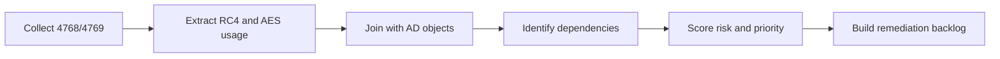
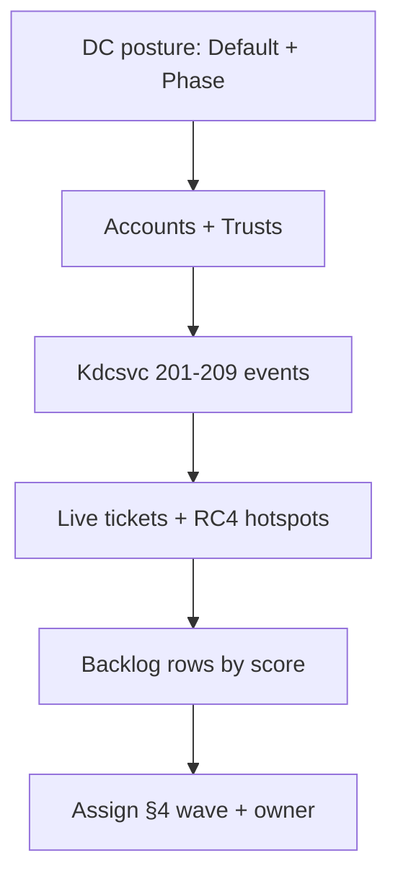

# Legacy Dependency Mapping and Technical Inventory

> **Article 2 of 3 — RC4 Hardening series.** Read in order:
>
> 1. [RC4 Fundamentals, Obsolescence, and Risks of Continued Use](./1.%20RC4%20Fundamentals%2C%20Obsolescence%2C%20and%20Risks%20of%20Continued%20Use.md) — *why* RC4 is dangerous and what attackers actually do with it.
> 2. **Legacy dependency mapping and technical inventory** *(this article)* — *where* RC4 still lives in your estate.
> 3. [Remediation, AES Migration, Cutover, and RC4 Extinction](./3.%20Remediation%2C%20AES%20Migration%2C%20Cutover%2C%20and%20RC4%20Extinction.md) — *how* to remove it without breaking production.
>
> This article combines a **conceptual blueprint** for the inventory phase — sources to correlate, qualification model, scoring, expected deliverables — with a **read-only PowerShell companion tool** (see §6 below) that automates most of the collection. KQL / SIEM saved searches for telemetry stored outside Windows event logs (Sentinel, Splunk, etc.) live in a dedicated *RC4 telemetry & inventory reporting* annex.

Goal: build an actionable RC4 dependency inventory that can drive remediation without breaking production.

## 0. What this article actually delivers 📋

The previous article explained *why* RC4 is dangerous and *where* it tends to hide. This one explains *how to find every single place it still hides in your environment*, so you can disable it without breaking production.

Think of it like a building inspection before demolition. You don't take a wrecking ball to a wall until you know which ones are load-bearing. Same thing here: you don't push an AES-only policy until you have a ranked, owner-assigned list of every account, device, and trust that would break.

**The deliverable at the end of this process is a single spreadsheet** (or backlog item, or wiki page — same content, different container) that looks like this:

| Dependency | Type | RC4 evidence | Blast radius | Fix cost | Score | Owner | Action |
| --- | --- | --- | --- | --- | --- | --- | --- |
| `svc_sql_legacy` | Service account | 4 769 RC4 tickets / 7 days | High (prod DB) | Low (password rotation + retest) | 9 | DB Team | Rotate secret, re-validate, then drop RC4 |
| `printsrv-bio-01$` | Computer account | 812 RC4 tickets / 7 days | Medium (biomed printer pool) | High (vendor firmware) | 6 | Infra Team | Temporary exception until vendor patch, EOL plan |
| `Trust: corp.contoso → partner.legacy` | TDO | RC4 referrals daily | High (partner B2B) | Medium (coordinate password rotation across forests) | 8 | Identity Team | Rotate trust password, set TDO to AES, validate |

That table is the entire point. Every section below is a step to fill it in.

## 1. Scope and Collection Rules

Before running scripts everywhere, lock the rules.

Minimum scope:

- All domain controllers in scope.
- SPN-bearing identities (service accounts).
- Critical machine accounts and service accounts.
- Trust relationships (TDO) for multi-domain or multi-forest environments.
- Non-Windows systems using Kerberos (if present).

Baseline rules:

- Use a representative observation window (not 15 minutes during low traffic).
- Correlate AD configuration with runtime telemetry.
- Do not change policy before dependencies are qualified.

### Why the observation window matters

Kerberos traffic is not uniform. A 15-minute capture during a quiet afternoon will miss the legacy ETL job that runs nightly, the SCCM client that authenticates only at boot, the monthly billing batch on `svc_billing_eom`, and the partner B2B trust that's only used during business hours in another timezone.

Rule of thumb for the observation window:

- **Minimum 7 calendar days** so every daily/nightly batch is captured at least once.
- **Cover one full business cycle**: ideally include a Patch Tuesday, a weekend, and a month-end if your environment has billing/reporting cycles.
- **Capture from every DC**, not a sample. RC4 routinely hides on one specific DC because of how clients pin to KDCs.
- **Don't collect during a freeze window** — traffic shape is artificially distorted and you'll miss real dependencies.

If you must move fast, a 7-day window across all DCs is the floor. Two weeks is the realistic minimum for a confident inventory.

## 2. Technical Data Sources to Correlate

Never trust a single source.

| Source | What it provides | Limitation |
| --- | --- | --- |
| **Kdcsvc System log (events 201-209)** | Direct KDC-side flagging of RC4 negotiations, with the offending account already extracted | Available only on DCs patched with KB5073381 (Jan 2026); silent until `RC4DefaultDisablementPhase ≥ 1`; registry valve removed in July 2026 |
| Event 4768 | TGT and initial negotiation visibility, AS-REQ etype context | Requires SACL on the DC; high volume; pre-Jan-2025 the `Ticket Encryption Type` field actually means session key |
| Event 4769 | TGS visibility, therefore real service impact | High volume, requires filtering and aggregation |
| `msDS-SupportedEncryptionTypes` | Account-level config intent (capability bitmask) | Can mislead without secret rotation context — see stale-key trap below |
| Available keys (events/scripts) | Effective cryptographic capability | Depends on collection quality; before Jan 2025 must be derived indirectly from `pwdLastSet` |
| Trust objects (TDO) | Cross-domain/cross-forest surface | Frequently missed in audits; default behaviour changed with KB5021131 (Nov 2022) |

### What each source actually tells you

For each source above, the key is to know *what question it answers* and *what it cannot tell you on its own*. The collection scripts (KQL, PowerShell, `nltest`) live in the dedicated **RC4 telemetry & inventory reporting** annex — this article focuses on what the data means once it lands in the inventory spreadsheet.

**Source 0 — Kdcsvc System log events (KB5073381 / Jan 2026).** If your DCs have the January 2026 cumulative update applied and `RC4DefaultDisablementPhase` is set to `1` or higher, **start here**. The KDC itself logs each RC4 negotiation it sees, with the offending account name pre-extracted, into the System log under provider `Microsoft-Windows-Kerberos-Key-Distribution-Center` as event IDs 201-209. This is the cheapest possible inventory signal: no SACL to configure, no etype filtering on millions of 4769 records, no LDAP correlation needed for the first cut. The full decoder lives in [Article 1 §6](./1.%20RC4%20Fundamentals%2C%20Obsolescence%2C%20and%20Risks%20of%20Continued%20Use.md). Quick mapping for inventory purposes: **201/206** identify a *client* that is RC4-only (Pattern B in §5 below), **202/207** identify a *service / target account* that has no AES key — the stale-key trap (Pattern D), **205** flags a DC with an explicit insecure `DefaultDomainSupportedEncTypes` (hygiene only, fix on the DC, no inventory row), and **203/204/208/209** are the same conditions once Phase 2 enforcement is on (errors instead of warnings). Two caveats: (1) Kdcsvc is silent on a DC where the registry is `0` — until you set `1`, this source produces nothing; (2) on a fully unpatched estate it does not exist at all, in which case 4768/4769 remain your only feeds.


**Source 1 — RC4 service tickets (event 4769).** The single most important runtime signal once you've drained Kdcsvc. Filter on `TicketEncryptionType == 0x17` (decimal 23 = RC4-HMAC). Aggregating by `ServiceName` and counting over the observation window directly produces the prioritization order: highest-volume RC4 service tickets are the highest-impact remediation targets. Reference etype values you'll see in the wild: `0x01` DES-CRC, `0x03` DES-MD5, `0x11` AES128, `0x12` AES256, `0x17` RC4-HMAC. DES etypes (`0x01`, `0x03`) are out of scope for this RC4 inventory but are themselves a priority-0 finding if observed — they should not exist on any modern domain. ⚠️ Reminder from Article 1 §6: in the *event* `Ticket Encryption Type` field, `0x18` is **RC4-HMAC-EXP**, not AES — do not confuse it with the same hex value used on the `msDS-SupportedEncryptionTypes` attribute, where `0x18` means AES128 + AES256.

**Source 2 — Account-level RC4 capability (`msDS-SupportedEncryptionTypes`).** Tells you which accounts *advertise* RC4. Use the LDAP bitwise-OR matching rule (OID `1.2.840.113556.1.4.804`) to filter on the `0x04` bit. Two important caveats: (1) **an absent or zero value means RC4** — Microsoft documents that the KDC encrypts service tickets with RC4 by default when no value is set on the target account, so accounts with no value must be counted as RC4 producers until proven otherwise; (2) capability ≠ actual key material — see source 4.

**Source 3 — Trust posture (TDOs).** `Get-ADTrust` exposes `msDS-SupportedEncryptionTypes` and trust direction. Cross-check with the trust password age (the `pwdLastSet` attribute on the TDO, or `nltest /domain_trusts /v` for human-readable output). One important nuance: since the November 2022 update (KB5021131 / CVE-2022-37966), Microsoft DCs default referral tickets to AES regardless of the TDO `msDS-SupportedEncryptionTypes` value, **provided the trust password contains AES keys**. So on a fully patched estate, a trust set to `0x18` but with an old password is the more dangerous case than a trust set to `0x00`: it advertises AES but emits RC4 anyway because of the stale-key trap. Article 3 §3.3 covers the rotation discipline.

**Source 4 — Stale keys (the silent failure mode).** An account can advertise AES capability and still emit RC4 because its password predates AES support and was never rotated. The signals to correlate: `PasswordLastSet` per account, `whenChanged` on TDOs, and `PasswordLastSet` on `krbtgt`. Anything older than the AES cutoff with `0x18` capability is a stale-key candidate. 🔍 **Microsoft pro tip for the cutoff date**: AES support became available in your domain when the first DC at functional level 2008 was promoted, which is exactly the moment the built-in domain group `Read-only Domain Controllers` was created. Comparing each account's `PasswordLastSet` to `(Get-ADGroup 'Read-only Domain Controllers').whenCreated` gives you the stale-key candidate list without arbitrary date heuristics. The remediation — password rotation — lives in Article 3.

### Method: using event 4768 to find RC4-only client devices

4768 is often dismissed as "the AS event, less interesting than 4769". That is half wrong. There is one specific question that **only 4768 can answer**: *which client devices are RC4-only on AS-REQ?*

Mechanism: when a Windows or non-Windows Kerberos client sends an AS-REQ to obtain a TGT, the KDC selects a session key etype based on what the **client** advertised. On modern domains, the TGT envelope itself is almost always AES (DFL ≥ 2008 + `krbtgt` with AES keys), but the session key etype reflects the client's capability set. Up to and including the January 2025 cumulative update behavior change, the `Ticket Encryption Type` field on 4768 reported the **session key** etype, not the envelope etype. From the January 2025 cumulative update onward, a separate `Session Encryption Type` field reports the session key etype directly.

Application for the inventory:

- Filter `4768` on RC4 in the relevant field (`Ticket Encryption Type` pre Jan 2025, `Session Encryption Type` post Jan 2025).
- Aggregate by `Client Address` (source IP) and `Account Name`.
- A client device that **consistently** appears with RC4 in the AS flow is a device whose Kerberos client only supports RC4. That is your *device-level* RC4 dependency, distinct from the *account-level* RC4 dependencies surfaced by 4769.
- This catches: Windows hosts with AES disabled by GPO or registry, legacy XP/2003 hosts, non-Windows appliances and Linux hosts with `krb5.conf` pinned to RC4, and devices using keytab files that only contain RC4 keys.

This methodology is documented in Microsoft's *Active Directory Hardening Series – Part 4 – Enforcing AES for Kerberos* (Jerry Devore, MSFT). Limitation: a system that uses a keytab to *decrypt and read* tickets but never authenticates an account against the DC will not produce 4768 events for that account. Rare but worth flagging in the exception list.

### January 2025 cumulative update — richer 4768 / 4769 fields

If your DCs are at or above the January 2025 cumulative update (Server 2016+), the 4768 and 4769 events expose new fields that simplify several steps of this article:

| New field (post Jan 2025) | What it tells you | Why it shortcuts inventory work |
| --- | --- | --- |
| `MSDS-SupportedEncryptionTypes` (account / service) | Per-account capability bitmask, in the event itself | No need to LDAP-query each account separately when triaging an event. |
| `Available Keys` | Which etypes the account *actually* has key material derived for (RC4, AES-SHA1, ...) | **Direct evidence of the stale-key trap.** AES-SHA1 absent on an account that advertises AES = stale-key confirmed without correlating `pwdLastSet`. |
| `Advertized Etypes` | Etypes the client offered in the AS-REQ / TGS-REQ | Confirms whether the client is really RC4-only, or whether the choice is being driven by the service side. |
| `Pre-Authentication EncryptionType` | Etype of the pre-auth blob | Should match the strongest entry in `Advertized Etypes`; mismatches indicate misconfigured clients. |
| `Session Encryption Type` (separate from `Ticket Encryption Type`) | Session key etype, decoupled from envelope etype | Removes the pre-Jan-2025 ambiguity where `Ticket Encryption Type` on 4768 actually meant session key. |

Where applicable, the **RC4 telemetry & inventory reporting** annex (to be created) will provide queries that branch on whether these fields are present, so the same inventory works on pre- and post-January-2025 telemetry.

What to **not** do during collection:

- Do **not** modify `msDS-SupportedEncryptionTypes` on any account. Inventory is a read-only phase.
- Do **not** rotate passwords "to test" before the full inventory exists. You will move dependencies into the stale-key trap and lose the runtime evidence you needed.
- Do **not** push an AES-only GPO "in parallel of the audit". This is the exact failure mode in the article-1 §5 outage scenario.
- Do **not** correlate from a partial dataset (single DC, low-traffic window). Re-read §1 on the observation window.

## 3. Recommended Inventory Pipeline



Practical sequence:

1. Collect 4769 over a representative window.
2. Isolate RC4 tickets and aggregate by target service (SPN/account).
3. Join with AD attributes (`msDS-SupportedEncryptionTypes`, account type, service criticality).
4. Verify whether AES keys are actually present for these identities.
5. Produce a prioritized dependency list with proposed actions.

### Worked example: from raw events to backlog

Make it concrete. Assume a mid-size domain: 4 DCs, 500 servers, 12 service accounts known to ops, 3 cross-forest trusts. You run the collection over 14 days.

**After step 1-2 (KQL aggregated by SPN, RC4 only)**:

| ServiceName | RC4 ticket count (14 d) | Distinct clients |
| --- | --- | --- |
| `MSSQLSvc/sql01.corp.contoso.com:1433` | 12 847 | 38 |
| `HTTP/intranet.corp.contoso.com` | 4 210 | 412 |
| `krbtgt/PARTNER.LEGACY` | 893 | 6 |
| `host/printsrv-bio-01.corp.contoso.com` | 812 | 23 |
| `cifs/fileserver-old.corp.contoso.com` | 142 | 9 |

**After step 3 (joined with AD)**:

| ServiceName | Account | `msDS-SupportedEncryptionTypes` | PasswordLastSet |
| --- | --- | --- | --- |
| `MSSQLSvc/sql01…` | `svc_sql_legacy` | `28` (`0x1C`, AES+RC4) | 2021-03-04 |
| `HTTP/intranet…` | `svc_iis_intranet` | `24` (`0x18`, AES-only) | 2026-04-12 |
| `krbtgt/PARTNER.LEGACY` | Trust (TDO) | `0` (default = RC4 allowed) | 2019-11-22 |
| `host/printsrv-bio-01` | `printsrv-bio-01$` | `4` (`0x04`, RC4-only) | 2023-08-15 |
| `cifs/fileserver-old` | `fileserver-old$` | `28` (`0x1C`) | 2025-09-30 |

Already useful: `svc_iis_intranet` advertises AES-only **and** has a recent password rotation, yet still emits RC4 tickets. That rules out Pattern D (stale-key trap) — AES key material exists — and points at the client side or the negotiation path. Worth investigating before touching anything else: this is exactly the kind of case where the post-January-2025 `Advertized Etypes` field on 4769 settles the question in seconds.

**After step 4-5 (qualified backlog)**: the table from §0 is now the natural output. Each row has evidence (KQL count), AD state (PowerShell join), and a proposed action tied to an owner.

## 4. Dependency Qualification Matrix

An unqualified dependency is a rollback risk. The three dimensions below match the columns used in the §0 deliverable table — same vocabulary throughout.

| Criterion | Example values | Priority impact |
| --- | --- | --- |
| Blast radius | Critical, Important, Standard | Critical goes first |
| RC4 exposure | Frequent, Occasional, Rare | Frequent goes first (thresholds tied to the §1 observation window) |
| Fix cost | Low, Medium, High | Low cost surfaces the quick wins |

Simple scoring model (low fix cost intentionally rewarded so easy fixes bubble up first):

- Blast radius: Critical=3, Important=2, Standard=1
- Exposure: Frequent=3, Occasional=2, Rare=1
- Fix cost: Low=3, Medium=2, High=1
- Total score = sum (max 9)

Interpretation:

- 8-9: remediate immediately
- 6-7: remediate in next wave
- 3-5: schedule after quick wins, or candidate for decommissioning

### Worked scoring example

Apply the model to the five dependencies surfaced in §3:

| Dependency | Blast radius | Exposure | Fix cost | **Score** | Wave |
| --- | --- | --- | --- | --- | --- |
| `svc_sql_legacy` (prod DB) | Critical = 3 | Frequent = 3 | Low = 3 (password rotation + retest) | **9** | Immediate |
| `krbtgt/PARTNER.LEGACY` (trust) | Critical = 3 | Frequent = 3 | Medium = 2 (cross-forest coord) | **8** | Immediate |
| `printsrv-bio-01$` (biomed printers) | Important = 2 | Frequent = 3 | High = 1 (vendor firmware) | **6** | Next wave + exception meanwhile |
| `svc_iis_intranet` (RC4 leak despite `0x18`) | Important = 2 | Occasional = 2 | Medium = 2 (investigate client negotiation) | **6** | Next wave |
| `fileserver-old$` (legacy SMB share) | Standard = 1 | Rare = 1 | Medium = 2 | **4** | After quick wins / decommission candidate |

What to read from this table:

- The two 8-9 scores justify dedicated change windows and pre-stakeholder communication.
- `printsrv-bio-01$` is the typical "temporary exception" candidate: high exposure but you cannot fix it this quarter — document the exception with an expiry date and a vendor track.
- `fileserver-old$` at score 4 is often the cue to ask the harder question: should this service still exist?

## 5. Concrete RC4 Dependency Examples

Example A - Legacy service account:

- Signal: recurring RC4 in 4769 for `MSSQLSvc/app01`.
- AD state: `msDS-SupportedEncryptionTypes=0x1C`.
- Runtime state: AES keys missing or stale.
- Inventory action: tag as "quick win after secret rotation and app validation".

Example B - Third-party device:

- Signal: RC4-only requests from a non-Windows device IP.
- Observation: no AES negotiation from client side.
- Inventory action: tag as "temporary exception" with vendor remediation track.

Example C - Trust path:

- Signal: persistent RC4 patterns in cross-domain traffic.
- Observation: trust hardening not complete.
- Inventory action: tag as "trust wave" with cross-domain validation prerequisites.

### Detection signatures for each pattern

Each pattern above corresponds to a recognizable signature in the telemetry. The actual queries (KQL, PowerShell, SIEM saved searches) live in the **RC4 telemetry & inventory reporting** annex — the conceptual signatures below are what you ask the annex queries to surface.

**Pattern A — RC4 service ticket recurrence per SPN** (catches example A, the classic legacy service account). Signature: a stable daily count of `4769 + TicketEncryptionType == 0x17` for the same `ServiceName`, above a baseline threshold. Stable count = production traffic, not a one-off. Use a per-day binning over the observation window so you see the rhythm (business-hours peak, weekend drop) rather than a single number.

**Pattern B — RC4-only client** (catches example B, the third-party device or legacy appliance). Signature: a source IP that produces `4769` events where **every single ticket** is RC4 (`0x17`) and zero are AES (`0x11`/`0x12`) over the entire observation window. An IP that has *never once* negotiated AES is almost certainly a non-Windows / appliance / legacy stack with a hardcoded etype list. Each one is a vendor-track row in the backlog.

**Pattern C — RC4 on cross-domain referrals** (catches example C, the trust still using legacy crypto). Signature: `4769 + TicketEncryptionType == 0x17` where `ServiceName` starts with `krbtgt/<OTHER-REALM>` (anything other than your own realm). This is the smoking gun for a trust object that either has RC4 capability set or has a stale trust password preventing AES key derivation. Each distinct target realm = one trust to remediate.

A fourth signature worth surfacing during the inventory phase, even though it doesn't map to a single example:

**Pattern D — AES-advertised account still emitting RC4** (the stale-key trap). Signature: an account with `msDS-SupportedEncryptionTypes` set to `0x18` (AES-only) that nonetheless appears as the target of `4769 + 0x17` events. Capability says AES-only, runtime says RC4 — either the account has no AES key material because the password predates AES support and was never rotated, or a client is forcing RC4 negotiation. Both cases need investigation before remediation.

**Pattern E — Kdcsvc events on patched DCs (KB5073381).** Signature: events 201-209 from provider `Microsoft-Windows-Kerberos-Key-Distribution-Center` in the System log on any DC running Phase 1 or Phase 2 (`RC4DefaultDisablementPhase ≥ 1`). The KDC itself does the classification work: 201/206 identify the client (collapses into Pattern B), 202/207 identify the service with no AES key (collapses into Pattern D), 205 is a DC-side hygiene finding (fix on the DC, not in the inventory). Article 1 §6 contains the full grid. Treat Kdcsvc as the *first cut* of the inventory whenever it is available — it eliminates entire classes of correlation work. Always still cross-validate the top hits with 4768/4769 before scheduling remediation, because one Kdcsvc event covers a single negotiation, not the volumetric picture.

## 6. The companion tool — `Invoke-KerberosEncryptionAudit`

Most of this article is methodology. This section is the operational shortcut: a PowerShell script that automates the bulk of §1-§5 in one run. It is **read-only by design** — no `Set-AD*`, no registry writes, no password rotation — and therefore lives in the inventory phase, not the remediation phase.

Path: [`Tools/Invoke-KerberosEncryptionAudit.ps1`](./Tools/Invoke-KerberosEncryptionAudit.ps1)

### What it does, mapped to this article

| Script function | Covers |
| --- | --- |
| `Get-KdcDefaultAudit` | Reads `DefaultDomainSupportedEncTypes` on every DC in scope — DC-side KDC posture (complements §2 Source 0 Kdcsvc; required by §8 Definition of Done). |
| `Get-Rc4DisablementPhaseAudit` | Reads `RC4DefaultDisablementPhase` (KB5073381 / Jan 2026) on every DC — the per-DC valve that controls whether Kdcsvc 201-209 are produced (§2 Source 0). |
| `Get-AccountKerberosAudit` | LDAP inventory of `msDS-SupportedEncryptionTypes` on users, computers and managed service accounts (§2 Source 2 + §5 Pattern D capability evidence). |
| `Get-KerberosEventAudit` | Collects 4768 + 4769 over a configurable window, with the post-January-2025 fields `Available Keys`, `Advertized Etypes`, `Pre-Authentication EncryptionType`, and `Session Encryption Type` (§2 Source 1 + §5 Patterns A, B, C). |
| `Get-KdcsvcEventAudit` | Collects Kdcsvc System-log events 201-209 from each DC at Phase ≥ 1, mapped to Patterns B / D / Hygiene per Article 1 §6 (§2 Source 0). |
| `Invoke-TrustEncryptionAudit` | Drives the sister script [`Get-TrustEncryptionAudit.ps1`](./Hardening%20Kerberos%20Encryption%20on%20AD%20Trusts/Get-TrustEncryptionAudit.ps1) when `-IncludeTrusts` is set, and folds TDO classification into the unified report (§2 Source 3, §5 Pattern C). |
| `Build-Rc4Backlog` | Produces the §0 deliverable: one row per dependency with deterministic Blast-radius / Exposure / Fix-cost scoring (1–9), owner from `-OwnerMappingPath`, and a recommended action. |
| Report builder (HTML / JSON / CSV) | Renders the unified report and exports `Backlog.csv` plus per-section CSVs (§3 worked example, §7 outputs). |

### Quick start

```powershell
# Default: 24 h window, all DCs in current forest, HTML + JSON reports
.\Tools\Invoke-KerberosEncryptionAudit.ps1

# 7-day window, open the report when done
.\Tools\Invoke-KerberosEncryptionAudit.ps1 -Hours 168 -OpenReport

# 14-day window with all CSVs (spreadsheet work)
.\Tools\Invoke-KerberosEncryptionAudit.ps1 -Hours 336 -ExportCsv

# Full §0 deliverable: include trust audit + load owner mapping
.\Tools\Invoke-KerberosEncryptionAudit.ps1 -Hours 168 -IncludeTrusts -OwnerMappingPath .\owners.csv -ExportCsv -OpenReport

# Targeted DC subset
.\Tools\Invoke-KerberosEncryptionAudit.ps1 -DomainControllers DC01.contoso.com,DC02.contoso.com -Hours 168
```

Owner mapping CSV format (`owners.csv`):

```csv
Pattern,Owner
SQL-*,Database team
WEB-*,Web platform team
*-DC*,AD operations
fileserver-*,Storage team
```

Pattern matching uses PowerShell `-like` semantics (so `*` is a wildcard). The first matching pattern wins; rows with no match get `Owner = TBD`.

Independently of `-ExportCsv`, the script always writes `Backlog.csv` next to the HTML report when at least one backlog row was scored — it is the §0 deliverable, not an optional artifact.

### Reading the report — four operational questions

The HTML output is structured around four questions, in this order:

1. **Is the DC posture already locked to AES-only?** — *KDC Default* + *Phase* sections. DCs that still allow mixed or implicit behavior are flagged, and DCs at Phase 0 / absent registry are explicitly called out as inventory blind spots.
2. **Which identities still block AES-only enforcement?** — *Accounts* + *Trusts* sections, with emphasis on SPN-bearing service identities and trust objects whose attribute is anything but AES-only.
3. **Is RC4 still present in live Kerberos traffic?** — *Kdcsvc* (KDC-side flagged events 201-209) + *Tickets* + *RC4 Hotspots* sections. The Kdcsvc table is usually the cheapest entry point because the KDC has already extracted the offending account name.
4. **What is the prioritized remediation backlog?** — the *Backlog* section materializes the §0 deliverable with deterministic scoring. Rows at score ≥ 8 are immediate-wave; 6-7 are next wave; below 6 are after quick wins or decommission candidates.

Recommended triage order:



Move from control plane (what is allowed) to KDC-flagged events (what the KDC actually rejects) to data plane (what the KDC actually issues), then read the backlog rows top-down by score.

### Known limitations

The tool is read-only and forest-local by design. Its remaining honest limitations are:

- **Single-side trust view.** `Invoke-TrustEncryptionAudit` (driving `Get-TrustEncryptionAudit.ps1`) inventories only the LOCAL side of each trust. Each TDO has a twin on the remote side with its own `msDS-SupportedEncryptionTypes`. Run the same audit there to compare.
- **Attribute-only trust classification.** AES-only at the attribute level does not guarantee AES referrals — the trust password must have been rotated *after* the attribute change for AES keys to be materialized in `supplementalCredentials`. The tool flags this caveat but cannot read `supplementalCredentials`.
- **Phase 0 and absent-registry blind spot.** Until every DC is at `RC4DefaultDisablementPhase` ≥ 1, the Kdcsvc table is incomplete. The tool quantifies the gap ("DCs at Phase ≥ 1" KPI) but cannot fix it.
- **No SIEM correlation.** KQL / Splunk searches over historical 4768 / 4769 / Kdcsvc data live in the *RC4 telemetry & inventory reporting* annex, not in this tool.
- **Heuristic scoring.** Blast radius / Exposure / Fix cost are rule-of-thumb classifications. Adjust the thresholds in `Build-Rc4Backlog` for environments where SPN-bearing accounts are not always Critical, or where event counts have a different operational meaning.

### Common mistakes the tool helps you avoid

- Looking at `msDS-SupportedEncryptionTypes` only and ignoring 4768 / 4769 — capability ≠ runtime.
- Treating absent values as fully remediated just because KB5021131 improved the implicit default.
- Confusing `0x1C` (RC4 + AES) with "AES-only" — the RC4 bit is still set.
- Enforcing AES-only on the KDC before the priority accounts list is empty.

## 7. Expected Inventory Outputs

Minimum deliverables:

- A "dependency -> evidence -> criticality -> action" matrix.
- A quick-win list (high impact, low effort).
- A complex-case list with identified technical owner.
- A dated and justified temporary exception list.

Recommended backlog format:

| Dependency | Evidence | Risk | Action | Owner | Due date |
| --- | --- | --- | --- | --- | --- |
| `svc_sql_legacy` | Frequent RC4 in 4769 | High | Rotate secret + re-test | DB Team | W+1 |
| `device-biomed-01` | RC4-only advertisement | High | Temporary exception + vendor plan | Infra Team | W+2 |

## 8. Inventory Definition of Done

Inventory is "ready" only if:

- Top RC4 dependencies are identified and ranked.
- Each dependency has linked technical evidence (Kdcsvc 201-209 entry, 4768/4769 record, or AD attribute snapshot).
- Each item has an owner and target action.
- Exceptions are explicit, bounded, and tracked.
- The current `RC4DefaultDisablementPhase` value is documented for **every** DC, and Kdcsvc 201-209 has been baselined per DC (Article 1 §6). DCs still on Phase 0 with KB5073381 deployed are themselves an inventory finding — the registry valve must be turned to `1` before this source produces any signal.

Without these five conditions, remediation will start with hidden risk.

## Related Technical References Already in This Repository

- [Weak supported encryption algorithms on DCs](../Weak%20supported%20encryption%20algorithms%20on%20DCs.md)
- [`Tools/Invoke-KerberosEncryptionAudit.ps1`](./Tools/Invoke-KerberosEncryptionAudit.ps1) — the audit script documented in §6.
- [Hardening Kerberos Encryption on AD Trusts](../Hardening%20Kerberos%20Encryption%20on%20AD%20Trusts/Hardening%20Kerberos%20Encryption%20on%20AD%20Trusts.md)
- [RC4 HMAC Report (Defender for Identity)](../../../020%20-%20Microsoft%20Defender/Defender%20for%20Identity/Reporting/RC4%20HMAC%20Report.md)
- [Companion article — RC4 Fundamentals, Obsolescence, and Risks of Continued Use](./1.%20RC4%20Fundamentals%2C%20Obsolescence%2C%20and%20Risks%20of%20Continued%20Use.md)
