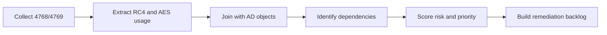

# Legacy Dependency Mapping and Technical Inventory

Goal: build an actionable RC4 dependency inventory that can drive remediation without breaking production.

## 1. Scope and Collection Rules

Before running scripts everywhere, lock the rules.

Minimum scope:

- All domain controllers in scope.
- SPN-bearing identities (service accounts).
- Critical machine accounts and service accounts.
- Trust relationships (TDO) for multi-domain or multi-forest environments.
- Non-Windows systems using Kerberos (if present).

Baseline rules:

- Use a representative observation window (not 15 minutes during low traffic).
- Correlate AD configuration with runtime telemetry.
- Do not change policy before dependencies are qualified.

## 2. Technical Data Sources to Correlate

Never trust a single source.

| Source | What it provides | Limitation |
| --- | --- | --- |
| Event 4768 | TGT and initial negotiation visibility | Limited value alone for service prioritization |
| Event 4769 | TGS visibility, therefore real service impact | High volume, requires filtering |
| `msDS-SupportedEncryptionTypes` | Account-level config intent | Can mislead without secret rotation context |
| Available keys (events/scripts) | Effective cryptographic capability | Depends on collection quality |
| Trust objects (TDO) | Cross-domain/cross-forest surface | Frequently missed in audits |

## 3. Recommended Inventory Pipeline

Practical sequence:

1. Collect 4769 over a representative window.
2. Isolate RC4 tickets and aggregate by target service (SPN/account).
3. Join with AD attributes (`msDS-SupportedEncryptionTypes`, account type, service criticality).
4. Verify whether AES keys are actually present for these identities.
5. Produce a prioritized dependency list with proposed actions.

## 4. Dependency Qualification Matrix

An unqualified dependency is a rollback risk.

| Criterion | Example values | Priority impact |
| --- | --- | --- |
| Service criticality | Critical, Important, Standard | Critical goes first |
| RC4 exposure | Frequent, Occasional, Rare | Frequent goes first |
| Remediation feasibility | Fast, Medium, Complex | Fast = quick win |
| Dependency type | SPN service, Trust, Legacy device | Trust and critical SPN prioritized |

Simple scoring model:

- Criticality: Critical=3, Important=2, Standard=1
- Exposure: Frequent=3, Occasional=2, Rare=1
- Feasibility: Fast=3, Medium=2, Complex=1
- Total score = sum (max 9)

Interpretation:

- 8-9: remediate immediately
- 6-7: remediate in next wave
- 3-5: schedule after quick wins

## 5. Concrete RC4 Dependency Examples

Example A - Legacy service account:

- Signal: recurring RC4 in 4769 for `MSSQLSvc/app01`.
- AD state: `msDS-SupportedEncryptionTypes=0x1C`.
- Runtime state: AES keys missing or stale.
- Inventory action: tag as "quick win after secret rotation and app validation".

Example B - Third-party device:

- Signal: RC4-only requests from a non-Windows device IP.
- Observation: no AES negotiation from client side.
- Inventory action: tag as "temporary exception" with vendor remediation track.

Example C - Trust path:

- Signal: persistent RC4 patterns in cross-domain traffic.
- Observation: trust hardening not complete.
- Inventory action: tag as "trust wave" with cross-domain validation prerequisites.

## 6. Expected Inventory Outputs

Minimum deliverables:

- A "dependency -> evidence -> criticality -> action" matrix.
- A quick-win list (high impact, low effort).
- A complex-case list with identified technical owner.
- A dated and justified temporary exception list.

Recommended backlog format:

| Dependency | Evidence | Risk | Action | Owner | Due date |
| --- | --- | --- | --- | --- | --- |
| `svc_sql_legacy` | Frequent RC4 in 4769 | High | Rotate secret + re-test | DB Team | W+1 |
| `device-biomed-01` | RC4-only advertisement | High | Temporary exception + vendor plan | Infra Team | W+2 |

## 7. Inventory Definition of Done

Inventory is "ready" only if:

- Top RC4 dependencies are identified and ranked.
- Each dependency has linked technical evidence.
- Each item has an owner and target action.
- Exceptions are explicit, bounded, and tracked.

Without these four conditions, remediation will start with hidden risk.

## Related Technical References Already in This Repository

- 060 - Active Directory/Hardening/RC4 Hardening/Weak supported encryption algorithms on DCs.md
- 060 - Active Directory/Hardening/RC4 Hardening/Audit and Enforcement of Kerberos Encryption Type/Audit and Enforcement of Kerberos Encryption Type.md
- 060 - Active Directory/Hardening/RC4 Hardening/Hardening Kerberos Encryption on AD Trusts/Hardening Kerberos Encryption on AD Trusts.md
- 020 - Microsoft Defender/Defender for Identity/Reporting/RC4 HMAC Report.md
