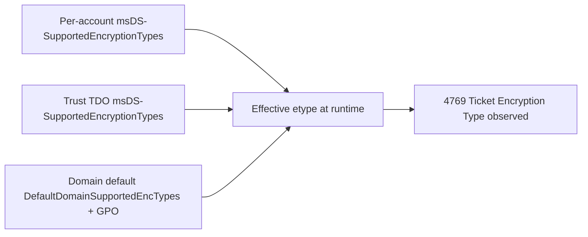
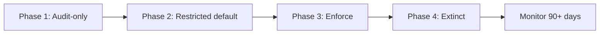

# Remediation, AES Migration, Cutover, and RC4 Extinction

> **Article 3 of 3 — RC4 Hardening series.** Read in order:
>
> 1. [RC4 Fundamentals, Obsolescence, and Risks of Continued Use](./1.%20RC4%20Fundamentals%2C%20Obsolescence%2C%20and%20Risks%20of%20Continued%20Use.md) — *why* RC4 is dangerous and what attackers actually do with it.
> 2. [Legacy Dependency Mapping and Technical Inventory](./2.%20Legacy%20Dependency%20Mapping%20and%20Technical%20Inventory.md) — *where* RC4 still lives in your estate.
> 3. **Remediation, AES migration, cutover, and RC4 extinction** *(this article)* — *how* to remove it without breaking production.
>
> This article is a **conceptual blueprint** for the cutover — levers, phases, gates, exception discipline, end-state definition. The technical runbooks (PowerShell, GPO paths, registry keys, `ktpass`, `Reset-KrbTgt-Password-For-RWDCs-And-RODCs.ps1`, etc.) live in dedicated annex articles in the same folder.

Goal: turn the inventory from the previous article into an actual cutover plan that ends with RC4 measurably extinct, without breaking production along the way.

## 0. What this article actually delivers 🏗️

The previous articles set the stage:

- **Article 1** explained *why* RC4 is dangerous and what attackers actually do with it.
- **Article 2** explained *how to find* every dependency that still uses it, ranked by risk and effort.

This one is the **construction site**. By the end, you should know exactly which switch to flip on which day, in which order, with which rollback path, and how to prove afterwards that RC4 is gone.

End state — what "RC4 extinct" looks like, measurably:

- Zero `4769` events with `TicketEncryptionType == 0x17` over a 14-day window (excluding declared exceptions).
- 100% of relevant accounts in `msDS-SupportedEncryptionTypes = 0x18` (AES128 + AES256).
- Trust objects (TDOs) in `0x18`, with trust passwords rotated since AES support was enabled.
- `krbtgt` key rotated within the last 90 days.
- Exception list is short, dated, owner-assigned, with a sunset plan.

Everything below is about getting from "inventory done" to that state.

## 1. The three levers you will actually operate 🎚️

Before tactics, the big picture. RC4 lives in three different layers of AD, and each has its own switch. You will touch all three before you can declare extinction.

| Lever | Where it lives | What it controls | Typical syntax |
| --- | --- | --- | --- |
| **Per-account capability** | `msDS-SupportedEncryptionTypes` on user / computer / `inetOrgPerson` objects | Which etypes a specific principal is allowed to use. Overrides default policy. | `Set-ADUser ... -Replace @{'msDS-SupportedEncryptionTypes'=24}` |
| **Domain / DC defaults** | `HKLM\SYSTEM\CurrentControlSet\Services\Kdc\Parameters\DefaultDomainSupportedEncTypes` + GPO `Network security: Configure encryption types allowed for Kerberos` | Default etype set when account-level value is absent or zero. Also drives client negotiation. | GPO MSS policy or direct registry. |
| **Trust capability** | `msDS-SupportedEncryptionTypes` on the TDO + trust password recency | Which etypes are allowed on cross-domain / cross-forest referral tickets. | `Set-ADTrust` + `netdom trust ... /resetOneSide` |

Two rules to keep in mind from now on:

1. **The most specific value wins.** Per-account beats trust beats domain default. If a service account has `0x1C`, no amount of domain-level AES policy will make it RC4-free.
2. **Capability ≠ key material.** An account can advertise AES (`0x18`) but have no usable AES key, because AD only derives AES keys at password set time. Old accounts that have never rotated since AES was supported are the classic trap from article 1.

Mental model for the cutover:

The plan in the rest of this article: fix the leaves first (per-account, per-trust), then the trunk (default policy), then enforce.

## 2. The Microsoft phased rollout (KB5021131, CVE-2022-37966, and Kdcsvc events) 📅

Microsoft does not flip RC4 off in one update. Like every recent Kerberos hardening (PAC signature, RC4 deprecation, Netlogon, etc.), it ships as a multi-phase rollout tied to a security CVE.

The most consequential change to date is **November 2022, KB5021131 / CVE-2022-37966**. That update changed two defaults that directly impact this article:

- The KDC now defaults TGT and service ticket **session keys** to AES whenever the client advertises AES support.
- Cross-domain / cross-forest **referral tickets** default to AES even when the trust object (TDO) has no `msDS-SupportedEncryptionTypes` value set. This eliminated what used to be a mandatory "enable AES on the trust" step in earlier RC4 hardening playbooks.

What did **not** change in November 2022: service ticket (TGS) **encryption** still depends on `msDS-SupportedEncryptionTypes` of the target account. A null or zero value still defaults to RC4. Hence the entire per-account remediation work in §3.

A later phase fully removes the RC4 path from the KDC. Always consult the current MSRC advisory and KB article for the exact phase you are currently in: dates and behavior shift as Microsoft observes telemetry across the install base.

The pattern is always the same:

| Phase | What the DC does | Your job during this phase |
| --- | --- | --- |
| **1. Compatibility / Audit-only** | Behavior unchanged. DC logs warnings when RC4 is used. | Collect warnings, complete the inventory, no breakage yet. |
| **2. Audit-default** | RC4 still allowed by default but new installs / new objects no longer default to RC4 capability. | Start remediation. Per-account `0x18` on quick wins. |
| **3. Enforced-by-default** | RC4 disabled unless explicitly allowed per-account or per-trust. | Final remediation wave. Exceptions become explicit `0x1C` per object. |
| **4. Hard removal** | RC4 path removed from the KDC. No override possible (or only via a temporary registry escape hatch). | Exceptions must be gone. Decommission or replace. |

### Reading where you are: Kdcsvc events

Modern Windows DCs emit dedicated KDC events when phase-related decisions happen — for RC4 hardening rollouts, expect events from the `Microsoft-Windows-Kerberos-Key-Distribution-Center` (Kdcsvc) provider in the DC's `System` log. The exact event IDs and meanings shift between rollout waves; always cross-check the KB article tied to the CVE you are deploying.

What to do with them:

- Pipe them into your SIEM next to `4768`/`4769` so phase telemetry sits alongside ticket telemetry.
- Build one dashboard per phase, so you can see which DCs have already rolled into which phase.
- Treat any event indicating "RC4 ticket issued under enforcement" as a real-time remediation cue, not a noisy log.

The actual SIEM queries live in the **DC phased rollout & telemetry** annex (to be created).

### Where the per-DC switches live (conceptually)

Two registry locations on every DC drive the local enforcement behavior:

- **KDC parameters** — controls the default etype set used when an account-level value is zero or absent. This is the trunk-level lever from §1. Change it via GPO, never directly outside a change window. Microsoft's recommended target value to disable RC4 at the domain level is `0x38` (note: this is *not* the same as the per-account `0x18` target — the DC-level value carries an additional bit beyond AES128 + AES256). Consult KB5021131 for the exact bit semantics before flipping it; this is also the most aggressive of the levers and rarely the right first move.
- **LSA Kerberos parameters** — controls the etypes a member machine itself supports for outgoing and incoming Kerberos requests. This is what the `Network security: Configure encryption types allowed for Kerberos` GPO writes.

A related registry value (`KrbtgtFullPacSignature`) controls the PAC signature hardening that often ships in the same KB train as RC4 rollouts. Different CVE family, same operational discipline: track its phase value alongside RC4.

The exact key paths, value names, REG_DWORD encodings, and the ticket-cache purge / KDC service restart sequence required to apply changes safely live in the **DC enforcement runbook** annex (to be created). Treat them as runbook content, not as part of the conceptual blueprint.

## 3. Remediation per dependency type 🔧

This is the per-pattern playbook. Match each row in your article-2 backlog to one of the patterns below. Each pattern names *what* to do and *why*; the actual command-level runbooks live in dedicated annex articles.

### 3.1 — Service account with `0x1C` and stale secret (the classic quick win)

Pattern: account advertises both AES and RC4, password is old, runtime emits RC4 because no AES key was ever derived (or because the application pins RC4 client-side).

Conceptual procedure:

1. **Pre-check the AD state** — confirm the current `msDS-SupportedEncryptionTypes`, `PasswordLastSet`, and the SPN list before touching anything.
2. **Tighten the capability** to AES-only (`msDS-SupportedEncryptionTypes = 0x18`).
3. **Rotate the secret** — non-negotiable. AD only derives AES keys at password set time; without rotation, the account stays in the stale-key trap regardless of capability. Hand the new password to the service owner through the secret-vault channel, never through tickets or chat.
4. **Validate from a client** — purge the ticket cache, force a new service ticket, and confirm the etype is AES on the issued ticket.
5. **Watch the SIEM for 24-48h** — confirm `4769` no longer shows `0x17` for the SPN before marking the row "remediated".

Common gotcha: if `4769` stays at `0x17` after rotation, the application itself is pinning an etype client-side (JDBC string, `krb5.conf`, IIS app pool identity, Java GSS settings). The fix is then in the application config, not in AD. See pattern 3.4.

Runbook: **Service account RC4-to-AES remediation** annex (to be created).

### 3.2 — Computer account with stale machine password

Pattern: a server's machine account hasn't rotated its password since AES was added. Rare on Windows (machine passwords rotate every 30 days by default), common on appliances or domain-joined VMs that paused their rotation, or on hosts where machine password change was disabled years ago and never revisited.

Conceptual procedure:

1. **Force machine password rotation** from the affected host against a writable DC.
2. **Tighten capability** to `0x18` if the account was at `0x1C`.
3. **Validate** — fresh service tickets requested by the host should now carry an AES etype.

Runbook: **Computer account stale-key remediation** annex (to be created).

### 3.3 — Trust legacy (TDO)

Pattern: cross-domain or cross-forest trust still emits RC4 referrals (`Service Name = krbtgt/<TARGET-REALM>` in 4769 telemetry).

> ℹ️ **What changed in November 2022 (KB5021131 / CVE-2022-37966).** Before that update, referral tickets were issued in RC4 by default unless AES was explicitly enabled on the TDO via the Active Directory Domains and Trusts GUI or `ksetup`. That step is **no longer required** on patched DCs: the KDC now defaults referral ticket encryption to AES whenever the trust password contains AES key material. If your DCs on both sides of the trust are at or above the November 2022 update, the trust will produce AES referrals without any TDO flag change — confirmed by Microsoft in the *Active Directory Hardening Series – Part 4* blog post.
>
> What still matters: the **trust password must contain AES keys**. Trusts whose password was set in the pre-AES era have only an RC4 key derived. Rotation is what fixes that, not the TDO bitmask.

This is the most coordinated procedure because **trust passwords have two ends** and both must agree. A unilateral change breaks the trust.

Conceptual procedure:

1. **Pre-check both sides** — patch level (must be at or above November 2022 update on both forests' DCs), current TDO `msDS-SupportedEncryptionTypes`, last password change (`whenChanged` on the TDO), trust direction.
2. **Decide whether the TDO bitmask still needs touching.** On modern patched DCs, the answer is usually no: AES is the default for referrals. On older estates, set the AES bits explicitly on the TDO on both sides.
3. **Rotate the trust password** with a strong shared secret, synchronized across both sides. This is the step that actually removes RC4 from the referral path on legacy estates and refreshes AES key material on modern ones. Mismatched secrets break the trust.
4. **Validate** — initiate cross-realm authentication and confirm the resulting `4769` carries an AES etype (`0x12` for AES256). If `0x17` persists, the rotation didn't propagate on one side, or one side is still pre-November-2022.

Runbook: existing **[Hardening Kerberos Encryption on AD Trusts](../Hardening%20Kerberos%20Encryption%20on%20AD%20Trusts/Hardening%20Kerberos%20Encryption%20on%20AD%20Trusts.md)** annex.

### 3.4 — Vendor appliance / non-Windows Kerberos client

Pattern: a non-Windows Kerberos client (Linux server, biomedical or OT appliance, network gear, Java app) is advertising RC4-only, often because its client-side Kerberos config was pinned years ago and never revisited.

Two paths exist depending on whether the client side can be modified.

**Path A — client-side fix is possible.**

Conceptual procedure:

1. **Update the client Kerberos config** to remove RC4 from the allowed etype lists. The exact location depends on the stack:
   - MIT / Heimdal Kerberos: `krb5.conf` etype directives.
   - Java: JVM Kerberos system properties or the `krb5.conf` honored by the JVM's GSS implementation.
   - Other vendor stacks: check the vendor's Kerberos configuration documentation.
2. **Regenerate the keytab with AES keys** if the client uses one. Old keytabs generated against an RC4-only password contain only RC4 keys; the keytab must be re-issued after AES key derivation on the AD side.
3. **Validate** — the client should now obtain AES-encrypted tickets. Confirm via the client's native Kerberos tooling and via DC-side `4769` telemetry.

**Path B — vendor cannot support AES** (the real-world case for many appliances).

This is an exception case, handled via §7 exception management:

- Document as **temporary exception** (template in §7).
- Per-account `msDS-SupportedEncryptionTypes = 0x1C` to keep RC4 available *only* for this principal, while the global policy goes AES-only.
- Open a vendor track, get a written EOL or AES-support roadmap, set an exception sunset date.
- Apply network containment so a recovered RC4 service password has minimal blast radius.
- Layer the §4 compensating controls (FAST, MDI detection) over the residual surface.

Runbook: **Non-Windows Kerberos client AES migration** annex (to be created), with sub-procedures per stack (MIT/Heimdal, Java GSS, common appliance vendors).

### 3.5 — `krbtgt` itself (the most delicate)

Pattern: even if every other account is AES, the TGT itself is sealed with `K_krbtgt`. If the `krbtgt` password is years old, an RC4 TGT path can still exist, and Golden Ticket resilience suffers regardless of how clean the rest of the estate looks.

> ℹ️ **Two facts that change how aggressively you need to act.**
>
> - With **DFL ≥ 2008** and a `krbtgt` password that has been reset at least once since the domain started supporting AES (2008R2 era), the KDC issues TGTs encrypted with AES regardless of `msDS-SupportedEncryptionTypes` on the `krbtgt` account. Microsoft is explicit: do **not** set `msDS-SupportedEncryptionTypes` on `krbtgt`. The combination of DFL + AES key in password history is what drives the behavior.
> - The fast detection signal for a stale `krbtgt`: compare `pwdLastSet` on the `krbtgt` account to the `whenCreated` of the built-in domain group **`Read-only Domain Controllers`**. The RODC group is created when the first DC at functional level 2008 is promoted — i.e. when AES support became available. A `pwdLastSet` older than that means the current `krbtgt` password may still be a pre-AES password with no AES key derived.

Conceptual procedure:

1. **Use the recommended Microsoft krbtgt rotation script** — do not roll your own. Custom rotation logic has historically broken replication and locked admins out of their own domain. Microsoft references the community-maintained `Reset-KrbTgt-Password-For-RWDCs-And-RODCs.ps1` from `zjorz/Public-AD-Scripts` (Jorge de Almeida Pinto, MS MVP) in the *Decrypting the Selection of Supported Kerberos Encryption Types* guidance.
2. **Two consecutive resets** with replication validation between them, separated by at least the TGT lifetime (default 10 hours). The minimum gap between resets is there so existing TGTs naturally expire without breaking ongoing sessions, and so an AES key lands in the password history attribute.
3. **Operational rules** — never during an unmonitored window, never during month-end critical processing, never with a single DC online, never without recent backups verified.
4. **Validate** — after both resets, every DC must report a fresh `whenChanged` on the `krbtgt` account, and `4769` traffic must remain stable.

Cadence after migration: rotate `krbtgt` at least every 90 days. Some hardened estates run a 30-day cadence as part of their standing operational calendar.

Runbook: **`krbtgt` rotation runbook** annex (to be created), wrapping the recommended script with the validation, replication, and rollback steps required to run it safely.

## 4. When remediation is not possible: compensating controls 🛡️

Some dependencies cannot be remediated within the cutover window — vendor appliances on contract, frozen legacy apps, M&A-acquired domains, OT or biomedical systems with rigid certification cycles. The discipline here is that **"we still have RC4 somewhere" must not mean "we are exposed"**. Three Microsoft-native control families reduce the residual attack surface while exceptions remain on the books.

These are mitigations, not substitutes. They do not remove RC4 from the estate. They make the residual RC4 less attractive to attackers and easier to detect. The most resilient estates run all three permanently, even after RC4 extinction, because they also defend against the next legacy etype that gets deprecated.

### 4.1 — FAST / Kerberos armoring (RFC 6113)

FAST wraps the AS exchange (AS-REQ + AS-REP) inside an encrypted tunnel keyed from the client machine's TGT. The pre-auth blob and the AS-REP `enc-part` are no longer directly observable on the wire — the offline-cracking primitive behind AS-REP roasting and pre-auth offline cracking is removed, even when the targeted account remains RC4-capable.

Conceptual fit:

- **Mitigates**: AS-REP roasting, pre-auth offline cracking on user accounts.
- **Does not mitigate**: Kerberoasting. The TGS-REP service ticket blob is sealed with `K_svc` and is outside the FAST tunnel. Service-account password length and AES enforcement remain the right defenses for that vector.
- **Prerequisites**: minimum domain functional level, modern client stacks. Legacy MIT/Heimdal clients may not support FAST, so enforcement mode can break those flows.
- **Implementation**: KDC-side and client-side policy. See the dedicated FAST armoring annex (to be created) for the runbook.

### 4.2 — PKINIT / smartcard / gMSA

This family replaces password-derived long-term keys with credential material that cannot be brute-forced from a candidate password list:

- **PKINIT / smartcard logon** — the AS exchange uses a Diffie-Hellman key authenticated by the client's certificate, not a key derived from a password. AS-REP roasting and pre-auth offline cracking become structurally impossible on those accounts, regardless of RC4 capability. Natural baseline for Tier 0 administrators.
- **gMSA (group Managed Service Accounts)** — not PKINIT, but solves the same offline-cracking problem on the service side: the password is a 240-byte random value rotated automatically by AD. Even with RC4 enabled on the account, brute-forcing a 240-byte random secret is computationally infeasible.

Conceptual fit:

- **Mitigates**: AS-REP roasting on user accounts; Kerberoasting on gMSA-protected services.
- **Does not mitigate**: service tickets issued to non-gMSA service accounts, or downstream services still RC4-capable. Protects the identity, not the path.
- **Prerequisites**: functional PKI / AD CS for smartcard; gMSA migration feasibility for service accounts. AD CS misconfigurations (ESC-class) introduce their own attack surface and must be assessed first.
- **Implementation**: PKI enrollment for smartcard, password retrieval pattern change for gMSA. See the dedicated PKINIT and gMSA migration annexes (to be created).

### 4.3 — Defender for Identity

MDI sensors deployed on domain controllers analyze Kerberos traffic in real time and surface RC4 usage patterns and Kerberoasting-style behavior (high-volume TGS-REQ from a single principal targeting many SPNs in a short window).

Conceptual fit:

- **Detective only** — cannot block AS-REQ or TGS-REQ in real time.
- **Cannot detect offline cracking** (step 4 of the article-1 walkthrough); nothing can, because it happens off the network.
- **Compresses the detection window** for ticket-request anomalies from "discovered post-incident" to "alerted in minutes". That is the entire value.
- **Doubles as a complementary inventory source** for article 2: the *Weak cipher usage* report shows RC4 ticket trends per identity over time.

### Stack the three together

| Control | Mitigates | Limits | Layer |
| --- | --- | --- | --- |
| **FAST armoring** | AS-REP roasting, pre-auth offline cracking | Does not protect TGS / Kerberoasting; requires modern clients | Protocol |
| **PKINIT / smartcard / gMSA** | AS-REP roasting on users; Kerberoasting on gMSA-protected services | Identity-level, not path-level | Identity |
| **Defender for Identity** | Detection of Kerberoasting & AS-REP roasting in flight | Detective only, no prevention | Telemetry |

These layers are complementary, not alternatives. FAST eliminates a broad class of offline-cracking, PKINIT/gMSA removes the password-derived target altogether for selected identities, and MDI catches what slips through both. None of this replaces the cutover work in the rest of this article — it is what keeps the residual surface manageable while the cutover progresses and what hardens the estate against the next deprecated etype.

## 5. The cutover (phase by phase) 🚦

You don't flip RC4 off in one change window. You walk through phases, each gated by measurable telemetry.

### Phase 1 — Audit-only

- Action: nothing changes in production behavior. Enable all auditing and SIEM dashboards from articles 1 and 2.
- Exit criteria: complete inventory (the §0 backlog from article 2), every row has an owner, telemetry baseline stable for at least 14 days.

### Phase 2 — Restricted default

- Action: tighten `DefaultDomainSupportedEncTypes` to `0x18` (AES128 + AES256) via GPO on DCs. Accounts that have `msDS-SupportedEncryptionTypes` set explicitly are unaffected; accounts with zero/absent value fall back to the new default.
- Per-account remediation continues in parallel: §3.1 / §3.2 for every quick win.
- Exit criteria: RC4 ticket count in 4769 dropped by ≥ 80% week-over-week. Every remaining RC4 source is identified and has an action plan.

### Phase 3 — Enforce

- Action: deploy GPO `Network security: Configure encryption types allowed for Kerberos = AES128 + AES256` on all DCs and on all member servers within scope. Per-account `0x1C` becomes the explicit marker of a declared exception, nothing else.
- Trust rotations (§3.3) and `krbtgt` rotation (§3.5) happen in this phase.
- Exit criteria: ≤ 5 RC4 sources remain, all on the documented exception list with a sunset date.

### Phase 4 — Extinct

- Action: per-account exceptions sunset one by one. Each removal validated by 4769 telemetry over 7 days.
- Exit criteria: zero `4769` with `TicketEncryptionType == 0x17` over 14 days (excluding still-declared exceptions). All four §0 metrics green.

### Monitor (post-extinction)

- Permanent SIEM rule: any new RC4 ticket = high-severity alert. Drift detection.
- Permanent control: quarterly review of `msDS-SupportedEncryptionTypes != 0x18` across all relevant principals.

### Gate criteria summary

| Phase exit | Quantitative criterion | Qualitative criterion |
| --- | --- | --- |
| 1 → 2 | Telemetry baseline ≥ 14 d, inventory 100% owned | Every row in backlog has action + owner |
| 2 → 3 | RC4 in 4769 dropped ≥ 80% WoW | Every remaining source identified |
| 3 → 4 | ≤ 5 RC4 sources, all on exception list | Sunset dates ≤ 6 months |
| 4 → Monitor | 0 RC4 in 4769 over 14 d (excl. exceptions) | All §0 metrics green |

## 6. Rollback procedure 🔄

Hope nobody needs it. Have it ready anyway.

### When to rollback

Pre-defined triggers (decide *before* the change, not during the incident):

- Kerberos error rate (`4768`/`4769` failure ratio) exceeds 5× baseline for more than 10 minutes.
- More than one business-critical application reports authentication failure.
- Cross-forest trust authentication fails for any production-priority partner.

Anything less = forward-fix. Anything more = rollback.

### How to rollback (conceptually)

For a GPO-driven change, the rollback sequence is:

1. **Disable the GPO link** at the OU where the change was applied — do not delete the GPO itself, preserve the audit trail.
2. **Force replication and policy refresh** on every DC so the previous behavior takes effect quickly.
3. **Purge the KDC ticket cache** on the DCs that were issuing failing tickets, so subsequent ticket requests rebuild from the rolled-back policy.
4. **Validate** — affected applications retry within their normal Kerberos cache lifetime (max 10 hours, often seconds with retry logic). If still failing after the cache lifetime, the issue is downstream (app config, network), not the GPO.

For a per-account change, the rollback is to revert `msDS-SupportedEncryptionTypes` back to its pre-change value (typically `0x1C`) as a temporary safety net while the root cause is investigated.

The exact commands (GPO link disablement, DC ticket cache purge, per-account revert) live in the **Cutover & rollback runbook** annex (to be created).

### How to avoid having to rollback

- **Canary DCs** — apply the change to one DC first. Watch for 24h before propagating to the rest of the fleet.
- **Pilot app** — pick one non-critical application and have its owner validate AES-only end-to-end before the change window.
- **Synthetic transaction** — script a Kerberos service ticket request at a fixed interval from a monitoring host. Alert on the first failure.

## 7. Exception management 📋

Some dependencies cannot be fixed inside the cutover. They must be exceptions, not omissions.

Template — every exception must have all these fields, in your CMDB or wiki:

| Field | Example |
| --- | --- |
| **Principal** | `printsrv-bio-01$` |
| **Owner (named)** | Jane Doe, Biomedical Infrastructure |
| **Why AES is impossible** | Vendor firmware v3.2 supports only RC4-HMAC. Ticket #INC0042 open with vendor. |
| **Technical override** | `msDS-SupportedEncryptionTypes = 0x1C` (per-account, not domain default) |
| **Compensating controls** | Network segment isolated; account permissions restricted to printer-only SPN |
| **Sunset date (max +6 months)** | 2026-11-30 |
| **Exit plan** | Vendor firmware v4.0 (AES support, ETA Q3) OR appliance decommission (replacement RFP in flight) |
| **Review cadence** | Quarterly, next: 2026-08-01 |

Why this matters:

- An undated exception becomes permanent. Then it becomes invisible. Then it becomes the next pentest finding.
- A dated exception with a named owner forces a quarterly decision: extend or sunset.

Quarterly exception review checklist:

- Is the technical reason still valid (vendor patched? appliance still in use?).
- Has the sunset date been respected or formally extended (with new owner sign-off)?
- Is the compensating control still in place?
- Has the exception been re-tested (try AES, see if it actually still fails)?

## 8. "Extinct" — measurable definition of done ✅

Five criteria, all must be green simultaneously over a 14-day window before declaring RC4 extinct:

| Metric | Target | Source |
| --- | --- | --- |
| 4769 with `TicketEncryptionType == 0x17` | 0 (excluding declared exceptions) | SIEM / Defender / Sentinel |
| Accounts with `msDS-SupportedEncryptionTypes` allowing RC4 (bit `0x04`) | Equal to exception list count, no surprises | AD attribute scan |
| Trust objects with RC4 capability | 0 | TDO scan |
| `krbtgt` password age | ≤ 90 days | AD attribute scan |
| Phase-related Kdcsvc events indicating RC4 fallback | 0 | DC System log → SIEM |

The verification queries that produce these numbers (LDAP bitwise scan of `msDS-SupportedEncryptionTypes`, TDO enumeration, `krbtgt` password age, residual RC4 KQL over 14 days, Kdcsvc event count) live in the **RC4 telemetry & inventory reporting** annex (to be created). Each metric maps to one query — when every output is empty (or matches the documented exception list exactly), RC4 is extinct.

## 9. After extinction — what comes next 🔭

Extinction is not the finish line. It is the starting line for ongoing hygiene.

- **Drift detection** — permanent SIEM rule on `4769` with `0x17`. First hit = ticket on the identity team.
- **Account onboarding policy** — any new service account, computer account, or trust must be created with `msDS-SupportedEncryptionTypes = 0x18` from day one. Bake it into your provisioning tooling.
- **`krbtgt` cadence** — keep the 90-day (or 30-day) rotation in your operational calendar.
- **Quarterly exception review** — even if the list is empty, run the review. It catches the silent re-introduction.
- **Annual posture audit** — re-run the article-2 inventory once a year on the whole domain. RC4 has a way of coming back through migrations, M&A, and shadow IT.

This connects naturally to the next article in the series, focused on post-extinction monitoring and drift detection.

## Related Technical References Already in This Repository

- [Article 1 — RC4 Fundamentals, Obsolescence, and Risks of Continued Use](./1.%20RC4%20Fundamentals%2C%20Obsolescence%2C%20and%20Risks%20of%20Continued%20Use.md)
- [Article 2 — Legacy Dependency Mapping and Technical Inventory](./2.%20Legacy%20Dependency%20Mapping%20and%20Technical%20Inventory.md)
- [Weak supported encryption algorithms on DCs](../Weak%20supported%20encryption%20algorithms%20on%20DCs.md)
- [`Kerberos Encryption Audit/Invoke-KerberosEncryptionAudit.ps1`](./Kerberos%20Encryption%20Audit/Invoke-KerberosEncryptionAudit.ps1) — the inventory-phase audit script (documented in Article 2 §6 and in [`Invoke-KerberosEncryptionAudit.md`](./Kerberos%20Encryption%20Audit/Invoke-KerberosEncryptionAudit.md)).
- [Hardening Kerberos Encryption on AD Trusts](../Hardening%20Kerberos%20Encryption%20on%20AD%20Trusts/Hardening%20Kerberos%20Encryption%20on%20AD%20Trusts.md)
- [RC4 HMAC Report (Defender for Identity)](../../../020%20-%20Microsoft%20Defender/Defender%20for%20Identity/Reporting/RC4%20HMAC%20Report.md)

External references (always consult the live versions):

- Microsoft Tech Community — *Decrypting the Selection of Supported Kerberos Encryption Types* (Jerry Devore, MSFT). Foundation reference for Kerberos etype selection logic, the `msDS-SupportedEncryptionTypes` decoder ring, and the Do's & Don'ts of RC4 disablement.
- Microsoft Tech Community — *Active Directory Hardening Series – Part 4 – Enforcing AES for Kerberos* (Jerry Devore, MSFT). Documents the November 2022 referral ticket / session key default change and the January 2025 cumulative update audit field enhancements (`MSDS-SupportedEncryptionTypes`, `Available Keys`, `Advertized Etypes`, `Pre-Authentication EncryptionType`, `Session Encryption Type`).
- Microsoft Support — **KB5021131**: *How to manage the Kerberos protocol changes related to CVE-2022-37966*. Authoritative source for the November 2022 behavior change and `DefaultDomainSupportedEncTypes` semantics.
- Microsoft Learn — *Kerberos encryption types supported by AD*.
- GitHub — `zjorz/Public-AD-Scripts/Reset-KrbTgt-Password-For-RWDCs-And-RODCs.ps1` (community-maintained krbtgt rotation script referenced by Microsoft guidance).
- MSRC — always consult the current advisory and KB article train for any **post-2022 RC4-related CVE** under active rollout when planning the enforcement phase.

## Glossary (cutover-specific terms) 📖

| Term | One-line meaning |
| --- | --- |
| **Per-account capability** | The `msDS-SupportedEncryptionTypes` value set directly on a user / computer / TDO. Most specific level, overrides defaults. |
| **`DefaultDomainSupportedEncTypes`** | Registry value on each DC that sets the fallback etype bitmask when an account-level value is zero or absent. |
| **Stale key trap** | An account advertising AES capability but having no AES key material, because the password was set before AES support and was never rotated. |
| **Audit phase** | Microsoft rollout phase where behavior is unchanged but events log RC4 usage. Inventory phase, not breakage phase. |
| **Enforce phase** | Phase where the DC actively refuses RC4 unless explicit per-account/per-trust override exists. |
| **Hard removal** | Final Microsoft phase where the RC4 code path is removed; no override possible. |
| **Kdcsvc events** | Events emitted by the `Microsoft-Windows-Kerberos-Key-Distribution-Center` provider on DCs, indicating phase-related decisions during crypto hardening rollouts. |
| **`KrbtgtFullPacSignature`** | Registry control for the PAC signature hardening rollout. Often deployed alongside RC4 rollouts in the same KB train. Different CVE family, same operational discipline. |
| **`ktpass`** | Built-in Windows tool to generate Kerberos keytab files (typically for non-Windows clients) with a chosen etype. `-crypto AES256-SHA1` is the modern target. |
| **Keytab** | File containing one or more Kerberos principal keys, used by non-Windows clients to authenticate without typing a password. Must be regenerated when the underlying password changes. |
| **`krb5.conf`** | MIT / Heimdal Kerberos client configuration file. Pinning `rc4-hmac` in `default_tkt_enctypes` is the most common cause of RC4 persistence on Linux/Unix clients. |
| **Trust password rotation** | Resetting the shared secret of a TDO on both sides of a trust simultaneously. Required for AES trust keys to be derived. |
| **Canary DC** | One DC where a Kerberos hardening change is applied first, monitored for impact, before rolling to the rest of the fleet. |
| **Synthetic Kerberos transaction** | Scripted ticket request issued at a fixed interval from a monitoring host, to detect Kerberos failures before users do. |
| **Exception sunset** | The expiration date attached to a declared RC4 exception, forcing a re-decision instead of letting the exception become permanent by default. |
| **Drift** | Re-introduction of RC4 capability after extinction (new service account, vendor change, M&A). Caught by post-extinction monitoring rules. |
